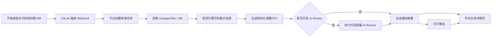

# 项目接入使用手册

本文面向准备把业务仓库接入 AI 变更提醒与代码质量审查平台的项目负责人、开发负责人和发布负责人。教程按一次真实接入的顺序展开：先确认接入信息，再在 GitLab 中配置 Webhook，随后在平台中确认项目和审查模板，最后接入钉钉完成提醒闭环。

当前平台主链路如下：



## 一、接入前准备

### 1. 获取平台访问地址

接入前先向平台管理员确认平台访问地址，例如：

```text
https://review.example.com
```

后续 GitLab Webhook URL 和钉钉消息里的“查看平台详情”都会基于这个地址生成。你只需要确认自己能在浏览器中打开平台首页，并能进入“任务”和“设置”页面。

[待补充截图：平台首页或任务列表页]

### 2. 确认 GitLab 项目信息

你需要准备以下信息：

```text
GitLab 项目地址
GitLab 项目 ID
默认目标分支，例如 main 或 master
项目类型，例如后端、前端或通用项目
```

第一次收到该 GitLab 项目的 Webhook 后，平台会自动创建项目记录。接入人不强制提前在平台里手工建项目；如果希望首次 Webhook 就进入正确项目组和端类型，建议先在设置页预创建 GitLab 项目。

### 3. 准备钉钉接收群

选择一个用于接收提醒的钉钉群，通常可以是：

```text
项目研发群
发布值班群
质量保障群
```

后续在该群中创建自定义机器人，并把机器人 Webhook 提供给平台管理员或在平台配置页中填写。

## 二、配置 GitLab Webhook

### 1. 打开项目 Webhook 设置

进入需要接入的 GitLab 项目：

```text
GitLab 项目 -> Settings -> Webhooks
```

填写 Webhook URL：

```text
https://review.example.com/api/webhooks/gitlab/merge-request
```

说明：当前平台的 MR Hook 和 Push Hook 共用同一个入口，后端会根据 `X-Gitlab-Event` 和 payload 中的 `object_kind` 自动分流。

[待补充截图：GitLab Webhook URL 填写位置]

### 2. 选择触发事件

建议先开启：

```text
Merge request events
```

如果希望在 Push 阶段也提前生成提醒，可同时开启：

```text
Push events
```

MR 事件适合在合并请求阶段给 Reviewer、测试和发布负责人提供结构化提醒；Push 事件适合更早暴露 DB、MQ、缓存和配置等高价值变更。

### 3. 保持 Secret Token 为空

当前接入不需要配置 Secret Token。GitLab Webhook 页面中的 Secret Token 输入框保持为空即可。

### 4. 保存并测试

保存 Webhook 后，可以点击 GitLab 的 Test 按钮发送测试事件。更推荐用一次真实 MR 验证，因为 GitLab 的测试 payload 可能不包含真实 diff，无法完整覆盖平台后续的变更分析链路。

建议验证方式如下：

```text
1. 从 main 拉出 feature/risk-review-demo 分支。
2. 修改一个容易命中规则的文件，例如 migration SQL、Mapper XML、application.yml、Redis key 或 MQ consumer。
3. 提交并 push 分支。
4. 创建 Merge Request。
5. 回到平台前端查看是否出现新的审查任务。
6. 查看钉钉群是否收到“变更提醒”消息。
```

[待补充截图：GitLab Webhook 保存后的测试按钮和最近请求状态]

## 三、平台中的项目设置

### 1. 项目如何创建

当前平台不要求提前手工创建项目。第一次收到某个 GitLab 项目的 MR 或 Push Webhook 后，平台会按 GitLab `project.id` 自动创建或更新项目记录，并默认绑定：

```text
规则模板：backend-default
AI Review Profile：backend-default-ai-review
项目状态：ENABLED
```

可以通过前端顶部导航进入“设置 -> 项目组 / 端类型配置”查看和维护项目。项目记录中的 `gitProjectId` 应与 GitLab 项目 ID 一致，后续同一个 GitLab 项目的 Webhook 会复用这条项目记录。

[待补充截图：设置页中的项目组 / 端类型配置区域]

如果希望在 webhook 第一次进入前就配置项目组和端类型，可以进入“设置 -> 项目组 / 端类型配置 -> 预创建 GitLab 项目”，提前填写：

```text
项目名称
GitLab 项目 ID
所属项目组
端类型
仓库地址，可选
```

后续 GitLab webhook 到达时，只要 payload 中的 `project.id` 与预创建记录的 `gitProjectId` 一致，平台会复用这条项目记录，并沿用你提前配置好的端类型、路径匹配和 AI Review Profile。

[待补充截图：预创建 GitLab 项目区域]

### 2. 配置项目组

项目组用于把多个 GitLab 项目按业务线、团队或产品域归类，方便任务列表筛选和设置页管理。它不是权限体系，也不会在第一阶段自动继承模板、钉钉 webhook 或 Provider 配置。

在前端“设置 -> 项目组 / 端类型配置”中可以：

```text
新增项目组，例如“移动业务组”
编辑项目组名称、编码、描述和默认 Provider
停用非默认项目组
把已有项目绑定到指定项目组
按项目组筛选项目后再维护端类型配置
```

默认项目组由系统维护，不能停用。第一次从 GitLab webhook 自动创建的项目，如果没有人工绑定，会自动归入默认项目组。

钉钉机器人按项目所属项目组隔离。默认项目组只是项目组之一，只服务归属默认项目组的项目；其它项目组没有配置机器人时，通知会记录为跳过，不会回退发送到默认项目组。

[待补充截图：项目组管理和项目绑定区域]

### 3. 检查端类型自动识别

PC、iOS、Android 或跨端项目首次接入时，平台会根据本次 webhook / GitLab diff 中的 changed files，以及 GitLab 项目名或 namespace，自动推断端类型。进入“设置 -> 项目组 / 端类型配置”，选择项目后，可以在“端类型自动识别”区域看到命中的规则和文件路径。

常见识别规则：

```text
ios/**、**/*.swift、Podfile -> iOS
android/**、**/*.kt、build.gradle、settings.gradle -> Android
frontend/**、web/**、src/**/*.tsx、src/**/*.jsx、package.json -> PC Web / H5
flutter/**、**/*.dart、pubspec.yaml、rn/**、miniapp/** -> 跨端应用
src/main/java/**、src/main/resources/**、pom.xml、backend-python/** -> 后端
```

如果新项目只命中一个端类型，平台会自动创建一套端类型配置，并把路径匹配设置为：

```text
**/*
```

这适合“单端单仓库”，例如一个纯 iOS 仓库后续不管改 `AppDelegate.swift`、资源文件还是配置文件，都继续按 iOS Profile 审查。混合仓库会保留各端默认路径规则作为后续拆分审查基础。已有项目如果已经人工配置过端类型，平台只更新识别依据，不会覆盖现有配置；此时可以参考识别依据，手动保存“当前项目所属端类型”。

[待补充截图：端类型自动识别依据]

### 4. 选择默认规则模板

规则模板决定平台重点识别和提醒哪些变更类型。内置模板包括：

```text
backend-default：后端项目，重点关注接口、DB、缓存、MQ、配置。
frontend-default：前端项目，适合前端仓库接入。
general-default：通用项目，适合暂未细分技术栈的仓库。
```

当前规则模板随端类型自动选择：后端项目通常使用 `backend-default`，PC / APP 端默认使用 `frontend-default`，暂不确定类型时可以先使用 `general-default`。在“设置 -> 项目组 / 端类型配置”中选择项目组、项目和端类型后，可以维护该端类型的 AI Review Profile、Provider 覆盖、路径匹配、提醒卡片展示和启用状态。

钉钉推送会按模板中的 `focusChangeTypes` 过滤提醒来源。也就是说，平台可以在完整落库的同时，只把 DB、MQ、缓存、配置等更值得关注的变更推送到群里，减少低价值噪音。

[待补充截图：端类型配置区域]

### 5. 配置代码质量 AI Review

代码质量 AI Review 是规则提醒之外的增强能力。初次接入时可以先关闭，只跑通规则提醒和钉钉推送；待团队确认提醒卡片准确后，再开启 AI Review。

如果需要开启，进入前端“设置”页，重点确认：

```text
代码质量 AI Review 全局能力是否开启
项目端类型是否绑定合适的 AI Review Profile
Provider 是否启用并配置了 API Key、端点 URL 和模型名称
Provider 的 Review 超时秒数是否满足大 diff 或慢模型场景
Review Instructions 是否符合当前端类型
如果接入 Push Hook，Push 审核策略是否允许该分支进入 AI Review
```

如果只想使用规则提醒，不启用 AI Review，也可以保持关闭。此时 GitLab -> 规则提醒 -> 钉钉推送链路仍然完整可用。

[待补充截图：AI Review 全局设置、Profile 和 Provider 配置区域]

### 6. 配置全局钉钉推送开关

前端“设置 -> 全局设置”提供全局钉钉推送开关。关闭后，平台仍会接收 Webhook、执行审查、保存任务和结果，但不会实际发送钉钉消息。

这个开关适合在联调、压测或临时维护期间降低群消息干扰。

[待补充截图：全局钉钉推送开关]

## 四、钉钉推送效果

平台会向同一个钉钉机器人推送两类消息。

第一类是“变更提醒”。它来自规则引擎，重点展示：

```text
项目 / MR / 分支信息
作者信息
整体提醒等级
DB、MQ、Redis/缓存、配置等重点提醒
查看平台详情链接
```

第二类是“代码质量 Review”。它来自 AI Review，通常包含：

```text
provider 和执行状态
整体等级
问题数量
摘要
最多 5 条主要 finding
查看平台详情链接
```

如果本次任务触发了 AI Review，平台会优先等待 AI Review 结果，再发送合并后的审查摘要；如果未触发 AI Review，则会直接发送规则提醒。

## 五、端到端验证步骤

完成配置后，按下面步骤做一次完整验收。这里以用户真实操作为准，不要求使用命令行或接口工具。

### 1. 创建一次测试变更

建议提交一个能稳定命中规则的变更，例如：

```sql
alter table orders add column risk_level varchar(32);
```

或修改：

```text
src/main/resources/application.yml
src/main/resources/mapper/OrderMapper.xml
Redis key 常量
MQ topic / consumerGroup 配置
```

### 2. 创建或更新 MR

在 GitLab 中创建 MR 后，平台应收到 Webhook 并生成任务。打开平台前端，进入“任务”，确认能看到一条新任务。任务详情页应能看到：

```text
提醒卡片
分析结果
原始事件摘要
代码质量 Review 结果和执行过程，若已开启 AI Review
```

[待补充截图：任务列表中的新任务]

[待补充截图：任务详情页中的提醒卡片和分析结果]

### 3. 验证钉钉消息

钉钉群中应收到“变更提醒”或“代码质量 Review”消息。点击“查看平台详情”后，应打开对应的任务详情页，例如：

```text
https://review.example.com/?taskId=47
```

如果链接打开后不是目标任务，或打开的是错误地址，把钉钉消息截图和目标任务编号反馈给平台管理员处理。

[待补充截图：钉钉群中的变更提醒消息]

## 六、常见问题排查

### 1. GitLab 已触发，但平台没有任务

优先检查：

```text
Webhook URL 是否是 /api/webhooks/gitlab/merge-request
GitLab 服务器是否能访问平台外部地址
GitLab Webhook 最近一次请求的响应码和响应体
GitLab 项目是否真的触发了 Merge request events 或 Push events
```

### 2. 任务失败并提示 diff 为空

优先检查：

```text
MR 是否包含真实代码变更
Webhook 是否来自正确的 GitLab 项目
平台项目记录中的 GitLab 项目 ID 是否正确
平台管理员是否已完成 GitLab diff 拉取授权
```

如果 GitLab Webhook 本身不带完整 diff，平台需要通过 GitLab 授权补拉变更内容。这类问题通常需要平台管理员协助确认。

### 3. 审查成功但钉钉没有消息

优先检查：

```text
前端“设置 -> 全局设置”中的全局钉钉推送开关是否打开
钉钉群机器人是否已创建并启用
机器人安全设置是否拦截，例如关键词或 IP 白名单
任务详情页中通知状态是否显示成功、跳过或失败
```

如果通知状态为跳过，通常是机器人未配置或全局开关关闭。如果状态为失败，把失败原因反馈给平台管理员处理。

### 4. 钉钉链接打开的是 localhost

这是平台外部访问地址配置问题。把钉钉消息截图反馈给平台管理员，管理员修正后重新触发一次审查任务即可。

### 5. AI Review 没有自动触发

优先检查：

```text
代码质量 AI Review 全局能力是否开启
项目端类型是否绑定了正确的 AI Review Profile
Provider 是否启用并配置了 API Key、端点 URL 和模型名称
Review Instructions 是否符合当前端类型
如果是 Push Hook，Push 审核策略是否允许该分支进入 AI Review
任务详情页中是否出现代码质量 Review 进度
```

如果只是想先跑通 GitLab 和钉钉主链路，可以暂时关闭 AI Review，等规则提醒稳定后再打开。

## 七、推荐接入节奏

建议按下面顺序推进，避免一次性打开太多变量：

```text
第 1 步：只接 GitLab MR Webhook，确认平台能收到任务。
第 2 步：用真实 MR 确认平台能识别到 changed files / diff。
第 3 步：绑定合适的项目组和端类型配置，确认提醒卡片准确。
第 4 步：配置钉钉机器人，确认消息和详情链接可用。
第 5 步：按项目需要开启 Push Hook。
第 6 步：最后开启 AI Review，并调试 Provider、Review Instructions 和 Push 审核策略。
```

这样可以先得到稳定的“Webhook -> 变更分析 -> 提醒卡片 -> 钉钉触达”基础闭环，再逐步引入更深的 AI 质量审查能力。
