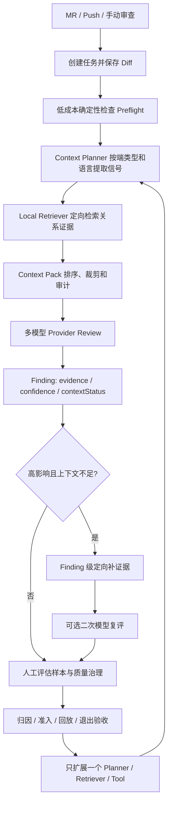

# Review 证据链前置与多端能力后续推进计划

## 状态

- 当前状态：阶段 1、阶段 2 已落地，当前停止等待用户验证；阶段 3 进入前必须核对 evaluation cases、人工归因、acceptance gate 和 baseline run，未经用户明确确认不得开始。
- 上游阶段：`docs/39-review-accuracy-and-material-ui-roadmap.md` 已完成源码工作区诊断、Java / Spring / MyBatis 关系证据、Context Pack 分层预算、质量治理入口收敛和 MUI 页面壳迁移。
- 阶段入口：本文是 `docs/39` 完成后的证据链专项路线；是否启动后续阶段以本文前置条件和用户明确确认为准。
- 长期目标：`docs/37-review-platform-target-product-roadmap.md`。
- 本文用途：解决“确定性检查还没有在首次 AI Review 前自动执行”“Planner / Retriever 尚未真正覆盖多端高准确模式”“finding 补证据只检索、不复评”三个已确认缺口。

## 一、结论与优先级

现有文档已经提出：

```text
平台先做确定性检查和规则提醒
  -> 再由模型基于证据判断
```

但当前实现仍是：

```text
首次 AI Review 直接构建 Context Pack 并调用 Provider
  -> 用户在任务详情手动运行 SECRET_SCAN
  -> 检查结果只能在后续重试、重跑或 finding 补证据时进入新的 Context Pack
```

因此，“确定性检查进入首次 Review 前置链路”在现有路线中只有目标，没有独立实施阶段。本专项将它设为最高优先级。

后续重点按以下顺序推进：

| 优先级 | 能力 | 目标 |
| --- | --- | --- |
| P0 | 首次 Review 前确定性检查 | 让低成本硬证据在 Provider 调用前稳定进入 Context Pack |
| P1 | Planner 多端感知基础 | 让 Planner 明确知道端类型、语言和使用了哪组提取器 |
| P1 | 单个多端 Planner / Retriever 配对扩展 | 用真实评估样本选择一个端、一个缺口，打通信号提取到关系证据 |
| P2 | finding 补证据后二次复评 | 在保留原 finding 的前提下，允许模型基于新增证据产生显式二次结论 |
| P2 | 更多确定性工具 | 按端类型接入 lint、类型检查、测试或静态规则，并为远期合并门禁准备证据 |

不应优先做：

- 同时为所有端堆积正则规则。
- 没有 evaluation case 证明价值就实现 MQ、配置、跨端调用方或某种语言 Retriever。
- 自动覆盖原 finding、自动降级、自动忽略或自动修改 Prompt。
- 首轮就接入任意项目命令执行、无限制全仓扫描或不受控脚本。

## 二、目标流程



核心原则：

```text
确定性证据前置
  + Planner 明确需要什么
  + Retriever 只查受控证据
  + Context Pack 公开预算和缺失
  + 模型输出不确定性
  + 人工评估证明改动有效
```

## 三、当前基线与缺口

### 3.1 确定性检查

当前已具备：

- `deterministic_check_runs` 记录表。
- `GET /api/review-tasks/{taskId}/deterministic-checks`。
- `POST /api/review-tasks/{taskId}/deterministic-checks/run`。
- `SECRET_SCAN`，只扫描 Diff 新增行并保存脱敏证据。
- Context Pack 读取最新 `deterministicChecks.securitySummary`。
- 任务详情“确定性检查”tab。

当前缺口：

- 首次 MR / Push / manual AI Review 前不会自动执行。
- 多模型 Review 还没有明确的“一次检查、多模型复用”编排语义。
- 没有 `PRECHECK_STARTED / COMPLETED / FAILED / REUSED` 进度事件。
- 没有自动执行开关、失败后继续策略和检查结果新鲜度约束。
- 当前失败不会阻塞 Review，这是正确的 MVP 安全边界，但需要在 progress 和 Context Pack 中明确展示。

### 3.2 Context Planner

当前已提取：

```text
METHOD_DELETED
METHOD_SIGNATURE_CHANGED
FIELD_DELETED
DTO_FIELD_CHANGED
DB_SQL_MAPPER_CHANGED
CACHE_WRITE_DELETE_CHANGED
MQ_CONFIG_CHANGED
CONFIG_FILE_CHANGED
HISTORICAL_CONTEXT_MISSING_FEEDBACK
```

当前缺口：

- `build_review_context_pack` 不接收 `targetType`，所有端共用一套启发式规则。
- Python / Java / Kotlin / JS / TS 只有部分通用方法和字段正则。
- Swift、Objective-C、Dart、React/Vue 组件、Android/iOS 生命周期等没有端侧专项提取器。
- Planner 没有输出 `targetType / detectedLanguages / extractorVersions / coverageSummary`。
- 信号是否漏提取，当前只能通过人工评估间接发现，缺少端类型覆盖审计。

### 3.3 Local Retriever

当前已具备：

- bounded `rg --fixed-strings` 通用字符串检索。
- Java / XML 轻量关系索引。
- caller / callee、接口实现、Controller -> Service、Service -> Mapper、MyBatis namespace / id、DTO 字段引用。
- DB / Mapper / Entity 和缓存使用证据。
- Evidence Candidate、分层预算与 `notInjectedEvidence`。

当前缺口：

- 关系索引当前只遍历 `.java / .xml`。
- Python、TypeScript/JavaScript、Kotlin、Swift/Objective-C、Dart 主要只剩字符串检索。
- `MQ_CONFIG_CHANGED / CONFIG_FILE_CHANGED` 能被 Planner 识别，但没有专项 Retriever。
- 跨仓、前后端 API 契约、测试覆盖和测试执行证据尚未支持。

### 3.4 Finding 级补证据

当前已具备：

- 对 `CRITICAL / MAJOR / HIGH` 且 `PARTIAL / INSUFFICIENT` 的 finding 定向重建 Context Pack。
- 保存 retrieval plan、evidence summary、missing context 和 failure reason。
- 以 `refinementOverlay` 展示，不覆盖原 finding。

当前缺口：

- 不重新调用 Provider。
- 不产生“基于新增证据后的二次结论”。
- 用户仍需自行比较新增证据和原 finding。

## 四、阶段路线

每个阶段完成后必须停止，输出“改了什么、为什么、如何验证、遗留风险、下一阶段”，等待用户验证并明确回复“继续下一阶段”。

### 阶段 1：首次 Review 前确定性检查 Preflight

目标：

- 在 MR、Push、manual、retry 的首次 Provider 调用前自动执行低成本 `SECRET_SCAN`。
- 同一 task 的多模型 Review 共用一次有效检查结果，不为每个模型重复扫描。
- 检查失败默认 fail-open：把失败证据写入 Context Pack，继续 AI Review，不阻塞任务。
- 保留现有手动运行和重跑 API。

建议调用链：

```text
任务和 changed files 已落库
  -> ensure_deterministic_preflight(taskId)
  -> 保存 deterministic_check_runs
  -> 记录 PRECHECK progress
  -> 构建 Context Pack
  -> 读取本次最新 securitySummary
  -> fan-out 到多个 Provider
```

实现约束：

- Preflight 应发生在多模型目标 fan-out 之前，不能放在每个 Provider 的 `_run_review` 内重复执行。
- 初期只自动运行内置 `SECRET_SCAN`，不执行项目自定义命令。
- 使用任务 changed files 快照作为输入，不做全仓扫描。
- 多次 retry 可以新建检查 run；同一次调度中的多模型必须复用同一 run。
- 新增进度事件建议使用：`DETERMINISTIC_PRECHECK_STARTED / COMPLETED / FAILED / REUSED`。
- 失败原因必须脱敏，不输出 secret、本地绝对路径、认证头或大段源码。
- 不新增合并阻塞，不修改 finding，不改变现有手动 API 契约。

数据设计：

- 阶段 1 优先复用 `deterministic_check_runs`，不新增表。
- 若需要关联同一次 Review 调度，可增量增加安全的 `trigger_mode / source_review_key / input_fingerprint` 字段；只有真实幂等需求证明必要时才增加。
- Context Pack 增加检查来源摘要，例如 `trigger=AUTO_PREFLIGHT|MANUAL`、`freshness=CURRENT_TASK_INPUT|STALE|UNKNOWN`。

验收：

- 首次 MR 自动 Review 的 `CONTEXT_PACK_BUILT` 已包含本次 `SECRET_SCAN` 摘要。
- Push 和 manual 路径一致生效。
- 多模型 Review 只产生一次自动检查 run，各 reviewKey 复用相同摘要。
- 检查失败时 Provider 仍执行，任务详情能看见失败阶段和脱敏原因。
- 手动重跑检查能力不回归。
- 覆盖单元测试、API 契约测试和 webhook/manual 主链路测试。

停止点：

- 完成后停止；不自动进入 Planner 多端改造。

#### 阶段 1 实施设计（2026-07-11）

- 统一编排点：MR / Push 分别在 `trigger_auto_review` / `_trigger_push_auto_review`，manual / retry 分别在 `create_manual_review` / `retry_review_task`，均在 Provider job fan-out 前调用 `ensure_deterministic_preflight`；禁止下沉到 `_run_review` 执行扫描。
- 复用契约：编排层生成一次 `SECRET_SCAN` run，把包含 `runId / trigger / freshness` 的脱敏 security summary 固定到本次各模型 request；Context Pack 使用该固定摘要，不因并发手动重跑而漂移到别的 run。
- 失败契约：扫描内部异常落一条 `FAILED` run，progress 记录脱敏原因，Context Pack 注入相同失败摘要，Provider 调用继续执行。
- 数据与接口：复用 `deterministic_check_runs` 的配置快照和结果摘要，不新增表、不改变现有 GET / POST 手动检查 API。
- manual 输入：自动 Preflight 使用本次 manual 请求的 `changedFileDetails / changedFiles` 快照；GitLab MR / Push / retry 使用已落库事件的 changed-files 快照。

#### 阶段 1 落地记录（2026-07-11）

- 改了什么：新增统一 `ensure_deterministic_preflight` 编排；MR、Push、manual、retry 均在 Provider fan-out 前调用一次；多模型 request 固定携带同一脱敏 security summary；progress 展示开始、完成、失败和复用状态。
- 为什么：确保首次模型请求已经包含当前输入的确定性证据，避免多模型重复扫描，并让失败降级可解释。
- 验收结果：MR、Push、manual、retry、两模型复用、失败 fail-open 与脱敏、现有手动 API、Context Pack 单元 / 契约测试均已覆盖；受影响回归 105 passed。
- 边界确认：未新增表，未做合并阻塞，未修改 finding，未进入 Planner 多端改造，未提前实施后续阶段。
- 遗留风险：只自动执行内置 `SECRET_SCAN`；manual 同时缺少明细 diff 和顶层 `diffText` 时无法产生有效扫描输入；仓库完整 lint 仍有 6 个既有未使用导入 / 变量问题。
- 下一阶段：阶段 2 Planner 多端感知与覆盖基线；当前停止等待用户验证。

### 阶段 2：Planner 多端感知与覆盖基线

目标：

- 让 Planner 明确接收任务 `targetType` 和检测到的语言信息。
- 建立通用信号提取器与端侧提取器注册机制，但本阶段不一次性实现所有端规则。
- 输出可观测的提取器版本和覆盖摘要，为选择第一个多端能力缺口提供数据。

建议内部契约：

```json
{
  "targetType": "WEB_PC",
  "detectedLanguages": ["TYPESCRIPT", "JAVASCRIPT"],
  "extractorVersions": ["generic-v1", "web-pc-v0"],
  "signals": [],
  "coverageSummary": {
    "changedFileCount": 6,
    "recognizedFileCount": 4,
    "unrecognizedFileCount": 2,
    "unsupportedLanguageCounts": []
  }
}
```

实现约束：

- `targetType` 只影响提取器选择，不影响 Provider / Profile 现有解析优先级。
- 保留现有通用规则作为兼容 fallback。
- 没有专项提取器时输出明确的 `GENERIC_FALLBACK`，不能伪装成完整多端支持。
- 不在本阶段增加 TypeScript、Swift、Dart 等大量新规则。
- Progress 和前端只展示安全摘要，不展示源码。

验收：

- BACKEND、WEB_PC、APP_IOS、APP_ANDROID、APP_CROSS_PLATFORM、GENERAL 均能生成可解释的 Planner 摘要。
- 现有 Java 后端信号和测试不回归。
- 未支持语言能被明确统计，而不是静默无信号。
- Context Pack 预算和 Prompt 契约保持兼容。

停止点：

- 完成后先收集或核对 evaluation cases，再决定阶段 3 选择哪个端和哪个缺口。

#### 阶段 2 实施设计（2026-07-12）

- 统一契约：`build_review_context_pack` 接收任务 `targetType`，Planner 输出 `targetType / detectedLanguages / extractorVersions / coverageSummary`，并继续保留现有 signal / requested context 字段。
- 注册机制：新增通用 `generic-v1` 与六类 targetType 的提取器注册表；阶段 2 的端侧提取器使用 `*-v0` 空实现，只声明选择结果，不新增 TypeScript、Swift、Kotlin、Dart 等专项信号。
- 兼容语义：已有 `_planner_signals_for_file` 继续由 `generic-v1` 调用，保持 Java / SQL / XML 等现有行为；未知或非法 targetType 归一为 `GENERAL`。
- 覆盖语义：文件后缀只生成语言和计数摘要；无专项提取器时 `coverageMode=GENERIC_FALLBACK`，GENERAL 为 `GENERIC_ONLY`；`unsupportedLanguageCounts` 明确统计当前 generic 基线未声明支持的语言。
- 安全边界：Context Pack、progress 和前端只展示 targetType、语言枚举、提取器版本、覆盖模式和计数，不展示源码、绝对路径或 diff 内容。
- 数据与接口：不新增表，不改变 Provider / Profile 解析优先级，不修改 finding，不新增 Retriever。

#### 阶段 2 落地记录（2026-07-12）

- 改了什么：新增 Planner 提取器注册模块；六类 targetType 均生成可解释摘要；保留 `generic-v1` 现有 Java / DB / 缓存等信号，端侧 `*-v0` 只作为明确占位；前端新增安全覆盖摘要展示。
- 验收结果：BACKEND、WEB_PC、APP_IOS、APP_ANDROID、APP_CROSS_PLATFORM、GENERAL 均有单元覆盖；未知扩展名计入 unrecognized，TypeScript / Swift / Kotlin / Dart 等未支持语言计入 `unsupportedLanguageCounts`；现有 Java 信号、Retriever snippets、Context Pack 预算和 Prompt 测试通过。
- 兼容处理：多端摘要在 Context Pack 完成预算裁剪后恢复到返回对象，不进入 Provider prompt 字符预算，避免挤掉已有直接证据和关系 snippets。
- 验证结果：后端定向 43 passed；受影响回归 132 passed、3 deselected；前端 build 通过；阶段修改文件定向 ruff 通过。
- 边界确认：未增加任何端侧业务信号，未新增 Retriever，未改变 Provider / Profile，未修改 finding，未进入阶段 3。
- 下一阶段：先核对阶段 3 的样本与治理进入条件；当前停止等待用户验证。

### 阶段 3：第一个多端 Planner / Retriever 配对扩展

进入条件：

- 至少有一组同端类型 evaluation cases。
- 样本证明某种信号漏提取、上下文不足或字符串检索误判。
- 已完成人工 rule gap attribution。
- 已创建 acceptance gate 和 baseline evaluation run。

目标：

- 只选择一个端类型和一个高价值问题。
- 同时补齐“Planner 能识别”与“Retriever 能查证据”，避免只产生不支持的 signal。

候选方向，不预设优先级：

| 端类型 | Planner 候选 | Retriever 候选 |
| --- | --- | --- |
| WEB_PC | Props、Hook 依赖、API 契约、路由变化 | import/export、组件使用、请求调用方 |
| BACKEND Python | FastAPI Route、Pydantic Schema、事务/异步变化 | import、Route -> Service -> Repository |
| APP_ANDROID | 生命周期、权限、Manifest、协程、Room | Kotlin 方法/接口关系、调用方、资源引用 |
| APP_IOS | SwiftUI/UIKit 生命周期、权限、Protocol、async | Swift 类型/协议实现、调用方、状态引用 |
| APP_CROSS_PLATFORM | Widget 生命周期、状态管理、平台通道 | Dart import、Widget 使用、状态引用 |
| 通用业务 | MQ 或配置读取点 | Producer/Consumer/Topic 或配置读取链路 |

验收：

- 有独立样本、Planner 单元测试、Retriever 单元测试、Context Pack 测试和回放记录。
- baseline / candidate 能比较误判、上下文不足、漏报、耗时和预算变化。
- 完成退出验收并停止，不继续补第二个端或第二个 Retriever。

### 阶段 4：评估驱动的多端能力循环

目标：

- 复用阶段 3 的流程，每轮只增加一个已被样本证明的能力。

循环：

```text
Evaluation Case
  -> Rule Gap Attribution
  -> Acceptance Gate
  -> Baseline Run
  -> 一个 Planner / Retriever 改动
  -> Candidate Run
  -> Exit Result
  -> 停止
```

约束：

- 不承诺所有端同时达到 Java 后端能力水平。
- 不以规则缺口频次作为唯一实现依据。
- 不因为字符串搜索“能搜到”就宣称具备结构化关系检索。

### 阶段 5：Finding 补证据后的显式二次复评

目标：

- 在现有 `refinementOverlay` 上增加可选的单 finding Provider 复评。
- 保留原 finding，新增独立 `refinementConclusion`，由用户比较两次结论。

建议流程：

```text
用户点击补证据
  -> Planner / Retriever 生成新增证据
  -> 用户点击“基于新证据重新评估”
  -> 只发送原 finding + 新证据 + 对应文件 Diff
  -> Provider 返回二次结论
  -> 原结论与二次结论并列展示
```

建议输出：

```json
{
  "status": "COMPLETED",
  "originalFindingFingerprint": "...",
  "conclusion": "CONFIRMED|WEAKENED|REJECTED|STILL_INSUFFICIENT",
  "severity": "MINOR|MAJOR|CRITICAL",
  "confidence": "LOW|MEDIUM|HIGH",
  "contextStatus": "SUFFICIENT|PARTIAL|INSUFFICIENT",
  "evidence": [],
  "missingContext": [],
  "explanation": "..."
}
```

约束：

- 必须由用户显式触发，不自动消耗模型。
- 不覆盖原 finding，不自动影响通知、质量门禁或项目策略。
- 二次结论可用于创建 evaluation case，但人工 verdict 仍是最终质量真值。
- 需要独立 Provider 调用进度、失败记录和成本统计。

验收：

- 同一 finding 能看到原结论、新证据和二次结论。
- Provider 失败不破坏原 Review 结果。
- 只有目标 finding 对应文件和受控证据进入二次请求。

### 阶段 6：更多确定性工具与门禁准备

进入条件：

- 阶段 1 已证明 Preflight 编排稳定。
- 评估样本证明某种确定性工具能减少误判或漏报。
- 执行环境、命令白名单、超时和资源限制方案已评审。

候选：

- Python lint / type check / targeted pytest。
- TypeScript type check / lint。
- Java/Kotlin compile 或定向测试。
- Swift/Dart 静态分析。
- 依赖与配置静态检查。

约束：

- 先使用平台内置检查或管理员配置的白名单命令。
- 禁止模型生成任意 shell 命令后直接执行。
- 必须有超时、输出大小限制、工作目录约束、环境变量脱敏和资源上限。
- 仍默认 fail-open；是否阻塞合并留给 `docs/37` 的 M14。

验收：

- 每种工具都有适用端类型、配置快照、版本、耗时、退出码和安全摘要。
- 结果进入 Context Pack，但不覆盖模型硬风险和人工 verdict。
- 失败、超时、不适用均可区分。

## 五、数据库与接口影响概览

### 5.1 数据库

- 阶段 1 优先复用 `deterministic_check_runs`。
- 阶段 2~4 优先使用现有 progress、evaluation cases、evaluation runs、acceptance gates，不为每种语言新建表。
- 阶段 5 可扩展 `code_quality_finding_refinements` 保存二次复评状态和结论；具体字段在进入该阶段时单独设计。
- 阶段 6 如需多检查类型，继续复用 `deterministic_check_runs.check_type`，避免一工具一张表。

### 5.2 API

- 阶段 1 保持现有确定性检查 GET / POST API；自动 Preflight 是内部编排变化。
- 阶段 2 只增量扩展 Context Pack / progress 安全摘要，不破坏现有字段。
- 阶段 5 可新增显式二次复评 API，不能改变现有“补证据”API为隐式模型调用。

## 六、兼容、失败与安全边界

- 未开启本地仓库上下文时，Planner 仍可运行，Retriever 明确标记不可用。
- 没有端侧提取器时回退通用规则，并公开 `GENERIC_FALLBACK`。
- 确定性 Preflight 失败时继续 AI Review，把失败作为证据状态而不是吞掉。
- 多模型共用确定性证据，但各 Provider 的结果、progress 和 reviewKey 仍独立。
- 所有摘要禁止包含真实 secret、token、认证头、本地绝对路径、大段 diff、源码片段和 provider raw output。
- 不自动修改 Prompt、项目策略、finding 等级或忽略状态。
- 不自动阻塞合并；远期门禁由 M14 单独设计。

## 七、阶段落地记录规则

每个阶段完成后必须在本文追加记录，包含：

- 完成日期和阶段。
- 改了什么。
- 为什么。
- 如何验证。
- 质量样本或验收记录依据。
- 遗留风险。
- 下一阶段。

同步要求：

- 更新本文和对应设计文档中的能力、阶段与验收记录；操作步骤变化写入 `docs/42-development-deployment-and-validation-guide.md`。只有项目入口或文档路由变化时才更新 `README.md`。
- 若改变长期里程碑，再更新 `docs/37-review-platform-target-product-roadmap.md`。
- 环境和工具踩坑写入 `docs/11-agent-environment-pitfalls.md`；业务行为问题写入对应设计文档或 `docs/24-bug-log.md`。

## 八、总控 Prompt

```text
请先阅读 AGENTS.md，并在 docs/40-review-evidence-pipeline-and-multi-target-roadmap.md 中只读取当前阶段、验收标准和阶段边界。使用 rg 按需定位 docs/38 的相关生命周期和代码调用链；不要默认通读 README、docs/37、docs/39 或环境避坑文档。

当前 docs/39 已完成，后续以 docs/40 为“Review 证据链前置与多端能力”专项路线。每次只推进 docs/40 的一个阶段。允许修改 backend-python、frontend、docs、examples、tests 中与当前阶段直接相关的文件；不要修改 legacy Java backend。

必须保持以下边界：不自动修改 Prompt，不自动降级或忽略 finding，不自动启用项目策略，不执行模型生成的任意命令，不做无限制全仓扫描，不直接实现没有 evaluation case / rule gap attribution / acceptance gate 依据的多端 Retriever。

阶段完成后必须更新 docs/40 的阶段落地记录；操作或验证步骤变化时更新 docs/42，只有项目入口或文档路由变化时才更新 README。运行影响范围内最小测试，输出“改了什么、为什么、如何验证、遗留风险、下一阶段”，然后停止，等待用户验证并明确回复“继续下一阶段”。
```

## 九、各阶段起手式 Prompt

### 阶段 1 Prompt

```text
请只落地 docs/40 的阶段 1：首次 Review 前确定性检查 Preflight。

目标：
- 在 MR、Push、manual、retry 的首次 Provider 调用前自动运行内置 SECRET_SCAN。
- 同一 task 同一次多模型调度只运行一次检查，各 reviewKey 复用同一结果。
- 检查失败默认 fail-open，将脱敏失败摘要写入 progress 和 Context Pack 后继续 Review。
- 保留现有手动运行 / 重跑 API，不做合并阻塞，不修改 finding。

先梳理所有触发路径和多模型 fan-out 点，更新本文的设计记录，再实现后端编排、progress、Context Pack 摘要和测试；操作或验证方式变化时更新 docs/42。完成后停止等待验证，不进入阶段 2。
```

### 阶段 2 Prompt

```text
请只落地 docs/40 的阶段 2：Planner 多端感知与覆盖基线。

目标：
- 将 task targetType 和检测语言传入 Context Planner。
- 建立通用提取器 + 端侧提取器注册机制和版本摘要。
- 输出 targetType、detectedLanguages、extractorVersions、coverageSummary。
- 保留现有通用规则和 Java 后端行为；没有专项能力时明确 GENERIC_FALLBACK。

本阶段不一次性实现所有端规则，不新增业务 Retriever。完成后运行 Planner / Context Pack 单元与契约测试，停止等待用户选择阶段 3 的端和缺口。
```

### 阶段 3 Prompt

```text
请只落地 docs/40 的阶段 3：第一个多端 Planner / Retriever 配对扩展。

开始前必须检查并列出 evaluation cases、rule gap attribution、acceptance gate 和 baseline evaluation run。若证据不足，停止并说明需要补哪些样本，不要自行选择端类型。

证据满足后，只选择一个 targetType 和一个高价值问题，同时补 Planner signal 和对应 Retriever 关系证据，补测试、candidate run 和退出验收记录。不得顺带实现第二个端、第二个 signal 或第二个 Retriever。完成后停止等待验证。
```

### 阶段 4 Prompt

```text
请只落地 docs/40 的阶段 4 中一轮“评估驱动的多端能力循环”。

开始前必须从 evaluation cases、rule gap attribution、acceptance gates 和 evaluation runs 中选出一个已被样本证明的缺口。只允许实现一个 targetType 下的一个 Planner / Retriever / deterministic tool 能力；不得并行扩展多个端或多个 signal。

实现前记录准入和 baseline，实现后记录 candidate 与退出结果，比较误判、上下文不足、漏报、耗时和 Context Pack 预算变化。完成一轮后立即停止，等待用户验证，不自动开始下一轮。
```

### 阶段 5 Prompt

```text
请只落地 docs/40 的阶段 5：Finding 补证据后的显式二次复评。

目标：
- 保留原 finding 和现有 refinementOverlay。
- 新增用户显式触发的单 finding Provider 复评。
- 只传目标 finding、对应文件 Diff 和受控新增证据。
- 保存独立 refinementConclusion、Provider progress、失败和成本摘要。
- 不自动覆盖原 finding，不自动影响通知、项目策略或合并门禁。

先补接口和数据结构设计，再实现后端、前端和测试。完成后停止等待验证。
```

### 阶段 6 Prompt

```text
请只落地 docs/40 的阶段 6 中一个经评估确认的确定性工具。

开始前必须说明适用 targetType、评估样本依据、命令或内置规则来源、执行白名单、工作目录、超时、输出上限、资源上限和脱敏规则。禁止执行模型生成的任意命令，禁止无限制全仓扫描。

只接入一个工具，并让 COMPLETED / FAILED / TIMEOUT / NOT_APPLICABLE 状态进入任务详情、progress 和 Context Pack。默认 fail-open，不做合并阻塞。补测试和验收记录后停止等待验证。
```

## 十、推荐的新对话起手式

```text
请先阅读 AGENTS.md，并在 docs/40-review-evidence-pipeline-and-multi-target-roadmap.md 中只读取阶段 1、验收标准和阶段边界。使用 rg 按需定位 docs/38 的 MR/Push/manual/retry 生命周期以及相关代码；不要默认通读 README、docs/37、docs/39 或环境避坑文档。

docs/39 已完成。现在请只落地 docs/40 阶段 1“首次 Review 前确定性检查 Preflight”：在 MR、Push、manual、retry 的首次 Provider 调用前自动运行内置 SECRET_SCAN；同一 task 同一次多模型调度只运行一次并复用结果；失败默认 fail-open，将脱敏失败摘要写入 progress 和 Context Pack 后继续 Review；保留现有手动运行和重跑 API；不做合并阻塞，不修改 finding，不进入 Planner 多端改造。

请先核对当前所有触发路径和多模型 fan-out 点，先更新 docs/40 的设计记录，再实现后端编排、progress、Context Pack 摘要和测试；操作或验证步骤变化时更新 docs/42。只做本阶段。完成后更新 docs/40 的阶段落地记录，输出“改了什么、为什么、如何验证、遗留风险、下一阶段”，然后停止等待我验证并确认“继续下一阶段”。
```
