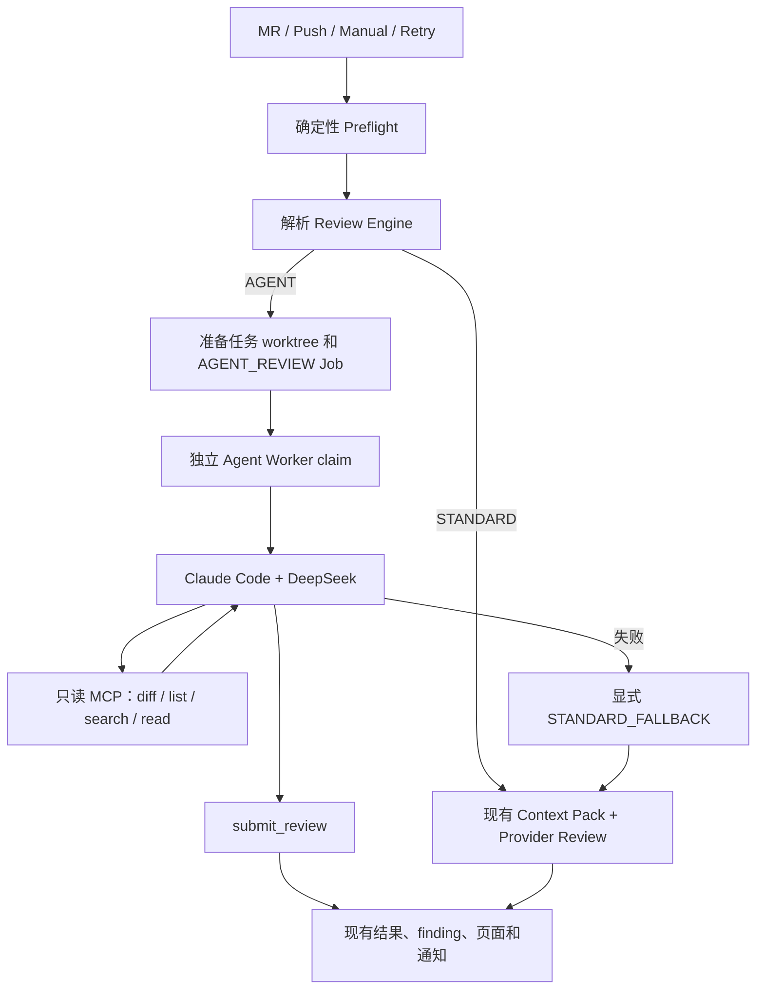
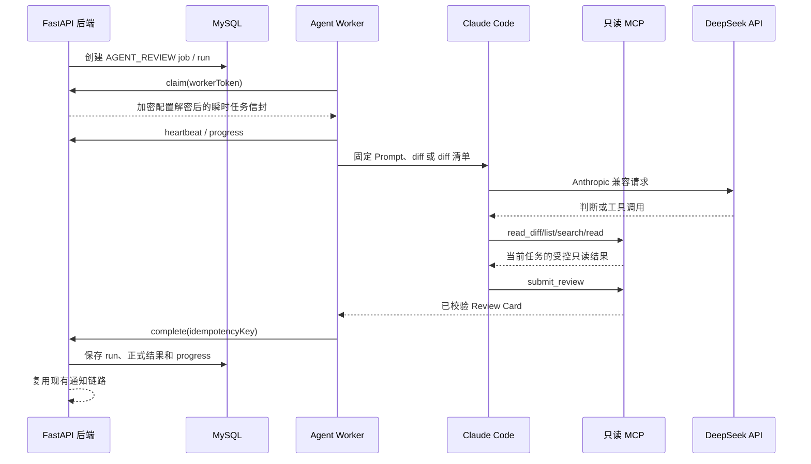

# 服务器侧只读 Agent Review 生产验证推进计划

## 状态

- 文档状态：当前有效，2026-07-18 已完成阶段 2 工程实现和阶段 3A 生产观察能力准备；当前等待用户验证 3A，阶段 3B 未开始。
- 路线定位：本专项负责 Claude Code + DeepSeek 的服务器侧只读 Agent Review；`docs/40-review-evidence-pipeline-and-multi-target-roadmap.md` 继续负责 STANDARD Review 的 Preflight、Planner、Retriever 和证据流水线，两者互不替代。
- 已完成：阶段 1 工程 Spike；阶段 2 已实现 Agent 设置、Fernet Key、项目组引擎/授权、Manual/Retry 覆盖、Job/Run、独立 Worker、五个只读 MCP、正式结果、显式降级、任务页面、对照执行、Worker 配置测试和受限出站部署。
- 未完成：用户尚未使用真实 DeepSeek Key 在授权项目完成生产 Agent Review；真实准确性、至少 30 条人工标注样本、充分的 STANDARD / AGENT 配对覆盖和扩大门禁属于阶段 3B。
- 当前停止点：阶段 3A 已完成，必须停止并等待用户验证；只有用户明确回复“继续阶段 3B”后，才允许进入真实样本准确性验收与扩大门禁。
- 质量门禁：30 条人工标注样本用于判断是否扩大 Agent 使用范围或将其设为更高优先级，不是实现生产链路的技术前置条件。

已落地的阶段 1 入口：

- `backend-python/app/agent_review_spike/`
- `deploy/agent-review-spike.Dockerfile`
- `examples/agent-review-spike.manifest.example.json`
- `docs/42-development-deployment-and-validation-guide.md` 的“服务器侧只读 Agent Review”章节

## 一、需求背景与结论

### 1.1 当前问题

现有高准确模式会在 Provider 调用前完成确定性检查、Planner、Retriever 和 Context Pack 裁剪，但最后仍是一次性模型调用：

```text
Diff
  -> 确定性 Preflight
  -> Planner / Retriever
  -> Context Pack
  -> STANDARD Provider Review
```

调用链、DTO、配置、缓存、事务和测试缺口等问题经常需要沿源码继续查证。若平台没有提前选中正确上下文，模型只能基于不完整证据判断，后续就需要持续增加业务检索规则。

Agent Review 目标是增加一条可选链路：

```text
Diff + 审查指令 + Preflight 摘要
  -> Agent 判断证据是否充分
  -> 通过受控只读 MCP 按需搜索当前任务源码
  -> submit_review 提交现有 Review Card
```

### 1.2 结论

方案可行，下一步应优先建设受控生产验证闭环，而不是继续等待凑齐 30 条离线样本。

预期收益：

- Agent 不依赖平台提前预测全部上下文，可根据问题主动搜索调用方、实现类、DTO、配置读取点和事务边界。
- 不需要把完整本地源码一次性塞入 Prompt；初始只提供任务控制信息和核心 diff，大 diff 与源码按需读取。
- 复用现有 finding、任务详情、通知和质量评估体系，避免形成第二套 Review 产品。

限制：

- 不承诺完全免维护；CLI/模型兼容、通用工具、安全策略、Prompt 和评估样本仍需维护。
- 确定性规则、STANDARD Review、Context Pack 和 Local Retriever 必须保留。
- Agent 能发现更多问题不等于更准确；扩大范围前仍需人工标注和对照评估。

### 1.3 固定技术选型

首版只支持一个固定组合，不做模型或 Runner 扩展：

```text
Runner: Claude Code 2.1.112
Provider: DeepSeek
Endpoint: https://api.deepseek.com/anthropic
Model: deepseek-v4-pro[1m]
```

外部参考：

- [DeepSeek Claude Code 集成](https://api-docs.deepseek.com/quick_start/agent_integrations/claude_code/)
- [Claude Code CLI 参考](https://code.claude.com/docs/en/cli-usage)

## 二、范围与已确认决策

### 2.1 六项产品决策

| 决策 | 首版结论 |
| --- | --- |
| 启用范围 | 项目组选择 `STANDARD` 或 `AGENT`；Manual/Retry 可以临时覆盖；MR/Push 按项目组执行 |
| 结果用途 | Agent 成功结果作为正式结果进入现有 finding、页面和通知；运行失败显式执行 `STANDARD_FALLBACK` |
| API Key | 使用独立 Agent DeepSeek Key，认证加密入库，不复用普通 Provider Key |
| 运行隔离 | 使用独立 Agent Worker，不在 FastAPI Web 进程内执行 Claude Code |
| 变更输入 | 小 diff 初始传入；大 diff 通过受控工具分页读取；完整源码始终按需读取 |
| 效果比较 | 同一任务可由管理员追加另一引擎结果，不要求所有任务自动双跑 |

### 2.2 本专项负责

- Agent 全局设置、独立加密 Key 和 Worker 健康检查。
- 项目组、Manual 和 Retry 的 Review Engine 选择。
- 持久化 Agent Job/Run、lease、heartbeat、cancel、retry 和幂等完成。
- 任务级只读源码访问、diff 分页、结构化结果提交和显式降级。
- 正式结果、对照结果、任务详情、通知和评估维度接入。
- 受控生产验证与后续质量门禁。

### 2.3 首版不负责

- 不建设可扩展 Agent Provider、模型市场或 Runner 插件体系。
- 不把引擎选项放入 Review Profile；Profile 只提供审查指令和策略。
- 不允许 Agent 执行测试、构建、lint、Git、项目脚本或任意命令。
- 不允许 Agent 写文件、编辑 Prompt、自动修改规则、自动降低 finding 等级或自动忽略 finding。
- 不自动双跑所有任务，不把 `AGENT` 设为全局默认。
- 不删除现有规则、Retriever、Context Pack 或 STANDARD Review。

## 三、目标架构与流程



### 3.1 正式 Agent Review 时序



## 四、设置与外部接口契约

### 4.1 Agent 设置接口

新增：

```text
GET  /api/code-quality-reviews/agent-settings
PUT  /api/code-quality-reviews/agent-settings
POST /api/code-quality-reviews/agent-settings/test
```

GET 响应示例：

```json
{
  "enabled": false,
  "runner": "CLAUDE_CODE",
  "cliVersion": "2.1.112",
  "provider": "DEEPSEEK",
  "endpoint": "https://api.deepseek.com/anthropic",
  "model": "deepseek-v4-pro[1m]",
  "apiKeyConfigured": false,
  "apiKeyMasked": null,
  "workerStatus": "OFFLINE",
  "lastWorkerHeartbeatAt": null,
  "budgets": {
    "maxTurns": 12,
    "maxToolCalls": 40,
    "maxSourceBytes": 200000,
    "timeoutSeconds": 600
  }
}
```

PUT 请求示例：

```json
{
  "enabled": true,
  "apiKey": "sk-...",
  "clearApiKey": false
}
```

更新语义：

- `apiKey=null` 或字段缺失表示保留原 Key。
- 只有 `clearApiKey=true` 才清除 Key；清除时同时把 `enabled` 置为 `false`。
- `enabled=true` 时必须存在可解密 Key，否则返回明确校验错误。
- 固定 Runner、Endpoint、模型和预算只读展示，首版不接受客户端覆盖。
- `workerStatus=ONLINE` 的判定为最近一次有效心跳距当前不超过 60 秒。
- test 必须由 Agent Worker 执行无源码的最小 Claude Code + DeepSeek + MCP 验证，返回版本、模型、耗时和稳定错误码；不得从后端直接绕过 Worker 测试。

### 4.2 API Key 加密

- 新增环境变量 `AGENT_REVIEW_CONFIG_ENCRYPTION_KEY`，值为 `cryptography.fernet.Fernet` 可接受的 URL-safe base64 key。
- 后端增加 `cryptography` 运行依赖，使用 Fernet 认证加密保存 Key。
- 数据库只保存 ciphertext、Key 指纹和配置状态；API、日志、Job、Run、Prompt、CLI 参数和镜像层不得保存明文。
- 未配置或无法使用加密主密钥时，保存/测试 Agent Key 返回 `AGENT_ENCRYPTION_KEY_UNAVAILABLE`，不得退化为明文。
- 已有 ciphertext 但运行时无法解密时，Agent 配置标记为不可用；不得自动清空密文。
- Windows 本地开发可执行 `scripts/init-agent-review-secrets.cmd`，向被启动脚本加载的 `.local/gitlab.env` 补齐加密主密钥和 Worker Token；命令只补缺失或空值，不覆盖已有密钥，也不生成、读取或输出 DeepSeek API Key。执行后必须重启后端，使进程重新加载环境变量。
- 设置页在 `encryptionAvailable=false` 时必须保持保存禁用，并展示上述初始化与重启指引；不得为了改善交互而允许明文保存。
- Windows + Docker Desktop 使用独立的 `docker-compose.windows-agent.yml`，只启动 Worker 和本地专用出站代理，不启动第二个 backend。Worker 仅加入 internal 网络；对 Windows 主机 `8090` 后端的 HTTP 请求也必须经代理白名单转发，不得为了连接 `host.docker.internal` 把 Worker 加入普通外网网络。
- Claude Code 子进程只允许从 Worker 环境继承 `HTTP_PROXY`、`HTTPS_PROXY`、`NO_PROXY` 及其小写形式，不得复制整个 Worker 环境。Windows 可通过本机 `.local/gitlab.env` 的 `AGENT_REVIEW_UPSTREAM_PROXY` 为白名单 Squid 配置局域网上游 HTTP 代理；请求仍须先通过 `api.deepseek.com` 白名单，不得让 Worker 直接连接上游代理。
- Windows 执行 `scripts/run-backend.cmd dev` 时，在已配置 Worker Token 且 Docker 可用的前提下自动后台确保 Worker/代理运行；后台任务等待本地后端健康后再启动 Worker，不得阻塞 uvicorn。可用 `AGENT_REVIEW_AUTO_START_WORKER=false` 显式关闭；测试、lint、迁移不自动启动 Docker。
- Linux 生产继续使用完整 Compose 内的 `backend + agent-worker + agent-egress-proxy`，Worker 通过 internal 网络访问 `http://backend:8090`。两种环境都只读挂载同一 review workspace，不改变 API Key 加密、MCP 白名单或源码外发授权边界。

### 4.3 Review Engine 契约

统一枚举：

```text
ReviewEngine = STANDARD | AGENT
EffectiveReviewEngine = STANDARD | AGENT | STANDARD_FALLBACK
```

项目组配置新增：

```json
{
  "reviewEngine": "STANDARD",
  "agentSourceExportAllowed": false
}
```

Manual/Retry 请求新增可选字段：

```json
{
  "reviewEngine": "AGENT",
  "comparisonMode": false
}
```

解析优先级：

```text
Manual/Retry 显式 reviewEngine
  -> 项目组 reviewEngine
  -> STANDARD
```

兼容与校验：

- 旧请求、旧项目组和缺失字段一律保持 `STANDARD`。
- 保存项目组 `reviewEngine=AGENT` 时必须同时确认 `agentSourceExportAllowed=true`。
- Manual/Retry 显式请求 Agent，但全局未启用、Key 不可用、项目未授权或 Worker 离线时，返回 `409 AGENT_REVIEW_UNAVAILABLE`，不产生伪 Agent 任务。
- 已保存为 Agent 的 MR/Push 自动任务在运行期发现 Worker、Key、worktree 或模型不可用时，记录 requested engine 后执行 STANDARD fallback，Webhook 主链路不失败。
- 首版不在 Review Profile 中增加 `reviewEngine`。

### 4.4 结果与对照契约

现有 finding JSON schema 不变。结果新增：

```json
{
  "requestedEngine": "AGENT",
  "effectiveEngine": "AGENT",
  "agentRunSummary": {
    "runId": 123,
    "runnerVersion": "agent-worker-v1",
    "cliVersion": "2.1.112",
    "model": "deepseek-v4-pro[1m]",
    "status": "SUCCEEDED",
    "turnCount": 6,
    "toolCallCount": 18,
    "sourceBytesReturned": 82340,
    "durationMs": 126000,
    "fallbackTriggered": false,
    "failureCode": null
  }
}
```

对照规则：

- Agent 使用稳定 `reviewKey=agent-claude-code-deepseek-v4-pro`，STANDARD 保留现有 provider/model reviewKey。
- `comparisonMode=true` 时允许在同一任务追加另一引擎结果，不覆盖已有另一引擎结果。
- 对照执行写入页面和评估数据，但默认不发钉钉通知，也不重复改变任务风险等级。
- 主执行选择 Agent 时，成功结果正常进入现有通知；fallback 通知必须明确显示请求引擎、实际引擎和降级原因。
- Agent 重试只更新该 Agent reviewKey 的最新结果，历史执行保留在 `agent_review_runs`。

## 五、数据库与内部 Worker 契约

### 5.1 数据结构

新增 `code_quality_agent_settings` 单例配置：

| 字段 | 说明 |
| --- | --- |
| `id` | 固定单例主键 |
| `enabled` | 全局能力开关 |
| `api_key_ciphertext` | Agent Key 认证加密密文 |
| `api_key_fingerprint` | 不可逆短指纹，只用于配置变更诊断 |
| `worker_id` | 最近心跳 Worker |
| `worker_version` | Worker/镜像版本 |
| `cli_version` | Worker 报告的 Claude Code 版本 |
| `last_worker_heartbeat_at` | 最近 Worker 心跳 |
| `created_at / updated_at` | 审计时间 |

新增 `agent_review_runs`：

| 字段 | 说明 |
| --- | --- |
| `id` | 主键 |
| `task_id / review_key` | 对应任务与 Agent 结果 |
| `scheduler_job_id` | 对应调度 Job |
| `idempotency_key` | 完成幂等键，唯一索引 |
| `requested_engine / effective_engine` | 请求与实际引擎 |
| `runner_version / cli_version / model` | 固定组合的实际运行版本 |
| `status` | PENDING / CLAIMED / RUNNING / SUCCEEDED / FAILED / CANCELLED / TIMED_OUT |
| `session_id` | CLI 会话 ID，不含源码或凭据 |
| `turn_count / tool_call_count` | Agent 用量 |
| `source_bytes_returned / diff_bytes_returned` | 只读工具返回预算 |
| `duration_ms / usage_json` | 耗时与安全用量摘要 |
| `tool_summary_json` | 脱敏工具类型、耗时和命中数量 |
| `failure_code / failure_message` | 稳定错误码与脱敏说明 |
| `heartbeat_at / started_at / finished_at` | 生命周期时间 |
| `created_at / updated_at` | 审计时间 |

现有表增量：

- `project_groups`：增加 `review_engine`，默认 `STANDARD`；增加 `agent_source_export_allowed`，默认 `false`。
- `code_quality_review_results`：增加 `requested_engine`、`effective_engine`、`agent_run_id`、`agent_summary_json`。
- `code_quality_scheduler_jobs`：增加或确认 `job_type=AGENT_REVIEW`、`lease_owner`、`lease_expires_at`、`heartbeat_at`、`attempt`、`max_attempts`、`cancel_requested_at` 和 `idempotency_key`。

关键索引：

- `agent_review_runs.UNIQUE(idempotency_key)`。
- `agent_review_runs(task_id, created_at)`。
- `agent_review_runs(status, heartbeat_at)`。
- `code_quality_scheduler_jobs(job_type, status, lease_expires_at)`。

### 5.2 Worker 内网 API

```text
POST /internal/agent-review/workers/heartbeat
POST /internal/agent-review/jobs/claim
POST /internal/agent-review/jobs/{jobId}/heartbeat
POST /internal/agent-review/jobs/{jobId}/complete
POST /internal/agent-review/jobs/{jobId}/fail
POST /internal/agent-review/jobs/{jobId}/cancelled
```

约束：

- 接口只在容器内网开放，使用独立、可轮换的 Worker Token；跨主机部署时必须使用 TLS。
- Worker 不直连 MySQL，不持有 GitLab Token、平台 Provider Key 或其它后端环境变量。
- claim 只返回单任务 worktree 标识、任务输入、固定预算和本次运行所需的瞬时 Agent Key；响应体不得记录访问日志。
- heartbeat 续租并保存安全进度摘要；过期 lease 可以由其它 Worker 重新领取。
- Agent Job claim 必须始终在事务行锁下完成。MySQL 8.0+ 使用 `FOR UPDATE SKIP LOCKED` 提升多 Worker 并发；MySQL 5.7 或不支持该语法的兼容数据库降级为普通 `FOR UPDATE` 串行领取，不得降级为无锁查询。生产环境仍推荐 MySQL 8.0+。
- complete/fail 使用 `idempotencyKey`；重复请求返回既有终态，不重复落库 finding 或发送通知。
- Agent Job 不进入现有进程内 `PriorityQueue` Worker。

## 六、输入、Prompt、安全与降级

### 6.1 初始输入

Agent 初始 Prompt 包含：

- task、MR/Push、commit range 和 changed-files 元数据。
- Review Profile 的审查指令与项目策略。
- 确定性 Preflight 摘要。
- Review Card schema、finding 证据约束和只读工具规则。
- 完整小 diff，或大 diff 的文件清单与统计。

不预先注入：

- 整个仓库源码。
- STANDARD Context Pack 中的大量 Retriever 源码片段。
- 其它项目、其它任务或历史会话内容。

Prompt 优先级固定为：平台安全/工具约束 > Review Card 契约 > Profile 指令 > 项目策略 > 任务输入。Profile 和任务内容不能扩大工具、网络、路径或输出权限。

### 6.2 Diff 策略

- diff 不超过 200 KB：完整 diff 随初始 Prompt 发送。
- diff 大于 200 KB 且不超过 1 MiB：初始只发送 changed-files 和 diff 统计，Agent 使用 `read_diff_range` 按文件分页读取。
- diff 超过 1 MiB：不启动 Agent，记录 `AGENT_INPUT_TOO_LARGE` 并显式执行 STANDARD fallback。
- `read_diff_range(filePath, startLine, endLine)` 读取任务创建时保存的不可变 unified diff；单次最多 400 行，路径必须属于 changed-files。
- diff 或源码预算耗尽且尚未成功提交 Review Card 时，本次 Agent Run 失败并降级；不得保存“可能未读完”的不完整 Agent 正式结果。

### 6.3 允许的 MCP

| 工具 | 用途 | 主要约束 |
| --- | --- | --- |
| `read_diff_range` | 分页读取大 diff | 仅 changed-files、单次最多 400 行 |
| `list_files` | 列出安全源码文件 | 数量上限、排除依赖和构建目录 |
| `search_code` | 字面量或受控正则搜索 | 查询长度、glob、超时、结果数和危险正则限制 |
| `read_file_range` | 读取当前 worktree 源码 | 单次最多 400 行、文件大小上限 |
| `submit_review` | 提交最终 Review Card | schema、changed-files、行号和重复 finding 校验，只允许一次成功提交 |

默认预算：

| 预算 | 默认值 |
| --- | ---: |
| Agent turn | 12 |
| MCP 工具调用 | 40 |
| 累计返回源码 | 200,000 UTF-8 bytes |
| 单文件 | 1 MiB |
| 单次读取 | 400 行 |
| 单任务超时 | 600 秒 |

### 6.4 Worker 与文件安全

- 独立 `agent-worker` 服务只读挂载 review workspace 根目录；每次运行只把当前任务 worktree 设为 MCP 根目录。
- Claude Code 使用 `--bare`、`--tools ""`、`--strict-mcp-config`、`dontAsk`、最大 turn、禁止 slash command、禁止 Chrome 和禁止会话持久化。
- 不开放 Bash、Read、Write、Edit、Web、Notebook、Task/子 Agent或其它 MCP。
- 所有路径必须是相对路径；逐级拒绝符号链接，最终 realpath 必须位于当前任务 worktree。
- 拒绝 `.git`、`.env*`、密钥、证书、凭据、依赖、缓存和构建产物目录。
- Worker 使用非 root、只读根文件系统、tmpfs、`cap-drop ALL`、`no-new-privileges` 和 CPU/内存/PID 限额。
- 网络策略只允许 `api.deepseek.com:443`；Dockerfile 本身不能证明域名级出站隔离。

### 6.5 日志与数据留存

不保存模型思维过程、Claude Code 原始输出、MCP 源码片段、搜索关键字明文、本地绝对路径、API Key 或请求头。

只保存工具类型、状态、耗时、命中数量、查询 hash、路径 hash/后缀/目录层级摘要、turn、工具调用数、返回字节数、token 用量和稳定错误码。

### 6.6 失败与显式降级

以下情况触发 `STANDARD_FALLBACK`：

- 自动任务运行时 Agent 配置、Worker 或 Key 不可用。
- worktree 准备失败、已清理或越界校验失败。
- diff 超过上限。
- Runner 启动失败、Claude Code/DeepSeek 鉴权或协议失败。
- 超时、预算耗尽、取消或进程异常退出。
- 未调用 `submit_review`。
- Review Card、changed-files 或行号校验失败且受控重试仍失败。

结果示例：

```json
{
  "requestedEngine": "AGENT",
  "effectiveEngine": "STANDARD_FALLBACK",
  "agentRunSummary": {
    "status": "FAILED",
    "failureCode": "AGENT_TIMEOUT",
    "fallbackTriggered": true
  }
}
```

禁止把 fallback 显示为 Agent 成功，禁止把失败伪造成空 findings，禁止因 Agent 失败覆盖已经存在的对照结果。

## 七、分阶段落地

每次只推进一个阶段。完成后必须输出“改了什么、为什么、如何验证、评估指标、遗留风险、下一阶段”，然后停止等待用户明确回复“继续下一阶段”。

### 7.1 阶段 1：工程 Spike（已完成）

已完成 Runner、四个 MCP、schema、安全预算、评估指标、固定版本镜像、示例清单和单元测试。真实 DeepSeek baseline/candidate 对照尚未执行，因此当前只能说明工程骨架可运行，不能说明 Agent 更准确。

已有验证：聚焦 Ruff 通过；23 passed、1 个 Windows symlink 权限用例跳过；镜像为 Python 3.12.13、Claude Code 2.1.112、非 root；无网络和只读根文件系统下 `VALIDATED`。

### 7.2 文档重新基线化（本阶段已完成）

- 明确下一步直接建设受控生产验证闭环。
- 30 条样本不再阻塞生产链路实现，只阻塞扩大使用范围。
- 固化项目组选择、正式结果+降级、独立加密 Key、独立 Worker、混合 diff、同任务追加对照六项决策。
- 本阶段只修改本文；只有文档路由变化时才修改 README，不实现阶段 2 代码。

### 7.3 阶段 2：受控生产验证闭环（工程实现完成，待用户生产验收）

进入条件：

- 用户已确认本文并明确回复“继续下一阶段”。
- 生产环境具备 Linux/Docker、任务 worktree 和 DeepSeek 数据外发授权。
- 已确定 `AGENT_REVIEW_CONFIG_ENCRYPTION_KEY` 与 Worker Token 的安全配置方式。

目标：

- 先更新本文的设计状态和接口约束，再实施迁移、DTO、接口和枚举；部署或验证步骤变化时更新 `docs/42-development-deployment-and-validation-guide.md`。
- 实现 Agent 设置、Key 加密、项目组选择和 Manual/Retry 覆盖。
- 实现持久化 Job/Run、独立 Worker、lease/heartbeat/cancel/retry 和幂等完成。
- 增加 `read_diff_range` 和混合 diff 输入。
- 接入正式结果、显式 fallback、任务详情、通知和同任务对照执行。
- 增加 agent-worker 部署配置、示例配置和演示任务。

阶段 Prompt：

```text
只执行 docs/41 的阶段 2：受控生产验证闭环。
先阅读 AGENTS.md，并按需局部读取 docs/41、docs/42 中的 Agent 部署章节、现有 agent_review_spike、Python Review 主链路、scheduler、项目组配置和前端设置/任务详情代码。

先更新本文的设计状态和接口约束，再实现数据迁移和 DTO/API；之后实现 Agent 设置、Fernet Key 加密、项目组引擎选择、Manual/Retry 覆盖、持久化 Job/Run、独立 Worker、read_diff_range、正式结果落库、显式 STANDARD_FALLBACK、任务详情和同任务对照执行。部署或验证步骤变化时更新 docs/42。

固定 Claude Code 2.1.112 + DeepSeek deepseek-v4-pro[1m]，不得建设可扩展 Provider。STANDARD 保持默认；Agent 只能访问当前任务的受控只读 MCP；未授权项目不得外发源码。对照执行不发重复通知。

补齐异常恢复、取消、幂等、加密、安全、接口和完整链路测试；运行相关 Python 测试、前端 build、容器安全验证和一条 manual 端到端链路。更新 docs/41 和必要的 docs/42 后，输出改了什么、为什么、如何验证、评估指标和遗留风险，然后停止等待确认。不得进入阶段 3。
```

阶段 2 落地记录（2026-07-18）：

- 设置与契约：新增固定 Claude Code + DeepSeek 设置 API、独立 Fernet Key、Worker 在线状态和由 Worker 执行的无生产源码配置测试。
- 选择与主链路：项目组保存 `reviewEngine` / `agentSourceExportAllowed`，Manual/Retry 支持覆盖；MR/Push 按项目组选择，运行期不可用或失败时记录 `STANDARD_FALLBACK`。
- 执行与恢复：新增 `agent_review_runs`、`AGENT_REVIEW` Job、claim/lease/heartbeat/attempt/cancel/idempotent complete/fail；过期 lease 可重领，Worker 离线或队列超过宽限期由后端周期扫描并进入普通 Review 降级。
- 输入与安全：小 diff 初始发送，大 diff 通过 `read_diff_range`；源码用 list/search/read 按需获取；敏感路径、符号链接和越界路径拒绝；内置网络代理只允许 `api.deepseek.com:443`。
- 页面与通知：设置页、项目组策略、任务结果和 MR/Push 任务追加另一引擎对照已接入；任务结果与高准确流转展示请求/实际引擎、Run/turn/tool/源码预算、耗时和降级码，钉钉文本展示真实引擎。
- 部署与示例：新增 Worker/出站代理镜像、Compose/离线打包配置以及 `examples/agent-review-production-validation.example.json`。
- 验证：Agent 专项与 Spike 安全测试 39 passed、1 skipped，其中阶段 2 契约 11 passed；剔除 4 个已记录既有失败后的 Python 回归 301 passed、1 skipped、4 deselected；Ruff 通过；前端 build 通过；两份 Compose 配置通过；Worker/代理镜像构建、Claude Code 2.1.112、MCP 五工具白名单、Squid 配置和 DeepSeek-only 出站实测通过。
- 尚未执行：没有用户真实 DeepSeek Key，未产生模型费用，也未完成“授权项目真实 Agent 成功”这一生产验收项。
- 已知边界：Manual Review 支持在首次请求选择 Agent，但完成后不持久化原始 diff，事后追加另一引擎对照仅对可从 GitLab 事件重建变更输入的 MR/Push 任务开放。

### 7.4 阶段 3A：生产观察能力准备（已完成，待用户验证）

阶段 3A 不依赖真实 DeepSeek Key，也不做真实准确性验收。它只复用已有 `evaluation_cases`、`evaluation_runs`、质量看板、finding 反馈、`code_quality_review_results` 与 `agent_review_runs`，补齐以下只读能力：

- 按 task、项目组、项目、Profile 和时间范围识别 STANDARD / AGENT 结果与同任务配对。
- 聚合两类样本数、配对任务数、人工标注进度、finding 数、人工误判、漏报和上下文不足。
- 聚合 Agent 成功 / 失败 / fallback，p50 / p95 耗时，以及 turn、工具调用、源码返回量和用量安全摘要。
- 少于 30 条去重人工标注样本时返回 `INSUFFICIENT_SAMPLE`，`expansionConclusion=null`，不得计算或展示扩大范围结论；已配对任务数另行展示，不与样本数混用。
- 导出强制脱敏的对照摘要；禁止源码、完整 diff、API Key、Prompt、模型思维过程、会话内容和 MCP 返回源码。
- 提供合成 demo 数据，使页面、聚合和门禁状态在没有真实 Key 时可验证；合成数据必须显式标记，不得混同真实生产样本。

阶段 3A 不新增第二套评估表，不改项目组 `reviewEngine` / `agentSourceExportAllowed`，不改 Profile、Prompt、规则、finding 等级或人工 verdict，不调用真实模型，也不输出“Agent 更准确”结论。

阶段 3A Prompt：

```text
只执行 docs/41 的“阶段 3A：Agent Review 生产观察能力准备”，不执行真实准确性验收。
先复用现有 evaluation cases、evaluation runs、质量看板、finding 反馈、Review Result 和 Agent Run；增加按任务/项目组/项目/Profile/时间的 STANDARD/AGENT 对照观察、强制脱敏导出和显式合成 demo。

样本不足 30 条时固定返回 INSUFFICIENT_SAMPLE，不计算扩大范围结论。不得配置或读取真实 DeepSeek Key，不调用模型，不发送源码，不改 Review 配置、Prompt、规则、finding 等级或人工 verdict。

补契约、指标、权限/脱敏测试并运行前端 production build。更新 docs/41 和必要的 docs/42 后停止，等待用户明确回复“继续阶段 3B”。
```

阶段 3A 落地记录（2026-07-18）：

- 数据复用：未新增评估主表；人工标注复用 `evaluation_cases` 与 finding feedback，回放仍由现有 `evaluation_runs` 和质量看板呈现，执行统计读取 `code_quality_review_results` / `agent_review_runs`。
- 观察接口：新增 `GET /api/review-quality/agent-observation`，按 task、项目组、项目、Profile、开始/结束时间识别 STANDARD / AGENT 样本和配对任务。
- 指标：展示引擎样本、配对、人工标注进度、finding、人工误判、漏报、上下文不足、Agent 成功/失败/fallback、耗时/turn/工具调用/源码返回量 p50/p95 及数值型 token/cost 摘要。
- 门禁：少于 30 条去重人工标注样本时固定 `INSUFFICIENT_SAMPLE`；已配对任务数作为独立覆盖指标。即使样本数量达到也只提示可进入阶段 3B 人工验收，阶段 3A 不计算准确性或扩大范围结论，`expansionConclusion` 始终为 `null`。
- 脱敏导出：新增 `POST /api/review-quality/agent-observation/export`；仅允许 `SANITIZED_SUMMARY_ONLY`，任务/项目组/项目/Profile 使用稳定伪名，拒绝源码、diff、API Key、Prompt、reasoning、session、MCP 源码和自由文本。平台尚无登录/RBAC，部署层管理员鉴权仍是遗留风险。
- 合成验证：`syntheticDemo=true` 明确返回 `SYNTHETIC_DEMO`，无需 Key、不调用模型、不发送源码，可复现 2 个配对任务、1 次 fallback 和 `INSUFFICIENT_SAMPLE`。
- 页面：质量看板新增 Agent Review 阶段 3A 筛选、指标、任务级对照表、门禁提示、合成 demo 开关和脱敏 JSON 下载。
- 验证：阶段 3A 定向与关联回归 `32 passed`；阶段 3A 文件定向 Ruff 通过；前端 production build 通过。全仓 Ruff 有 5 个与本阶段无关的既有问题，未在本阶段处理。
- 未执行：没有配置或读取真实 DeepSeek Key，没有真实模型调用、模型费用或源码外发，没有修改项目组引擎/授权/Profile/Prompt/规则/finding 等级/verdict，也没有输出准确性结论。

### 7.5 阶段 3B：真实样本准确性验收与扩大门禁（未开始）

由用户先完成阶段 2 真实生产技术验收，再对已授权项目运行一段时间并累计人工标注案例。至少 30 条去重人工标注样本用于降低偶然性，同时必须具备可解释的 STANDARD / AGENT 配对任务覆盖；达到数量只代表可以开始验收，最终扩大仍必须由用户确认。

准入标准：

| 指标 | 扩大范围标准 |
| --- | ---: |
| 上下文相关误判率相对下降 | `>= 20%` |
| 总体误判率 | 不得上升 |
| 已标注问题召回率下降 | `<= 5` 个百分点 |
| 超时和解析失败率 | `<= 5%` |
| p95 耗时 | `<= 10` 分钟 |
| 文件写入 | `0` |
| 越界读取 | `0` |
| 非 DeepSeek 网络访问 | `0` |

样本不足 30 条时只输出 `INSUFFICIENT_SAMPLE` 与观察数据，不作扩大范围结论。门禁不通过时仍可保留少量授权项目手动验证，但不得扩大范围或将 AGENT 设为默认。

阶段 Prompt：

```text
只执行 docs/41 的阶段 3B：真实样本准确性验收与扩大门禁。
从已授权项目累计至少 30 条人工标注案例，优先使用同一任务追加 STANDARD/AGENT 对照，统计误判、召回、失败率、p95、成本、工具使用、降级和安全审计。

样本不足时只输出趋势；门禁未通过时保持受控项目可选，不扩大范围。不得自动修改 Prompt、规则、finding 等级、项目配置或默认引擎。

更新 docs/41 和必要的 docs/42，输出评估结论和遗留风险后停止等待用户确认。
```

## 八、测试与验收矩阵

### 8.1 设置与加密

- Key 新增、掩码、保持、替换、清除和禁止明文返回。
- 主密钥缺失、格式错误、密文损坏和服务重启后解密。
- 日志、Job、Run、Prompt、CLI 参数和异常中不出现 Key。
- Worker 心跳、在线判定和无源码配置测试。

### 8.2 Engine 与兼容

- 项目组 STANDARD/AGENT 与源码外发授权校验。
- Manual/Retry 覆盖优先级和显式不可用错误。
- MR/Push 自动 Agent 和运行时 fallback。
- 旧请求、旧项目组、旧结果保持 STANDARD 行为。
- 同任务追加对照不覆盖另一引擎、不重复通知。

### 8.3 MCP 与 Runner

- diff 分页、超大 diff、changed-files 白名单和预算耗尽。
- `../`、绝对路径、Windows drive、符号链接和 realpath 逃逸。
- `.git`、`.env*`、密钥、证书、依赖、缓存和构建产物。
- 禁止 Bash、编辑、Web、子 Agent 和任意额外 MCP。
- 只读根文件系统、非 root、资源限制、进程超时和强制取消。
- 子进程环境不透传数据库、GitLab 或平台其它凭据。

### 8.4 调度与输出

- 并发 claim 只有一个 Worker 成功。
- lease 过期、Worker 重启、heartbeat、重新领取和重试上限。
- 幂等 complete/fail、取消、超时和进程异常退出。
- 有 finding、合法空 finding、非法 schema、重复 finding、未 submit 和行号非法。
- requested/effective engine、错误码和 fallback 摘要正确。

### 8.5 完整链路与回归

```text
manual / webhook
  -> worktree / preflight
  -> reviewEngine=AGENT
  -> AGENT_REVIEW job
  -> Worker / Claude Code / MCP
  -> Review Card
  -> 正式结果 / finding / 页面 / 通知
  -> 失败时 STANDARD_FALLBACK
```

至少验证一条 Manual 完整链路和一条 Webhook 自动链路。现有 STANDARD、Context Pack、Local Retriever、多 Provider、finding 补证据、进度、通知和任务队列行为必须回归不变。

### 8.6 受控生产技术准入

技术准入不要求先有 30 条样本，但必须满足：

- 至少一个已授权项目完成真实 Agent Review。
- 页面区分请求引擎、实际引擎、Agent 用量、对照结果和降级原因。
- Agent 文件写入、越界读取和非 DeepSeek 网络访问均为 0。
- Agent 不可用时 STANDARD 仍可用，且不会静默伪装为 Agent。
- 只有 `agentSourceExportAllowed=true` 的项目可以发送 diff 和按需源码。

## 九、授权边界与默认假设

- Agent 只读源码，不运行测试、构建、lint、Git 或项目脚本。
- 真实模型测试会产生费用并把 diff、Prompt 和按需源码片段发送给 DeepSeek；未经明确授权不得自动执行。
- Linux 服务器已启用本地仓库上下文，并具备 GitLab `read_repository` 权限。
- Agent Key 允许以认证加密密文保存在数据库；明文只在设置请求处理和单次 Worker 执行内存中短暂存在。
- Worker 使用独立容器内网和 Token，不持有数据库与 GitLab 凭据。
- 默认 Compose 已使用内部网络和 DeepSeek 域名白名单代理；生产宿主机或云网络仍需复核同等策略。
- 不承诺完全不维护规则；确定性安全、密钥、数据库迁移和其它硬规则继续保留。
- 阶段之间不得自动连续推进。

## 十、阶段 2 验证

本阶段未使用真实 DeepSeek Key，因此未产生模型费用；工程验证命令：

```powershell
backend-python\.venv\Scripts\python.exe -m pytest -q backend-python\tests -k "not test_fix_preview_schema_removes_legacy_task_finding_unique_index and not test_openai_and_anthropic_provider_mocks and not test_push_gate_debounces_recent_allowed_push and not test_unmatched_new_project_uses_general_and_records_ai_review_profile_failure"
scripts\run-frontend.cmd build
docker compose -f deploy/docker-compose.yml config --quiet
docker build -f deploy/agent-review-worker.Dockerfile -t ai-code-review-agent-worker:stage2 .
docker build -f deploy/agent-egress-proxy.Dockerfile -t ai-code-review-agent-egress:stage2 .
```

## 十一、总控 Prompt

```text
按 docs/41-server-side-readonly-agent-review-plan.md 推进 Claude Code + DeepSeek 服务器侧只读 Agent Review，每次只允许执行一个阶段。

先阅读 AGENTS.md，并按当前阶段使用 rg 局部读取 docs/41、必要的 docs/42 和相关代码。只有项目入口或文档路由变化时才读取并更新 README。已落地能力不得重复实现。

每阶段先更新本文的设计状态，再补数据结构与接口，之后实现业务逻辑、测试和示例数据；部署或验证步骤变化时更新 docs/42。STANDARD 始终保持默认；Agent 只能访问当前任务的受控只读 MCP；不得执行命令、编辑文件、访问其它项目、自动修改规则或 Prompt、降低 finding 等级或自动忽略 finding。

阶段 2 可以在没有 30 条样本时建设受控生产验证闭环，但只有明确授权的项目组可以启用。Agent 成功结果进入正式链路；失败必须记录 requested/effective engine 并显式 STANDARD_FALLBACK；同任务追加对照默认不重复通知。

阶段 3A 只建设生产观察、脱敏导出和合成验证，不做真实准确性结论。阶段 3B 才基于至少 30 条去重人工标注样本和充分的 STANDARD / AGENT 配对覆盖，判断是否具备扩大使用范围的候选条件。样本不足或门禁未通过时不得把 AGENT 设为默认，也不得扩大授权范围。

每阶段完成后必须输出“改了什么、为什么、如何验证、评估指标、遗留风险、下一阶段”，更新 docs/41 和必要的 docs/42，然后停止。只有项目入口或文档路由变化时才更新 README。只有用户验证并明确回复“继续下一阶段”后才能继续。
```

## 十二、当前验收起手式

```text
请阅读 AGENTS.md，并局部读取 docs/41-server-side-readonly-agent-review-plan.md、docs/42-development-deployment-and-validation-guide.md 中的 Agent 部署与验证章节，以及现有 agent_review_spike。

阶段 3A 完成后，先在无真实 DeepSeek Key 的环境使用合成 demo 验证质量看板、筛选、聚合、脱敏导出与 `INSUFFICIENT_SAMPLE`。不得把合成数据用于准确性结论。

只有用户确认阶段 3A 并明确回复“继续阶段 3B”后，才配置真实环境、完成阶段 2 生产技术验收，累计至少 30 条去重人工标注样本与充分的配对任务覆盖，并执行阶段 3B 的准确性与扩大门禁验收。
```
