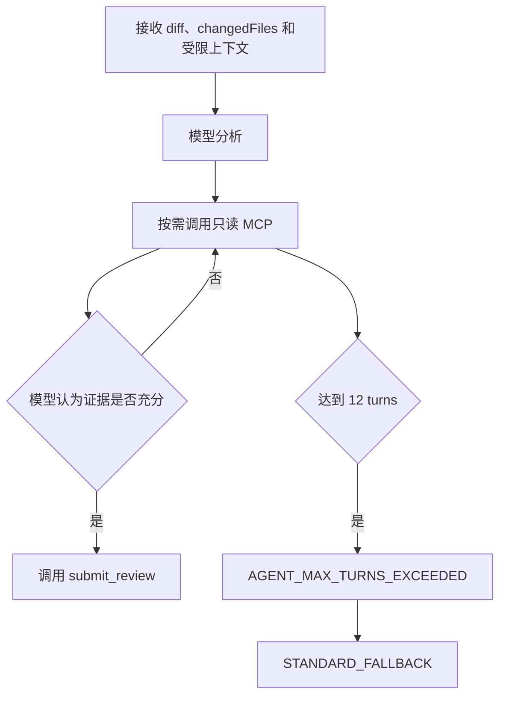
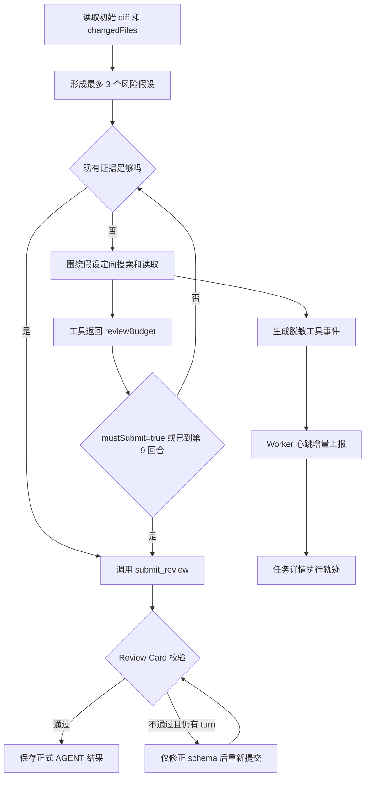
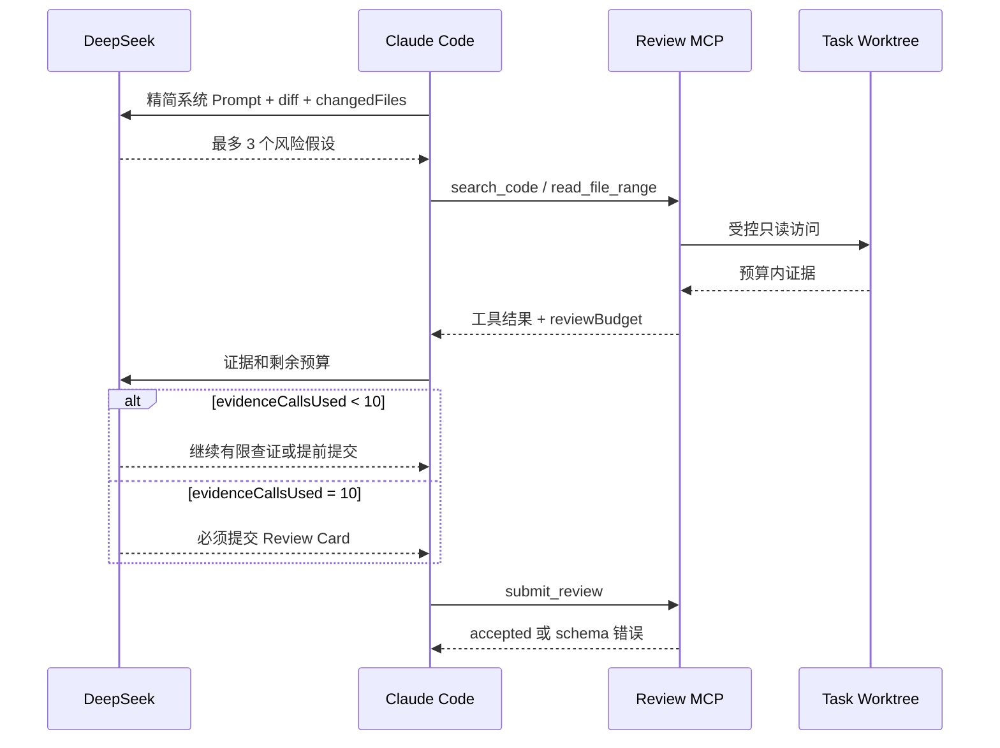
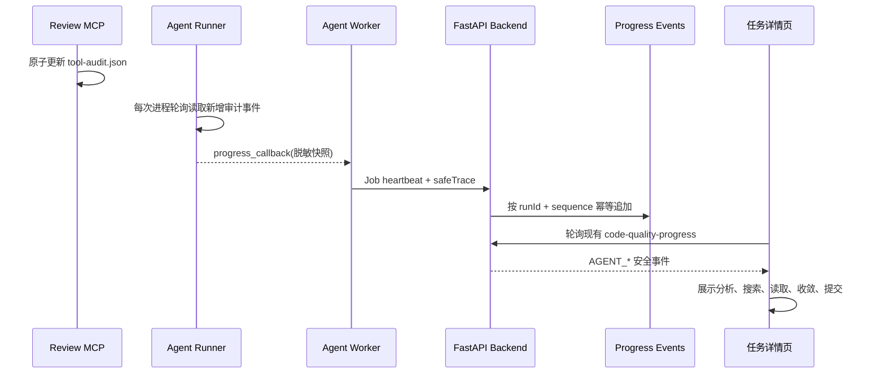

# Agent Review 本地化收敛与脱敏执行轨迹后端概要设计

## 状态

- 文档状态：首次远程任务 `1107` 已验证收敛与提交链路，但暴露生产结果误用 Spike
  `targetFinding` 的缺陷；本地修复与自动化验证已完成，等待重新部署 Agent Worker 并复验。
- 当前目标：先在 1～5 个非敏感变更文件的小型真实任务中完成一次正式 `AGENT` Review，并在任务详情
  展示脱敏执行轨迹；标准 Agent Review 使用 DeepSeek Thinking `high`，不再默认使用 `max`。
- 当前停止点：首次真实任务满足本文验收条件后必须停止，等待用户确认；不得直接扩大到 Run 18 等复杂任务或继续提高预算。
- 关联文档：
  - `docs/41-server-side-readonly-agent-review-plan.md`
  - `docs/42-development-deployment-and-validation-guide.md`
  - `docs/24-bug-log.md` 的 `BUG-20260728-004`

## 1. 需求背景

### 1.1 当前行为

平台 Agent Review 使用 `Claude Code 2.1.112 + DeepSeek deepseek-v4-pro[1m]`，禁用 Claude Code
内置工具，只允许通过任务级只读 MCP 使用 `list_files`、`search_code`、`read_file_range`、
`read_diff_range` 和 `submit_review`。

当前 Runner 还显式设置 `CLAUDE_CODE_EFFORT_LEVEL=max`。DeepSeek 官方 Claude Code 接入示例使用
`max`，但 `max` 面向复杂 Agent 工作负载，会允许单次模型调用使用更高推理强度。平台首次验收只处理
1～5 个变更文件，目标是验证有限取证和结构化提交链路，因此继续默认 `max` 会增加不必要的单轮延迟，
也不利于区分“推理耗时”和“工具检索不收敛”。

当前执行流程已经具备：

- 任务 worktree、敏感路径隔离和受控源码访问；
- 12 turns、40 次工具调用、200000 bytes 源码返回和 600 秒超时的硬预算；
- Review Card schema 校验、正式结果落库、进度展示和 `STANDARD_FALLBACK`；
- `AGENT_MAX_TURNS_EXCEEDED` 等稳定失败码。

但是，当前 Prompt 只要求“核心证据足够后立即停止读取，并为 `submit_review` 保留最终执行预算”，
这属于软提示。模型不知道证据工具的剩余预算，也没有明确的检索阶段上限，仍可能为了补充调用方、
实现、配置和测试证据持续往返。

### 1.2 Run 18 事实与根因

Run 18 的安全摘要如下：

```json
{
  "runId": 18,
  "runnerVersion": "agent-worker-v1",
  "cliVersion": "2.1.112",
  "model": "deepseek-v4-pro[1m]",
  "status": "FAILED",
  "turnCount": 13,
  "toolCallCount": 20,
  "sourceBytesReturned": 32614,
  "diffBytesReturned": 0,
  "durationMs": 171333,
  "fallbackTriggered": true,
  "failureCode": "AGENT_MAX_TURNS_EXCEEDED"
}
```

判断依据：

- `turnCount=13` 是 Claude CLI 在 12 turns 硬上限后记录终止结果事件的表现，12 turns 配置已经生效。
- 工具调用只使用 `20/40`，源码返回约使用 `32614/200000`，执行时长约使用 `171/600` 秒。
- `diffBytesReturned=0` 表示本次 diff 已在初始 Prompt 内联，不代表 diff 缺失。
- 失败发生在工具、源码和时间预算耗尽之前，直接原因是模型没有在 turn 上限前调用
  `submit_review`。

因此，本次问题不是继续增加 turns 可以根治的容量问题，而是 Agent 缺少明确的“先判断、有限查证、
按时提交”收敛协议。

`max` 推理强度可能增加每个模型回合的耗时，但不会直接决定工具调用次数，也不会保证模型更早调用
`submit_review`。因此，本次同时把标准 Review 的推理强度显式改为 `high`，但仍以 Prompt 和工具预算
作为解决不收敛问题的主要机制。

### 1.3 改造目标

本次优化要让服务器侧 Agent 更接近本地 Agent 的自然 Review 行为：

1. 先以 diff 为主要证据完成初步判断。
2. 只对少量、明确的风险假设补充源码证据。
3. 不默认浏览整个项目，不穷举所有审查维度。
4. 证据不足时如实标记，不用持续检索换取“完整感”。
5. 无论是否发现问题，都必须在硬预算前提交有效 Review Card。
6. 页面可以看到 Agent 正在分析、搜索、读取、收敛和提交，但不采集或展示模型原始思维链。

首次验收只证明真实 Agent 主链路能够成功完成，不以复杂任务准确率作为验收前置条件。

### 1.4 改造边界

本次后续实现只允许修改：

- `backend-python/app/agent_review_spike/prompting.py` 的 Agent Prompt；
- `backend-python/app/agent_review_spike/workspace.py` 的工具预算状态；
- `backend-python/app/agent_review_spike/mcp_server.py` 的工具结果预算提示和收敛限制；
- `backend-python/app/agent_review_spike/runner.py` 的默认推理强度和脱敏审计快照回调；
- `backend-python/app/agent_review/worker.py` 的心跳增量上报；
- `backend-python/app/agent_review/service.py` 和 `repository.py` 的轨迹幂等落库；
- `frontend/src/App.jsx` 的 Agent 执行轨迹展示；
- 对应 Runner、MCP、Worker、契约和前端测试。

本次保持不变：

- `maxTurns=12`、`maxToolCalls=40`、`maxSourceBytes=200000`、`timeoutSeconds=600`；
- Claude Code、DeepSeek 模型、Endpoint、Runner 和 Worker 部署架构；
- Review Card schema、数据库表和后端公开 API 路径；
- 敏感路径、路径越界、只读访问和出站网络安全策略；
- Agent 失败后的 `STANDARD_FALLBACK` 行为；
- 不保存 Prompt、源码片段、模型推理或完整模型输出的治理要求。

明确不做：

- 不关闭 DeepSeek Thinking Mode，不把 `high` 降为非思考模式；
- 不把 `temperature`、`top_p`、`presence_penalty` 或 `frequency_penalty` 设计为 Thinking Mode
  调优参数；DeepSeek 官方文档明确这些参数在 Thinking Mode 中不生效；
- 不开放 Bash、Git、Read、Write、Web、子 Agent 或其他 MCP；
- 不采集、保存或展示模型原始 thinking、reasoning、assistant 文本和工具参数原文；
- 不由 Runner 自动编造空 Review Card；
- 不把 Run 18 作为第一次跑通的强制验收任务；
- 不在首次成功前继续提高 turns、工具调用或源码字节预算。

### 1.5 参数默认值与配置归属

本轮实现采用以下默认值。实现代码和测试中的字段必须保留对应中文注释或说明；若后续开放配置页面，
页面也必须展示相同中文说明，避免只展示英文技术名称：

| 配置 | 本轮默认值 | 类型 | 中文说明 | 配置归属 |
| --- | ---: | --- | --- | --- |
| `model` | `deepseek-v4-pro[1m]` | 模型选择 | DeepSeek V4 Pro，使用 1M 上下文模型标识 | DeepSeek/Claude Code |
| `thinkingMode` | `enabled` | 模型推理 | 开启思考模式；本轮不测试关闭思考 | DeepSeek API |
| `reasoningEffort` | `high` | 模型推理 | 标准审查的推理强度；由当前 `max` 显式调整为 `high` | DeepSeek/Claude Code |
| `maxTurns` | `12` | 运行硬限制 | Claude Code 模型决策回合上限 | 平台 Runner |
| `submitByTurn` | `9` | Prompt 软限制 | 最迟开始提交 Review Card 的回合 | 平台 Prompt |
| `maxToolCalls` | `40` | 运行硬限制 | 所有 MCP 工具调用的最终安全上限 | 平台 MCP |
| `maxEvidenceCalls` | `10` | 取证限制 | 搜索、读取源码和读取 diff 的调用上限 | 平台 MCP |
| `convergeAtCalls` | `8` | 收敛阈值 | 从第 8 次证据调用开始要求收敛 | 平台 MCP |
| `maxSourceBytes` | `200000` | 运行硬限制 | 一次任务允许返回给模型的源码总字节数 | 平台 MCP |
| `timeoutSeconds` | `600` | 运行硬限制 | Claude Code 子进程整体执行超时 | 平台 Runner |
| `inlineDiffBytes` | `200000` | 输入限制 | 初始 Prompt 允许直接内联的 diff 字节数 | 平台输入构造 |

默认值设计原则：

- `high` 是 DeepSeek 普通请求公开的默认推理强度，适合作为标准 Agent Review 起点；
- DeepSeek 会把 Claude Code 等复杂 Agent 请求自动识别为 `max`，所以不能只删除环境变量，Runner
  必须显式设置 `CLAUDE_CODE_EFFORT_LEVEL=high`；
- `low`、`medium` 在当前 DeepSeek Thinking Mode 中都会映射为 `high`，不作为独立档位展示；
- `xhigh` 会映射为 `max`，不作为独立档位展示；
- `max` 暂时只保留为后续“深度 Agent Review”候选值，首次真实验收不做 `high/max` 自动切换；
- 模型推理强度和平台收敛预算互相独立：降低 effort 不能替代证据预算，增加 effort 也不能绕过预算。

## 2. 流程设计

### 2.1 当前流程



当前只有总硬预算，没有检索阶段预算。模型可以在 12 turns 内持续扩大搜索范围，直到没有剩余 turn
执行 `submit_review`。

### 2.2 优化后流程



收敛原则：

- diff 优先，源码检索只是针对风险假设的补证据动作；
- 最多保留 3 个风险假设；
- 每个假设最多使用 1 次 `search_code` 和 2 次 `read_file_range`；
- 非提交类证据工具最多正常执行 10 次；
- 第 8 次证据调用开始进入收敛阶段；
- 第 10 次证据调用完成后，下一步必须调用 `submit_review`；
- 最迟第 9 个模型决策回合提交，剩余回合只用于修正 Review Card schema；
- 没有可信 finding 时提交 `findings=[]`，不得以“继续找问题”为由不提交。

### 2.3 工具调用时序



### 2.4 脱敏执行轨迹时序

页面展示的是基于真实工具事件生成的执行轨迹，不是模型的 thinking、reasoning 或完整 assistant
中间回复。工具事件比 Claude CLI 的内部思考轮次更稳定，也能直接解释 turns 消耗在什么操作上。



实时性定义：

- MCP 每次工具调用结束后继续原子写入审计文件；
- Runner 在现有最长 5 秒的子进程等待轮询中读取新增事件；
- Worker 使用现有 15 秒 Job 心跳上报最新脱敏快照；
- 页面沿用现有任务详情轮询，因此提供近实时轨迹，不承诺逐 token 流式展示；
- 任务完成或失败时必须再上报一次最终快照，避免最后一批事件因心跳间隔丢失。

## 3. 数据库与接口设计

### 3.1 数据库

无新增表、无字段变更、无数据迁移。

现有 `agent_review_runs` 继续保存安全聚合指标和 `tool_summary_json` 脱敏工具审计；现有
`code_quality_review_progress_events` 保存可展示的增量轨迹。两张表均不新增字段，不新增 Prompt、
工具返回源码或推理原文持久化。

### 3.2 后端公开接口

无新增公开 API 路径和请求 DTO。现有
`GET /api/review-tasks/{taskId}/code-quality-progress` 响应将以向后兼容方式增加 Agent 进度 phase；
通用进度事件结构 `id / taskId / reviewKey / phase / level / message / detail / createdAt` 不变。

设置接口继续展示：

```json
{
  "budgets": {
    "maxTurns": 12,
    "maxToolCalls": 40,
    "maxSourceBytes": 200000,
    "timeoutSeconds": 600
  }
}
```

10 次证据工具调用属于 Agent 内部收敛策略，不作为可配置项开放，不改变现有 40 次工具调用安全硬上限。

### 3.3 MCP 内部工具结果

所有非提交类工具在现有业务结果之外追加 `reviewBudget`：

```json
{
  "reviewBudget": {
    "phase": "DISCOVERY",
    "evidenceCallsUsed": 3,
    "evidenceCallsRemaining": 7,
    "sourceBytesRemaining": 184320,
    "mustSubmit": false,
    "message": "Only investigate an existing risk hypothesis; submit as soon as evidence is sufficient."
  }
}
```

阶段定义：

| `phase` | 条件 | 行为 |
| --- | --- | --- |
| `DISCOVERY` | `evidenceCallsUsed < 8` | 允许围绕已有风险假设补证据 |
| `CONVERGE` | `8 <= evidenceCallsUsed < 10` | 明确提示停止扩大范围并尽快提交 |
| `SUBMIT` | `evidenceCallsUsed >= 10` | `mustSubmit=true`，不得继续读取源码 |

第 10 次证据工具调用允许正常完成，并返回 `phase=SUBMIT`。从第 11 次证据工具调用开始，MCP
不再访问 worktree，返回稳定错误：

```json
{
  "errorCode": "EVIDENCE_COLLECTION_COMPLETE",
  "message": "Evidence collection is complete. Call submit_review now.",
  "reviewBudget": {
    "phase": "SUBMIT",
    "evidenceCallsUsed": 10,
    "evidenceCallsRemaining": 0,
    "sourceBytesRemaining": 167386,
    "mustSubmit": true
  }
}
```

预算计数规则：

- 证据工具指 `list_files`、`search_code`、`read_file_range` 和 `read_diff_range`；
- 证据工具的成功调用和参数错误调用都计入尝试次数，避免通过重复错误绕过收敛策略；
- 被 `EVIDENCE_COLLECTION_COMPLETE` 拒绝的调用不访问源码，`evidenceCallsUsed` 保持为 10；
- `submit_review` 不消耗证据调用次数，仍计入现有总工具调用审计；
- `submit_review` 在证据调用达到 10 次后仍必须可用，并继续保持只能成功一次；
- 源码字节预算仍使用现有 200000 bytes 硬限制。

### 3.4 页面执行轨迹事件契约

后端把首次出现的脱敏工具事件转换为现有进度事件，不直接向页面暴露 `tool_summary_json`。

新增 phase：

| phase | 触发条件 | 页面文案 |
| --- | --- | --- |
| `AGENT_ANALYZING` | Worker 首次开始运行且尚无工具事件 | Agent 正在分析代码变更 |
| `AGENT_TOOL_ACTIVITY` | 搜索、列表、源码读取或 diff 读取完成 | Agent 正在补充审查证据 |
| `AGENT_CONVERGING` | `reviewBudget.phase` 首次进入 `CONVERGE` | Agent 已停止扩大范围，正在收敛结论 |
| `AGENT_SUBMITTING` | 调用 `submit_review`，或预算进入 `SUBMIT` | Agent 正在提交 Review Card |

`AGENT_TOOL_ACTIVITY.detail` 示例：

```json
{
  "runId": 18,
  "sequence": 4,
  "activity": "READ_FILE_RANGE",
  "status": "SUCCESS",
  "durationMs": 18,
  "itemCount": 80,
  "sourceBytes": 3276,
  "pathSummary": [
    {
      "pathHash": "e81d3d867a364a4f",
      "suffix": ".py",
      "depth": 4
    }
  ],
  "queryHash": null,
  "reviewBudget": {
    "phase": "DISCOVERY",
    "evidenceCallsUsed": 4,
    "evidenceCallsRemaining": 6,
    "sourceBytesRemaining": 178244,
    "mustSubmit": false
  }
}
```

轨迹安全白名单只允许：

- `runId`、单调递增 `sequence`；
- 工具类型映射后的 `activity`，不使用任意模型文本；
- 成功/失败状态、稳定错误码、耗时、条目数和返回字节数；
- 路径哈希、文件后缀和目录深度；
- 查询哈希，不包含查询原文；
- 收敛阶段和剩余预算。

必须丢弃：

- thinking、reasoning、assistant 文本和 result 原文；
- 工具调用参数、搜索词、文件相对路径和绝对路径；
- diff、源码内容、工具返回内容；
- Prompt、项目策略原文、API Key、环境变量和 CLI stderr。

事件幂等键为 `(runId, sequence)`。后端处理心跳前读取已保存审计中的最大 sequence，只追加更大的
事件，再更新 `tool_summary_json`；重复心跳、乱序心跳和完成时最终快照不得产生重复页面事件。

## 4. 详细改动设计

### 4.1 Prompt 分层

Prompt 保持三层职责，避免同一要求在不同位置重复：

1. 系统 Prompt：审查目标、安全边界、收敛协议和提交要求。
2. 用户输入：任务标识、changedFiles、受限基线摘要和 diff。
3. MCP 工具描述与结果：工具用途、参数和实时剩余预算。

项目 Profile 的 `reviewInstructions` 继续作为业务审查约束保留，但不能覆盖以下平台不变量：

- 最多 3 个风险假设；
- 不默认遍历仓库；
- 最迟第 9 回合提交；
- `mustSubmit=true` 后只能提交；
- 无 finding 也必须提交有效 Review Card。

### 4.2 Agent 系统 Prompt 完整草案

```text
你是资深代码审查工程师。只报告本次 diff 引入的、可执行的正确性、安全、数据一致性、
事务、SQL、缓存、MQ、异常处理和关键测试问题。不要报告风格、命名、格式、注释或主观重构建议。
不能编造文件、行号、调用方或运行期状态。

这是只读 Agent Review。所有内置工具均已禁用。只能使用 review MCP 的 list_files、
search_code、read_file_range、read_diff_range 和 submit_review。禁止 Bash、Git、编辑、
Web、其他 MCP 和子 Agent。

请像本地代码审查一样先基于 changedFiles 和 diff 作出判断：
1. 最多形成 3 个需要核实的风险假设，不要穷举所有审查维度。
2. 只有缺少影响结论的关键证据时才检索源码；不要默认调用 list_files 浏览仓库。
3. 每个假设最多执行 1 次 search_code 和 2 次 read_file_range；优先复用已有结果。
4. 核心证据足够后立即停止读取。证据不完整时使用 PARTIAL/INSUFFICIENT 和 LOW/MEDIUM
   confidence，不要为了获得完整上下文持续检索。
5. reviewBudget.phase=CONVERGE 时不得新增风险假设。
6. reviewBudget.mustSubmit=true 时，下一步必须调用 submit_review，不得再调用证据工具。
7. 最迟在第 9 个模型决策回合调用 submit_review，剩余回合只用于修正 Review Card schema。
8. 没有可信问题时也必须提交 overallLevel=LOW、findings=[] 的 Review Card；现有 Review Card
   schema 不包含 PASS 枚举，空 findings 会规范化为 LOW。

每个 finding 的 filePath 必须属于 changedFiles，行号必须对应 diff 中最接近的新增或修改行。
完成判断后必须且只能成功调用一次 submit_review；不要在最终文本中重复源码或完整 Review。
```

### 4.3 工具预算实现

`ToolBudget` 增加仅存在于 Worker 进程内的证据预算状态：

```text
max_evidence_calls = 10
converge_at_evidence_calls = 8
evidence_calls = 0
```

实现约束：

- 现有 `calls` 继续表示全部 MCP 工具调用审计，不改变已有聚合指标语义；
- `begin(tool)` 根据工具名称区分证据工具和 `submit_review`；
- 每个工具响应统一通过一个内部包装函数追加 `reviewBudget`，避免五个工具分别拼装；
- 达到证据上限后的拒绝必须发生在 worktree 访问之前；
- 预算错误只返回稳定码、计数和提示，不返回源码、查询文本或绝对路径；
- `submit_review` 的 schema 校验和原子写入行为保持不变。

### 4.4 脱敏轨迹采集、上报与展示

Runner：

- `run_agent_candidate` 增加可选的 `progress_callback`，默认 `None`，保持现有调用兼容；
- 子进程运行期间沿用 5 秒轮询，读取 `tool-audit.json` 后只传递安全审计结构；
- 仅在最大 `sequence` 增长或阶段变化时调用 callback，避免重复上报；
- callback 异常不得中断 Claude CLI，不得改变 Agent Review 成功或失败判定；
- CLI stdout 仍只解析最终安全 result 元数据，不解析或保留 assistant/thinking 内容；
- CLI stderr 继续仅用于进程排空并丢弃，不保存、不上报。

Worker：

- 为当前 Job 维护线程安全的最新安全快照；
- Runner callback 只更新内存快照，不直接发 HTTP 请求；
- 现有 15 秒 `_heartbeat_loop` 在 `runSummary` 中携带最新 `audit`；
- 完成、失败或取消请求携带最终快照；
- Worker 重启后不恢复内存轨迹，Backend 以已保存 sequence 为准继续保证幂等。

Backend：

- Job heartbeat 对审计字段执行白名单过滤和数量上限校验；
- 单次心跳或完成请求最多接受现有 40 次工具硬预算对应的事件；
- 使用 `(runId, sequence)` 判定新增事件，追加到现有 progress 表；
- `review_key` 使用当前 Agent Run 的 `review_key`，保证多引擎结果页正确过滤；
- 轨迹写入失败不应使 lease 心跳失败，但必须记录不含 payload 的 warn 日志；
- 完成和失败接口复用同一增量处理函数，补写最后一次心跳之后的事件。

Frontend：

- 复用任务详情“执行过程”视图，不新增顶层页签；
- Agent Review 时增加“Agent 执行轨迹”时间线，按 sequence 展示分析、工具活动、收敛和提交；
- 工具活动只展示工具类型、状态、耗时、条目数、字节数、文件类型和预算；
- 不显示查询哈希和路径哈希的具体值；哈希仅用于后端审计和去重；
- 运行中继续沿用现有自动刷新，终态保留完整脱敏轨迹；
- Standard Review 和旧任务没有 Agent 事件时保持当前页面行为。

### 4.5 失败与降级

| 场景 | 行为 |
| --- | --- |
| 第 10 次证据调用完成 | 返回 `mustSubmit=true`，要求下一步提交 |
| 第 11 次及以后继续请求证据 | 返回 `EVIDENCE_COLLECTION_COMPLETE`，不访问源码 |
| Review Card schema 首次校验失败 | 允许模型只修正 schema 后再次调用；不得重新开放证据工具 |
| 仍达到 12 turns | 保持 `AGENT_MAX_TURNS_EXCEEDED` 并进入 `STANDARD_FALLBACK` |
| 未产生结果文件但 CLI 正常退出 | 保持 `AGENT_REVIEW_NOT_SUBMITTED` |
| Agent 成功提交 | 保存正式 `AGENT` 结果，不创建 fallback Job |

不得为了“跑通一次”在 Runner 中自动生成空 Review Card。空结果必须由模型通过 `submit_review`
明确提交并通过 schema 校验。

### 4.6 安全与兼容

- 老任务、老 Run 和已有数据库记录无需迁移。
- Worker 未更新时仍按原逻辑执行；Backend 不依赖新的内部预算字段。
- Worker 更新后，Backend 只接收白名单安全 run summary 和轨迹字段；`reviewBudget` 只保留数值和阶段。
- 所有路径、源码、diff、query 原文和模型推理继续禁止写入运行摘要、日志和数据库。
- 新 Backend 配合旧 Worker 时没有执行轨迹但 Review 行为不受影响；新 Worker 配合旧 Backend 时
  `runSummary.audit` 仍按已有宽松 JSON 请求兼容，旧 Backend 可保存工具摘要但不会生成页面轨迹。
- Agent 失败时继续显式降级，不影响普通 Review 高准确模式。

### 4.7 DeepSeek 公开参数与平台配置边界

DeepSeek V4 同时提供开放权重和托管 API，但两者公开的配置层次不同。

#### 4.7.1 开放权重公开的是模型和自部署能力

DeepSeek 官方已经公开 V4 权重和技术报告。V4 Pro 为 MoE 模型，公开资料给出的规模是 1.6T 总参数、
49B 激活参数，并支持 1M 上下文。使用开放权重自部署时，可以通过 Transformers、vLLM 等运行时配置
并行度、KV Cache、量化、批处理和上下文长度。

这些自部署参数不等于 DeepSeek 托管 API 的请求参数，也不等于 Claude Code 的 turns、工具调用和
任务超时。平台当前调用 DeepSeek 托管 Anthropic API，不自行部署 V4 权重，因此本轮不引入 GPU、
量化、并行度或 KV Cache 配置。

官方参考：

- [DeepSeek V4 Preview Release](https://api-docs.deepseek.com/news/news260424/)
- [DeepSeek V4 Open Weights](https://huggingface.co/collections/deepseek-ai/deepseek-v4)

#### 4.7.2 托管 API 公开的是请求级生成参数

DeepSeek 当前公开且与本项目相关的请求参数包括：

| 参数 | 公开取值或作用 | 本项目处理 |
| --- | --- | --- |
| `model` | `deepseek-v4-pro` / `deepseek-v4-flash` | 固定为 `deepseek-v4-pro[1m]` 的 Claude Code 兼容标识 |
| `thinking.type` | `enabled` / `disabled`，默认开启 | 保持 `enabled` |
| `reasoning_effort` | `high` / `max` | 标准 Review 显式使用 `high` |
| `max_tokens` | 限制单次响应最大生成 token | 本轮不新增平台覆盖值，沿用 Claude Code 与 Provider 行为 |
| `response_format` | `text` / `json_object` | Review Card 继续由 `submit_review` schema 保证，不改为模型直接输出 JSON |
| `stop` | 最多 16 个停止序列 | 本轮不使用，避免截断工具调用或 Review Card |
| `stream` | 是否流式返回 | 继续由 Claude Code 管理 |
| `tools` / `tool_choice` | 工具定义和选择 | 继续由受限 Review MCP 和 Claude Code 管理 |

Thinking Mode 下，`temperature`、`top_p`、`presence_penalty` 和 `frequency_penalty` 即使传入也不
生效，所以不应在平台页面提供看似可调但实际无效的配置。

官方参考：

- [DeepSeek Thinking Mode](https://api-docs.deepseek.com/guides/thinking_mode/)
- [DeepSeek Chat Completion API](https://api-docs.deepseek.com/api/create-chat-completion/)

#### 4.7.3 平台参数仍由平台负责

下列参数不是 DeepSeek 开放权重或托管 API 的原生配置：

- `maxTurns`
- `submitByTurn`
- `maxToolCalls`
- `maxEvidenceCalls`
- `convergeAtCalls`
- `maxSourceBytes`
- `timeoutSeconds`
- `inlineDiffBytes`

它们属于 Code Review 平台的任务治理层，负责无人值守运行的成本、安全、收敛、取消和结构化交付。
即使以后更换为 Codex、其他 CLI Agent 或自部署 DeepSeek，也不能因为底层模型没有同名参数就直接
删除这些平台边界。

## 5. 测试与验收

### 5.1 自动化测试

Runner 配置测试：

- 默认模型保持 `deepseek-v4-pro[1m]`；
- 显式设置 `CLAUDE_CODE_EFFORT_LEVEL=high`，不再设置为 `max`；
- 不传入 Thinking Mode 下无效的 temperature、top_p 或 penalty 参数；
- turns、工具、源码和超时硬预算保持原值。

Prompt 单元测试：

- 包含“最多 3 个风险假设”；
- 包含“不默认调用 `list_files`”；
- 包含 `CONVERGE` 和 `mustSubmit` 行为；
- 包含“最迟第 9 回合提交”；
- 包含无 finding 时提交 `findings=[]`；
- 不放宽现有安全工具限制。

工具预算单元测试：

- 第 1～7 次返回 `DISCOVERY`；
- 第 8～9 次返回 `CONVERGE`；
- 第 10 次返回 `SUBMIT`、`mustSubmit=true`；
- 第 11 次不读取 worktree，返回 `EVIDENCE_COLLECTION_COMPLETE`；
- 参数错误也消耗一次证据尝试；
- 达到证据上限后 `submit_review` 仍可成功一次；
- 第二次成功提交仍返回 `REVIEW_ALREADY_SUBMITTED`；
- 源码字节硬预算和敏感路径限制保持有效。

Runner 回归测试：

- 有效 `submit_review` 生成 Review Card 并返回 `SUCCESS`；
- 没有提交时仍返回 `AGENT_REVIEW_NOT_SUBMITTED`；
- 达到 turn 上限仍稳定返回 `AGENT_MAX_TURNS_EXCEEDED`；
- 审计 sequence 增长时调用 progress callback，重复快照不重复调用；
- callback 收到的数据不包含工具结果、源码、查询原文、assistant 文本或 reasoning；
- callback 抛错不影响 Runner 最终结果；
- 安全摘要不包含 Prompt、源码、模型结果原文或查询文本。

Worker 与后端契约测试：

- Job heartbeat 可以增量携带安全审计快照；
- 相同 `(runId, sequence)` 重复上报只生成一条 progress；
- 完成或失败请求能够补写最后一批事件；
- 非白名单字段、超长事件和源码样例不会写入数据库或响应；
- 轨迹处理异常不导致 Job lease 丢失。

前端验证：

- Agent 任务“执行过程”展示安全时间线和预算阶段；
- 运行中刷新后不重复事件，终态顺序稳定；
- 页面源码和浏览器内容中不出现查询原文、文件路径或代码片段；
- Standard Review 和没有轨迹的旧 Agent 任务正常展示；
- 执行前端构建验证。

最小测试命令：

```powershell
scripts\run-backend.cmd test tests/unit/test_agent_review_spike_runner.py tests/unit/test_agent_review_spike_workspace.py tests/contract/test_agent_review_api_contract.py
scripts\run-frontend.cmd build
```

### 5.2 首次真实任务选择

首次验收任务必须同时满足：

- 真实项目、真实提交或真实 MR；
- 1～5 个 changed files；
- changed files 均不属于 Agent 敏感路径；
- diff 可正常获取，优先选择可内联的小型 diff；
- worktree 已准备且 Agent Worker 内可见；
- 项目组已授权 Agent 源码外发；
- Agent 设置测试成功且 Worker 状态为 `ONLINE`。

首次验收不选择：

- Run 18 原任务；
- 超过 5 个变更文件的任务；
- 包含配置密钥、证书或其他敏感路径的任务；
- diff 缺失、worktree 异常或项目组授权不完整的任务。

### 5.3 首次真实验收步骤

1. 先部署支持轨迹幂等落库的新 Backend，再部署包含 Prompt、MCP 收敛和轨迹上报的新 Agent Worker，
   最后部署新增轨迹展示的 Frontend；数据库无需迁移。
2. 在任务详情或重试入口明确选择 `AGENT`，对选定的小型真实任务触发一次 Review。
3. 等待任务进入终态，不并行重试同一任务。
4. 在任务详情确认正式结果和 Agent 流转可见。
5. 在“执行过程”确认 Agent 工具活动、收敛和提交轨迹按 sequence 展示。
6. 核对安全 Run 摘要和 fallback 状态。
7. 保存 runId、taskId 和安全聚合指标作为验收记录，不保存源码或模型原文。
8. 满足验收标准后停止，不继续执行复杂任务。

### 5.4 验收标准

首次真实任务必须全部满足：

```text
AgentReviewRun.status = SUCCEEDED
effectiveEngine = AGENT
fallbackTriggered = false
failureCode = null
turnCount <= 12
submit_review 成功次数 = 1
Runner 实际 reasoningEffort = high
```

同时确认：

- 结果为合法 Review Card，允许 `findings=[]`；
- 任务详情页展示 Agent Review 结果和完成进度；
- “执行过程”展示至少一条真实 Agent 安全轨迹，且 sequence 无重复、顺序正确；
- 页面不展示模型思维链、assistant 原文、查询原文、文件路径或源码；
- 没有创建“Agent Review 降级 - Standard”调度 Job；
- `toolCallCount`、`sourceBytesReturned` 和 `durationMs` 均在现有硬预算内；
- Worker 实际环境显式使用 `CLAUDE_CODE_EFFORT_LEVEL=high`，不能依赖删除变量后的 Provider 自动值；
- 日志、Run 摘要和数据库中没有 Prompt、源码、查询原文或模型推理。

### 5.5 首次失败处理

若小型真实任务仍失败：

1. 只查看失败码、turn、工具调用、源码字节、耗时和脱敏工具事件。
2. 若仍为 `AGENT_MAX_TURNS_EXCEEDED`，先确认第 8、10 次预算状态是否正确返回，不得直接提高 turns。
3. 若为 `AGENT_REVIEW_NOT_SUBMITTED`，检查 `mustSubmit` 是否进入模型上下文。
4. 若为 schema 错误，优先修正提交字段说明，不重新开放检索预算。
5. 若 Review 成功但页面无轨迹，检查 Runner callback、Worker 最终快照和 Backend sequence 幂等链路；
   不得因此把正式结果改为失败。
6. 若为 Worker、worktree、网络或 CLI 故障，按对应稳定错误码单独修复，不归因于 Prompt。
7. 失败后停止并提交诊断结论，等待用户确认下一步。

### 5.6 本次本地实现记录（2026-07-28）

本次只完成一次“Agent Review 本地化收敛与脱敏执行轨迹”实现阶段：

- 标准 Agent Review 显式使用 `CLAUDE_CODE_EFFORT_LEVEL=high`，DeepSeek Thinking Mode、
  模型和 Endpoint 保持不变。
- Agent Prompt 已增加最多 3 个风险假设、单假设取证次数、`CONVERGE`、`mustSubmit`、
  第 9 回合前提交和空 `findings=[]` 约束。
- MCP 已增加 10 次证据预算、第 8 次收敛、第 10 次提交提示、第 11 次访问前拒绝，以及统一
  `reviewBudget`；`submit_review` 继续独立于证据预算并只能成功一次。
- Runner、Worker 和 Backend 已接通白名单安全快照、心跳/终态增量上报，以及
  `(runId, sequence)` 幂等进度事件；轨迹失败不改变 Review 主结果。
- 任务详情现有“执行过程”已增加 Agent 分析、工具活动、收敛和提交时间线；页面不展示查询哈希、
  路径哈希、源码或模型推理。
- 没有新增数据库表或字段，没有修改公开 API 路径和 Review Card schema；文档草案中的空结果
  `overallLevel=PASS` 已按现有 schema 校正为 `overallLevel=LOW`。

本地验证：

```powershell
scripts\run-backend.cmd test tests/unit/test_agent_review_spike_runner.py tests/unit/test_agent_review_spike_workspace.py tests/unit/test_agent_review_worker.py tests/contract/test_agent_review_api_contract.py
backend-python\.venv\Scripts\python.exe -m ruff check backend-python\app\agent_review_spike\prompting.py backend-python\app\agent_review_spike\workspace.py backend-python\app\agent_review_spike\mcp_server.py backend-python\app\agent_review_spike\runner.py backend-python\app\agent_review\worker.py backend-python\app\agent_review\service.py backend-python\app\agent_review\repository.py backend-python\tests\unit\test_agent_review_spike_runner.py backend-python\tests\unit\test_agent_review_spike_workspace.py backend-python\tests\unit\test_agent_review_worker.py backend-python\tests\contract\test_agent_review_api_contract.py
node --test frontend\tests\agentReviewTrace.test.mjs
scripts\run-frontend.cmd build
```

结果：后端定向测试 `49 passed, 1 skipped`，定向 Ruff 通过，前端纯函数测试 `3 passed`，
前端 production build 通过。
本阶段未读取真实 DeepSeek Key、未执行真实 Agent Review、未部署远程环境、未触发 Run 18。

### 5.7 首次真实任务 1107 的失败与修复设计

远程首次验收 Run 31 已完成 7 次证据调用，并成功调用一次 `submit_review`，说明 Prompt 收敛、
只读取证和提交链路已经生效；但提交后被 Worker 统一标记为 `AGENT_WORKER_ERROR`。

根因是生产 `input_case` 不包含离线评测专用的 `targetFinding`，Runner 却在 Review Card 提交成功后
无条件使用该字段计算 `targetReported`，触发未分类 `KeyError`。Worker 外层异常处理只回传安全审计，
因此 Run 丢失 `turnCount`、`durationMs` 等 Runner 成功摘要并进入普通 Review 降级。

修复边界：

- `targetFinding` 继续只作为离线 Spike / 准确率样本的可选评测字段，不向生产任务伪造目标问题；
- 生产任务没有 `targetFinding` 时跳过命中率计算，Review Card 仍按正式结果成功返回；
- Worker 对未分类异常只记录异常类型和代码位置，不记录异常消息、Prompt、源码、查询或模型原文；
- 增加“无 `targetFinding` 且空 `findings=[]` 成功提交”的生产回归测试；
- 不修改 Prompt、预算、数据库、公开 API、Review Card schema 或 STANDARD Review。

修复后只重新部署 Agent Worker，并选择新的 1～5 文件小任务复验；满足 5.4 后继续遵守首次验收停止点。

本地修复验证：Agent Review 定向测试 `51 passed, 1 skipped`，相关 Python Ruff 和
`git diff --check` 均通过。

## 6. 单阶段落地 Prompt

后续实现 Agent 可直接使用以下 Prompt：

```text
请实现 docs/44-agent-review-local-like-convergence-plan.md，只执行一次“Agent Review 本地化收敛优化”
阶段，不执行真实复杂任务扩展。

必须先阅读 AGENTS.md，并局部读取 docs/44、docs/41 中 Agent 安全边界，以及
backend-python/app/agent_review_spike 下现有 prompting.py、workspace.py、mcp_server.py、
runner.py，backend-python/app/agent_review 下 Worker、心跳和 Repository，以及任务详情现有
“执行过程”前端代码和相关测试。

实现要求：
1. 将标准 Agent Review 的 `CLAUDE_CODE_EFFORT_LEVEL` 从 `max` 显式改为 `high`，保持 Thinking
   Mode 开启；不要仅删除环境变量，也不要增加 Thinking Mode 下无效的采样参数。
2. 保持 maxTurns=12、maxToolCalls=40、maxSourceBytes=200000、timeoutSeconds=600 不变。
3. 按 docs/44 替换 Agent 收敛 Prompt。
4. 增加 10 次证据工具软上限、第 8 次 CONVERGE、第 10 次 SUBMIT 和 reviewBudget。
5. 达到证据上限后禁止继续读取，但 submit_review 必须仍可成功一次。
6. 增加 Runner 脱敏审计回调、Worker 心跳增量上报和 Backend `(runId, sequence)` 幂等进度事件。
7. 在现有任务详情“执行过程”中展示 Agent 分析、工具、收敛和提交轨迹，不展示模型思维链。
8. 不修改数据库结构和公开 API 路径，不保存 Prompt、源码、工具参数、查询或推理原文，不放宽任何
   安全限制。
9. 补齐 reasoning effort、Prompt、工具预算、Runner、Worker、Backend 契约测试并执行前端 build。

授权边界：
- 可以修改 docs/44 明确列出的 Agent Worker、Backend 心跳/进度、任务详情前端和对应测试。
- 不得修改 Provider、模型、Endpoint、公开配置、数据库结构或 STANDARD Review。
- 不得启动真实 Agent Review、部署远程环境或访问真实 DeepSeek Key。
- 如果实现需要超出上述范围，必须停止并向用户说明。

完成代码和本地测试后必须停止，报告改动、原因、测试结果和远程 Worker 部署命令，等待用户自行部署并
按 Backend → Agent Worker → Frontend 顺序发布，再选择 1～5 个文件的小型真实任务验收。未经用户
确认，不得继续 Run 18 或阶段 3B。
```

## 7. 风险与后续停止点

### 7.1 已知风险

- DeepSeek 仍可能忽略 `mustSubmit`，工具约束只能阻止继续读取，不能替模型生成 Review Card。
- `high` 可能在复杂事务、安全或跨模块任务中弱于 `max`，因此首次验收只用于验证小型任务链路；
  是否增加“深度 Agent Review = max”必须在后续使用同任务 A/B 数据决定。
- 10 次证据调用适合首次小型真实任务，不代表复杂 MR 的长期最优预算。
- 第 9 回合属于 Prompt 软边界；真实 turn 由 Claude CLI 统计，最终仍以 12 turns 硬上限为准。
- 页面轨迹是工具级安全活动，不等同于模型逐字思维链，也不能解释没有触发工具的内部判断。
- 心跳和页面轮询会带来秒级延迟，不能作为逐 token 实时调试器。
- 轨迹落库失败不得影响 Review 主结果，排障时需要分别判断“审查失败”和“可观测性缺失”。
- 过度压缩检索可能降低复杂问题的证据完整度，因此本次只验证链路，不据此扩大生产范围。

### 7.2 后续停止点

首次真实任务成功后必须停止。后续工作需由用户另行确认，可能包括：

- 使用 Run 18 作为复杂任务回归样本；
- 基于 changed file 数量和 diff 规模设计动态证据预算；
- 比较 STANDARD 与 AGENT 的 finding 准确性；
- 决定是否进入 `docs/41` 的阶段 3B。
