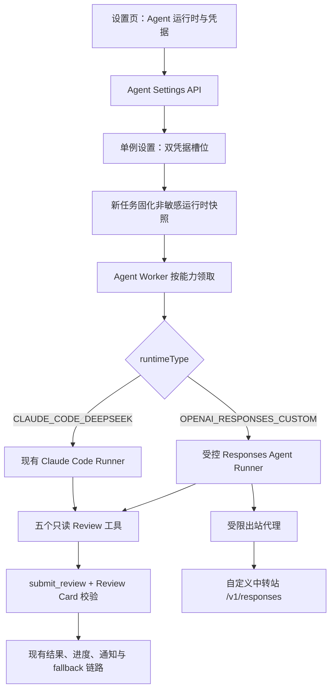
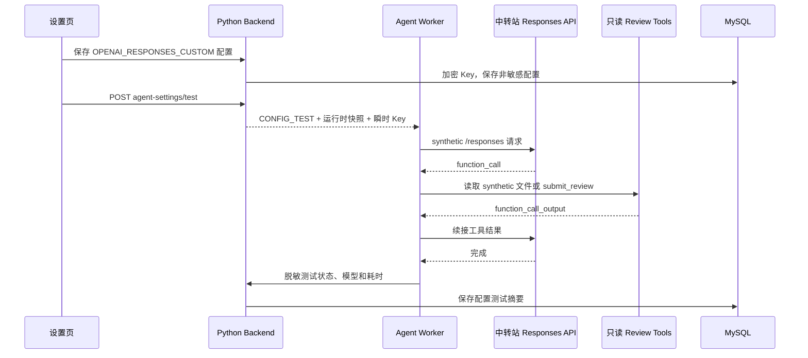

# Agent Review 多运行时与自定义 OpenAI Responses Agent 接入计划

## 1. 状态、结论与停止点

- 文档状态：**阶段一、阶段二、阶段三、阶段四均已完成（2026-08-06）**。自定义 OpenAI Responses Agent 已完成
  协议 Runner、配置闭环、数据库隔离与迁移、中转站 TLS 例外、本地 synthetic、远程部署和实际环境验证。
- 可行性结论：**有条件可行**。平台可以保留现有 `Claude Code + DeepSeek` 为默认运行时，并增加一个
  `OpenAI Responses Agent` 自定义运行时，通过中转站的 Base URL、API Key 和 `gpt-5.6-sol` 执行同一套
  只读 Agent Review。
- 关键前提：中转站必须完整兼容 OpenAI `POST /v1/responses` 的 reasoning、function tools、多轮工具结果续接和
  用量响应；只有 `/v1/chat/completions` 或“能返回普通聊天文本”不满足本专项的 Agent 接入条件。
- 产品口径：API Key 不能直接调用 ChatGPT 网页端的“Agent 产品”。本专项实际接入的是由平台托管工具循环的
  `OpenAI Responses Agent`，界面可显示为“自定义 OpenAI Agent”，不应承诺 ChatGPT 账号、会话、插件或网页端能力。
- 默认行为：数据库迁移、首次部署和未选择自定义配置时，仍使用 `Claude Code + DeepSeek`；不得自动切换现有环境。
- 当前停止点：**53 计划已完成并关闭**。用户已确认远程部署和验证通过；不再继续扩大样本、调整默认运行时、提高预算
  或增加 Provider。后续新增需求应作为独立专项启动。
- 2026-08-12 局部修复：自定义 Agent Base URL 支持 HTTP / HTTPS、IPv4、IPv6 和自定义端口，
  便于连接本机或内网中转站；仍不接受 userinfo、query、fragment 和通配域名。普通 Standard Review
  模型连接不在本次放宽范围内，仍要求 HTTPS。
- 2026-08-12 连接编辑交互优化（改动量等级：中——涉及前端表单、配置测试 API、Worker Claim 快照与数据库
  短期密文字段，但不改变 Review 主链路和对外结果 schema）：连接详情只保留“Agent Review”全局开关，
  去掉单个 Runtime 的可见“启用”开关；保存有效连接时内部标记为可用。“测试配置”可直接使用当前
  表单草稿中的 Base URL、模型、推理强度、TLS 选项和新 Key；测试草稿不覆盖已保存的连接、不切换当前
  Runtime，临时 Key 仅以加密形式等待 Worker 领取，完成或超时后清理。验收为草稿测试 Claim 使用新值而
  Runtime 持久化配置保持不变，且保存、清 Key、当前连接与全局开关回归通过。

## 2. 需求背景与现状

### 2.1 用户目标

设置页需要增加 Agent 运行时选择：

1. `Claude Code + DeepSeek`：现有默认选项，行为和配置继续兼容。
2. `自定义 OpenAI Responses Agent`：选中后展示中转站名称、Base URL、API Key、模型和推理强度等配置，
   目标模型为 `gpt-5.6-sol`。

参考图只作为信息层次和交互参考。首版不照搬多中转站列表、模型映射、Temperature、Top P、频率惩罚、存在惩罚等
全部控件。

### 2.2 当前真实实现

当前 Agent Review 是固定组合，不是普通 Provider 的可换模型调用：

- `backend-python/app/agent_review/repository.py` 固定
  `runner=CLAUDE_CODE / provider=DEEPSEEK / endpoint=https://api.deepseek.com/anthropic /
  model=deepseek-v4-pro[1m]`；
- `backend-python/app/agent_review_spike/runner.py` 启动 Claude Code CLI，通过 `ANTHROPIC_BASE_URL` 和
  `ANTHROPIC_AUTH_TOKEN` 接入 DeepSeek 的 Anthropic 兼容接口；
- Claude Code 只允许调用 `list_files / search_code / read_file_range / read_diff_range / submit_review`
  五个只读 MCP 工具，禁用 Bash、Read、Write、Web 和子 Agent；
- `backend-python/app/agent_review/models.py` 的单例设置只保存一份 Agent Key 和运行预算；
- `backend-python/app/agent_review/worker.py` 的 Claim 契约只传 Key、任务输入和预算，没有运行时快照；
- `frontend/src/App.jsx` 固定显示“Agent Review（Claude Code + DeepSeek）”和“独立 DeepSeek API Key”；
- Agent 出站代理原先只允许 `api.deepseek.com:443`；阶段四按用户确认改为允许 HTTPS 443，实际目标由设置页保存并经
  Backend 安全 URL 校验的 Base URL 决定。

因此本需求至少同时影响设置契约、密钥槽位、Job 快照、Worker 路由、Agent 工具循环、结果元数据和出站边界，
不能只把设置页增加三个输入框。

## 3. 技术路线评估

OpenAI 当前模型说明确认 `gpt-5.6-sol` 支持 Responses、reasoning、function calling 和 structured outputs；
官方迁移指南建议 reasoning、工具调用和多轮工作流优先使用 Responses API，并显式设置 reasoning effort。

参考：

- [GPT-5.6 模型指南](https://developers.openai.com/api/docs/guides/latest-model)
- [GPT-5.6 Sol 模型页](https://developers.openai.com/api/docs/models/gpt-5.6-sol)
- [Function calling 指南](https://developers.openai.com/api/docs/guides/function-calling)

| 路线 | 可行性 | 结论 |
| --- | --- | --- |
| 只把 Claude Code 的模型名改为 `gpt-5.6-sol` | 不可行 | Claude Code 当前走 Anthropic wire protocol；OpenAI 模型名、Responses 工具续接和输出结构不能靠字符串替换获得。 |
| 继续使用 Claude Code，要求中转站伪装 Anthropic API | 条件苛刻 | 仍然是 Claude Code Agent，不是目标 OpenAI Agent；同时把兼容风险转嫁给中转站，不作为本专项方案。 |
| 新增 Codex CLI，自定义 Responses Provider | 技术可行 | Codex 支持自定义 Base URL 和 Responses Provider，但平台还需证明其原生工具能完全关闭、现有八项预算能精确映射；适合作为后续替代实现，不作为首版主路径。 |
| Worker 内实现受控 OpenAI Responses 工具循环 | 可行且推荐 | 每次 Responses 调用、工具调用、预算、取消、审计和 Review Card 提交都由平台控制，最容易保持现有五工具白名单与 fallback 语义。 |
| 复用普通 AI Review 的 Chat Completions Provider | 不满足需求 | 只能形成一次或少量文本生成，不能等价替代当前可检索源码、分页读取 diff、提交 Review Card 的 Agent。 |

首版选择“平台受控 Responses 工具循环”。如果阶段一发现中转站只兼容 Codex CLI 特定流式协议，可重新评估
Codex CLI 适配，但必须先通过同一套工具白名单、预算、脱敏和取消门禁。

## 4. 目标架构



### 4.1 自定义 Agent 执行时序



## 5. 范围与非目标

### 5.1 本专项负责

- 全局 Agent 运行时选择和单个自定义 OpenAI Responses 配置；
- DeepSeek Key 与自定义 Agent Key 两个独立加密槽位；
- 设置、配置测试、Worker 心跳/能力、Job Claim 和 Run 结果契约；
- 受控 Responses 多轮 function tool 循环；
- 复用现有五个只读工具、Review Card schema、运行预算、安全轨迹和 STANDARD fallback；
- Windows 与 Linux Agent Worker 的自定义 HTTP / HTTPS 中转站出站配置；
- React 设置页条件展示、保存、测试、清除和状态反馈；
- 对应数据库迁移、运行时兼容补列、Backend/Worker/Frontend 测试和部署说明。

### 5.2 首版非目标

- 不支持多个自定义中转站、任意数量的模型映射或项目组级 Agent Provider；
- 不把自定义 Agent 自动设为默认，不迁移或删除现有 DeepSeek Key；
- 不复用普通 Review Provider Key，Agent Key 继续独立保存；
- 不开放 Chat Completions-only Agent，不自动降级为普通文本 Review；
- 不开放 Web、Bash、Git、文件写入、子 Agent、Hosted Shell、Computer Use 或中转站内建工具；
- 不开放 Temperature、Top P、frequency/presence penalty、Pro mode、显式缓存和 multi-agent beta；
- 不改变项目组固定 Agent 策略、源码外发授权、STANDARD fallback、通知和 finding schema；
- 不在本专项处理多租户 RBAC、密钥托管服务或 Provider 计费对账。

## 6. 数据结构设计

### 6.1 运行时枚举

```text
AgentRuntimeType = CLAUDE_CODE_DEEPSEEK | OPENAI_RESPONSES_CUSTOM
AgentWireProtocol = ANTHROPIC_COMPATIBLE | OPENAI_RESPONSES
```

`CLAUDE_CODE_DEEPSEEK` 必须是数据库默认值和旧记录回退值。未知值按配置损坏处理，不得猜测或自动切到自定义
中转站。

### 6.2 `code_quality_agent_settings`

沿用单例表，不新增第二套设置表。建议在实施时以当前最新迁移号为准增加以下字段；按本文编写时下一号为
`V47`：

| 字段 | 类型建议 | 说明 |
| --- | --- | --- |
| `runtime_type` | `VARCHAR(32) NOT NULL DEFAULT 'CLAUDE_CODE_DEEPSEEK'` | 新任务使用的 Agent 运行时 |
| `custom_display_name` | `VARCHAR(64) NULL` | 设置页展示名称，不参与路由 |
| `custom_base_url` | `VARCHAR(1024) NULL` | 规范化后的 Responses API Base URL |
| `custom_model` | `VARCHAR(128) NULL` | 首版默认建议 `gpt-5.6-sol`，实际可用性由中转站测试确认 |
| `custom_reasoning_effort` | `VARCHAR(16) NULL` | `none/low/medium/high/xhigh/max`，默认 `high` |
| `custom_tls_verify` | `BOOLEAN NOT NULL DEFAULT TRUE` | V48 新增；仅控制自定义 Responses 请求是否校验 TLS 证书，默认严格校验 |
| `custom_api_key_ciphertext` | `TEXT NULL` | 自定义 Agent Key 的 Fernet 密文 |
| `custom_api_key_fingerprint` | `VARCHAR(32) NULL` | 自定义 Key 的不可逆短指纹 |

现有 `api_key_ciphertext / api_key_fingerprint` 继续专属于 DeepSeek，不改语义。切换运行时不得覆盖、清空或移动
另一槽位的 Key。

### 6.3 Worker 能力

多 Worker 滚动升级时，旧 Worker 不能领取自定义任务。`code_quality_agent_workers` 增加：

| 字段 | 说明 |
| --- | --- |
| `capabilities_json` | 安全枚举数组，例如 `CLAUDE_CODE_DEEPSEEK`、`OPENAI_RESPONSES_CUSTOM` |
| `responses_runner_version` | 平台 Responses Runner 版本；不包含 Base URL 或模型 |

旧 Worker 未上报能力时，只视为支持 `CLAUDE_CODE_DEEPSEEK`。Claim 必须按 Job 的 `runtimeType` 和 Worker 能力
过滤；不得让不支持自定义运行时的 Worker 先领取再失败。

### 6.4 Run 与任务快照

`agent_review_runs` 增加：

| 字段 | 说明 |
| --- | --- |
| `runner_type` | `CLAUDE_CODE` 或 `OPENAI_RESPONSES_AGENT` |
| `provider` | `DEEPSEEK` 或 `CUSTOM_OPENAI` |

继续复用现有 `model / runner_version / cli_version`：Responses Agent 的 `cli_version=null`，
`runner_version=openai-responses-agent-v1`。

新任务在现有 `AgentReviewRun.input_json` 固化非敏感 `runtimeSnapshot`：

```json
{
  "runtimeSnapshot": {
    "runtimeType": "OPENAI_RESPONSES_CUSTOM",
    "wireProtocol": "OPENAI_RESPONSES",
    "displayName": "My OpenAI Relay",
    "baseUrl": "https://relay.example.com/v1",
    "model": "gpt-5.6-sol",
    "reasoningEffort": "high",
    "tlsVerify": true,
    "credentialSlot": "CUSTOM_OPENAI"
  }
}
```

约束：

- 快照不保存 Key、认证头、query 参数或自定义 Header；
- 设置变更只影响新任务；已排队任务继续使用原 Base URL、模型、推理强度和 TLS 校验策略；
- Key 轮换即时生效，Claim 按 `credentialSlot` 解密当前槽位 Key；Key 被清除时旧任务失败并按现有规则 fallback；
- 自定义 Agent 使用稳定 `reviewKey=agent-openai-responses-custom`；现有
  `agent-claude-code-deepseek-v4-pro` 保持不变，便于结果和评估区分；
- API 和前端只展示 Base URL 的 origin/脱敏摘要；任务详情不展示完整中转站路径。

## 7. 设置与内部接口契约

### 7.1 GET Agent Settings

继续使用：

```text
GET /api/code-quality-reviews/agent-settings
```

在现有字段基础上增加：

```json
{
  "enabled": true,
  "selectedRuntime": "CLAUDE_CODE_DEEPSEEK",
  "runtimeOptions": [
    {
      "value": "CLAUDE_CODE_DEEPSEEK",
      "label": "Claude Code + DeepSeek",
      "isDefault": true
    },
    {
      "value": "OPENAI_RESPONSES_CUSTOM",
      "label": "自定义 OpenAI Responses Agent",
      "isDefault": false
    }
  ],
  "defaultRuntime": {
    "provider": "DEEPSEEK",
    "model": "deepseek-v4-pro[1m]",
    "apiKeyConfigured": true
  },
  "customRuntime": {
    "protocol": "OPENAI_RESPONSES",
    "displayName": "My OpenAI Relay",
    "baseUrl": "https://relay.example.com/v1",
    "model": "gpt-5.6-sol",
    "reasoningEffort": "high",
    "tlsVerify": true,
    "apiKeyConfigured": true,
    "apiKeyMasked": "configured:abcd1234",
    "egressAllowed": true,
    "urlSafetyValidated": true,
    "configurationComplete": true
  }
}
```

现有顶层 `runner/provider/endpoint/model/apiKeyConfigured/apiKeyMasked` 在兼容期继续返回当前选中运行时的只读
摘要；新前端使用结构化 `defaultRuntime/customRuntime`，避免继续把顶层 Key 误认为 DeepSeek Key。

### 7.2 PUT Agent Settings

继续使用：

```text
PUT /api/code-quality-reviews/agent-settings
```

自定义配置示例：

```json
{
  "enabled": true,
  "selectedRuntime": "OPENAI_RESPONSES_CUSTOM",
  "customRuntime": {
    "displayName": "My OpenAI Relay",
    "baseUrl": "https://relay.example.com/v1",
    "apiKey": "sk-...",
    "model": "gpt-5.6-sol",
    "reasoningEffort": "high",
    "tlsVerify": true
  }
}
```

更新规则：

- `customRuntime.apiKey` 缺失或为 `null` 表示保留原 Key，空字符串返回 `VALIDATION_ERROR`；
- 只有 `customRuntime.clearApiKey=true` 才清除自定义 Key；如果它是当前运行时，同时把 Agent Review 关闭；
- 现有顶层 `apiKey/clearApiKey` 在兼容期仍只操作 DeepSeek Key；
- `selectedRuntime` 切换不得修改两个 Key 槽位；
- 允许在 `enabled=false` 时保存尚未完成的自定义草稿；启用或选择自定义运行时执行测试前必须配置完整；
- Base URL 接受 HTTP 或 HTTPS，支持域名、IPv4 / IPv6 literal 和自定义端口，便于接入自建、本机或内网中转站；
  仍不接受 userinfo、query、fragment 和通配域名，去除末尾 `/` 后保存；
- 请求路径由 Runner 固定追加 `/responses`。如果用户填写 `.../v1`，实际调用为 `.../v1/responses`；
- Base URL 通过上述安全 URL 校验后即作为页面管理的唯一模型目标，不再要求环境变量白名单；
- 模型名长度不超过 128，不把前端候选列表当作中转站真实模型目录；
- `reasoningEffort` 默认 `high`，以保持当前 DeepSeek Agent 的质量优先基线；上线后再单独比较 `medium`；
- `tlsVerify` 必须是布尔值且默认 `true`；只有用户在页面明确开启“跳过 TLS 证书校验（高风险）”时才保存为
  `false`，并在任务入队时固化到非敏感运行时快照；
- `tlsVerify=false` 只传给自定义 Responses transport，不修改进程、系统 CA、Squid、默认 DeepSeek 或其他 HTTP
  客户端的证书策略；页面以“跳过 TLS 证书校验（高风险）”作为明确标签，不额外展示告警卡片；
- API Key、运行时、非敏感配置和预算在同一事务内校验、保存。

### 7.3 配置测试

继续使用：

```text
POST /api/code-quality-reviews/agent-settings/test
```

测试当前已保存且选中的运行时，不接受请求体临时 Key。自定义测试必须由支持该能力的 Worker 执行完整 synthetic
闭环，而不是 Backend 直接请求一次模型：

1. 检查 Base URL 安全约束与 Worker Responses capability；
2. 使用无生产源码的 synthetic 文件调用 `/responses`；
3. 验证模型能产生 function call；
4. 执行至少一个只读工具并续接 function output；
5. 由模型调用 `submit_review` 提交空 finding Review Card；
6. 只回传运行时、协议、模型、耗时、稳定错误码和成功状态。

设置页交互采用独立的小预算：Worker synthetic 闭环整体超时为 90 秒，前端最多轮询等待 120 秒，为 Worker
领取、终态回传和轮询留出 30 秒余量。该调整不改变真实 Agent Review 任务的项目组运行预算；超过页面等待上限后，
页面停止轮询并提示稍后刷新，Worker 最终状态仍按原契约保存。

响应在现有 `configurationTest` 中增加：

```json
{
  "requestId": "...",
  "status": "SUCCESS",
  "runtimeType": "OPENAI_RESPONSES_CUSTOM",
  "protocol": "OPENAI_RESPONSES",
  "model": "gpt-5.6-sol",
  "durationMs": 12345,
  "message": "OpenAI Responses Agent + read-only tools connectivity succeeded"
}
```

### 7.4 Worker 内部契约

Worker heartbeat 增加：

```json
{
  "capabilities": ["CLAUDE_CODE_DEEPSEEK", "OPENAI_RESPONSES_CUSTOM"],
  "responsesRunnerVersion": "openai-responses-agent-v1"
}
```

普通 Job Claim 增加：

```json
{
  "runtime": {
    "runtimeType": "OPENAI_RESPONSES_CUSTOM",
    "wireProtocol": "OPENAI_RESPONSES",
    "baseUrl": "https://relay.example.com/v1",
    "model": "gpt-5.6-sol",
    "reasoningEffort": "high",
    "apiKey": "瞬时明文"
  }
}
```

明文 Key 仍只存在于受 Worker Token 保护的 Claim 响应和 Agent 子执行上下文；访问日志、异常、Run、progress、
配置测试结果和模型请求调试信息不得记录它。

## 8. Responses Agent Runner 设计

### 8.1 Runner 抽象

在 `backend-python/app/agent_review_spike/runner.py` 外增加运行时分派，避免继续扩大 Claude 专用函数：

```text
AgentRunner
  ├─ ClaudeCodeDeepSeekRunner      # 复用现有实现
  └─ OpenAIResponsesAgentRunner    # 新增
```

`backend-python/app/agent_review_spike/mcp_server.py` 当前把工具业务和 MCP JSON-RPC 包装放在同一个类中。
实施时提取共享 `ReviewToolExecutor`：

- MCP Adapter 继续为 Claude Code 返回 MCP `content`；
- Responses Adapter 把同一结果转换为 `function_call_output`；
- 路径校验、敏感目录拒绝、ToolBudget、审计、Review Card schema 和原子结果文件只能保留一份实现。

### 8.2 Responses 请求循环

首轮请求由 Runner 组装：

```json
{
  "model": "gpt-5.6-sol",
  "instructions": "现有 Agent Review system prompt",
  "input": "任务输入",
  "reasoning": {"effort": "high"},
  "tools": ["五个 function tools"],
  "parallel_tool_calls": false,
  "store": false
}
```

运行规则：

1. 每次 `/responses` 响应计为一个模型决策回合，严格执行 `maxTurns` 和 `submitByTurn`；
2. 只接受声明过的 function tool；未知 hosted tool、MCP tool、web、shell 或 computer-use item 立即稳定失败；
3. function arguments 必须是合法 JSON object，再交给共享 `ReviewToolExecutor`；
4. 同一响应出现多个 function calls 时按返回顺序串行执行，每次都消耗 ToolBudget；
5. 续接必须保留响应中的 tool/reasoning item 和 call id。`store=false` 时需要中转站支持必要的加密 reasoning
   回放；阶段一协议测试未通过则不得上线；
6. 只有 `submit_review` 已生成并通过 schema 的结果文件才算成功；普通 assistant message 不能替代提交；
7. 每轮之间检查取消标记和整体 deadline；HTTP 超时不得超过剩余 `timeoutSeconds`；
8. 用量只累计数字白名单，不保存 response body、reasoning、tool arguments、源码或中转站错误原文；
9. 429、5xx 和网络错误只在整体 deadline 内按固定小次数退避；认证、模型不存在、协议不兼容不重试；
10. 保持现有失败后 `STANDARD_FALLBACK`，不得自动改走 Chat Completions。

### 8.3 协议兼容门禁

中转站必须通过以下测试才标记为可用：

| 门禁 | 必须满足 |
| --- | --- |
| Endpoint | `POST {baseUrl}/responses` 存在，不依赖官方 OpenAI 域名 |
| Model | 接受配置的 `gpt-5.6-sol`，或用户明确填写中转站实际别名 |
| Reasoning | 接受 `reasoning.effort=high` 并返回合法 Responses 对象 |
| Tools | 返回带稳定 `call_id` 的 function call |
| Continuation | 接受 function output 并继续生成下一轮 |
| Stateless safety | `store=false` 路径能够完成工具循环；需要 replay 的 reasoning item 可被安全续接 |
| Output | 最终能够调用 `submit_review`，而不是只输出文本 JSON |
| Usage | 用量字段缺失时可安全降级为“未知”，但结构错误不得伪造数字 |

如果中转站只有 Chat Completions、把 tool call 降级为文本、吞掉 call id、拒绝 reasoning replay 或强制使用内建
Web/Shell，则结论为“不兼容 Agent Review”；该 Key 仍可单独配置为普通 Review Provider，但不进入本专项。

### 8.4 稳定错误码

至少增加：

```text
AGENT_CUSTOM_CONFIG_INCOMPLETE
AGENT_RESPONSES_UNSUPPORTED
AGENT_RESPONSES_PROTOCOL_INVALID
AGENT_CUSTOM_AUTH_FAILED
AGENT_CUSTOM_MODEL_UNAVAILABLE
AGENT_CUSTOM_RATE_LIMITED
AGENT_CUSTOM_NETWORK_ERROR
AGENT_CUSTOM_TOOL_CALL_INVALID
```

页面和日志只展示稳定错误码与固定中文说明。中转站返回的 HTML、JSON body、请求 ID、认证头和原始异常不得直接
写入数据库或前端。

## 9. 出站、安全与凭据边界

### 9.1 页面目标与代理出站边界

阶段四按用户确认移除 `AGENT_REVIEW_CUSTOM_EGRESS_HOSTS` 环境白名单，以设置页保存的 Base URL 为唯一模型目标：

- Backend 对自定义 Agent Base URL 接受 HTTP / HTTPS、DNS hostname、IPv4 / IPv6 和自定义端口，
  拒绝通配符、userinfo、query 和 fragment；普通 Standard Review 模型连接仍仅接受 HTTPS；
- Base URL、模型和运行时固化进 Job 快照，Worker 不接受任务外临时 URL，也不向模型开放网络工具；
- Windows 与 Linux Squid 允许 HTTPS CONNECT 443 及非 CONNECT 的 HTTP 1-65535 端口；Windows 另允许
  `host.docker.internal:8090` 回连本地 Backend；
- 设置页保存新 Base URL 后无需重建或重启 Backend、代理和 Worker；
- 该选择扩大了代理可连接的目标与端口范围，安全边界从“运维域名白名单”调整为“页面权限 + Backend URL 校验
  + 任务快照 + Worker 无网络工具”。

### 9.2 凭据与数据

- 两个 Key 均复用 `AGENT_REVIEW_CONFIG_ENCRYPTION_KEY` 的 Fernet 认证加密；
- Key 不进入环境文件、Compose、镜像层、命令参数、Prompt、日志、progress、Run 或前端状态；
- Runner 只构造标准 `Authorization: Bearer`，首版不开放任意 Header，避免把设置页变成通用 SSRF/凭据转发器；
- Base URL 不允许 query 和 userinfo，防止凭据或租户 token 被嵌入 URL 并写入快照；
- 使用 HTTP 时 API Key、源码片段和 diff 不具备传输加密，只应配置在用户明确信任且网络边界受控的
  本机或内网中转站；公网中转站仍应使用 HTTPS；
- 继续沿用项目组源码外发授权。自定义中转站属于新的数据接收方，首次启用时页面必须明确提示源码片段和 diff
  会发送到该 Base URL；
- 不保存模型 reasoning、原始 Responses payload 或中转站响应正文；
- 配置测试只能使用 synthetic 文件，不得为了测试连通性读取生产任务、仓库或历史 diff。

## 10. 前端设计

设置页现有折叠项改为通用标题“Agent Review”，内部按以下顺序展示：

1. 全局启用开关；
2. `Agent 运行时` 下拉框；
3. 当前运行时配置卡；
4. 保存、测试配置和清除对应 Key；
5. 现有 Agent 执行预算；
6. Worker Pool 和队列状态保持现有展示。

选项：

```text
Claude Code + DeepSeek（默认）
自定义 OpenAI Responses Agent
```

选择默认运行时时：

- 展示当前 DeepSeek 模型、Endpoint、Key 状态和现有 Key 输入；
- 文案和行为保持兼容，不要求重新填写 Key。

选择自定义运行时时展示：

| 控件 | 首版行为 |
| --- | --- |
| 配置名称 | 可选，默认“Custom OpenAI Agent”，只用于展示 |
| 协议 | 只读 `OpenAI Responses`，不可切换 Chat Completions |
| Base URL | 必填，例如 `https://relay.example.com/v1` |
| API Key | Password 输入；已配置时留空保持原值 |
| 模型 | 必填文本/可搜索输入，默认建议 `gpt-5.6-sol` |
| 推理强度 | 下拉，默认 `high`；候选值由 Backend 返回 |
| URL 状态 | `安全校验通过 / 配置未完成` |
| 配置测试状态 | 未运行、排队、运行、成功、失败、超时 |

参考图中的模型映射、Temperature、Top P、惩罚参数和最大输出 Tokens 首版不提供：

- 当前需求只有一个目标模型，不需要多映射管理；
- Agent 的成本和收敛继续由现有 turns、tools、bytes、timeout、evidence 等平台预算控制；
- GPT-5.6 reasoning/tool 工作流应显式控制 reasoning effort，不应照搬普通 Chat Completions 的采样参数；
- 后续只有代表性任务验证证明某参数必要且中转站协议一致时，才单独设计。

保存提示必须说明“配置只影响新建任务；已排队和运行中任务使用入队快照”。切换运行时时若对应 Key 未配置、
出站未允许或没有支持该能力的在线 Worker，启用按钮应禁用并给出明确原因。

## 11. 兼容、降级与发布顺序

### 11.1 历史兼容

- 旧设置记录无 `runtime_type` 时视为 `CLAUDE_CODE_DEEPSEEK`；
- 旧 Worker 无 capabilities 时只领取 Claude + DeepSeek Job；
- 旧 Run 无 `runner_type/provider` 时按现有 `reviewKey/model` 推断展示，不回写历史数据；
- 旧前端继续可用顶层兼容字段，但不能配置自定义运行时；
- 新 Backend + 旧 Worker 不调度自定义 Job；新 Worker + 旧 Backend 只执行旧 Claim 契约；
- 已排队自定义任务在 Key 被清除、Worker 能力消失或中转站不可用时记录稳定原因并走现有 fallback。

### 11.2 部署顺序

```text
Backend（迁移 + 双契约）
  -> Agent egress proxy（增加运维白名单能力）
  -> Agent Worker（上报 capability + Responses Runner）
  -> Frontend（开放选择与配置）
```

Frontend 不得先于支持双契约的 Backend 上线；选择自定义运行时前，至少一个在线 Worker 必须上报
`OPENAI_RESPONSES_CUSTOM`。

## 12. 分阶段实施计划

### 12.1 阶段一：Responses 协议与安全 Runner Spike

目标：证明平台能够在不放宽五工具、安全预算和脱敏边界的前提下完成 OpenAI Responses Agent 循环。

范围：

- 新增 Responses Runner 和共享 ReviewToolExecutor；
- 使用 mock Responses 服务覆盖 function call、续接、提交、取消、超时、预算和错误码；
- 提供只接受 synthetic 输入的本地/内部协议验证入口；
- 核对 `gpt-5.6-sol + reasoning.effort=high + store=false` 的中转站兼容要求。

非目标：

- 不增加数据库字段、公开设置 API 或前端控件；
- 不改变生产 Job 路由，不部署，不使用真实 Key，不执行真实仓库 Review。

验收：

- mock 至少完成两轮 function call 后调用 `submit_review`；
- 八项预算、取消、deadline、工具白名单和 Review Card schema 全部生效；
- response body、reasoning、源码、tool arguments 和 Key 不进入摘要或日志；
- 定向 Python 单测和 Ruff 通过。

授权边界：只允许修改 Responses Runner、共享工具执行层、synthetic 验证代码、本文和对应测试。

停止点：本地 mock 验证后停止。若需要真实中转站协议测试，必须由用户提供环境配置并明确允许一次无源码 synthetic
测试；未通过完整门禁时不得进入阶段二。

阶段一实施结果（2026-08-05）：

- 已新增 `ReviewToolExecutor`，将五工具定义、路径与敏感文件限制、八项运行预算中的工具预算、审计、Review Card
  schema 和原子结果写入从 MCP JSON-RPC 包装中抽出；现有 Claude Code MCP 与 Responses Runner 共用同一执行层；
- 已新增 `OpenAIResponsesAgentRunner`，固定使用 function tools、`parallel_tool_calls=false`、`store=false` 和
  `include=[reasoning.encrypted_content]`，显式回放 reasoning/function-call item、call id 与 function output；
- 已实现模型回合、提交回合、整体 deadline、取消、HTTP 剩余超时、429/5xx 有界重试、五工具白名单、重复 call id
  拒绝、超大 diff 分页和稳定错误码；失败摘要不保存 response body、reasoning、源码、tool arguments、API Key 或
  中转站原始错误体；
- 已新增纯进程内 synthetic 入口，未读取 API Key、未访问网络、未使用真实仓库源码；mock 在两轮取证后第三轮调用
  `submit_review`，结果为 `PASS / turnCount=3 / toolCallCount=3 / reviewSubmitted=true`；
- 定向回归：`52 passed, 1 skipped`；跳过项是 Windows 无符号链接能力时的既有安全测试；本阶段文件 Ruff
  `--no-cache` 检查通过；
- 全量 `scripts/run-backend.cmd lint` 仍被 5 个本阶段外的既有未使用导入/变量问题阻塞，本阶段未越权修改这些文件；
- 用户已在阶段授权前确认中转站支持 Responses 协议；本阶段未使用真实中转站地址或 Key 发起请求，真实中转站
  synthetic 联调仍需单独明确授权。

### 12.2 阶段二：设置、双凭据、能力调度与前端闭环

目标：实现用户可见的运行时选择和完整生产契约，同时保持默认 Claude + DeepSeek 行为不变。

范围：

- 先更新本文状态和 `docs/42` 的新增操作设计，再增加迁移与运行时兼容补列；
- 实现双 Key、GET/PUT/test 契约、运行时快照和稳定 reviewKey；
- 实现 Worker capability、按能力 Claim、Responses Job 路由和安全结果元数据；
- 实现受限出站代理、Compose/脚本和 React 设置页；
- 补齐 Backend contract/unit、Worker、Frontend 纯函数/交互测试和 production build。

非目标：

- 不使用真实中转站 Key，不远程部署，不执行真实 Agent Review；
- 不增加多个中转站、项目组覆盖、采样参数、Pro 或 multi-agent；
- 不更改默认运行时和现有 DeepSeek 配置。

验收：

- 干净库和历史库均迁移成功，旧记录默认 Claude + DeepSeek；
- 两个 Key 可独立保存、保留、清除、轮换，API 和日志不泄漏明文；
- 配置变更不影响已排队任务，混合版本 Worker 不错误领取自定义任务；
- 自定义配置不完整、Base URL 不安全或 Worker 不支持时无法启用；
- 定向 Python 测试、前端 Node 测试、`scripts/run-frontend.cmd build` 和 Compose 配置校验通过；
- 最终 diff 不含真实 Key、中转站凭据、源码、diff、查询或模型 reasoning。

授权边界：允许修改本文列出的 Python Backend、Agent Worker、React、迁移、部署脚本/Compose、`docs/42` 和
对应测试；不允许部署或调用真实模型。

停止点：代码、本地自动化和 build 完成后停止，等待用户确认数据库隔离与迁移治理阶段。

阶段二实施结果（2026-08-06）：

- 已新增 `V47__agent_review_custom_openai_runtime.sql`，旧设置、旧 Worker 和旧 Run 均以
  `CLAUDE_CODE_DEEPSEEK` / `CLAUDE_CODE` 默认值兼容；两套 Key 使用独立密文与指纹槽位；
- 设置接口已支持结构化运行时选择、自定义 Base URL / model / reasoning effort、独立 Key 的保留、清除与轮换，
  并在启用自定义运行时前校验安全 HTTPS URL 和在线 Worker capability；
- 入队任务已固化不含 Key 的运行时快照、稳定 reviewKey、runner/provider/model；Claim 和配置测试按 Worker
  capability 过滤，旧 Worker 仅被视为支持默认 Claude Code 运行时；
- Worker 已在同一只读工具与预算边界内路由 `OPENAI_RESPONSES_AGENT`，心跳上报 capability 和 Runner 版本，
  完成结果沿用现有 Review Card 与结果/进度闭环；
- Linux Squid 入口、Windows Worker 脚本和三套 Compose 最初实现了精确 DNS hostname 白名单；阶段四按用户确认
  调整为仅限定 CONNECT 443，页面 Base URL 作为任务实际目标；
- React 设置页已增加默认/自定义运行时选项和条件配置区，展示出站、Worker、配置完整性与源码外发提示；默认
  Claude Code + DeepSeek 行为及独立 Key 保持不变；
- 阶段相关 Python 契约/单元测试最终 `117 passed`，扩大 Agent/Command Center 回归此前为
  `172 passed, 1 skipped`；Frontend Node 测试 `160 passed`，production build 通过（仅保留既有 chunk 大小警告）；
- 三套 Compose 配置校验和 PowerShell 脚本解析通过；Windows 环境中的 Bash 服务因 `E_ACCESSDENIED` 无法执行
  `bash -n`，已由代理脚本源结构测试覆盖；定向 Ruff 校验通过；
- 全量 Python 回归为 `489 passed, 1 skipped, 4 failed`，4 个失败隔离复跑后仍失败，均位于本阶段未修改的
  Fix Preview、Provider mock、Push Gate 和新项目 AI Profile 既有路径；全量 Ruff 的 5 个失败也均为本阶段外的
  既有未使用代码问题。本阶段未扩大范围处理这些基线问题；
- 未读取真实 API Key、未请求真实中转站或模型、未部署、未执行真实仓库 Review，符合本阶段授权边界。

### 12.3 阶段三：数据库隔离、版本迁移治理与一次性本地数据迁移

目标：将 Windows 本地 Backend 从测试线数据库彻底解耦，同时建立可审计、可重复的双环境 schema 同步机制；
测试线业务数据只按需单向复制到本地并脱敏，不建立双向实时数据同步。

阶段拆分：

#### 12.3.1 阶段三 A：迁移工具与双环境契约

范围：

- 升级 `backend-python/app/migrate.py`，增加 `schema_migrations` 版本、描述、checksum、执行时间和应用时间记录；
- 为已有数据库设计一次性 baseline/reconcile，核对并补齐 V1～V47 实际 schema，之后从下一迁移号开始只执行尚未登记且
  checksum 一致的 forward-only 迁移；
- 增加迁移锁、目标库预检、当前版本/待执行版本展示、dry-run、执行后 schema/version 校验和失败退出；
- 把运行时 `ensure_*_schema()` 视为过渡兼容层，新增 schema 变化必须先落版本化迁移，不再只依赖接口访问时临时 DDL；
- 提供按目标选择的数据库操作脚本。应用正常启动只加载本地运行库；测试线连接信息不自动进入 Backend 运行时；
- 本地数据库变量使用独立、忽略提交的环境文件；原测试线 JDBC URL 必须保留在独立、受保护、忽略提交的测试线环境文件
  中，并连同对应用户名/密码继续作为后续同步目标，不得被新的本地 `DATABASE_URL` 覆盖或丢失；
- 后续每个 schema、索引、内置基准数据或登记的一次性数据修复，都由同一版本化迁移先应用本地库并验证，再在备份、
  dry-run 和用户明确确认后应用测试线库；两边最终必须具有相同 version/checksum；
- 数据库脚本和日志不得输出 JDBC URL 中的认证信息、用户名、密码或查询参数。

建议的本地秘密文件边界：

```text
.local/database.local.env    # 本地 DATABASE_URL，只供本地 Backend 和本地迁移
.local/database.test.env     # 保留原测试线 MYSQL_URL（JDBC URL）、MYSQL_USERNAME、MYSQL_PASSWORD
```

实际文件名可在实施时按现有脚本兼容性调整，但两个目标必须物理分离、均加入忽略规则；`database.test.env` 不得被
`run-backend-python.ps1` 自动加载，只能在显式选择测试线目标时读取。

非目标：

- 本小阶段不连接任何真实数据库，不导出、导入或修改测试线数据；
- 不把测试线 JDBC URL、账号或密码写入仓库、计划文档、终端输出或迁移记录；
- 不自动对两套数据库同时执行 DDL，不在应用启动或普通接口请求中静默修改测试线；
- 不引入双向数据复制、binlog 同步或让本地运行数据回写测试线。

验收：

- 空库、已有历史库和重复执行均有自动化测试；已执行迁移不会重复执行，迁移文件被篡改时 checksum 校验失败；
- 可以分别查看本地/测试线的当前版本与待执行列表，dry-run 不产生数据库变更；
- 目标选择错误、凭据缺失、目标库身份不匹配或测试线未显式授权时拒绝执行；
- 测试线 JDBC URL 在切换本地数据库后仍完整保留，但不会被本地 Backend 或 Worker 自动使用；
- 迁移操作输出“目标、版本、耗时、结果”，不输出连接串和凭据。

授权边界：当前用户确认只授权把本阶段写入计划。后续开始阶段三 A 时，可在再次启动该阶段后修改迁移程序、脚本、
测试和对应文档，但仍不授权连接、读取或修改真实本地/测试线数据库。

停止点：迁移工具及自动化验证完成后必须停止。用户已报告本地数据库变量配置完成，但尚未授权读取配置或连接目标库；
下一步先经明确确认执行只读身份/schema 预检并汇报，之后还需再次确认才能进入阶段三 B。不得因为测试线 JDBC URL
已保留而自动执行任何数据库操作。

阶段三 A 实施结果（2026-08-06）：

- `app.migrate` 已增加 `schema_migrations` 账本、SHA-256 checksum、连续版本校验、MySQL `GET_LOCK` 迁移锁、
  `status / dry-run / baseline / apply / verify` 动作和脱敏失败出口；Docker/现有 `python -m app.migrate` 默认仍为
  `apply`；
- 空库按 V1～V47 顺序执行并逐版本登记；已有 `review_tasks` 但没有账本的数据库拒绝自动重放历史 SQL，只有实际
  表、列和命名索引满足 V47 结构基线后，才允许显式 baseline；
- 已应用迁移的 script name 或 checksum 与仓库不一致、版本缺失/重复、存在待执行迁移或账本缺失时，分别由
  status/verify 给出稳定拒绝结果；历史库缺失项只报告对象名，不自动执行推测性 reconcile；
- 已新增 `database_targets` 和 `database_migration_cli`，固定读取 Git 忽略的 `database.local.env` 与
  `database.test.env`，校验 `DATABASE_TARGET`、MySQL URL、host/port/schema 身份不同，并且所有输出隐藏用户名、
  密码和完整 URL；
- 已新增 `run-database-migration.cmd/.ps1`。测试线 `baseline/apply` 在创建数据库连接前强制要求
  `-ConfirmTest`；普通本地 Backend 仍未切换为自动加载新文件，避免在完成数据迁移前改变运行目标；
- 迁移/目标专项测试最终 `20 passed`；全部 Backend unit 为 `235 passed, 1 skipped`；Agent 契约与迁移组合为
  `82 passed`；定向 Ruff 和 PowerShell 解析通过；
- 自动化只使用临时环境文件和纯内存 MySQL stub，没有加载 `database.local.env/database.test.env`、连接真实数据库、
  创建账本、执行 DDL/DML、导出或导入数据。

阶段三真实数据库只读预检结果（2026-08-06）：

- 本地目标为 `127.0.0.1:3306/ai_code_review_local`，MySQL `8.0.45`，数据库已由用户创建，当前表数量为 `0`，
  `schema_migrations` 不存在，待执行 V1～V47；
- 测试线目标为独立主机/schema，MySQL `5.7.31`；核心历史表、V47 字段均存在，但没有 `schema_migrations`；
- 初次基线解析曾把 V31 已 `DROP INDEX` 的两个旧唯一索引误列为缺失；已修正为按 ALTER 事件顺序处理 ADD/DROP 并补
  回归测试，修正过程未修改数据库；
- 修正后测试线缺失对象共 `36` 个，全部是命名索引，缺失表 `0`、缺失字段 `0`；因此当前禁止直接 baseline；
- 两次 `status` 及补充查询均为只读。未创建本地表、未修复测试线索引、未登记 baseline、未读取业务行或敏感字段。

阶段三 B 写入前准备结果（2026-08-06）：

- 已从 V1～V47 最终状态解析索引名称、列顺序、唯一性和来源版本，并正确处理 V31 的旧索引 DROP/替换；
- 测试线缺失 36 个索引，涉及表的最大单表约 `2.6 MB`；其中 4 个唯一索引只执行聚合重复检查，全部为 `CLEAR`，
  当前没有因重复数据阻断的索引；
- 测试线共 32 张表，估算约 `19,459` 行、数据约 `129,171,456` bytes、索引约 `2,686,976` bytes；最大空间来自
  MR webhook、规则 Review 结果、AI Review 结果和进度事件，适合使用单事务 quick 流式复制；
- 已新增 baseline reconcile plan/apply 工具；apply 固定 `ALGORITHM=INPLACE, LOCK=NONE`，本地需要写确认，测试线需要
  写确认和测试线二次确认，唯一索引重复时在首条 DDL 前整体拒绝；
- 已新增测试线到本地 copy plan/apply 工具，要求本地 0 表，使用 MySQL `8.0.45` 客户端从测试线 `5.7.31` 单事务
  流式导入本地 `8.0.45`，不落持久化 dump；凭据通过执行期临时 option 文件传递并在结束后删除；
- 本地导入后的清理覆盖 Provider/Agent Key、Webhook、通知目标/响应、Worker、Scheduler Job、配置测试状态和所有自动
  触发开关；保留已完成任务、Review/source 历史和结果用于复现，apply 因此额外要求源码数据确认；
- 当前只运行了 reconcile plan、copy plan 和 information_schema/唯一键聚合查询；没有执行 subprocess dump、DDL、
  DML、baseline、数据复制或测试线写操作。

阶段三 B 本地迁移写入结果（2026-08-06）：

- 经用户明确确认后，从测试线 32 张表以单事务 quick 模式流式复制约 `19,459` 行到空的本地库；命令成功退出，
  未落持久化 dump，测试线连接仅用于一致性读取；
- 导入事务随后只在本地执行副作用清理，覆盖 10 类表：清除 Provider/Agent Key、Webhook、通知请求/响应和 Worker、
  Scheduler Job，关闭 Review/通知/项目组自动触发，并把迁移时仍为 PENDING/RUNNING 的 Agent run 标记为本地取消；
- 本地补齐 36 个命名索引，其中 4 个唯一索引在执行前均确认无重复；全部 DDL 成功，测试线的 36 个缺失索引未修改；
- 本地已登记 V1～V47 baseline；随后 `verify` 和只读 `status` 均返回 `current=V47 pending=none ledger=present`；
- 本批操作没有向测试线执行 DDL/DML、baseline、删除或覆盖。测试线仍没有 `schema_migrations`，其后续
  reconcile/baseline 必须在备份、维护窗口和用户单独确认后执行；
- 本批数据库写入完成时尚未切换本地 Backend，也未执行健康接口、任务页面和 Windows Worker Pool 隔离验收；随后
  已按用户下一次确认完成该停止单元，结果见下。

阶段三 B 本地运行时隔离验收结果（2026-08-06）：

- `run-backend-python.ps1` 的 `dev/migrate` 动作现在先加载通用 `.local/gitlab.env`，再校验并加载
  `database.local.env`，清除父进程残留的同名数据库变量后以本地配置覆盖；脚本不引用或加载
  `database.test.env`；
- 启动链只读 `migrate status` 返回 `current=V47 pending=none ledger=present`；Backend `/api/health` 成功，
  `/api/review-tasks` 可读取迁移后的历史数据，本次默认分页返回 20 条；
- 初次 Worker 验收发现已有镜像代码摘要与宿主不一致；强制重建后又暴露只读代理缺少 `/tmp` tmpfs、Windows 专用
  Squid 挂载被通用入口绕过两个部署缺陷，已为三套代理补受限 `/tmp` 并让 Windows Compose 显式使用
  `/etc/squid/squid.conf`，同时补回归断言；
- 修复后 Windows Worker 容器为 `healthy`，本地池 `ONLINE`，仅 1 个 `windows-agent-worker-*` 节点，状态 `IDLE`、
  capacity 1、capabilities 2；未发现测试线或 Linux Worker 节点，说明本地 Worker 不再竞争测试线任务；
- 本地 Agent Review 保持 `enabled=false`，选中运行时为 `CLAUDE_CODE_DEEPSEEK`，没有触发配置测试或 Review 任务；
- 定向测试 `18 passed`，PowerShell 解析通过；测试线仍只读，未执行索引修复、baseline 或其它写操作。

阶段三 B 测试线 schema 对齐结果（2026-08-06）：

- 用户确认测试线已有可恢复备份并处于允许 DDL 的维护窗口后，使用显式测试线双确认门禁执行 reconcile；
- 测试线 36 个缺失命名索引全部补齐，其中 4 个唯一索引在首条 DDL 前再次确认无重复；DDL 使用
  `ALGORITHM=INPLACE, LOCK=NONE` 并全部成功；
- 测试线随后登记 V1～V47 baseline；`verify` 与 `status` 均返回
  `current=V47 pending=none ledger=present`；
- 本地同步复核 `verify/status` 结果相同，两边当前版本和仓库迁移 checksum 一致；
- 测试线除索引 DDL 和 `schema_migrations` baseline 账本登记外，没有执行业务表 DML、数据复制、删除或覆盖；
- 阶段三的数据库隔离、单向迁移、双环境迁移治理与本地 Worker Pool 隔离目标已完成，下一停止点为阶段四真实中转站
  受控验证前。

#### 12.3.2 阶段三 B：测试线数据单向迁移到本地

前置条件：

- 用户已配置并自行确认本地数据库地址、库名、用户名和密码；
- 本地库与测试线库身份预检通过，两个连接目标不是同一实例/同一 schema；
- 用户再次明确确认允许读取测试线并写入本地库；若需要对测试线执行 baseline 或 schema 迁移，必须另行明确授权；
- 测试线已完成可恢复备份，迁移窗口和数据范围已确认。

范围：

- 先以只读方式导出测试线数据，再导入独立本地库；测试线到本地为单向复制；
- 保留任务、Review 结果、进度、提醒卡片等经授权的复现数据，对源码 diff、提交信息和人员信息按用户确认的数据范围处理；
- 清除或重置 Provider API Key、Agent 双 Key 密文/指纹、通知 Webhook/secret、配置测试状态、Worker 心跳、
  Scheduler 未完成队列和其它外部副作用状态；
- 本地生成独立 `AGENT_REVIEW_CONFIG_ENCRYPTION_KEY` 和 Worker Token，默认关闭 Agent Review、自动通知和自动触发；
- 导入后执行版本迁移、行数/关键表抽样、健康接口和 Worker Pool 隔离验证；本地设置页不得再显示测试线在线 Worker；
- 生成不含真实凭据和源码内容的迁移报告，记录源/目标身份摘要、版本、表级数量、脱敏项和验证结果。

非目标：

- 不把本地数据反向覆盖测试线，不持续同步任务、运行状态、Worker、队列或用户操作数据；
- 不复用测试线 API Key、Webhook、加密主密钥或 Worker Token；
- 不在本阶段执行真实中转站测试或真实 Agent Review。

验收：

- 本地 Backend 只连接新本地库，本地与测试线 `schema_migrations` version/checksum 一致；
- 测试线数据保持不变且备份可用，本地敏感凭据和外部副作用配置已清理；
- Windows Worker 只注册到本地 Worker Pool，不再看到或竞争测试线 `agent-worker-*`；
- 本地健康接口、任务列表和代表性任务详情可用，迁移报告不泄漏敏感信息。

授权边界：默认只允许读取测试线、写入本地。任何测试线 DDL/DML、删除、覆盖、凭据轮换或服务重启都需要用户针对
目标和脚本再次明确确认。后续“同步操作测试数据库”特指把同一份已审查的版本化 schema/登记数据迁移分别应用到
本地和测试线，不代表自动复制业务数据或免除测试线操作前的确认、备份和 dry-run。

停止点：数据迁移和隔离验证完成后停止并汇报“改了什么、为什么、如何验证、两边版本、脱敏结果和遗留风险”。
等待用户确认后才进入阶段四的真实中转站验证。

### 12.4 阶段四：中转站受控验证与保留默认策略

目标：证明真实中转站能够完成 synthetic 配置测试和一个小型真实 Agent Review，同时评估是否值得长期保留。

范围：

- 用户或经用户明确授权的 Agent 按 Backend → Proxy → Worker → Frontend 顺序部署；
- 设置页保存一个通过 Backend 安全 URL 校验的中转站 Base URL；
- 先执行无源码 synthetic 配置测试，再选择 1～5 个变更文件的小型任务；
- 记录成功率、耗时、turns、工具次数、token 数字、Review Card 合法性和 fallback 状态；
- 与同任务 Claude + DeepSeek 结果做人工对照，但不自动修改默认运行时。

非目标：

- 不执行 Run 18 等复杂任务，不批量回放历史任务；
- 不扩大源码外发授权，不自动切换所有项目，不做准确性优胜结论；
- 不因单次成功提高预算、开启 Pro、max 或 multi-agent。

验收：

- synthetic 测试通过 Endpoint、Model、Reasoning、Tools、Continuation、Stateless safety 和 Output 七项门禁；
- 小型任务只访问白名单工具和允许路径，能提交合法 Review Card；
- Key、response body、reasoning、源码和工具参数未进入日志、Run 或前端；
- 失败场景能得到稳定错误码并按既有规则进入 `STANDARD_FALLBACK`；
- 切回 Claude + DeepSeek 后无需重新填写原 DeepSeek Key，默认路径仍可用。

授权边界：真实 Key 配置、部署和产生模型费用必须由用户明确确认；不授权扩大任务范围或修改默认策略。

停止点：完成一个 synthetic 测试和一个小型任务后停止，汇报“改了什么、为什么、如何验证、费用/耗时摘要、
遗留风险”。是否继续更多样本或设为常用选项由用户另行确认。

阶段四页面驱动出站调整结果（2026-08-06）：

- 用户明确要求取消运维域名白名单，以设置页 Base URL 为准；Backend 已移除
  `AGENT_REVIEW_CUSTOM_EGRESS_HOSTS` 配置和 `AGENT_RELAY_HOST_NOT_ALLOWED` 启用门禁；
- Base URL 仍执行 HTTPS、默认 443、DNS hostname、无 IP/通配符/userinfo/query/fragment/自定义端口的安全校验；
  `egressAllowed` 作为兼容字段保留，并新增 `urlSafetyValidated` 供新前端展示；
- Windows/Linux Squid 仅允许 CONNECT 443；Windows 额外允许 `host.docker.internal:8090`，Worker 仍在 internal
  network、无 Web/Shell 网络工具，任务实际目标由保存后固化的 Base URL 快照决定；
- 三套 Compose、Windows 生成脚本、Linux 代理入口、React 设置页、README 和 `docs/42` 已同步移除环境白名单；
- Backend 定向契约/单元测试 `89 passed`，定向 Ruff 与 PowerShell 解析通过；Frontend 运行时测试 `3 passed`，
  production build 通过（仅既有 chunk size warning）；本机代理/Worker 重建成功并重新 ONLINE；
- 剩余风险：代理可连接任意 HTTPS 443 hostname，安全边界弱于运维精确域名白名单；当前依赖设置页权限、Backend URL
  校验、任务 URL 快照和 Worker 无网络工具约束。用户已明确接受该策略变更。

阶段四首次真实 synthetic 诊断结果（2026-08-06）：

- 用户已在本地设置页保存并启用自定义运行时；Backend 返回 Key/Base URL 已配置、URL 安全校验通过、配置完整且
  Responses Worker 在线；
- 页面配置测试被 Worker 领取后在约 `145 ms` 内返回 `AGENT_CUSTOM_NETWORK_ERROR`，没有进入 Responses 协议、模型、
  reasoning 或工具续接门禁；
- 同一 Worker、同一 Squid/局域网上游代理链对 `api.deepseek.com` 的无 Key 对照请求返回 HTTP 401，说明 Worker、
  Squid、上游代理 TCP 和公共 HTTPS 出站主链路可用；
- 对已保存中转站 Base URL 的无 Key GET 复现 `ConnectError > SSLCertVerificationError`，TLS verify code 为 `20`，
  标准原因为 `unable to get local issuer certificate`；
- 同一 Worker 使用 `verify=false` 的一次性无 Key、无请求体诊断 GET 返回 HTTP 200，确认 DNS、TCP、代理和中转站服务
  可达，当前唯一已证实的阻断是证书链校验；该探测没有改变产品配置；
- 当前结论是中转站服务端未发送完整中间证书链，或链路中的 TLS 检查代理使用了 Worker/Windows 均不信任的签发 CA；
  TLS 握手失败发生在发送 HTTP Header/Body 前，本次未完成 Key、synthetic 内容或模型请求传输；
- 首选修复方向仍是中转站补齐 full chain，或把组织受控 CA 以只读证书包方式加入 Worker 信任链；由于用户不能控制
  中转站且已明确确认，平台增加默认关闭的“跳过 TLS 证书校验（高风险）”开关作为显式例外。该例外只作用于
  自定义 Responses 请求，不允许退回 HTTP，也不改变默认运行时和其他网络请求的 TLS 策略；启用后再重新执行 synthetic。

阶段四 TLS 例外实施边界（2026-08-06）：

- 新增 V48 `custom_tls_verify BOOLEAN NOT NULL DEFAULT TRUE`，旧环境迁移后行为保持严格校验；本地与测试线必须按既定
  双数据库迁移流程分别执行和核验，代码实现与测试通过后另行等待用户确认，不在本实施批次直接写数据库；
- GET/PUT 使用 `customRuntime.tlsVerify`，缺省为 `true`；非法非布尔值返回 `VALIDATION_ERROR`；
- 新任务和配置测试均从运行时快照读取该值，Worker 只在值严格等于 `false` 时对自定义 transport 设置
  `verify=false`，未知或缺失值回退为严格校验；
- 页面以高风险开关标签呈现，按用户确认不展示额外告警卡片，保存前不自动开启；关闭例外后无需重建 Worker，后续
  新任务恢复证书校验；
- 验收覆盖默认值、保存/读取、快照稳定性、配置测试与真实任务 transport 参数、非法类型、前端 payload 和 V48
  连续迁移。TLS 关闭仅证明能够绕过当前证书链阻断，不代表中转站可信或 Responses 协议兼容。

阶段四 TLS 例外实现结果（2026-08-06）：

- 已完成 V48、SQLAlchemy model、兼容列补齐、GET/PUT、运行时快照、配置测试/真实任务 Worker transport、数据迁移
  本地脱敏重置和 React 高风险交互；旧记录、缺失字段及异常快照均默认严格校验证书；
- Backend 定向测试 `125 passed`，定向 Ruff 通过；Frontend 运行时测试 `3 passed`，production build 通过（仅既有
  chunk size warning）；`git diff --check` 通过；
- 全量 Backend 回归为 `519 passed, 1 skipped, 4 failed`。4 个失败位于既有 code quality/project contract，分别涉及
  fix-preview 测试数据 404、Provider 缓存、Push Gate 判定和 GENERAL 结果状态；单独复跑仍失败，均不经过本次 TLS
  字段、Agent Settings、运行时快照或 Responses transport 调用链，登记为当前工作树既有回归噪声，不在本专项扩修；
- 本轮代码实现完成时曾严格停止在数据库写入前：本地/测试线当时仍为 V47；后续收到用户继续实施的确认后，才应用
  V48、分别执行 `verify/status`、重建 Windows Worker，并完成一次 synthetic。最终结果见下节。

阶段四 TLS 例外最终验收（2026-08-06）：

- 首次重启 Backend 后再次测试仍返回 `AGENT_CUSTOM_NETWORK_ERROR`；只读检查确认数据库已保存值仍为
  `customRuntime.tlsVerify=true`。根因是页面开关只修改草稿，而“测试配置”直接读取已保存设置；同时 Windows Worker
  尚未重建，仅重启 Backend 不会更新容器内 Worker 代码；
- “测试配置”现已调整为先保存当前页面草稿，再提交 synthetic，避免开关、Base URL、模型或 Key 草稿与实际测试配置
  不一致；按用户要求删除自定义中转站数据接收提醒和 TLS 开关后的额外告警卡片，仅保留开关本身的“高风险”标签；
- 旧运行时兼容层曾在迁移账本前提前创建 `custom_tls_verify`。现已取消该隐式补列，并为 V48 增加严格兼容核验：只有
  现存列满足布尔/TINYINT、NOT NULL、默认 TRUE 时才跳过重复 DDL并补记账本，不兼容结构会拒绝迁移；
- 本地与测试线均已应用并核验 V48，结果均为 `current=V48 pending=none ledger=present`；Windows Worker 已重建并
  恢复 ONLINE；
- 本地已在不读取/回显 Key 的情况下保存 `tlsVerify=false` 并执行一次配置测试：结果 `SUCCESS`，耗时 `3146 ms`，消息为
  `OpenAI Responses Agent + read-only tools connectivity succeeded`。这证明当前中转站的 Responses 与只读工具 synthetic
  闭环可用，但 TLS 身份认证处于关闭状态，风险由开关标签明确标识。

阶段四远程部署与计划收口（2026-08-06）：

- 用户已完成远程环境部署，并明确确认中转站 Key、Worker 和远程验证通过；本记录不写入真实 Base URL、Key、源码、
  diff、模型响应或未提供的费用/Token 指标；
- 默认产品策略仍为 `Claude Code + DeepSeek`，自定义 OpenAI Responses Agent 由页面显式选择；远程验证不授权自动
  切换其他环境、扩大源码外发范围、提高预算或批量回放历史任务；
- 阶段四验收由用户确认完成，阶段一至阶段四全部关闭。后续若要恢复 TLS 严格校验、增加多个中转站、项目级覆盖、
  成本对比或更多真实样本，应另建专项并重新明确授权边界与停止点。

## 13. 测试矩阵

Backend：

- 旧记录默认值、双 Key 加密、部分更新、独立清除、损坏密文和主密钥缺失；
- Base URL 规范化、scheme/userinfo/query/fragment/IP/host 白名单校验；
- runtime/model/reasoning 枚举、未知字段和长度限制；
- 入队快照、Key 轮换、设置切换、稳定 reviewKey、结果 provider/runner/model；
- Worker capability 过滤、混合版本 Claim、配置测试竞争和 fallback；
- GET 兼容字段与新结构化字段均不回显明文。

数据库迁移与隔离：

- 空库初始化、历史库 baseline、缺失字段 reconcile、重复执行和 checksum 冲突；
- 本地/测试线目标身份预检、迁移锁、dry-run、失败恢复提示和版本对比；
- 测试线只读导出、本地导入、敏感配置清理、Worker/队列重置和外部副作用关闭；
- 本地 Backend/Worker 不加载测试线 JDBC URL，本地操作不会自动修改测试线业务数据。

Runner/Worker：

- 普通文本完成不能冒充 submit；
- 单个/多个 function calls、非法 arguments、未知 tool、错误 tool result 和重复 submit；
- reasoning/tool item replay、call id、`store=false`、usage 缺失和协议畸形；
- 401/403、404 endpoint、model not found、429、5xx、网络超时、整体取消；
- TLS 校验默认开启、显式关闭仅影响自定义 transport、配置测试与真实任务按快照传递同一策略；
- maxTurns、maxToolCalls、maxSourceBytes、maxEvidenceCalls、convergeAtCalls、submitByTurn 和 timeout；
- 轨迹只保留工具类型、状态、耗时、数量、字节和预算；
- Claude + DeepSeek 现有 Runner 全量回归不变。

Frontend：

- 默认选项、切换条件展示、草稿保留和双 Key 状态；
- 自定义配置校验、保存、测试轮询、清除 Key、出站未允许和 Worker 不支持提示；
- 预算区域与 Worker Pool 区域保持现有功能；
- 刷新页面、旧 API 兼容、窄屏布局和 production build。

部署与安全：

- Windows 与 Linux Worker 均通过受限 Squid 出站；代理允许 HTTP 转发和 HTTPS CONNECT 的有效端口，实际目标来自
  任务固化的页面 Base URL；
- Backend 接受 HTTP/HTTPS、IP 和自定义端口，仍拒绝通配符、userinfo、query 和 fragment；
- 容器仍为 read-only、非 root、无 Docker socket、无数据库/GitLab/普通 Provider Key；
- 打包产物和 `.env.example` 不包含真实 Base URL 或 Key。

## 14. 风险、待确认项与最终判断

### 14.1 主要风险

1. **中转站协议兼容风险**：很多“OpenAI 兼容”只覆盖 Chat Completions，不覆盖 Responses reasoning/tool replay。
2. **数据接收方风险**：源码和 diff 会发送给中转站而非 OpenAI 官方域名，需要单独评估其隐私、留存和审计条款。
3. **模型别名风险**：中转站展示 `gpt-5.6-sol` 不代表实际路由、上下文、工具和 reasoning 能力与官方一致。
4. **出站治理风险**：页面配置可选择任意通过安全 URL 校验的 HTTPS 443 hostname，弱于运维精确域名白名单；必须严格
   控制设置页权限、保留任务 URL 快照和无网络工具边界，并将此作为用户确认接受的剩余风险。
5. **混合 Worker 风险**：滚动部署期间若不做 capability 调度，自定义 Job 会被旧 Worker 领取并无意义失败。
6. **成本与超时风险**：Sol + high + 多轮源码检索可能显著高于当前方案，必须保留预算和小任务门禁。
7. **数据库串线风险**：本地 Backend 若继续连接测试线数据库，会看到并竞争测试线 Worker/Job；必须先完成连接目标
   隔离和 Worker Pool 验证。
8. **双库漂移与误操作风险**：依赖人工分别执行 SQL 容易漏库或选错目标；必须使用版本、checksum、目标身份预检、
   备份和显式确认，且禁止自动双写业务数据。

### 14.2 实施前需要用户提供但本文不阻塞的事实

- 中转站 Base URL 的格式；
- 是否明确支持 `/v1/responses`、function calling、多轮 tool output 和 `store=false`；
- 中转站实际模型 ID 是否就是 `gpt-5.6-sol`；
- 是否有源码外发、数据留存和费用方面的内部批准。

这些信息不影响“工程上可实现”的结论，但决定阶段四能否通过真实准入。

### 14.3 最终判断

本需求可行，推荐实施，但应按“**默认 Claude + DeepSeek、单一自定义 OpenAI Responses Agent、先协议 Spike、
再配置闭环、完成数据库隔离与版本迁移治理、最后小任务真实验证**”推进。不能把一次聊天接口连通当成 Agent 可用，
也不能为了支持任意 Base URL 放宽现有五工具、双重预算、Key 加密、源码授权、受限出站和显式 fallback 边界。

## 15. HTTP 中转站远程 Compose 修复（2026-08-12）

- 改动量等级：小。依据是仅修复 Linux Compose 的 Worker 代理环境契约并同步部署说明，不改变 API、数据库或页面契约；
- 问题：Windows Worker 已同时注入 `HTTP_PROXY` / `HTTPS_PROXY`，但 Linux `docker-compose.yml` 与离线
  `docker-compose.runtime.yml` 仅注入 `HTTPS_PROXY`。HTTP Base URL 会绕过 Squid，而 Worker 只加入 internal 网络，
  因此远程部署无法访问 HTTP 中转站；
- 修复：Linux Worker 同时注入 `HTTP_PROXY` / `HTTPS_PROXY`，Squid 对普通 HTTP 和 HTTPS CONNECT 均按目标地址
  直接出站。`AGENT_REVIEW_UPSTREAM_PROXY` 仍只属于 Windows 本地启动脚本，不进入 Linux runtime；
- 部署：必须先加载包含新版 Worker/代理与 runtime Compose 的离线版本，再执行
  `./deploy-stage3.sh upgrade --workers N`。仅修改远程 `.env` 或重启旧版 Worker 不能补齐旧 Compose 缺失的
  `HTTP_PROXY`；
- 验收：三套 Compose 的 Agent Worker 都必须同时包含两个代理变量，Squid 配置必须允许 HTTP 与 HTTPS 自定义端口，
  然后执行 Compose/单元契约检查及远程 synthetic 配置测试。
