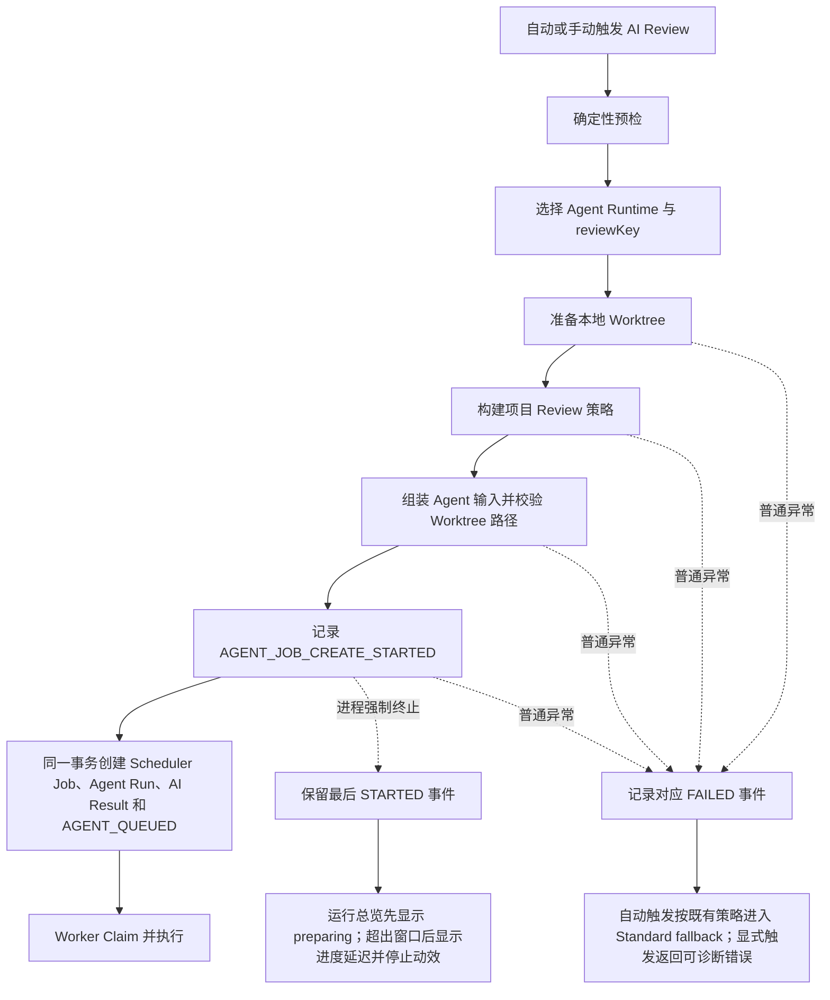
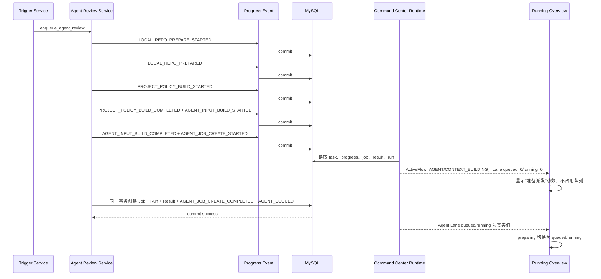

# Agent Review 派发可观测性与运行总览准备态动效计划

## 0. 文档状态

- 文档日期：`2026-08-10`
- 当前阶段：`D3 测试环境真实任务验收与收口（已结束）`
- 当前状态：`D3 COMPLETED WITH DEFECT — D4 DESIGN MOVED TO DOC 57`
- 文档用途：冻结 Agent Review 从确定性预检完成到 Scheduler Job 持久化之间的可观测事件、事务边界、Command Center 只读投影和“准备派发”动效语义。
- 当前授权：本专题不再继续实施；不允许 Agent 部署、写测试数据库、人为触发 Provider、提交或推送。
- 当前停止点：Task `1267` 已由 Backend 日志确认数据库字段容量与失败回滚缺陷。D4 修复设计已迁移到 `docs/57-agent-review-job-persistence-context-and-failure-transaction-fix-plan.md`，后续从该文档的 D4A 开始授权。

关联基线：

- `docs/46-agent-review-runtime-observability-plan.md`
- `docs/48-review-task-detail-unified-progress-ui-plan.md`
- `docs/AI Review Center Design/AI Review Platform Runtime Map Implementation Plan.md`
- `docs/AI Review Center Design/51-AI Review Command Center Live Topology and Motion Plan.md`

本文档是独立新专项，不续写已经完成的 Runtime Map 或动态拓扑计划。既有文档中“动效必须由真实 Runtime 证据驱动”“不得伪造 queued/running”“不得制造完成抵达事件”的约束继续有效。

---

## 1. 背景、证据与问题边界

### 1.1 测试环境证据

任务 `1247` 的规则分析已成功，但没有 AI Result、Scheduler Job 或 Agent Run，只留下确定性预检事件。结合配置、文件数和 Diff 大小检查，触发门禁没有拒绝该任务，故问题不在“是否允许审查”，而在预检之后的 Agent 派发空窗。

第一轮可观测性优化部署后，重试任务 `1253` 出现以下事实：

- `review_status=REVIEWING`；
- 已记录 `PREFLIGHT_STARTED / PREFLIGHT_COMPLETED`；
- 已记录 `LOCAL_REPO_PREPARE_STARTED / LOCAL_REPO_PREPARED`；
- Worktree 准备成功，约 `255ms`；
- 仍然没有 AI Result、Scheduler Job 或 Agent Run。

这将中断范围进一步缩小到 `backend-python/app/agent_review/service.py::enqueue_agent_review` 中 Worktree 返回之后、`repository.create_agent_job(...)` 及最终 `db.commit()` 之前，当前候选步骤包括：

1. 项目 Review 策略上下文构建；
2. Agent 输入组装；
3. Worktree 相对路径校验；
4. Scheduler Job / Agent Run / AI Result 创建及提交。

现有证据不能证明具体异常类型，也不能证明一定发生了进程退出。可以确定的是：当前最后一个持久化事实是 `LOCAL_REPO_PREPARED`，之后没有足够事件区分普通异常、事务回滚、进程中断或宿主重启。

### 1.2 “进入审查但没有动画”的原因

第一轮优化把 Task 提前标记为 `REVIEWING`，用于让任务详情持续轮询并表达“平台已接受审查意图”。运行总览的动画仍只根据真实 Scheduler Lane 的 `queuedCount / runningCount` 激活。

因此当前存在三个不同事实域：

| 事实域 | 当前来源 | 能回答的问题 | 不应回答的问题 |
| --- | --- | --- | --- |
| 审查意图 | `review_tasks.review_status` | 平台是否已进入审查流程 | Job 是否已经排队或运行 |
| 派发准备 | `code_quality_review_progress_events` | 当前在预检、Worktree、策略、输入还是 Job 持久化前 | Scheduler 队列长度和容量占用 |
| 排队/执行 | `code_quality_scheduler_jobs`、Agent Run、Worker | Job 是否真实 queued/running、占用了哪条 Lane | Job 创建前正在做什么 |

任务 `1253` 只有前两个事实域，没有第三个事实域。动画代码没有失效；它没有获得可证明的 Scheduler Job，所以保持 idle 是符合旧契约的结果。

### 1.3 本专项目标

1. 将 `LOCAL_REPO_PREPARED` 到 Job 提交之间拆成可持久化、可脱敏、可定位的进度阶段；
2. 普通 Python 异常必须留下失败事实，自动触发场景按现有策略进入 Standard fallback，避免 Task 长期停在 `REVIEWING` 且无解释；
3. Command Center 在 Job 创建前能够从真实 Progress 投影出 Agent “准备派发”状态；
4. 运行总览用独立 `preparing` 动效表达派发准备，同时保持 Scheduler queued/running 数字完全真实；
5. Job 一旦提交，页面从 preparing 平滑切换为既有 queued/running，不重复计数、不伪造结果侧流光；
6. 对进程被强制结束等无法捕获的情况，保留最后阶段，并在超出窗口后停止持续动效、展示“进度延迟”，不得宣称失败。

### 1.4 改造边界

本专项包含：

- Python Agent Review 派发阶段 Progress 事件与异常闭环；
- Command Center 对任务级派发事件的安全只读投影；
- React 运行总览 preparing 状态、文案、动效及任务详情阶段文案；
- 对应 Backend contract/unit、Frontend model/presentation/motion 测试、生产构建和测试环境验收。

本专项不包含：

- 不新增数据库表、列、索引或迁移；
- 不改变 Scheduler Claim 顺序、Agent Worker 容量、Provider Scheduler 或 fallback 策略；
- 不用 `review_status=REVIEWING` 直接驱动动画；
- 不把 preparing 写入 `reviewLanes.queuedCount/runningCount`；
- 不新增 WebSocket、SSE、Canvas、业务 RAF 或第三方动画依赖；
- 不在本专项重排为“先持久化 Job/Outbox，再准备 Worktree”。该方向能进一步消除进程中断空窗，但涉及 Worker 输入、任务恢复、幂等和清理策略，必须另立专题并继续拆分后实施；
- 不维护 legacy Java 后端。

### 1.5 当前工作区基线说明

当前工作区已有第一轮未提交改动，包括提前设置 `REVIEWING`、Worktree 开始/成功/失败事件、任务详情无 Result 时继续轮询，以及 `LOCAL_REPO_PREPARE_STARTED` 的阶段映射。本文件只记录设计，不把这些未提交代码视为任何阶段已经验收。进入 D1 时必须将它们作为同一变更集重新审查和验证，不能在其上盲目叠加。

---

## 2. 目标流程

### 2.1 主流程



### 2.2 派发与运行总览时序



---

## 3. Progress 事件与安全契约

### 3.1 数据库设计

无新增表、字段、索引和迁移。继续复用：

```text
code_quality_review_progress_events
  id
  task_id
  review_key nullable
  phase
  level
  message
  detail
  created_at
```

Job 创建前的派发事件允许 `review_key=NULL`，以保持任务级进度在尚无 AI Result 时仍可见；目标 `reviewKey` 放在经过白名单限制的 `detail` 中。Command Center 只对本节列出的派发 phase 解析该字段，不解析任意 Progress 的 detail。

### 3.2 通用 detail 契约

所有新增或补齐的派发事件使用 JSON detail：

```json
{
  "schemaVersion": "agent-dispatch-progress-v1",
  "operation": "AGENT_ENQUEUE",
  "dispatchAttemptId": "agent-dispatch-1253-<opaque-id>",
  "reviewKey": "agent-claude-code-deepseek-v4-pro",
  "requestedEngine": "AGENT",
  "status": "STARTED",
  "durationMs": 0
}
```

通用字段规则：

| 字段 | 规则 |
| --- | --- |
| `schemaVersion` | 固定为 `agent-dispatch-progress-v1` |
| `operation` | 固定为 `AGENT_ENQUEUE` |
| `dispatchAttemptId` | 单次 enqueue 内稳定、跨阶段复用；仅用于关联，不作为数据库幂等键 |
| `reviewKey` | 来自已选择的 Agent Runtime，非空且不超过数据库字段上限 64 |
| `requestedEngine` | 固定为 `AGENT`，不得由前端根据 reviewKey 猜测 |
| `status` | `STARTED / COMPLETED / FAILED` |
| `durationMs` | 非负整数；STARTED 可为 0 |

允许的阶段补充数字/布尔字段：

- Worktree：`changedFileCount`、`diffBytes`、`maxAttempts`；
- Project Policy：`totalAvailable`、`injectedCount`、`promptLength`、`truncated`、`contentTruncatedCount`；
- Agent Input：`changedFileCount`、`includedFileCount`、`excludedFileCount`、`diffBytes`、`diffMode`；
- Job Create 完成：`jobId`、`runId`。

失败事件仅额外允许：

- `failureCode`：稳定错误码或异常类型的受限名称；
- `failureMessage`：经过 `scrub_sensitive`、长度限制和用户安全化后的摘要。

不得写入 Progress detail：

- Prompt、策略正文或标题；
- diff、源码、文件路径、仓库绝对/相对路径；
- Worktree 路径、GitLab Token、Provider Key、代理地址；
- SQL、请求体、模型原始输出、堆栈、工具参数；
- completion context 中的通知载荷、风险卡正文或用户输入原文。

### 3.3 阶段定义

| Phase | Level | 含义 | Command Center Stage |
| --- | --- | --- | --- |
| `LOCAL_REPO_PREPARE_STARTED` | INFO | 开始准备 Agent Worktree | `CONTEXT_BUILDING` |
| `LOCAL_REPO_PREPARED` | INFO | Worktree 已可用 | `CONTEXT_BUILDING` |
| `LOCAL_REPO_PREPARE_FAILED` | ERROR | Worktree 普通异常 | `FAILED` |
| `PROJECT_POLICY_BUILD_STARTED` | INFO | 开始查询并构建项目策略上下文 | `CONTEXT_BUILDING` |
| `PROJECT_POLICY_BUILD_COMPLETED` | INFO | 策略上下文已完成 | `CONTEXT_BUILDING` |
| `PROJECT_POLICY_BUILD_FAILED` | ERROR | 策略上下文构建失败 | `FAILED` |
| `AGENT_INPUT_BUILD_STARTED` | INFO | 开始组装安全输入并校验 Worktree 相对路径 | `CONTEXT_BUILDING` |
| `AGENT_INPUT_BUILD_COMPLETED` | INFO | Agent 输入已完成 | `CONTEXT_BUILDING` |
| `AGENT_INPUT_BUILD_FAILED` | ERROR | 输入组装或路径校验失败 | `FAILED` |
| `AGENT_JOB_CREATE_STARTED` | INFO | 即将持久化 Job，但尚未进入队列 | `CONTEXT_BUILDING` |
| `AGENT_JOB_CREATE_COMPLETED` | INFO | Job、Run、Result 已在同一事务持久化 | 由真实 Job 决定 `QUEUED/RUNNING` |
| `AGENT_JOB_CREATE_FAILED` | ERROR | Job 创建或提交发生普通异常 | `FAILED` |
| `AGENT_QUEUED` | INFO | Agent Job 已真实入队 | `QUEUED` |

`AGENT_JOB_CREATE_STARTED` 绝不能映射为 `QUEUED`，因为此时数据库中还没有可 Claim 的 Job。

### 3.4 事务边界

为了让进程中断后仍能看到最后到达阶段，同时避免每个轻量步骤都单独提交，固定采用以下提交边界：

1. `LOCAL_REPO_PREPARE_STARTED` 单独提交；
2. `LOCAL_REPO_PREPARED` 单独提交；
3. `PROJECT_POLICY_BUILD_STARTED` 单独提交；
4. 策略成功后，`PROJECT_POLICY_BUILD_COMPLETED + AGENT_INPUT_BUILD_STARTED` 一起提交；
5. 输入和路径校验成功后，`AGENT_INPUT_BUILD_COMPLETED + AGENT_JOB_CREATE_STARTED` 一起提交；
6. `Scheduler Job + Agent Run + AI Result + AGENT_JOB_CREATE_COMPLETED + AGENT_QUEUED` 在同一事务提交。

最后一个事务必须满足：

- 提交成功：Job 对 Worker 可见，Result/Run/Progress 同时可见；
- 提交失败：全部回滚，不得留下 `AGENT_JOB_CREATE_COMPLETED` 或 `AGENT_QUEUED`；
- `AGENT_JOB_CREATE_FAILED` 必须在回滚失败事务后使用干净 Session 状态重新写入并提交；
- 如果失败事件本身也无法写入，则记录脱敏结构化日志并重新抛出原异常，不能伪造已经落库的失败事实。

### 3.5 异常与 fallback 规则

- 捕获范围为普通 `Exception`；不捕获 `KeyboardInterrupt`、`SystemExit` 或进程级终止。
- 已有 `AppError` 保留原错误码和 HTTP 语义，同时补齐对应 FAILED Progress。
- 非 `AppError` 在失败 Progress 持久化成功后转换为稳定的阶段错误码：
  - `AGENT_WORKTREE_PREPARE_FAILED`；
  - `AGENT_POLICY_BUILD_FAILED`；
  - `AGENT_INPUT_BUILD_FAILED`；
  - `AGENT_JOB_CREATE_FAILED`。
- MR/Push 自动触发继续由 `backend-python/app/code_quality/service.py` 按现有 Agent 不可用/失败策略进入 Standard fallback；不得让未知普通异常直接消失。
- 手动显式 Agent Review 不静默改为 Standard；返回可诊断错误，在失败事件同一收口事务中把 `review_status` 更新为 `REVIEW_FAILED`，不得继续停在 `REVIEWING`。
- MR/Push 自动触发只有在 Standard fallback 已成功创建真实 Result/Job 后才继续保持 `REVIEWING`；如果 fallback 自身也无法创建，必须沿既有失败收口更新为 `REVIEW_FAILED`，不能只依赖请求异常让状态悬空。
- 对进程强制终止，只能保留最后 STARTED/COMPLETED 事件。本专项通过“进度延迟”呈现该事实，不宣称已失败，也不自动重试。

---

## 4. Command Center 只读投影契约

### 4.1 不改变公开响应形状

`GET /api/command-center/runtime` 继续返回 `command-center-runtime-v2`，不新增顶层字段，不修改 `reviewLanes` Schema，不升级版本。

本专项只修正既有 `activeFlows[]` 在“无 Job/Result/Run，只有任务级派发 Progress”时的值来源：

```json
{
  "taskId": 1253,
  "reviewKey": "agent-claude-code-deepseek-v4-pro",
  "requestedEngine": "AGENT",
  "effectiveEngine": "AGENT",
  "status": "RUNNING",
  "stage": "CONTEXT_BUILDING",
  "stageSource": "PROGRESS",
  "queuedAt": null,
  "startedAt": null,
  "updatedAt": "2026-08-10T10:00:00Z"
}
```

同时保持：

```json
{
  "reviewLanes": {
    "agent": {
      "queuedCount": 0,
      "runningCount": 0
    }
  }
}
```

### 4.2 虚拟 Flow 分组规则

`backend-python/app/command_center/service.py::_build_flow_rows` 对 Progress 使用以下优先级：

1. Progress 行自身存在 `review_key`：使用数据库字段；
2. 行自身无 `review_key`，且 phase 属于第 3.3 节派发白名单：安全解析 detail，使用有效 `reviewKey`；
3. detail 非 JSON、字段缺失、字段超长、`requestedEngine != AGENT` 或 phase 不在白名单：回退既有 `default` 分组，不推断 Agent。

为避免同一次自动触发同时生成 `default` 预检 Flow 和 Agent 派发 Flow，增加有限合并规则：

- 同一 Task 只有一个有效的非 default 派发目标，且 default 分组不含 Job、Result、Run 或 Notification 时，将该 default 分组中的确定性预检和无作用域 Progress 作为任务级前序证据并入目标派发 Flow，不再单独输出 default ActiveFlow；
- 同一 Task 存在多个非 default 目标时不做猜测，保留既有分组，避免把共享预检错误归属到某一目标；
- 实际 Job/Result/Run 出现后始终按其真实 `review_key` 分组，Progress detail 不能把一条真实 Flow 改名；
- 合并只发生在 Command Center 只读投影，不回写 Progress 表，不改变任务详情原始时间轴。

Engine 来源优先级：

1. AI Result；
2. Agent Run；
3. Scheduler Job type；
4. 白名单派发 Progress 的 `requestedEngine`；
5. 既有默认值。

一旦 Job/Run/Result 存在，它们继续作为更高优先级事实源；Progress 只填补 Job 创建前的空窗，不能覆盖真实 fallback、失败或终态。

### 4.3 Stage 与状态规则

- Worktree、Policy、Input、`AGENT_JOB_CREATE_STARTED` 映射为 `CONTEXT_BUILDING / PROGRESS`；
- 对应 FAILED phase 映射为 `FAILED / PROGRESS`；
- Job 已存在时，`QUEUED/RUNNING/FAILED` 继续由 Scheduler Job、Run、Result 决定；
- ActiveFlow 的 `updatedAt` 使用最新相关 Progress 的 `created_at`；
- `review_status=REVIEWING` 只能让 Task 进入活跃集合，不能独立生成 Agent Flow 或 preparing 动效。

### 4.4 Review Lane 不变式

以下不变式必须通过 Backend 测试固定：

- 只有派发 Progress 时，Agent `queuedCount=0`、`runningCount=0`；
- `AGENT_JOB_CREATE_STARTED` 不出现在 `nextQueued`；
- Job 提交后，Lane 计数只计算真实 Scheduler Job；
- 同一任务从虚拟 Progress Flow 过渡为 Job Flow 时，`taskId + reviewKey` 保持稳定，不产生 default/Agent 两条重复 Flow；
- Progress detail 损坏或携带未知 engine 时，不使 Runtime 500，也不误点亮 Agent 路线；
- projectId/groupId、activeLimit 和 Coverage 的既有限制继续生效。

---

## 5. 前端准备态与动效契约

### 5.1 Presentation 内部模型

不新增 Runtime API 字段。`frontend/src/command-center/commandCenterPresentation.js` 从现有 `activeFlows` 派生只供页面使用的 `dispatchPreparation`：

```js
{
  activeCount: 1,
  delayedCount: 0,
  latestReviewKey: 'agent-claude-code-deepseek-v4-pro',
  latestStage: 'CONTEXT_BUILDING',
  latestUpdatedAt: '2026-08-10T10:00:00Z',
  activity: 'preparing'
}
```

有效 preparing Flow 必须同时满足：

- `requestedEngine === 'AGENT'`；
- `status` 为活动态；
- `stage` 为 `PREFLIGHT` 或 `CONTEXT_BUILDING`；
- `stageSource === 'PROGRESS'`；
- `updatedAt` 合法；
- 当前 Runtime 资源为 `FRESH`。

派发最新事件超过 `180s` 时，前端将其归类为 `delayed`：

- 页面显示“派发进度延迟”和最后更新时间；
- 不显示持续 preparing 动效；
- 不宣称失败、卡死或已经重试；
- 实际 Job 后续出现时，立即以 Lane 的 queued/running 事实恢复既有动画。

`180s` 由默认 `LOCAL_REPO_MAX_FETCH_SECONDS=120` 加 60 秒展示缓冲得出。若未来需要支持显著更长的自定义 Worktree 超时，应另行把安全超时摘要纳入 Runtime 契约，不能让前端读取部署配置或任意 Progress detail。

### 5.2 Motion 状态

页面活动状态扩展为：

```text
paused | idle | preparing | queued | running
```

优先级固定为：

```text
running > queued > preparing > idle
```

| 状态 | 真实条件 | 动效语义 |
| --- | --- | --- |
| `paused` | loading、STALE、ERROR_EMPTY、ERROR_RETAINED、reduced-motion 或小屏降级 | 全部连续动效停止 |
| `idle` | 无真实 queued/running，也无新鲜 preparing | 清晰静态线路 |
| `preparing` | Agent 派发 Progress 新鲜，且尚无真实 Job | 只表达“正在路由并准备交给 Agent” |
| `queued` | 任一 Lane 有真实 queued Job | 保持既有排队动效 |
| `running` | 任一 Lane 有真实 running Job | 保持既有运行动效 |

### 5.3 Preparing 路径规则

preparing 只激活：

- `queue-engine`；
- `engine-agent`。

preparing 不激活：

- `agent-result`；
- `standard-result`；
- `agent-standard` fallback；
- Standard Review queued/running 标记；
- Agent Review 的 queued/running 数字和容量占用。

视觉强度低于 queued：使用更慢、更弱的路由脉冲和“准备派发”状态胶囊，不使用 running 霓虹。实际 Job 出现后，既有 Lane 状态拥有更高优先级，preparing 不与 queued/running 叠加。

### 5.4 页面文案与任务详情

运行总览：

- 新鲜准备态：`准备派发 · 正在构建 Agent 上下文`；
- Job 创建前：不得显示“已排队”或“Worker 正在执行”；
- 超过 180 秒：`派发进度延迟 · 请查看任务详情最后阶段`；
- 实际 queued/running 后恢复既有 `排队中 / 运行中` 文案。

任务详情需补齐第 3.3 节新增 Phase 的安全中文标签，并继续展示原始时间顺序。不得展示百分比；阶段数量不能被换算成完成度。

### 5.5 响应式、无障碍与资源边界

- `prefers-reduced-motion: reduce` 关闭 preparing 连续动效，但保留“准备派发”文本；
- `<=1199px` 延续既有连续动效关闭规则；
- Runtime retained/stale/error 时暂停，不用旧快照继续制造活动感；
- 不新增 RAF、Timer、ResizeObserver 或 visibility listener；复用既有 CSS 状态动画和 5 秒 Runtime 轮询；
- Preparing 胶囊、延迟提示和静态路径在高对比模式下可辨认；
- 动效不作为唯一状态表达，键盘和屏幕阅读器能够读取相同文本状态。

---

## 6. 代码影响范围

### 6.1 Backend Agent Review

主要文件：

- `backend-python/app/agent_review/service.py`
- `backend-python/app/agent_review/repository.py`（仅在需要返回稳定 job/run 标识时局部调整，不改变 Claim）
- `backend-python/app/code_quality/service.py`
- `backend-python/tests/contract/test_agent_review_api_contract.py`
- `backend-python/tests/contract/test_code_quality_api_contract.py`

实现要点：

- 生成并贯穿 `dispatchAttemptId`；
- 统一 Progress detail 构造、脱敏、提交和失败回滚；
- 包裹 Policy/Input/Job Create 三段；
- Job/Run/Result/完成事件使用同一最终事务；
- 自动触发普通异常进入现有 fallback，显式触发保留失败。

### 6.2 Backend Command Center

主要文件：

- `backend-python/app/command_center/service.py`
- `backend-python/tests/unit/test_command_center_service.py`
- `backend-python/tests/contract/test_command_center_api_contract.py`

`schemas.py` 和 Runtime `schemaVersion` 不变。若实施时发现必须增加 API 字段，立即停止 D2A，先回写并重新评估改动量，不得在既有阶段内偷偷扩展公开契约。

### 6.3 Frontend

主要文件：

- `frontend/src/command-center/commandCenterPresentation.js`
- `frontend/src/command-center/commandCenterVisual.js`
- `frontend/src/command-center/CommandCenterCanvas.jsx`
- `frontend/src/command-center/commandCenter.css`
- `frontend/src/reviewJourney.js`
- `frontend/src/App.jsx`
- 对应 Command Center、Review Journey 测试文件

不新增依赖，不改变 AppFrame、Queue/Failure Drawer 或全局路由。

---

## 7. 测试与验收矩阵

### 7.1 Backend Agent Review

- Worktree、Policy、Input、Job Create 的 STARTED/COMPLETED 顺序正确；
- 每个普通异常只产生对应 FAILED 事件，detail 不含敏感字段；
- 策略摘要只包含计数和长度，不包含策略标题/正文；
- Input 摘要不包含 diff、文件路径、Worktree 路径和 completion context；
- Job 创建成功时 Job、Run、Result、`AGENT_JOB_CREATE_COMPLETED`、`AGENT_QUEUED` 同事务可见；
- Job 创建失败时上述成功事实全部回滚，随后 FAILED 事件可见；
- 自动 MR/Push 的普通异常进入现有 fallback；手动 Agent Review 返回错误；
- `KeyboardInterrupt/SystemExit` 不被错误转换为业务失败；
- 既有敏感路径跳过、Worktree 重试、Agent unavailable 和 comparison mode 行为不回归。

### 7.2 Backend Command Center

- 只有 task 级 `LOCAL_REPO_PREPARE_STARTED` 时投影为 Agent `CONTEXT_BUILDING/RUNNING` ActiveFlow；
- Worktree、Policy、Input、Job Create started/completed 均保持 Agent reviewKey；
- FAILED 事件投影为 FAILED；
- 单一 Agent 目标下，task 级预检/default 证据与 Agent 派发 Flow 合并，不输出重复 Flow；多目标时不猜测归属；
- 损坏 JSON、超长 reviewKey、未知 schemaVersion/engine 安全回退；
- 只有 preparing 时两条 Review Lane 计数仍为 0；
- 真实 Agent Job 出现后不产生重复 default Flow；
- Runtime 合同、过滤、Coverage 和查询数门禁通过。

### 7.3 Frontend

- FRESH + 新鲜 Agent Context Flow => `preparing`；
- preparing 只激活 intake 到 engine、engine 到 Agent；结果侧和 fallback 保持静止；
- queued/running 优先于 preparing；
- 180 秒边界前为 preparing，边界后为 delayed 静态提示；
- stale、retained、loading、error、reduced-motion、小屏均停止连续 preparing 动效；
- 多条 preparing Flow 显示真实数量，使用最新事件决定摘要；
- 任务详情新增 phase 标签、无 Result 轮询和历史事件兼容；
- 前端专项测试、全量 Node 测试和 `scripts/run-frontend.cmd build` 通过。

### 7.4 测试环境验收

重跑同类任务时至少观察以下状态转换：

```text
PREFLIGHT
  -> LOCAL_REPO_PREPARE_STARTED
  -> LOCAL_REPO_PREPARED
  -> PROJECT_POLICY_BUILD_STARTED
  -> PROJECT_POLICY_BUILD_COMPLETED
  -> AGENT_INPUT_BUILD_STARTED
  -> AGENT_INPUT_BUILD_COMPLETED
  -> AGENT_JOB_CREATE_STARTED
  -> AGENT_JOB_CREATE_COMPLETED
  -> AGENT_QUEUED
  -> Worker Claim / Running
```

验收重点：

- Job 创建前，任务详情能看到最后阶段，运行总览有 preparing 动效，但 Agent queued/running 仍为 0；
- Job 提交后，Runtime Lane 出现真实 Job，动效切换为 queued/running；
- 若再次停在某阶段，数据库最后事件能够把范围精确到 Policy/Input/Job Create；
- 若普通异常发生，FAILED 事件和 fallback/显式失败结果一致；
- 若人为终止进程，最后事件保留，180 秒后停止动效并显示延迟，不伪造失败或队列；
- 浏览器控制台无 error/warning，Runtime 接口不返回 500。

---

## 8. 分阶段实施总控

本专项按后端主链路、只读投影、前端动效、真实环境验收拆分，避免形成单一“大”阶段。每个阶段都可独立验收和安全停留；未经用户确认不得自动进入下一阶段。

### D0：文档与契约冻结

- 阶段状态：`COMPLETED`
- 改动量等级：`小`。只新增一份专题 Markdown，不修改产品代码或公开契约。
- 目标：冻结事实域、事件、事务、投影、动效、测试和授权边界。
- 范围：本文件。
- 非目标：不修改代码，不执行部署，不重跑测试环境任务。
- 验收：UTF-8、Markdown、Mermaid、阶段等级、停止点和代码文件名检查通过。
- 授权边界：仅文档写入和只读核对。
- 停止点：等待用户明确确认“继续 D1”。

### D1：Agent 派发阶段观测与普通异常闭环

- 阶段状态：`COMPLETED`
- 改动量等级：`中`。涉及 Python Agent Review 与自动触发两个后端模块及事务/异常测试，但不改数据库和公开接口。
- 目标：完成第 3 节 Progress、事务和异常契约，使 Job 前空窗可定位。
- 范围：`agent_review/service.py`、必要的 repository 返回值、`code_quality/service.py` 和对应 Backend 测试；合并审查当前工作区第一轮未提交改动。
- 非目标：不修改 Command Center 投影、前端动画、Scheduler Claim、Worker 或数据库。
- 验收：第 7.1 节全部通过；相关 pytest、Ruff、Python compile、`git diff --check` 通过。
- 授权边界：允许修改上述 Python 文件和测试；不得部署、提交、推送或进入 D2A。
- 停止点：回写实际事件序列、测试结果和剩余风险，等待用户确认“继续 D2A”。

#### D1 实施结果

- 单次 `enqueue_agent_review` 生成稳定 `dispatchAttemptId`，Worktree、Project Policy、Agent Input、Job Create 和 `AGENT_QUEUED` 全部使用 `agent-dispatch-progress-v1` 安全 detail；任务级准备事件继续保持 `review_key=NULL`，真实 `AGENT_QUEUED` 使用目标 reviewKey。
- 成功路径固定落库 9 个阶段：Worktree started/completed、Policy started/completed、Input started/completed、Job Create started/completed、Agent queued；策略正文、diff、文件路径、Worktree 路径和原始异常消息不进入 Progress。
- `Scheduler Job + Agent Run + AI Result + AGENT_JOB_CREATE_COMPLETED + AGENT_QUEUED` 已收敛为同一最终事务；Job 创建中途异常会先回滚部分 Job，再持久化 `AGENT_JOB_CREATE_FAILED`，不会留下虚假 completed/queued。
- Worktree、Policy、Input、Job Create 的普通非 `AppError` 分别转换为稳定阶段错误码；已有 `AppError` 保留原 code。`KeyboardInterrupt/SystemExit` 不被普通异常闭环捕获，只保留最后已提交 STARTED 事实。
- 手动/显式 Agent 派发失败会在失败事件收口时把 Task 更新为 `REVIEW_FAILED`；MR/Push 自动触发保留 `REVIEWING` 供既有 Standard fallback 接管。
- 自动 fallback 创建增加局部失败守卫：当前事务回滚且尚无任何持久化 fallback Result 时，Task 更新为 `REVIEW_FAILED`；若已有真实 fallback Result，则不覆盖其既有状态，避免多目标场景误判。
- 第一轮提前设置 `REVIEWING` 和 Worktree 观测改动已并入 D1；本阶段未修改 Scheduler Claim、Worker、Command Center、Frontend、数据库或迁移。

#### D1 验证结果

- Agent Review contract 全文件：`71 passed`。
- Code Quality D1 定向：MR 预检前 `REVIEWING`、fallback 失败回滚、已有 fallback Result 保护共 `3 passed`。
- Code Quality contract 全文件：`91 passed / 3 failed`；3 项失败分别是 legacy fix-preview 索引用例、Provider 切换用例和 Push debounce 用例，均可在单独执行时稳定失败，属于本专项外既有问题。本阶段没有扩展修复。
- Ruff 聚焦检查：通过；因 Windows `.ruff_cache` 权限使用项目既有 `--no-cache` 方案。
- Python 四个受影响源码/测试文件的内存编译：通过。直接 `py_compile` 被既有 `__pycache__` 临时文件权限阻断，已按环境记录改为不写缓存的 `compile(..., "exec")` 复核。
- `git diff --check`：通过，仅有既有 LF/CRLF 提示。
- 未执行前端测试/构建、部署、提交或推送；Command Center 和前端既有未提交改动保持未触碰。

### D2A：Command Center 派发 Progress 只读投影

- 阶段状态：`COMPLETED`
- 改动量等级：`中`。只修改 Python Command Center 内部 Flow 分组与阶段推导，并补 contract/unit 测试；响应字段形状不变。
- 目标：让任务级派发 Progress 使用真实 Agent reviewKey 投影为既有 ActiveFlow，同时保持 Review Lane 计数真实。
- 范围：第 4 节、`backend-python/app/command_center/` 和对应测试；只读查询允许选择 Progress `detail`，但仅限固定派发 phase/schema 的白名单字段参与投影，原始 detail 不进入 Runtime 响应。
- 非目标：不改 Agent 主链路、不加 Runtime 字段/版本、不改前端、不改数据库。
- 验收：第 7.2 节全部通过；Runtime Schema 回归、相关 pytest、Ruff、compile、`git diff --check` 通过。
- 授权边界：若需要新增公开字段或迁移，立即停止并重新设计，不得在 D2A 内扩大。
- 停止点：等待用户确认“继续 D2B”。

#### D2A 实施结果

- Runtime 只读查询新增选择 Progress `detail`；服务仅对固定派发 phase、`agent-dispatch-progress-v1`、`AGENT_ENQUEUE`、`requestedEngine=AGENT` 和完整受限通用字段进行解析，原始 detail、`dispatchAttemptId` 及其它内容不进入响应。
- 任务级派发 Progress 使用 detail 中经过长度和类型校验的 `reviewKey` 投影为既有 Agent ActiveFlow；公开 `command-center-runtime-v2`、顶层字段、ActiveFlow/ReviewLane Schema 和数据库均未改变。
- 单一 Agent 派发目标会吸收无 Job/Result/Run/Notification 的 default 前序 Progress，避免 default/Agent 重复 Flow；多个 Agent 目标时保留 default 分组，不猜测共享进度归属。
- Worktree、Project Policy、Agent Input、Job Create 的 started/completed 映射为 `CONTEXT_BUILDING / PROGRESS`，对应 FAILED 映射为 `FAILED / PROGRESS`。
- AI Result、Agent Run 和 Scheduler Job 继续高于派发 Progress；真实 Job 出现后沿用相同 `taskId + reviewKey`，queued/running/failed 不会被旧派发事件覆盖。
- 损坏 JSON、未知 schema/operation/engine/status、缺失或超长标识、负 duration 和未知 phase 均安全回退到既有 default/Standard 投影，不会触发 Runtime 500 或误点亮 Agent Flow。
- Review Lane、Scheduler 和 Agent queue 指标仍只读取真实 Job/Worker 事实；只有 preparing Progress 时两条 Lane 的 queued/running 计数保持 0，`nextQueued` 保持空。
- 本阶段仅修改 Command Center repository/service、对应 unit/contract 测试及本专题文档；未修改公开 schema、Agent 主链路、前端、数据库或迁移。

#### D2A 验证结果

- Command Center unit 全文件：`41 passed`。
- Command Center API contract 全文件：`10 passed`，覆盖 Runtime v2 形状、真实数据库投影、Lane 不变式、过滤、Coverage、查询数和只读 SQL 门禁。
- Ruff 聚焦检查：通过；Python 四个 D2A 源码/测试文件的内存编译：通过。
- `git diff --check`：通过，仅有既有 LF/CRLF 提示。
- 未执行前端测试/构建、部署、提交或推送；D2B 前端 preparing/delayed 动效尚未开始。

### D2B：任务详情阶段文案与运行总览 preparing 动效

- 阶段状态：`COMPLETED — WAITING FOR D3 AUTHORIZATION`
- 改动量等级：`中`。仅涉及 React Command Center、Review Journey 的状态映射、样式和测试，不改后端或接口。
- 目标：基于 D2A 的既有 ActiveFlow 事实实现第 5 节 preparing/delayed 展示。
- 范围：第 5 节列出的前端文件和测试。
- 非目标：不改 Lane 数字、不增加请求/Timer/RAF/依赖、不调整页面信息架构。
- 验收：第 7.3 节全部通过；前端专项、全量 Node 测试、生产 build、三视口静态/动效检查和 `git diff --check` 通过。
- 授权边界：不启动 D3 部署或真实任务，不顺带修改其他动画风格。
- 停止点：等待用户确认“继续 D3”。

#### D2B 实施结果

- Command Center Presentation 从既有 `activeFlows` 派生内部 `dispatchPreparation`；只接受 FRESH Runtime、Agent 活动态、`PREFLIGHT/CONTEXT_BUILDING`、`stageSource=PROGRESS` 和合法 `updatedAt`，不新增 Runtime 字段或请求。
- 以 `180s` 为严格延迟边界：恰好 180 秒仍为 preparing，超过 180 秒转为 delayed；支持多 Flow 的真实 active/delayed 数量，并用最新事件提供最后阶段和更新时间。
- Motion 状态增加 `preparing`，优先级保持 `running > queued > preparing > idle`；任何真实 Lane queued/running 都会抑制准备态，不与既有动画叠加。
- preparing 仅激活 `queue-engine` 和 `engine-agent`，使用 4.2 秒弱脉冲；Agent/Standard Lane、结果侧、fallback、Worker 状态和数字均保持真实静止值，不使用 queued/running 霓虹。
- 运行总览新增可读状态胶囊：新鲜态显示“准备派发 · 正在构建 Agent 上下文”，延迟态显示“派发进度延迟 · 请查看任务详情最后阶段”，并附目标数量、最后阶段和相对更新时间。
- `<=1199px` 关闭 preparing 连续动效但保留状态文字；`<=900px` 由移动路由摘要承载同一文案；`prefers-reduced-motion`、retained/stale/error/loading 继续使用既有统一暂停规则，高对比模式补齐边框与文本可见性。
- 任务详情补齐 Worktree、Project Policy、Agent Input、Agent Job Create 的 started/completed/failed 安全中文标签和 Journey 阶段归类；原始事件顺序保持不变，不生成百分比或阶段完成度。
- 任务处于 `REVIEWING` 且尚无 Result 时继续复用既有 5 秒详情轮询；Command Center 继续复用既有 Runtime 轮询。本阶段未新增 Timer、RAF、ResizeObserver、visibility listener 或依赖。
- 本阶段未修改 Backend、数据库、Runtime Schema、Lane 计算、AppFrame、Queue/Failure Drawer 或全局路由。

#### D2B 验证结果

- D2B 前端专项：Command Center Presentation、Visual、Information Architecture、Review Journey 共 `60 passed`。
- 前端全量 Node 测试：`217 passed`。
- `scripts/run-frontend.cmd build`：生产构建通过；仅输出项目既有的大 chunk 提示。
- 浏览器宽桌面验收：准备态胶囊可读，仅 `queue-engine/engine-agent` 为 preparing，动画周期均为 4.2 秒；Agent queued/running 均为 0，结果和 fallback 路线静止。
- 浏览器 1025px 验收：准备文案保留，SVG 连续线路和胶囊脉冲关闭，无横向溢出。
- 浏览器 390px 验收：延迟态由静态移动摘要显示，无活动路线，Agent queued/running 仍为 0，无横向溢出。
- 三视口浏览器控制台均无 warning/error；临时只读验收页已删除，没有进入工作区交付文件。
- `git diff --check`：通过，仅有既有 LF/CRLF 提示。
- 未部署、提交或推送；D3 测试环境真实任务验收尚未开始。

### D3：测试环境真实任务验收与收口

- 阶段状态：`COMPLETED WITH DEFECT — WAITING FOR D4 AUTHORIZATION`
- 改动量等级：`小`。以部署后的只读证据、浏览器观察和既有测试复核为主；只允许修复本专项内暴露的局部缺陷。
- 目标：用一次受控任务验证第 7.4 节完整转换和故障可定位性。
- 范围：用户完成部署后，查询任务、Progress、Job、Run、Result 和 Runtime；浏览器观察 preparing 到 queued/running。
- 非目标：Agent 不自动部署、不写测试数据库、不人为制造 Provider 调用、不开始 queue-first/outbox 重构。
- 验收：第 7.4 节证据齐全；若任务再次中断，能由最后 phase 精确定位，且页面不伪造 Scheduler 状态。
- 授权边界：只读检查默认允许；任何测试数据写入、进程终止实验或部署动作必须由用户明确执行或单独授权。
- 停止点：回写真实 Task ID、事件序列、Runtime/Lane 状态和浏览器结论后停止。

#### D3 当前进度

- 已于 `2026-08-10` 获得 D3 只读验收授权，并完成阶段状态回写。
- 工作区未保存测试环境专用地址、数据库连接或部署配置；进程环境中也没有可识别的 TEST/STAGE/BASE_URL/DATABASE/MYSQL/DEPLOY/SSH 变量。
- 只读探测项目默认入口 `http://localhost:8090`：健康检查通过，但任务列表最新 Task ID 为 `1213`，没有 `1247`、`1253` 或部署后的新任务；Runtime v2 的 activeFlows 为 `0`，Standard/Agent Lane 均为 queued `0`、running `0`。
- 结论：本机默认入口不是此前问题对应的测试环境，不能用该数据完成 D3 或判断本次改动是否生效。
- 后续前置条件：用户完成部署后提供测试环境页面/API 入口和重跑 Task ID；无需提供数据库密码，优先通过公开只读 API 与浏览器验收。
- `2026-08-11` 收到重跑 Task `1257` 的页面截图：统一 Review 进度显示“确定性预检已完成、上下文准备执行中”，没有“排队与调度”。按当前 Journey 映射，这证明任务已进入 Agent 派发前置阶段，但尚未产生 `AGENT_QUEUED` / `QUEUED` 事件，不能归类为“完全未触发审查”；更准确的状态是“已触发，卡在 Scheduler Job 入队前”。
- 截图无法区分最后阶段是 `LOCAL_REPO_PREPARE_STARTED`、`PROJECT_POLICY_BUILD_STARTED`、`AGENT_INPUT_BUILD_STARTED` 或 `AGENT_JOB_CREATE_STARTED`。本机 `http://localhost:8090/api/review-tasks/1257` 返回 `404`，浏览器当前也没有可复用的测试环境页面，因此仍需测试环境 Base URL 后查询 Task、Progress、Job、Run、Result 和 Runtime 才能定案。
- 用户提供 `http://ai-review.ihere.net/tasks/1257` 后完成只读 API 核验：Task 底层状态 `SUCCESS`、Review 状态 `REVIEWING`；无 Code Quality Result，无 Task `1257` 的 Scheduler Job/Run。
- Task `1257` 派发尝试 `agent-dispatch-1257-012e5f9396f14daa8690efa9f24c99f8` 共落库 9 条 Progress。Worktree 在 `474ms` 内完成，项目策略构建在 `6ms` 内完成，Agent 输入在 `5ms` 内完成；最后事件为 `AGENT_JOB_CREATE_STARTED`（`2026-08-11 09:48:06.884 UTC+8`），之后没有 `AGENT_JOB_CREATE_COMPLETED`、`AGENT_JOB_CREATE_FAILED` 或 `AGENT_QUEUED`。
- Runtime v2 对 Task `1257` 只生成 `stageSource=PROGRESS` 的虚拟 Agent Flow：`status=RUNNING`、`stage=CONTEXT_BUILDING`、无 queuedAt/startedAt；Agent Lane queued 为 `0`，当时唯一 running 项为 Task `1262` / Job `1474`，不是 Task `1257`。这证明页面没有伪造 Scheduler 排队或运行状态。
- 邻近任务对比：Task `1258`、`1259`、`1260` 均已生成 SUCCESS Result；Task `1262` 已生成 RUNNING Result 并进入 Agent Lane。Task `1257` 因而更像 Job 创建事务中的孤立进程/请求中断，而不是 Agent 队列持续不可用。
- 正常 `Exception` 按 D1 实现应回滚并写入 `AGENT_JOB_CREATE_FAILED`；本次成功和失败事件都缺失，候选原因收敛为进程/请求被终止、数据库连接在失败闭环提交时同时不可用，或该调用仍停滞在未提交事务。需要结合 `2026-08-11 09:48:06 UTC+8` 附近 Backend 容器日志定案。
- 验收后段测试环境开始出现接口超时，随后页面与 `/api/health` 连续返回 `502 Bad Gateway`（openresty）。因此本轮无法继续浏览器复核运行总览的 delayed 展示，D3 保持进行中并停在环境恢复前置条件。
- 重新 Docker 部署后，`2026-08-11 10:11 UTC+8` 健康接口恢复 `UP`；随后对新 Task `1263` 完成第二轮只读核验。
- Task `1263` 为 `SUCCESS / REVIEWING`，没有 Result、Job 或 Run；仅落库 4 条 Progress，最后为 `LOCAL_REPO_PREPARED`（`2026-08-11 10:08:07.153 UTC+8`）。该事件 detail 使用旧格式 `operation=AGENT_ENQUEUE, status=PREPARED`，缺少新版必有的 `schemaVersion=agent-dispatch-progress-v1`、`dispatchAttemptId` 和 `status=STARTED/COMPLETED/FAILED`。
- Task `1263` 没有任何 `PROJECT_POLICY_BUILD_*`、`AGENT_INPUT_BUILD_*`、`AGENT_JOB_CREATE_*` 或 `AGENT_QUEUED`。当前工作区只有新版 `_prepare_agent_worktree_with_progress` 会写入该 phase，且必然附带新 schema；因此可以确认至少处理本次 webhook 的 Backend 实例不是当前工作区版本，或环境中存在新旧 Backend 副本混跑。
- Runtime v2 因严格拒绝旧 detail，只能将 Task `1263` 投影为 `1263:default`、`requestedEngine=STANDARD`、`stageSource=PROGRESS`；Agent/Standard Lane 均为 queued `0`、running `0`。这解释了 Task `1263` 既没有 Agent preparing 动效，也没有排队与调度。
- 浏览器确认新版 Command Center 已上线，能显示“派发进度延迟 · 请查看任务详情最后阶段”；该胶囊统计的是此前具有新 schema 的两个 Agent 目标，不包含 Task `1263`。Task `1263` 详情则回退为“Review 阶段回顾 / 历史任务未记录”，进一步证明前端与 Backend 派发事件契约不一致。
- 新发现：Runtime 的 UTC 时间输出缺少 `Z` / offset，浏览器把约几十分钟前的派发进度显示为“8 小时前”。该问题不影响本次入队根因，但会误导 delayed 时长判断，需在部署版本一致后作为本专项局部缺陷处理。
- 部署侧下一步：若使用离线包，确认先在新版本目录执行 `./load-images.sh`，再在 `runtime` 执行 `./deploy-stage3.sh upgrade --workers N`；同时用 Compose project/service 标签检查是否残留其它项目的运行中 Backend，不能只看健康接口为 `UP`。
- 服务器部署证据：`runtime/.env` 与 `docker compose ps` 均声明 `APP_VERSION=20260811100920`；`docker image inspect` 进一步确认 `20260811100920` 与 `20260811094311` 两个 Backend 标签指向同一 image ID `5b43a97ee688`（创建于 `2026-08-11 09:43:47 UTC+8`）。但运行容器内能够检索到 `_DISPATCH_PROGRESS_SCHEMA_VERSION = "agent-dispatch-progress-v1"`，因此“同一 image ID”只能证明本次版本采用镜像重标记，不能单独证明代码缺少 D1。
- Task `1263` 创建时间为 `2026-08-11 10:08:06 UTC+8`，而 `docker compose ps` 显示整套容器也在约 `10:08` 重新创建。该任务与部署切换窗口重合，很可能由正在退出的旧 Backend 接收，并在 Worktree 完成后随容器替换被终止；因此 Task `1263` 不能作为“部署稳定后仍无法入队”的有效验收样本。
- 下一步需在当前容器确认 `PROJECT_POLICY_BUILD_STARTED`、`AGENT_INPUT_BUILD_STARTED`、`AGENT_JOB_CREATE_STARTED` 三个阶段常量均存在，并排除其它 Compose project 的 Backend 容器；确认健康稳定后再提交一个新 Task。只有新 Task 仍写旧 detail，才能判定存在旧实例混跑或镜像内容不完整。
- 当前容器核对完成：`/app/app/agent_review/service.py` 中三个新版阶段分别存在于第 `235`、`277`、`366` 行；按 Compose service 标签查询仅有一个 Backend：`runtime-backend-1`，镜像配置为 `ai-code-review-backend:20260811100920`，Compose project 为 `runtime`。因此已排除当前运行容器缺少 D1 代码和跨 Compose project 的 Backend 混跑。
- Task `1263` 最终定性为部署切换窗口中的中断样本；当前环境具备提交稳定期新 Task 的前置条件。新 Task 必须观察到 `agent-dispatch-progress-v1` 与 `PROJECT_POLICY_BUILD_*` / `AGENT_INPUT_BUILD_*` / `AGENT_JOB_CREATE_*`，再判断是否成功进入 `AGENT_QUEUED`。
- 稳定部署后提交 Task `1267`，已排除 Task `1263` 的部署竞态。Task 为 `SUCCESS / REVIEWING`，使用新版 `agent-dispatch-progress-v1` 和唯一 dispatchAttemptId `agent-dispatch-1267-b5785cfca0954cac8ef00facf20317a3`。
- Task `1267` 的 Worktree（`214ms`）、项目策略（`11ms`）和 Agent 输入（`6ms`）均完成；最后事件为 `AGENT_JOB_CREATE_STARTED`（`2026-08-11 10:21:14.226 UTC+8`）。超过 `70s` 后仍只有 9 条 Progress，且无 `AGENT_JOB_CREATE_COMPLETED/FAILED`、无 Job、Run、Result；Agent/Standard Lane 均为 queued `0`、running `0`。
- Task `1267` 与 Task `1257` 在同一新版阶段重复中断，证明根因稳定落在 `create_agent_job()` 到 Result/Progress commit 的事务区间。正常 Python `Exception` 应进入 `_persist_dispatch_failure()` 并写入 `AGENT_JOB_CREATE_FAILED`；失败事件缺失意味着调用被进程级终止、阻塞后被 Gunicorn 杀死，或失败闭环提交本身再次阻塞。
- 当前 Backend 启动命令没有显式 `--timeout`，Gunicorn 默认 worker timeout 候选为 `30s`。但 timeout 只是终止现象，底层阻塞仍需由 `10:21:14 UTC+8` 附近容器日志确认，重点检查 `WORKER TIMEOUT`、MySQL lock wait / deadlock、连接中断和 worker reboot；暂不通过单纯提高 timeout 掩盖数据库问题。
- 代码复核：`create_agent_job()` 在该区间执行 Scheduler Job flush、Agent Run flush；随后 `save_result()` 会再次执行 Result schema inspection 并 flush。`agent_review_runs.input_json` 的基线迁移为 `LONGTEXT`，Task `1267` 的 `226859 bytes / TOOL_PAGED` 不足以单独解释容量溢出，仍以真实日志为准。
- Backend 日志最终定案：Agent Run flush 收到 MySQL `1406 Data too long for column 'completion_context_json' at row 1`。本次 `input_json` 日志截断前规模约 `243247` 字符，`completion_context_json` 约 `90242` 字符；后者包含完整 riskCard 与 notificationContext，超过测试库该列的实际容量。
- 同一日志随后连续出现 SQLAlchemy `PendingRollbackError`，说明首次 flush 失败后仍有路径在 failed Session 上访问数据库，导致 `_persist_dispatch_failure()` 预期的 `AGENT_JOB_CREATE_FAILED` 没有成功提交。这是“任务永久停在 REVIEWING、只有 started 没有 failed”的直接原因。
- D3 排除了旧镜像、跨项目 Backend、Worker 容量、Gunicorn timeout、数据库锁等待和前端动画。最终根因是两项组合缺陷：`completion_context_json` 持久化契约/实际 schema 容量不足，以及 flush 失败后的事务恢复不完整。
- 后续不能只放大字段：修复设计需同时明确 completion context 的最小持久化白名单/大小上限、既有表字段迁移与模型一致性、flush 失败后的独立事务失败事件，以及大 riskCard 回归测试。由于涉及数据库迁移和主链路事务，需作为新的 D4 阶段先更新设计再实施。

---

## 9. 风险与后续治理

| 风险 | 本专项处理 | 剩余边界 |
| --- | --- | --- |
| 进程在 Job 提交前退出 | 最后已提交 phase 可见，前端 preparing 后转 delayed | 不自动恢复、不保证最终入队 |
| Progress 提交增加数据库写入 | 合并相邻完成/开始事件，控制提交次数 | 大批量并发下需观察写放大 |
| detail 被滥用于携带敏感信息 | 固定 schema、字段白名单、scrub、长度限制和测试 | 仍需代码评审阻止后续无约束扩展 |
| 虚拟 Flow 误算 Lane | ActiveFlow 与 ReviewLane 分离、测试固定 0 计数 | Runtime 消费方必须理解 preparing 不是 queued |
| 旧任务缺少新 detail | 安全回退 default Flow，不点亮 Agent preparing | 历史任务只能按既有方式展示 |
| 自定义 Worktree 超时超过 120 秒 | 180 秒后只标记 delayed，不判失败 | 未来需要配置感知时应设计安全 Runtime 字段 |
| 最终 Job 事务成功但响应丢失 | Scheduler Job 已是真实来源，运行总览正常切换 | 请求级幂等仍由后续 queue-first/outbox 专题治理 |

### 9.1 后续独立专题：Queue-first / Outbox

本专项只提高可观测性和普通异常闭环，不能从根本上消除“进程在 Job 持久化前退出”的窗口。长期方案应单独设计：

- 先持久化可恢复的 Dispatch/Outbox 或 Scheduler Job；
- Worker Claim 后准备/校验 Worktree，或增加独立 Prepare Worker；
- 固定幂等键，处理重复 webhook、响应丢失和重试；
- 处理 Worktree 生命周期、失败重试、取消和清理；
- 明确 Job 已排队但上下文尚未就绪时的状态机和容量语义。

该方案涉及主状态机、Worker 输入和恢复机制，属于大范围治理，不能作为 D1～D3 的“顺手优化”。若用户决定推进，必须新建专题并继续拆成均为小/中的可独立阶段。

---

## 10. 总控启动指令

```text
继续 56 · Agent Review 派发可观测性与运行总览准备态动效计划。

先读取：
1. 根目录 AGENTS.md；
2. docs/56-agent-review-dispatch-observability-and-command-center-preparation-motion-plan.md 的当前状态、目标阶段、验收标准、授权边界和停止点；
3. 仅阅读当前阶段命中的实现和测试。

只执行用户明确授权的当前阶段。开始前将阶段状态回写为 IN PROGRESS；完成约定测试和 git diff --check 后回写真实结果并立即停止。未经明确确认不得进入下一阶段、部署、提交、推送或扩展为 Queue-first / Outbox 重构。
```
