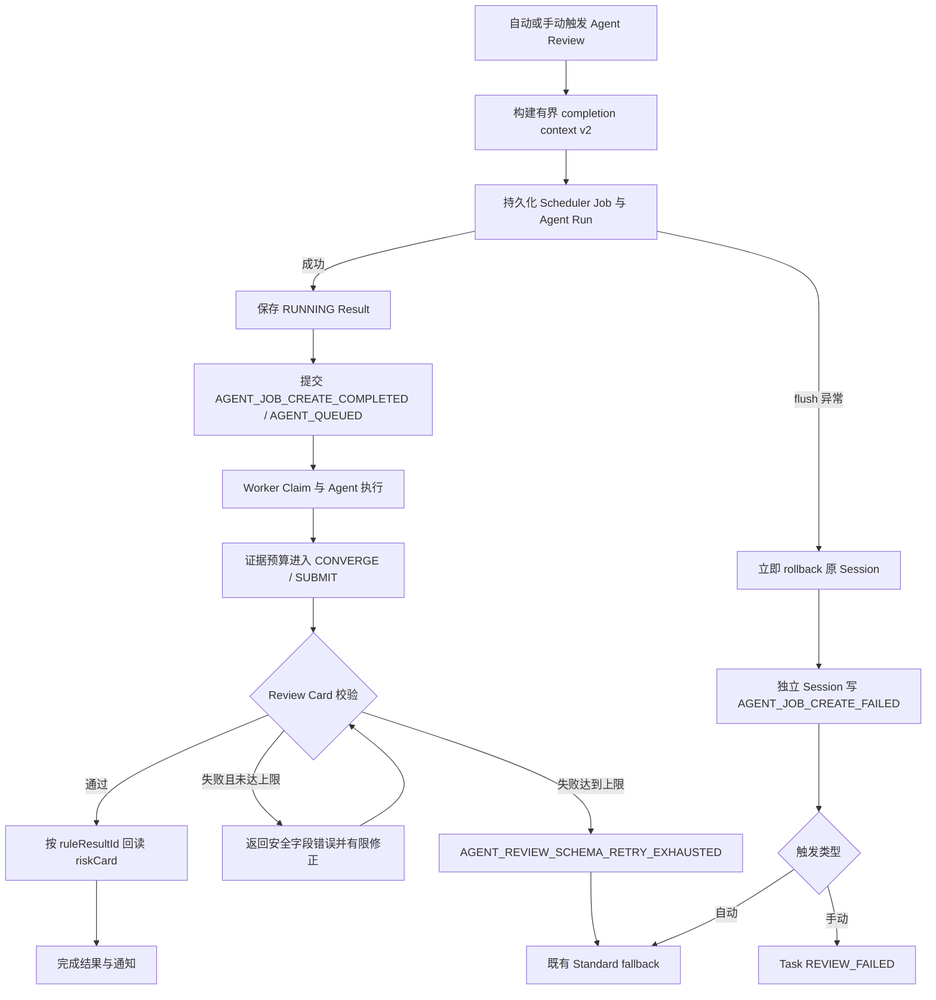
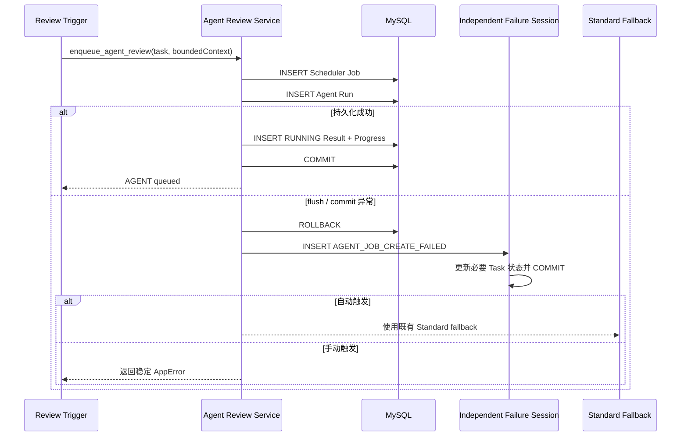
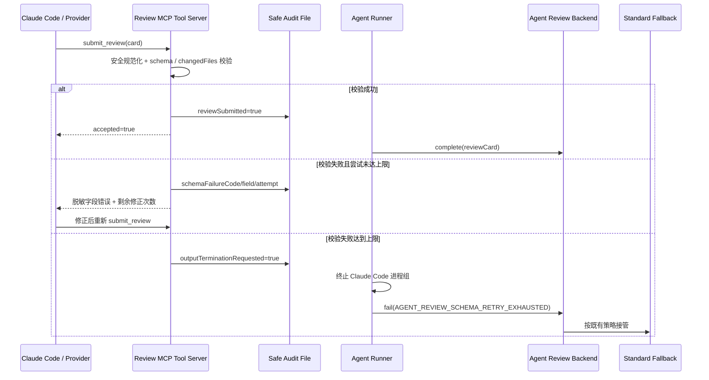
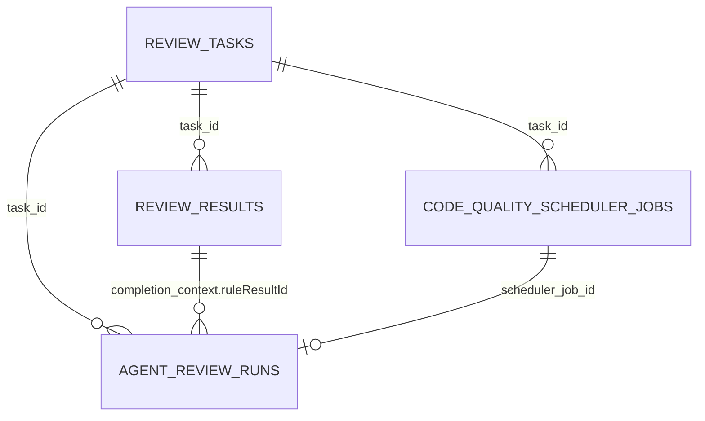

# Agent Review Job 持久化、失败事务与输出收敛修复计划

## 0. 文档状态

- 文档日期：`2026-08-11`
- 来源专项：`docs/56-agent-review-dispatch-observability-and-command-center-preparation-motion-plan.md`
- 当前阶段：`D4B 已完成`
- 当前状态：`D4B COMPLETED — WAITING FOR D4C AUTHORIZATION`
- 当前授权：D4A、D4B 已完成；未经后续授权不修改失败事务、Agent 输出收敛、前端或测试环境数据。
- 当前停止点：等待用户明确确认“继续 D4C”。未经确认不得进入 Job 创建失败独立事务实现。

---

## 1. 需求背景

### 1.1 真实问题

#### 1.1.1 Task 1267：Job 持久化失败

测试环境 Task `1267` 在稳定部署后复现以下事件序列：

1. `DETERMINISTIC_PRECHECK_COMPLETED`；
2. `LOCAL_REPO_PREPARED`，耗时 `214ms`；
3. `PROJECT_POLICY_BUILD_COMPLETED`，耗时 `11ms`；
4. `AGENT_INPUT_BUILD_COMPLETED`，耗时 `6ms`；
5. `AGENT_JOB_CREATE_STARTED`；
6. 此后没有 Job、Run、Result、`AGENT_JOB_CREATE_COMPLETED` 或 `AGENT_JOB_CREATE_FAILED`。

Backend 日志给出确定性根因：

```text
pymysql.err.DataError: (1406, "Data too long for column 'completion_context_json' at row 1")
sqlalchemy.exc.PendingRollbackError: This Session's transaction has been rolled back...
```

本次 `input_json` 约 `243247` 字符，`completion_context_json` 约 `90242` 字符。后者重复保存了完整 `riskCard`，而 `review_results.risk_card_json` 已经持久化同一规则结果。Agent Run flush 失败后，同一 Session 又进入失败或 fallback 路径，触发 `PendingRollbackError`，最终 Task 永久停在 `REVIEWING`。

#### 1.1.2 Task 1271：取证已收敛但 Review Card 未形成有效终态

Task `1271` 已正常完成 Job 持久化、排队和 Worker Claim，但 Agent Run `104` 最终降级为 Standard Review。真实 Progress 证据如下：

| 证据 | 实际值 |
| --- | --- |
| Runner / Provider | `CLAUDE_CODE / DEEPSEEK` |
| 有效预算 | `maxTurns=14`、`maxToolCalls=40`、`maxEvidenceCalls=10`、`convergeAtCalls=8`、`submitByTurn=9` |
| 收敛阶段 | 第 8 次证据调用进入 `CONVERGE` |
| 强制提交阶段 | 第 10 次证据调用进入 `SUBMIT`，`mustSubmit=true` |
| Review Card 提交 | 工具序号 `11～20` 共 10 次 `submit_review`，全部返回 `REVIEW_SCHEMA_INVALID` |
| Agent 终态 | `turnCount=15`，超过 `maxTurns=14` |
| 页面最终原因 | `AGENT_MAX_TURNS_EXCEEDED` |
| fallback | Standard Review 成功完成并保存 2 个 finding |

真实失败链为：

```text
证据预算收敛 -> 强制提交 -> REVIEW_SCHEMA_INVALID × 10
-> 模型修正耗尽回合 -> AGENT_MAX_TURNS_EXCEEDED -> STANDARD_FALLBACK
```

因此 Task `1271` 不是“收敛策略未触发”，而是现有策略只收敛证据读取，没有收敛 Review Card schema 修正次数。当前安全审计只保存 `REVIEW_SCHEMA_INVALID`，未保存脱敏后的字段路径和失败类别；临时 MCP audit 随 Runner 临时目录删除后，也无法再还原具体是 `filePath`、行号、枚举、长度还是必填字段失败。

### 1.2 根因拆分

| 根因 | 当前行为 | 直接后果 |
| --- | --- | --- |
| 实际字段容量与持久化负载不匹配 | `completion_context_json` 接收约 90KB JSON | Agent Run insert 触发 MySQL 1406 |
| 重复持久化完整 riskCard | `review_results` 和 Agent Run 各保存一份 | 数据膨胀，容量随规则证据线性增长 |
| 模型与基线迁移语义不一致 | SQLAlchemy 使用通用 `Text`，V42 基线使用 `LONGTEXT/JSON` | 旧库或运行时建表可能形成不同列类型 |
| flush 失败后的 Session 隔离不足 | 后续逻辑仍可能访问 failed Session | 失败 Progress、Task 状态和 Standard fallback 不能闭环 |
| 大载荷测试缺失 | contract 测试只覆盖小型 completion context | 90KB riskCard 未在发布前被发现 |
| 收敛策略只约束证据工具 | `CONVERGE/SUBMIT` 仅阻止继续取证 | Review Card 校验失败后仍可无界重复修正 |
| Claude Code 提交时限是软约束 | `submitByTurn` 主要通过 system prompt 告知模型 | Worker 不能保证指定回合内形成有效 Card |
| schema 失败缺少安全归因 | audit 只记录 `REVIEW_SCHEMA_INVALID` | 历史任务无法定位失败字段，最终原因被 max turns 覆盖 |
| 提交阶段展示按预算相位推断 | 到达 `SUBMIT` 即显示“正在提交/已完成” | 10 次提交均失败时页面仍可能误导用户 |

### 1.3 改造目标

1. 立即消除 `input_json`、`completion_context_json` 的字段容量风险；
2. completion context 只保存异步完成所需的有界引用和通知元数据，不再复制完整 riskCard；
3. flush 失败后先结束原事务，再使用独立 Session 写入失败事实；
4. 自动触发场景能够按既有策略进入 Standard fallback，手动场景能够落为 `REVIEW_FAILED`；
5. 历史 Agent Run 的旧 completion context 继续可读；
6. 为 Review Card schema 修正增加有限次数的硬收敛和稳定失败原因；
7. Progress 能展示脱敏后的失败字段、尝试次数和真实提交状态；
8. 通过大 riskCard、数据库 DataError、重复 schema 失败和真实测试环境任务覆盖完整回归。

### 1.4 改造边界

本专项包含：

- `agent_review_runs.input_json`、`completion_context_json` 列类型迁移；
- Agent Run 模型与 MySQL 类型一致性；
- completion context v2 白名单、预算和 riskCard 引用回读；
- Job 创建失败的独立事务闭环；
- 自动 fallback、手动失败状态和大载荷测试；
- Review Card schema 失败的安全归因、有限修正和失败原因优先级；
- Agent 提交子阶段和任务详情的真实状态展示；
- 测试环境迁移、真实任务和历史卡死任务清理验收说明。

本专项不包含：

- 不新增表，不改变公开 API schema；
- 不改变 Scheduler 优先级、Claim、Worker 容量或 Provider 协议；
- 不调整 Gunicorn timeout；
- 不修改 Command Center 拓扑或运行总览动画，只修正任务详情的 Agent 提交状态和诊断摘要；
- 不自动重跑 Task `1253/1256/1257/1263/1267`；
- 不自动重跑 Task `1271`；
- 不扩展为 Queue-first / Outbox；
- 不让系统为缺失 finding 字段、未知文件路径或风险证据自动编造内容；
- 不新增公开可配置预算字段，本轮 schema 修正次数使用 Runner 内部安全常量；
- 不修改 legacy Java 后端。

---

## 2. 修复流程



### 2.1 Job 创建失败时序



### 2.2 Review Card 输出收敛时序



`outputTerminationRequested` 仅用于 Agent Worker 临时目录内的父子进程协作，不进入公开 API，也不新增数据库字段。对 Anthropic Messages、OpenAI Chat Completions 和 OpenAI Responses 等进程内 Runner，达到修正上限后直接返回同一稳定失败码，无需文件轮询。

---

## 3. 数据库设计

### 3.1 ER 关系

无新增表。沿用以下关系：



`completion_context.ruleResultId` 是应用层引用，不新增数据库外键，避免历史数据、清理顺序和迁移锁风险。读取时必须同时校验 `ReviewResult.id` 与 `task_id`，禁止跨任务引用。

### 3.2 V52 字段迁移

新增：

`backend-python/migrations/bootstrap_sql/V52__agent_review_run_payload_capacity.sql`

设计 SQL：

```sql
ALTER TABLE agent_review_runs
  MODIFY COLUMN input_json LONGTEXT NULL,
  MODIFY COLUMN completion_context_json LONGTEXT NULL;
```

设计说明：

- `input_json` 已可能持有 200KB 以上 TOOL_PAGED 输入，统一为 `LONGTEXT`；
- `completion_context_json` 改为 `LONGTEXT`，先兼容历史 v1 与部署期间的暂态大载荷；
- 不使用 MySQL `JSON` 作为本轮目标类型，避免旧库中非标准 JSON、不同 MySQL 版本和 SQLAlchemy `Text` 映射差异阻断迁移；
- 应用仍在读写边界执行 `json.dumps/json.loads` 和对象校验；
- 回滚应用版本时不缩回字段，旧代码能够继续读取 `LONGTEXT`；
- 执行前通过 `information_schema.COLUMNS` 记录当前类型，通过迁移状态和 `SHOW COLUMNS` 验证结果；
- 迁移可能持有 metadata lock，测试/生产部署应在低流量窗口执行，不在运行任务期间手工 ALTER。

### 3.3 模型一致性

修改 `backend-python/app/agent_review/models.py`：

- 为大 JSON 文本定义 MySQL `LONGTEXT` variant；
- `input_json`、`completion_context_json` 使用同一类型常量；
- SQLite 测试仍使用通用 `Text`；
- 不由请求路径中的 `ensure_agent_review_schema()` 自动执行类型变更，列类型迁移只由 V52 管理。

### 3.4 历史数据兼容

- 历史 v1 completion context 中存在 `riskCard`：继续优先读取，不强制回填；
- 新 v2 context 不含 `riskCard`：按 `ruleResultId + task_id` 从 `review_results.risk_card_json` 回读；
- context 为空、损坏或引用不存在：不得回滚已完成的 AI Result；记录安全 WARN，并使用 `risk_card=None` 继续生成 AI Review 摘要；
- 本次迁移不自动修改历史 Task 状态，不自动创建 Job/Run。

---

## 4. Completion Context v2 契约

### 4.1 数据结构

```json
{
  "schemaVersion": "agent-completion-context-v2",
  "autoNotification": true,
  "ruleResultId": 1270,
  "focusChangeTypes": ["CACHE"],
  "focusRuleCodes": ["CACHE_WRITE_DELETE_CHANGED"],
  "notificationContext": {
    "title": "GITLAB_MR_WEBHOOK 432",
    "projectName": "client/ljdw-client-internal",
    "triggerType": "GITLAB_MR_WEBHOOK",
    "authorName": "示例用户",
    "authorUsername": "example",
    "sourceBranch": "feature/example",
    "targetBranch": "master"
  },
  "reminderCardEnabled": true
}
```

明确禁止持久化：

- `riskCard` 完整对象；
- diff、changedFileDetails、源码、Prompt、Provider 响应；
- webhook 原始 payload；
- API Key、Webhook URL、GitLab Token 或其它凭据。

### 4.2 白名单与预算

| 字段 | 规则 |
| --- | --- |
| `schemaVersion` | 固定为 `agent-completion-context-v2` |
| `autoNotification` | boolean |
| `ruleResultId` | 正整数或 null |
| `focusChangeTypes` | 最多 32 项，每项最多 64 字符，去重 |
| `focusRuleCodes` | 最多 64 项，每项最多 64 字符，去重 |
| `notificationContext` | 仅允许示例中的 7 个键；单值最多 512 字符 |
| `reminderCardEnabled` | boolean，缺失按 true |
| 序列化总量 | UTF-8 不超过 16KB |

若来源数据超出单字段预算，按顺序稳定裁剪并记录结构化 WARN；不得因为可选通知元数据过大阻断 Agent Review。若白名单化后仍超过 16KB，退化为仅保留 `schemaVersion`、`autoNotification=false`、`ruleResultId` 和 `reminderCardEnabled` 的最小对象，并记录 `AGENT_COMPLETION_CONTEXT_TRUNCATED`。

### 4.3 riskCard 回读

在 `backend-python/app/review_record/repository.py` 增加内部查询：

```text
find_review_result_for_notification(db, result_id, task_id)
```

约束：

- 同时匹配 `ReviewResult.id == ruleResultId` 和 `ReviewResult.task_id == run.task_id`；
- 只返回解析后的 `risk_card_json` 与必要的 reminder 标志，不返回 changeAnalysis；
- 解析失败返回空结果并记录安全 WARN；
- `_finish_existing_review_flow()` 与 `run_agent_standard_fallback_job()` 复用同一解析函数，避免 Agent 成功和 fallback 行为分叉。

---

## 5. 失败事务闭环设计

### 5.1 事务边界

修改 `backend-python/app/agent_review/service.py`：

1. `AGENT_JOB_CREATE_STARTED` 仍先独立提交；
2. Job、Run、RUNNING Result、`AGENT_JOB_CREATE_COMPLETED`、`AGENT_QUEUED` 保持同一成功事务；
3. 捕获 `Exception` 后，第一条操作必须是原 Session `rollback()`；
4. 失败 Progress 与必要 Task 状态使用新的 `SessionLocal()` 独立提交；
5. 独立失败 Session 不读取 input/completion 原文，只使用 taskId、phase、dispatchAttemptId、稳定 failureCode 和脱敏 message；
6. 失败 Session 完成后关闭；原调用只返回稳定 `AppError`，不泄露 SQL 参数或 JSON 内容。

### 5.2 自动与手动行为

| 场景 | 失败事件 | Task 状态 | 后续动作 |
| --- | --- | --- | --- |
| 自动 MR/Push | `AGENT_JOB_CREATE_FAILED` | 保持可由 fallback 接管 | 进入既有 Standard fallback |
| 手动显式 Agent | `AGENT_JOB_CREATE_FAILED` | `REVIEW_FAILED` | 返回稳定 AppError，由用户决定重试 |
| 敏感路径全部排除 | 既有安全 skip 事件 | 既有逻辑 | 不改变 |
| 独立失败 Session 也失败 | 应用 ERROR 日志 | 不伪造成功 | 由 `dispatchAttemptId` 定位，禁止继续使用 poisoned Session |

### 5.3 稳定错误与日志

- completion context 规范化异常：`AGENT_COMPLETION_CONTEXT_INVALID`；
- Job/Run/Result 持久化异常：沿用 `AGENT_JOB_CREATE_FAILED`；
- 日志允许：taskId、dispatchAttemptId、异常类型、字段预算、序列化字节数；
- 日志禁止：riskCard、diff、input_json、completion_context_json、SQL parameters、凭据；
- PyMySQL/SQLAlchemy 原始参数日志需避免在应用重复打印，部署日志采集侧按现有安全策略控制访问。

---

## 6. Review Card 输出收敛与诊断设计

### 6.1 双层收敛边界

Agent Review 必须区分两种收敛：

| 层级 | 现有能力 | 本轮调整 |
| --- | --- | --- |
| 证据收敛 | `convergeAtCalls` 进入 `CONVERGE`，`maxEvidenceCalls` 进入 `SUBMIT` | 保持现有预算，不允许进入 `SUBMIT` 后新增证据假设 |
| 输出收敛 | schema 失败后由模型自行反复修正，直到 CLI 最大回合 | 增加最多 3 次 schema 提交尝试，达到上限立即终止 Agent 并 fallback |

本轮在 Runner 内部定义 `_MAX_REVIEW_SCHEMA_SUBMIT_ATTEMPTS = 3`，含首次提交和最多两次修正。该值不是用户质量偏好，而是防止无效循环的安全上限，因此不加入 `code_quality_agent_settings.budget_config_json`、设置接口或前端配置表单。`submitByTurn` 继续作为模型行为提示；CLI `--max-turns` 继续作为最后安全网，但不再承担 schema 修正收敛职责。

### 6.2 安全 schema 失败契约

当前 `validate_review_card()` 是 fail-fast，一次只返回一个错误。若 Card 同时存在多个独立错误，3 次提交上限可能只够逐项暴露错误，导致模型尚未看到剩余问题就被熔断。D4D 将其调整为稳定顺序的有界 violation collector，每次最多返回 5 个安全错误：

```json
{
  "errorCode": "REVIEW_SCHEMA_INVALID",
  "violations": [
    {
      "reasonCode": "ENUM",
      "field": "findings[0].severity"
    },
    {
      "reasonCode": "REQUIRED",
      "field": "findings[0].contextSummary"
    }
  ],
  "violationCount": 2,
  "violationsTruncated": false,
  "attempt": 2,
  "maxAttempts": 3,
  "retryable": true,
  "mustSubmit": true
}
```

允许的 `reasonCode` 固定为：

- `REQUIRED`：必填字段缺失或空白；
- `TYPE`：字段类型错误；
- `ENUM`：枚举值不支持；
- `UNSAFE_PATH`：绝对路径或不安全相对路径；
- `PATH_OUTSIDE_CHANGED_FILES`：finding 文件不在 changed files 白名单；
- `LINE_RANGE`：行号非正整数或结束行小于开始行；
- `LENGTH`：字符串、数组或 finding 数量超限；
- `CARD_SHAPE`：顶层对象或 findings 结构不合法。

安全约束：

- violations 按顶层字段、finding 下标、finding 字段的 schema 固定顺序生成，相同 Card 必须得到相同顺序；
- `violations` 最多 5 项；`violationCount` 最大记录为 50，超过 5 项时 `violationsTruncated=true`；
- 每个 `field` 只允许 schema 字段路径和数组下标，最大 120 字符；
- Progress、数据库、日志和 audit 不保存字段值、完整 Card、finding 内容或模型原始参数；
- 返回给模型的 message 按 violations 生成固定模板，例如“`findings[1].filePath` 不在 changedFiles 白名单”，不得回显用户代码；
- `reasonCode + field` 列表可持久化，用于历史诊断和聚合；
- 顶层不是对象、`findings` 不是数组等无法继续遍历的结构错误允许只返回 1 项；
- collector 只聚合确定性 schema 错误，不跨过无效结构猜测子字段，也不执行模糊修复。

### 6.3 确定性规范化边界

当前 `schema.py` 已具备以下不改变语义的规范化，D4D 以“保留并复用”为主，不重复建设第二套 normalizer：

- 枚举统一大写；
- Windows 路径分隔符转 `/`；
- 首尾空白裁剪；
- 非布尔的整数字符串转正整数；
- 重复 finding 按现有稳定键去重。

为支持多错误收集，可以把现有单字段校验拆为“规范化结果 + violation”内部函数，但规范化结果必须与当前成功路径兼容。除修复现有行为缺陷外，本阶段不扩大自动转换范围。

以下情况禁止自动修复：

- 不为缺失的 summary、finding、evidence、missingContext 或 contextSummary 编造内容；
- 不把未知文件名模糊匹配到 changedFiles；
- 不猜测行号、severity、confidence 或 contextStatus；
- 不静默删除无效 finding 以换取提交成功；
- 不把 schema 失败的 Agent 草稿交给通知或前端展示。

### 6.4 Claude Code 与进程内 Runner 的硬停止

Claude Code Runner 当前只能在进程结束后读取 `numTurns`，无法用 `submitByTurn` 实时硬切模型回合。本轮不引入流式 stdout 协议重写，改用已有 MCP audit 文件作为受控停止信号：

1. `ReviewToolExecutor` 记录 `submitAttemptCount`、`schemaFailureCount` 和最后一次安全失败摘要；
2. 第 3 次 schema 失败先原子写入 `outputRepairExhausted=true` 和 `outputTerminationRequested=true`；
3. Tool Executor 的 exhausted latch 一旦置位，本次进程生命周期内不可恢复；后续所有证据工具和 `submit_review` 均短路返回 `AGENT_REVIEW_SCHEMA_RETRY_EXHAUSTED`，不得再次访问 worktree、执行 schema 校验或增加 `schemaFailureCount`；
4. `runner.py::_run_candidate()` 在每次等待前、`TimeoutExpired` 后和进程自然退出后都重新读取 audit；看到终止信号后停止进程组；
5. 即使 Claude CLI 在父进程观察信号前已经自然结束或返回 max turns，最终 audit 中的 exhausted latch 仍优先覆盖 CLI 错误；
6. 返回 `AGENT_REVIEW_SCHEMA_RETRY_EXHAUSTED`，并保留 turn/tool/evidence 预算摘要；
7. Messages、Chat Completions、Responses Runner 在同一进程内直接抛出稳定 AgentError，不进入下一模型回合。

进程停止发生在已达到内部安全上限后，不视为用户取消。当前 Claude Code 父进程轮询间隔最长 5 秒，第三次失败和父进程终止之间存在模型可能开始下一决策回合的竞态；本阶段保证的是“不得执行第 4 次 schema 校验或继续取证，并在一个轮询周期内终止”，不承诺 Claude CLI 绝不开始第 4 个模型决策回合。若必须保证零额外模型回合，需要独立高频 watcher 或流式 stdout 编排，属于后续专项。

若 audit 写入失败，不得推断修正已耗尽，仍由 timeout/max turns 兜底；若 audit 已成功写入但 progress 上报失败，Runner 仍按本地 exhausted latch 终止，Backend 可从最终失败上报补写安全事实。

### 6.5 失败原因优先级与 fallback

同一 Run 存在多种末端信号时，按以下优先级选择主失败码：

1. 用户或系统明确取消：`AGENT_CANCELLED`；
2. schema 修正达到上限：`AGENT_REVIEW_SCHEMA_RETRY_EXHAUSTED`；
3. timeout：`AGENT_TIMEOUT`；
4. 最大模型回合：`AGENT_MAX_TURNS_EXCEEDED`；
5. CLI / Provider / Worker 其它稳定错误。

同时在安全摘要中保留最多 5 项 `failureChain`，例如：

```json
{
  "failureCode": "AGENT_REVIEW_SCHEMA_RETRY_EXHAUSTED",
  "failureChain": [
    {"code": "REVIEW_SCHEMA_INVALID", "count": 3},
    {"code": "AGENT_REVIEW_SCHEMA_RETRY_EXHAUSTED", "count": 1}
  ]
}
```

自动 MR/Push 继续进入 Standard fallback；手动显式 Agent 维持当前产品策略，不因本节自行改成自动 fallback。Standard Review 成功后 Task 可为 `SUCCESS`，但 `requestedEngine=AGENT`、`effectiveEngine=STANDARD_FALLBACK` 和 Agent 失败链必须保留。

### 6.6 Progress 与任务详情语义

- `submit_review` 调用开始：`AGENT_SUBMITTING / INFO`；
- schema 校验失败：`AGENT_SUBMIT_VALIDATION_FAILED / WARN`，detail 只包含安全契约、attempt/maxAttempts；
- Card 接受：`AGENT_REVIEW_SUBMITTED / INFO`，`reviewSubmitted=true`；
- 修正耗尽：`AGENT_OUTPUT_CONVERGENCE_FAILED / WARN`；
- 子阶段“提交 Review Card”只有看到 `AGENT_REVIEW_SUBMITTED` 或 `reviewSubmitted=true` 才显示“已完成”；
- 只有预算 `phase=SUBMIT` 时显示“等待提交”，不得据此推断已提交；
- fallback 页面展示 `REVIEW_SCHEMA_INVALID × N -> AGENT_REVIEW_SCHEMA_RETRY_EXHAUSTED -> STANDARD_FALLBACK`；
- 本轮不改变运行总览节点位置、拓扑或动画，仅修正任务详情阶段状态和诊断文本。

### 6.7 历史兼容

- 历史 Run 没有 `submitAttemptCount/failureChain` 时继续按现有摘要展示；
- 历史 `AGENT_MAX_TURNS_EXCEEDED` 不反向改写为新错误码；
- Task `1271` 保留原始结果，不自动重跑或修改；
- 新 Worker 读取旧 audit 时缺失字段按 0/false；旧 Worker 不认识新字段时仍受原 max turns 保护；
- 不新增数据库列，新安全摘要沿用 `tool_summary_json` 和 Progress detail 的有界 JSON。

### 6.8 参数优化评估与延后项

Task `1271` 已证明直接根因是“10 次 schema 校验失败”，不是证据调用超过硬上限。因此 D4D 接受有界多错误返回、提交修正熔断和轮询竞态保护，不通过提高 `maxTurns` 或 `maxEvidenceCalls` 掩盖问题。

以下建议有长期价值，但不纳入本轮 D4：

- `CONVERGE` 后由服务端限制收尾证据类型和数量，而不仅依赖 Prompt；
- 为输出生成预留独立模型回合，并把 `submitByTurn` 升级为硬状态机；
- 截断同一模型回合中超过剩余预算的批量证据调用；
- 重复 query、path、line range 检测；
- 按 diff 规模、风险类型和初始 Context Pack 完整度自适应预算；
- Claude Code 流式事件编排或高频终止 watcher。

延后理由：这些能力会改变所有 Agent 任务的取证行为、预算契约或 Claude CLI 编排，不能由单个 schema 失败样本直接授权。D4F 先采集正常 Agent 成功率、证据无命中率、重复调用率、首次提交回合、schema 修正率和 fallback 原因；若仍有非 schema 型 max turns 样本，再新建独立专题，不继续扩展 D4D。

---

## 7. 详细改动清单

### 7.1 数据库与模型

- 新增 `backend-python/migrations/bootstrap_sql/V52__agent_review_run_payload_capacity.sql`；
- 修改 `backend-python/app/agent_review/models.py` 的大 JSON 文本类型；
- 修改 `backend-python/app/migrate.py`，兼容数据库已手工扩容但迁移台账尚未记录 V52 的场景；
- 更新 `backend-python/tests/unit/test_migrate_bootstrap.py`：版本连续到 V52、SQL 类型断言、已满足迁移判断；
- 不更新 README，迁移步骤和验收结果写入本专题。

### 7.2 completion context

- `backend-python/app/code_quality/service.py`：构建 v2 context，不再把 `risk_card` 放入 Agent Run；
- `backend-python/app/agent_review/repository.py`：保存前执行白名单、去重、裁剪和 16KB 总预算；
- `backend-python/app/review_record/repository.py`：按 ruleResultId + taskId 回读 riskCard；
- `backend-python/app/agent_review/service.py`：成功完成时兼容 v1/v2；
- `backend-python/app/code_quality/service.py::run_agent_standard_fallback_job`：fallback 同样兼容 v1/v2。

### 7.3 失败事务

- `backend-python/app/agent_review/service.py::_persist_dispatch_failure`：改为原 Session rollback + 独立 Session 持久化；
- 调用方在失败闭环前后不得查询 poisoned Session；
- 自动 fallback metadata 只读取已经由独立 Session 提交的安全 Progress；
- 保持 `asyncio.CancelledError`、`KeyboardInterrupt`、`SystemExit` 不被普通异常闭环吞掉。

### 7.4 Agent 输出收敛

- `backend-python/app/agent_review_spike/schema.py`：按稳定顺序收集最多 5 个安全 violation，保留现有规范化行为，不返回字段值；
- `backend-python/app/agent_review_spike/workspace.py`：在 Tool Budget 安全摘要中增加提交尝试、schema 失败计数和 exhausted 状态；
- `backend-python/app/agent_review_spike/tool_executor.py`：执行最多 3 次提交尝试，写入安全失败列表和终止信号；exhausted 后永久短路全部工具；
- `backend-python/app/agent_review_spike/runner.py`：Claude Code 每次等待前后及自然退出后识别终止信号、停止进程并调整错误优先级；
- `backend-python/app/agent_review_spike/anthropic_messages_runner.py`、`chat_completions_runner.py`、`responses_runner.py`：进程内 Runner 使用同一提交重试上限；
- `backend-python/app/agent_review/worker.py`：识别 `AGENT_REVIEW_SCHEMA_RETRY_EXHAUSTED`，向 Backend 提交稳定失败信息；
- `backend-python/app/agent_review/repository.py`、`service.py`：保存有界 `failureChain` 和新的 Progress 事件，不保存 Card 草稿；
- 不修改 Provider 协议，不把 Standard Review 输出伪装成 Agent 输出。

### 7.5 任务详情诊断

- `frontend/src/agentReviewTrace.js`：区分等待提交、校验失败、提交成功和输出收敛失败；
- `frontend/src/reviewJourney.js`：提交子阶段只有真实 accepted 事件才完成；
- `frontend/src/App.jsx`：fallback 告警展示安全失败链与 `attempt/maxAttempts`；
- 对应前端测试补充 Task `1271` 等价 fixture；
- 不修改 `frontend/src/command-center/` 的拓扑和动画实现。

### 7.6 历史卡死任务

Task `1253/1256/1257/1263/1267` 不自动重跑。运维清理仅允许在用户明确执行时，将仍为 `REVIEWING` 且无活动 Job/Result 的精确 Task ID 更新为 `REVIEW_FAILED`；必须先 SELECT、限定 ID 和状态、事务提交后复查。该操作不放入 V52，避免迁移修改业务状态。Task `1271` 已由 Standard fallback 成功结束，保留其 `SUCCESS + STANDARD_FALLBACK` 结果作为回归样本，不修改状态。

---

## 8. 验证方案

### 8.1 迁移验证

- `discover_migrations()` 连续包含 V1～V52；
- V52 dry-run 与 apply 测试通过；
- `SHOW COLUMNS FROM agent_review_runs` 显示两个字段均为 `longtext`；
- 已有 JSON/NULL 数据迁移后可读取；
- 旧应用版本读取 LONGTEXT 不报错；
- `python -m app.migrate` 重复执行幂等。

### 8.2 Contract / Unit

- 90KB 以上 riskCard 输入生成的 v2 completion context 小于等于 16KB；
- v2 不包含 `riskCard`、diff、凭据或 webhook 原文；
- 226KB 以上 TOOL_PAGED input 能创建 Job、Run 和 RUNNING Result；
- legacy v1 context 完成通知不回归；
- v2 能按 ruleResultId 回读正确 task 的 riskCard，跨 task 引用被拒绝；
- riskCard 缺失/损坏不回滚成功 Result；
- 模拟 Agent Run flush `DataError` 后，必须存在 `AGENT_JOB_CREATE_FAILED`；
- 自动触发进入 Standard fallback，手动触发落为 `REVIEW_FAILED`；
- 失败 detail 和日志不包含 SQL parameters 或大 JSON 内容；
- `ReviewSchemaError` 每类 reasonCode 均能生成有界 field/reason 摘要；
- 单个 Card 同时存在 6 个以上确定性错误时，只返回稳定排序的前 5 项并设置 `violationsTruncated=true`；
- 多错误 Card 能在一次响应中得到多个安全 violation，并在下一次提交一并修正成功；
- 第 1、2 次 schema 失败、第三次修正成功时不得误触发熔断；
- 连续第 3 次 schema 失败写入永久终止信号；后续不得执行第 4 次 schema 校验或任何 worktree 访问；
- Claude Code 在终止信号写入后的一个轮询周期内停止；允许模型已开始额外决策回合，但不得形成新的有效工具执行；
- Claude Code Runner 看到终止信号后返回 `AGENT_REVIEW_SCHEMA_RETRY_EXHAUSTED`；
- Claude CLI 在信号写入后先自然退出或返回 max turns 时，最终 audit 仍覆盖 CLI 错误；
- Messages、Chat Completions、Responses Runner 使用相同的 3 次上限；
- schema 修正耗尽与 max turns 同时存在时，主失败码为 schema 修正耗尽；
- `failureChain` 聚合次数正确，且不包含 Review Card 字段值；
- 不可逆的缺失字段、未知文件和行号不会被确定性规范化器编造；
- 枚举大写、路径分隔符、整数字符串、裁剪和 finding 去重保持现有兼容行为；
- 前端只有 `reviewSubmitted=true` 才将“提交 Review Card”显示为已完成；
- Task `1271` 等价 fixture 显示“校验失败 3/3 -> 输出收敛失败 -> Standard fallback”。

### 8.3 测试环境

1. 部署前只读确认 V52 pending；
2. 低流量窗口完成迁移并确认列类型；
3. 提交一个包含约 100 个文件、200KB 以上 diff 和大 riskCard 的受控任务；
4. 观察 `AGENT_JOB_CREATE_STARTED -> COMPLETED -> AGENT_QUEUED`；
5. 核验 Scheduler Job、Agent Run、RUNNING/终态 Result 和 Runtime Lane；
6. 浏览器确认 preparing 切换 queued/running，并在成功 Card accepted 后显示提交完成；
7. 核验一个正常 Agent 任务不降级，`reviewSubmitted=true` 且最终 `effectiveEngine=AGENT`；
8. 通过受控 contract / synthetic runner 验证连续 3 次 schema 失败，不使用真实业务任务制造无效 Card；
9. 确认失败链为 `REVIEW_SCHEMA_INVALID × 3 -> AGENT_REVIEW_SCHEMA_RETRY_EXHAUSTED -> STANDARD_FALLBACK`；
10. 通过测试注入或本地 contract 验证 DataError 失败闭环，测试环境不人为破坏数据库列。

---

## 9. 风险、部署与回滚

| 风险 | 控制方式 |
| --- | --- |
| ALTER TABLE metadata lock | 低流量窗口、部署前确认无运行任务、观察迁移耗时 |
| LONGTEXT 放大无界写入 | v2 白名单和 16KB 应用预算；LONGTEXT 仅作兼容与安全余量 |
| riskCard 回读失败 | 同时校验 resultId/taskId；失败时不回滚 AI Result |
| 新旧 completion context 共存 | v1 读旧 riskCard，v2 按引用加载 |
| 独立失败事务重复事件 | 使用 dispatchAttemptId + phase 做应用层幂等检查或接受单次调用唯一事件 |
| 自动 fallback 重复调度 | 继续使用既有任务/reviewKey/label 去重逻辑 |
| fail-fast 导致 3 次仍看不完全部错误 | 单次稳定返回最多 5 个安全 violation，让模型一次修正多个字段 |
| 3 次修正仍不足以恢复复杂 Card | 达到上限后快速 fallback，避免无界成本；通过 D4F 统计 schema 修正成功率再决定是否调整内部常量 |
| 5 秒轮询期间 Claude 已开始额外回合 | Tool Executor 永久 latch，禁止第 4 次 schema 校验和 worktree 访问；验收不承诺零额外模型决策回合 |
| 终止 Claude Code 时丢失最后 audit | 先原子写 audit 再由父进程停止；等待前后及自然退出后均重新读取最终快照 |
| 错误字段路径泄露内容 | 只允许 schema 字段名和数组下标，不保存字段值 |
| 新旧 Worker 混部 | 新字段全部可选；旧 Worker 继续由 max turns 兜底，升级期间不依赖新终止信号作为唯一安全边界 |
| 任务详情状态与运行总览不一致 | 仅修正提交子阶段来源，不改变 Command Center 终态投影和动画契约 |

部署顺序：

1. D4A 先部署 V52 与模型一致性；
2. D4B 再部署 completion context v2；
3. D4C 部署独立失败事务；
4. D4D 部署 Agent 输出硬收敛与安全失败链；
5. D4E 部署任务详情诊断语义；
6. D4F 执行测试环境迁移与真实任务验收。

回滚原则：

- 应用可回滚，数据库字段保持 LONGTEXT，不执行缩列；
- v2 写入上线后，回滚版本若不认识 v2 但仍按普通 dict 读取，不应阻断 Agent 执行；通知 riskCard 可能降级为空，因此正式上线前必须验证兼容；
- 输出收敛回滚后新 audit 字段由旧 Worker 忽略，历史 `failureChain` 仍作为普通 JSON 保存；
- 前端回滚后仍能使用 `failureCode` 展示 fallback，不依赖新字段才能加载任务详情；
- 不通过回滚删除 schema_migrations 记录或手工改 checksum。

---

## 10. 分阶段实施计划

### D4A：字段扩容与模型一致性

- 阶段状态：`COMPLETED`
- 改动量等级：`中`。涉及 MySQL 迁移、SQLAlchemy 模型和迁移框架测试，但不改变业务流程或公开接口。
- 目标：先解除 90KB completion context 和 200KB input 的持久化容量风险。
- 范围：V52、模型类型、迁移 unit 测试、迁移操作说明。
- 非目标：不改 completion context 内容，不改失败事务，不部署测试环境。
- 验收：迁移测试通过；本地/测试数据库 dry-run 方案明确；`git diff --check` 通过。
- 授权边界：允许修改 migration、模型和对应测试；不执行测试环境迁移、提交、推送或进入 D4B。
- 停止点：汇报 D4A 结果并等待“继续 D4B”。

实施结果（`2026-08-11`）：

- 已新增 V52，将 `input_json`、`completion_context_json` 统一为可空 `LONGTEXT`；
- SQLAlchemy 模型在 MySQL 使用 `LONGTEXT`，SQLite 与其它方言继续使用通用 `Text`；
- V52 能识别两列已由人工扩容为可空 `LONGTEXT` 的数据库，只补记迁移台账；任一列未满足时仍执行标准 ALTER；
- 用户已说明目标数据库字段完成手工扩容；本阶段未由 Agent 执行数据库迁移或修改测试环境数据；
- 迁移与模型单测、目标文件 Ruff 检查和 `git diff --check` 均通过。

### D4B：Completion Context v2 去重与有界化

- 阶段状态：`COMPLETED`
- 改动量等级：`中`。跨 Code Quality、Agent Review、Review Record 三个后端模块，需验证旧 context 和通知兼容，但不改变公开 API。
- 目标：移除完整 riskCard 副本，固定 16KB 白名单契约并按 ruleResultId 回读。
- 范围：context builder/normalizer、riskCard repository lookup、成功/fallback 兼容、contract 测试。
- 非目标：不改失败事务，不改前端，不部署。
- 验收：大 riskCard context 小于等于 16KB；v1/v2 通知兼容；敏感字段测试通过。
- 授权边界：允许修改列出的 Python 模块与测试；不进入 D4C。
- 停止点：汇报 D4B 结果并等待“继续 D4C”。

实施结果（`2026-08-11`）：

- 自动 MR/Push 新写入统一生成 `agent-completion-context-v2`，不再包含完整 `riskCard`；
- Agent repository 在持久化前执行字段白名单、稳定去重、单值裁剪和 UTF-8 16KB 总预算，超限时退化为关闭自动通知的最小引用对象；
- Agent 成功与 Standard fallback 共用 `ruleResultId + taskId` 查询，拒绝跨任务引用；历史 v1 继续优先读取内嵌 `riskCard`；
- completion context、riskCard JSON 损坏或顶层结构错误时只记录脱敏 WARN，不回滚已经完成的 AI Result；
- 已覆盖大 riskCard 去重、敏感字段排除、UTF-8 总预算、v1/v2 兼容、跨任务拒绝、损坏 JSON、Agent 成功通知和 Standard fallback 回读；
- 相关 unit/contract 共 `92 passed`，目标文件 Ruff 与 `git diff --check` 通过。

### D4C：Job 创建失败独立事务闭环

- 阶段状态：`WAITING FOR AUTHORIZATION`
- 改动量等级：`中`。调整主链路异常事务和自动 fallback 交界，需要 DataError 注入与手动/自动两类 contract 验证。
- 目标：任何普通持久化异常都留下失败事实，不再出现永久 `REVIEWING`。
- 范围：独立失败 Session、Task 状态、稳定 AppError、fallback、日志脱敏和测试。
- 非目标：不处理进程 SIGKILL，不实现 Queue-first/Outbox，不调 Gunicorn timeout。
- 验收：DataError 后失败 Progress 可见；自动 fallback/手动失败状态正确；无 PendingRollbackError。
- 授权边界：允许修改 Agent/Code Quality 服务与测试；不部署、不进入 D4D。
- 停止点：汇报 D4C 结果并等待“继续 D4D”。

### D4D：Review Card 输出硬收敛与安全失败链

- 阶段状态：`NOT STARTED`
- 改动量等级：`中`。跨 schema、Tool Executor、Claude Code 与三类进程内 Runner、Worker 失败上报，但不改变公开 API 或数据库结构。
- 目标：schema 修正最多 3 次，形成 accepted Card 或快速给出准确失败码，不再消耗到 max turns 才降级。
- 范围：结构化 schema 错误、安全规范化、提交计数、audit 终止信号、Runner 硬停止、错误优先级、failureChain 和后端测试。
- 非目标：不重写 Claude CLI 流式协议，不改变证据预算，不修改前端，不部署。
- 验收：单次最多返回 5 个安全 violation；前两次失败、第三次成功不误熔断；连续 3 次失败后无第 4 次 schema 校验或 worktree 访问，并在一个轮询周期内终止；主失败码和 failureChain 正确；不记录 Card 内容；三类 Runner 行为一致。
- 授权边界：允许修改第 7.4 节后端模块和对应测试；不进入 D4E、不部署、不提交或推送。
- 停止点：汇报 D4D 结果并等待“继续 D4E”。

### D4E：任务详情提交状态与失败链展示

- 阶段状态：`NOT STARTED`
- 改动量等级：`中`。跨 Agent trace、Review journey 和任务详情展示，需要兼容历史 Progress，但不调整 Command Center 和公开接口。
- 目标：用户能区分等待提交、schema 校验失败、提交成功、输出收敛失败和 fallback。
- 范围：第 7.5 节前端模块、任务详情 fixture 和最小前端测试/build。
- 非目标：不调整运行总览拓扑、动画、颜色系统或设置页，不修改后端行为。
- 验收：Task `1271` 等价数据不再显示“提交 Review Card 已完成”；正常 Agent Card 仍显示完成；历史任务可加载。
- 授权边界：允许修改列出的前端文件和测试；不进入 D4F、不部署、不提交或推送。
- 停止点：汇报 D4E 结果并等待“继续 D4F”。

### D4F：测试环境迁移与真实任务验收

- 阶段状态：`NOT STARTED`
- 改动量等级：`小`。以用户执行部署迁移、Agent 只读核验、synthetic 验证和浏览器验收为主，不再扩展实现范围。
- 目标：用真实大任务完成 preparing -> queued -> running -> submitted -> terminal 闭环，并核对输出失败能够快速准确 fallback。
- 范围：迁移状态、列类型、Task/Progress/Job/Run/Result/Runtime/Lane、failureChain、schema 修正次数和浏览器检查；记录现有安全审计能够提供的证据调用、首次提交序号和 fallback 原因。
- 非目标：Agent 不自动部署、不写测试数据库、不通过真实业务任务故意制造无效 Card 或破坏性 DataError。
- 验收：第 8.3 节证据齐全，正常 Agent 不降级，受控 synthetic schema 失败准确收敛，历史卡死任务清理结果可核对。
- 授权边界：只读检查默认允许；部署、迁移、业务状态清理由用户明确执行或另行授权。
- 停止点：回写 Task ID 和真实证据后结束 D4。

---

## 11. 设计结论

快速扩容 `agent_review_runs.completion_context_json` 能解除当前 Task 的直接阻塞，但不是完整修复。正式方案必须同时完成：

1. V52 将 `input_json`、`completion_context_json` 统一为 LONGTEXT；
2. completion context v2 不再复制完整 riskCard，只保存有界引用；
3. flush 失败后使用独立事务写失败 Progress 和必要 Task 状态；
4. Review Card 单次返回最多 5 个安全 violation，最多提交 3 次，兼顾修正成功率和成本熔断；
5. 第 3 次失败后永久关闭工具执行并在一个轮询周期内停止 Claude Code，不对 5 秒竞态作不真实的“零额外模型回合”承诺；
6. 保留脱敏失败字段与 failureChain，避免 `AGENT_MAX_TURNS_EXCEEDED` 覆盖直接根因；
7. 任务详情只在 Card accepted 后显示提交完成；
8. 用大 riskCard、DataError、多错误 Card、重复 schema 失败和真实 Agent 任务覆盖回归。

这样既能恢复 Agent 入队并避免数据库异常制造无终态的 `REVIEWING`，也能把 Task `1271` 暴露的“取证已收敛但输出未收敛”转为有限、可诊断、可快速降级的终态。
