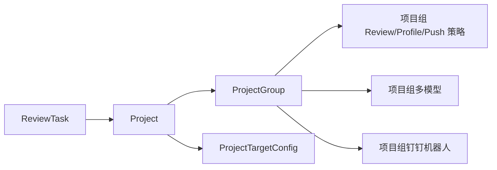
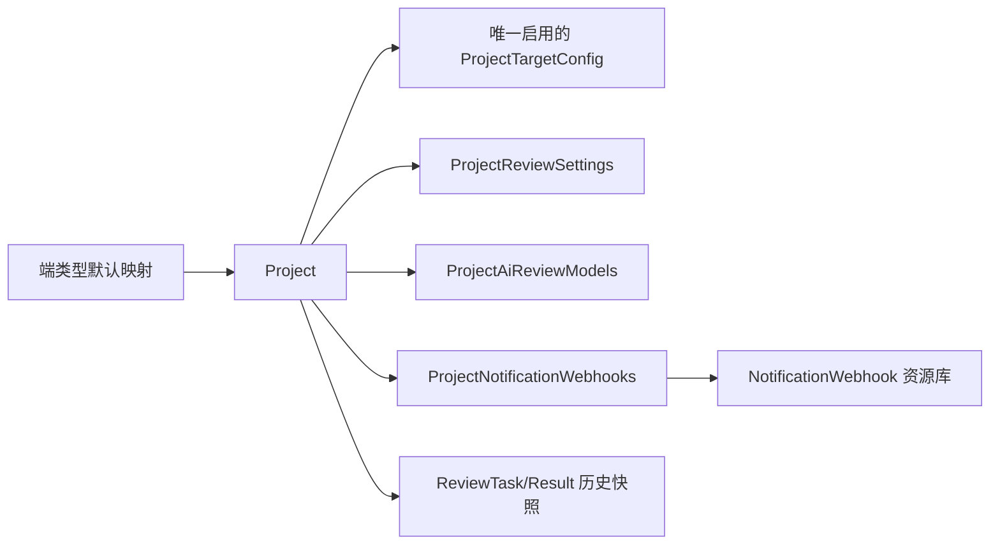
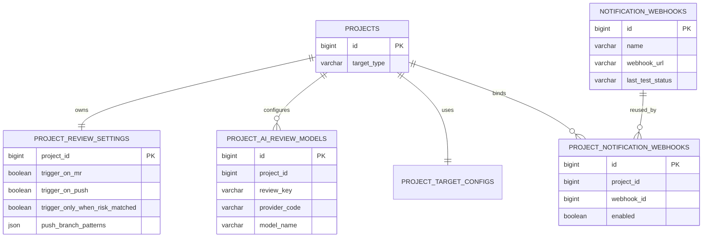

# 项目化 Review 与通知配置改造计划

## 1. 状态与背景

- 计划状态：**阶段六代码与两段式迁移已完成，本地 V55 已执行并待浏览器验收，V56 物理清理待备份与单独授权（2026-08-26）**；
- 当前停止点：活动 Backend、Frontend、API 与测试中的项目组运行依赖已移除；本地 V55 已完成主端类型一致性收敛并通过 API/迁移前置校验，V56 保持 pending，尚未执行测试或生产数据库迁移，未部署、提交或推送；
- 产品背景：组织架构已进入全栈协作模式，原“研发一部后端、研发二部后端、Web 端、iOS 端、Android 端”等项目组不再是
  稳定的业务归属，也不应继续决定 Review 模板、模型、触发策略或钉钉通知目标；
- 当前问题：`projects.group_id -> project_groups -> notification_webhooks` 同时承担组织归类、Review 配置继承和通知路由，项目组停用、
  重建或调整会使项目展示、Review 行为和通知目标产生非预期联动；
- 目标模型：项目是 Review 与通知配置的最终载体；项目暂定只属于一个端类型；端类型决定默认 Review 模板/Profile；项目独立配置
  MR/PUSH 触发；项目与钉钉机器人为多对多关系；项目组从页面和运行时业务模型中退出。

历史多端规划见 [`docs/21-multi-target-review-plan.md`](21-multi-target-review-plan.md) 与
[`docs/22-multi-target-next-phases-plan.md`](22-multi-target-next-phases-plan.md)。本计划采用新的“单项目单端类型”产品约束，暂停 22 号文档中
“一个项目多个端类型并拆分 MR 审查”的后续设想；历史任务和结果中的 `targetType/targetTypes` 快照不做追溯改写。

## 2. 已确认产品决策

1. 项目组不再是有效业务实体，从设置页主流程、任务筛选、Review 配置解析、MR/PUSH 策略和通知路由中移除。
2. 项目暂定只属于一个端类型，端类型取值继续使用 `BACKEND`、`WEB_PC`、`APP_IOS`、`APP_ANDROID`、
   `APP_CROSS_PLATFORM`、`GENERAL`。
3. 一个项目只走一个端类型对应的规则模板和 AI Review Profile；不在本专项实现多端 diff 分桶或一个任务多端 Review。
4. 项目配置页的 Profile 以当前端类型配置为默认值；项目路径编辑器每次打开均以服务端当前端类型默认路径初始化，二者均允许
   项目级调整；不展示 Review 模型区块，Review 引擎跟随
   全局 AI Review 配置（Agent Review 优先，不可用时由 Standard Review 承接），保存时清除 `providerCode` 与 `aiReviewModels`
   项目覆盖。规则模板和提醒卡片继续按现有综合配置契约保存。
5. 项目独立配置自动 Review 触发：`triggerOnMr` 默认 `true`，`triggerOnPush` 默认 `false`；迁移时优先复制原项目组实际值，
   保留既有“只 PUSH”“只 MR”等使用习惯。
6. 项目与钉钉机器人为多对多关系；一个项目可以通知多个机器人，一个机器人可以被多个项目复用。
7. 端类型只承担项目筛选、自动识别和默认 Review 配置归类，不参与通知发送。
8. 前端增加机器人测试功能，保存最近一次测试时间、状态和摘要；一次测试失败只形成健康告警，不自动停用机器人。
9. 钉钉安全模式暂时保持现状，只支持当前 Webhook URL/关键词模式；不新增加签密钥输入、签名计算或密钥托管。
10. 旧项目组数据在迁移和验证期保留作兼容与回退；最终阶段经单独授权后才停止 API 并删除表/字段，不长期在前端展示“原项目组”。

## 3. 改造范围与非目标

### 3.1 本计划范围

- 建立独立钉钉机器人资源库和项目—机器人关联模型；
- 将当前项目组机器人按既有项目归属迁移为项目直接绑定；
- 将项目组 MR/PUSH、Push Gate、风险命中和自动修复预览等运行策略迁移到项目级 Review 设置；
- 将项目组多模型配置迁移为项目级模型配置；
- 收敛项目端类型为单值，并保留每个项目当前实际使用的端类型配置；
- 切换 webhook、manual review、Agent Review、Standard Review 和通知链路，不再读取项目组；
- 重做设置页“项目 / 端类型配置”，以项目配置为默认页签，以机器人库为公共资源页签；
- 删除前端项目组筛选和项目组管理入口；
- 完成迁移审计、双读兼容、分阶段切换、回退保护和最终遗留清理。

### 3.2 非目标

- 不实现一个项目多个端类型或一个 MR 多端拆分审查；
- 不按端类型分别发送钉钉通知；
- 不引入部门、人员、角色或权限体系；
- 不新增钉钉加签密钥、企业内部应用消息或其它通知渠道；
- 不改变 Provider Key、Agent Worker、Review 结果 schema、风险卡片 schema 或 GitLab webhook 对外入口；
- 不追溯修改历史任务、历史结果和历史通知记录；
- 不在阶段一至阶段五物理删除项目组表或字段；
- 不更新已冻结的 `docs/36-review-platform-current-roadmap.md`。

## 4. 当前实现审计

### 4.1 当前数据与运行关系



当前主要耦合点：

- `backend-python/app/project_integration/models.py`：`Project.group_id`、`ProjectGroup`、`ProjectGroupAiReviewModel`；
- `backend-python/app/project_integration/repository.py`：项目组 CRUD、项目绑定、Profile/Provider/多模型/Push Gate 解析；
- `backend-python/app/project_integration/service.py`：MR/PUSH webhook 通过项目组策略决定触发与 Push Gate；
- `backend-python/app/code_quality/service.py`：自动 Review、重试、模型目标和 Agent/Standard 执行读取项目组策略；
- `backend-python/app/agent_review/service.py`：Agent Review Gate 读取项目组策略；
- `backend-python/app/notification/repository.py`：任务通过 `project.group_id` 查项目组机器人；
- `backend-python/app/review_record/repository.py`、`command_center`、`review_quality`：部分查询和统计支持 `groupId`；
- `frontend/src/App.jsx`：设置页以项目组为第一层筛选和编辑对象，机器人内嵌在项目组草稿中。

`project_review_policies` 已用于“反馈沉淀为项目学习规则”，不能用作本计划的 MR/PUSH 配置表。本计划使用
`project_review_settings`，避免和项目学习规则混淆。

### 4.2 当前端类型行为

- `projects.supported_target_types`、`detected_target_types` 使用 JSON 数组；
- `project_target_configs` 允许同一项目多行；
- `TARGET_TYPE_DEFAULTS` 提供端类型默认模板、Profile、路径规则和提醒卡片行为；
- `ReviewTask.target_type`、`target_types_json` 保存任务创建时快照；
- 用户手动维护的端类型配置不会被后续自动检测直接覆盖。

本计划将“配置态端类型”收敛为 `projects.target_type` 单值；自动识别仍可保留多个候选证据，但在创建可执行任务前必须得到一个
确定端类型。

## 5. 目标架构

### 5.1 目标关系



项目组不再出现在目标运行关系中。

### 5.2 Review 决策顺序

```text
项目 targetType
  -> 当前项目唯一启用的 project_target_config
  -> templateCode / codeQualityProfileCode / providerCode
  -> 项目级多模型列表（存在时）
  -> Profile Provider / 全局默认 Provider（项目未覆盖时）
```

不再读取 `project_groups.default_code_quality_profile_code`、`default_provider_code` 或
`project_group_ai_review_models`。

### 5.3 触发决策顺序

```text
GitLab MR  -> project_review_settings.trigger_on_mr
GitLab Push -> project_review_settings.trigger_on_push
             -> 项目 Push 分支/变更量 Gate
             -> trigger_only_when_risk_matched
Manual       -> 保持现有可触发行为
```

新项目默认 `MR=true/PUSH=false`。迁移项目复制原项目组策略，避免组织模型退出时改变现有触发习惯。

### 5.4 通知决策顺序

```text
task_id
  -> review_tasks.project_id
  -> project_notification_webhooks
  -> enabled project relation
  -> enabled notification_webhooks
  -> 向全部有效机器人发送
```

项目没有启用机器人时记录 `DINGTALK_WEBHOOKS_EMPTY/SKIPPED`；不回退默认项目组、其它项目机器人或全局 URL。

## 6. 数据库设计

### 6.1 ER 图



### 6.2 `projects` 调整

新增：

```sql
ALTER TABLE projects
  ADD COLUMN target_type VARCHAR(32) NULL AFTER git_project_id,
  ADD INDEX idx_projects_target_type_status (target_type, status);
```

迁移完成后 `target_type` 必须非空；是否在最终清理阶段改为 `NOT NULL`，由当阶段数据库检查决定。

兼容字段：

- `group_id`：阶段一至阶段五保留，最终清理阶段删除；
- `supported_target_types`：迁移期保持为只含一个元素的 JSON 数组，最终清理阶段评估删除；
- `detected_target_types`、`target_detection_json`：继续保留自动识别证据，不作为运行时多端配置；
- `default_*` 字段：迁移期保留，运行时改用唯一端类型配置后再清理。

### 6.3 `project_review_settings`

```sql
CREATE TABLE project_review_settings (
  project_id BIGINT NOT NULL,
  trigger_on_mr BOOLEAN NOT NULL DEFAULT TRUE,
  trigger_on_push BOOLEAN NOT NULL DEFAULT FALSE,
  trigger_only_when_risk_matched BOOLEAN NOT NULL DEFAULT FALSE,
  auto_fix_preview_enabled BOOLEAN NOT NULL DEFAULT FALSE,
  auto_fix_preview_severities JSON NULL,
  push_branch_patterns JSON NULL,
  push_min_changed_files INT NULL DEFAULT 10,
  push_min_diff_bytes INT NULL DEFAULT 30000,
  push_min_commit_count INT NULL DEFAULT 3,
  push_max_changed_files INT NULL DEFAULT -1,
  push_max_diff_bytes INT NULL DEFAULT -1,
  push_debounce_seconds INT NULL DEFAULT 300,
  created_at DATETIME(3) NOT NULL,
  updated_at DATETIME(3) NOT NULL,
  PRIMARY KEY (project_id)
);
```

说明：

- 不复制已经固定为系统行为的 `review_engine`、`agent_source_export_allowed`、`ai_review_enabled`、`trigger_on_manual`；
- Push 高级参数保留是为了无损迁移既有项目组行为；前端仅在 `triggerOnPush=true` 时展开；
- Repository 必须保证项目创建时同步创建默认设置，历史缺失记录按 `MR=true/PUSH=false` 读取并补齐。

### 6.4 `project_ai_review_models`

```sql
CREATE TABLE project_ai_review_models (
  id BIGINT NOT NULL AUTO_INCREMENT,
  project_id BIGINT NOT NULL,
  review_key VARCHAR(64) NOT NULL,
  provider_code VARCHAR(64) NOT NULL,
  model_name VARCHAR(128) NULL,
  display_name VARCHAR(128) NULL,
  enabled BOOLEAN NOT NULL DEFAULT TRUE,
  sort_order INT NOT NULL DEFAULT 0,
  created_at DATETIME(3) NOT NULL,
  updated_at DATETIME(3) NOT NULL,
  PRIMARY KEY (id),
  UNIQUE KEY uk_project_ai_review_model_key (project_id, review_key),
  KEY idx_project_ai_review_models_project (project_id, enabled, sort_order)
);
```

迁移时将项目原所属组的启用/停用模型完整复制到项目，保持 `review_key`、顺序、Provider 和模型名；项目存在明确
`project_target_configs.provider_code` 覆盖时，继续优先使用该单 Provider，不额外并发项目模型列表。

### 6.5 `notification_webhooks` 资源化

在现表增加：

```sql
ALTER TABLE notification_webhooks
  ADD COLUMN description VARCHAR(512) NULL,
  ADD COLUMN last_test_status VARCHAR(32) NOT NULL DEFAULT 'UNTESTED',
  ADD COLUMN last_test_at DATETIME(3) NULL,
  ADD COLUMN last_test_message VARCHAR(1024) NULL;
```

`project_group_id` 在迁移期保留为兼容来源，目标模型不再写入。接口只返回 `webhookMasked`，不返回完整 `webhookUrl`；更新时
未提供 `webhookUrl` 表示保留原值，禁止把空字符串解释为清空。

健康状态：

- `UNTESTED`：未测试；
- `SUCCESS`：最近测试成功；
- `FAILED`：最近测试失败；
- `SKIPPED`：测试未实际发送，例如全局钉钉通知关闭。

健康状态不替代 `enabled/status`，测试失败或跳过不自动停用；只有 `FAILED` 形成项目“健康告警”，`SKIPPED` 只展示未执行原因。

### 6.6 `project_notification_webhooks`

```sql
CREATE TABLE project_notification_webhooks (
  id BIGINT NOT NULL AUTO_INCREMENT,
  project_id BIGINT NOT NULL,
  webhook_id BIGINT NOT NULL,
  enabled BOOLEAN NOT NULL DEFAULT TRUE,
  created_at DATETIME(3) NOT NULL,
  updated_at DATETIME(3) NOT NULL,
  PRIMARY KEY (id),
  UNIQUE KEY uk_project_notification_webhook (project_id, webhook_id),
  KEY idx_project_notification_webhooks_project (project_id, enabled),
  KEY idx_project_notification_webhooks_webhook (webhook_id, enabled)
);
```

停用机器人不删除项目关联；项目通知状态随机器人可用性变为“配置异常”。删除机器人前必须确认不存在任何项目关联。

### 6.7 单端类型约束

- 每个项目只允许一个启用的 `project_target_configs`；
- 该配置的 `target_type` 必须等于 `projects.target_type`；
- `supported_target_types` 在兼容期写为 `[target_type]`；
- 自动识别可返回多个候选，但不能自动覆盖人工端类型；多候选时沿用已配置端类型，新项目无人工值时按既有优先级选择一个主类型
  并保存识别证据；
- 历史存在多个人工启用配置的项目必须进入迁移异常清单，不能静默删除配置。

## 7. API 与 DTO 设计

所有新增或调整接口使用明确的 Pydantic schema；不继续扩展无类型 `dict[str, Any]` 请求。

### 7.1 项目列表

```http
GET /api/projects?targetType=WEB_PC&keyword=saas&notificationStatus=CONFIGURED&reviewStatus=CONFIGURED&pageNo=1&pageSize=20
```

移除 `groupId` 主流程参数；兼容期收到 `groupId` 可返回弃用告警日志，但新前端不得再发送。

项目列表 VO 关键字段：

```json
{
  "id": 12,
  "name": "ljdw/ljdw2-saas-front-web",
  "gitProjectId": "148",
  "repositoryUrl": "https://gitlab.example/ljdw/ljdw2-saas-front-web",
  "targetType": "WEB_PC",
  "reviewProfileCode": "web-pc-default-ai-review",
  "reviewModelNames": ["DeepSeek"],
  "triggerOnMr": true,
  "triggerOnPush": false,
  "notificationStatus": "CONFIGURED",
  "webhooks": [
    {"id": 18, "name": "前端研发群", "enabled": true, "lastTestStatus": "SUCCESS"}
  ]
}
```

项目通知状态：

- `CONFIGURED`：至少关联一个启用机器人；
- `UNCONFIGURED`：无任何关联；
- `ABNORMAL`：存在关联，但没有启用机器人；
- `HEALTH_WARNING` 作为附加健康标识，不替代 `CONFIGURED`，表示至少一个启用机器人最近测试失败。

Review 配置状态：

- `CONFIGURED`：唯一端类型配置能解析出有效 Profile 和至少一个可用 Review 模型/Provider；
- `UNCONFIGURED`：Profile 或 Provider/模型无法解析；
- 单项目单端类型后不再需要“部分配置”。

#### 7.1.1 端类型默认配置

```http
GET /api/projects/configuration-defaults?targetType=WEB_PC
```

`targetType` 只接受 `BACKEND/WEB_PC/APP_IOS/APP_ANDROID/APP_CROSS_PLATFORM/GENERAL`。响应直接复用运行时
`TARGET_TYPE_DEFAULTS`，返回 `targetType` 和 `targetConfig`；`targetConfig` 包含 `templateCode`、
`codeQualityProfileCode`、`providerCode`、`pathPatterns` 和 `reminderCardEnabled`，API 层不维护第二份默认映射。

#### 7.1.2 恢复端类型自动识别

```http
GET /api/projects/{projectId}/target-type-auto-detection/preview
PUT /api/projects/{projectId}/target-type-auto-detection
```

预览响应返回 `currentTargetType`、首个拟采用的 `detectedTargetType`、完整 `detectedTargetTypes`、识别证据、默认
`targetConfig`、逐字段 `changes` 和当前证据的 SHA-256 `evidenceVersion`，且不写数据库。应用请求为：

```json
{
  "targetType": "WEB_PC",
  "evidenceVersion": "64 位 SHA-256 十六进制值"
}
```

应用时服务端重新计算证据版本，并校验请求端类型等于当前首个候选；证据缺失返回
`PROJECT_TARGET_DETECTION_UNAVAILABLE`（409），版本变化或端类型不匹配返回 `PROJECT_TARGET_DETECTION_STALE`（409）。
校验通过后原子应用单一端类型及对应默认端配置，清除端配置 Provider 覆盖，同时保留项目模型、Review 设置和机器人关联；
相同证据重复应用保持幂等。多个候选只作为完整识别证据返回，不改变既有固定单端类型运行语义。

### 7.2 单项目综合配置

```http
GET /api/projects/{projectId}/configuration
PUT /api/projects/{projectId}/configuration
```

更新请求示例：

```json
{
  "targetType": "WEB_PC",
  "targetConfig": {
    "templateCode": "frontend-default",
    "codeQualityProfileCode": "web-pc-default-ai-review",
    "providerCode": "DEEPSEEK",
    "pathPatterns": ["**/*"],
    "reminderCardEnabled": false
  },
  "aiReviewModels": [],
  "reviewSettings": {
    "triggerOnMr": true,
    "triggerOnPush": false,
    "triggerOnlyWhenRiskMatched": false,
    "autoFixPreviewEnabled": false,
    "autoFixPreviewSeverities": ["MAJOR"],
    "pushBranchPatterns": ["develop", "feature/*", "bugfix/*", "hotfix/*"],
    "pushMinChangedFiles": 10,
    "pushMinDiffBytes": 30000,
    "pushMinCommitCount": 3,
    "pushMaxChangedFiles": -1,
    "pushMaxDiffBytes": -1,
    "pushDebounceSeconds": 300
  },
  "webhookIds": [13, 18]
}
```

Service 在单个数据库事务中验证并保存：项目端类型、唯一端类型配置、项目模型、Review 设置和机器人关联。端类型改变导致模板/Profile
变化时，前端必须先展示差异；Backend 仍以请求内完整配置为准，禁止根据旧项目组隐式覆盖。项目中心前端保存用户确认的 Profile
与路径规则，同时提交 `providerCode: null` 和空 `aiReviewModels`；Backend 暂时保留原 DTO 兼容其它调用方，不在本阶段删除字段。

### 7.3 机器人库

```http
GET    /api/notification-webhooks?keyword=&status=ENABLED&lastTestStatus=SUCCESS&pageNo=1&pageSize=20
POST   /api/notification-webhooks
PUT    /api/notification-webhooks/{webhookId}
DELETE /api/notification-webhooks/{webhookId}
POST   /api/notification-webhooks/{webhookId}/test
GET    /api/notification-webhooks/{webhookId}/projects
```

新增请求：

```json
{
  "name": "前端研发群",
  "webhookUrl": "https://oapi.dingtalk.com/robot/send?access_token=...",
  "description": "前后端共同维护的产品群",
  "enabled": true
}
```

编辑请求中 `webhookUrl` 可省略，省略即不修改；Response 只返回脱敏值。测试接口由服务端读取已保存 URL 并发送固定安全消息，不能由
调用方传任意 URL。

`keyword` 只匹配机器人名称、描述和服务端生成的 Webhook 末四位，不支持按完整 token 模糊检索；测试响应和落库状态区分
`SUCCESS/FAILED/SKIPPED`，其中 `SKIPPED` 必须返回未发送原因。

删除规则：

- 关联项目数为 0：允许删除；
- 存在项目关联：返回 `VALIDATION_ERROR` 和关联数量，要求先解除关联；
- 停用机器人：保留项目关联。

### 7.4 批量项目机器人配置

```http
POST /api/projects/notification-webhooks/batch/preview
PUT /api/projects/notification-webhooks/batch
```

```json
{
  "projectIds": [12, 18, 22],
  "webhookIds": [13, 18],
  "mode": "REPLACE"
}
```

`mode`：

- `REPLACE`：完全替换所选项目机器人；
- `ADD`：追加关联，重复关联幂等；
- `REMOVE`：移除指定机器人，不存在的关联忽略。

预览接口不写数据库，返回当前数据库快照下的精确差异：

```json
{
  "changedProjectCount": 2,
  "unchangedProjectCount": 0,
  "items": [
    {
      "projectId": 12,
      "beforeWebhookIds": [13],
      "afterWebhookIds": [13, 18],
      "addedWebhookIds": [18],
      "removedWebhookIds": []
    }
  ]
}
```

正式保存必须重新读取并校验当前关联，不能直接信任预览结果；保存响应使用相同差异结构，供前端识别预览后发生的并发变化。三种模式均
保持幂等。单次批量项目数设置上限，建议第一版不超过 100。

## 8. Backend 详细改动

### 8.1 项目与端类型

- `project_integration/models.py`：增加 `Project.target_type`、`ProjectReviewSettings`、`ProjectAiReviewModel`；
- `project_integration/repository.py`：新增单端类型校验、项目综合配置查询/保存、项目设置和项目模型 Repository；
- `upsert_gitlab_project()`：新项目依据自动识别选择一个端类型并创建唯一配置；已有项目只更新识别证据，不覆盖人工类型；
- `resolve_project_target_config()`：直接使用 `project.target_type` 和唯一启用配置，不再从多个配置按 changed files 选择；
- `resolve_project_review_profile_code()`：删除项目组优先级，使用项目端类型配置，缺失时使用 `TARGET_TYPE_DEFAULTS`；
- 历史 `target_types_json` 继续按单值数组写入，避免现有 DTO/VO 立即破坏。

### 8.2 MR/PUSH 与 Review Gate

- 将 `get_project_group_push_policy()`、`get_project_group_ai_review_policy()` 替换为项目级设置读取；
- MR 自动 Review 读取 `trigger_on_mr`，Push 自动 Review 与 Push Gate 读取项目级字段；
- manual review 保持现有行为，不新增项目开关；
- `trigger_only_when_risk_matched`、自动修复预览行为一并迁移，避免删除项目组后静默恢复系统默认；
- `agent_review/service.py`、`code_quality/service.py` 和 `project_integration/service.py` 禁止继续读取项目组；
- 日志增加 `projectId`、`targetType`、`triggerOnMr/Push`、Gate 关键参数来源 `PROJECT`，便于迁移核对。

### 8.3 Review 模型解析

优先级：

1. `project_target_configs.provider_code` 明确单 Provider 覆盖；
2. `project_ai_review_models` 启用列表；
3. Profile Provider；
4. 全局默认 Provider。

项目组模型迁移后，`code_quality/service.py::_resolve_review_targets()` 不再查询 `ProjectGroupAiReviewModel`。

### 8.4 通知

- `notification/models.py`：机器人资源字段与 `ProjectNotificationWebhook`；
- `notification/repository.py`：资源 CRUD、项目关联 CRUD、项目通知状态、按任务查项目机器人；
- `notification/service.py`：发送流程复用现有 `_send_to_url()`，增加存量机器人测试服务和健康状态落库；
- 新增 `notification/api.py` 和 Pydantic schemas，在 `main.py` 注册 Router；
- 不再提供项目组机器人兼容兜底；迁移期旧读取只允许作为显式开关控制的回退，完成切换验证后关闭。

### 8.5 查询、统计与历史接口

- 任务列表、任务详情、Command Center 和 Review Quality 移除项目组筛选与展示；
- 新增 `targetType`、`projectId` 作为主要过滤维度；
- 历史 API 的 `groupId` 在兼容期记录弃用日志，不返回错误；最终清理阶段移除；
- `project_review_policies`（项目学习规则）保持不变，不与 `project_review_settings` 合并。

## 9. Frontend UI 详细调整

### 9.1 导航与页面层级

阶段五以以下四张参考图作为桌面端视觉与交互基线；参考图用于确定信息层级、密度、抽屉结构和状态表达，不替代本文的接口、响应式、
安全和异常处理约束：

- [项目配置列表参考](<项目化 Review 与通知配置改造计划调整参考图/ChatGPT Image 2026年8月24日 22_36_01.png>)；
- [单项目配置抽屉参考](<项目化 Review 与通知配置改造计划调整参考图/ChatGPT Image 2026年8月24日 22_36_04.png>)；
- [批量配置机器人抽屉参考](<项目化 Review 与通知配置改造计划调整参考图/ChatGPT Image 2026年8月24日 22_36_06.png>)；
- [钉钉机器人库参考](<项目化 Review 与通知配置改造计划调整参考图/ChatGPT Image 2026年8月24日 22_36_07.png>)。

设置侧边栏：

```text
设置
├── 项目 / 端类型配置
├── AI Review 配置
└── 全局设置
```

“项目 / 端类型配置”页面：

```text
[项目配置] [钉钉机器人库]

项目配置（默认）
├── 筛选栏
├── 项目表格
├── 批量配置机器人
├── 单项目配置抽屉
└── 端类型自动识别规则（默认折叠）
```

项目组管理卡片、项目组新建/停用、项目组筛选、“当前项目所属项目组”和项目组机器人编辑区全部移除。

### 9.2 项目配置页头与筛选

页头：

```text
项目通知与 Review 配置                          [刷新项目] [管理机器人]
按项目维护端类型、Review 配置、MR/PUSH 触发与钉钉通知机器人
```

筛选栏保持一行紧凑布局，窄屏自动换行：

| 筛选项 | 交互 |
| --- | --- |
| 端类型 | 全部、后端、PC Web、iOS、Android、跨端、通用 |
| 项目搜索 | 项目名、完整路径、GitLab ID |
| 通知状态 | 全部、已配置、未配置、配置异常、健康告警 |
| Review 状态 | 全部、已配置、未配置 |
| 操作 | 查询、重置 |

端类型第一版使用单选分段或下拉；它只过滤项目，不改变通知目标。

“管理机器人”按钮只切换到当前页面的“钉钉机器人库”Tab，不打开第三套路由、弹窗或独立管理页。

### 9.3 项目表格

| 列 | 展示 |
| --- | --- |
| 选择 | 支持跨当前页批量选择时必须明确选中范围；第一版可只选当前查询结果页 |
| 项目 | 主行显示短名称，次行浅色显示完整 GitLab 路径/仓库 URL |
| GitLab ID | `gitProjectId` |
| 端类型 | 单个 Tag |
| Review 配置 | `Profile / 模型`；解析失败显示橙色“未配置” |
| 触发方式 | `MR`、`PUSH` Tag，关闭项使用弱化样式 |
| 钉钉机器人 | 最多显示两个 Tag，超过后显示 `+N`，Tooltip 展示全部 |
| 通知状态 | 已配置、未配置、配置异常；健康失败增加告警图标 |
| 操作 | 固定右侧“配置”按钮 |

桌面端固定项目列和操作列；表格支持分页，不将所有项目一次性加载到浏览器。

- `notificationStatus`、`healthWarning`、`reviewStatus` 必须由 Backend 项目列表 VO 统一返回，前端只负责映射文案和视觉状态；
- 机器人最多展示两个 Tag，`+N` 必须通过 Tooltip/Popover 展示完整列表；
- 第一版勾选范围限定为当前结果页；分页、重新查询、重置筛选或切换页签时清空选择，避免形成虚假的跨页选中；
- 批量保存失败保留当前选择，保存成功后清空选择并刷新当前页。

### 9.4 单项目配置抽屉

宽抽屉标题：

```text
配置项目
ljdw2-saas-front-web · GitLab ID 148
```

桌面端宽度建议为 `520px-560px`，在不遮挡项目上下文的前提下容纳完整表单；移动端使用全屏宽度。底部操作区固定，抽屉内容独立滚动。

区块一“基础与 Review 配置”：

- 不显示独立区块标题和说明，抽屉标题后直接进入端类型与规则模板表单；
- 端类型：单选；
- 规则模板；
- AI Review Profile：默认展示当前端类型配置，并允许项目级选择；
- 不展示 Review 模型区块，不提供项目级模型选择；
- 项目路径规则：每次打开抽屉均使用服务端当前端类型默认路径作为初始值，并允许项目级编辑；
- 提醒卡片开关；
- 不展示“使用端类型默认配置”开关，端类型变化时直接加载服务端默认 Profile 与路径，用户仍可在保存前调整；
- 修改端类型时加载新端类型默认模板/Profile，并在抽屉内显示“端类型变化将同时调整以下 Review 配置”的差异提醒；
- 差异提醒至少展示旧/新端类型、规则模板和 Profile；未确认最终值前不得静默提交；
- 保存时保留用户确认的 Profile 与路径规则，清除旧 `providerCode` 和项目模型覆盖；旧项目在首次保存前继续保持已有模型运行行为，
  避免仅打开抽屉就静默改写配置。

区块二“Review 触发”：

- MR 自动 Review 开关，默认开启；
- PUSH 自动 Review 开关，默认关闭；
- PUSH 开启后展开“高级条件”：分支模式、最小/最大文件数、diff 字节、commit 数、防抖时间；
- 风险命中后才触发、自动修复预览等既有开关按现有能力保留；
- Manual Review 行为不在此处关闭。

区块三“钉钉通知”：

- 多选已有启用机器人；
- 选项显示名称、脱敏地址、启停和最近测试状态；
- 停用机器人不可新选，但已关联的停用机器人可显示并移除；
- “新增机器人”打开机器人弹窗，保存成功后自动回到抽屉并可选择；
- 文案显示“Review 完成后将通知 N 个群”；
- 无机器人时明确提示任务仍执行，但通知会记录为跳过。

抽屉底部固定：

```text
[取消] [保存项目配置]
```

端类型、Review、触发和机器人配置由一次保存提交，失败时保持草稿并展示具体字段错误。

项目配置抽屉点击遮罩、关闭按钮或取消时直接关闭并丢弃草稿，不显示二次确认；切换页签或离开设置页时继续接入既有 dirty guard。
保存失败不得清空草稿；保存成功后刷新列表中的 Review、触发和通知状态。

### 9.5 批量配置机器人

选中项目后，表格顶部显示吸附式工具栏：

```text
已选择 5 个项目    [批量配置机器人] [取消选择]
```

批量抽屉只修改机器人，不修改端类型、Review Profile、模型或 MR/PUSH 开关。

操作模式使用单选卡片：

- 覆盖现有配置（默认推荐）；
- 追加机器人；
- 移除指定机器人。

只有启用机器人可被 `REPLACE/ADD` 新选；`REMOVE` 允许选择当前项目关联的停用机器人。选项必须展示脱敏地址、启停和最近测试状态。

保存前调用 §7.4 的服务端预览接口，展示项目数、机器人、操作模式、受影响项目以及逐项目变化摘要。`REMOVE` 时区分实际变化与无需调整
数量；确认按钮写成“确认配置 5 个项目”。不能只用前端当前行数据计算差异。正式保存返回与预览不一致时，以保存结果为准并提示存在并发
变化。

取消批量抽屉保留项目勾选，方便重新选择操作模式；保存成功后清空勾选，保存失败保留抽屉草稿和项目选择。

### 9.6 钉钉机器人库

表格：

| 机器人名称 | Webhook | 状态 | 已关联项目 | 最近测试 | 操作 |
| --- | --- | --- | ---: | --- | --- |
| 前端研发群 | `https://...****1234` | 启用 | 6 | 测试成功 | 编辑、测试、停用 |

交互：

- 新增/编辑使用弹窗；
- 字段仅包含名称、Webhook、描述、启用状态；不展示加签密钥；
- 编辑默认只显示脱敏地址，用户主动选择“更换 Webhook”后才出现空输入框；
- 测试按钮调用服务端已保存 URL，不允许前端回传任意目标；
- 测试成功/失败/跳过更新最近测试状态，失败不自动停用，跳过需展示具体原因；
- 搜索支持名称、描述和 Webhook 后四位，不支持完整 token 检索；
- 点击“已关联项目 N”打开项目列表并支持跳转到项目抽屉；
- 关联项目数为 0 才允许删除；存在关联时提示先解除；
- 停用不删除关联，对应项目显示“配置异常”。

### 9.7 端类型自动识别规则

- 保留在“项目配置”页签底部，默认折叠；
- 标题说明改为“仅用于项目分类和默认 Review 配置，不参与通知路由”；
- 人工端类型优先于自动识别；
- 提供“恢复自动识别”操作时，必须先展示将采用的识别结果和 Review 配置变化；
- 多候选识别证据仍可展示，但最终项目配置只保存一个端类型。

### 9.8 上线提示

首次进入新页面时显示一次可关闭提示：

> 项目组配置已升级为项目级 Review 与通知配置，原有端类型、触发策略、模型和机器人关系已自动迁移。

提示只保存前端已读状态，不长期展示原项目组名称。

### 9.9 前端实现边界与组件拆分

现有设置页主要集中在 `frontend/src/App.jsx`，阶段五不得继续把项目表格、两个抽屉和机器人库的全部状态堆入单一文件。建议新增独立目录，
命名可按实现时现有约定微调：

```text
frontend/src/project-config/
├── ProjectConfigurationPage.jsx
├── ProjectConfigurationTable.jsx
├── ProjectConfigurationDrawer.jsx
├── BatchWebhookDrawer.jsx
├── WebhookLibrary.jsx
├── WebhookEditorModal.jsx
└── projectConfigurationApi.js
```

- `App.jsx` 只负责设置路由、页签入口和共享 shell；
- 项目查询条件、分页和选择由项目配置页管理；
- 单项目抽屉与批量抽屉分别维护独立草稿和 loading/error 状态；
- 复用现有设置导航、message、dirty guard 和 Ant Design 组件，不新增状态管理或 UI 依赖；
- `1440px` 参考图按桌面基线还原，`1024px` 筛选换行且抽屉不遮挡关闭/保存，`390px` 抽屉全屏、表格横向内部滚动且页面本身无横向溢出；
- 颜色只作为辅助，所有健康、配置和启停状态必须同时有文字/图标或可访问标签。

## 10. 数据迁移与兼容策略

### 10.1 迁移前审计

迁移脚本必须先只读输出：

- 每个项目当前项目组、端类型配置数、有效主端类型；
- 多个人工端类型配置、无端类型、无有效 Profile、无 Provider 的异常项目；
- 每个项目组 MR/PUSH 和 Push Gate 实际值；
- 项目组模型与项目端类型 Provider 覆盖冲突；
- 项目组机器人、重复 URL、停用机器人和关联项目数量；
- 仍绑定停用项目组的项目。

发现多个端类型无法确定主类型时，阶段不得自动继续；先输出项目 ID 和候选类型，由用户在现有页面修正或提供映射。

### 10.2 端类型与 Review 配置迁移

主端类型选择顺序：

1. 只有一个人工维护的启用 `project_target_configs`：使用该类型；
2. `supported_target_types` 只有一个值：使用该值；
3. 只有一个自动识别配置：使用该值；
4. 仍有多个候选：进入异常清单，不静默选择。

将最终类型写入 `projects.target_type`，`supported_target_types` 同步为单元素数组；其它历史配置暂不删除，只标记/保持不参与运行时，
最终清理阶段处理。

当前项目组明确配置的 Profile 若是当前有效行为，迁移到项目唯一 `project_target_configs.code_quality_profile_code`；否则保留项目现有配置。

### 10.3 MR/PUSH 与模型迁移

- 每个项目创建一条 `project_review_settings`；
- 有项目组时复制该组全部相关字段；无项目组时使用 `MR=true/PUSH=false` 和系统 Push 默认值；
- 将项目组模型逐项目复制到 `project_ai_review_models`；
- 项目已有 Provider 覆盖时仍保留覆盖优先级；
- 迁移前后对每个项目生成 Effective Review Config 对比，Profile、Provider/模型、MR/PUSH 和 Push Gate 必须一致。

### 10.4 机器人迁移

- 以去除首尾空格后的完整 URL 精确相等作为去重条件，不做大小写转换 token；
- 同 URL 多记录时保留最早资源 ID，名称优先保留启用记录名称，并输出合并审计；
- 对每个项目，仅迁移其当前 `group_id` 对应的机器人；
- 默认项目组机器人只迁移给实际属于默认组的项目，绝不迁移给其它组项目；
- 停用机器人保留资源和关联，项目状态显示“配置异常”；
- 迁移不读取历史 `notification_records.target` 推断机器人，避免把旧全局兜底 URL 误当项目机器人；
- 迁移完成后校验资源数、关联数、项目通知状态和重复 URL。

### 10.5 双读与回退

- 阶段一只建新表和回填，运行时仍读旧项目组；
- 阶段二通知链先以项目关联为主，迁移标记缺失时可通过显式兼容开关回读旧组；开关默认仅测试环境可见；
- 阶段三/四切换 Review 与触发策略后，不再新增旧组数据；
- 每个切换阶段保留结果对比日志，发现不一致时回退读路径，不回滚已经验证正确的新表数据；
- 最终清理必须在兼容开关连续关闭并完成验收后单独授权。

## 11. 多阶段推进计划

所有阶段均按可独立验收、可独立授权和可安全停止拆分；没有保留“改动量等级：大”的阶段。每个阶段完成后必须回填实施结果、
汇报“改了什么、为什么、如何验证”，然后停止等待用户确认。

### 11.1 阶段一：项目化数据基础与迁移审计

改动量等级：**中**。新增四类数据结构和只读/回填脚本，涉及数据库与 Repository，但不切换生产运行链路。

目标：建立项目端类型、Review 设置、项目模型、机器人资源与项目关联的数据基础，并完成可重复、可审计的迁移。

范围：

- 新增 `projects.target_type`、`project_review_settings`、`project_ai_review_models`、`project_notification_webhooks`；
- 扩展 `notification_webhooks` 健康字段；
- 增加迁移预检、异常报告、幂等回填和迁移后 Effective Config 对比；
- 新表 Repository 与模型单元/contract 测试；
- 保持所有现有 API 和运行时读路径不变。

非目标：不切换通知、Review、MR/PUSH；不修改前端；不删除项目组；不调用真实机器人。

验收方式：

- 测试库迁移预检能列出全部异常而不写数据；
- 幂等回填重复执行不产生重复模型/机器人关联；
- 无异常项目迁移前后 Effective Config 一致；
- 相关 migration/unit/contract 测试和受影响 Python 测试通过。

授权边界与停止点：只允许修改本计划、Python 模型/Repository、migration、迁移审计能力和测试；不得切换运行时或修改前端。完成后
停止，等待用户确认阶段二；不自动提交、推送或部署。

### 11.2 阶段二：项目级机器人 API、测试与通知切换

改动量等级：**中**。涉及机器人 CRUD/测试、项目多对多关联、批量接口和通知主链路，但不改变 Review 模板或触发行为。

目标：通知完全按项目关联机器人发送，项目组不再参与通知路由。

范围：

- 机器人资源 API、脱敏 DTO、测试接口和健康状态；
- 单项目、批量预览与批量机器人关联 API；
- `enabled_webhooks_for_task()` 切换到项目关联；
- 无机器人、多个机器人、部分失败、停用、测试失败和删除约束；
- 显式兼容开关与新旧结果对比日志；
- 更新钉钉 integration/contract 测试。

非目标：不改 Review Profile/模型/MR/PUSH；不修改主设置页；不删除旧项目组机器人字段。

验收方式：

- 同一机器人可绑定多个项目，一个项目可绑定多个机器人；
- 任务只发送到当前项目机器人，不回退默认项目组；
- 机器人测试落库且失败不自动停用，跳过测试返回明确原因；
- API 不返回完整 URL；批量预览不写数据，正式保存重新校验并返回最终差异，三种模式幂等；
- 受影响通知闭环、相关 contract 测试和最小全链路测试通过。

授权边界与停止点：只允许修改通知、项目机器人关联 API、测试和本文；不迁移 Review/触发读路径，不修改前端主页面。完成后停止等待
阶段三确认；不自动提交、推送、部署或向真实群发送测试消息。

### 11.3 阶段三：项目级 MR/PUSH 与 Push Gate 切换

改动量等级：**中**。跨 MR、Push、自动 Review Gate 和项目配置接口，需要主链路兼容验证，但暂不迁移 Profile/多模型解析。

目标：项目独立决定 MR/PUSH 触发及 Push Gate，彻底解除触发行为对项目组的依赖。

范围：

- 项目 Review 设置查询/更新 DTO；
- MR 默认开启、PUSH 默认关闭；
- 迁移项目沿用原组实际开关和 Push Gate；
- MR、Push、manual 和 Agent/Standard Gate 读取项目设置；
- 项目创建和 webhook 自动创建时生成默认设置；
- 触发决策日志和新旧结果对比测试。

非目标：不切换 Profile、多模型；不修改项目设置主 UI；不删除项目组策略列。

验收方式：

- 新项目默认 MR 触发、Push 不触发；
- “只 MR”“只 Push”“都开”“都关”按项目独立生效；
- Push 分支、大小、文件数、commit 数和防抖 Gate 不回归；
- manual review 保持现状；
- 相关 code quality、GitLab webhook、Agent Review contract 测试通过。

授权边界与停止点：只允许修改项目 Review 设置、MR/PUSH/Agent Gate、测试和本文；不得切换 Profile/模型，不改前端。完成后停止等待
阶段四确认。

### 11.4 阶段四：单端类型与项目 Review 配置切换

改动量等级：**中**。涉及端类型解析、Profile/Provider/多模型优先级和任务创建快照，需要 Review 主链路验证，但数据库基础已在阶段一完成。

目标：项目端类型和项目配置决定模板、Profile、模型与 Review 结果，不再读取项目组。

范围：

- 单端类型校验与唯一启用 `project_target_configs`；
- webhook/manual review 统一使用 `projects.target_type`；
- Profile/Provider/项目多模型解析切换；
- 项目综合配置 GET/PUT；
- 历史 `targetTypes` 兼容单值数组；
- 自动识别只更新候选证据，不覆盖人工类型；
- 移除 runtime 对 ProjectGroup/Profile/Model 的读取。

非目标：不改前端；不物理删除旧组或多端字段；不实现动态继承和多端拆分。

验收方式：

- 每个项目只有一个实际执行端类型；
- 后端、PC、iOS、Android、跨端、通用项目使用正确模板/Profile；
- 项目模型迁移前后结果目标一致；
- MR、Push、manual、重试、Agent/Standard 执行链闭环；
- 相关 project、code quality、agent review、review task contract 测试通过。

授权边界与停止点：只允许修改端类型、Review 配置解析、综合接口、测试和本文；不得修改前端或删除旧表。完成后停止等待阶段五确认。

### 11.5 阶段五前置：项目中心 Backend 接口补充

改动量等级：**中**。扩展项目列表公开查询与状态 VO，新增端类型默认配置和恢复自动识别接口，涉及 API、Repository、DTO 与契约测试，但不修改数据库或 Review/通知运行主链路。

目标：补齐项目中心 UI 必需的服务端分页、筛选、状态摘要和端类型操作契约，使阶段五前端能够只映射 Backend 状态，不执行 N+1 聚合或自行推导业务状态。

范围：

- 扩展 `GET /api/projects`，支持 `keyword`、`targetType`、`notificationStatus`、`reviewStatus`、`pageNo`、`pageSize`；
- 项目列表 VO 返回 `reviewProfileCode`、`reviewModelNames`、`triggerOnMr`、`triggerOnPush`、`notificationStatus`、`healthWarning`、`reviewStatus` 和脱敏机器人摘要；
- 新增 `GET /api/projects/configuration-defaults?targetType=...`，返回六种端类型的默认模板、Profile、Provider、路径规则和提醒卡片设置；
- 新增 `GET /api/projects/{projectId}/target-type-auto-detection/preview`，基于已保存识别证据返回候选、拟采用端类型及端类型/模板/Profile 配置差异，接口只读；
- 新增 `PUT /api/projects/{projectId}/target-type-auto-detection`，服务端重新校验当前识别证据后原子应用单一端类型和对应默认端配置，保留项目模型、Review 触发设置和机器人关联；
- 补充查询参数、状态组合、分页边界、默认配置、预览无写入、应用幂等、证据变化/缺失和人工配置不被后台自动覆盖的契约测试；
- 更新本文接口契约、验收矩阵和阶段实施记录。

非目标：不修改前端；不新增数据库字段或 migration；不改变 MR、Push、manual、Agent/Standard、通知发送和 Provider 解析主链路；不在 webhook 或 diff 获取时自动覆盖人工端类型；不删除项目组兼容结构；不调用真实 GitLab、机器人或 Provider。

验收方式：

- 项目列表筛选与分页由服务端执行，`total/pageNo/pageSize/items` 与组合条件一致；
- 已配置、未配置、配置异常和健康告警状态由 Backend 统一判定，前端不需要追加项目级查询；
- 六种端类型默认配置与运行时 `TARGET_TYPE_DEFAULTS` 使用同一来源，不在 API 层维护第二份映射；
- 自动识别预览不写数据库；应用只接受当前证据支持的单一端类型，证据缺失、变化或候选不合法时返回明确错误；
- 自动识别应用重复执行保持幂等，且不修改项目模型、Review 设置和机器人关联；
- 相关 project/notification contract 测试、受影响 Python 测试和变更文件 Ruff 检查通过。

授权边界与停止点：本阶段已按授权完成，仅修改 Python 项目查询/端类型接口、必要 DTO/Repository、契约测试和本文；未修改前端、数据库、部署或运行主链路。当前停止并等待用户确认恢复阶段五前端 UI。

### 11.6 阶段五：项目中心前端 UI

改动量等级：**中**。重组设置页核心信息架构、项目表格、抽屉、批量操作和机器人库，但使用阶段二至四稳定 API。

目标：前端主对象从项目组切换为项目，完成项目 Review、MR/PUSH 和通知配置闭环。

范围：

- 菜单更名为“项目 / 端类型配置”；
- “项目配置 / 钉钉机器人库”页内 Tab；
- 筛选、服务端分页项目表格、Backend 状态映射、当前页选择和固定列；
- 单项目综合配置抽屉；
- 批量机器人抽屉及服务端变更预览；
- 机器人新增/编辑/测试/停用/删除与关联项目查看；
- 端类型规则默认折叠、说明和恢复自动识别；
- 一次性迁移提示、dirty guard、桌面/移动端响应式布局和独立组件拆分；
- 前端定向测试、全量测试、build 和浏览器验收。

非目标：不修改 Backend 契约；不展示项目组；不增加加签密钥；不做真实群测试；不同时渲染两张超长大表。

验收方式：

- 用户不经过项目组即可完成项目筛选、Review、MR/PUSH 和机器人配置；
- 单项目保存、端类型变化差异、批量三种模式服务端预览、机器人测试和删除约束交互完整；
- 项目筛选、分页和页签切换正确清理选择；保存失败保留草稿/选择，保存成功刷新状态并清理选择；
- `1440px`、`1024px`、`390px` 无横向页面溢出，表格内部滚动和固定列可用；
- 相关前端测试、全部前端测试、`scripts/run-frontend.ps1 build` 通过；
- 浏览器验收使用安全 mock 或只读数据，不调用真实机器人/Provider。

授权边界与停止点：只允许修改前端、前端测试、必要文案和本文；不得调整 Backend、数据库或部署。完成后停止等待阶段六确认。

实施状态（2026-08-26）：阶段五主体实现已完成并通过首轮验收。浏览器在 `1440px/1024px/390px` 下验证无页面级横向溢出，筛选换行、表格内部滚动、项目/操作固定列、项目与批量抽屉、服务端批量预览、自动识别预览、分页/筛选选择清理、机器人库入口和 dirty guard 可用；验收中修复移动端固定列重叠、旧侧栏文案及 Ant Design 弃用属性告警。机器人库当前无已保存机器人，未调用真实钉钉测试或执行持久化保存/删除。首轮全部前端测试 `257 passed`，`scripts/run-frontend.ps1 build` 与 `git diff --check` 通过。后续按用户反馈优化端类型规则折叠区外观，移除项目表格独立 GitLab ID 列，并将项目名改为直达 GitLab 的安全链接且不再重复展示 URL；第二轮补充项目和批量抽屉遮罩关闭并保留草稿保护，修正机器人启用状态横向布局，移除页头重复的刷新与机器人入口；第三轮尝试将基础 Review 默认值改为只读摘要，第四轮按最新反馈恢复 Profile 与路径项目级编辑并完全移除 Review 模型区块，保存时仅清理项目 Provider/模型覆盖；第五轮将路径编辑器初始值统一改为服务端当前端类型默认路径，同时继续允许保存前调整；第六轮将项目配置抽屉改为直接关闭并删除默认路径和空通知信息提示；第七轮移除首段“基础与 Review 配置”标题说明，让表单直接从端类型开始。最新全部前端测试 `263 passed`、build 与 `git diff --check` 通过，浏览器复验由用户执行。阶段五继续停止，不推进阶段六。

### 11.7 阶段六：项目组遗留清理

改动量等级：**中**。删除已停止使用的 API、字段、表、筛选和兼容分支，风险由前五阶段的双读验证和稳定期控制。

目标：物理清理项目组业务模型，确保代码、API、数据库和文档不存在运行依赖。

前置条件：

- 阶段二至五已完成并分别验收；
- 项目化读路径稳定运行一个约定观察窗口；
- 兼容开关持续关闭，无项目组读取日志；
- 已完成数据库备份和迁移后数据核对；
- 用户单独授权执行破坏性 schema 清理。

范围：

- 移除 `/api/project-groups`、`PUT /api/projects/{id}/group` 和 `groupId` 查询参数；
- 删除 runtime/DTO/VO/前端残留项目组引用；
- 删除 `project_group_ai_review_models`、`project_groups`；
- 删除 `projects.group_id`、`notification_webhooks.project_group_id`；
- 清理 `supported_target_types` 等确认无用的多端兼容字段；
- 更新领域模型、API 契约、用户接入手册和相关专题文档；
- 删除仅服务项目组的测试，保留迁移回归测试和最终 schema 断言。

非目标：不重写历史任务/通知；不清理历史文档中的归档事实；不更新冻结的 `docs/36`。

验收方式：

- `rg` 和 schema 检查确认 active backend/frontend 无项目组运行依赖；
- 新库 bootstrap、旧库迁移、项目创建、MR/PUSH/manual、Agent/Standard、通知、任务查询完整通过；
- 全量 Python 测试、全部前端测试与 build 通过；
- 测试环境浏览器和真实 GitLab 安全样例闭环，真实钉钉发送需用户单独授权。

授权边界与停止点：只在用户明确授权、备份确认和观察窗口满足后实施；不得自动删除测试环境或生产数据，不自动提交、推送或部署。
完成后回填最终结果并停止。

实施状态（2026-08-26）：阶段六活动代码清理已完成。移除项目组 ORM、Repository/Policy、API、筛选字段、通知回退、Review Task/Agent Observation/Command Center 输出及前端旧策略区；项目、任务和通知统一只读项目级配置，Code Quality 全局设置不再承载旧 `dingtalkWebhooks`。迁移基线解析器补充 `DROP TABLE/DROP COLUMN` 识别，旧一次性项目配置迁移工具及纯项目组测试已删除，主链路测试改为项目级契约。首轮验证结果：Backend 全量 `703 passed, 1 skipped`，Frontend 全量 `262 passed`，Frontend build、阶段六变更范围 Ruff 与 `git diff --check` 通过；全量 Ruff 仍报告 4 个本阶段外既有未使用导入/变量。未执行任何真实数据库迁移、真实 GitLab/钉钉/Provider 验收、部署、提交或推送。

#### 11.7.1 阶段六补充：主端类型一致性收敛与物理清理闸门

改动量等级：**中**。涉及历史项目数据判定、migration 执行控制、Docker 升级顺序和数据库兼容验证，但不新增公开接口或跨端数据结构。

目标：修复浏览器验收发现的 `projects.target_type` 与已保存项目端配置不一致问题，并确保远程镜像启动不会在备份和人工验收前自动执行不可逆删表、删字段。

范围：

- 将原清理迁移拆为非破坏性的端类型一致性迁移和显式授权的最终 schema 清理迁移；
- 每个项目只有一个人工维护的启用端配置时优先采用该配置，并停用同时遗留的自动配置；没有人工配置时要求恰好一个启用端配置；
- 零个启用配置、多个启用人工配置或多个无法唯一判断的自动配置必须阻断迁移并输出项目 ID、当前类型和候选类型；
- 数据迁移同步 `projects.target_type`、兼容期单值 `supported_target_types` 及默认模板/Profile/Provider，但不覆盖项目 Review 触发设置、模型和机器人关联；
- Docker 默认只允许执行非破坏性迁移；最终删表、删字段必须通过独立参数显式授权；
- 更新迁移测试和部署操作说明。

非目标：不依据项目名称猜测端类型；不以自动识别证据覆盖唯一人工配置；不自动执行本地、测试或远程数据库写入；不提交、推送或部署；不发送真实钉钉消息。

验收方式：

- migration dry-run 输出待收敛项目数量，并对不可唯一判断的数据明确失败；
- 数据迁移后每个项目恰好一个启用端配置，且 `projects.target_type` 与其一致；
- 未显式授权时最终物理清理保持 pending，Backend 可在兼容 schema 上启动；
- 显式授权后最终表/字段断言、Backend 全量测试、Frontend 全量测试与 build 通过；
- 数据迁移后的项目列表端类型由用户浏览器验收，真实数据库物理清理仍需备份和用户单独确认。

授权边界与停止点：本补充阶段只允许修改计划、迁移实现、迁移 SQL、部署说明和测试；不得执行任何数据库写入、部署、提交或推送。完成代码与自动化验证后停止，等待用户核对 dry-run 结果并授权实际环境迁移。

实施状态（2026-08-26）：补充修正已完成。原单个清理迁移拆为 `V55__reconcile_project_target_types.sql` 和 `V56__remove_legacy_project_groups.sql`：V55 以唯一人工启用配置优先，否则要求恰好一个启用配置，同步项目主端类型、兼容单值端类型及默认模板/Profile/Provider；V56 在再次校验每个项目恰好一个启用配置且主类型一致后清理项目组表和字段。migration CLI 新增项目 ID 级阻断、dry-run 数量摘要和 `--allow-destructive` 闸门，Docker 默认启动只执行 V55 并延后 V56。本地只读 dry-run 扫描 24 个项目，1 个已一致、23 个待收敛、1 个冲突自动配置待停用，无不可判断项目；经用户确认后已执行本地 V55，迁移后 V56 前置校验为 24 个项目全部一致。项目列表 API 返回后端 11、PC Web 4、iOS 3、Android 3、通用 3，项目 24 的人工 `GENERAL` 配置启用且冲突自动 `WEB_PC` 配置已停用，健康接口正常。验证结果：Backend `708 passed, 1 skipped`，Frontend `262 passed`，Frontend build、全部阶段六 Python 变更 Ruff 与 `git diff --check` 通过。远程两段式操作已写入 `docs/42-development-deployment-and-validation-guide.md`；当前停止等待用户浏览器验收本地 V55 结果，V56 仍需在数据验收和备份后单独授权。

## 12. 测试与验收矩阵

### 12.1 Backend

- Migration：新库 bootstrap、旧库增量、幂等、异常项目停止、重复机器人 URL 合并；
- Project：单端类型、新项目默认、人工覆盖、恢复自动识别、综合配置事务回滚；
- Trigger：MR/PUSH 四种组合、Push Gate、risk matched、manual 不回归；
- Review：各端类型模板/Profile、单 Provider、项目多模型、全局 Provider fallback；
- Notification：零/单/多机器人、共享机器人、停用、部分失败、测试健康、删除约束、无默认组兜底；
- Batch Notification：预览不写数据、正式保存重校验、并发差异、REPLACE/ADD/REMOVE 幂等；
- Query：项目/端类型/通知/Review 状态筛选与分页；
- Final schema：活动代码无项目组依赖，V55 最终表/字段断言与项目级 Effective Config 回归。

### 12.2 Frontend

- Tab/路由、筛选、分页、固定列和状态 Tag；
- 单项目抽屉加载、dirty、端类型变化提示、保存失败保留草稿；
- MR/PUSH 与高级 Push 条件显示；
- 机器人多选、新增、脱敏编辑、测试、停用、删除保护；
- 批量 REPLACE/ADD/REMOVE 服务端预览、并发变化和结果反馈；
- 迁移提示只显示一次；
- 桌面、平板、移动端响应式与无页面横向溢出。

### 12.3 主链路验收

1. 新建项目选择端类型后，生成对应模板/Profile，默认 MR 开、Push 关；
2. MR webhook 创建任务并按项目配置执行 Review；
3. Push 在项目开启后按项目 Gate 触发；
4. Review 完成只通知项目直接绑定机器人；
5. 项目机器人全部停用时任务仍完成，通知记录为 `SKIPPED`，前端显示配置异常；
6. 同一机器人服务多个项目时资源只维护一份，任一项目解绑不影响其它项目；
7. 历史任务详情和结果保持可读，不依赖已删除项目组。

## 13. 风险与回退边界

- 最大风险是一次性删除项目组导致 Review Profile、模型或 Push Gate 静默变化；通过数据先行、逐链切换、Effective Config 对比和最终
  独立清理控制；
- 端类型从多值收敛为单值可能遇到历史混合仓库；迁移预检发现歧义必须停下，不允许按文件顺序随机选择；
- 同 URL 机器人去重可能合并不同名称；只按完整 URL 精确相等合并，并输出审计；
- 测试失败不等于永久失效，健康状态只告警，不改变 enabled；
- 批量覆盖机器人具有误操作风险；通过默认清晰文案、变化预览、影响项目数和单事务提交控制；
- 旧组兼容读取不能长期存在，否则会重新形成隐式路由；每次切换都必须记录来源并在最终阶段清除；
- 任一阶段回退只回退当前读路径或 UI，不删除已经校验的新表数据；物理删除只在阶段六执行。

## 14. 文档联动

- 本计划是项目组退出与项目化配置的当前专题实施依据；
- 阶段实施时按行为变化更新 `docs/18-project-integration-user-guide.md`、`docs/02-domain-model.md`、`docs/03-api-contract.md`；
- 启动、配置、部署入口未变化时不更新 README；
- 遇到可复用环境/工具问题按 `AGENTS.md` 路由到 `docs/11-agent-environment-pitfalls.md`；
- 22 号历史多端计划保留历史事实，不在其中登记本专项阶段状态；
- 不更新冻结的 `docs/36-review-platform-current-roadmap.md`。

## 15. 推进记录

- 2026-08-24：确认项目组因组织架构调整退出业务模型；项目暂定单端类型；端类型决定 Review 默认配置；项目与机器人多对多；
  项目独立配置 MR/PUSH，默认 MR 开、Push 关；机器人增加测试但暂不支持加签密钥。
- 2026-08-24：完成六阶段计划拆分，所有阶段改动量均为“中”，不存在未拆分的“大”阶段；当时仅落地计划文档，阶段一待用户授权，后于 2026-08-25 完成。
- 2026-08-24：完成四张前端参考图可行性审查并纳入阶段五视觉基线；补充批量配置服务端预览契约、机器人测试 `SKIPPED`
  状态、Backend 状态口径、当前页选择、抽屉 dirty/响应式规则、Webhook 安全搜索和前端组件拆分边界；阶段状态不变。

- 2026-08-25：完成阶段二项目级机器人 API、测试与通知切换：新增机器人资源 CRUD、脱敏列表、保存机器人测试与健康状态落库；新增项目机器人关联查询、批量预览/保存（REPLACE/ADD/REMOVE）及删除约束；任务通知改为项目关联机器人，多机器人全部发送，无机器人记录 `DINGTALK_WEBHOOKS_EMPTY/SKIPPED`，旧项目组回退仅由显式测试兼容开关启用；补充通知 API、项目关联和集成契约测试，相关验证 `35 passed`，Ruff 检查通过。阶段三待用户确认。
- 2026-08-25：用户已确认推进阶段三；实施范围限定为项目 Review 设置 DTO、MR/PUSH/Agent Gate 运行时切换、项目设置默认创建、触发决策日志、相关测试和本文，不切换 Profile/模型，不修改前端。
- 2026-08-25：完成阶段三项目级 MR/PUSH 与 Push Gate 切换：新增项目 Review 设置查询/更新 DTO 和默认创建；MR、Push、分支/大小/风险/防抖 Gate、Agent Gate 与自动修复预览改读 `project_review_settings`，Manual Review 保持不受项目触发开关限制；新增 `PROJECT_TRIGGER_DISABLED` 拒绝原因和 `PROJECT` 来源决策日志。阶段三相关契约测试 `53 passed`，变更文件 Ruff 检查通过；完整 code quality contract 额外审计 `94 passed, 2 failed`，失败为不在本阶段范围的既有 fix-preview 空任务与 Provider/端类型配置断言。阶段四待用户确认。
- 2026-08-25：用户已确认推进阶段四；实施范围限定为单端类型校验、项目综合配置接口、Profile/Provider/项目多模型解析、任务创建快照、相关测试和本文，不修改前端，不删除旧表，不实现动态继承或多端拆分。
- 2026-08-25：完成阶段四单端类型与项目 Review 配置切换：新增强类型项目综合配置 GET/PUT，在单事务内校验并保存唯一端类型配置、项目模型、Review 设置和机器人关联；项目创建、webhook、manual、MR、Push、重试与 Agent/Standard 运行时统一使用 `projects.target_type` 和单值 `targetTypes` 快照；Profile 改读项目端配置，Provider/模型按“端配置 Provider > 项目模型 > Profile Provider > 全局默认”解析，不再读取项目组 Profile/模型；自动识别仅维护候选证据，允许无 payload diff 的新项目在首次 GitLab diff 返回后完成系统占位端类型定型，不覆盖人工配置。阶段四相关项目/综合配置、迁移、Code Quality、manual/rule、Agent/Review Task、GitLab/diff context 验证合计 `287 passed, 1 failed`，变更文件 Ruff 检查通过；唯一失败为阶段三已记录的空任务 fix-preview 接口预期 200、实际 404 的既有断言。未修改前端、删除旧表、提交、推送或部署。阶段五待用户确认。
- 2026-08-25：用户已确认推进阶段五；实施范围限定为项目中心前端 UI、前端测试、必要文案和本文，复用阶段二至四稳定 API，不修改 Backend、数据库或部署。阶段五按单个“中”等级阶段推进，内部依次完成页面骨架、核心配置交互和响应式验收，全部完成后停止等待阶段六确认。
- 2026-08-25：阶段五实施前契约复核发现计划与代码存在前置缺口：项目列表尚不支持 keyword/通知状态/Review 状态/服务端分页，VO 未返回 Review 与机器人状态摘要；尚无恢复自动识别的预览/应用接口和端类型默认配置查询。因阶段五授权边界禁止 Backend 修改，前端实现暂停，等待最小 Backend 契约补充授权。
- 2026-08-25：用户确认将“阶段五前置：项目中心 Backend 接口补充”新增到计划，但尚未授权代码推进；新增阶段覆盖项目列表服务端筛选/分页与状态摘要、端类型默认配置、恢复自动识别预览/应用和相关 Backend 契约测试，完成后必须停止验收，再恢复阶段五前端 UI。
- 2026-08-25：用户已确认实施阶段五前置接口补充；实施范围限定为 Python 项目查询/端类型接口、必要 DTO/Repository、契约测试和本文，不修改前端、数据库、部署或 Review/通知运行主链路。
- 2026-08-25：完成阶段五前置接口补充：项目列表新增 keyword/通知状态/Review 状态筛选和显式服务端分页，批量聚合 Review Profile、模型、MR/PUSH、通知状态、健康告警和脱敏机器人摘要；新增六种端类型默认配置查询，以及带 SHA-256 `evidenceVersion` 并发保护的恢复自动识别预览/应用接口，应用时保留项目模型、Review 设置和机器人关联。相关去重验证合计 `200 passed, 1 failed`，唯一失败为既有 `test_fix_preview_schema_removes_legacy_task_finding_unique_index` 对不存在任务预期 200、实际 404；变更文件 Ruff 与 `git diff --check` 通过。未修改前端、数据库、migration、部署或 Review/通知发送主链路，阶段五前端 UI 待用户确认。
- 2026-08-25：完成阶段五项目中心前端实现与浏览器验收：设置入口改为“项目 / 端类型配置”，新增服务端筛选分页项目表格、Backend 状态摘要、当前页批量选择、单项目综合配置抽屉、端类型变化提示、带 `evidenceVersion` 的恢复自动识别、批量机器人服务端预览/保存、机器人库 CRUD/测试/关联项目查看、一次性迁移提示、dirty guard 和独立响应式样式；移除旧项目组管理与项目归属可见区，停止设置页全量项目预加载。`1440px/1024px/390px` 验收无页面级横向溢出，表格内部滚动、固定列、抽屉和关键只读交互通过；补验修复移动端固定列重叠、旧侧栏文案和 Ant Design 弃用属性告警。全部前端测试 `257 passed`，`scripts/run-frontend.ps1 build`、`git diff --check` 与本地只读 API smoke 通过；机器人库无已保存数据，未发送真实钉钉消息或执行持久化保存/删除。未修改 Backend、数据库或部署，阶段五完成后停止等待阶段六确认。
- 2026-08-25：根据用户浏览器反馈完成阶段五 UI 跟进调整：重做端类型自动识别规则折叠摘要的紧凑布局，移除项目表格 GitLab ID 列，将项目名改为仅允许 HTTP(S) 的 GitLab 新窗口链接并移除下方重复 URL。全部前端测试 `259 passed`，`scripts/run-frontend.ps1 build` 与 `git diff --check` 通过；按用户要求未执行浏览器复验，等待用户验收，阶段六未授权。
- 2026-08-25：根据第二轮用户浏览器反馈继续调整阶段五 UI：项目与批量配置抽屉允许在非保存状态点击遮罩关闭，有未保存草稿时继续执行放弃确认；修正机器人启用状态被通用字段样式覆盖导致的纵向布局；移除项目中心页头重复的“刷新项目”和“管理机器人”按钮。全部前端测试 `261 passed`，`scripts/run-frontend.ps1 build` 与 `git diff --check` 通过；按用户要求未执行浏览器复验，继续等待用户验收。
- 2026-08-26：根据第三轮用户浏览器反馈调整项目基础 Review 配置：Profile 与项目路径改为只读展示服务端端类型默认值，Review 模型改为只读展示全局 Agent Review 优先、Standard Review 兜底策略，不再请求 Profile/Provider 选择列表；项目加载和端类型切换统一清除草稿中的 `providerCode` 与 `aiReviewModels` 覆盖，检测到历史覆盖时标记为待保存，仅在用户保存后落库，避免打开抽屉即产生写操作。全部前端测试 `262 passed`，`scripts/run-frontend.ps1 build` 与 `git diff --check` 通过；未修改 Backend、数据库或公开 DTO，按用户要求未执行浏览器复验。
- 2026-08-26：根据第四轮用户浏览器反馈修正基础 Review 配置交互：Profile 默认展示端类型当前值并恢复列表选择，项目路径默认展示端类型路径并恢复标签编辑，Review 模型区块完整移除；配置加载不再覆盖已有 Profile/路径，仅清理草稿中的项目 Provider/模型覆盖，仍需用户保存后落库。全部前端测试 `262 passed`，`scripts/run-frontend.ps1 build` 与 `git diff --check` 通过；未修改 Backend、数据库或公开 DTO，未执行浏览器复验。
- 2026-08-26：根据第五轮用户浏览器反馈统一项目路径初始值：历史项目保存过不同 `pathPatterns`，导致同端类型抽屉展示不一致；抽屉现同时读取项目配置与服务端端类型默认配置，以默认 `pathPatterns` 初始化草稿，仍保留标签编辑能力，历史差异仅在用户保存后落库。全部前端测试 `262 passed`，`scripts/run-frontend.ps1 build` 与 `git diff --check` 通过；未修改 Backend、数据库或公开 DTO，未执行浏览器复验。
- 2026-08-26：根据第六轮用户浏览器反馈精简项目配置抽屉：点击遮罩、关闭按钮或取消时直接丢弃草稿并关闭，不再显示二次确认；移除“已应用当前端类型默认路径”和无机器人时“通知记录为跳过”两条信息提示。批量配置抽屉与新增机器人弹窗的独立草稿保护保持不变。全部前端测试 `263 passed`，`scripts/run-frontend.ps1 build` 与 `git diff --check` 通过；未修改 Backend、数据库或公开 DTO，未执行浏览器复验。
- 2026-08-26：根据第七轮用户浏览器反馈移除项目配置抽屉首段“基础与 Review 配置”标题、说明及对应图标，抽屉标题后直接展示端类型与规则模板；Review 触发和钉钉通知分区标题保留。同步更新共享设置标题测试基线，全部前端测试 `263 passed`，`scripts/run-frontend.ps1 build` 与 `git diff --check` 通过；未修改 Backend、数据库或公开 DTO，未执行浏览器复验。
- 2026-08-25：完成阶段一数据基础与迁移审计实现：新增项目端类型、Review 设置、项目模型、项目—机器人关联及机器人健康字段 ORM；新增 V54 bootstrap migration 与旧库字段/索引幂等 reconciliation；新增项目配置迁移预检、阻断异常报告、幂等回填、Webhook URL 去重关联和 Effective Config 对比 CLI；补充迁移与回填测试。阶段一相关测试 `31 passed`，变更文件 Ruff 检查通过；本地验收期间已执行并验证 V49～V54 迁移，未执行测试线迁移和部署。
