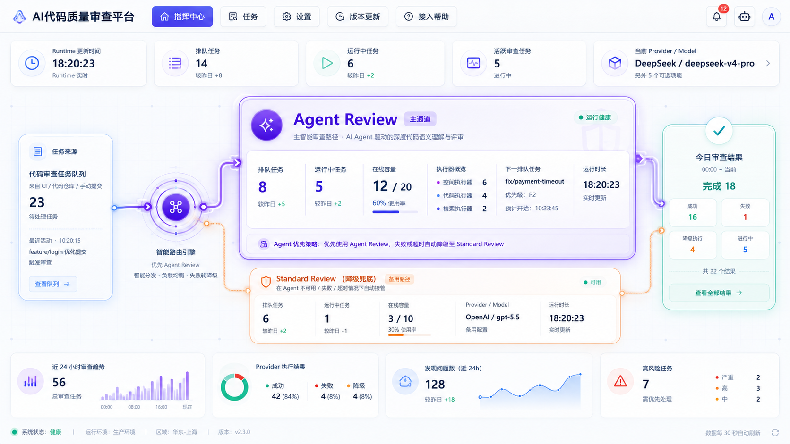
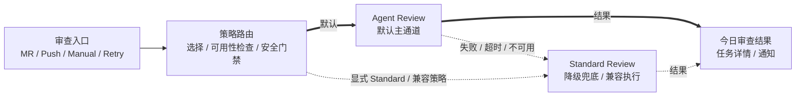
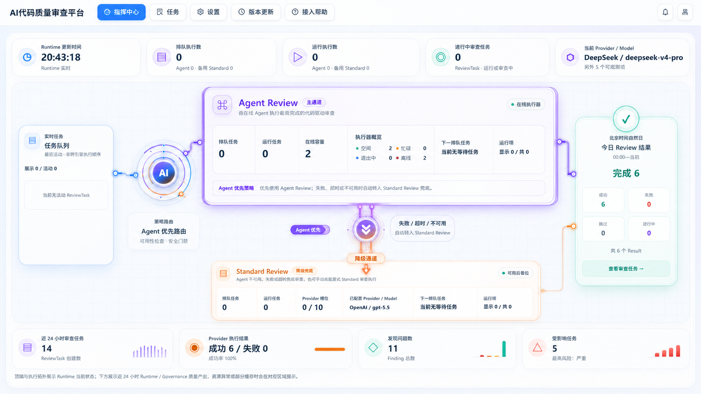

# AI Review Command Center Agent-First Homepage Plan

## 0. 当前执行状态

- 计划版本：`Agent-First Homepage v1.1`
- 编写日期：`2026-08-05`
- 当前阶段：`A8.1 fallback 双箭头动效补充`
- 当前状态：`A8.1 COMPLETED — WAITING FOR RELEASE / VERSION CONTROL AUTHORIZATION`
- 当前授权范围：A8.1 双箭头动效、测试、构建与浏览器验收已完成；当前只允许审阅验收结果。
- 当前非授权范围：不改变 fallback 证据、预览时间轴、线路活动判定、业务指标、后端、Runtime / Governance Schema 或运行状态机；不部署、不推送、不创建 PR、不提交代码。
- 停止点：A8.1 已完成并停止，等待用户决定后续发布或版本控制操作。
- 下一阶段授权口令：A8.1 完成后，由用户明确授权具体的提交、发布、部署或推送动作。

本文档是首页从“双 Review 一级模块”调整为“Agent Review 主通道、Standard Review 降级辅助通道”的独立专项。它只接管首页的信息层级、布局权重、视觉语义、动效优先级和相关展示文案，不覆盖既有专题中的真实运行语义、数据来源、错误保持、轮询、链接安全和历史验收结果。

以下文档继续作为事实与历史实施依据：

- `AI Review Command Center Homepage vNext Implementation Plan.md`：首页 vNext 历史实施记录；
- `AI Review Command Center Information Architecture Optimization Plan.md`：Runtime / Governance 统计口径与资源状态契约；
- `51-AI Review Command Center Live Topology and Motion Plan.md`：真实端口测量、线路活动证据、降级点亮条件和动效验收记录；
- `AI Review Command Center Current Flow Audit.md`：Agent、Standard 和 fallback 的真实调用链事实。

发生冲突时采用以下优先级：

1. 当前代码、数据库字段、Runtime v2 / Governance v1 Schema；
2. `AI Review Command Center Current Flow Audit.md`；
3. 本文档冻结的 Agent-First 首页产品与展示契约；
4. 既有专题中未被本文档替换的运行、交互和验收契约；
5. 视觉参考图。

---

## 1. 背景与决策

### 1.1 当前问题

当前首页已经使用紫色表示 Agent Review、橙色表示 Standard Review，也展示 Agent 到 Standard 的结构性 fallback，但两张 Review 卡片在以下方面仍接近同级：

- 卡片宽高、边框强度和内部指标密度接近；
- Engine Selection 到两条执行轨的线路权重接近；
- 两张卡都使用“当前快照”式头部和完整六格数据面板；
- 独立的 Agent → Standard 说明带占据两卡之间的中心位置；
- Standard 长期保持完整高亮容器，视觉上仍像第二主通道。

因此页面表达的是“双执行引擎并列”，无法在首屏建立“平台以 Agent Review 为主、Standard Review 为辅”的产品认知。

### 1.2 冻结决策

首页从本专项起采用以下定位：

- `Agent Review` 是默认主通道和首页唯一一级 Review 运行面板；
- `Standard Review` 是降级兜底、兼容执行和必要时接管的辅助通道；
- Standard 的独立执行能力仍然是真实存在的系统能力，不因视觉降级而从运行事实中删除；
- 首页允许表达显式选择 Standard 的兼容路径，但不得与默认 Agent 路径使用相同视觉权重；
- Agent 失败、超时或不可用后进入 Standard 的线路，只有存在真实 fallback 证据时才进入活动态。

### 1.3 视觉参考

Agent-First 首页参考图：



仓库文件：`docs/AI Review Center Design/assets/03.png`

参考图用于冻结以下方向：

- Agent 主卡显著大于 Standard 辅助卡；
- Agent 使用“主通道”身份标签和更强的紫色视觉焦点；
- Standard 使用“降级兜底 / 备用路径”身份标签和弱化橙色容器；
- 主路径使用高权重紫色线路，Standard 与 fallback 使用低权重辅助线路；
- Agent 策略说明收进主卡内部，不再占用两卡之间的独立主视觉区域。

参考图不作为业务数据或接口字段来源。图中的趋势、容量分母、状态名称、结果分类和演示数字，只有被真实 Schema 支持后才允许实现。

---

## 2. 目标、非目标与验收问题

### 2.1 目标

1. 用户进入首页后，3 秒内能识别 Agent Review 是默认主通道。
2. 用户能理解 Standard Review 仍可用，但主要承担降级、兜底和兼容执行。
3. 用户能在 10 秒内判断 Agent 是否排队、运行、具备在线容量以及执行器状态。
4. Agent 正常运行时，Standard 不抢占注意力；Standard 接管时，其活动状态又必须可被发现。
5. 不使用不存在的容量、趋势、健康度或 fallback 聚合字段制造视觉数据。
6. 保留当前 Runtime / Governance 的错误、空态、retained snapshot 和轮询边界。

### 2.2 非目标

- 不改变 Engine Selection、Agent Worker、Provider Scheduler 或 fallback 状态机；
- 不取消手动或策略选择 Standard 的真实业务能力；
- 不新增统一队列、负载均衡中枢或 Provider 健康探测语义；
- 不在本专项中新增后台统计、数据库字段或时间序列；
- 不照搬参考图的演示数字、趋势箭头、逐小时图表或虚构总容量；
- 不重写旧专题的 H0～H5、I0～I3 或 M0～M4 历史实施记录；
- 不扩展悬浮流程、详情 Drawer、任务详情页或设置页。

### 2.3 核心验收问题

桌面首屏必须能够用肯定答案回答：

- 最大、最亮、信息最完整的 Review 模块是否是 Agent Review？
- Standard 是否明确标记为“降级兜底 / 备用路径”，而不是第二主通道？
- 没有发生 Standard 或 fallback 活动时，辅助线路是否保持低权重？
- 所有状态、数量和图表是否能追溯到当前真实数据字段？
- 零值时是否仍能保持主次层级，而不是退化为两排同规格的 `0`？

---

## 3. 冻结的信息架构

### 3.1 主拓扑



图中的粗实线表达首页默认认知，不代表新增运行时状态机；虚线表达真实存在但视觉降级的辅助关系。

### 3.2 首屏扫描顺序

首页固定为以下扫描顺序：

1. 顶部 Runtime HUD：平台当前是否在工作；
2. Agent Review 主卡：主通道是否排队、运行和具备在线执行能力；
3. 今日审查结果：当前自然日结果概况；
4. Standard Review 辅助卡：是否可接管、是否正在执行；
5. 左侧任务入口与策略路由；
6. 底部近 24 小时质量产出。

DOM 与键盘顺序仍需保持逻辑顺序和可访问性，不得为了视觉位置打乱读屏语义。

### 3.3 模块层级

| 层级 | 模块 | 角色 |
| --- | --- | --- |
| 一级 | Agent Review | 默认主通道、核心运行面板 |
| 一级 | 顶部 Runtime HUD、今日审查结果 | 平台当前态和结果态 |
| 二级 | Standard Review | 降级兜底、兼容执行、必要时接管 |
| 二级 | 审查入口、策略路由 | 来源与分发说明 |
| 三级 | 底部近 24 小时质量产出 | 趋势之外的窗口统计摘要 |

---

## 4. 桌面布局与视觉权重

### 4.1 宽屏布局

目标视口为 `1440～2044px` 宽、约 `900px` 及以上高的桌面环境。

- 左侧任务入口与路由引擎合计不应继续占用接近四成画布宽度；应压缩辅助区，让 Agent 主卡更靠左并获得更大宽度。
- Agent 主卡占中部业务区域的主要面积；Standard 位于其下方并内缩。
- Agent 与 Standard 的视觉面积比不得低于 `2:1`，推荐接近参考图的 `2.2:1`。
- Agent 主卡推荐占拓扑画布宽度的 `48%～56%`；Standard 推荐为 Agent 宽度的 `82%～90%`。
- Standard 高度推荐为 Agent 高度的 `42%～50%`，不得再次形成等高双卡。
- 今日审查结果保持独立竖向结果面板，不因 Agent 放大而被压缩为窄信息条。

以上为比例约束，不要求照抄参考图像素值；不同视口下应优先保持主次关系、可读性和无溢出。

### 4.2 Agent 主卡

Agent 主卡采用三段结构：

1. 强身份头部：主图标、`Agent Review`、`主通道` 标签、真实快照状态；
2. 核心运行面板：队列、运行、在线容量、执行器、下一任务和运行项摘要；
3. 策略说明条：Agent 优先与 Standard 兜底关系。

视觉要求：

- 标题视觉尺寸至少为 Standard 标题的 `1.5` 倍；
- 使用更强紫色描边、局部背景光和主路径连接；
- 允许双层边框或局部高光，但不得遮挡文字和焦点轮廓；
- 指标分为主数字、辅助说明和状态细节，不再全部压缩在同一矮行；
- 零值时保留完整主卡结构，使用简洁空态说明，不用六个等权重的 `0` 填满卡片。

### 4.3 Standard 辅助卡

Standard 使用紧凑单行或双行布局，只保留辅助通道必要状态：

- 排队任务；
- 运行中任务；
- Provider 槽位；
- 已观测 Provider / Model；
- 下一任务或运行项摘要，按可用空间二选一。

视觉要求：

- 标题旁固定显示 `降级兜底`，可增加 `备用路径` 辅助标签；
- 描述固定表达“Agent 不可用、失败或超时时接管”，并允许补充显式 Standard 兼容能力；
- 使用单层细橙色边框和低强度阴影；
- 常态不使用与 Agent 同等级的光晕、背景填充或状态徽章；
- 只有 Standard 真实排队、运行或 fallback 活动时才增强橙色状态提示。

### 4.4 辅助区域

任务入口：

- 保留真实活动 ReviewTask 和既有安全链接规则；
- 信息从“居中空盒”调整为左对齐的任务来源、待处理信息、最近活动与操作；
- 无活动任务时显示简洁真实空态，不伪造待处理总数或最近活动。

策略路由：

- 圆形核心继续承担线路分发锚点，但文案需突出 `Agent 优先`；
- 删除独立大面积三色图例盒；
- 不使用“统一负载均衡”文案，除非后端真实存在对应能力；
- 线路颜色、虚实和卡片身份标签共同解释路径关系。

### 4.5 页面表面与背景

- 降低当前蓝色网格、电路纹理和角落技术刻线的对比度；
- 外层大圆角仪表盘边框不得与 Agent 主卡争夺轮廓层级；
- Agent 区域保留紫色聚焦光，Standard 区域不使用大面积橙色晕染；
- 顶部与底部卡片继续使用浅色表面，但减少连续长条容器造成的“表格化”观感；
- 所有文本、边框和状态色满足现有亮色主题与 forced-colors 回退要求。

---

## 5. 数据与文案契约

### 5.1 顶部 Runtime HUD

继续使用现有五项真实数据：

- Runtime 更新时间；
- 排队执行数；
- 运行执行数；
- 进行中审查任务；
- 当前 Provider / Model。

调整规则：

- 主数字继续展示平台总量；
- 辅助拆分不得继续表达 `Agent · Standard` 完全对等，可改为 `Agent N · 备用 Standard M`；
- 不新增“较昨日”或趋势箭头，除非后端提供同口径历史数据；
- 当前 Provider / Model 只表达已观测或默认配置，不得称为 Provider 实时健康。

### 5.2 Agent Review 数据

第一阶段只使用当前已存在字段：

- `reviewLanes.agent.queuedCount`；
- `reviewLanes.agent.runningCount`；
- `agent.queueMetrics.onlineCapacity`；
- `agent.workerPool` 状态分布；
- `reviewLanes.agent.nextQueued`；
- `runningItems.length / runningCount`。

约束：

- 当前只有 `onlineCapacity` 时，显示“在线容量 N”，不得照参考图拼成 `N / 总容量`；
- 没有真实总容量时不展示使用率进度条；
- `主通道` 是产品身份标签，可以静态展示；
- “运行健康”只有在存在可靠健康契约时才能使用。当前优先使用“有在线执行器”“暂无在线执行器”“快照过期”“数据不可用”等可证明文案。

### 5.3 Standard Review 数据

第一阶段继续使用：

- `reviewLanes.standard.queuedCount`；
- `reviewLanes.standard.runningCount`；
- `reviewLanes.standard.capacity`；
- `providersObserved`；
- `reviewLanes.standard.nextQueued`；
- `runningItems.length / runningCount`。

Standard 可以显示 `runningCount / capacity` 槽位占用，但不得把 Provider 已配置或存在容量误标为 Provider 实时健康。

### 5.4 今日审查结果

继续遵守北京时间自然日 `00:00—当前` 和 Result 实体统计口径。

- 标题允许从“今日 Review 结果”统一为“今日审查结果”；
- 保留完成、成功、失败、跳过、进行中等当前真实分类；
- `SKIPPED` 不得直接改名为“降级执行”；
- 只有新增可证明的 fallback 结果聚合字段后，才允许单独展示“降级执行 N”；
- CTA 的名称必须与真实落点一致；当前仍进入任务列表时，不得仅为贴近参考图改成不存在的“全部结果”页。

### 5.5 底部近 24 小时质量产出

继续保留当前四项真实指标及顺序：

1. 近 24 小时审查任务；
2. Provider 执行结果；
3. 发现问题数；
4. 受影响任务与最高风险。

参考图中的逐小时柱状趋势、折线趋势和“高风险任务数”不在第一阶段照搬：

- 没有真实时间桶时不绘制趋势图、时间轴或环比箭头；
- ReviewTask 单值卡只允许使用无业务含义的静态信号纹理；
- Provider 图只使用真实成功 / 失败比例；
- Finding 图只使用真实严重级别分布；
- “受影响任务”不得直接改名为“高风险任务”，除非统计口径同步调整并有真实字段支持；
- 不新增“降级比例”，除非存在同一窗口内的可靠 fallback 统计。

### 5.6 零值、缺失和错误

- 真实零值显示 `0`，不使用破折号伪装为缺失；
- 接口失败且无 retained snapshot 时显示 `—` 和对应错误说明，不伪造 `0`；
- retained snapshot 保留最后成功数据并标记过期；
- Agent、Standard 的主次层级不得依赖非零示例数据，idle 场景也必须成立；
- Runtime 与 Governance 保持独立失败、独立重试和既有轮询周期。

---

## 6. 线路与动效契约

### 6.1 线路优先级

| 线路 | 常态 | 活动态 |
| --- | --- | --- |
| 任务入口 → 路由引擎 | 中等蓝色实线 | 有入口活动时显示轻量流动 |
| 路由引擎 → Agent | 高权重紫色实线 | Agent queued / running 时使用主要流光 |
| Agent → 今日结果 | 高权重紫色实线 | Agent running 或结果活动时增强 |
| 路由引擎 → Standard | 低权重橙色虚线或细线 | Standard 独立 queued / running 时增强 |
| Agent → Standard | 低权重 fallback 虚线 | 仅真实 fallback 证据存在时点亮 |
| Standard → 今日结果 | 低权重橙色细线 | Standard running 时增强 |

### 6.2 fallback 证据

沿用 `51-AI Review Command Center Live Topology and Motion Plan.md` 的事实约束：只有 `Standard runningItems[].fallback=true` 等当前已冻结真实证据才能点亮 Agent → Standard 活动态。普通 Standard 运行、双轨运行或静态结构说明不得误点亮 fallback。

### 6.3 动效边界

- Agent 主路径可以承担页面主要连续动效；
- Standard 常态只保留静态低对比线路；
- `prefers-reduced-motion`、STALE、ERROR_RETAINED 等状态继续关闭非必要连续动画；
- 动画层保持 `aria-hidden`、无 pointer event，不影响 DOM 语义和键盘操作；
- 删除两卡之间独立的宽幅结构说明带后，不得用更强的新装饰重新占据中心视觉。

---

## 7. 响应式与可访问性

### 7.1 响应式规则

| 视口 | 布局要求 |
| --- | --- |
| `>= 1440px` | 完整 Agent-First 拓扑；Agent / Standard 面积比不低于 `2:1` |
| `1200～1439px` | 压缩辅助区和卡片间距，优先保留 Agent 全部核心指标 |
| `701～1199px` | 允许拓扑简化或纵向重排；Agent 必须先于 Standard，Standard 保持紧凑辅助卡 |
| `<= 700px` | 使用静态 DOM 摘要；Agent 完整摘要在前，Standard 降级摘要在后，不挂载复杂地图 |

高度不足时优先减少背景装饰、辅助说明和 Standard 详情，不得先压缩 Agent 主卡到与 Standard 等高。

### 7.2 可访问性

- `主通道`、`降级兜底` 不能只靠颜色表达；
- 紫色和橙色线路必须同时使用实线 / 虚线或粗细差异；
- 状态徽章、CTA、Modal 和任务链接保留明确焦点样式；
- 卡片视觉顺序与 DOM 语义顺序不一致时，需要验证读屏与 Tab 顺序；
- forced-colors 下依靠边框、文字和线型保持主次关系；
- 装饰图标、微图和流光保持 `aria-hidden`。

---

## 8. 实施阶段与停止点

### A0：方案冻结（本次）

- 目标：冻结 Agent-First 产品定位、信息层级、真实数据边界和实施阶段。
- 范围：新增本文档；旧首页专题仅增加定向说明。
- 非目标：不修改代码、Schema、测试、构建、部署或历史结论。
- 验收：新文档可独立指导后续实现；旧文档能明确导向本文档；本次不触碰范围外文件。
- 授权边界：当前用户请求已经授权。
- 停止点：文档修改完成后立即停止，等待用户确认。

### A1：语义结构与展示契约

- 目标：先把 Agent 主通道和 Standard 辅助通道写入 DOM、Presentation 与契约测试。
- 范围：Agent / Standard 头部身份、指标分组、策略说明位置、HUD 辅助文案和真实空态。
- 非目标：不做最终视觉精修，不改后端或 Schema，不新增趋势与 fallback 聚合。
- 验收：专项测试证明 Agent 为一级主模块、Standard 为降级辅助模块；所有字段来自现有投影。
- 授权边界：必须由用户明确确认进入 A1。
- 停止点：专项测试通过后停止，等待 A2 确认。

### A2：桌面布局与视觉层级

- 目标：完成参考图方向的桌面 Agent-First 布局和视觉权重。
- 范围：卡片尺寸、位置、边框、背景、字体、辅助区压缩和线路静态权重。
- 非目标：不改运行语义，不新增后台能力，不完成活动动效收口。
- 验收：`1920×900`、`1600×900`、`1440×900` 下 Agent / Standard 视觉面积比不低于 `2:1`，页面无横向溢出。
- 授权边界：A1 验收后由用户独立确认。
- 停止点：前端测试、构建和三档桌面截图验收后停止。

### A3：线路动效、响应式与异常态

- 目标：让主路径、Standard 活动和真实 fallback 在不同状态下使用正确动效权重。
- 范围：端口线路、活动证据、reduced-motion、STALE / retained / error、平板和移动端。
- 非目标：不新增状态机、Provider 健康检查或 fallback 统计接口。
- 验收：idle、Agent queued/running、Standard queued/running、dual running、fallback、STALE、ERROR_RETAINED 场景均不误表达；`1024px` 和 `390px` 可用。
- 授权边界：A2 验收后由用户独立确认。
- 停止点：fixture、专项测试、构建和浏览器验收完成后停止。

### A4：真实环境收口与文档回填

- 目标：在真实 Runtime / Governance 数据下完成最终首屏验收并回填本文档。
- 范围：真实接口、轮询、空态、零值、Provider 观测、浏览器 console 和视觉收口。
- 非目标：不部署、不推送、不创建 PR，除非用户另行授权。
- 验收：主链路与辅助链路语义正确，页面无伪数据、无 console warning / error，相关测试与前端 build 通过。
- 授权边界：A3 验收后由用户独立确认。
- 停止点：回填验证结果后停止，等待部署或发布授权。

---

## 9. 预计影响范围

进入实施阶段后，预计只涉及以下前端与专题文档范围，实际文件以 A1 检索结果为准：

- `frontend/src/command-center/CommandCenterPage.jsx`；
- `frontend/src/command-center/CommandCenterCanvas.jsx`；
- `frontend/src/command-center/commandCenter.css`；
- Command Center Presentation / motion scene 相关模块；
- `frontend/tests/commandCenterInformationArchitecture.test.mjs`；
- Command Center Presentation、motion、fixture 相关测试；
- 本专题文档。

第一阶段默认不修改：

- `backend-python/`；
- 数据库迁移；
- Runtime v2 / Governance v1 Schema；
- Review、Agent、Provider Scheduler 和 fallback 业务状态机；
- `README.md`；
- `docs/36-review-platform-current-roadmap.md`。

如果实现过程中确认必须新增“Agent 总容量”“今日 fallback 结果数”或真实时间桶，必须停止当前阶段，先补充数据结构与接口设计，再获得用户独立授权。

---

## 10. A0 验收记录

当前待完成：

- [x] 新增 Agent-First 首页独立专题文档；
- [x] 明确信息层级、视觉比例、数据真实性与响应式边界；
- [x] 写清 A0～A4 的目标、范围、非目标、验收、授权边界和停止点；
- [x] 在旧首页专题增加最小定向说明；
- [x] 检查文档链接与本次变更范围。

A0 文档验收：

- 新专题文件和 `assets/03.png` 参考图路径存在；
- 旧专题只在当前状态段后增加一处定向说明，既有 H0～H5 正文未改写；
- `git diff --check` 通过；
- 工作区内原有其他修改和未跟踪文件均未触碰。

A0 完成后状态应保持：

```text
A0 DOCUMENTED — WAITING FOR USER CONFIRMATION
```

---

## 11. A1 实施与验收记录

当前状态：

```text
A1 COMPLETED — WAITING FOR A2 CONFIRMATION
```

### 11.1 已实施范围

Presentation 契约：

- Engine Selection 增加 `AGENT_FIRST` 模式和 `primaryRouteKey=AGENT`；
- 三条路线增加 `primary / supporting / fallback` 显著性契约；
- Agent Lane 增加 `role=primary`、`主通道` 身份标签；
- Standard Lane 增加 `role=supporting`、`降级兜底` 和 `备用路径` 身份标签；
- Standard 描述明确为 Agent 不可用、失败或超时时接管，同时保留显式 Standard 兼容执行事实；
- fallback 增加 `Agent 优先策略` 标题、接管说明和真实证据提示；
- Lane 增加 Runtime 可用性投影，供 DOM 区分真实零值和不可用状态。

DOM 与展示契约：

- Agent / Standard 卡片输出 `data-review-role`，不再只依赖紫色和橙色区分角色；
- Agent 头部展示“主通道”，Standard 展示“降级兜底 / 备用路径”；
- 原位于两卡之间的独立 fallback 说明节点已移入 Agent 卡片，成为主卡内部策略条；
- 移动端路由摘要改为 Agent 主通道优先、异常时 Standard 接管；
- HUD 拆分文案改为 `Agent N · 备用 Standard M`，不再把两条 Lane 作为等权表达；
- Agent idle 状态基于真实在线容量显示“有在线执行器 / 暂无在线执行器”；
- Standard idle 状态基于真实槽位显示“有可用槽位 / 槽位已满 / 暂无可用槽位”；
- Runtime 不可用时显示“数据不可用”，在线容量真实为零时继续显示 `0`，没有回退成缺失符号；
- 只做了容纳内嵌策略条所需的结构性网格调整，最终面积比、卡片高度、边框强弱和背景精修保留给 A2。

### 11.2 实际修改文件

- `frontend/src/command-center/commandCenterPresentation.js`；
- `frontend/src/command-center/CommandCenterCanvas.jsx`；
- `frontend/src/command-center/CommandCenterPage.jsx`；
- `frontend/src/command-center/commandCenter.css`；
- `frontend/tests/commandCenterPresentation.test.mjs`；
- `frontend/tests/commandCenterInformationArchitecture.test.mjs`；
- 本专题文档。

未修改 `backend-python/`、Runtime / Governance Schema、数据库、轮询、Review 状态机或部署配置。

### 11.3 验证结果

Command Center 全量专项测试：

```text
node --test tests/commandCenter*.test.mjs
62 passed / 0 failed
```

前端生产构建：

```text
scripts\run-frontend.cmd build
passed；3544 modules transformed
```

构建只保留既有的大 chunk 体积提示，没有新增编译错误。`git diff --check` 通过。

### 11.4 停止点

A1 已完成并停止。未自动进入 A2，未启动最终桌面视觉比例、卡片尺寸、背景、边框或线路权重精修；这些操作必须等待用户独立确认。

---

## 12. A2 实施与验收记录

当前状态：

```text
A2 COMPLETED — WAITING FOR A3 CONFIRMATION
```

### 12.1 已实施范围

桌面布局层级：

- 将左侧任务入口固定在 `230～240px`、策略路由压缩到 `175～185px`，把桌面弹性空间优先分配给 Agent 主卡；
- `1920×900` 下 Agent 主卡宽度达到 `985px`，占视口宽度 `51.3%`，起点约位于页面 `31%` 处；
- Agent 主卡高度固定在当前 900px 桌面首屏的 `284px`，Standard 辅助卡压缩到 `135px`；
- Standard 宽度收缩为 Agent 的 `90%` 并居中，三档桌面视觉面积比统一达到 `2.34:1`；
- Agent 和 Standard 之间使用独立窄间距，不再用空白中间行承载第二块结构说明；
- 右侧今日结果保留独立竖向面板，没有被 Agent 放大挤压成信息条。

主卡与辅助卡视觉：

- Agent 使用 `2px` 紫色主边框、更强局部光晕、`24px` 标题、`48px` 主图标和更高的指标面板；
- Standard 使用单层浅橙边框、弱阴影、`16px` 标题、紧凑图标和低对比内层轮廓；
- Standard 六个指标标签收紧为单行显示，在 `1440px` 下无断字、裁切或多行挤压；
- Agent 策略条改为弱紫渐变表面，继续位于主卡内部；
- Agent 常态线路提高静态可见度，Standard 与 fallback 常态线路降低不透明度和线宽；
- 线路活动条件、fallback 证据和动效状态机均未修改。

辅助区域与页面表面：

- 任务入口头部改为左对齐，减少空盒居中带来的展示页观感；
- 策略路由圆环和说明面板缩小，移除重复的三色文字图例；Presentation 中的三条路线事实契约继续保留；
- 降低画布网格、电路点阵、角落刻线、Standard 橙色晕染和外层 Shell 阴影强度；
- 底部四项质量产出由连续长条改为四张独立浅色卡片；
- 未伪造趋势、Provider 健康度、Agent 总容量或 fallback 统计。

### 12.2 实际修改文件

- `frontend/src/command-center/CommandCenterCanvas.jsx`；
- `frontend/src/command-center/commandCenter.css`；
- `frontend/tests/commandCenterInformationArchitecture.test.mjs`；
- 本专题文档。

未修改后端、Runtime / Governance Schema、数据库、轮询、Review 状态机、活动证据或部署配置。

### 12.3 自动验证

Command Center 全量专项测试：

```text
node --test tests/commandCenter*.test.mjs
63 passed / 0 failed
```

前端生产构建：

```text
scripts\run-frontend.cmd build
passed；3544 modules transformed
```

构建只保留既有的大 chunk 体积提示，没有新增编译错误。

### 12.4 浏览器验收

复用本地 `5173` 前端和 `8090` Python 后端，在真实 Runtime / Governance 数据下验收：

| 视口 | Agent | Standard | 视觉面积比 | 横向溢出 | 纵向溢出 |
| --- | --- | --- | --- | --- | --- |
| `1920×900` | `985×284` | `886×135` | `2.34:1` | 无 | 无 |
| `1600×900` | `714×284` | `642×135` | `2.34:1` | 无 | 无 |
| `1440×900` | `630×284` | `567×135` | `2.34:1` | 无 | 无 |

补充结果：

- `1440×900` 下 Standard 六个指标标签均保持单行，`scrollWidth <= clientWidth`；
- 三档均完整展示 Agent 主卡、Standard 辅助卡、任务入口、路由引擎、今日结果和底部四项质量产出；
- 浏览器控制台 `0 warning / 0 error`；
- 真实零值、在线容量、Provider / Model、今日结果和近 24 小时质量数据均保持真实展示。

### 12.5 停止点

A2 已完成并停止。未自动进入 A3，未调整活动动效节奏、平板 / 移动端最终层级、STALE / retained / error 视觉权重或 fixture 场景；这些操作必须等待用户独立确认。

---

## 13. A3 实施与验收记录

当前状态：

```text
A3 COMPLETED — WAITING FOR A4 CONFIRMATION
```

### 13.1 已实施范围

线路活动语义与视觉权重：

- Agent queued / running 继续由真实 Agent Lane 证据驱动，桌面活动流光宽度为 `5.8px`，running 周期为 `1.1s`，主卡霓虹不透明度为 `1`；
- 显式 Standard queued / running 只由 Standard Lane 自身活动驱动，桌面活动流光降为 `3.2px`，running 周期放慢到 `1.8s`，脉冲不透明度为 `0.68`，主卡霓虹不透明度为 `0.42`；
- fallback 仍只接受 `runningItems[].fallback=true` 或 `nextQueued.fallback=true` 的真实证据；
- fallback 活动时改为点亮 `Engine → Agent → Standard fallback → Result` 路径，显式 `Engine → Standard` 入口保持静止，不再把兜底执行误画成显式 Standard 路由；
- fallback 桥使用青色 `4.6px` 流光与 `2.4px` 脉冲，Standard 卡片同步切换为低强度青色接管态；
- 普通 Standard running、dual running 与静态结构说明均不会点亮 fallback。

异常态与非实时状态：

- Runtime `STALE`、`ERROR_RETAINED`、`ERROR_EMPTY` 和首轮加载失败继续统一暂停连续动效；
- STALE 卡片状态明确显示“快照已过期”，ERROR_RETAINED 显示“保留旧状态”，不再回退成实时容量或槽位文案；
- ERROR_RETAINED 继续保留 `data-running / data-queued` 业务事实，但 `data-activity` 和所有线路进入 idle，避免旧快照继续播放实时动效；
- 移动端路由摘要增加当前真实状态，能够区分 Agent 活动、显式 Standard 活动、真实 fallback、STALE、retained 和 Runtime 不可用；
- `prefers-reduced-motion: reduce` 继续关闭页面 transition / animation，并隐藏 flow、pulse 和 review neon。

响应式层级：

- `1024px` 使用任务入口、策略路由和 Agent / Standard 三列布局；Agent 为 `568×300`，Standard 为 `512×160`，视觉面积比约 `2.08:1`；
- `1024px` 下线路 SVG 与端口按小屏契约静止隐藏，主卡、辅助卡、任务入口、路由引擎、今日结果和质量产出仍完整可用；
- `390px` 下隐藏桌面任务入口、路由引擎和今日结果面板，改用 Agent-first 路由摘要；
- `390px` 下 Agent 主卡保持完整六项指标与策略条；Standard 空闲时只显示排队、运行和 Provider 槽位三项摘要，活动时展开六项真实证据；
- `390px` 下 Standard 空闲时保持单行三指标摘要，fallback 活动态才展开六项证据；两种状态均显著低于 Agent 完整主卡，不再与主卡平级。

### 13.2 实际修改文件

- `frontend/src/command-center/CommandCenterCanvas.jsx`；
- `frontend/src/command-center/commandCenterVisual.js`；
- `frontend/src/command-center/commandCenter.css`；
- `frontend/tests/commandCenterVisual.test.mjs`；
- `frontend/tests/commandCenterM4Fixtures.test.mjs`；
- `frontend/tests/commandCenterInformationArchitecture.test.mjs`；
- 本专题文档。

未修改 `backend-python/`、Runtime / Governance Schema、数据库、轮询周期、Review 状态机、Provider 健康检查、fallback 统计接口或部署配置。

### 13.3 自动验证

Command Center 全量专项测试：

```text
node --test tests/commandCenter*.test.mjs
64 passed / 0 failed
```

前端生产构建：

```text
scripts\run-frontend.cmd build
passed；3544 modules transformed
```

构建只保留既有的大 chunk 体积提示，没有新增编译错误。`git diff --check` 通过，仅有仓库既有 LF / CRLF 提示。

### 13.4 fixture 与浏览器验收

使用隔离环境 `5184 → 8094` 依次验收：

- idle；
- Agent queued / running；
- Standard queued / running；
- dual running；
- fallback running；
- STALE；
- Runtime ERROR_EMPTY；
- 先载入 dual running、再等待真实 5 秒轮询形成的 Runtime ERROR_RETAINED；
- Governance ERROR_EMPTY。

验收结果：

- `1440×900` 下拓扑测量为 ready，Agent、Standard 和 fallback 线路的活动状态、流光宽度、速度和霓虹强度与 A3 契约一致；
- fallback running 时 `engine-agent / agent-standard / standard-result` 活动，`engine-standard` 保持 idle；
- ERROR_RETAINED 保留 Agent / Standard `running=true` 事实，但根 motion 为 paused，全部线路 `active=false / animation=none`；
- `1024×900` 文档宽度与视口可用宽度一致，Runtime Map 无内容裁切，无横向溢出；
- `390×844` 文档宽度与视口可用宽度一致，无横向溢出；fallback 时路由摘要显示“Agent 异常 · Standard 正在兜底”，Standard 展开六项真实指标；
- 浏览器日志仅有 Vite debug 和 React DevTools info，`0 warning / 0 error`；
- 隔离前端与 mock 在验收后按实际端口 PID 精确停止，用户已有 `5173 / 8090` 继续返回 HTTP 200。

### 13.5 停止点

A3 已完成并停止。未自动进入 A4，未在真实 Runtime 活动期间执行最终桌面 / 移动端收口，也未新增部署、发布或提交操作；这些操作必须等待用户独立确认。

---

## 14. A4 最终验收与收口记录

当前状态：

```text
A4 COMPLETED — WAITING FOR DEPLOYMENT / RELEASE AUTHORIZATION
```

### 14.1 真实环境与数据口径

复用用户已有 `5173 → 8090` 服务，没有启动、接管或停止真实前后端进程：

- 前端 `http://127.0.0.1:5173/` 返回 HTTP 200；
- Python 后端 `/api/health` 返回 HTTP 200；
- Runtime 返回 `command-center-runtime-v2`；
- Governance 返回 `command-center-governance-v1`；
- 浏览器中的 Runtime / Governance 资源状态均为 FRESH，根 motion 为 idle。

本轮真实快照对账：

- Scheduler queued / running 均为 `0`，页面 HUD 和 Agent / Standard 两条 Lane 均显示真实零值；
- Agent Lane 容量为 `2`，Worker Pool 为在线 `2`、空闲 `2`、忙碌 `0`、退出中 `0`、离线 `2`，页面逐项一致；
- Standard Lane 容量为 `10`，当前 `0 / 10`，页面显示“有可用槽位”；
- 当前优先 Provider / Model 为 `DeepSeek / deepseek-v4-pro`，另有 `5` 个可观测项；
- 今日自然日结果为完成 `6`、成功 `6`、失败 `0`、跳过 `0`、进行中 `0`；
- 近 24 小时 ReviewTask 为 `14`，Provider 成功 / 失败为 `6 / 0`，Finding 为 `11`，受影响任务为 `5`，最高风险为严重；
- 页面未生成 Agent 总容量、fallback 次数、Provider 健康度、趋势时间桶或其他接口未提供的指标。

### 14.2 真实浏览器验收

桌面 `1440×900`：

- 拓扑测量为 ready，真实空闲态下线路没有错误活动；
- Agent 为 `630×284`，Standard 为 `567×135`，视觉面积比 `2.34:1`；
- Agent 主卡、Standard 辅助卡、任务入口、Agent 优先路由、今日结果和四项质量产出完整可见；
- 页面无横向溢出，主通道与备用路径语义清晰。

平板 `1024×900`：

- Agent 为 `568×300`，Standard 为 `512×160`；
- Runtime Map `scrollHeight <= clientHeight`，无内容裁切、无横向溢出；
- 真实轮询计数在一次 5 秒周期内由 started / completed `9 / 8` 更新为 `10 / 9`，Runtime 显示时间由 `20:45:14` 更新为 `20:45:19`。

移动端 `390×844`：

- Agent 为 `335×379`，Standard 空闲摘要为 `335×109`；
- Standard 只显示排队、运行和 Provider 槽位三项真实摘要；
- 移动端路由摘要显示 Agent 主通道和 Standard 异常接管关系，当前状态为“当前空闲”；
- 桌面任务入口、路由引擎和今日结果面板按移动端契约隐藏，四项质量产出继续展示；
- 页面无横向溢出。

运行诊断：

- Runtime 与 Governance 分别保持独立轮询；
- 页面诊断为 `2` 个 active timer、`2` 个 polling listener，没有新增业务 RAF、timer 或 listener；
- 浏览器日志仅包含 Vite debug 和 React DevTools info，`0 warning / 0 error`。

### 14.3 自动验证

Command Center 全量专项测试：

```text
node --test tests/commandCenter*.test.mjs
64 passed / 0 failed
```

前端生产构建：

```text
scripts\run-frontend.cmd build
passed；3544 modules transformed
```

构建只保留既有的大 chunk 体积提示，没有新增编译错误。`git diff --check` 通过，仅有仓库既有 LF / CRLF 提示。

### 14.4 A4 实际修改范围

A4 没有继续修改前端或后端实现，只回填本专题文档。A0～A3 已完成的 Agent-first 页面、展示契约、动效、fixture 和测试保持不变。

本专项未修改 `backend-python/`、Runtime / Governance Schema、数据库、运行状态机、部署配置或 README；未创建提交、未推送、未部署、未创建 PR。

### 14.5 最终停止点

A0～A4 已全部完成。首页已经从“双 Review 平级”收口为“Agent Review 主通道、Standard Review 降级辅助 / 兜底通道”，并在固定 fixture 与真实 Runtime / Governance 数据下通过验收。

本专项在此停止。后续提交、推送、部署、发布或 PR 必须由用户另行明确授权。

---

## 15. v1.1 增量需求与参考图

本次增量输入：

1. 只调整 Agent Review 与 Standard Review 两张卡片及其中间连接关系，参考 `assets/04.png`；
2. 用户可见的“指挥中心”改名为“运行总览”，同步调整版本更新页的对应描述；
3. Runtime Map / Review 卡片所在框右上角增加“预览动画”按钮，点击后演示数秒 Review 动画；
4. A5～A7 不逐阶段执行浏览器验收，只在 A8 集中完成一次完整浏览器验收。



### 15.1 当前视角与参考图差异

| 观察点 | 当前实现 | `04.png` 目标方向 |
| --- | --- | --- |
| 两卡间距 | 900px 高桌面中间行约 `18px`，卡片边框间实际只形成约 `20px` 窄缝 | Agent 向上、Standard 向下，形成约 `88～110px` 的独立连接走廊 |
| fallback 线路 | 真实端口已连接，但竖线很短，两个端口圆点几乎连在一起 | 上下竖线清晰可见，中部有独立圆形交接节点 |
| 方向图形 | 只有小端口和短线，没有显著方向符号 | 圆形节点内使用双向下箭头 / 双 Chevron，明确表达从 Agent 向 Standard 降级 |
| 降级标识 | Agent 卡片内有策略条，卡片之间缺少可扫描的关系标记 | 连接节点附带轻量“降级通道”标记；不新增第三张业务卡片 |
| 动画预览 | 只能等待真实 queued / running / fallback 状态 | 空闲且数据新鲜时可主动演示主通道与 fallback 的视觉效果 |

### 15.2 可行性结论

结论：**三项调整均可行，且不需要后端、Schema、数据库或 Review 状态机改动。**

依据：

- 桌面网格已经为 Agent、空白中间行和 Standard 定义三行结构，只需扩大第二行并保持总高度内重新居中；
- `agent-down → standard-up` 已由 `commandCenterTopology.js` 实时测量，现有 `agent-standard` 路径可以继续作为真实线路，圆形箭头节点可定位在该路径中点；
- 当前 fallback 活动证据已冻结为真实 `fallback=true`，视觉放大不会改变业务判断；
- 预览可以使用独立的前端展示场景，不修改 Presentation 数值、不调用 API、不写入任务状态，也不替换真实 motion scene；
- “指挥中心”只出现在用户可见导航、页面无障碍标签 / 错误文案和 `v1.3.0` 版本说明中，内部组件名、测试文件名、接口路径与历史文档无需全局重命名。

主要风险与控制：

- 扩大连接走廊可能压缩上下留白；必须保持 Agent / Standard 面积比和底部质量卡不被挤出 900px 桌面首屏；
- 预览动画不能覆盖真实活动；真实 queued / running、STALE、ERROR_RETAINED 或 ERROR_EMPTY 出现时必须立即取消 / 禁用预览；
- 预览必须明确标记为“演示”，所有任务数、容量、Provider 和结果继续展示真实值；
- 版本更新页只调整现有 `v1.3.0` 的用户可见描述与标签，不创建新的版本号，不改历史功能事实。

---

## 16. v1.1 冻结展示契约

### 16.1 Review 卡片与降级连接器

桌面 `>=1200px`：

- 保持 Agent 卡片与 Standard 卡片现有宽高和主辅层级，不把 Standard 重新放大为一级模块；
- 900px 高视口的中间行从 `18px` 调整为 `clamp(88px, 9vh, 110px)`，由 `align-content: center` 让 Agent 上移、Standard 下移；
- Agent 与 Standard 卡片边框之间的可见走廊目标为 `88～110px`；
- 继续使用真实 `agent-down / standard-up` 端口和 `agent-standard` SVG 路径；
- 在测量路径中点叠加 `52～58px` 圆形交接节点，内部使用双向下 Chevron；
- 圆形节点下方使用轻量 `降级通道` 标签；不新增独立说明卡，也不重复放置大段 fallback 文案；
- idle 时竖线、圆形节点和方向箭头保持低强度但可见；只有真实 fallback 或动画预览时才增强流光、光晕和 Chevron 位移；
- 普通 Standard queued / running 和 dual running 不得激活中间降级节点。

响应式：

- `901～1199px` 保留主辅卡片层级，使用紧凑圆形 Chevron 分隔符，不恢复桌面 SVG 流光；
- `<=900px` 继续以移动端 Agent-first 路由摘要为主，只保留小型方向分隔符，避免连接器把 Standard 再次强化成同级卡片；
- `prefers-reduced-motion: reduce` 下圆形节点和线路保持静态，不播放 Chevron 位移或流光。

### 16.2 “预览动画”按钮与场景

位置：

- `>=1200px` 放在 Runtime Map 右上角空白区，不覆盖 Agent、今日结果或线路；
- `901～1199px` 放入 Runtime Map 顶部工具位，并为网格预留高度；
- `<=900px` 合并到移动端 Agent-first 路由摘要右侧。

按钮契约：

- 默认文案为 `预览动画`，运行时为 `预览中` 并禁用重复点击；
- 只有 Runtime 为 FRESH、真实 motion 为 idle 且首轮加载完成时可用；
- 不请求后端、不创建任务、不修改任何指标或 Review 状态；
- 预览区域必须出现 `演示` 标识，并输出 `data-command-center-preview-state` 供测试与诊断；
- 页面卸载、预览完成或真实活动开始时清理定时器并恢复真实场景；
- 不引入 Canvas、业务 RAF 或常驻额外轮询；预览阶段最多保持一个顺序 `setTimeout`。

冻结的 `6s` 演示顺序：

| 时间 | 预览状态 | 视觉重点 |
| --- | --- | --- |
| `0～0.8s` | `AGENT_QUEUED` | 任务入口 → 引擎 → Agent 主通道排队流光 |
| `0.8～3.2s` | `AGENT_RUNNING` | Agent 线路、主卡霓虹和结果方向 |
| `3.2～4.4s` | `FALLBACK_HANDOFF` | Agent → Standard 中间圆形双 Chevron 与“降级通道” |
| `4.4～5.8s` | `STANDARD_FALLBACK` | Standard 兜底卡片与 Standard → Result 路径 |
| `5.8～6.0s` | `RESETTING` | 轻量收束并恢复真实 idle 场景 |

若预览过程中真实 motion 不再是 idle，预览立即结束，真实场景无条件优先。reduced-motion 环境仍可切换静态阶段与状态文案，但连续 animation 必须由既有 CSS 契约关闭。

### 16.3 “运行总览”命名与版本更新页

用户可见文案映射：

| 当前文案 | 目标文案 |
| --- | --- |
| 顶部导航 `指挥中心` | `运行总览` |
| `AI Review 指挥中心` | `AI Review 运行总览` |
| `指挥中心数据暂时无法获取。` | `运行总览数据暂时无法获取。` |
| v1.3.0 标题中的 `指挥中心` | `运行总览` |
| v1.3.0 标签 `指挥中心` | `运行总览` |

版本更新页的 `v1.3.0` summary / highlights 同步从“双 Review 执行轨”改为“Agent Review 主通道、Standard Review 降级辅助 / 兜底通道”，并补充可见降级连接器与动画预览能力。版本号、发布日期、真实 Runtime / DOM 测量、reduced-motion 和“不制造完成事件”等历史事实保持不变。

内部 `CommandCenter*` 组件名、文件名、API、DOM 诊断键和历史专题文档继续保留，不执行低价值的大范围技术重命名。README 路由和默认入口均未变化，不更新 README。

---

## 17. v1.1 实施阶段与集中验收

### A5：运行总览命名与版本更新文案

- 目标：完成用户可见命名收口，让导航、页面语义和版本更新描述一致。
- 范围：`App.jsx` 导航、Command Center 页面无障碍标签 / 错误文案、`releaseNotes.js` 的 `v1.3.0` 标题、summary、highlights、tags，以及对应测试。
- 非目标：不改路由、不改内部 `CommandCenter*` 命名、不新增版本号、不改页面布局或动效。
- 验收：源码中目标用户可见位置不再展示“指挥中心”；版本说明明确 Agent 主通道与 Standard 降级辅助；相关 Node 测试和前端 build 通过。
- 浏览器策略：本阶段不做浏览器验收。
- 授权边界：本文档确认后由用户独立确认进入 A5。
- 停止点：专项测试与 build 通过并回填后停止，等待 A6 确认。

### A6：卡片间距与圆形降级连接器

- 目标：按照 `04.png` 放大 Agent / Standard 之间的连接走廊，并形成清晰的圆形双箭头降级关系。
- 范围：桌面网格行高、Agent / Standard 纵向位置、fallback 端口与路径中点、圆形 Chevron 节点、降级标签、响应式简化、reduced-motion 和对应拓扑 / 信息架构测试。
- 非目标：不改卡片业务字段、不改 fallback 活动证据、不改其它四条主线路、不实现预览按钮。
- 验收：桌面目标间距、圆形节点尺寸、端口测量和活动条件均有确定性测试；Agent / Standard 面积比仍不低于 `2:1`；专项测试和 build 通过。
- 浏览器策略：本阶段不做浏览器验收，几何与 CSS 契约先由单元 / 源码测试约束。
- 授权边界：A5 验收后由用户独立确认。
- 停止点：测试与 build 通过并回填后停止，等待 A7 确认。

### A7：动画预览控制器与按钮

- 目标：提供不会污染真实 Runtime 的 `6s` 视觉预览。
- 范围：预览按钮、纯函数预览时间轴、展示 scene 合成、演示标记、禁用 / 取消 / 清理、响应式位置和 reduced-motion 契约。
- 非目标：不创建 ReviewTask、不调用 trigger / provider、不写数据库、不改变真实 `commandCenterMotionScene` 的证据逻辑。
- 验收：虚拟时间测试覆盖五段预览、重复点击、真实活动抢占、非 FRESH 禁用、卸载清理和指标不变；Command Center 专项测试和 build 通过。
- 浏览器策略：本阶段不做浏览器验收。
- 授权边界：A6 验收后由用户独立确认。
- 停止点：测试与 build 通过并回填后停止，等待 A8 确认。

### A8：集中浏览器验收与最终收口

- 目标：一次性完成命名、连接器、预览时间轴和全部响应式视觉验收。
- 范围：真实 `5173 → 8090`、隔离 fixture、版本更新页、`1920×900 / 1600×900 / 1440×900 / 1024×900 / 390×844`、console、轮询和 reduced-motion CSSOM。
- 非目标：不新增功能、不部署、不推送、不创建 PR；若发现本增量缺陷，只允许在本阶段做定向修复并重新验收。
- 验收：
  - 三档桌面中 Agent / Standard 间距为 `88～110px`，圆形双 Chevron 完整居中且线路无遮挡；
  - idle、Agent running、Standard running、dual running、真实 fallback 均不误点亮中间节点；
  - 点击预览后按冻结顺序运行约 `6s`，始终显示“演示”，指标不变，完成后恢复真实状态；
  - 真实活动可中断预览，STALE / retained / error 不允许播放；
  - `1024px / 390px` 无横向溢出，主辅卡片层级不倒置；
  - 顶部导航和版本更新页统一使用“运行总览”；
  - Command Center 专项测试、前端 build、`git diff --check` 和浏览器 `0 warning / 0 error` 通过。
- 浏览器策略：A5～A8 唯一浏览器验收阶段。
- 授权边界：A7 验收后由用户独立确认。
- 停止点：回填结果后停止，等待提交、推送、部署或发布授权。

---

## 18. v1.1 预计影响文件

前端实现：

- `frontend/src/App.jsx`；
- `frontend/src/releaseNotes.js`；
- `frontend/src/command-center/CommandCenterPage.jsx`；
- `frontend/src/command-center/CommandCenterCanvas.jsx`；
- `frontend/src/command-center/commandCenterTopology.js`；
- `frontend/src/command-center/commandCenterVisual.js`；
- 预期新增 `frontend/src/command-center/commandCenterPreview.js`；
- `frontend/src/command-center/commandCenter.css`。

测试：

- `frontend/tests/releaseNotes.test.mjs`；
- `frontend/tests/commandCenterInformationArchitecture.test.mjs`；
- `frontend/tests/commandCenterTopology.test.mjs`；
- `frontend/tests/commandCenterVisual.test.mjs`；
- `frontend/tests/commandCenterM4Fixtures.test.mjs`；
- 预期新增 `frontend/tests/commandCenterPreview.test.mjs`。

文档：

- 本专题文档。

明确不修改：

- `backend-python/`、`backend/`；
- Runtime / Governance API 与 Schema；
- 数据库和迁移；
- Review / Scheduler / Agent / Provider 状态机；
- README、部署配置、路由路径和真实轮询周期。

---

## 19. A5 实施与验收记录

当前状态：

```text
A5 COMPLETED — WAITING FOR A6 CONFIRMATION
```

### 19.1 已实施范围

- 顶部导航将用户可见名称由“指挥中心”改为“运行总览”，默认路由 `/` 保持不变；
- 页面无障碍标签改为“AI Review 运行总览”，Runtime 与质量统计同时不可用时的错误提示改为“运行总览数据暂时无法获取。”；
- `v1.3.0` 版本更新标题、summary、highlights 和 tags 统一使用“运行总览”；
- 版本说明明确 Agent Review 是主通道，Standard Review 是降级辅助与兜底通道，不再使用“双执行轨 / 双 Review”平级描述；
- 内部 `CommandCenter*` 组件名、文件名、路由、诊断键、版本号、发布日期与历史事实均未修改；连接器和动画预览未提前实施。

### 19.2 实际修改文件

- `frontend/src/App.jsx`；
- `frontend/src/command-center/CommandCenterPage.jsx`；
- `frontend/src/releaseNotes.js`；
- `frontend/tests/releaseNotes.test.mjs`；
- `frontend/tests/commandCenterInformationArchitecture.test.mjs`；
- 本专题文档。

### 19.3 自动验证

- `node --test tests/releaseNotes.test.mjs tests/commandCenterInformationArchitecture.test.mjs`：`19 passed / 0 failed`；
- `scripts/run-frontend.cmd build`：通过，Vite 共转换 `3544` 个模块；
- 构建仅保留既有的单 chunk 大于 `500 kB` 提示，不影响本阶段验收；
- `git diff --check`：目标实现与测试文件通过；
- 按 A5 冻结策略未进行浏览器验收，浏览器验收统一留到 A8。

### 19.4 停止点

A5 已完成并停止。未自动进入 A6，未调整 Agent / Standard 卡片间距、圆形双箭头节点、fallback 连接线或响应式连接器；这些操作必须等待用户独立确认。

---

## 20. A6 实施与验收记录

当前状态：

```text
A6 COMPLETED — WAITING FOR A7 CONFIRMATION
```

### 20.1 已实施范围

- 桌面三行网格的 Agent / Standard 中间行由 `18px` 放大为 `clamp(88px, 9vh, 110px)`；在 `900px` 高桌面视口下取 `88px`，Agent 向上、Standard 向下形成独立连接走廊；
- 保留 `agent-down → standard-up` 真实 DOM 端口测量，在拓扑快照中增加 fallback 路径中点坐标，没有改用固定页面坐标；
- 在测量中点绘制直径 `56px` 的圆形双下 Chevron 节点和轻量“降级通道”标签，连接线继续通向 Standard 顶部端口；
- idle fallback 线路不透明度由 `0.16` 提升至 `0.48`，解决常态下连接关系几乎不可见的问题；只有既有真实 fallback 证据成立时才增强线路、节点和 Standard 接管态；
- `901～1199px` 隐藏桌面 SVG 并使用 `42px` 紧凑方向分隔；`≤900px` 保持 Agent-first 顺序，在 Agent 与 Standard 之间展示小型降级方向提示；
- `prefers-reduced-motion` 下关闭节点滤镜增强及既有连续动效；未新增 Canvas、RAF、timer 或业务状态。

### 20.2 实际修改文件

- `frontend/src/command-center/CommandCenterCanvas.jsx`；
- `frontend/src/command-center/commandCenterTopology.js`；
- `frontend/src/command-center/commandCenter.css`；
- `frontend/tests/commandCenterTopology.test.mjs`；
- `frontend/tests/commandCenterInformationArchitecture.test.mjs`；
- 本专题文档。

### 20.3 自动验证

- 定向拓扑与信息架构测试：`21 passed / 0 failed`；
- `node --test tests/commandCenter*.test.mjs`：`65 passed / 0 failed`；
- fallback 真实性、独立 Agent / Standard 活动、STALE / retained / error 暂停契约均继续通过；
- `scripts/run-frontend.cmd build`：通过，Vite 共转换 `3544` 个模块；
- 构建仅保留既有的单 chunk 大于 `500 kB` 提示，不影响本阶段验收；
- 按 A6 冻结策略未进行浏览器验收，桌面实际像素与响应式视觉统一留到 A8。

### 20.4 停止点

A6 已完成并停止。未自动进入 A7，未增加预览按钮、预览时间轴、演示状态或任何真实 Review 触发；这些操作必须等待用户独立确认。

---

## 21. A7 实施与验收记录

当前状态：

```text
A7 COMPLETED — WAITING FOR A8 CONFIRMATION
```

### 21.1 已实施范围

- 新增纯函数预览时间轴：`AGENT_QUEUED 0～0.8s → AGENT_RUNNING 0.8～3.2s → FALLBACK_HANDOFF 3.2～4.4s → STANDARD_FALLBACK 4.4～5.8s → RESETTING 5.8～6.0s`；
- 新增前端预览控制器，每次最多持有一个顺序 timeout；重复点击不会创建第二条预览链，完成后恢复真实 scene；
- 页面根节点增加 `data-command-center-preview-state`，预览期间始终展示“演示 · 当前阶段”标记，按钮文案切换为“预览中”并禁止重复点击；
- `≥1200px` 将按钮放在 Runtime Map 右上角空白区；`901～1199px` 为顶部工具区预留高度；`≤900px` 将按钮收进 Agent-first 路由摘要右侧；
- 只有首轮 Runtime 已完成、资源为 FRESH 且真实 motion idle 时可启动；首轮加载、STALE、retained、error、Agent / Standard 活动均禁用；
- 真实活动一经观测立即优先于预览并取消控制器；背景轮询持有 FRESH 快照时不会在第 `5s` 提前截断 `6s` 演示；
- 控制器的创建 / 清理兼容 React Strict Mode effect 重放，卸载、资源失效或真实活动抢占都会清除 timeout；
- 预览只替换展示用 motion scene，真实 presentation、HUD、质量指标、ReviewTask、Provider 和数据库均不变；未引入 Canvas、RAF、interval 或后端调用；
- `v1.3.0` 版本更新说明补充圆形双箭头降级节点及约 `6s` 纯前端预览能力，并明确不创建任务或改变指标。

### 21.2 实际修改文件

- 新增 `frontend/src/command-center/commandCenterPreview.js`；
- `frontend/src/command-center/CommandCenterPage.jsx`；
- `frontend/src/command-center/CommandCenterCanvas.jsx`；
- `frontend/src/command-center/commandCenter.css`；
- `frontend/src/releaseNotes.js`；
- 新增 `frontend/tests/commandCenterPreview.test.mjs`；
- `frontend/tests/commandCenterInformationArchitecture.test.mjs`；
- `frontend/tests/releaseNotes.test.mjs`；
- 本专题文档。

### 21.3 自动验证

- A7 预览与信息架构定向测试：`23 passed / 0 failed`；
- `node --test tests/commandCenter*.test.mjs`：`70 passed / 0 failed`；
- 版本说明、预览、信息架构最终定向测试：`25 passed / 0 failed`；
- 虚拟时间覆盖五阶段、总时长 `6000ms`、最多一个 timeout、重复点击、非 FRESH 禁用、真实活动抢占、清理和指标不变；
- `scripts/run-frontend.cmd build`：通过，Vite 共转换 `3545` 个模块；
- 构建仅保留既有的单 chunk 大于 `500 kB` 提示，不影响本阶段验收；
- 按 A7 冻结策略未进行浏览器验收，按钮位置、真实播放节奏、连接器像素和响应式视觉统一留到 A8。

### 21.4 停止点

A7 已完成并停止。未自动进入 A8，未操作真实 `5173 → 8090`、fixture、浏览器、console 或 reduced-motion CSSOM；这些集中验收与定向修正必须等待用户独立确认。

---

## 22. A7.1 fallback 连接器颜色修正记录

当前状态：

```text
A7.1 COMPLETED — WAITING FOR A8 CONFIRMATION
```

### 22.1 已修正范围

- Agent Review → Standard Review 的 fallback 连接线由青色改为 Standard 橙色变量 `--cc-standard`；
- fallback 线路末端箭头 marker 与 Standard 线路统一使用 `#f07818`；
- Agent 底部、Standard 顶部的 fallback 端口改为 Standard 橙色；
- 圆形双 Chevron 节点的描边、箭头、光晕、标签及活动增强全部改为 Standard 橙色体系；
- `≤1199px` 响应式连接提示的圆形图标、双箭头、文字和活动增强同步改为 Standard 橙色；
- Standard 卡片真实接管态、Agent 策略提示和移动端 fallback 状态标签继续保留既有状态语义色，没有扩大颜色调整范围。

### 22.2 验证

- `node --test tests/commandCenter*.test.mjs`：`70 passed / 0 failed`；
- `scripts/run-frontend.cmd build`：通过，Vite 共转换 `3545` 个模块；
- 构建仅保留既有的单 chunk 大于 `500 kB` 提示；
- 按当前阶段约定未提前进行浏览器验收，最终色彩与像素效果继续留到 A8。

### 22.3 停止点

A7.1 已完成并停止。未自动进入 A8，也未修改 fallback 证据、预览时间轴、业务指标或后端行为。

---

## 23. A7.2 Standard 跑马灯颜色修正记录

当前状态：

```text
A7.2 COMPLETED — WAITING FOR A8 CONFIRMATION
```

### 23.1 已修正范围

- 定位到蓝色来源为 `.is-standard[data-fallback-active="true"] .command-center-review-neon` 对 Standard 霓虹颜色的高优先级覆盖；
- Standard queued、running 的跑马灯显式使用 `--cc-standard`，不再依赖父级继承；
- Standard fallback 接管和预览 `STANDARD_FALLBACK` 阶段的跑马灯颜色与 drop-shadow 均改为 `--cc-standard`；
- 未修改 Standard 卡片接管态底色、fallback 证据、动效时长或预览阶段顺序。

### 23.2 验证

- 颜色契约测试同时约束 Standard running 与 fallback-active 跑马灯使用 `--cc-standard`；
- `node --test tests/commandCenter*.test.mjs`：`70 passed / 0 failed`；
- `scripts/run-frontend.cmd build`：通过，Vite 共转换 `3545` 个模块；
- 构建仅保留既有的单 chunk 大于 `500 kB` 提示；
- 按当前阶段约定未提前进行浏览器验收，最终跑马灯观感继续留到 A8。

### 23.3 停止点

A7.2 已完成并停止。未自动进入 A8，也未修改连接器、业务指标或后端行为。

---

## 24. A7.3 Standard 蓝色霓虹清理记录

当前状态：

```text
A7.3 COMPLETED — WAITING FOR A8 CONFIRMATION
```

### 24.1 场景审计结论

- Standard queued：跑马灯、卡片阴影和左侧 inset 原本已使用橙色；
- Standard running：跑马灯、卡片阴影和左侧 inset 原本已使用橙色；
- 真实 fallback：会命中 `data-fallback-active="true"`，此前仍叠加青蓝色卡片 border、外层 box-shadow 与左侧 inset；
- 预览 `FALLBACK_HANDOFF`：同样会提前命中 `fallback-active`，因此 Standard 尚未进入 running 就会出现青蓝色外框；
- 预览 `STANDARD_FALLBACK`：同时命中 `running + fallback-active`，橙色跑马灯与青蓝色卡片外框叠加，形成截图中的双色霓虹；
- RESETTING / idle：不触发持续霓虹。

### 24.2 已修正范围

- 将 Standard `fallback-active` 的 border、两层外部 box-shadow 和左侧 inset 全部改为 Standard 橙色；
- Standard queued、running、fallback-active 的 header 活动状态灯统一为橙色及橙色光晕；
- 保留 A7.2 已完成的 queued、running、fallback-active 跑马灯橙色规则；
- 新增审计型测试，收集 Standard queued / running / fallback-active 活动态样式并禁止出现 `--cc-fallback`、`rgba(8,169,185)`、`#0f8fd8` 或 `#08a9b9`。

### 24.3 验证

- 信息架构与预览定向测试：`23 passed / 0 failed`；
- `node --test tests/commandCenter*.test.mjs`：`70 passed / 0 failed`；
- `scripts/run-frontend.cmd build`：通过，Vite 共转换 `3545` 个模块；
- 构建仅保留既有的单 chunk 大于 `500 kB` 提示；
- 按当前阶段约定未提前进行浏览器验收，真实预览像素检查继续留到 A8。

### 24.4 停止点

A7.3 已完成并停止。未自动进入 A8，也未修改预览阶段、fallback 证据、指标或后端行为。

---

## 25. A8 集中浏览器验收与最终收口记录

当前状态：

```text
A8 COMPLETED — WAITING FOR RELEASE / VERSION CONTROL AUTHORIZATION
```

### 25.1 真实环境与响应式验收

- 复用用户已有 `5173 → 8090` 环境完成只读验收，真实 Runtime / Governance 数据、零值、Provider / Model、今日结果及近 24 小时质量指标正常展示；
- `1920×900 / 1600×900 / 1440×900` 下 Agent / Standard 卡片边框间距均为 `88px`，圆形双 Chevron 位于实测路径中点且无遮挡；页面无横向溢出；
- `1024×900` 使用 `42px` 紧凑降级分隔，Agent 保持大于 Standard 的主视觉面积；`390×844` 使用移动端降级提示，主辅层级未倒置，两档均无横向溢出；
- 顶部导航显示“运行总览”；版本更新页 `v1.3.0` 标题、标签和说明均明确 Agent Review 主通道、Standard Review 降级辅助通道、圆形降级节点及约 `6s` 预览；
- 浏览器控制台只有 Vite debug 与 React DevTools info，`0 warning / 0 error`。

### 25.2 预览与颜色验收

- 真实空闲态点击“预览动画”后，依次观测到 `AGENT_QUEUED → AGENT_RUNNING → FALLBACK_HANDOFF → STANDARD_FALLBACK → IDLE`，总时长约 `6s`，阶段标记始终带“演示”；
- 预览完成后恢复真实 idle；在预览过程中切换为真实 Agent running，下一轮轮询立即取消预览并恢复真实活动，未继续播放 Standard 演示；
- `FALLBACK_HANDOFF` 与 `STANDARD_FALLBACK` 中 Standard 外框、外层光晕、左侧 inset、跑马灯、连接线和圆形节点均为橙色；未再出现蓝色或青色 Standard 霓虹；
- 预览只改变展示 scene，页面现有 Runtime / Governance 指标未发生改写；
- reduced-motion CSSOM 明确关闭 Command Center transition / animation，隐藏 flow、pulse、review neon，并移除 fallback 节点滤镜。

### 25.3 隔离 fixture 验收

- 使用只含合成数据的隔离环境 `5184 → 8094` 验收 `idle / agent-running / standard-running / dual-running / fallback-running / stale / runtime-error`；未连接数据库、Provider、GitLab 或通知；
- Agent running 只激活 Agent 主路径；Standard running 只激活 Standard 独立路径；dual running 两轨独立点亮，三者均不激活 Agent → Standard 降级节点；
- 只有 `fallback-running` 的真实 `runningItems[].fallback=true` 激活 Agent → Standard 线路和圆形节点，Standard 全部活动视觉保持橙色；
- `STALE / ERROR_EMPTY / ERROR_RETAINED` 均进入 paused、关闭全部连续动效并禁用预览；retained 由先载入 dual running、再切换 Runtime 503 并等待真实轮询形成，没有伪造 DOM 状态；
- `390×844` 真实 fallback 显示“Agent 异常 · Standard 正在兜底”和“异常降级至 Standard Review”，Standard 橙色接管态正确且无横向溢出；
- 隔离场景浏览器控制台 `0 warning / 0 error`；验收后仅停止本次启动的 `5184 / 8094` 进程，用户已有 `5173 / 8090` 未处理。

### 25.4 自动验证与修改范围

- `node --test tests/commandCenter*.test.mjs`：`70 passed / 0 failed`；
- 版本说明、信息架构与预览定向测试：`25 passed / 0 failed`；
- `scripts/run-frontend.cmd build`：通过，Vite 共转换 `3545` 个模块；
- 构建只保留既有的单 chunk 大于 `500 kB` 提示；
- `git diff --check` 与新增文件行尾空白检查通过，仅有仓库既有 LF / CRLF 提示；
- A8 未发现需要定向修改的新增缺陷，因此没有继续修改前端或后端实现，只回填本节验收结果。

### 25.5 最终停止点

A5～A8 已全部完成。“运行总览”、卡片间距、橙色圆形降级连接、约 `6s` 预览和 Standard 全场景橙色动效已在真实环境、固定 fixture 与计划视口中完成验收。

本增量在此停止。提交、推送、部署、发布或 PR 必须由用户另行明确授权。

---

## 26. A8.1 fallback 双箭头动效补充记录

当前状态：

```text
A8.1 COMPLETED — WAITING FOR RELEASE / VERSION CONTROL AUTHORIZATION
```

### 26.1 原因与触发边界

- 调整前，圆形降级节点在 `data-active="true"` 时只增强整体 drop-shadow 与 halo 填充 / 描边，两个 Chevron 没有 animation；因此预览 fallback 和真实 fallback 都只能看到静态箭头；
- 预览 `FALLBACK_HANDOFF / STANDARD_FALLBACK` 与真实 `runningItems[].fallback=true` 已经共用 `motionScene.fallbackActive → data-active="true"`，无需新增状态或改变 fallback 事实判定；
- 普通 Standard queued / running、dual running、idle、STALE 和 error 不满足该活动标记，不触发箭头动画。

### 26.2 已实施范围

- 桌面圆形节点的两枚 Chevron 使用 `cc-fallback-chevron-flow`，以 `1.15s` 周期向下位移并改变透明度；第二枚箭头延迟 `0.18s`，形成连续向下传递感；
- `901～1199px` 与移动端紧凑降级图标使用 `cc-responsive-fallback-chevron-flow`，保留各自静态位置与 `45deg` 箭头方向，并采用同样的周期和错峰；
- 动画只绑定 `[data-active="true"]`；既有 `prefers-reduced-motion: reduce` 全局规则继续以 `animation: none !important` 关闭该动效；
- 未修改预览时间轴、线路动画、fallback 证据、指标、后端或运行状态机。

### 26.3 自动验证与浏览器验收

- 信息架构、预览与拓扑定向测试：`26 passed / 0 failed`；
- `node --test tests/commandCenter*.test.mjs`：`70 passed / 0 failed`；
- `scripts/run-frontend.cmd build`：通过，Vite 共转换 `3545` 个模块；仅保留既有的大 chunk 提示；
- 预览进入 `FALLBACK_HANDOFF` 时，浏览器计算样式显示两枚箭头的 `animation-name` 均为 `cc-fallback-chevron-flow`，周期 `1.15s`、第二枚延迟 `0.18s`，相隔 `320ms` 采样的 transform 与 opacity 均发生变化；
- 隔离真实 `fallback-running` 得到相同动画与动态采样结果；切换为普通 `standard-running` 后节点 `data-active="false"`、箭头 `animation-name: none`；
- `1024×900` 真实 fallback 下响应式双箭头使用 `cc-responsive-fallback-chevron-flow`；
- 真实页面与隔离页面浏览器控制台均为 `0 warning / 0 error`；隔离 `5184 / 8094` 验收进程已停止，用户已有 `5173 / 8090` 未处理。

### 26.4 停止点

A8.1 已完成并停止。预览与真实 fallback 均具备橙色双箭头向下传递动画，普通 Standard 独立运行不会误触发。

后续提交、推送、部署、发布或 PR 必须由用户另行明确授权。
