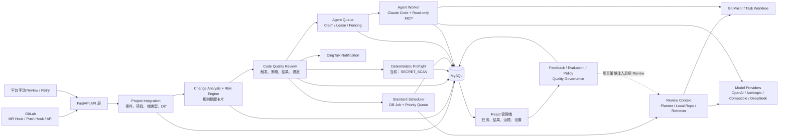
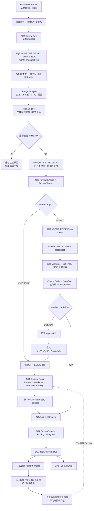

# AI Code Review Platform Current Architecture Overview

分析基准：2026-07-30。
结论以当前 `backend-python/`、`frontend/` 和自动化测试为第一依据，以较新的专题文档状态为第二依据；历史路线中的过期描述不作为当前实现结论。

状态标记：

- ✅ 已实现并进入当前主线
- 🟡 已实现，但能力范围或生产验证仍受限
- 🧭 已有明确设计，等待后续阶段
- ⬜ 当前未实现

## 一、平台定位

### 1.1 平台解决什么问题

AI Code Review Platform 不是单纯的“AI 评论机器人”，而是一套面向研发变更质量的控制平台。

它主要解决四类问题：

1. 代码变更进入评审时，接口、数据库、缓存、MQ、配置等高价值变化容易被漏看。
2. 只把完整 Diff 丢给模型，容易出现上下文不足、误判、结论不可解释。
3. 多项目、多端、多 Provider、多模型之间缺少统一的触发、调度、配置与结果治理。
4. AI Finding 缺少人工反馈、评估样本、规则缺口归因和持续验证闭环。

当前产品实际上形成了两条相互配合的主线：

- **规则提醒主线**：确定性识别高价值变更，生成结构化风险卡片。
- **AI Review 主线**：基于 Diff、项目上下文、关系证据、项目策略和 Preflight 结果发现代码质量问题。

设计原则是“先规则、后 AI，证据优先，AI 增强而非唯一依赖”。

### 1.2 核心用户

| 用户                 | 主要诉求                                                     |
| -------------------- | ------------------------------------------------------------ |
| 开发者               | 快速判断必须处理的问题、查看证据与修复建议、反馈误判         |
| Reviewer / Tech Lead | 了解变更影响面、风险等级、上下文充分性和跨模块影响           |
| 项目管理员           | 管理项目组、端类型、触发策略、Provider、Profile、Prompt 和通知 |
| 质量治理人员         | 管理评估样本、规则缺口、验收门禁、项目策略和质量指标         |
| 平台运维人员         | 观察 Review 队列、Agent Worker、失败、降级、耗时和服务健康   |

### 1.3 当前阶段目标

当前平台已经越过“基本 Review 链路搭建”阶段，正在进入“高准确率、可治理、可运营”的阶段：

- Standard AI Review 主链路已经完整。
- 首次 Review 前 `SECRET_SCAN` Preflight 已落地。
- 多端 Planner 基线已建立，但端类型专属抽取器仍是占位实现。
- Agent Review 工程闭环、Worker 池和队列治理已实现，但仍处于受控生产验证阶段，尚不能证明 Agent 一定优于 Standard。
- 质量样本、规则缺口、验收门禁已具备 MVP，真实批量回放和二次模型复评仍待建设。
- 当前 `/` 首页仍是任务列表，不是统一运行控制台。

相关阶段状态见：

- [证据链与多端路线 (line 3)](D:/projects/ai-code-review-platform/docs/40-review-evidence-pipeline-and-multi-target-roadmap.md:3)
- [只读 Agent Review 计划 (line 5)](D:/projects/ai-code-review-platform/docs/41-server-side-readonly-agent-review-plan.md:5)
- [Agent 多 Worker 与队列治理 (line 3)](D:/projects/ai-code-review-platform/docs/47-agent-review-multi-worker-pool-and-queue-governance-plan.md:3)
- [运行中沉浸式工作台 (line 1)](D:/projects/ai-code-review-platform/docs/50-review-running-immersive-workspace-plan.md:1)

------

## 二、当前整体架构

### 2.1 技术栈

| 层次          | 当前实现                                                     |
| ------------- | ------------------------------------------------------------ |
| 前端          | React 19、React Router 7、Vite 8、Material UI 9、Ant Design 6、PrismJS |
| 后端          | Python 3.12+、FastAPI、SQLAlchemy 2、PyMySQL、httpx          |
| 数据库        | MySQL                                                        |
| 代码工作区    | Git mirror + task worktree                                   |
| Standard 调度 | 数据库 Job + 进程内优先级队列和线程池                        |
| Agent 调度    | 数据库 Claim、Lease、Heartbeat、Fencing + 独立 Worker        |
| 外部集成      | GitLab Webhook/API、DingTalk Webhook、多模型 Provider HTTP API |

依赖入口：

- [后端 pyproject.toml](D:/projects/ai-code-review-platform/backend-python/pyproject.toml)
- [前端 package.json](D:/projects/ai-code-review-platform/frontend/package.json)
- [FastAPI 主入口 (line 1)](D:/projects/ai-code-review-platform/backend-python/app/main.py:1)
- [React 主入口 (line 1)](D:/projects/ai-code-review-platform/frontend/src/main.jsx:1)

前端当前存在一个需要后续首页设计注意的现实：应用壳已经向 MUI 迁移，但业务页仍混合使用 MUI、Ant Design，并且大量页面和路由集中在 [App.jsx (line 12038)](D:/projects/ai-code-review-platform/frontend/src/App.jsx:12038)。当前首页组件直接进入任务列表，并没有独立 Command Center 信息架构。

### 2.2 系统架构图

### 2.3 服务模块划分

| 模块                     | 职责                                             | 主要代码                                                     |
| ------------------------ | ------------------------------------------------ | ------------------------------------------------------------ |
| project-integration      | GitLab 事件、项目、项目组、端类型、Diff 补拉     | [project_integration (line 38)](D:/projects/ai-code-review-platform/backend-python/app/project_integration/service.py:38) |
| change-analysis          | API、DB、缓存、MQ、配置等变更识别                | [change_analysis (line 1)](D:/projects/ai-code-review-platform/backend-python/app/change_analysis/service.py:1) |
| risk-engine              | 规则匹配、风险项和提醒卡片生成                   | [risk_engine (line 1)](D:/projects/ai-code-review-platform/backend-python/app/risk_engine/service.py:1) |
| rule-template            | 可配置规则模板和关注变更类型                     | [rule_template (line 1)](D:/projects/ai-code-review-platform/backend-python/app/rule_template/models.py:1) |
| review-record            | ReviewTask、规则结果、通知记录、任务聚合状态     | [review_record (line 1)](D:/projects/ai-code-review-platform/backend-python/app/review_record/models.py:1) |
| code-quality             | AI 触发、调度、Provider、Finding、进度、修复预览 | [code_quality (line 853)](D:/projects/ai-code-review-platform/backend-python/app/code_quality/service.py:853) |
| review-context           | Context Planner、仓库工作区、关系证据和预算      | [review_context (line 174)](D:/projects/ai-code-review-platform/backend-python/app/review_context/service.py:174) |
| deterministic-checks     | 模型调用前的确定性检查                           | [deterministic_checks (line 1)](D:/projects/ai-code-review-platform/backend-python/app/deterministic_checks/service.py:1) |
| agent-review             | Agent 配置、Job、Run、Worker、降级               | [agent_review (line 84)](D:/projects/ai-code-review-platform/backend-python/app/agent_review/service.py:84) |
| review-feedback / policy | Finding 反馈和人工确认后的项目策略               | [review_feedback (line 1)](D:/projects/ai-code-review-platform/backend-python/app/review_feedback/service.py:1) |
| evaluation / quality     | 评估样本、运行记录、质量看板、验收门禁           | [evaluation (line 39)](D:/projects/ai-code-review-platform/backend-python/app/evaluation/service.py:39) |
| notification             | DingTalk 消息构造、发送和记录                    | [notification (line 1)](D:/projects/ai-code-review-platform/backend-python/app/notification/service.py:1) |

### 2.4 核心领域模型

| 领域        | 主要模型                                                     |
| ----------- | ------------------------------------------------------------ |
| 项目配置    | `Project`、`ProjectGroup`、`ProjectTargetConfig`、`ProjectGroupAiReviewModel` |
| GitLab 事件 | `GitLabMergeRequestEvent`、`GitLabPushEvent`                 |
| 规则审查    | `RuleTemplate`、`ReviewTask`、`ReviewResult`、`NotificationRecord` |
| AI Review   | `CodeQualityReviewProfile`、`CodeQualityModelProvider`、`CodeQualityReviewResult`、`CodeQualityReviewProgressEvent` |
| 调度与输出  | `CodeQualitySchedulerJob`、`CodeQualityFixPreview`、`CodeQualityFindingRefinement`、`CodeQualityPushReviewGateDecision` |
| Preflight   | `DeterministicCheckRun`                                      |
| Agent       | `AgentReviewSettings`、`AgentReviewWorker`、`AgentReviewRun` |
| 治理闭环    | `ReviewItemFeedback`、`ProjectReviewPolicy`、`EvaluationCase`、`EvaluationRun`、`ReviewQualityAcceptanceGate` |

一个重要边界是：**Finding 当前不是独立关系表实体**，而是保存在 `CodeQualityReviewResult.findings_json` 中。反馈、补证据、修复预览通过 `reviewKey + fingerprint` 等标识关联。这会影响后续首页进行 Finding 聚合、跨任务趋势查询和生命周期展示的成本。

------

## 三、当前 AI Review 真实完整链路

### 与题目给出的设想存在的差异

1. **任务调度不在规则分析之前。**
   Webhook 创建任务后，先完成 Diff 处理、规则变更分析和风险卡片，再决定是否调度 AI。
2. **“代码解析”不是统一编译器或 AST 阶段。**
   当前是 Diff 规范化、规则识别、轻量语言信号抽取和 Java/XML 关系索引的组合。
3. **Standard Review 与 Agent Review 是两种不同执行引擎。**
   Standard 直接构建 Context Pack 后调用 Provider；Agent 使用独立 Worker，通过只读 MCP 自主检索证据并提交 Review Card。
4. **风险判断存在两层，但没有 Finding 之后的独立风险重排引擎。**
   - AI 前：规则引擎生成结构化风险卡片。
   - AI 输出：模型返回 Finding severity 和 overall risk，经 schema 规范化。
   - 当前没有额外的后置模型仲裁或统一风险打分器。
5. **人工反馈发生在通知之后。**
   Review 结果落库后即进入前端并发送通知；反馈是异步治理闭环，不是通知前的阻塞步骤。
6. **Agent 失败具有显式 Standard 降级。**
   Agent 不可用、失败或超时可生成 `STANDARD_FALLBACK`；主动取消不会自动降级。

------

## 四、当前核心能力全景

| 能力                        | 状态 | 当前实现与位置                                               | 能力边界                                                     | 后续方向                                                     |
| --------------------------- | ---- | ------------------------------------------------------------ | ------------------------------------------------------------ | ------------------------------------------------------------ |
| GitLab Webhook              | ✅    | MR 与 Push 共用入口；按 header/object kind 分流。[API (line 91)](D:/projects/ai-code-review-platform/backend-python/app/project_integration/api.py:91) | 当前集中在 GitLab；未形成通用 SCM Adapter                    | GitHub/Gitee 等事件适配、GitLab 评论回写                     |
| Review Task 生命周期        | ✅    | 创建、失败、规则成功、AI 聚合状态、手动触发、Retry、Cancel。[repository.py (line 456)](D:/projects/ai-code-review-platform/backend-python/app/review_record/repository.py:456) | `status` 与 `reviewStatus` 是两个维度，容易被 UI 混淆        | 形成统一任务运行视图和 SLA                                   |
| Diff 分析                   | ✅    | MR Diff、Push Compare、Payload fallback；API/DB/缓存/MQ/配置分类 | 以文本和规则为主，不是完整语义分析                           | 端类型、语言和业务 Retriever 扩展                            |
| Context Planner / Retriever | 🟡    | 通用 Planner、Context Pack、Git worktree、同文件上下文、关系证据、预算裁剪。[planner.py (line 1)](D:/projects/ai-code-review-platform/backend-python/app/review_context/planner.py:1) | 专属 target extractor 多数仍为占位；结构化能力主要覆盖 Java/XML | 由样本驱动逐个补目标端和高价值关系                           |
| Code Graph / 代码索引       | 🟡    | `rg` + 运行时轻量 Java/XML source index，识别调用、接口实现、Controller-Service、Service-Mapper、MyBatis 等关系。[local_retriever.py (line 1)](D:/projects/ai-code-review-platform/backend-python/app/review_context/local_retriever.py:1) | 无持久化全局 Code Graph、AST/LSP、跨语言调用图；每次受预算重建 | 持久化增量索引、多语言结构化关系、跨仓依赖                   |
| Agent 设计                  | 🟡    | 独立 Worker、Claim/Lease/Fencing、只读 MCP、预算、收敛、Review Card、Standard fallback。[runner.py (line 1)](D:/projects/ai-code-review-platform/backend-python/app/agent_review_spike/runner.py:1) | 当前固定 Claude Code + DeepSeek；处于受控验证，不能宣称准确率优于 Standard | 完成真实小任务复验、30+ 人工标注门禁、再决定扩量             |
| Prompt 体系                 | ✅    | 统一 Finding 协议、Provider 请求模板、Profile 自定义提示、项目策略和 Context Pack 注入。[prompt.py (line 1)](D:/projects/ai-code-review-platform/backend-python/app/code_quality/prompt.py:1) | 尚不是完整的版本化 Prompt 实验平台                           | Prompt 版本、样本回放、A/B 对比和回滚                        |
| Model Router                | ✅    | 配置驱动的 target resolution + Provider 类型分发。[providers.py (line 18)](D:/projects/ai-code-review-platform/backend-python/app/code_quality/providers.py:18) | 不是按成本、延迟、质量动态决策的智能路由器                   | 基于质量门禁、预算、健康度的策略路由                         |
| 多模型调用                  | ✅    | 项目组可配置多个 Review Target，分别指定 provider/model/reviewKey，Standard 支持 fan-out | Agent 当前是固定单模型组合；多模型结果没有自动仲裁           | 模型对比、共识/冲突视图、成本与质量归因                      |
| 风险规则                    | ✅    | 规则模板、细粒度变更类型、风险项、结构化风险卡片             | 基于预设规则和文本模式，跨模块语义有限                       | 评估样本驱动规则增量和规则版本治理                           |
| Finding 结构                | ✅    | severity、category、文件行号、title/body/suggestion、confidence、contextStatus、evidence、missingContext 等 | Finding 存 JSON；没有独立生命周期实体和后置仲裁              | Finding 关系化、跨任务聚合、去重和状态流                     |
| 二次复评                    | 🧭    | 已有 finding 级“补证据”MVP                                   | 补证据只重建 Context Pack，不再次调用模型，也不改变原 Finding | 建立 `CONFIRMED / WEAKENED / REJECTED / STILL_INSUFFICIENT` 二次结论 |
| Preflight                   | ✅    | AI fan-out 前自动运行 `SECRET_SCAN`，扫描新增行、遮罩证据、失败 fail-open、同轮复用 | 当前只有敏感信息检查；不阻塞 Review/合并                     | lint、类型检查、测试、静态分析，仍需白名单与资源预算         |
| Feedback Learning           | 🟡    | Finding/规则反馈、原因、状态；人工确认后可转项目策略并注入后续 Review | 是“人工治理记忆”，不是模型训练或自动强化学习；完整反馈池 UI 默认隐藏 | 策略命中效果、自动建议但人工审批、回放验证                   |
| Notification                | ✅    | DingTalk 规则卡片和 AI 汇总通知，保存 SUCCESS/FAILED/SKIPPED | 当前主通道是 DingTalk；未形成多通道适配层和 GitLab Review 评论闭环 | Slack/Teams/邮件、MR 评论、分级通知和重试治理                |

### 已实现但值得单独关注的扩展能力

- Finding 级修复预览：生成 unified diff，但不会自动应用代码或创建 MR。
- Finding 级补证据：为上下文不足的高风险 Finding 重建局部证据。
- Push 审核策略：分支、变更规模、风险、去重/防抖和硬限制。
- 评估样本与质量看板：支持误判、等级偏高/偏低、上下文不足、重复、漏报等 verdict。
- 规则缺口归因和验收门禁：可以关联样本、run 和 acceptance gate。
- Agent 安全轨迹：只展示阶段、工具活动和安全摘要，不保存源码、Prompt、推理过程或原始模型输出。

------

## 五、当前运行状态与数据模型

### 5.1 Task 状态

`ReviewTask` 有两个不能合并的状态维度：

| 字段           | 状态                                                         | 含义                                        |
| -------------- | ------------------------------------------------------------ | ------------------------------------------- |
| `status`       | `RUNNING / SUCCESS / FAILED`                                 | Webhook、规则分析和任务技术执行状态         |
| `reviewStatus` | `NOT_TRIGGERED / REVIEWING / NO_RISK / MINOR / MAJOR / CRITICAL / SKIPPED / REVIEW_FAILED / TASK_FAILED` | 由全部 AI ReviewResult 聚合出的业务审查状态 |

因此可能出现：

- `task.status=SUCCESS`，但 `reviewStatus=REVIEWING`：规则主流程已完成，AI 仍在运行。
- `task.status=SUCCESS`，但 `reviewStatus=REVIEW_FAILED`：任务本身成功，AI 调用全部失败。
- 多模型结果中只要仍有一个 `RUNNING`，聚合状态就是 `REVIEWING`。

### 5.2 调度与模型调用状态

| 对象                      | 状态                                                         |
| ------------------------- | ------------------------------------------------------------ |
| `CodeQualitySchedulerJob` | `QUEUED / RUNNING / SUCCESS / FAILED / SKIPPED`              |
| Job 类型                  | `AI_REVIEW / AGENT_REVIEW / FIX_PREVIEW`                     |
| `CodeQualityReviewResult` | `RUNNING / SUCCESS / FAILED / SKIPPED`                       |
| Provider 调用阶段         | `PROVIDER_SELECTED`、`REQUEST_VALIDATED`、`HTTP_REQUEST_START`、响应解析、`RESULT_SAVED` 等 |
| Push Gate                 | `ALLOWED / REJECTED`，另保存 reason code                     |

模型调用没有单独的“ModelCall”领域状态表；当前由 ReviewResult、SchedulerJob 和 ProgressEvent 联合表达。

### 5.3 Agent 状态

| 对象            | 状态                                                         |
| --------------- | ------------------------------------------------------------ |
| Agent Run       | `PENDING / RUNNING / SUCCEEDED / FAILED / CANCELLED / TIMED_OUT` |
| Worker 工作状态 | `IDLE / BUSY / DRAINING`                                     |
| Worker 可用性   | 根据最近 Heartbeat 派生 `ONLINE / OFFLINE`                   |
| 有效执行引擎    | `AGENT / STANDARD_FALLBACK`                                  |
| 安全展示阶段    | `AGENT_QUEUED / AGENT_ANALYZING / AGENT_TOOL_ACTIVITY / AGENT_CONVERGING / AGENT_SUBMITTING / AGENT_FINISHED / AGENT_FALLBACK` |

### 5.4 Review 阶段状态

当前不是单一枚举状态机，而是持续写入 ProgressEvent：

1. AI 触发与排队
2. Deterministic Precheck
3. Request Built
4. Context Pack Built
5. Local Repo Prepared
6. Local Context Retrieved / Failed
7. Project Policies Injected
8. Provider Selected / Request Validated
9. HTTP Request / Response / Parse
10. Result Saved / Finished
11. Notification Sent

Agent 使用独立的一组安全阶段，但最终落入同一个 ReviewResult 和任务详情体系。

### 5.5 Finding 状态

Finding 本身没有 `OPEN/FIXED/RESOLVED` 之类的统一生命周期字段。当前由以下维度共同表达：

- 风险：`MINOR / MAJOR / CRITICAL`
- 置信度：`LOW / MEDIUM / HIGH`
- 上下文：`SUFFICIENT / PARTIAL / INSUFFICIENT`
- 人工反馈：独立 Feedback 状态
- 补证据：独立 Refinement 状态
- 修复建议：独立 FixPreview 状态

相关附属状态：

| 对象                | 状态                                                         |
| ------------------- | ------------------------------------------------------------ |
| Feedback            | `PENDING / VALID / INSUFFICIENT / IGNORED / CONVERTED`       |
| Finding Refinement  | `COMPLETED / FAILED`                                         |
| Fix Preview         | `QUEUED / RUNNING / SUCCESS / FAILED / SKIPPED`              |
| Evaluation Run      | `PENDING / RUNNING / COMPLETED / FAILED / CANCELED`          |
| Deterministic Check | `NOT_RUN / COMPLETED / NOT_APPLICABLE / FAILED / UNAVAILABLE` |
| Notification        | `SUCCESS / FAILED / SKIPPED`                                 |

------

## 六、当前平台未来演进方向

### 6.1 短期目标

1. **完成 Agent 受控生产验证**
   - 部署并验收最新 Worker 队列治理。
   - 继续使用小型真实任务验证收敛、提交和降级链路。
   - 在 30 条以上人工标注和足够 Standard/Agent 配对样本前，不扩大默认范围。
2. **进入第一个样本驱动的多端 Planner/Retriever 扩展**
   - 当前专题已经停在阶段 3 之前。
   - 必须先具备 evaluation case、人工归因、acceptance gate 和 baseline run。
   - 每轮只补一个端类型、一个高价值信号和一个 Retriever 关系。
3. **补齐 Finding 二次模型复评**
   - 当前补证据只有检索，没有重新判断。
   - 需要保存原结论、追加证据、复评结论及两次调用关系。
4. **扩展安全可控的确定性工具**
   - lint、类型检查、测试、静态分析。
   - 必须具备命令白名单、超时、资源限制、工作目录和输出脱敏。
5. **把已有运行数据转化为控制面**
   - 两套队列、Worker、Provider、失败与降级已经有数据基础。
   - 当前缺少一个统一、面向运行治理的首页。

### 6.2 中长期目标

- 持久化、增量式、多语言 Code Graph。
- 跨仓库、前后端接口和调用方影响分析。
- 真实批量 Evaluation Replay 和 Provider/Prompt/规则版本对比。
- 质量、成本、耗时、Provider 健康和 Worker 容量一体化治理。
- 置信度与确定性检查结合的合并门禁。
- Finding 去重、聚类、趋势、修复追踪和跨版本回归。
- GitLab 评论、Slack、Teams、邮件等多通道通知。
- 在严格授权、灰度和回滚能力下探索更自动化的修复流程。

### 6.3 核心竞争力判断

当前最有价值的竞争力不是“接入了多少模型”，而是以下组合：

1. **规则与 AI 双轨运行**：规则提供确定性基线，AI 聚焦复杂正确性问题。
2. **证据驱动和不确定性显式化**：Finding 同时表达 evidence、confidence、contextStatus 和 missingContext。
3. **Standard 与 Agent 双引擎**：简单任务可以直接调用模型，复杂任务可以有限自主取证，并有显式降级。
4. **项目级上下文和策略记忆**：项目配置、端类型、项目策略能够进入后续 Review。
5. **质量治理闭环**：误判、漏报、上下文不足可以进入样本、归因、验收门禁和后续能力建设。
6. **多 Provider、多模型和可运营调度**：具备演进成研发质量控制面的基础，而不只是一次性的模型调用。

------

## 七、对后续 Command Center 设计最重要的架构结论

在进入首页设计前，应把以下事实作为约束，而不是把平台抽象成一张简单任务表：

- 平台存在规则审查、Standard AI、Agent AI 三种不同运行路径。
- Task 技术状态、AI 聚合状态、Job 状态和 Agent Run 状态不能合并为一个状态。
- 多模型意味着一个任务可能同时拥有多个 ReviewResult。
- Agent 不可用和 Agent 失败可能转入 Standard fallback。
- 风险卡片、AI Finding、Preflight 结果是三类不同性质的风险信号。
- 人工反馈是 Review 完成后的治理闭环，不是同步审批步骤。
- 当前 Code Graph 是轻量、按任务构建的关系索引，不能按“全平台知识图谱已存在”进行设计。
- 首页真正可承载的控制面对象应至少包括：任务流量、调度队列、Agent Worker、Provider 健康、风险结果、证据质量、失败降级、通知结果和质量反馈。

本轮仅进行了只读分析，未修改任何代码、配置或文档。等待下一步 AI Review Command Center 首页设计任务。