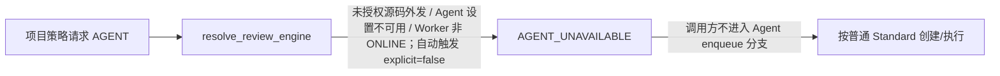
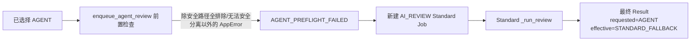
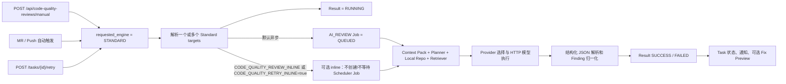
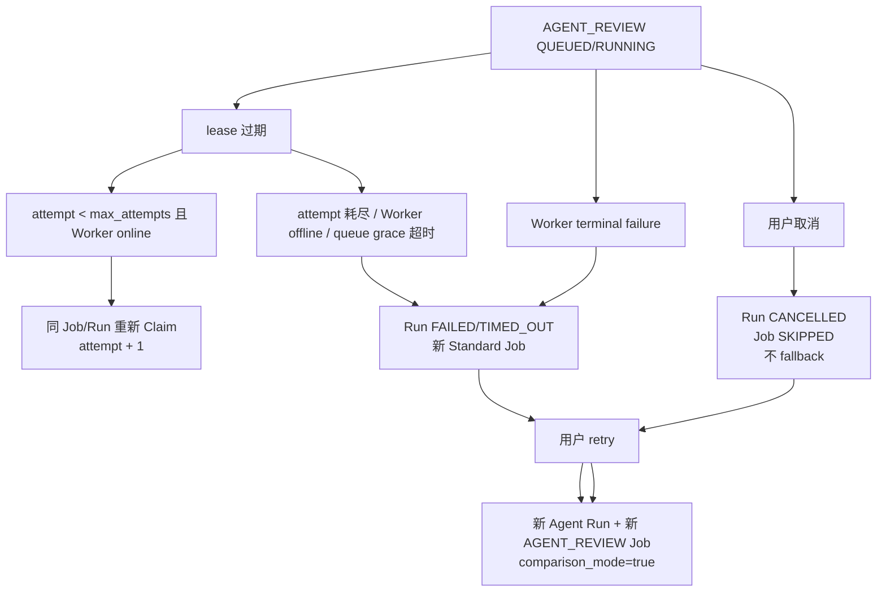
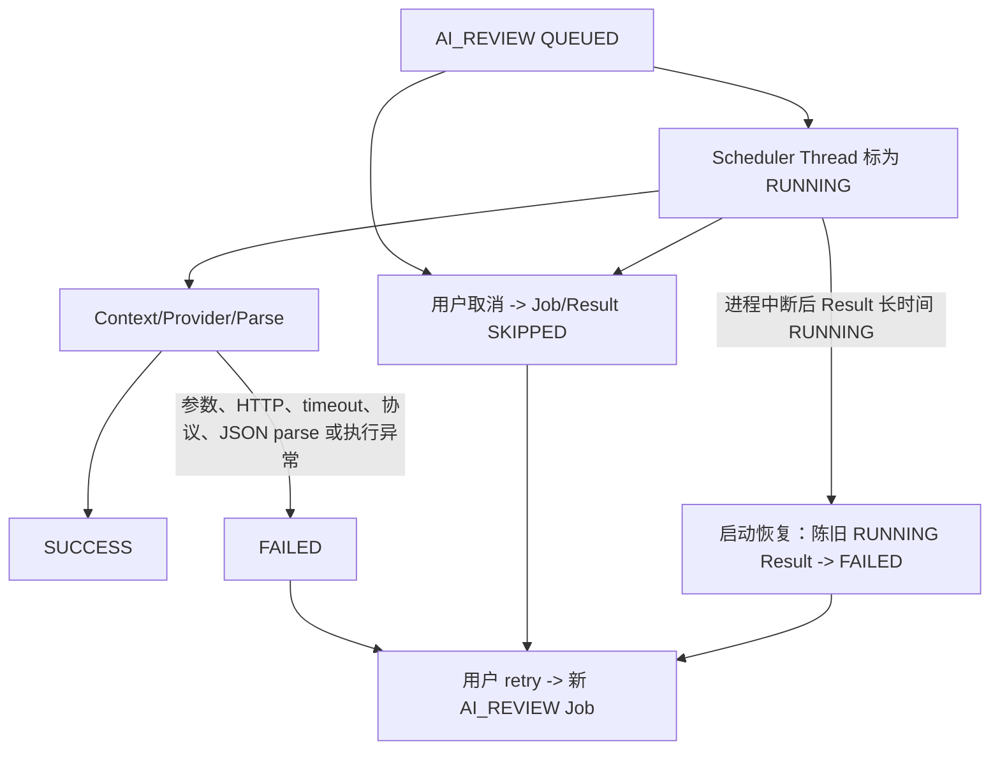
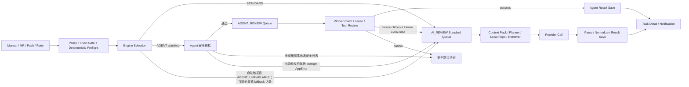

# AI Review Command Center Current Flow Audit

## 0. 审计说明

- 审计日期：2026-08-03。
- 代码基线：`9ac9bfb`（`main`）。
- 审计性质：当前真实流程只读审计；不是 Evolution Phase 4，不修改既有 Command Center 地图、Runtime、Review/Scheduler/Agent/Provider 状态机、数据库、README 或 Evolution Plan 状态。
- 指定输入：根目录 `AGENTS.md`、`AI Review Command Center Evolution Plan v2.md`、`assets/ai-review-command-center-agent-fallback-reference.png`。
- 事实优先级：数据库写入与生产调用链 > Runtime v2 查询和投影 > Contract/Unit Test > 前端 Presentation/参考图。参考图只作为候选假设。

### 0.1 证据强度

| 等级 | 含义 |
| --- | --- |
| 强 | 生产代码直接创建或更新持久化记录，并能由模型/迁移或测试交叉确认。 |
| 中 | 由进度事件、Runtime 派生逻辑或单侧代码路径证明，但没有独立状态实体。 |
| 弱 | 仅有展示名称、结构说明或需要跨记录推断，不能作为业务阶段。 |

### 0.2 总结论

1. 候选拓扑 `Queue Gate → AI Review Core → Agent → 复评/路由决策 → Agent 或 Standard` **不成立**。代码中没有一个统一的 `AI Review Core` 调度实体，也没有 Agent 完成后的稳定“复评/路由决策”状态。
2. 真实主干是：触发与策略门禁完成后，`resolve_review_engine` 在入队前选择 Agent 或 Standard；两者共用 `code_quality_scheduler_jobs` 表，但使用两套不同执行机制。
3. Agent 使用 `AGENT_REVIEW` Job、`agent_review_runs`、Worker 心跳、租约 Claim 和受限工具执行；Standard 使用 `AI_REVIEW` Job、进程内 PriorityQueue/线程池、Context Pack、Provider HTTP 调用和 JSON 结果解析。
4. Agent 的 `CONVERGING` 是证据调用预算进入收敛区，不是复评；`SUBMITTING` 是提交 Review Card，不是路由决策。
5. 已创建的 Agent Run 在执行失败、超时或租约耗尽后，会创建一个**新的** `AI_REVIEW` Standard Job。两者没有 `parent_job_id`/`fallback_from_job_id` 外键，只靠相同 `task_id + review_key`、固定 Job label，以及最终 Result 的 `agent_run_id` 弱关联。
6. Standard 不是纯降级支路。它有手动创建、MR/Push 自动触发、人工重试、多模型目标和可选 inline 执行等独立入口。
7. “高准确模式”的真实语义是 Standard `_run_review` 在 Provider 调用前同步构建 Context Pack，并执行规则型 Planner、本地仓库准备和有界 Retriever；它不是独立引擎、独立 Provider、质量保证或路由决策器。
8. Runtime v2 能证明两条 Lane 的当前排队/运行、下一候选、容量、Worker、活动 Flow、Provider 观察和部分告警；不能证明成功结果抵达 Beacon、Agent→Standard 父子转交、Planner/Retriever 细分状态或完整终态流。
9. Runtime v2 对 fallback 的实时投影存在 P0 窗口：fallback Standard Job 已排队/执行时，旧 Agent Result 仍可能覆盖 AgentRun 的 `STANDARD_FALLBACK` 事实，造成 Lane item 的引擎或 fallback 标识错误，直至 Standard 结果保存。

---

## 一、真实流程图

## A. Agent 正常路径

```mermaid
flowchart LR
    T["手动 / MR / Push / 重试触发"]
    G["全局、项目组、触发类型、Push Gate、确定性预检"]
    E["resolve_review_engine = AGENT"]
    P["Agent 入队前安全检查"]
    J["AGENT_REVIEW Job = QUEUED"]
    R["AgentReviewRun = PENDING"]
    Q["Result = RUNNING<br/>requested=AGENT<br/>effective=AGENT"]
    C["Worker Claim"]
    X["Job/Run = RUNNING<br/>lease + attempt"]
    A["Claude CLI + DeepSeek<br/>只读 MCP 工具执行"]
    S["AGENT_ANALYZING / TOOL_ACTIVITY / CONVERGING / SUBMITTING"]
    V["Review Card schema 校验"]
    F["Run = SUCCEEDED<br/>Job = SUCCESS"]
    O["Result = SUCCESS<br/>effective=AGENT"]
    N["Task review_status 刷新<br/>自动触发时处理通知"]

    T -->|"允许进入 AI Review"| G
    G -->|"项目组引擎为 AGENT，外发授权、Agent 设置与 Worker 可用"| E
    E -->|"changedFiles、敏感路径、diff 大小、worktree 通过"| P
    P -->|"同一事务创建"| J
    P -->|"同一事务创建"| R
    P -->|"占位结果"| Q
    J -->|"Worker ONLINE 且 IDLE；priority DESC + queued_at ASC；行锁/skip locked"| C
    C -->|"attempt +1，建立/续租 lease"| X
    X --> A
    A -->|"工具审计与心跳写进度事件"| S
    S -->|"submit_review 生成 Review Card"| V
    V -->|"合法且 changedFiles 范围匹配"| F
    F --> O
    O --> N
```



### A.1 边与状态证据

| 边 | 触发条件 | 状态变化 | 代码证据 |
| --- | --- | --- | --- |
| 触发 → 门禁 | 全局开关、Profile、项目组策略和触发类型允许；Push 还必须通过 Push Gate | 尚未创建 Review Job；可能先写确定性检查与 Push Gate decision | `project_integration/service.py::_process_task`；`code_quality/service.py::create_manual_review`、`trigger_auto_review`、`_trigger_push_auto_review` |
| 门禁 → Agent 选择 | `resolve_review_engine` 返回 `AGENT`；项目组 `review_engine=AGENT`，`agent_source_export_allowed=true`，Agent 已启用、有密钥且 Worker 在线 | 选择结果没有独立表字段；在后续 Run/Result 固化为 `requested_engine=AGENT` | `agent_review/service.py::resolve_review_engine`；`project_groups.review_engine/agent_source_export_allowed`（V42） |
| Agent 选择 → 入队前检查 | changed files 非空；排除敏感路径后仍有文件；允许 diff 可安全分离；diff ≤ 1 MiB；worktree 在配置根目录内 | 失败时可能跳过、报错或在自动触发中转 Standard；成功后继续 | `agent_review/service.py::enqueue_agent_review`、`_partition_review_paths`、`_ensure_worktree` |
| 检查 → Agent Queue | 所有检查通过 | 新建 `code_quality_scheduler_jobs(job_type=AGENT_REVIEW,status=QUEUED,priority=80,attempt=0,max_attempts=2)`；新建 `agent_review_runs(status=PENDING)`；upsert Agent Result 为 `RUNNING/AGENT/AGENT`；写 `AGENT_QUEUED` | `agent_review/repository.py::create_agent_job`；`agent_review/service.py::enqueue_agent_review`；`code_quality/repository.py::save_result` |
| Queue → Claim | Worker 心跳记录可接受 Claim；配置测试优先；Job 为 QUEUED，或 lease 已过期且 `attempt < max_attempts` | Job `RUNNING`、写 `lease_owner/lease_expires_at/heartbeat_at`、`attempt+1`；Run `RUNNING`、写 `started_at/heartbeat_at` | `agent_review/service.py::claim_job`；`agent_review/repository.py::claim_agent_job` |
| Claim → 执行 | Worker 获得合法 idempotency key、claimAttempt、worktree、预算和 API key | Worker 上报 BUSY；后台心跳每 15 秒续租并读取 cancelRequested | `agent_review/worker.py::_worker_loop`、`_run_job`、`_heartbeat_loop`；`agent_review/repository.py::heartbeat_agent_job` |
| 执行 → 阶段变化 | 首次 attempt trace、工具审计、证据预算区间、submit_review | Progress phases：`AGENT_ANALYZING`、`AGENT_TOOL_ACTIVITY`、`AGENT_CONVERGING`、`AGENT_SUBMITTING`；重领时另写 `AGENT_RECLAIMED` | `agent_review/service.py::_persist_agent_trace_safely`、`_append_agent_attempt_start`、`_agent_trace_phase_and_message`；`agent_review_spike/workspace.py::ToolBudget.review_budget` |
| 执行 → 成功终态 | CLI 正常退出、生成 Review Card，Worker complete 请求通过 lease/idempotency/claimAttempt fencing，Review Card schema 合法 | Run `SUCCEEDED/effective=AGENT`；Job `SUCCESS`；Result upsert `SUCCESS/requested=AGENT/effective=AGENT/agent_run_id`；Progress `AGENT_FINISHED` | `agent_review/service.py::complete_job`；`agent_review/repository.py::get_run_for_completion`、`finish_agent_records` |
| 成功 → 任务/通知 | Result 保存完成 | `review_tasks.review_status` 由 Result 汇总为 `NO_RISK/MINOR/MAJOR/CRITICAL`；手动任务可标为 SUCCESS；带 autoNotification 的非 comparison Run 发送通知 | `agent_review/service.py::_finish_existing_review_flow`；`code_quality/service.py::_sync_task_status_after_review`、`_send_auto_review_notification`；`review_record/repository.py::refresh_review_status` |

### A.2 Agent 阶段名称的准确含义

- `AGENT_ANALYZING`：Run 已被 Worker 领取并开始执行；不是 Context Planner 状态。
- `AGENT_TOOL_ACTIVITY`：`list_files/search_code/read_file_range/read_diff_range` 等只读工具活动；可观测到活动类型和有界路径摘要。
- `AGENT_CONVERGING`：`evidence_calls >= converge_at_evidence_calls` 后停止扩大风险假设；是预算状态，不是第二次 Review。
- `AGENT_SUBMITTING`：预算要求提交或调用 `submit_review`；是 Review Card 提交状态，不是引擎路由。
- Agent 路径没有独立 `Context Planner` 或 `Retriever` 实体；它通过受限 MCP 工具自主查证。

## B. Agent 降级到 Standard 的路径

真实代码有三种不同语义，不能合并成一个“复评后降级”节点。

### B.1 入队前直接选择 Standard：没有显式 fallback 事实



- 发生位置：`agent_review/service.py::resolve_review_engine`，调用位置为 `code_quality/service.py::trigger_auto_review` 和 `_trigger_push_auto_review`。
- 真实状态：不会创建 Agent Job/Run；Standard Result 默认写成 `requested_engine=STANDARD,effective_engine=STANDARD`。
- 结论：从业务意图看是 Agent 策略未被采用，从持久化语义看却不是 `STANDARD_FALLBACK`。地图不得把它展示成已证明的 Agent→Standard 转交。
- 手动显式请求 `AGENT` 时 `explicit=true`，上述条件抛错，不会静默降级。

### B.2 Agent 入队前检查失败：自动触发显式 fallback，但没有 Agent Job/Run



- 发生位置：`code_quality/service.py::trigger_auto_review`、`_trigger_push_auto_review` 捕获 `enqueue_agent_review` 的 `AppError`，调用 `_agent_preflight_fallback_metadata`，随后走普通 Standard target 循环。
- 常见触发：两次准备后 worktree 仍不可用、diff 超过 Agent 上限、Agent 配置在 engine resolve 与 enqueue 之间失效、changedFiles 数据不满足 Agent 前置契约等。
- 特例：`AGENT_NO_REVIEWABLE_FILES`、`AGENT_SAFE_DIFF_UNAVAILABLE` 不降级到外部 Standard，而是保存 `SKIPPED/effective=AGENT/fallbackTriggered=false`，避免敏感内容转交另一外部路径。
- 手动 Agent 没有这段通用 fallback catch，只把上述两个敏感路径错误保存为安全跳过；Agent retry 连这两个特例也未捕获。其余前置错误直接返回调用方。
- 关系：没有 Agent Job/Run，因此不存在可关联的父 Agent Job；只有无 `review_key` 的 `AGENT_PREFLIGHT_FAILED` Progress 和最终 Standard Result 中的 fallback metadata。

### B.3 Agent Run 已创建后的失败/超时/租约耗尽：创建新的 Standard Job

```mermaid
flowchart LR
    A["AGENT_REVIEW Job + AgentRun"]
    F["Worker fail / timeout"]
    L["租约或离线宽限耗尽"]
    R["AgentRun = FAILED 或 TIMED_OUT<br/>effective=STANDARD_FALLBACK"]
    Q["新 AI_REVIEW Job = QUEUED<br/>label=Agent Review 降级 - Standard"]
    C["Context Pack / Planner / Local Repo / Retriever"]
    P["首个 Standard Target Provider"]
    Z["JSON 解析 / Finding 归一化 / Result upsert"]
    O["Result requested=AGENT<br/>effective=STANDARD_FALLBACK<br/>agent_run_id=run.id"]

    A -->|"除 AGENT_CANCELLED 外的 Worker terminal failure"| F
    A -->|"RUNNING lease 过期且 attempt 耗尽或 Worker offline；或 QUEUED 且 offline 超过 60s"| L
    F --> R
    L --> R
    R -->|"schedule_agent_standard_fallback；幂等查重"| Q
    Q --> C
    C --> P
    P --> Z
    Z --> O
```



#### B.3.1 所有已证明的运行期触发条件

| 类别 | 条件/错误码 | 发生位置 | 是否降级 |
| --- | --- | --- | --- |
| Agent 执行超时 | `AGENT_TIMEOUT`，Runner deadline 到期并终止进程组 | `agent_review_spike/runner.py::_run_candidate` → Worker `/fail` → `agent_review/service.py::fail_job` | 是；Run `TIMED_OUT` |
| CLI 回合耗尽 | `AGENT_MAX_TURNS_EXCEEDED` | `runner.py::_candidate_cli_failure_code` | 是；Run `FAILED` |
| CLI 异常退出 | `AGENT_CLI_FAILED` | 同上 | 是 |
| 未提交 Review Card | `AGENT_REVIEW_NOT_SUBMITTED` | `runner.py::_run_candidate` | 是 |
| 输出/Schema 无效 | `AGENT_OUTPUT_INVALID`；complete API 二次校验失败时 Worker 也会转为失败上报 | `runner.py::_run_candidate`；`agent_review/service.py::complete_job`；`worker.py::_run_job` | 是 |
| Claude CLI 不存在 | `CLAUDE_CLI_NOT_FOUND` | `runner.py::_run_candidate` | 是 |
| 预算契约损坏 | `AGENT_INVALID_BUDGET_CONFIG` | `worker.py::_run_job` | 是 |
| Worker 未预期异常 | `AGENT_WORKER_ERROR` | `worker.py::_run_job` | 是 |
| 其他 Runner 失败 | 默认 `AGENT_RUN_FAILED` 或 Runner 返回的其他错误码 | `worker.py::_run_job`、`agent_review/service.py::fail_job` | 是 |
| 运行租约耗尽 | `RUNNING` 且 lease 过期，并且 `attempt >= max_attempts` 或 Worker offline | `agent_review/repository.py::expire_exhausted_agent_jobs` | 是；`AGENT_LEASE_EXHAUSTED` |
| 离线排队宽限耗尽 | `QUEUED`、Worker offline、queued 超过 60 秒 | 同上 | 是；`AGENT_LEASE_EXHAUSTED` |
| 主动取消 | `AGENT_CANCELLED`，或已排队 Job 被用户取消 | `agent_review/service.py::fail_job`；`code_quality/service.py::_sync_cancelled_agent_run` | **否**；Run `CANCELLED/effective=AGENT` |
| Worker 全忙 | Worker 在线但均 BUSY | `worker_accepts_claim`、Agent Queue | **否**；继续 QUEUED |

#### B.3.2 新旧 Job 的关联事实

| 记录 | 真实关联 |
| --- | --- |
| 原 Agent Job | `code_quality_scheduler_jobs.id = agent_review_runs.scheduler_job_id`，`job_type=AGENT_REVIEW` |
| 新 Standard Job | 新的 `code_quality_scheduler_jobs.id`，`job_type=AI_REVIEW`；复用 `task_id`、Agent 固定 `review_key`；label 固定为 `Agent Review 降级 - Standard` |
| Agent Run | `effective_engine=STANDARD_FALLBACK`，保留 `input_json` 供 fallback 复用；完成 fallback 后清空 |
| 最终 Result | 与 Agent 初始占位 Result 是同一个 `(task_id, review_key)` upsert 行，不创建第二条结果；最终写 `agent_run_id` 和 `agent_summary_json` |
| 缺失关系 | Standard Job 无 `parent_job_id`、`fallback_from_job_id`、`agent_run_id`、`fallback_reason` 字段；Job 自身不能直接证明父 Job/Run |

幂等仅通过“相同 task/review_key + 固定 label 是否已有 AI_REVIEW Job”实现。`list_unscheduled_agent_standard_fallback_run_ids` 在恢复时查找 `FAILED/TIMED_OUT + STANDARD_FALLBACK + input_json 非空` 的 Run，再补建缺失 Job。

## C. Standard 独立进入路径

结论：**真实存在且是一级能力，不应删除。**



### C.1 独立入口证据

| 入口 | 条件 | Job/执行语义 | 代码证据 |
| --- | --- | --- | --- |
| 手动 Standard | `/api/code-quality-reviews/manual`，显式或项目组选择 STANDARD | 创建新 ReviewTask；每个 target 先保存 RUNNING Result；默认每 target 新建 `AI_REVIEW` Job | `code_quality/api.py::manual_review`；`service.py::create_manual_review`、`enqueue_manual_review` |
| MR 自动 Standard | MR 任务完成规则分析，策略允许自动 Review，选择 Standard | 每个 target 新建 `AI_REVIEW` Job；完成后发送自动通知 | `project_integration/service.py::_process_task`；`code_quality/service.py::trigger_auto_review` |
| Push 自动 Standard | Push Gate `ALLOWED` 且策略开启 | 保存 Gate decision；每个 target 新建 Job | `code_quality/service.py::_trigger_push_auto_review` |
| 人工重试 Standard | `/api/code-quality-reviews/tasks/{task_id}/retry`；Standard 分支仅允许 GitLab MR/Push task | 可按 reviewKey 或全部 target 新建 Job；清进度和 Fix Preview，再 upsert RUNNING Result | `code_quality/service.py::retry_review_task`、`enqueue_retry_review` |
| 多模型 | 项目端配置、项目默认 Provider、项目组 `aiReviewModels` 或全局默认 | 独立 Standard 可同时创建多个 reviewKey/Provider/Model Job | `code_quality/service.py::_resolve_review_targets` |
| Inline | `CODE_QUALITY_REVIEW_INLINE=true` 或 `CODE_QUALITY_RETRY_INLINE=true` | 在请求/当前调用线程执行 `_run_review`，不依赖 Provider Scheduler Claim | `code_quality/service.py::_inline_enabled` 及 manual/auto/retry 分支 |

### C.2 “高准确模式”的真实代码语义

“高准确模式”不是持久化 enum，也没有 `high_accuracy=true` 字段。真实语义是每次 Standard `_run_review` 都依次执行：

1. 复用确定性预检摘要（若有）。
2. 注入项目 Review Policy。
3. `build_review_context_pack`：规范 changed files/diff、汇总同文件上下文和历史 missing-context feedback。
4. 规则型 Planner：依据删除方法、签名变化、DTO 字段、DB/Mapper、缓存、MQ、配置等信号生成 `requestedContexts`。
5. 准备本地 mirror/worktree；成功时执行有界 Retriever，使用源文件索引、关系候选与 `rg/git grep` 检索，并做证据预算裁剪。
6. 将预算内 Context Pack 注入 Provider prompt。
7. 调用 Provider。

准确边界：

- Planner 明确写有 `Advisory only`，不自动忽略、不自动降级、不做路由。
- 各 target 专用 extractor 当前均为 `*-v0` 空实现；非 GENERAL target 的 baseline 多为 `GENERIC_FALLBACK`，主要依赖通用规则。
- Retriever 状态为 `SKIPPED/RETRIEVED/PARTIAL/UNAVAILABLE`；本地仓库不可用时仍可继续 diff-based Provider Review。
- 这些数据主要进入 `CONTEXT_PACK_BUILT`、`LOCAL_REPO_*`、`LOCAL_CONTEXT_*` Progress detail；没有独立 Planner/ Retriever 数据表。
- Agent 主流程不调用 `build_review_context_pack`；不能把图中的 Agent“上下文检索站”与 Standard 高准确链混为一谈。

## D. 失败、取消、超时和重试路径

### D.1 Agent



- Lease reclaim 是同一 Job/Run 的有限重试，不是新 Job；`claimAttempt` fencing 拒绝旧 owner/旧 attempt 的 heartbeat、complete、fail、cancelled。
- Worker 明确失败不会先自动重跑 Agent，而是直接 Standard fallback。
- 正在运行的 Agent 取消先写 `cancel_requested_at`，Worker heartbeat 感知后终止进程并上报 `AGENT_CANCELLED`；排队 Agent 取消直接 Job/Result `SKIPPED`，Run 同步为 `CANCELLED`。
- 用户 retry 若再次解析为 Agent，会新建 Agent Run/Job，并设置 `comparison_mode=true`；它不是修改原 Run 状态。

### D.2 Standard



- Provider Scheduler 是进程内 `PriorityQueue` + 10 个 daemon Thread；Job 入内存队列前先持久化为 QUEUED。线程取出后用 `mark_scheduler_job_running` 转 RUNNING。
- Provider HTTP timeout、连接错误、HTTP 状态错误、非 JSON 协议、无法提取文本或模型输出 JSON parse 失败，均返回 FAILED Result；Job 由 `_scheduler_outcome_status` 终结为 FAILED。
- Standard 没有 Agent 风格 lease、claim owner 或自动 attempt 重试。模型层失败后等待用户 retry。
- Running Standard 取消不能中断已经发出的同步 HTTP 请求；它先把 Job/Result 标为 SKIPPED，Provider 返回后 `_run_review` 再读取 Result，避免覆盖 SKIPPED。
- `recover_stale_running_reviews_on_startup` 只把陈旧 RUNNING Result 标为 FAILED；它不重投 Provider 内存队列，也不直接同步遗留 Scheduler Job 终态。
- `_run_review` 在 Provider 前的 Context 构建若抛出外围异常，target wrapper 会返回 FAILED 并使 Job 失败，但既有 RUNNING Result 不一定在该路径立即被 upsert 为 FAILED，需依赖后续恢复；这是现有失败收口边界。

### D.3 结果处理与“复核”结论

Standard Provider 完成后的真实处理是：

1. 从 OpenAI Responses、Anthropic Messages 或 OpenAI-compatible 响应提取文本。
2. 去除 Markdown JSON fence，`json.loads`。
3. 归一化 severity/category/line range/confidence/contextStatus/evidence/missingContext。
4. 保存或覆盖 `(task_id, review_key)` Result，刷新任务 review_status，写 `RESULT_SAVED/FINISHED`。
5. 自动触发场景处理钉钉通知；可按配置排队 Fix Preview。

这不是“结果复核”或第二模型裁决。Finding refinement 是结果生成后的显式 `POST /api/review-tasks/{task_id}/code-quality-refinements`，只对高风险且上下文不足的 Finding 运行，并以 overlay 保存；Acceptance Gate 是人工治理记录。二者都不在 Standard 主流程上，不能画成每个 Review 必经站。

---

## 二、证据矩阵

| 地图候选节点 | 真实状态或字段 | 来源文件 | 类、函数或方法 | 数据库表与字段 | Runtime v2 是否提供 | 证据强度 | 是否允许展示 | 备注 |
| --- | --- | --- | --- | --- | --- | --- | --- | --- |
| Review 入口/Queue Gate | 两类 Job 的 `QUEUED/RUNNING`、排队数、下一候选 | `code_quality/service.py`；`command_center/repository.py` | `_submit_provider_job`、`create_agent_job`、`_load_next_lane_job` | `code_quality_scheduler_jobs.job_type/status/priority/queued_at` | 是：两 Lane queuedCount/nextQueued；不是统一 Gate 实体 | 强 | 允许，名称应说明是“双队列候场投影” | 共享表不等于共享调度器 |
| AI Review Core | Standard/Agent 运行数与容量的前端聚合 | `command_center/service.py`；`commandCenterPresentation.js` | `build_runtime_snapshot`、`buildCommandCenterPresentation` | 无 Core 表或状态 | 仅聚合值 | 中 | 仅允许作为平台聚合/分流视觉节点 | 不得称为真实统一调度中枢 |
| 触发/策略 Gate | 全局开关、Profile、项目组策略、triggerOn*、Push Gate | `code_quality/service.py` | `enqueue_manual_review`、`trigger_auto_review`、`_trigger_push_auto_review` | settings/profile/project_groups/push_gate_decisions | Runtime 不提供门禁过程 | 强 | 允许，需独立于 Queue | 参考图未覆盖 |
| Engine Resolver | `STANDARD/AGENT/AGENT_UNAVAILABLE` 返回值 | `agent_review/service.py` | `resolve_review_engine` | 最终由 Run/Result requested/effective 固化；Resolver 本身无记录 | 仅能从后续记录推断 | 强/中 | 允许但需标“入队前选择” | 不是 Agent 后的路由决策 |
| Agent Queue | `job_type=AGENT_REVIEW,status=QUEUED,priority=80` | `agent_review/repository.py` | `create_agent_job` | scheduler jobs | 是 | 强 | 允许 | 顺序 priority DESC + queued_at ASC |
| Agent Run | `PENDING/RUNNING/SUCCEEDED/FAILED/TIMED_OUT/CANCELLED` | `agent_review/models.py`、`repository.py` | `AgentReviewRun`、`finish_agent_records` | `agent_review_runs.*` | 活动 Flow 只提供部分；无 runId/failureCode | 强 | 允许 | Runtime 是 bounded projection |
| Worker Pool | `IDLE/BUSY/DRAINING`、capacity、active_job/run、heartbeat | `agent_review/models.py`、`repository.py` | `AgentReviewWorker`、`record_worker_heartbeat`、`agent_worker_pool` | `code_quality_agent_workers.*` | 是 | 强 | 允许 | OFFLINE 是 Runtime 以 60 秒心跳窗口推导，不是 DB state enum |
| Worker Claim | lease owner/expires、attempt/max_attempts、claimAttempt fencing | `agent_review/repository.py` | `claim_agent_job`、`heartbeat_agent_job`、`_assert_claim_attempt` | scheduler job lease/attempt 字段 | 只给队列汇总、Job/Worker 绑定；无 per-item attempt/lease | 强 | 允许简化为 Claim/Running | 参考图未覆盖 |
| Agent 分析 | Progress `AGENT_ANALYZING` | `agent_review/service.py` | `_append_agent_attempt_start` | progress events | 是：stage | 强 | 允许 | 首次 trace/heartbeat 后可见 |
| Agent 上下文检索 | 只读工具 `search_code/read_file_range/read_diff_range` 活动 | `agent_review_spike/*`、`agent_review/service.py` | `ToolBudget`、`_persist_agent_trace_safely` | progress detail；Run tool summary | Runtime 只投影为 TOOL_ACTIVITY，不含工具明细 | 中 | 可展示为“证据工具活动”，不能叫稳定 Retriever | 与 Standard Retriever 不同 |
| Context Planner | Standard Context Pack 中的规则型 planner signals/requested contexts | `review_context/planner.py`、`review_context/service.py` | `build_planner_baseline`、`_context_plan` | 无专表；`CONTEXT_PACK_BUILT.detail` 摘要 | Runtime 只映射 `CONTEXT_BUILDING`，不提供 Planner 字段 | 强（代码）/中（运行状态） | 不允许画成独立容量站；可合并为 Context Build | Advisory only |
| Local Retriever | `SKIPPED/RETRIEVED/PARTIAL/UNAVAILABLE` | `review_context/local_retriever.py`、`service.py` | `retrieve_local_reference_context`、`_local_reference_context` | Progress detail | Runtime 不提供细分状态 | 强/中 | 仅在有投影数据时展示；当前地图不应独立展示 | Standard 主流程调用 |
| Agent 收敛 | `reviewBudget.phase=CONVERGE` → `AGENT_CONVERGING` | `agent_review_spike/workspace.py`、`agent_review/service.py` | `ToolBudget.review_budget`、`_agent_trace_phase_and_message` | progress events/detail | 是：stage | 强 | 允许改名为“证据收敛” | 不是复评 |
| Agent 提交 | `SUBMIT/submit_review` → `AGENT_SUBMITTING` | 同上 | 同上 | progress events | 是 | 强 | 允许 | 不是决策站 |
| 复评/路由决策 | 无主流程实体或状态 | 全代码搜索；`finding refinement` 与 acceptance gate 是旁路/治理 | `run_finding_refinement_response`、acceptance gate CRUD | refinement/acceptance 表是独立流程 | Runtime 主流程无 | 强（不存在稳定主链） | 必须删除 | 不得用“通过率”或运行项消失推断 |
| Agent 正常结果 | Run SUCCEEDED、Job SUCCESS、Result SUCCESS/effective AGENT | `agent_review/service.py`、`repository.py` | `complete_job`、`finish_agent_records` | run/job/result | 活动期间可见；完成后通常离开 activeFlows | 强 | 允许在任务详情；Runtime 地图无终态 feed | Beacon 不可显示成功抵达 |
| Agent fallback 决定 | Run `FAILED/TIMED_OUT + effective=STANDARD_FALLBACK` | `agent_review/service.py`、`repository.py` | `fail_job`、`expire_exhausted_agent_jobs` | agent_review_runs | Runtime 可能被旧 Result 覆盖 | 强 | 允许，但需修复 P0 投影后才可靠实时展示 | 主动取消除外 |
| Standard fallback Job | 新 `AI_REVIEW` Job，固定 label，复用 task/reviewKey | `code_quality/service.py` | `schedule_agent_standard_fallback` | scheduler jobs | 计入 Standard 聚合；item 标识存在窗口错误 | 强 | 当前只允许保守显示为 Standard Job | 无 parent ID |
| Standard 独立入口 | manual/MR/Push/retry，requested/effective STANDARD | `code_quality/api.py`、`service.py` | `create_manual_review`、`trigger_auto_review`、`retry_review_task` | task/job/result | 是：Standard Lane | 强 | 必须保留 | 可多模型 |
| “高准确模式” | Context Pack + Planner + local repo + bounded retrieval | `code_quality/service.py`、`review_context/*` | `_run_review`、`build_review_context_pack` | Progress detail；无 mode enum | 仅 `CONTEXT_BUILDING` | 强/中 | 改名为“Context 增强构建”更准确 | 不能宣称准确率 |
| Provider 调度 | 进程内 PriorityQueue、10 daemon workers、AI_REVIEW DB Job | `code_quality/service.py`、`scheduler_config.py` | `_ProviderJobScheduler`、`_submit_provider_job` | scheduler jobs | queued/running、固定 capacity=10 | 强 | 允许 | Runtime 看不到内存队列 owner/线程 |
| Provider 执行 | Provider selected/request/HTTP/response phases | `code_quality/providers.py` | `run_provider`、`_run_json_http_provider` | progress events/result | stage 多数压缩为 MODEL_CALLING；Provider observations 有聚合 | 强 | 允许 | 支持三类 Provider 协议 |
| 结果处理 | 文本提取、JSON parse、Finding normalize、Result upsert | `providers.py`、`code_quality/repository.py` | `_success_result`、`_normalize_finding`、`save_result` | code_quality_review_results | 活动 Flow 有 status/finding/risk；无终态列表 | 强 | 允许，名称改为“解析与落库” | 不是复核 |
| 取消 | Job/Result SKIPPED；Agent Run CANCELLED | `code_quality/repository.py`、`service.py` | `cancel_scheduler_job`、`cancel_active_scheduler_jobs_for_task`、`_sync_cancelled_agent_run` | job/result/run | active item 消失；无取消终态 feed | 强 | Runtime 地图不可把消失解释为取消 | 任务详情 Progress 可见 |
| 通知 | `NOTIFICATION_SENT`，notification record status | `code_quality/service.py`、`notification/*` | `_send_auto_review_notification` | notification_records | activeFlow 可推导 COMPLETED；alerts 仅失败通知 | 强 | 可表达“结果回流至既有通知链路” | 无成功吞吐统计 |
| Result Beacon | `STRUCTURAL_ONLY` 前端 Presentation | `commandCenterPresentation.js`、`CommandCenterCanvas.jsx` | beacon presentation/render | 无 | 无结果数据 | 弱 | 仅结构性展示 | 不能显示完成、通过率、Finding 或抵达动画 |

---

## 三、参考图差异结论

### 3.1 真实存在或可保留的节点

- `Queue Gate`：可保留为两类持久化 Job 队列的候场投影，但不是单一 Queue 服务。
- `Agent Review`：真实存在，具备独立 Job、Run、Worker、Claim、lease、attempt、心跳、工具活动和终态。
- `Provider 执行`：真实存在于 Standard 路径。
- `Standard Review`：真实存在，而且既是独立引擎，也是 Agent fallback 目标。
- `Result Beacon`：仅能作为“结果最终保存到任务详情并进入既有通知链”的结构性终点。

### 3.2 名称需要调整

| 参考图名称 | 建议准确名称 | 原因 |
| --- | --- | --- |
| AI Review Core 智能调度中枢 | AI Review Runtime 汇总 / Engine Selection & Runtime | 没有统一调度实体；Standard 与 Agent 执行器不同 |
| 任务编排 | 触发门禁与引擎选择 / 双队列调度 | 真正的策略选择在入队前；队列机制分裂 |
| 上下文检索（Agent Lane） | Agent 证据工具活动 | Agent 不使用 Standard Context Planner/Retriever |
| 复评 / 决策 | 证据收敛 / Review Card 提交 | CONVERGE/SUBMIT 是预算阶段，不做复评或路由 |
| Standard 高准确 Review | Standard · Context Pack 增强 Review | 是输入增强流程，不是可保证的准确率等级 |
| 结果复核 | JSON 解析、Finding 归一化与结果落库 | 没有第二模型/人工复核必经步骤 |

### 3.3 必须删除的节点或指标

- Agent 正常结果前的“复评/路由决策”必经站。
- “直接通过 78%”“Agent 命中率”“降级率”“整体通过率”“今日完成”“平均处理时长”“吞吐趋势”“资源利用率”“平台健康度”等 Runtime v2 未提供的参考图数据。
- 运行项消失后进入 Result Beacon 的成功/失败抵达动画或推断。
- Planner、Retriever、Provider、结果复核各自容量/运行数；当前没有这些站的独立队列或容量契约。

### 3.4 参考图未覆盖的真实流程

- 源码外发授权、Agent settings/API key/Worker online 检查。
- 敏感路径排除、全部敏感路径安全跳过、无法安全拆分 diff 时停止外部 Review。
- MR/Push/Manual/Retry 多入口和 Push Gate。
- 确定性预检复用。
- Agent lease、heartbeat、claimAttempt fencing、同 Job 重领与离线宽限。
- Agent preflight fallback（没有 Agent Job/Run）与 Agent runtime fallback（有新 Standard Job）两种不同路径。
- Standard 多模型 targets、可选 inline 执行和进程内 Provider Scheduler。
- 用户取消、启动时陈旧 Result 恢复、人工 retry。
- 通知、自动 Fix Preview、显式 Finding refinement 等后置旁路。

### 3.5 Standard 的地图定位

Standard **不能**建模为纯 Agent 降级支路。它必须保留独立入口，原因是：

1. 项目组默认 `review_engine` 就是 `STANDARD`。
2. 手动接口可以显式请求 Standard。
3. MR/Push 自动 Review 可以直接选择 Standard。
4. Webhook task 的人工 retry 可以独立创建 Standard Job。
5. Standard 支持项目端 Provider override 和项目组多模型 targets；Agent fallback 只取 `_resolve_review_targets(...)[0]`。

### 3.6 Result Beacon 当前能真实表达什么

允许表达：

- 两条执行路线最终都把正式结果写入 `code_quality_review_results`。
- 结果在任务详情可见，并在自动触发场景进入既有通知处理链。
- 固定结构说明：“结果回流至任务详情与既有通知链路”。

不允许表达：

- 某个运行项已经成功、失败、取消或抵达 Beacon。
- 今日完成数、通过率、Finding 数、通知成功率、平均时长或趋势。
- Agent 结果已经复评通过，或 Standard fallback 已经完成复核。

Runtime `alerts` 能另外证明窗口内的失败 Job、失败 Agent Run、通知失败、已落库 fallback 结果和 Critical Finding，但它不是完整终态事件流，也不能支持 Beacon 的成功抵达语义。

---

## 四、数据缺口

本节只记录建议来源，不设计或修改接口。

## P0：缺失会错误表达流程

### P0-1 fallback Standard Job 在完成前可能被 Runtime 错分 Lane/错标身份

证据链：

1. Agent 入队时 Result 被保存为 `requested=AGENT,effective=AGENT`。
2. Agent runtime failure 只先更新 `agent_review_runs.effective_engine=STANDARD_FALLBACK`，不更新 Result。
3. 新 fallback Job 使用相同 `task_id + review_key`，`job_type=AI_REVIEW`。
4. Runtime Lane SQL outer join 旧 Result；`_build_review_lane_item` 优先取 Result 的 requested/effective，再用 `_lane_engine` 分类。
5. 因此 queued fallback item 可能位于 Standard `nextQueued` 但 `fallback=false`；running fallback item 甚至会进入 Agent `runningItems`，而聚合 runningCount 又按 job_type 把它计入 Standard。
6. 只有 Standard `_run_review` 完成并 upsert Result 为 `STANDARD_FALLBACK` 后，标识才稳定正确。

建议来源字段：Scheduler Job 的明确 fallback 属性、parent/fallback source，或 Runtime 联合 AgentRun 与 fallback Job label 的无歧义投影。当前不实施。

### P0-2 Agent→Standard 缺少显式父子关系

同 task/reviewKey/固定 label 只能做规则推断；无法稳定回答“这个 Standard Job 从哪个 Agent Job/Run 降级而来”。重试、多次 Run、历史同 key Job 会增加歧义。

建议来源字段：Standard Job 到 Agent Run/Job 的持久化关联。当前不实施。

### P0-3 入队前的 Agent 不可用有两套不一致持久化语义

- `resolve_review_engine` 自动返回 `AGENT_UNAVAILABLE` 后直接执行 Standard，最终记录为纯 Standard。
- Agent 已选中但 enqueue 抛错时，自动触发写 `AGENT_PREFLIGHT_FAILED`，最终记录 `STANDARD_FALLBACK`。

地图若只看最终 Result，无法区分“策略本来就是 Standard”和“Agent 策略因不可用被替代”。当前不得将前者画成 fallback。

### P0-4 Result Beacon 没有成功/失败/取消终态 feed

Runtime activeFlows 面向活动任务，完成后会离开；alerts 只覆盖部分异常/高风险。任何 Beacon 抵达、完成数或成功率都会虚构。

建议来源：已有 Result/Job/Run/Notification 终态记录的只读有界投影。当前不设计接口。

## P1：缺失后无法表现真实流转

1. Runtime Lane item 没有 `agentRunId`、fallback failureCode、parent Job、Job label、attempt/maxAttempts、lease owner/expires、cancelRequestedAt，无法表现 Claim、重领、触发原因和显式转交。
2. `_derive_stage` 一旦识别 `fallback=true` 就优先固定返回 `FALLBACK`，会遮蔽 fallback Standard 正在 `CONTEXT_BUILDING/MODEL_CALLING/SAVE_RESULT` 的真实进度。
3. Runtime 读取 Progress 时不读取 `detail`；Planner signal、requested context、local repo 和 Retriever 状态虽已写 Progress detail，却无法投影成只读节点数据。
4. `AGENT_RECLAIMED`、`AGENT_HEARTBEAT`、`AGENT_FALLBACK_QUEUED` 没有独立 Runtime stage 映射，无法显示重领、心跳和 fallback 已排队。
5. Standard Provider Scheduler 的内存队列 owner/线程执行情况不可观测；Runtime 只看到 DB Job status 和固定 capacity=10。
6. Standard 启动恢复只收口陈旧 RUNNING Result，不提供 Queue 重投或 Job/Result 一致性状态；地图无法区分“Provider 仍在跑”和“进程已丢失执行所有权”。
7. Runtime activeTasks/activeFlows 是 bounded，且 Progress 全局有数量上限；高并发下某些真实活动 Flow 可能被截断，只能依赖 coverage 标记。

## P2：只影响视觉细节

1. Planner/Retriever 的 query、matched file、included snippet、预算裁剪细分计数未进入 Runtime。
2. Agent Tool 活动明细、evidence call 预算、source/diff bytes 只在 Run summary/Progress detail，不在 Lane marker。
3. Provider HTTP 子阶段、解析耗时、Context 构建耗时和每模型并发占用未形成独立投影。
4. Result 的通知状态、Finding refinement、Fix Preview 是后置旁路，当前 Runtime Map 无需逐站展示；若未来展示需使用各自真实记录。
5. 参考图的趋势、今日指标、健康度、命中率、通过率和资源利用率均属于新聚合需求，不能从现有快照字段视觉推算。

---

## 五、推荐地图拓扑

## 方案 A：Agent 主线 + Standard 纯降级支路

```text
Trigger → Agent Queue → Agent Worker → Agent Result
                         └ failure → Standard → Result
```

结论：**不推荐，代码证据否决。** 它删除了默认 Standard、手动 Standard、MR/Push Standard、Standard retry、多模型 Standard 和 inline Standard 等真实入口。

## 方案 B：Agent 主线 + Standard 降级支路 + Standard 独立入口

```text
Trigger / Gate → Engine Selection ┬→ Agent Queue → Agent Worker ─────────→ Saved Result
                                  │                         └ failure → Standard Queue
                                  └→ Standard Queue ─────────────────────→ Saved Result
```

结论：**方向正确，可作为简化地图。** 必须把 `Engine Selection` 放在双 Lane 之前，并保留 Agent runtime failure 到 Standard Queue 的转交。不能放置“复评/决策”必经站。

局限：它仍会把入队前 `AGENT_UNAVAILABLE`、显式 preflight fallback、敏感路径安全跳过和 runtime fallback 混成一个转交语义。

## 方案 C：代码证据支持的双调度轨 + 两类 preflight 分支（推荐）



推荐理由：

1. 与真实 Engine Resolver、两种 Job type 和两套执行器一致。
2. 保留 Standard 一级入口。
3. 明确区分 Agent 安全跳过、入队前 fallback、运行期 fallback 和主动取消。
4. 将 Planner/Retriever 放回真实所属的 Standard Context 增强链，而不是 Agent Lane。
5. 将“复评/决策”替换为真实的 Agent Claim/工具审查/收敛/提交以及 Standard Parse/Normalize/Save。

### 5.1 在现有 Runtime v2 不变前提下的展示边界

- 可展示：双队列等待与运行、下一候选、固定 Standard capacity、Agent online capacity、Worker 状态、运行 item、可证明的 Agent stage、Provider/Model、明确落库后的 fallback 标识、Runtime freshness。
- 只能结构展示：Gate/Core/Beacon。
- 不可展示：fallback 转交动画、fallback Standard 的细分进行中阶段、Planner/Retriever 独立站、完成抵达、成功率和参考图统计。
- 在 P0-1/P0-2 未补齐前，不应让地图声称已经准确表现 Agent→Standard Job 的实时转交。

---

## 六、最终审计判定

| 审计问题 | 判定 |
| --- | --- |
| Agent 创建、排队、Claim、执行、阶段与终态是否真实存在？ | 是；Job、Run、Worker、lease、attempt、Progress 和 Result 均有强证据。 |
| Context Planner/Retriever 是否是 Agent 稳定阶段？ | 否；它们属于 Standard Context Pack。Agent 只有只读证据工具活动。 |
| 是否存在稳定复评/路由决策？ | 否。Agent CONVERGING/SUBMITTING 不是复评；Finding refinement/Acceptance 是旁路。 |
| Agent 何时降级？ | 自动触发入队前部分 AppError；Worker 非取消失败/超时；租约或离线宽限耗尽。Worker busy 不降级，主动取消不降级。 |
| 降级是否创建新 Standard Job？ | Agent Run 已创建后的降级：是。入队前 fallback：直接创建 Standard Job，但没有 Agent Job/Run。 |
| 两 Job 是否强关联？ | 否；只有同 task/reviewKey、固定 label 和最终 Result agent_run_id 的弱关联。 |
| Standard 是否可独立创建？ | 是，而且是默认、手动、自动、重试和多模型主能力。 |
| “高准确模式”是什么？ | Standard Provider 前的 Context Pack/Planner/Local Repo/Retriever 输入增强，不是独立引擎或准确率保证。 |
| Runtime v2 能否证明候选拓扑？ | 只能证明双 Lane 当前态与部分 stage；不能证明复评、转交父子关系和 Beacon 终态。 |
| 推荐拓扑 | 方案 C；若保持简化则至少采用方案 B，方案 A 不成立。 |

本审计在文档落地后停止；不进入 Phase 4，不开始地图重构。
