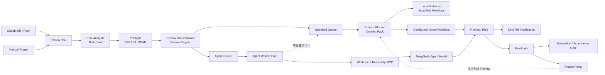

# AI Review Command Center Design Proposal

设计基准：当前 Python/FastAPI、React、MySQL、Standard Scheduler、Agent Worker、Context Pack 和质量治理实现。
本方案只定义首页，不假设持久化 Code Graph、自动二次复评、实时 Provider 健康检查或尚未实现的通知通道。

## 一、页面目标

AI Review Command Center 不应是“任务列表加几张统计卡片”，而应成为平台的实时运行控制面，回答五个问题：

1. 现在是否有 Review 正在进入、排队或执行？
2. 每个任务当前停在哪个阶段？
3. Standard、Agent、Worker、Provider 是否在正常工作，是否发生降级？
4. 最近产生了什么风险、上下文质量和通知结果？
5. 人工反馈和评估样本是否正在形成质量闭环？

首页以“运行态”为主，任务列表、Diff、Finding 全文、配置和质量深度分析仍留在现有专用页面。

------

## 二、核心信息架构

### 2.1 对原始分层的调整

题目提出的“入口—调度—执行—智能—结果—治理”总体合理，但不完全符合真实顺序。

建议调整为：

1. **入口层 Intake**
2. **规则与决策层 Rule & Decision**
3. **调度层 Orchestration**
4. **证据与执行层 Evidence & Execution**
5. **结果与交付层 Result & Delivery**
6. **治理回路 Governance Loop**

主要原因：

- Rule Analysis 实际发生在 AI Scheduler 之前。
- Preflight 是 Standard 和 Agent 的共同前置阶段。
- Context Planner/Retriever 主要服务 Standard Context Pack。
- Agent 使用独立 Worker、Worktree 和只读 MCP 取证，不能画成与 Standard 完全相同的 Context 路径。
- Model Provider 是执行依赖，不应成为独立于执行链路的抽象“智能层”。
- Feedback 发生在结果和通知之后，是回流到未来 Review 的治理闭环。

### 2.2 首页总体结构

```text
┌──────────────────────────────────────────────────────────────────────┐
│ System Pulse：数据新鲜度 / 活跃任务 / 队列 / Worker / 24h 异常      │
├──────────────────────────────────────────────────────┬───────────────┤
│                                                      │ Live Ops      │
│              Review Execution Map                    │               │
│                                                      │ 活跃任务      │
│  Intake → Rule → Task Core → Standard / Agent        │ Fallback      │
│                           → Finding → Notification    │ 失败与告警    │
│                                                      │ 最近事件      │
├──────────────────────────────────────────────────────┴───────────────┤
│ Governance Loop：Feedback / Context Missing / Evaluation / Policy   │
└──────────────────────────────────────────────────────────────────────┘
```

不采用整齐排列的 KPI 卡片墙。顶部是紧凑的仪表条，中间由运行拓扑主导，右侧只保留可操作异常和活跃流，治理数据作为底部回路存在。

### 2.3 生命周期拓扑



### 2.4 页面区域定义

#### A. System Pulse

顶部固定为一条紧凑运行仪表，不使用大尺寸统计卡：

- 数据更新时间和是否过期
- API 可访问状态
- 当前活跃 Task 数
- Scheduler 活跃 Job 数
- Agent Worker：在线/总数、Busy/Draining
- 最近 24 小时 AI Job 失败数
- 当前最高风险
- 未处理 Feedback 数

其中“API UP”只能代表 API 响应正常；Provider 不应直接显示为 `Healthy`，因为当前没有持久化、周期性的 Provider 健康检查。

#### B. Review Execution Map

首页主视觉，占桌面宽度约 70%。

展示：

- 最近进入的 GitLab/Manual 任务
- Rule Analysis 与风险卡完成情况
- ReviewTask 向多个 `reviewKey` 分裂
- Standard 与 Agent 两条执行支路
- Agent 到 Standard 的 fallback
- Context、Provider、Finding 和 Notification 流向

默认是全局聚合态；选择某个任务后切换为该任务的真实执行路径，并通过现有任务详情、Results、Progress、Notifications 接口补充数据。

#### C. Live Operations Rail

右侧窄栏，不做完整任务列表，只展示：

- 当前排队和运行中的 Review Flow
- 最近失败、超时、取消、Fallback
- Worker Offline / Draining
- Notification Failed
- Critical Finding 产生事件
- 数据拉取异常

每项只显示项目、任务、reviewKey/执行引擎、当前阶段和持续时间。点击进入现有任务详情或对应治理页面。

#### D. Risk & Delivery Horizon

位于主图结果侧，而不是独立统计区域：

- Finding 严重度：Critical / Major / Minor
- 上下文状态：Sufficient / Partial / Insufficient
- 当前存在高风险 Finding 的任务数
- Notification 成功/失败/跳过
- 最近一次 Critical Finding 和通知失败

#### E. Governance Loop

底部是低刷新频率的质量闭环：

- Pending Feedback
- Policy Candidate
- Context Missing 反馈
- Evaluation 样本数量
- False Positive / Missing Finding
- Rule Gap Attribution
- Acceptance Gate 状态
- Agent 30 条标注样本门禁进度

治理层不应使用流动粒子表达，因为它不是实时执行链路，而是人工治理积累。

------

## 三、粒子化视觉设计

## 3.1 中央视觉核心

建议中心命名为：

**Review Execution Core**

不建议使用纯装饰性的“AI 大脑”。当前平台真正的核心是 ReviewTask 编排、证据获取和双引擎执行，而不是单一模型。

中心核心有两种模式：

### 全局模式

中心显示当前运行负载：

- 中心数字：活跃 Review Flow 数，不是 Task 总数
- 外环：Queued / Running / Fallback / Failed 分段
- 上半区：Standard 活跃度
- 下半区：Agent 活跃度
- 中央小核：ReviewTask 数

一个 Task 可以配置多个模型，因此进入中心的是一个 Task 粒子，离开中心时可能拆分成多个 `reviewKey` 粒子。

### 任务聚焦模式

选择一个 Task 后，中心显示：

- Task ID、项目、触发来源
- 规则风险等级
- 当前执行分支
- 多模型 ReviewTarget
- 当前 Progress 阶段
- 执行耗时
- Finding 数量和最高风险

## 3.2 周围节点布局

采用“左进右出、上下分支、下方回流”的空间结构：

- 左侧：GitLab Event、Manual Trigger
- 左中：Rule Analysis、Risk Card
- 中央：ReviewTask / Preflight / Orchestration
- 右上：Standard Queue → Context Planner → Retriever → Provider
- 右下：Agent Queue → Worker Pool → Worktree/MCP → DeepSeek
- 最右：Finding → Notification
- 底部：Feedback → Evaluation → Policy → 回流 Context

这种布局比纯圆形星图更容易看懂真实执行顺序，也能准确表达 Standard 和 Agent 的不同实现。

## 3.3 粒子语义

| 对象             | 粒子形态               | 行为                                                       |
| ---------------- | ---------------------- | ---------------------------------------------------------- |
| GitLab Event     | 小型菱形脉冲           | 从 GitLab 入口射入；高频时按时间窗口聚合                   |
| Manual Trigger   | 带描边圆点             | 从独立入口进入，避免与 Webhook 混淆                        |
| ReviewTask       | 较大的空心核心粒子     | 进入 Rule 和 Task Core；多模型时发生分裂                   |
| Standard Job     | 蓝紫色短尾粒子         | 沿 Standard Queue 进入 Context 和 Provider                 |
| Agent Job        | 双环或三角核心粒子     | 沿 Agent Queue 等待 Worker Claim                           |
| Context Evidence | 细小点阵或片段轨迹     | Retriever 返回时汇入 Context Pack，不代表持久化 Code Graph |
| Model Call       | 向 Provider 发出的波包 | 请求期间保留连接；响应后返回核心                           |
| Finding          | 有形状区分的风险碎片   | Critical/ Major/Minor 使用不同形状与标签                   |
| Notification     | 单向输出波纹           | 成功到达 DingTalk；失败停留在输出节点                      |
| Feedback         | 缓慢回流的小粒子       | 从 Finding 回流到治理层和 Policy                           |

颜色不能是唯一语义。风险和状态必须同时通过形状、图标、文字和轨迹表达。

## 3.4 状态动画

| 状态                  | 动画表现                                                |
| --------------------- | ------------------------------------------------------- |
| `RUNNING`             | 节点缓慢呼吸，连线上有方向性流动                        |
| `QUEUED`              | 粒子停留在轨道上缓慢公转，不向下一节点移动              |
| `FAILED`              | 一次性红色收缩波纹，然后保持静态错误标识                |
| `FALLBACK`            | Agent 路径中断，琥珀色粒子沿弧线重定向至 Standard Queue |
| `AGENT_ANALYZING`     | Worker 周围出现证据轨道                                 |
| `AGENT_TOOL_ACTIVITY` | Worker 与 Worktree/MCP 节点之间产生短距离往返           |
| `AGENT_CONVERGING`    | 外部证据轨道逐渐收束至 Agent 核心                       |
| `AGENT_SUBMITTING`    | 单个粒子从 Agent 核心发送至 Finding 节点                |
| Provider Request      | 请求波包停留在 Provider 节点，直到响应或失败            |
| `SUCCESS`             | 一次性亮度收束，不继续循环                              |
| Worker Offline        | 静止、低亮度、断开连接                                  |
| `DRAINING`            | 不再接受新粒子，当前粒子继续完成                        |
| Context Partial       | Context 光环存在缺口                                    |
| Context Insufficient  | 光环更稀疏，并显示明确文本                              |

限制：

- 没有真实活动时不播放伪造的数据流。
- 不使用持续红色闪烁。
- 页面隐藏时暂停 Canvas。
- 支持 `prefers-reduced-motion`。
- 移动端改为静态生命周期列表，不强行压缩复杂 Canvas。

------

## 四、首页展示对象

### 4.1 需要近实时展示

建议按刷新频率区分，而不是所有数据统一轮询。

#### 5 秒级：运行链路

- 活跃 ReviewTask
- 活跃 `reviewKey` / ReviewResult
- Scheduler Job：Queued / Running
- 当前 Review 阶段
- Standard / Agent 执行分支
- Agent Fallback
- 最新失败和取消
- 当前最高 Finding 风险
- 数据更新时间

#### 10～15 秒级：资源状态

- Agent Worker Pool
- Worker ID、状态、Heartbeat、Active Job
- Agent Queue：Queued、Running、Oldest Queued、Expired Lease
- Provider 当前正在处理的调用数
- Provider 最近成功/失败观察状态
- API 可达状态

#### 30～60 秒级：结果和治理

- Finding 严重度分布
- Context Status 分布
- Preflight 成功/失败
- Notification 成功/失败/跳过
- Pending Feedback
- Evaluation 样本和质量指标
- Acceptance Gate
- Agent 样本门禁进度

### 4.2 不应放在首页

以下对象应保留在详情页、设置页或治理页：

- 原始 Diff 和源码全文
- Finding 完整正文、Evidence 全文和修复 Patch
- 原始 Provider 响应
- Prompt 全文和 Profile 编辑
- API Key、Webhook URL、Token
- 所有 ProgressEvent Debug 明细
- 全部 Evaluation Case 列表
- 全部 Project Policy 内容
- Rule Template 编辑
- Worker 预算配置
- Provider Test 操作
- Finding 补证据和 Fix Preview 操作
- 伪造的“全局 Code Graph”
- 未实际采集的 Token 成本、模型推理状态或准确率

首页展示摘要和异常，点击后进入已有专用页面。

------

## 五、当前数据支持情况

| 对象                      | 当前支持                                                     | 可直接展示                                                   | 缺口                                                       |
| ------------------------- | ------------------------------------------------------------ | ------------------------------------------------------------ | ---------------------------------------------------------- |
| `ReviewTask`              | ✅ [任务列表 API (line 44)](D:/projects/ai-code-review-platform/backend-python/app/review_record/api.py:44) | 最近任务、触发类型、项目、风险、状态、Finding 数             | 缺少时间窗口聚合和统一当前阶段                             |
| `CodeQualitySchedulerJob` | ✅ [Job Queue API (line 49)](D:/projects/ai-code-review-platform/backend-python/app/code_quality/api.py:49) | Active Count、任务分组、Review/Fix Job、状态和时间           | 缺少按 JobType/状态汇总、Standard 最老等待时间             |
| `CodeQualityReviewResult` | 🟡                                                            | 单任务多模型结果、Provider、Engine、Finding、耗时            | 缺少跨任务实时聚合接口                                     |
| `ProgressEvent`           | 🟡 [Progress API (line 81)](D:/projects/ai-code-review-platform/backend-python/app/review_record/api.py:81) | 选中任务的真实执行阶段                                       | 只能按 taskId/reviewKey 查询，无法直接形成全局阶段流       |
| `AgentReviewRun`          | 🟡                                                            | Agent Observation 可提供可靠性、Fallback、耗时、Turns、Tool Calls | 没有通用的活跃 Agent Run 公共列表                          |
| Worker                    | ✅ [Agent Settings API (line 28)](D:/projects/ai-code-review-platform/backend-python/app/code_quality/api.py:28) | Worker Pool、节点、在线、Busy、Draining、Heartbeat、QueueMetrics | 已足够支撑 MVP                                             |
| Finding                   | 🟡                                                            | 单任务 Finding JSON；Agent Observation 和质量看板有部分聚合  | 缺少全量近期 severity/contextStatus 聚合                   |
| Rule Analysis             | 🟡                                                            | Task 列表有 riskLevel/focusIndicators，详情有 Risk Card      | 缺少 Rule 阶段耗时和全局规则结果聚合                       |
| Preflight                 | 🟡                                                            | 单任务 Deterministic Checks                                  | 缺少近期运行状态聚合                                       |
| Context                   | 🟡                                                            | Progress 中有 Context Pack、Local Repo、Retriever 摘要；Finding 有 contextStatus | 缺少首页级 Context Quality 汇总                            |
| Provider                  | 🟡 [Provider API (line 131)](D:/projects/ai-code-review-platform/backend-python/app/code_quality/api.py:131) | 配置、启用、默认、模型、API Key 是否配置                     | 没有持续健康检查和持久化 Last Test；不能直接显示 `UP/DOWN` |
| `NotificationRecord`      | 🟡 [任务通知 API (line 66)](D:/projects/ai-code-review-platform/backend-python/app/review_record/api.py:66) | 选中任务的通知结果                                           | 缺少全局成功/失败/跳过聚合                                 |
| Feedback                  | 🟡 [Feedback Pool API (line 31)](D:/projects/ai-code-review-platform/backend-python/app/review_feedback/api.py:31) | 可按状态查询并得到分页总数                                   | 首页多次查询会低效，建议聚合                               |
| Evaluation                | ✅ [质量看板 API (line 16)](D:/projects/ai-code-review-platform/backend-python/app/review_quality/api.py:16) | 样本、误判、上下文不足、回放、规则缺口和门禁摘要             | 属于治理快照，不应当作实时执行数据                         |
| Agent Observation         | ✅ [Agent Observation API (line 37)](D:/projects/ai-code-review-platform/backend-python/app/review_quality/api.py:37) | Standard/Agent 样本、Fallback、可靠性和 30 条样本门禁        | 面向质量观察，不替代实时 Agent Queue                       |
| 系统健康                  | 🟡 [Health API (line 99)](D:/projects/ai-code-review-platform/backend-python/app/main.py:99) | API 可访问和时间                                             | 不检查 DB、Provider、GitLab、DingTalk                      |

### 5.1 可以直接复用的接口

- `GET /api/health`
- `GET /api/review-tasks`
- `GET /api/code-quality-reviews/job-queue`
- `GET /api/code-quality-reviews/failure-notifications`
- `GET /api/code-quality-reviews/agent-settings`
- `GET /api/code-quality-review-providers`
- `GET /api/review-quality/dashboard`
- `GET /api/review-quality/agent-observation`
- `GET /api/risk-feedback`
- 选中任务后复用现有 detail/results/progress/checks/notifications 接口

### 5.2 建议新增的只读聚合接口

不建议首页为每一个 Task 并发调用详情、Progress、Result 和 Notification。建议增加两个只读接口。

#### `GET /api/command-center/runtime`

5 秒轮询，返回轻量运行快照：

```
{
  "generatedAt": "...",
  "freshness": "FRESH",
  "intake": {},
  "activeTasks": [],
  "activeFlows": [],
  "scheduler": {},
  "standard": {},
  "agent": {
    "workerPool": {},
    "queueMetrics": {}
  },
  "providersObserved": [],
  "alerts": []
}
```

其中 `activeFlows` 应以 `(taskId, reviewKey)` 为粒度，因为一个 Task 可以同时运行多个模型。

Provider 状态只能使用：

- `CONFIGURED`
- `DISABLED`
- `ACTIVE`
- `RECENT_SUCCESS`
- `RECENT_FAILURE`
- `NO_RECENT_DATA`

不能虚构为真实 `HEALTHY/UNHEALTHY`。

#### `GET /api/command-center/governance`

30～60 秒轮询：

```
{
  "window": "24h",
  "ruleAnalysis": {},
  "preflight": {},
  "contextQuality": {},
  "findingRisk": {},
  "notifications": {},
  "feedback": {},
  "evaluation": {},
  "policies": {}
}
```

第一阶段不需要新增数据库表。数据可以从现有 Task、Result、Progress、Job、AgentRun、Notification、Feedback 和 Evaluation 表聚合。数据量扩大后，再根据真实查询计划决定索引。

------

## 六、前端实现建议

### 6.1 页面与组件边界

当前首页 [HomePage (line 11782)](D:/projects/ai-code-review-platform/frontend/src/App.jsx:11782) 直接返回 `TaskListPage`。实施时建议：

- `/`：新的 `CommandCenterPage`
- `/tasks`：保留完整任务列表
- `/tasks/:taskId`：保留现有任务详情

不要继续把大量实现直接堆入 `App.jsx`，建议独立为：

```
frontend/src/command-center/
  CommandCenterPage.jsx
  CommandCenterCanvas.jsx
  CommandCenterPulseBar.jsx
  LiveOperationsRail.jsx
  GovernanceLoop.jsx
  commandCenterApi.js
  commandCenterModel.js
  commandCenterPresentation.js
```

### 6.2 Canvas 与 DOM 分工

现有运行中任务已经具备 Canvas 基础：

- [ReviewImmersiveCanvas.jsx](D:/projects/ai-code-review-platform/frontend/src/ReviewImmersiveCanvas.jsx)
- [reviewCanvasRenderer.js](D:/projects/ai-code-review-platform/frontend/src/reviewCanvasRenderer.js)

建议复用底层粒子、帧率控制、降级和 reduced-motion 思路，但新建 `CommandCenterCanvas`，不要把任务详情 Canvas 直接复制到首页。

职责划分：

- Canvas：粒子、路径、光环、流向和状态过渡
- React/MUI DOM：文字、数字、节点标签、工具提示、筛选、无障碍和点击区域
- 页面壳：继续使用 MUI
- 不新增一套与现有壳冲突的 UI 框架

### 6.3 交互

- 点击 Task 粒子：聚焦该 Task，展示多 Review 分支。
- 点击 Standard/Agent 分支：过滤右侧运行流。
- 点击 Provider：展示配置状态和最近观测结果，不展示密钥。
- 点击 Finding 节点：进入现有任务详情 Finding 区域。
- 点击 Feedback/Evaluation：进入现有治理页面。
- 允许顶部发起现有 Manual Review。
- Cancel、Retry、Provider Test 等高影响操作保留在已有队列、详情和设置页面。

### 6.4 刷新策略

第一阶段继续轮询，不引入当前不存在的 WebSocket/SSE：

- Runtime Snapshot：5 秒
- Worker/Provider：10～15 秒，或合并在 Runtime Snapshot
- Governance Snapshot：60 秒
- 页面隐藏时停止
- 恢复页面时立即刷新
- 接口失败时保留最后成功快照，并明确显示数据已过期

### 6.5 性能与响应式

- Canvas 中不无限创建粒子；高流量用聚合粒子表达数量。
- 建议只对最近 12～20 个活跃 Flow 进行独立动画。
- 1440px：完整拓扑 + 右侧 Live Ops。
- 1024px：右侧栏收窄，治理区折叠为横向摘要。
- 小屏：改为按生命周期排列的静态状态列表，不运行完整粒子拓扑。
- Canvas 初始化失败时回退为可点击的 DOM 生命周期图。

------

## 七、第一阶段 MVP

### 7.1 必须实现

1. 将 `/` 从任务列表切换为 Command Center。
2. 保留 `/tasks` 作为完整任务列表。
3. 实现顶部 System Pulse。
4. 实现真实生命周期拓扑：
   - GitLab/Manual
   - Rule Analysis
   - Preflight
   - Standard Queue/Review
   - Agent Queue/Worker/Fallback
   - Context/Provider
   - Finding/Notification
5. 实现活跃 Task/Review Flow 展示。
6. 实现 Queued、Running、Failed、Fallback、Agent Thinking 动画。
7. 展示 Worker Pool 和 Agent QueueMetrics。
8. 展示近期 Finding 风险和 Context Status。
9. 展示 Notification 状态。
10. 展示轻量 Governance Loop。
11. 新增只读首页聚合接口，避免前端 N+1 拉取。
12. 点击后导航到现有任务、队列、质量治理和设置页面。
13. 支持 reduced-motion、页面隐藏暂停和 Canvas 失败降级。

### 7.2 MVP 明确不做

- 不构建持久化 Code Graph。
- 不新增自动二次模型复评。
- 不显示未经采集的 Provider 实时健康。
- 不显示虚构的准确率、成本或 Token 数据。
- 不把 Evaluation 当实时运行数据。
- 不在首页展示 Diff、源码、Prompt、Evidence 全文。
- 不在首页直接应用修复或创建 MR。
- 不引入 WebSocket/SSE。
- 不改变现有 Review 调度、Agent、通知或治理业务逻辑。
- 不重新设计任务详情页。

### 7.3 MVP 验收标准

- 用户在 10 秒内能判断系统是否有任务运行、是否排队、Worker 是否可用。
- 能看出一个 Task 被拆分成多个 Standard/Agent Review Flow。
- Agent Fallback 可以被明确识别。
- Critical Finding、Notification Failed 和 Worker Offline 不会被普通动画淹没。
- 页面不会把 Provider“已配置”误表示为“实时健康”。
- 页面中的每一个动态状态都能追溯到现有数据库对象或新增聚合接口。
- 无真实活动时不播放虚假数据流。
- 首页异常可直接进入现有详情或治理页面。