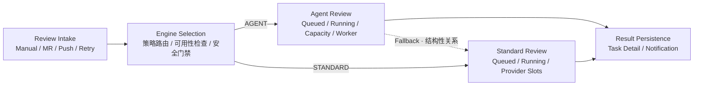

# AI Review Command Center Homepage vNext Implementation Plan

## 0. 当前执行状态

- 计划版本：`vNext / Homepage Frozen Topology`
- 基线提交：`3fc3fb9 Document current AI review flow audit`
- 当前阶段：`H5 生产验收与收口`
- 当前状态：`HOMEPAGE VNEXT COMPLETED — WAITING FOR DEPLOYMENT CONFIRMATION`
- 当前允许结果：部署、推送或开始后续交互专项前必须获得用户独立明确授权。
- 下一授权口令：部署、推送、悬浮流程、Drawer 或后续数据投影必须获得独立明确授权。
- 停止点：H5 本地提交后立即停止，等待部署确认。

> 后续专题定向（2026-08-05）：首页产品定位已调整为 `Agent Review` 主通道、`Standard Review` 降级辅助通道。新的信息层级、布局权重、视觉语义与后续实施阶段统一转至 [`52-AI Review Command Center Agent-First Homepage Plan.md`](52-AI%20Review%20Command%20Center%20Agent-First%20Homepage%20Plan.md)。本文档保留为 vNext 首页历史实施与验收记录，不重写既有 H0～H5 结论。

本文档是审计完成后的独立首页实施总控。它不修改、覆盖或续写以下历史计划的执行状态：

- `AI Review Command Center Evolution Plan v2.md`
- `AI Review Command Center Implementation Plan.md`
- `AI Review Platform Runtime Map Implementation Plan.md`

历史计划中的 `Phase` 编号已经承载既有实施记录。本计划统一使用 `H0～H5`，避免把本次首页重构误解为继续旧 Phase 4 或 Phase 5。

### 0.1 冻结视觉参考

首页冻结参考图：


仓库文件：`docs/AI Review Center Design/assets/01.png`

参考图用于固定亮色主题、五主体布局、双 Review 核心层级、紫/橙/青视觉 token 和首页信息密度，不是业务数据或接口契约。实现时的事实优先级为：

1. 当前代码、数据库字段和 Runtime v2 Schema；
2. `AI Review Command Center Current Flow Audit.md`；
3. 本计划冻结的产品与展示契约；
4. `assets/01.png` 的视觉表现。

参考图中仍可能存在生成式图片文字瑕疵，禁止照图复制：

- `STANDADD` 等错误拼写必须使用真实枚举 `STANDARD`；
- Result Persistence 的操作使用“查看 Review 任务”并进入 `/tasks`，不照抄“查看全部结果”；
- 图中数字仅是演示快照，必须绑定 Runtime，不得写死；
- 图中任何乱码、伪文字、不可识别图标和没有真实行为的入口都不得进入实现。

---

## 1. 是否具备推进条件

结论：**具备。**

推进所需的五类输入已经明确：

1. 真实流程已由 `AI Review Command Center Current Flow Audit.md` 核实。
2. 首页主拓扑已冻结为 `Review Intake → Engine Selection → Agent/Standard → Result Persistence`。
3. Agent→Standard 只显示静态结构关系，不声称 Runtime 已能无歧义追踪父子 Job。
4. V1 首页只使用 Runtime v2 当前可证明的字段，不展示历史 KPI、通过率、命中率或完整终态流。
5. 首页采用亮色平台外壳、平面科技 HUD、DOM 语义节点与 SVG/Canvas 装饰层；不采用真实 3D。

当前不存在需要阻塞计划编写的产品选择。悬浮流程和模块详情 Drawer 尚未冻结，但它们已被明确排除在 H1～H5 首页主线之外，因此不构成阻塞。

---

# 一、冻结的首页产品契约

## 1.1 主拓扑



### 固定解释

- `Review Intake` 是触发入口，不是统一持久化队列。
- Engine Selection 发生在两类 Job 入队前；不得显示“负载均衡”或统一智能调度中枢。
- Agent 和 Standard 是两个一级执行模块，Standard 不是纯 fallback 支路。
- Agent fallback 连线只表达代码结构；不播放任务级转移动画。
- Result Persistence 只表达结果落库后进入任务详情与既有通知链；不显示完成抵达动画。

## 1.2 首页允许显示的数据

### 顶部 Runtime HUD

| UI 指标 | Runtime v2 来源 | 显示规则 |
| --- | --- | --- |
| Runtime 更新时间 | `generatedAt` | 前端计算距今时间 |
| Total Queued Jobs | `scheduler.queuedJobCount` | 明确为 Job，不称唯一任务数 |
| Agent / Standard queued | 两 Lane `queuedCount` | 两者合计应与 Scheduler 对账 |
| Total Running Jobs | `scheduler.runningJobCount` | 明确为 Job |
| Agent / Standard running | 两 Lane `runningCount` | 两者合计应与 Scheduler 对账 |
| Snapshot Coverage | `coverage.truncated/sections` | 显示“未截断/部分截断”与“有界快照”，不得称完整覆盖 |
| Observed Provider / Model | `providersObserved` | 无观测时显示真实空状态 |
| Runtime Alerts | `alerts` | 明确是当前有界告警列表 |

### Agent Review 模块

- `queuedCount`
- `runningCount`
- `agent.queueMetrics.onlineCapacity`，只显示在线容量，不拼接不存在的配置总容量
- `agent.workerPool` 的 IDLE/BUSY/DRAINING/OFFLINE 观察状态
- `reviewLanes.agent.nextQueued`
- `runningItems.length / runningCount`，显示“展示 N / 共 M”

### Standard Review 模块

- `queuedCount`
- `runningCount`
- `runningCount / capacity`；当前 Provider Scheduler capacity 为 10
- `providersObserved` 或活动 Flow 已返回的 Provider/Model
- `reviewLanes.standard.nextQueued`
- `runningItems.length / runningCount`，显示“展示 N / 共 M”

### 底部当前态

- Agent `runningCount / onlineCapacity`
- Standard `runningCount / capacity`
- `agent.queueMetrics.oldestQueuedSeconds`
- 当前 `alerts` 摘要

## 1.3 首页禁止显示的数据

H1～H5 不得新增或从前端推算：

- 较昨日变化、历史折线和任何前端临时累计趋势；
- 今日完成、完整结果抵达数量；
- Overall Pass Rate；
- Platform Health 百分比；
- Agent Hit Rate；
- Fallback Rate；
- Agent 与 Standard 混合后的全局 Resource Utilization；
- 平均处理时长或吞吐趋势；
- 成功、失败、取消抵达 Result Persistence 的动画；
- fallback Standard Job 与 Agent Job 的实时父子转移动画；
- Context Planner、Retriever 或 Provider 子阶段的首页实时状态。

## 1.4 固定空态和降级态

| 状态 | 首页行为 |
| --- | --- |
| `FRESH` | 正常显示当前 Runtime 快照 |
| `STALE` | 明确显示“Runtime 已过期”，停止非必要动画 |
| `EMPTY` | 不生成模拟 Job、Worker、Provider 或任务编号 |
| Runtime 请求失败 | 保留最后一次成功快照并显示错误；没有旧快照时显示空态 |
| `coverage.truncated=true` | 显示“部分截断”，运行项和告警入口标注有界 |
| `nextQueued=null` | 显示“当前无等待 Review” |
| Agent capacity 为 0 | 显示不可用状态，不计算除零百分比 |
| 无 Provider 观测 | 显示“暂无活跃 Provider”，不默认填充 OpenAI |

## 1.5 固定导航

- 运行 Review 标记：进入 `/tasks/:taskId?reviewKey=...`。
- “查看全部运行项”：使用当前有界列表 Modal 或现有等价能力，不声称是历史全量。
- Result Persistence 的入口使用“查看 Review 任务”，进入 `/tasks`。
- 未实现独立 `/review-results` 路由前，不使用“查看全部结果”。
- Runtime Alert 有 `navigationTarget` 时使用该目标；没有时仅打开当前告警摘要。

---

# 二、视觉与技术路线

## 2.1 默认视觉

- 使用现有平台亮色主题，不切换整页 Dark Mode。
- 页面背景为白色/浅灰蓝；Agent 使用紫色，Standard 使用橙色，Result 使用青色。
- 使用平面科技 HUD、轻量 2.5D 图标、SVG 轨道和克制光效。
- 正文文字不发光；颜色不是唯一状态信息。
- 不使用生成图片作为整页背景，不把文字烘焙到图片素材中。

## 2.2 渲染边界

- DOM 负责所有文字、数值、按钮、焦点、Tooltip 和可访问语义。
- SVG 或现有 Canvas 装饰层只负责背景网格、轨道、静态连接和非语义光效。
- Canvas 必须 `aria-hidden` 且不接收 pointer event。
- 不引入 Three.js、PixiJS、React Flow 或新的动画依赖，除非后续单独证明现有 DOM/SVG/Canvas 无法满足并获得授权。
- 当前 `canvasRuntime` 的单 RAF、ResizeObserver、visibility、reduced-motion 和 dispose 治理不得退化。

## 2.3 响应式

- `≥ 1200px`：显示五主体双轨地图。
- `701～1199px`：压缩 Intake、Engine Selection 和 Result，保留 Agent/Standard 两个核心模块。
- `≤ 700px`：不挂载 Canvas；使用 Agent、Standard 两张纵向 DOM 卡片和紧凑入口说明。
- 任一宽度不得依赖横向滚动才能访问核心状态和操作。

---

# 三、实施文件边界

## 3.1 默认允许修改

- `frontend/src/command-center/CommandCenterPage.jsx`
- `frontend/src/command-center/CommandCenterCanvas.jsx`
- `frontend/src/command-center/commandCenterPresentation.js`
- `frontend/src/command-center/commandCenterModel.js`，仅当现有 Runtime 字段归一化确有缺口
- `frontend/src/command-center/platformRuntimeMapRenderer.js`，仅用于静态装饰/现有资源治理适配
- `frontend/src/command-center/commandCenter.css`
- `frontend/tests/commandCenter*.test.mjs`
- 本计划文档中的阶段状态、实施结果和验证证据

如需新增前端文件，应位于 `frontend/src/command-center/`，且只承载可复用的首页展示组件或纯函数。

## 3.2 默认禁止修改

- `backend-python/app/command_center/` Runtime v2 Schema、查询、Service 和 API；
- Review、Scheduler、Agent、Provider、Notification 状态机；
- 数据库模型、索引、迁移和业务数据；
- `frontend/src/App.jsx` 的全局路由和业务页面，除非已有 Command Center 路由无法使用；
- README；
- 三份历史 Evolution/Implementation Plan 的状态；
- 用户已有未跟踪文档和 `docs/AI Review Center Design/assets/`；
- 悬浮流程、模块详情 Drawer、历史 KPI 和新的结果列表页。

如果任一阶段发现必须修改上述禁止范围，立即停止，记录阻塞点并请求独立授权，不用视觉占位绕过真实数据缺口。

---

# 四、阶段总控

## 4.1 总控 Prompt

后续每次继续首页实施时使用以下总控约束：

```text
继续 AI Review Command Center Homepage vNext。

开始前读取：
1. 项目根目录 AGENTS.md
2. docs/AI Review Center Design/AI Review Command Center Current Flow Audit.md
3. docs/AI Review Center Design/AI Review Command Center Homepage vNext Implementation Plan.md
4. docs/AI Review Center Design/assets/01.png（仅作为视觉参考，事实语义服从前述文档和当前代码）

只执行用户本次明确授权的 H 阶段。先将本计划当前状态更新为该阶段 IN PROGRESS，再按允许文件和验收门禁实施。

不得修改 Runtime v2、数据库、Review/Scheduler/Agent/Provider 状态机、历史 Evolution/Implementation Plan 或 README；不得实现悬浮流程、模块详情 Drawer、历史 KPI、结果统计或任务级 fallback 转移动画。

完成当前阶段的专项测试、必要构建、浏览器验收和 git diff 检查后，回写实际修改、验证结果和剩余风险。只有验收通过才按本阶段约定创建本地提交；不得推送、部署或自动进入下一阶段。

当前阶段完成后必须立即停止，等待用户验证并明确回复“继续下一阶段”。
```

## 4.2 Agent 自主推进授权边界

### 可自主执行

- 读取 Runtime v2 现有 Schema、Service 和前端 Model 以核对字段；
- 修改当前 H 阶段明确列出的前端 Command Center 文件和测试；
- 运行 Command Center 专项 Node 测试、前端全量 Node 测试和生产构建；
- 复用已 ready 的前后端服务进行只读浏览器验收；
- 为本阶段验收创建工作区 `.local/` 临时日志或隔离 mock，验收后精确清理；
- 回写本计划的阶段结果。

### 必须停止并请求授权

- 需要新增或修改 Runtime 字段、查询或索引；
- 需要修改数据库、后端状态机或业务数据；
- 需要新增依赖；
- 需要新增历史聚合、结果统计或独立结果列表 API；
- 需要实现悬浮流程、详情 Drawer 或新的业务交互；
- 需要部署、推送或修改本阶段外文件；
- 发现现有未提交修改与目标文件重叠且无法安全隔离。

---

# 五、H1：Presentation 数据契约

## 5.1 目标

在不改变页面 DOM 和 Runtime v2 的前提下，先建立冻结首页所需的纯前端 Presentation View Model，消除旧“AI Review Core/统一候场门/全局利用率”等不准确展示语义。

## 5.2 允许修改

- `frontend/src/command-center/commandCenterPresentation.js`
- 必要时最小修改 `commandCenterModel.js`
- `frontend/tests/commandCenterPresentation.test.mjs`
- `frontend/tests/commandCenterModel.test.mjs`
- 本计划文档

## 5.3 必须形成的 View Model

- `hud`：freshness、generatedAt、totalQueuedJobs、totalRunningJobs、coverage、providersObserved、alerts。
- `intake`：四类固定入口展示信息，不包含队列数。
- `engineSelection`：AGENT/STANDARD 两条固定路由和自动 Agent 不可用的说明文本。
- `agentLane`：queued、running、onlineCapacity、workerSummary、nextQueued、visible/total running items。
- `standardLane`：queued、running、capacity、providers、nextQueued、visible/total running items。
- `fallback`：固定 `STRUCTURAL_ONLY`。
- `resultPersistence`：固定 `STRUCTURAL_ONLY`，导航目标 `/tasks`。
- `footer`：Agent capacity、Standard slots、oldest Agent queue、alerts。

## 5.4 验收

- v2 FRESH、STALE、EMPTY、请求失败保留旧快照、truncated、capacity=0、无 Provider、无 nextQueued 均有测试。
- queued/running 的 Scheduler 总数与 Lane 分布不一致时不静默伪造，应保留真实字段并提供 coverage/diagnostic 标识。
- 不再生成 pass rate、hit rate、fallback rate、platform health、历史趋势或混合利用率。
- 不修改 JSX、CSS、Canvas 或后端。

## 5.5 落地 Prompt

```text
执行 H1：Presentation 数据契约。

只修改 Command Center 的前端 Model/Presentation 纯函数及对应测试，建立已冻结首页的 HUD、Intake、Engine Selection、Agent Lane、Standard Lane、结构性 Fallback、Result Persistence 和 Footer View Model。

不得修改页面 JSX/CSS/Canvas、Runtime v2、后端、数据库或业务状态机；不得实现悬浮流程、Drawer、历史 KPI 或结果统计。

完成专项测试和 git diff 检查，回写 H1 实施结果。验收通过后状态更新为 H1 COMPLETED — WAITING FOR H2 CONFIRMATION，创建本地提交并立即停止。
```

## 5.6 停止点

H1 完成后不得自动进入 H2。

---

# 六、H2：静态首页结构

## 6.1 目标

使用 H1 View Model 实现亮色平面首页的一屏静态结构，不增加动态流光和模块详情交互。

## 6.2 允许修改

- `CommandCenterPage.jsx`
- `CommandCenterCanvas.jsx`
- 必要的首页展示子组件
- `commandCenter.css`
- Command Center 信息架构/Presentation 测试
- 本计划文档

## 6.3 实施范围

- 顶部六项 Runtime HUD；
- Review Intake；
- Engine Selection；
- Agent Review 核心模块；
- Standard Review 核心模块；
- 单条结构性 fallback 虚线；
- Result Persistence；
- 底部四项当前态；
- 真实空态、STALE、ERROR 和 truncated 文案。

本阶段所有连接使用静态 SVG/CSS。Canvas 可关闭或仅保留不影响语义的静态背景；不得播放业务粒子或状态转移动画。

## 6.4 验收

- 1440×900 初始视口可看到五主体、双 Lane、结果终点和底部当前态。
- 不出现统一 Task Queue、AI Review Core、负载均衡、历史 KPI 或结果统计。
- 所有文字由 DOM 渲染，Canvas 失败不影响信息读取。
- 主文字和次级文字达到 WCAG AA；键盘焦点可见。
- 本阶段的“悬浮查看流程/点击查看详情”如果尚无交互，必须隐藏或显示为非交互说明，不放置无行为按钮。

## 6.5 落地 Prompt

```text
执行 H2：静态首页结构。

基于 H1 Presentation 实现冻结的亮色五主体双轨首页。使用 DOM 负责全部语义、SVG/CSS 负责静态连接；不实现悬浮流程、Drawer、动态流光、任务转移或结果抵达动画。

完成 Command Center 专项测试、前端生产构建、1440×900 静态浏览器检查和 git diff 检查，回写结果。验收通过后状态更新为 H2 COMPLETED — WAITING FOR H3 CONFIRMATION，创建本地提交并立即停止。
```

## 6.6 停止点

H2 完成后等待用户确认页面结构、信息密度和亮色主题，不自动进入 H3。

---

# 七、H3：既有 Runtime 交互接线

## 7.1 目标

只接通冻结首页已经定义且有现有路由/数据支持的操作，不设计悬浮流程或模块 Drawer。

## 7.2 允许交互

- 手动刷新 Runtime；
- 运行 Review 标记进入 `/tasks/:taskId?reviewKey=...`；
- 运行项溢出列表复用现有 Modal；
- Result Persistence 的“查看 Review 任务”进入 `/tasks`；
- 告警存在 `navigationTarget` 时跳转；
- 键盘 Enter/Space 与点击行为一致；
- Modal 关闭后恢复触发器焦点。

## 7.3 明确不做

- 悬浮执行链；
- 模块详情 Drawer；
- nextQueued 的修改优先级/取消/重试；
- fallback 连线点击与任务级追踪；
- 新结果列表页；
- 后端写操作。

## 7.4 验收

- 所有可见按钮都有真实行为；无空按钮和假入口。
- bounded/truncated 提示在溢出列表可见。
- 页面离开后请求、Timer、Observer 和 Listener 正确清理。
- 不新增重复 Runtime 轮询。

## 7.5 落地 Prompt

```text
执行 H3：既有 Runtime 交互接线。

只实现刷新、运行 Review 跳转、现有溢出 Modal、告警导航和 Result Persistence 到 /tasks 的既有路由。不得实现悬浮流程、模块 Drawer、新结果列表、写操作或 fallback 任务追踪。

完成专项测试、前端全量 Node 测试、生产构建、键盘/焦点浏览器验收和 git diff 检查，回写结果。验收通过后状态更新为 H3 COMPLETED — WAITING FOR H4 CONFIRMATION，创建本地提交并立即停止。
```

## 7.6 停止点

H3 完成后等待用户确认基础交互，不自动进入 H4。

---

# 八、H4：视觉强化与响应式

## 8.1 目标

在结构和交互已确认后增加生产级视觉完成度，但不扩展业务语义。

## 8.2 允许增强

- 亮色科技网格和轻量 2.5D 图标；
- Agent 紫、Standard 橙、Result 青的静态双层描边；
- SVG 轨道的低速装饰流光；
- 当前运行模块的克制呼吸效果；
- 告警状态短周期视觉强调；
- 三档响应式布局；
- reduced-motion、Canvas 失败和小屏 DOM fallback。

## 8.3 禁止增强

- 任务级 fallback 转移动画；
- Result 成功抵达动画；
- 本地定时器模拟业务阶段；
- 根据 active item 消失推断成功；
- 真 3D、WebGL 场景、粒子爆炸或持续高耗动画；
- 悬浮流程和模块 Drawer。

## 8.4 性能门禁

- 页面只允许一个受控 RAF owner；无动效时 RAF 停止。
- hidden、STALE、reduced-motion、小屏和 Canvas 失败时停止动画。
- 1440×900、1024×800、390×844 无横向溢出。
- 连续刷新不累积 Canvas、RAF、Observer 或 Listener。

## 8.5 落地 Prompt

```text
执行 H4：视觉强化与响应式。

保持 H2/H3 结构和交互不变，只增加亮色科技 HUD、紫/橙/青轨道、克制装饰流光、响应式和 reduced-motion。不得新增业务状态、悬浮流程、Drawer、fallback 转移动画或 Result 抵达动画。

完成三档视口、reduced-motion、STALE/ERROR/Canvas fallback、资源治理、前端测试和生产构建验收，回写结果。验收通过后状态更新为 H4 COMPLETED — WAITING FOR H5 CONFIRMATION，创建本地提交并立即停止。
```

## 8.6 停止点

H4 完成后等待用户确认视觉强度，不自动进入 H5。

---

# 九、H5：生产验收与收口

## 9.1 目标

不再增加功能，只验证冻结首页能在真实数据、异常数据和常用视口下稳定工作。

## 9.2 验收矩阵

### 数据

- Agent/Standard 均为空；
- 仅 Standard 排队/运行；
- Agent Worker 在线、忙碌、DRAINING、OFFLINE；
- nextQueued 为空；
- Provider 无观测/多 Provider；
- runningItems 截断；
- coverage truncated；
- Runtime FRESH/STALE/EMPTY/ERROR；
- Agent capacity=0；
- 当前告警存在/不存在。

### 交互与可访问性

- 全键盘访问和焦点返回；
- 任务路由与 reviewKey 编码；
- 运行项 Modal；
- 告警导航；
- 屏幕阅读器名称；
- reduced-motion。

### 性能与生命周期

- 60 秒以上刷新观察；
- 单 RAF/Observer/Listener；
- 页面 hidden/visible 自动化覆盖；
- 卸载后无请求回写；
- 控制台无错误；
- 主页面无横向溢出。

## 9.3 验证命令

按影响范围至少执行：

```text
node --test frontend/tests/commandCenterApi.test.mjs frontend/tests/commandCenterModel.test.mjs frontend/tests/commandCenterPresentation.test.mjs frontend/tests/commandCenterInformationArchitecture.test.mjs
scripts/run-frontend.cmd build
git diff --check
```

若阶段新增了 Command Center 专项测试文件，应纳入同一 Node test 命令。只有脚本缺少能力或失败时才进入 `frontend/` 执行底层命令，并记录原因。

## 9.4 落地 Prompt

```text
执行 H5：生产验收与收口。

不得增加新功能。只针对真实数据矩阵、三档视口、键盘、reduced-motion、Runtime 异常、资源生命周期和构建结果进行验收；只修复验收发现的 H1～H4 范围内缺陷。

完成专项/全量前端测试、生产构建、浏览器验收和 git diff 检查后，回写完整证据与剩余风险。全部通过时状态更新为 HOMEPAGE VNEXT COMPLETED — WAITING FOR DEPLOYMENT CONFIRMATION，创建本地提交并立即停止。不得部署或推送。
```

## 9.5 停止点

H5 完成后不自动部署、不推送、不开始悬浮流程或后续数据投影。

---

# 十、后续独立专项（当前不排期）

以下能力不属于 H1～H5。每项都必须先补独立设计、数据来源、交互参考和用户授权：

1. Agent/Standard 悬浮流程预览；
2. 模块详情 Drawer 或移动端 Bottom Sheet；
3. 今日成功结果、执行成功率、P50/P95 时长、小时吞吐等历史只读聚合；
4. 独立 Review Results 列表页；
5. Runtime P0 fallback Lane 投影修复和 Agent→Standard 父子 Job 关联；
6. 具备完整终态 feed 后的 Result Persistence 动态；
7. 暗色运营大屏或全局主题切换。

后续专项不得通过前端当前快照推算历史数据，也不得为匹配愿景图修改业务状态机语义。

---

# 十一、阶段实施记录

## 11.1 H0 完成结论

- 首页主拓扑：已冻结。
- V1 数据范围：已冻结。
- 空态、过期、截断和错误边界：已冻结。
- 技术路线：DOM + SVG/现有 Canvas 装饰层，已冻结。
- 悬浮流程与 Drawer：明确延期，不阻塞首页。
- 下一阶段：`H1 Presentation 数据契约`。

H0 完成时状态：

```text
H0 COMPLETED — WAITING FOR H1 CONFIRMATION
```

## 11.2 H1 实施结果

H1 已完成以下纯前端 Presentation 数据契约：

- `hud`：保留 Runtime freshness、generatedAt、Scheduler queued/running Job 总数、coverage、Provider 观测、alerts 和请求错误状态；
- `intake`：固定 Manual、Merge Request、Push、Retry 四类入口，不混入队列统计；
- `engineSelection`：固定 AGENT、STANDARD 两条路由，并说明自动 Agent 不可用时可按策略直接进入 Standard；
- `agentLane`：queued、running、onlineCapacity、Worker 摘要、下一候选和有界 running items；
- `standardLane`：queued、running、Provider capacity、Provider/Model 观测、下一候选和有界 running items；
- `fallback` 与 `resultPersistence`：均固定为 `STRUCTURAL_ONLY`，Result 导航目标固定为 `/tasks`；
- `footer`：Agent capacity、Standard slots、Agent 最老排队时长和当前有界 alerts；
- Scheduler 总数与两条 Lane 合计不一致时保留两边真实数值，并输出 queued/running reconciliation diagnostics；
- FRESH、STALE、EMPTY、错误保留旧快照、truncated、capacity=0、无 Provider 和无 nextQueued 均已形成测试。

本阶段实际修改：

- `frontend/src/command-center/commandCenterPresentation.js`
- `frontend/tests/commandCenterPresentation.test.mjs`
- 本计划文档
- `docs/AI Review Center Design/assets/01.png` 作为本计划冻结视觉参考一并纳入版本控制

`commandCenterModel.js` 的现有 Runtime v2 归一化字段已足够，未做无必要修改。H1 按约束未修改 JSX、CSS、Canvas、Runtime v2、后端、数据库或业务状态机。为保证分阶段提交后现有页面不崩溃，Presentation 暂时保留带 `H1_LEGACY_RENDERER` 标记的旧 Canvas 兼容投影；新首页 DOM 不依赖该投影，H2 切换页面结构时处理兼容层退出。

验证结果：

```text
node --test tests/commandCenterPresentation.test.mjs tests/commandCenterModel.test.mjs tests/commandCenterInformationArchitecture.test.mjs
22 passed, 0 failed

git diff --check
passed（仅提示 Git 将按工作区配置转换 LF/CRLF）
```

H1 是纯 View Model 阶段，没有 DOM、样式或运行服务变更，因此未执行生产构建和浏览器验收；这些门禁从 H2 静态首页结构开始执行。

## 11.3 H2 实施结果

H2 已基于 H1 View Model 完成冻结首页的亮色静态结构：

- 顶部六项 Runtime HUD：更新时间、queued Jobs、running Jobs、coverage、Provider/Model 观测和 alerts；
- 桌面五主体双轨拓扑：Review Intake、Engine Selection、Agent Review、Standard Review、Result Persistence；
- Agent 与 Standard 作为两个一级核心模块，Standard 保留 Engine Selection 独立入口；
- Agent→Standard 仅保留一条 `STRUCTURAL_ONLY` fallback 虚线和说明，不表达任务级转移动画；
- Result Persistence 仅表达结果落库、任务详情和既有通知链，不展示完成量或终态抵达；
- 底部四项当前态：Agent capacity、Standard Provider slots、最老 Agent 排队时长和 Runtime alerts；
- FRESH、STALE、EMPTY、ERROR、truncated、无 Provider、无 nextQueued 和容量为零均使用真实文案；
- `≤700px` 静态降级为 Agent/Standard 两张纵向核心卡片，不挂载复杂地图。

H2 关闭旧业务动画 Canvas。所有语义、文字和数字均由 DOM 渲染；背景网格和连线仅由 `aria-hidden`、无 pointer event 的静态 SVG/CSS 承载。页面未放置刷新、Review 跳转、Modal、告警导航、Result 导航或悬浮/详情按钮，避免在 H3 接线前出现无行为入口。

本阶段实际修改：

- `frontend/src/command-center/CommandCenterPage.jsx`
- `frontend/src/command-center/CommandCenterCanvas.jsx`
- `frontend/src/command-center/commandCenter.css`
- `frontend/tests/commandCenterInformationArchitecture.test.mjs`
- 本计划文档

验证结果：

```text
node --test tests/commandCenterPresentation.test.mjs tests/commandCenterModel.test.mjs tests/commandCenterInformationArchitecture.test.mjs
22 passed, 0 failed

.\scripts\run-frontend.cmd build
passed；Vite 仅保留既有的大 chunk 提示

1440×900 应用内浏览器验收
- viewport：1440×900
- document：1440×900，无横向或纵向滚动溢出
- HUD、Review Intake、Engine Selection、Agent、Standard、Result 和 Footer 全部位于首屏
- Command Center 内：0 个 button、0 个 canvas、1 个静态 svg
- 浏览器 console：0 warnings / 0 errors
```

浏览器验收复用了已运行后端和仓库脚本启动的独立 Vite 5174 实例；验收完成后只停止本次记录的 5174 owner/launcher，未影响此前存在的 5173 服务。

当前状态：

```text
H2 COMPLETED — WAITING FOR H3 CONFIRMATION
```

本计划到此停止。未经用户明确回复“继续 H3”，不得接入刷新、任务跳转、Modal、告警导航或 Result 导航。

## 11.4 H3 实施结果

H3 已在冻结首页结构上接通现有 Runtime 支持的只读交互：

- 顶部“刷新 Runtime”复用 `useCommandCenterRuntimeSnapshot().reload`，请求进行中禁用按钮，不新增第二套轮询；
- 运行 Review 标记使用 Presentation 生成的安全内部地址 `/tasks/:taskId?reviewKey=...`，缺少正整数 taskId 时不渲染为可点击入口；
- Agent/Standard 运行项超出首页四项或 Runtime 标记截断时，可打开现有 Ant Design Modal；Modal 始终说明列表来自有界 Runtime 快照，并展示已载入/总数及 truncated 状态；
- Result Persistence 的“查看 Review 任务”进入既有 `/tasks` 路由；
- HUD 选择首个带 `navigationTarget` 的当前告警作为可点击告警入口，不带安全内部目标时保持只读卡片；
- 所有交互入口均使用原生 `button`，浏览器默认提供 Enter/Space 等价激活；没有新增手写键盘 Listener；
- Modal 关闭后优先恢复溢出触发器焦点；若轮询导致触发器消失，则回退到刷新按钮；
- 页面仍只使用原有 Runtime hook 的 AbortController、单 Timeout 和 visibility/focus lifecycle，未新增轮询、Observer 或全局 Listener。

本阶段实际修改：

- `frontend/src/command-center/CommandCenterPage.jsx`
- `frontend/src/command-center/CommandCenterCanvas.jsx`
- `frontend/src/command-center/commandCenterInteractions.js`
- `frontend/src/command-center/commandCenterPresentation.js`
- `frontend/src/command-center/commandCenter.css`
- `frontend/tests/commandCenterInformationArchitecture.test.mjs`
- `frontend/tests/commandCenterInteractions.test.mjs`
- `frontend/tests/commandCenterPresentation.test.mjs`
- 本计划文档

H3 未实现悬浮执行链、模块详情 Drawer、fallback 点击追踪、队列写操作、新结果页、Runtime/后端/数据库或业务状态机修改。

验证结果：

```text
node --test tests/commandCenterPresentation.test.mjs tests/commandCenterModel.test.mjs tests/commandCenterInformationArchitecture.test.mjs tests/commandCenterInteractions.test.mjs
26 passed, 0 failed

node --test
103 passed, 0 failed

.\scripts\run-frontend.cmd build
passed；Vite 仅保留既有的大 chunk 提示

1440×900 应用内浏览器验收
- 复用既有 5173 前端和 8090 Runtime API，两个 URL 均返回 HTTP 200；未启动或停止服务
- viewport/document：1440×900，无横向或纵向滚动溢出
- 手动刷新只将 started 从 7 增至 8，deduplicated 保持 0
- 运行 Review：进入 /tasks/1174?reviewKey=agent-claude-code-deepseek-v4-pro
- Runtime Alert：进入 /tasks/1165
- Result Persistence：进入 /tasks
- 键盘焦点落在刷新按钮，focus-visible outline 为 solid 3px
- 离开首页后 Command Center DOM 已卸载；轮询清理仍由既有 lifecycle 专项测试覆盖
- Command Center 独立新标签 console：0 warnings / 0 errors
```

浏览器验收时真实 Runtime 没有出现超过首页上限的运行项，因此未人为创建后台任务。Modal 的触发器恢复、触发器消失后的刷新按钮回退和无效目标保护由 3 项纯函数专项测试覆盖；有界/truncated 文案和 Modal 接线由信息架构测试覆盖。

当前状态：

```text
H3 COMPLETED — WAITING FOR H4 CONFIRMATION
```

本计划到此停止。未经用户明确回复“继续 H4”，不得进入视觉强化、响应式、reduced-motion、Canvas fallback 或资源治理工作。

## 11.5 H4 实施结果

H4 在不改变 H2/H3 结构、数据口径和交互的前提下完成生产级视觉与降级能力：

- 页面强化为亮色科技网格、双层 Shell 描边和更清晰的 HUD 层级，不切换 Dark Mode、不使用生成图片背景；
- Agent 紫、Standard 橙、Result 青分别使用静态双层描边、轻量 2.5D 阴影和低成本渐变；
- SVG 仅增加 Intake→Engine、Engine→Agent、Engine→Standard 三条装饰流光；fallback 与 Result 路径没有动画，不表达任务转移或结果抵达；
- 只有 `resourceState=FRESH` 且本轮请求不在 loading 时启用装饰动效；有运行项的 Review 模块才显示边框呼吸；告警强调只执行两轮；
- STALE、EMPTY、ERROR_RETAINED、ERROR_EMPTY 均将 motion 状态设为 `paused`；
- `≥1200px` 保留完整五主体双轨，`701～1199px` 压缩入口/路由/结果，`≤700px` 仅保留 Agent/Standard 双核心与紧凑路由说明；
- 移动端隐藏 SVG 并强制关闭动画；`prefers-reduced-motion: reduce` 统一关闭 Command Center animation/transition；
- 首页继续不挂载 Canvas，DOM/SVG 语义层始终可用；标记为 `DOM_SVG_ENHANCED`、`data-command-center-dom-fallback=always`；
- 未新增 RAF、Observer、Timer、Listener 或动画依赖；视觉动画由 CSS compositor 管理。

本阶段实际修改：

- `frontend/src/command-center/CommandCenterPage.jsx`
- `frontend/src/command-center/CommandCenterCanvas.jsx`
- `frontend/src/command-center/commandCenterVisual.js`
- `frontend/src/command-center/commandCenter.css`
- `frontend/tests/commandCenterInformationArchitecture.test.mjs`
- `frontend/tests/commandCenterVisual.test.mjs`
- 本计划文档

H4 未实现悬浮流程、模块 Drawer、业务阶段模拟、fallback 转移动画、Result 抵达动画、真 3D/WebGL 或 Runtime/后端/数据库修改。

验证结果：

```text
node --test tests/commandCenterPresentation.test.mjs tests/commandCenterModel.test.mjs tests/commandCenterInformationArchitecture.test.mjs tests/commandCenterInteractions.test.mjs tests/commandCenterVisual.test.mjs
29 passed, 0 failed

node --test
106 passed, 0 failed

.\scripts\run-frontend.cmd build
passed；Vite 仅保留既有的大 chunk 提示

应用内浏览器三档视口
- 1440×900：document 1440×900，无横向/纵向溢出；五主体、Footer 和交互均位于首屏
- 1024×800：document 1009×909，无横向溢出；五主体保留，SVG 轨道可见
- 390×844：document 375×1548，无横向溢出；仅双 Review 核心与紧凑路由说明，SVG/动画均关闭

隔离 Runtime 状态验收
- FRESH：3 条装饰流光、2 个运行模块呼吸；bounded/truncated 文案和两个溢出入口可见
- STALE：Runtime 已过期提示可见，motion=paused，flow/module animation 均为 0
- ERROR_RETAINED：保留旧快照并显示错误，motion=paused
- ERROR_EMPTY：不生成 Provider/Job 示例，DOM/SVG fallback 保持可用，0 Canvas
- Modal：有界和截断提示可见；关闭后焦点恢复到 Agent overflow 触发器
- 连续 3 次刷新：started 20→23，deduplicated=0，Timer 1→1，Listener 2→2，Canvas 0→0，SVG 1→1
- Command Center 三个验收标签 console：0 warnings / 0 errors
```

浏览器控制面当前只提供 viewport 能力，无法切换操作系统 reduced-motion。验收已确认页面实际加载的 CSSOM 包含 Command Center `prefers-reduced-motion: reduce` 规则；规则内容和 FRESH/STALE/ERROR motion gate 另由 H4 专项测试覆盖。

STALE/ERROR 使用工作区隔离只读 mock（8091）和独立 Vite（5174）验收。两套服务在 ready 时同时通过 PID、端口和 HTTP identity 检查；验收后仅停止本次记录的 owner/launcher 并删除临时 mock/log，既有 5173 前端和 8090 后端保持运行。

当前状态：

```text
H4 COMPLETED — WAITING FOR H5 CONFIRMATION
```

H4 停止点已满足；用户明确回复“继续 H5”后进入生产验收收口。

## 11.6 H5 实施结果

当前状态：

```text
HOMEPAGE VNEXT COMPLETED — WAITING FOR DEPLOYMENT CONFIRMATION
```

本阶段只执行第 9.2 节冻结验收矩阵，没有新增首页功能、Runtime 字段、后端接口或交互层。

验收发现并修复一个冻结语义缺陷：Runtime payload 缺少有效 `generatedAt` 时，归一化状态为 `EMPTY`，但旧 Presentation 仍会展示 payload 中的 Provider、告警和运行项，造成“等待 Runtime 快照”与实时数据同时出现。现在 `EMPTY` 快照统一视为不可用数据，不显示 Job、Worker、Provider、告警或任务编号；STALE 仍保留最近快照，ERROR 仍按有无成功旧快照区分 `ERROR_RETAINED` 与 `ERROR_EMPTY`。

本阶段实际修改：

- `frontend/src/command-center/commandCenterPresentation.js`：收口 EMPTY 数据语义；
- `frontend/src/command-center/CommandCenterPage.jsx`：生产验收阶段标记更新为 `HOMEPAGE_VNEXT_H5`；
- `frontend/tests/commandCenterAcceptance.test.mjs`：新增 H5 数据与资源状态矩阵；
- `frontend/tests/commandCenterInformationArchitecture.test.mjs`：更新最终阶段契约断言；
- 本计划文档。

自动化验证：

```text
node --test tests/commandCenterApi.test.mjs tests/commandCenterModel.test.mjs tests/commandCenterPresentation.test.mjs tests/commandCenterInformationArchitecture.test.mjs tests/commandCenterInteractions.test.mjs tests/commandCenterVisual.test.mjs tests/commandCenterAcceptance.test.mjs tests/visibilityRefreshLifecycle.test.mjs
36 passed, 0 failed

node --test
110 passed, 0 failed

.\scripts\run-frontend.cmd build
passed；3541 modules transformed；Vite 仅保留既有的大 chunk 提示
```

真实 Runtime 与三档视口验收：

- 1440×900：五主体完整可见，document 1440×900，无横向/纵向溢出，0 Canvas、1 SVG、3 条装饰流光；
- 1024×800：五主体完整可见，document 1009×909，无横向溢出；
- 390×844：仅 Agent/Standard 双核心与移动路由摘要，document 375×1548，无横向溢出，SVG 隐藏且动画为 0；
- 真实 Runtime 在验收期间覆盖双 Lane 空闲/Agent 运行、在线/忙碌/离线 Worker、多 Provider 和 7 条有界告警；运行项与告警按钮均有可读名称；
- 运行项进入 `/tasks/:taskId?reviewKey=...`，Result 进入 `/tasks`；隔离含空格和斜杠的 `reviewKey` 验证为 `standard%2Fa%20b`；
- 正常真实首页和正常隔离首页 console 均为 0 warning / 0 error。

隔离 Runtime 状态验收：

- FRESH Standard-only：Agent queued/running/capacity 均为 0，Standard queued=2、running=6、capacity=10；Worker IDLE/BUSY/DRAINING/OFFLINE 均为 1；两个 Provider 和一个有界告警准确展示；
- runningItems/coverage truncated：主卡最多显示 4 个标记，Modal 显示 6/6 条并保留“部分截断”说明；关闭 Modal 后焦点返回 Standard overflow 触发器；
- STALE：保留快照、显示过期提示，flow/module animation 均为 0；
- EMPTY：修复后 Provider、告警、运行入口和 total running 均归零，不再泄漏 payload 数据；
- ERROR_RETAINED：保留 4 个可见运行入口并显示刷新错误，motion=paused；
- ERROR_EMPTY：Provider 和运行入口为空，显示不可用提示，0 Canvas；
- 请求中卸载：2 秒延迟请求尚未完成时进入 `/tasks`，2.6 秒后 Command Center 根节点、notice 和 polling diagnostics 均未回写，console 无错误。

性能与生命周期验收：

- 真实 Runtime 连续观察 60 秒：started 13→28，completed 12→27，deduplicated=0，Timer 1→1，Listener 2→2，Canvas 0→0，SVG 1→1；
- hidden/visible 120 次循环、焦点抑制、Listener 注册/释放和 reduced-motion 静态行为由 `visibilityRefreshLifecycle.test.mjs` 及既有 Canvas/Runtime 测试自动覆盖；
- 浏览器控制面只提供 visibility/viewport，不能切换操作系统 reduced-motion；实际 CSSOM 已确认加载 Command Center `prefers-reduced-motion: reduce` 规则，专项测试同时断言 `animation: none !important`；
- 页面不新增 RAF、Observer、Timer 或 Listener；动画 owner 仍为 `CSS_COMPOSITOR_ONLY`，Canvas 始终不挂载。

隔离 mock 8091 与 Vite 5174 在 ready 时通过独立 launcher 返回、端口 owner 和 HTTP identity 检查。验收结束后只停止本次记录的 owner/launcher，确认 8091/5174 均关闭并删除全部 H5 临时 mock/log；未停止或修改用户已有服务。

剩余风险：生产构建仍有既有单 chunk 超过 500 kB 提示；浏览器能力无法直接模拟系统 reduced-motion，当前由实际加载 CSSOM 和自动化测试双重覆盖。两项均不阻塞首页 vNext 完成，但前者可在后续独立性能专项处理。

本计划到此停止。不得自动部署、推送、修改 README/发布说明或开始悬浮流程、Drawer、Runtime 数据投影等后续专项。

## 11.7 部署前顶部导航视觉微调

当前状态：

```text
PRE-DEPLOYMENT NAV POLISH COMPLETED
```

用户明确授权参照 `docs/AI Review Center Design/assets/01.png`，将顶部导航从深色底改为与 Command Center 浅色页面一致的白色导航面。调整范围仅限 `frontend/src/styles.css` 中 Header、品牌文字和导航按钮的颜色、边界与轻量阴影；保留现有导航结构、路由、响应式排列、告警/队列状态和所有业务行为。

实际调整：

- Header 使用 98% 白色背景、浅蓝灰底边和低强度阴影，与 Command Center 白色 Shell 连成统一浅色界面；
- 品牌文字从白色改为深蓝灰，hover/focus 使用平台蓝，并补充清晰 focus outline；
- 默认导航与右侧操作按钮使用白底、浅边框和轻阴影；当前路由继续使用蓝色渐变主按钮；
- 未修改 Header 高度、导航结构、按钮文案、路由、告警/队列状态或移动端三列布局。

验证结果：

```text
.\scripts\run-frontend.cmd build
passed；3541 modules transformed；仅保留既有的大 chunk 提示

应用内浏览器 1440×900
- Header background rgba(255,255,255,0.98)
- 品牌与默认按钮为深色文字，当前路由为蓝色主按钮
- document 1440×900，无横向/纵向溢出

应用内浏览器 390×844
- 6 个导航按钮与 2 个 Header 操作按钮均可见
- document 375×1553，无横向溢出
- console 0 warning / 0 error
```

本次微调完成后恢复 `HOMEPAGE VNEXT COMPLETED — WAITING FOR DEPLOYMENT CONFIRMATION`，不自动部署或推送。

## 11.9 部署前可见文案中文化

当前状态：

```text
PRE-DEPLOYMENT CHINESE COPY POLISH COMPLETED
```

用户明确要求将指挥中心页面中展示的英文改为中文，同时保留必要的技术专有名词。本文案调整遵守以下边界：

- 保留 `Agent Review`、`Standard Review`、`Runtime`、`Provider`、`Model`、`Merge Request`、`Push` 等产品或技术术语；
- 页面标题、节点眉题、指标名称、状态说明、容量说明、Worker 状态和时长单位改为中文；
- 不修改内部 key、枚举、Schema 字段、路由、DOM data 属性、接口返回值或业务逻辑；
- 同步更新文案契约测试，并通过 Command Center 专项测试、前端构建和浏览器可见文案验收。

实际调整：

- HUD、审查入口、引擎选择、双 Review 执行轨、结果持久化和底部容量指标的普通英文标题全部改为中文；
- `Manual Review`、`Retry`、Worker 状态、任务阶段、时长单位和 Runtime 告警类型改为中文展示；
- 保留 `Agent Review`、`Standard Review`、`Runtime`、`Provider`、`Model`、`Merge Request`、`Push` 等约定专有名词；
- 未修改任何内部枚举、接口字段、路由、数据属性、交互或动画行为。

验证结果：

```text
Command Center 专项 Node 测试
29 passed / 0 failed

.\scripts\run-frontend.cmd build
passed；3541 modules transformed；仅保留既有的大 chunk 提示

应用内浏览器真实 Runtime 页面
- 旧英文展示项 0
- Agent Review / Standard Review 等约定专有名词均保留
- 告警类型与执行器状态均为中文
- console 0 warning / 0 error
```

本次文案微调完成后恢复 `HOMEPAGE VNEXT COMPLETED — WAITING FOR DEPLOYMENT CONFIRMATION`，不自动部署或推送。

## 11.8 部署前超宽视口与标题行微调

当前状态：

```text
PRE-DEPLOYMENT WIDE VIEW POLISH COMPLETED
```

用户通过浏览器评论明确要求：

- 浏览器处于约 50% 缩放、CSS viewport 约 2044px 时，Command Center 主体不再受 1580px 最大宽度限制，应与顶部导航一样使用可用页面宽度；
- 移除 `command-center-heading` 整行，包括页面重复标题、说明和手动刷新按钮。

本次仅调整 `CommandCenterPage.jsx`、`commandCenter.css` 及对应信息架构测试。自动 5 秒 Runtime 轮询保持不变；Modal 触发器消失时的焦点 fallback 从已移除的刷新按钮改为 Command Center 页面容器。不得修改 Runtime、后端、路由或 Review 业务语义。

实际调整：

- 移除 Shell 的 1580px 最大宽度和居中限制，页面与 Shell 改为全宽弹性布局；
- 页面按实际 56px Header 高度占满剩余视口，Runtime 拓扑吸收首屏剩余高度，消除 50% 缩放时底部大块空白；
- 700px 以下恢复自然文档流，避免移动端被强制拉伸；
- 移除重复的标题、说明和手动刷新整行，保留 5 秒自动轮询；
- Modal 原触发器在轮询后消失时，焦点安全回退到可聚焦的 Command Center 页面容器。

验证结果：

```text
Command Center 专项 Node 测试
28 passed / 0 failed

.\scripts\run-frontend.cmd build
passed；3541 modules transformed；仅保留既有的大 chunk 提示

应用内浏览器（浏览器缩放 50%，有效 CSS viewport 2044×1824）
- Header 2044px，Shell 2016px，宽度比 98.63%
- 页面高度 1768px，Shell 底部距视口 14px，Runtime Map 高度 1499.5px
- 标题行 0，手动刷新按钮 0，无横向溢出

应用内浏览器（有效 CSS viewport 1440×900）
- Shell 1412px，宽度比 98.06%，底部距视口 14px
- 标题行 0，手动刷新按钮 0，无横向溢出
- console 0 warning / 0 error
```

本次微调完成后恢复 `HOMEPAGE VNEXT COMPLETED — WAITING FOR DEPLOYMENT CONFIRMATION`，不自动部署或推送。
