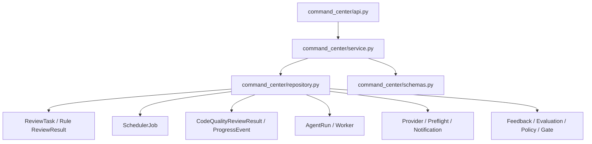

# AI Review Command Center Implementation Plan

基线文档：[AI Review Command Center Design Proposal.md](/D:/projects/ai-code-review-platform/docs/AI Review Center Design/AI Review Command Center Design Proposal.md)

## 当前执行状态

- 当前阶段：`Phase 1`
- 阶段状态：`PHASE 1 COMPLETED — WAITING FOR PHASE 2 CONFIRMATION`
- Phase 0 基线 Commit：`2005b8f`
- 用户授权时间：2026-07-31
- 阶段完成时间：2026-07-31
- 本阶段目标：在 Phase 0 只读接口和页面骨架之上，接入有界的真实运行态与治理态聚合，并完成静态拓扑的数据驱动展示。
- 本阶段明确不做：修改既有 Review 业务逻辑、新增业务表、Canvas、粒子动画、任务聚焦、AppFrame 轮询去重，以及任何 Phase 2/3 能力。
- 停止点：Phase 1 已完成并通过验证。立即停止，等待用户验证及 Phase 2 明确确认。

本计划同时作为分阶段实施总控和验收记录。每个阶段开始前更新状态，完成后回写验证结果并停止。

### Phase 0 实施结果

- 后端新增独立 `command_center` 只读投影模块并注册 Router。
- `GET /api/command-center/runtime` 返回 Task、Review Job 基础计数和 Deferred coverage。
- `GET /api/command-center/governance` 返回 Pending Feedback、Evaluation Case 基础计数和 Deferred coverage。
- 两个接口支持 `windowHours`、`projectId`、`groupId` 等计划内参数；非法参数遵循平台统一错误契约返回 `400 VALIDATION_ERROR`。
- 前端 `/` 已切换为 `CommandCenterPage`，`/tasks`、`/tasks/:taskId` 和 `/?taskId=...` 历史跳转保持不变。
- 首页包含 System Pulse、静态生命周期骨架、Live Operations Rail 和 Governance Loop。
- Phase 0 仅首次加载两个只读快照；未实现轮询、Canvas 或模拟运行数据。
- 未新增数据表、迁移、领域模型、动画依赖或业务写入逻辑。

### Phase 0 验证结果

- 后端目标测试：`6 passed`
- 前端 Command Center 信息架构测试：`4 passed`
- 前端全量 Node 测试：`65 passed`
- 前端生产构建：通过
- 本次后端文件定向 Ruff：通过
- `git diff --check`：通过，仅有仓库现有的 Windows LF/CRLF 提示
- 全量后端 Ruff 仍被 5 个本阶段外的既有未使用导入/变量问题阻断；本阶段未越权修改这些文件。
- Vite 继续报告既有主 Bundle 大于 500 kB 的提示；路由级拆包不属于 Phase 0，保留到后续性能阶段处理。

## 0. 实施结论与边界

核心方案：

- 后端新增独立 `command_center` 只读投影模块。
- 不修改现有 Webhook、规则分析、AI 调度、Agent、通知或治理逻辑。
- 不新增业务表，不修改领域模型，不在第一阶段增加数据库索引。
- 前端只在 `App.jsx` 做导入、路由和导航级改动。
- Command Center 页面全部放入独立 `command-center/` 目录。
- Phase 0～1 先完成真实数据和静态拓扑，Phase 2 才引入 Canvas 动画。
- 现有任务详情 Canvas 对外契约保持不变。
- 每个 Phase 完成后必须停止，等待用户验证并明确确认继续。

------

# 一、代码影响分析

## 1.1 Phase 0 实施前入口

### 前端

Phase 0 实施前首页 [App.jsx (line 11782)](D:/projects/ai-code-review-platform/frontend/src/App.jsx:11782) 中：

```
function HomePage() {
  // 保留 /?taskId=... 历史跳转
  return <TaskListPage />;
}
```

Phase 0 实施前路由：

- `/`：任务列表
- `/tasks`：任务列表
- `/tasks/:taskId`：任务详情
- 质量治理、设置、版本、帮助等独立路由

`AppFrame` 还负责：

- 顶部导航
- Job Queue 5 秒轮询
- AI Review 失败通知轮询
- Queue/Failure Drawer
- 任务详情沉浸式布局控制

### 后端

所有 Router 在 [main.py (line 80)](D:/projects/ai-code-review-platform/backend-python/app/main.py:80) 中集中注册。Phase 0 实施前没有 `command_center` 模块。

## 1.2 新增文件

### 后端新增

```
backend-python/app/command_center/
  __init__.py
  api.py
  schemas.py
  repository.py
  service.py

backend-python/tests/
  contract/test_command_center_api_contract.py
  unit/test_command_center_service.py
```

职责：

| 文件            | 职责                                                      |
| --------------- | --------------------------------------------------------- |
| `api.py`        | `/api/command-center` Router、查询参数校验、响应封装      |
| `schemas.py`    | Runtime/Governance 响应 DTO、枚举和 schema version        |
| `repository.py` | 只读 SQLAlchemy SELECT、批量加载和聚合查询                |
| `service.py`    | 当前阶段派生、状态映射、风险/Context/Fallback 汇总        |
| contract test   | 接口、字段、安全边界、空数据、多模型和 Fallback 契约      |
| unit test       | 阶段映射、Provider 观察状态、风险聚合、时间窗口和截断逻辑 |

禁止新增：

- `models.py`
- 数据表
  -迁移脚本
- 后台任务
- 写入 Repository

### 前端新增

```
frontend/src/command-center/
  CommandCenterPage.jsx
  CommandCenterCanvas.jsx
  CommandCenterTopology.jsx
  SystemPulse.jsx
  LiveOperationsRail.jsx
  GovernanceLoop.jsx
  useCommandCenterSnapshots.js
  commandCenterApi.js
  commandCenterModel.js
  commandCenterPresentation.js
  commandCenterCanvasRenderer.js
  commandCenter.css

frontend/src/canvas/
  canvasRuntime.js

frontend/tests/
  commandCenterModel.test.mjs
  commandCenterPresentation.test.mjs
  commandCenterCanvasRenderer.test.mjs
  commandCenterInformationArchitecture.test.mjs
```

其中 `canvasRuntime.js` 在 Phase 2 才新增。

## 1.3 修改文件

| 文件                                                         | 修改内容                                                     | 阶段              |
| ------------------------------------------------------------ | ------------------------------------------------------------ | ----------------- |
| [backend-python/app/main.py (line 11)](D:/projects/ai-code-review-platform/backend-python/app/main.py:11) | 导入并注册 `command_center_router`                           | Phase 0           |
| [frontend/src/App.jsx (line 11782)](D:/projects/ai-code-review-platform/frontend/src/App.jsx:11782) | 导入 CommandCenter、修改 `/` 内容、导航选中态和品牌跳转      | Phase 0           |
| [frontend/src/reviewCanvasRenderer.js (line 124)](D:/projects/ai-code-review-platform/frontend/src/reviewCanvasRenderer.js:124) | 将通用 Canvas 生命周期委托给 `canvasRuntime.js`，保持现有 API | Phase 2           |
| 设计/实施文档                                                | 登记当前 Phase、接口契约、验收结果和停止点                   | 各阶段开始/完成时 |

`App.jsx` 的修改必须限制在：

- 新组件 import
- `HomePage` 返回值
- `isCommandCenterRoute` / `isTaskRoute`
- 顶部 Command Center 导航
- 品牌跳转
- 必要的数据轮询去重

不把页面 JSX、状态映射或 Canvas 逻辑写入 `App.jsx`。

## 1.4 保持不动

### 后端保持不动

- `project_integration/`
- `change_analysis/`
- `risk_engine/`
- `rule_template/`
- `review_record/service.py`
- `code_quality/service.py`
- `code_quality/providers.py`
- `agent_review/service.py`
- `agent_review/worker.py`
- `notification/service.py`
- `review_feedback/service.py`
- `evaluation/service.py`
- 所有现有领域模型
- 所有现有迁移
- 现有 API 路径和响应

新接口只读取这些模块拥有的数据，不调用它们的业务写入方法。

### 前端保持不动

- [ReviewImmersiveCanvas.jsx (line 4)](D:/projects/ai-code-review-platform/frontend/src/ReviewImmersiveCanvas.jsx:4)
- `reviewJourney.js`
- `reviewJourneyPresentation.js`
- `reviewImmersivePresentation.js`
- `agentReviewTrace.js`
- `agentWorkerPool.js`
- `api.js`
- `main.jsx`
- `MuiAppShell.jsx`
- `muiTheme.js`
- 现有任务详情、Finding、Diff、Patch、设置和治理页面
- `package.json`：不增加动画或 Canvas 依赖
- `styles.css`：Command Center 使用独立 CSS 文件，不继续扩张全局样式

------

# 二、后端实现方案

## 2.1 模块调用关系



所有调用方向都是读取。API 请求期间不得：

- `commit`
- `flush`
- 新建默认配置
- 清理 Worker
- 修改任务状态
- 创建表、补列或补索引

尤其不要复用带 `ensure_*_schema`、默认记录创建或 stale cleanup 副作用的现有查询入口。

## 2.2 Controller/API

### Router

```
router = APIRouter(
    prefix="/api/command-center",
    tags=["command-center"],
)
```

在 `main.py` 中注册：

```
app.include_router(command_center_router)
```

### Runtime API

```
GET /api/command-center/runtime
```

建议参数：

| 参数          | 默认值 | 约束   | 用途                         |
| ------------- | ------ | ------ | ---------------------------- |
| `windowHours` | 24     | 1～168 | 最近完成、失败和告警时间窗口 |
| `activeLimit` | 20     | 1～50  | 单独展示的活跃 Flow 上限     |
| `alertLimit`  | 20     | 1～50  | 告警上限                     |
| `projectId`   | 空     | 可选   | 项目过滤                     |
| `groupId`     | 空     | 可选   | 项目组过滤                   |

响应版本：

```
{
  "schemaVersion": "command-center-runtime-v1",
  "generatedAt": "2026-07-31T10:00:00Z",
  "window": {
    "from": "...",
    "to": "..."
  },
  "intake": {},
  "activeTasks": [],
  "activeFlows": [],
  "scheduler": {},
  "standard": {},
  "agent": {},
  "providersObserved": [],
  "alerts": [],
  "coverage": {}
}
```

### Governance API

```
GET /api/command-center/governance
```

建议参数：

- `windowHours=24`
- `projectId`
- `groupId`

响应版本：

```
{
  "schemaVersion": "command-center-governance-v1",
  "generatedAt": "...",
  "window": {},
  "ruleAnalysis": {},
  "preflight": {},
  "contextQuality": {},
  "findingRisk": {},
  "notifications": {},
  "feedback": {},
  "evaluation": {},
  "policies": {},
  "coverage": {}
}
```

Evaluation、Acceptance Gate 等如果采用全量当前状态，应在对应节点标注：

```
{
  "scope": "ALL_TIME"
}
```

不得让用户误以为所有治理指标都属于最近 24 小时。

## 2.3 Service 职责

`service.py` 只处理纯业务投影：

1. 计算查询时间窗口。
2. 把多表记录组装为 `activeTasks`。
3. 按 `(taskId, reviewKey)` 组装 `activeFlows`。
4. 派生当前生命周期阶段。
5. 区分 Standard、Agent 和 Standard Fallback。
6. 生成安全的 Provider 观察状态。
7. 聚合 Finding severity/contextStatus。
8. 聚合 Rule、Preflight、Notification 和 Governance。
9. 输出截断、覆盖范围和数据新鲜度信息。
10. 不返回任何敏感原文。

### 当前阶段派生

阶段来源优先级：

1. Scheduler Job 的 `QUEUED/RUNNING/FAILED`
2. AgentRun 和 `AGENT_*` Progress
3. 最新 ProgressEvent
4. CodeQualityReviewResult 状态
5. Rule ReviewResult 是否存在
6. ReviewTask 技术状态

建议统一阶段：

```
INTAKE
RULE_ANALYSIS
RULE_COMPLETED
PREFLIGHT
QUEUED
CONTEXT_BUILDING
MODEL_CALLING
AGENT_ANALYZING
AGENT_TOOL_ACTIVITY
AGENT_CONVERGING
AGENT_SUBMITTING
FINDING_READY
NOTIFYING
COMPLETED
FAILED
SKIPPED
FALLBACK
```

每个 Flow 返回：

```
{
  "stage": "CONTEXT_BUILDING",
  "stageSource": "PROGRESS"
}
```

如果只能根据“任务运行中但还没有 RuleResult”推断，则：

```
{
  "stage": "RULE_ANALYSIS",
  "stageSource": "INFERRED"
}
```

前端必须能区分真实进度与推断状态。

### Fallback 判断

只在以下事实成立时标记：

```
requestedEngine = AGENT
effectiveEngine = STANDARD_FALLBACK
```

或 AgentRun 明确记录 `effective_engine=STANDARD_FALLBACK`。

不能仅根据 Agent 失败和同时存在 Standard 结果猜测 Fallback。

### Provider 状态

允许：

- `CONFIGURED`
- `DISABLED`
- `ACTIVE`
- `RECENT_SUCCESS`
- `RECENT_FAILURE`
- `NO_RECENT_DATA`

禁止：

- `HEALTHY`
- `UNHEALTHY`
- `UP`
- `DOWN`

除非未来真正增加持久化健康检测。

## 2.4 Repository 数据来源

| 首页对象      | 数据来源                                                |
| ------------- | ------------------------------------------------------- |
| Intake、Task  | `ReviewTask`、`Project`、`ProjectGroup`                 |
| Rule Analysis | `review_record.models.ReviewResult`                     |
| Scheduler     | `CodeQualitySchedulerJob`                               |
| Standard Flow | `CodeQualityReviewResult`                               |
| 当前阶段      | `CodeQualityReviewProgressEvent`                        |
| Agent Flow    | `AgentReviewRun`                                        |
| Worker        | `AgentReviewWorker`、只读 `AgentReviewSettings`         |
| Provider      | `CodeQualityModelProvider`、`CodeQualityReviewSettings` |
| Preflight     | `DeterministicCheckRun`                                 |
| Finding       | `CodeQualityReviewResult.findings_json`                 |
| Notification  | `NotificationRecord`                                    |
| Feedback      | `ReviewItemFeedback`                                    |
| Evaluation    | `EvaluationCase`、`EvaluationRun`                       |
| Policy        | `ProjectReviewPolicy`                                   |
| Acceptance    | `ReviewQualityAcceptanceGate`                           |

注意存在两个名称相近但语义不同的 Result：

- `review_record.models.ReviewResult`：规则分析和风险卡片结果
- `code_quality.models.CodeQualityReviewResult`：AI Review 结果

实现中禁止使用含混别名，建议分别命名为：

```
RuleReviewResult
AiReviewResult
```

## 2.5 查询策略

### Runtime

先确定有限集合，再批量加载关联数据：

1. 查询全部 `QUEUED/RUNNING` Review Job。
2. 查询 `RUNNING/REVIEWING` Task。
3. 合并并限制需要展开的 Task ID。
4. 一次性加载这些 Task 的：
   - Rule Result
   - AI Result
   - Progress
   - AgentRun
   - Notification
5. 在 Python 中按 `taskId/reviewKey` 归组。

不得对每个 Task 单独查询 Result/Progress/Notification。

### Governance

优先在数据库中完成：

- `COUNT`
- `GROUP BY status`
- `GROUP BY severity`
- 时间窗口过滤

Finding 的 `contextStatus` 位于 JSON Text 中，需要在 Python 中解析。第一阶段应：

- 只读取窗口内完成的结果。
- 设置最大扫描结果数，例如 2,000。
- 超出时返回 `coverage.truncated=true`。
- 不读取 `raw_output`。
- 不读取 Evidence、Suggestion、Body 等不需要字段。
- 后续只有真实规模证明存在问题时，才考虑物化统计。

### Progress

为兼容 MySQL 5.7：

- 不依赖 `ROW_NUMBER()` 等窗口函数。
- 对受限 Task 集合按 `created_at DESC, id DESC` 查询。
- 在 Python 中选出每个 `(taskId, reviewKey)` 的最新事件。
- 不解析或返回 Progress `detail` 原文。

## 2.6 安全边界

新接口不得返回：

- Provider API Key 或 masked key
- Endpoint URL
- Notification target/Webhook URL
- Prompt
- Diff、源码、路径内容
- Agent input/completion context
- Progress detail 原文
- Provider raw output
- Finding body/evidence/suggestion
- Feedback 人工长文本
- Policy content

首页只需要标识、状态、计数、时间、风险等级和安全摘要。

## 2.7 查询性能风险

### 主要风险

1. 首页 5 秒轮询放大数据库查询。
2. `findings_json` 解析形成 CPU 和内存压力。
3. Progress 表持续增长。
4. AppFrame 现有 Queue/Failure 轮询可能与首页重复。
5. 多个 SELECT 之间可能看到略有差异的快照。
6. 当前多数模型未声明适合全局聚合的索引。

### 约束措施

- Runtime 和 Governance 拆成不同刷新频率。
- 查询数量与 Task 数量解耦，保持常数级批量查询。
- 活跃 Flow、告警、JSON 扫描均设置硬上限。
- 返回 `generatedAt`、`coverage` 和 `truncated`。
- 首页请求失败时前端保留最后成功数据，但停止流动动画。
- Phase 3 消除首页与 AppFrame 的重复轮询。
- MySQL 上执行 `EXPLAIN` 后再决定索引。
- 第一轮不修改模型和迁移；如确需索引，单独形成后续小阶段并等待确认。

------

# 三、前端实现方案

## 3.1 CommandCenterPage

职责：

- 页面编排
- Runtime/Governance Snapshot 生命周期
- 当前选中 Task/Flow
- 数据新鲜度和错误状态
- 响应式布局
- 页面隐藏/恢复
- 将安全的 Presentation 传入各子组件

不负责：

- 绘制 Canvas
- 解析后端原始 Progress
- 直接拼接 API URL
- 保存业务数据

## 3.2 SystemPulse

展示：

- generatedAt / Fresh / Stale
- 活跃 Task
- 活跃 Flow
- Scheduler Active
- Worker Online/Total
- Busy/Draining
- 24 小时失败数
- 当前最高风险
- Pending Feedback

状态只来自 Presentation，不自行统计。

API 成功不等于依赖全部健康，因此文案使用：

- 数据可用
- Worker 在线
- Provider 最近成功
- Provider 最近失败

不使用“平台全健康”。

## 3.3 LiveOperationsRail

展示：

- Queued / Running Flow
- Agent Fallback
- Job/Result/Agent Failure
- Worker Offline/Draining
- Expired Lease
- Notification Failure
- Critical Finding

支持：

- 点击 Task 进入 `/tasks/:taskId`
- 点击 Queue 打开现有 Queue Drawer
- 点击治理告警进入已有治理页面

第一阶段不在这里提供 Cancel/Retry。

## 3.4 GovernanceLoop

展示低频快照：

- Feedback 状态
- Context Missing
- Evaluation Verdict
- Policy Candidate/Enabled
- Acceptance Gate
- Agent 样本门禁

不播放持续动画。

## 3.5 CommandCenterTopology

Phase 1 的语义 DOM 拓扑，也是：

- Canvas 失败回退
- reduced-motion 强回退
- 移动端布局
- 无障碍信息源

它必须在没有 Canvas 时完整表达：

```
Intake → Rule → Preflight → Standard/Agent → Finding → Notification
                              ↓
                         Governance Loop
```

## 3.6 CommandCenterCanvas

职责：

- 创建/销毁 Canvas Controller
- 接收 Presentation Scene
- 处理 reduced-motion
- 暴露只读性能诊断属性
- Canvas 失败时切换至 `CommandCenterTopology`

不得接收：

- 原始 API 响应
- Progress detail
- Finding 正文
- Diff
- Prompt
- Provider 响应
- 业务写操作回调

## 3.7 数据层

### `commandCenterApi.js`

只封装：

```
loadRuntimeSnapshot()
loadGovernanceSnapshot()
```

复用现有 `fetchApi`，不创建第二套请求封装。

### `useCommandCenterSnapshots.js`

负责：

- Runtime 5 秒轮询
- Governance 60 秒轮询
- 页面隐藏暂停
- focus/visibility 恢复立即刷新
- AbortController 或请求序号防止旧响应覆盖新响应
- 保留最后成功快照
- 数据过期标记
- 卸载清理

### `commandCenterModel.js`

负责：

- API 默认值归一化
- schemaVersion 检查
- Task/Flow ID 生成
- 列表硬上限
- Previous/Next Snapshot 对账

### `commandCenterPresentation.js`

负责：

- 节点、边和 Flow Scene
- UI 文案
- 风险和状态视觉 token
- 是否允许动画
- Fallback、Failed 等一次性过渡事件

------

# 四、Canvas 技术方案

## 4.1 当前能力评估

现有 [reviewCanvasRenderer.js (line 1)](D:/projects/ai-code-review-platform/frontend/src/reviewCanvasRenderer.js:1) 已具备：

- 固定种子粒子布局
- 宽度分档粒子上限
- DPR 1～2 限制
- 单 RAF
- ResizeObserver
- 页面隐藏暂停
- reduced-motion
- 初始化/绘制失败清理
- Controller dispose
- 帧数和绘制耗时诊断

但它当前只支持：

- `STANDARD_FLOW`
- `AGENT_PARTICLE`
- 单一中心视觉
- 单个状态参数

它不支持：

- 多节点拓扑
- 多条并发 Flow
- Task → 多 reviewKey 分裂
- 不同粒子类型
- Fallback 重定向路径
- Scene diff
- 节点选择
- DOM Overlay 对齐

因此不能直接让 `CommandCenterCanvas` 使用 `createReviewCanvasController()`。

## 4.2 建议重新抽象的部分

Phase 2 新增：

```
frontend/src/canvas/canvasRuntime.js
```

抽取通用能力：

- Canvas/2D Context 初始化
- ResizeObserver
- DPR 同步
- RAF 生命周期
- 页面可见性
- reduced-motion
- 错误回调
- dispose
- 性能诊断
- 单实例约束

保留适配器：

```
createReviewCanvasController(options)
```

对 `ReviewImmersiveCanvas` 的调用方式不变。

新增：

```
createCommandCenterCanvasController(options)
```

两类 Renderer 只共享运行时，不共享业务 Scene 和绘制函数。

## 4.3 Scene 模型

### 静态节点

```
{
  id,
  type,
  label,
  x,
  y,
  status,
  count,
  ariaLabel,
  navigationTarget
}
```

类型：

```
GITLAB_EVENT
MANUAL_TRIGGER
REVIEW_TASK
RULE_ANALYSIS
PREFLIGHT
STANDARD_FLOW
CONTEXT
PROVIDER
AGENT_FLOW
AGENT_WORKER
FINDING
NOTIFICATION
FEEDBACK
EVALUATION
POLICY
```

### 边

```
{
  id,
  from,
  to,
  kind,
  state
}
```

`kind`：

- `PRIMARY`
- `STANDARD`
- `AGENT`
- `FALLBACK`
- `GOVERNANCE`

### 动态粒子

```
{
  id,
  kind,
  taskId,
  reviewKey,
  engine,
  state,
  pathId,
  progress,
  severity,
  aggregatedCount,
  seed
}
```

粒子必须由真实 Snapshot 生成。`seed` 由 `taskId + reviewKey` 确定，轮询更新时位置不能随机跳变。

## 4.4 核心粒子模型

| 对象          | 来源                            | Canvas 行为                          |
| ------------- | ------------------------------- | ------------------------------------ |
| GitLab Event  | `ReviewTask.triggerType`        | 从 GitLab 入口到 Rule 节点           |
| ReviewTask    | `ReviewTask`                    | 进入核心；多 reviewKey 时分裂        |
| Standard Flow | `SchedulerJob + AiReviewResult` | Queue → Context → Provider → Finding |
| Agent Flow    | `SchedulerJob + AgentRun`       | Queue → Worker → MCP/Model → Finding |
| Finding       | AI Result 聚合                  | 按真实 severity 生成有限风险粒子     |
| Notification  | NotificationRecord              | Result → DingTalk；失败停在节点      |

## 4.5 状态动画

| 后端事实              | Visual State          | 动画                                 |
| --------------------- | --------------------- | ------------------------------------ |
| Job `QUEUED`          | `QUEUED`              | 停留轨道、公转，不前进               |
| Job/Result `RUNNING`  | `RUNNING`             | 路径流动、节点呼吸                   |
| Job/Result/Run Failed | `FAILED`              | 仅在状态变化时播放一次收缩，之后静态 |
| Agent → Standard      | `FALLBACK`            | 琥珀弧线从 Agent 重定向到 Standard   |
| `AGENT_ANALYZING`     | `AGENT_ANALYZING`     | Worker 周围证据轨道                  |
| `AGENT_TOOL_ACTIVITY` | `AGENT_TOOL_ACTIVITY` | Worker 与工具节点往返                |
| `AGENT_CONVERGING`    | `AGENT_CONVERGING`    | 轨道收束                             |
| `AGENT_SUBMITTING`    | `AGENT_SUBMITTING`    | 单粒子发送至 Finding                 |
| Completed             | `COMPLETED`           | 静态结果节点，不持续播放             |
| Stale Data            | `STALE`               | 停止所有流动，仅保留静态拓扑         |

### 转换规则

- 初次加载已有 Failed/Fallback 记录：显示静态状态，不回放历史动画。
- 只有 Previous Snapshot → Next Snapshot 发生状态变化时，才触发一次性动画。
- API 失败或数据过期时，不根据本地时间继续伪造阶段推进。
- `AGENT_ANALYZING` 只能由真实 Agent Progress 触发。

## 4.6 性能预算

沿用现有 Canvas 基线：

- 单页面一个 Command Center Canvas
- 单 RAF
- 单 ResizeObserver
- 单 visibility listener
- DPR 最大 2
- 390px：最多 48 粒子
- 1024px：最多 80 粒子
- 1440px：最多 120 粒子
- 独立活跃 Flow 最多 20，其余聚合
- 平均绘制耗时目标不超过 8ms/帧
- 零尺寸、隐藏页面、reduced-motion 不持续绘制
- 不使用 WebGL、远程资源、图片、视频或动画库

------

# 五、开发拆分阶段

## Phase 0：基础接口和页面骨架

### 目标

先确定接口结构、数据 DTO、模块边界和路由，不实现复杂聚合和 Canvas。

### 修改范围

后端：

- 新增 `command_center/` 模块
- 注册 Router
- 建立 Runtime/Governance schema
- 实现空数据和基础计数的只读响应
- 新增接口契约测试

前端：

- 新增 `command-center/` 基础组件
- `/` 切换到 `CommandCenterPage`
- `/tasks` 保留任务列表
- 保留 `/?taskId=` 历史跳转
- 增加“指挥中心”导航
- 页面显示 loading/empty/error 骨架
- 不创建 Canvas

### 验收标准

- 两个接口返回 200 和固定 schemaVersion。
- 空数据库返回合法空结构。
- 接口执行期间无 INSERT/UPDATE/DELETE/DDL。
- 所有现有 API 路径不变。
- `/` 显示 Command Center 骨架。
- `/tasks` 和 `/tasks/:taskId` 行为不变。
- `App.jsx` 只增加路由级代码。
- 前端 build 通过。
- 完成后停止，等待确认 Phase 1。

## Phase 1：静态拓扑与真实数据

### 目标

用真实聚合数据完整展示运行链路，但不实现动态 Canvas。

### 修改范围

后端：

- 完成 Runtime 聚合
- 完成 Governance 聚合
- 多模型 `activeFlows`
- Standard/Agent/Fallback
- Worker、Provider 观察状态
- Rule、Preflight、Finding、Context、Notification
- Feedback、Evaluation、Policy、Acceptance
- 截断和覆盖范围

前端：

- 完成数据 Hook
- 完成 SystemPulse
- 完成静态 CommandCenterTopology
- 完成 LiveOperationsRail
- 完成 GovernanceLoop
- 实现 Fresh/Stale
- 基础导航到现有页面
- 5 秒/60 秒轮询

### 验收标准

- 一个 Task 的多个 `reviewKey` 显示为多个 Flow。
- Agent Fallback 只依据真实字段出现。
- Provider 不显示虚假 Health。
- Worker Offline/Draining、Expired Lease 可识别。
- Critical Finding 和 Notification Failed 可识别。
- 页面不请求每个 Task 的详情接口。
- 查询数量不随 Task 数线性增长。
- 响应不含敏感字段。
- 390/1024/1440 静态布局可用。
- 完成后停止，等待确认 Phase 2。

## Phase 2：Canvas 粒子动画

### 目标

在 Phase 1 真实数据和语义拓扑之上增加粒子视觉，不改变业务含义。

### 修改范围

- 抽取 `canvasRuntime.js`
- 保持 Review Canvas API 兼容
- 新增 Command Center Renderer
- 实现粒子 Scene
- 实现 Queued/Running/Failed/Fallback/Agent 状态动画
- reduced-motion
- Canvas failure fallback
- 性能诊断

### 验收标准

- 现有 `reviewCanvasRenderer` 全部测试继续通过。
- `ReviewImmersiveCanvas.jsx` 无需修改。
- 一个 Canvas、一个 RAF、一个 Observer、一个 visibility listener。
- 轮询更新不重建 Canvas。
- 无真实活动时无粒子流动。
- Failed/Fallback 历史状态不重复回放。
- Stale 时停止动画。
- 平均绘制耗时不超过 8ms/帧。
- 1440/1024/390 均无溢出。
- 完成后停止，等待确认 Phase 3。

## Phase 3：交互与性能优化

### 目标

补齐任务聚焦、钻取、重复轮询治理、响应式和长时间运行稳定性。

### 修改范围

- 选择 Task/Flow
- 聚焦多 Review 分支
- 点击节点进入现有页面
- Queue/Failure Drawer 联动
- 首页与 AppFrame 轮询去重
- 请求竞态和取消
- 长时间轮询稳定性
- DOM Overlay 和键盘交互
- 移动端静态降级
- MySQL 查询计划验证

### 验收标准

- Task 选择不会重建 Canvas。
- 选中 Flow 与右侧 Live Ops 同步。
- 键盘可访问主要节点和跳转。
- Canvas 失败后所有关键信息仍可见。
- 首页不会与 AppFrame 重复持续拉取相同队列数据。
- 页面隐藏期间无轮询和 RAF。
- 恢复后只发起一轮刷新。
- 长时间运行无 Timer、RAF、Observer、Listener 累积。
- MySQL 查询计划无全表高频扫描；如需要索引，停止并单独申请下一阶段。
- 完成后停止，等待部署或真实环境验收确认。

------

# 六、风险分析

## 6.1 Canvas 性能

风险：

- 多节点、多路径、多 Flow 比现有单核心 Canvas 更复杂。
- 高频轮询可能反复生成 Scene。
- 粒子数量可能随任务数量增长。

控制：

- 粒子硬上限 48/80/120。
- 独立 Flow 最大 20。
- Scene 使用稳定 ID 和增量对账。
- DOM 负责文字和点击，Canvas 不绘制复杂文本。
- 单 RAF、DPR≤2、隐藏/零尺寸暂停。
- 保留 DOM 静态拓扑作为失败和移动端回退。

## 6.2 App.jsx 过大

风险：

- 当前 `App.jsx` 已集中大量页面。
- 继续添加首页 JSX 会加剧耦合和构建体积。

控制：

- `App.jsx` 只做 import、route、nav。
- 数据、组件、状态、Canvas、CSS 全部放入 `command-center/`。
- 不在本专项顺带拆分整个 `App.jsx`，避免范围失控。
- 后续可单独规划现有页面模块化。

## 6.3 首页接口压力

风险：

- Runtime 5 秒轮询。
- 多用户同时打开首页。
- JSON Finding 和 Progress 表持续增长。
- AppFrame 已有 Queue/Failure 轮询。

控制：

- Runtime/Governance 分频。
- 批量查询、无 N+1。
- 时间窗口和数量硬上限。
- Findings JSON 扫描上限与 `truncated` 标识。
- Phase 3 去除重复轮询。
- 不在第一阶段增加缓存或物化表。
- 使用真实 MySQL `EXPLAIN` 决定是否需要索引。

## 6.4 数据实时性

风险：

- 多个 SELECT 之间不是同一绝对时刻。
- Progress、Job 和 Result 可能短暂不一致。
- 轮询响应可能乱序。

控制：

- 每个响应携带 `generatedAt`。
- 每项返回 `updatedAt` 和 `stageSource`。
- 前端拒绝较旧响应覆盖新响应。
- 最后成功快照可保留，但标为 STALE。
- STALE 状态停止动画。
- 不为了强一致性持有长事务或锁业务表。

## 6.5 动画与真实状态一致性

风险：

- 将技术状态错误翻译为业务动画。
- 用户误认为本地循环动画代表模型仍在工作。
- Fallback/Failed 被反复播放。
- 新增 Progress phase 后映射过期。

控制：

- 只有白名单状态触发动画。
- 未识别 phase 显示通用 `RUNNING`，不猜测 Thinking。
- 一次性动画只根据前后 Snapshot 状态差异触发。
- 后端返回 `stageSource`。
- 在单元测试中固定所有已知 phase 映射。
- 新增 Progress phase 时必须同步更新 Command Center 映射测试。

## 6.6 其他风险

| 风险                   | 控制                                                         |
| ---------------------- | ------------------------------------------------------------ |
| 敏感信息进入首页       | 使用字段白名单；契约测试断言不存在 rawOutput、detail、API Key、Webhook、Prompt |
| MySQL 5.7 兼容         | 不使用窗口函数和 JSON_TABLE；有限集合在 Python 归组          |
| 质量治理指标口径混淆   | 每个区块标注 `24H` 或 `ALL_TIME`                             |
| 全局 Provider 健康误导 | 仅显示配置和最近观察状态                                     |
| Rule 阶段缺少 Progress | 显示 `stageSource=INFERRED`                                  |
| 空闲系统仍有动画       | 无活跃 Flow 时只显示静态核心                                 |
| 前端 Bundle 继续变大   | 不新增依赖；Command Center 独立模块，为后续路由级拆包预留边界 |

------

## 验证策略

后端每阶段执行相关最小测试：

- `test_command_center_service.py`
- `test_command_center_api_contract.py`
- 涉及 Agent/质量汇总时补跑对应现有 contract tests

前端：

- `node --test frontend/tests/commandCenter*.test.mjs`
- Phase 2 同时执行 `frontend/tests/reviewCanvasRenderer.test.mjs`
- 最终执行 `scripts/run-frontend.cmd build`

Phase 2/3 浏览器验收：

- 1440 × 900
- 1024 × 800
- 390 × 844
- Agent Running
- Standard Running
- Agent → Standard Fallback
- Failed
- 无任务空闲
- Stale/接口失败
- reduced-motion
- Canvas 初始化失败回退

------

# 七、Phase 1 实施准备分析

## 7.1 准备结论与实施边界

Phase 0 已完成并形成可追溯基线：

- Phase 0 基线 Commit：`2005b8f`
- 后端已有独立、只读的 `command_center` API、Repository、Service 和 Schema 边界。
- 前端根路由已切换到 `CommandCenterPage`，任务列表、任务详情和历史 Query 跳转保持兼容。
- 首页已有 System Pulse、静态生命周期拓扑、Live Operations Rail 和 Governance Loop 骨架。
- Phase 0 未引入轮询、Canvas、粒子动画、模拟运行数据、数据库表或业务写入。

Phase 1 只完成两件事：

1. 将 Runtime 与 Governance 接口从 Phase 0 的基础计数扩展为有界、只读的真实聚合。
2. 用真实快照驱动现有静态页面骨架，建立稳定的 Model、Presentation 和轮询边界。

Phase 1 必须继续遵守：

- 不修改现有 Review、Scheduler、Agent、Notification、Feedback、Evaluation 的业务流程和状态机。
- 不新增业务表、迁移、缓存、物化视图或索引。
- 不实现 Canvas、粒子、连线流光和状态动画。
- 不进入任务聚焦、全局轮询收敛、路由级拆包等 Phase 3 工作。
- 不将数据库中不存在的状态推断成“Thinking”“Provider Healthy”等产品语义。

当前计划状态固定为：

`PHASE 1 READY — WAITING FOR IMPLEMENTATION CONFIRMATION`

在收到明确实现确认前，不修改任何业务代码、配置或测试。

## 7.2 Phase 1 文件修改范围

### 7.2.1 后端计划修改

| 文件 | Phase 1 职责 |
| ---- | ------------ |
| `backend-python/app/command_center/schemas.py` | 扩展 Runtime、ActiveTask、ActiveFlow、Worker、Provider、Alert 和 Governance 的只读响应契约 |
| `backend-python/app/command_center/repository.py` | 增加显式字段、有界范围、无副作用的数据读取方法 |
| `backend-python/app/command_center/service.py` | 实现 Runtime/Governance 聚合、阶段映射、字段脱敏和 coverage 计算 |
| `backend-python/tests/contract/test_command_center_api_contract.py` | 扩展接口契约、只读性、查询数、敏感字段和场景测试 |
| `backend-python/tests/unit/test_command_center_service.py` | 覆盖阶段映射、Fallback、Worker、Provider、Alert、Governance 口径和异常数据 |

`backend-python/app/command_center/api.py` 原则上保持不变。只有既有接口响应类型或现有参数透传确有必要时，才允许做最小契约调整；不得增加计划外接口。

`backend-python/app/main.py` 保持不变，不重复注册 Router。

### 7.2.2 前端计划新增

| 文件 | Phase 1 职责 |
| ---- | ------------ |
| `frontend/src/command-center/commandCenterModel.js` | 负责响应 Schema、默认值、枚举容错、稳定 ID、上限和新鲜度模型 |
| `frontend/src/command-center/commandCenterPresentation.js` | 将纯数据快照转换为页面节点、Flow、Alert 和治理展示模型 |
| `frontend/tests/commandCenterModel.test.mjs` | 验证模型归一化、版本、缺省、过期和未知枚举处理 |
| `frontend/tests/commandCenterPresentation.test.mjs` | 验证静态生命周期、分支、Fallback、Alert 和治理展示转换 |

### 7.2.3 前端计划修改

| 文件 | Phase 1 职责 |
| ---- | ------------ |
| `frontend/src/command-center/CommandCenterPage.jsx` | 组合真实 Runtime/Governance 快照及独立错误、过期状态 |
| `frontend/src/command-center/CommandCenterTopology.jsx` | 用真实 ActiveTask/ActiveFlow 驱动静态拓扑，不引入 Canvas |
| `frontend/src/command-center/SystemPulse.jsx` | 展示真实任务、队列、Worker、Provider 和风险脉冲 |
| `frontend/src/command-center/LiveOperationsRail.jsx` | 展示有界的活跃 Flow 和 Alert 列表及任务导航 |
| `frontend/src/command-center/GovernanceLoop.jsx` | 展示带 scope/coverage 的规则、质量、反馈和评估指标 |
| `frontend/src/command-center/useCommandCenterSnapshots.js` | 增加 Runtime/Governance 独立轮询、可见性、竞态与 stale 管理 |
| `frontend/src/command-center/commandCenterApi.js` | 完善两个只读接口的参数和中止信号透传 |
| `frontend/src/command-center/commandCenter.css` | 适配真实数据、空态、错误态和响应式布局；不得加入运动效果 |
| `frontend/tests/commandCenterInformationArchitecture.test.mjs` | 扩展首页生命周期、禁止项和只读导航的架构约束 |

### 7.2.4 明确保留不动

- `frontend/src/App.jsx`
- `frontend/src/styles.css`
- `frontend/src/review-canvas/ReviewImmersiveCanvas.jsx`
- `frontend/src/review-canvas/reviewCanvasRenderer.js`
- `frontend/src/review-journey/reviewJourney.js`
- 现有 Review、Scheduler、Agent、Notification、Feedback、Evaluation 业务 Service、Repository 和 Model
- 现有数据库迁移
- `frontend/package.json`

Phase 1 不创建：

- `frontend/src/command-center/CommandCenterCanvas.jsx`
- `frontend/src/command-center/commandCenterCanvasRenderer.js`
- `frontend/src/canvas/canvasRuntime.js`

## 7.3 后端 Runtime 聚合设计

### 7.3.1 读取原则

Command Center Repository 只能执行显式列名的 `SELECT`，不得调用可能产生以下副作用的既有聚合方法：

- `ensure_*_schema`
- 创建默认 Provider/Profile/Settings
- `flush`
- 清理过期 Worker 或 Lease
- 回写 Overlay、状态或统计

不得直接复用以下带有领域副作用或超出首页字段边界的现有聚合入口：

- `agent_settings_response`
- `agent_worker_pool`
- `agent_queue_metrics`
- `list_provider_responses`
- `list_scheduler_queue_snapshot`
- `list_result_responses`
- `get_review_quality_dashboard`
- `get_agent_observation`
- 现有 Policy、Evaluation、Acceptance 写侧或复合 Repository

可以复用纯函数、枚举和只读 Model 定义，但不能复用会改变数据库状态的调用链。

### 7.3.2 Runtime 聚合顺序

Runtime Service 按固定顺序聚合：

1. 查询 `QUEUED/RUNNING` Review Scheduler Job。
2. 查询 `ReviewTask.status=RUNNING` 或 `ReviewTask.review_status=REVIEWING` 的任务候选。
3. 查询 `CodeQualityReviewResult.status=RUNNING` 且当前没有 Active Job 的补充候选。
4. 按最近活动时间合并、去重并排序 Active Task ID。
5. 应用 `activeLimit` 后确定本次允许展开的任务集合。
6. 按选定 Task ID 批量加载 Task/Project/Group、RuleReviewResult、AiReviewResult、ProgressEvent、AgentReviewRun、DeterministicCheckRun 和 NotificationRecord。
7. 在 Python 内按 `(taskId, reviewKey)` 归组，生成 ActiveTask 和 ActiveFlow。
8. 独立读取 Worker Pool、Agent Queue 和 Provider 最近观察数据。
9. 以独立上限查询近期 Failed、Fallback、Critical、Worker/Lease 和 Notification Failure Alert 候选。

该顺序确保先限流、再展开，查询数量不随 Active Task 数量线性增长，不允许逐任务补查形成 N+1。

## 7.4 ActiveTask 与 ActiveFlow 契约

### 7.4.1 ActiveTask

ActiveTask 只返回首页运行态所需字段：

```text
taskId
projectId
projectName
groupId
triggerType
technicalStatus
reviewStatus
riskLevel
ruleRiskItemCount
flowCount
stage
stageSource
createdAt
updatedAt
```

ActiveTask 不返回分支、作者、外部 URL、Diff、原始事件、错误详情或其他详情页字段。

### 7.4.2 ActiveFlow

ActiveFlow 稳定 ID 为：

```text
{taskId}:{reviewKey}
```

字段为：

```text
taskId
reviewKey
displayName
jobType
requestedEngine
effectiveEngine
fallback
status
stage
stageSource
providerCode
model
findingCount
highestRisk
contextStatusCounts
queuedAt
startedAt
updatedAt
durationSeconds
```

归组规则：

- 同一 Task 的不同 `reviewKey` 必须生成不同 ActiveFlow。
- Task 仍活跃时，已完成的兄弟 Flow 仍保留在该 Task 的运行上下文中。
- Flow 的 Provider、Model、Finding 和 Context 指标仅取该 `(taskId, reviewKey)` 的数据。
- 不以数组位置或数据库主键临时拼接前端 ID。

## 7.5 Review 阶段映射与 stageSource

`stage` 表示 Command Center 的稳定展示阶段，`stageSource` 表示该阶段来自直接事实还是有限推断。

| 真实数据条件 | stage | stageSource |
| ------------ | ----- | ----------- |
| Task 运行中且不存在 RuleResult | `RULE_ANALYSIS` | `INFERRED` |
| RuleResult 已存在 | `RULE_COMPLETED` | `RULE_RESULT` |
| Progress 进入 deterministic/precheck 阶段 | `PREFLIGHT` | `PROGRESS` |
| Scheduler Job 为 `QUEUED` | `QUEUED` | `SCHEDULER_JOB` |
| Progress 进入 Context Pack、本地仓库或 Retriever 阶段 | `CONTEXT_BUILDING` | `PROGRESS` |
| Progress 进入 Provider、HTTP、解析或结果保存阶段 | `MODEL_CALLING` | `PROGRESS` |
| Agent Run/Progress 明确处于分析 | `AGENT_ANALYZING` | `AGENT_RUN` 或 `PROGRESS` |
| Agent 工具调用阶段 | `AGENT_TOOL_ACTIVITY` | `AGENT_RUN` 或 `PROGRESS` |
| Agent 收敛阶段 | `AGENT_CONVERGING` | `AGENT_RUN` 或 `PROGRESS` |
| Agent 提交阶段 | `AGENT_SUBMITTING` | `AGENT_RUN` 或 `PROGRESS` |
| AI Result 成功保存 | `FINDING_READY` | `AI_RESULT` |
| Result 成功但尚无通知处理事实 | `NOTIFYING` | `INFERRED` |
| Notification 已处理或任务整体完成 | `COMPLETED` | `TASK` 或对应直接来源 |
| Job、Result 或 Agent Run 失败 | `FAILED` | 对应直接来源 |
| Job/Result 被取消或跳过 | `SKIPPED` | 对应直接来源 |
| Agent 明确切换到 Standard Fallback | `FALLBACK` | `AGENT_RUN` 或 `AI_RESULT` |

合法 `stageSource` 至少包括：

```text
INFERRED
RULE_RESULT
PROGRESS
SCHEDULER_JOB
AGENT_RUN
AI_RESULT
TASK
```

映射约束：

- 同一 Flow 选择时间上最新且业务优先级最高的直接状态。
- 未识别的 Progress phase 只能降级为安全的通用运行阶段。
- 不将未知 phase 翻译为 `THINKING`，也不在服务端模拟阶段推进。
- 新增真实 Progress phase 时，必须同步更新映射单元测试。

## 7.6 Fallback 严格判断规则

`fallback=true` 只能由以下任一直接事实产生：

1. AI Review Result 同时满足 `requestedEngine=AGENT` 且 `effectiveEngine=STANDARD_FALLBACK`。
2. AgentReviewRun 明确记录 `effectiveEngine=STANDARD_FALLBACK`。

严禁通过以下组合推断 Fallback：

- Agent Run 失败，同时存在 Standard Result。
- Agent Job 失败，随后出现另一个成功 Job。
- Provider 或 Model 字段发生变化。
- Progress 文案、错误文本或时间顺序看起来像降级。

如果没有明确 `STANDARD_FALLBACK` 事实，Flow 必须保持 `fallback=false`；失败事实按 `FAILED` 展示。

## 7.7 Worker、Provider 与 Alert 聚合规则

### 7.7.1 Worker 与 Agent Queue

数据直接来自 `AgentReviewWorker`、`AgentReviewSettings` 和 `SchedulerJob` 的显式字段查询。

规则：

- Worker 心跳新鲜窗口为 60 秒。
- Worker 展示状态仅允许 `IDLE`、`BUSY`、`DRAINING`。
- 首页最多返回 100 个 Worker 节点。
- 没有注册 Worker 时，保留对既有 Legacy Heartbeat 的兼容观察。
- Runtime 只读取状态，不清理过期 Worker、不回收 Lease、不写入 Heartbeat。

Agent Queue 汇总字段：

```text
queued
running
expiredLease
oldestQueuedSeconds
onlineCapacity
busyCapacity
utilizationPercent
drainingWorkers
```

### 7.7.2 Provider

Provider 使用显式字段直接查询，不得读取或返回 API Key、Endpoint、Header 或其他连接密钥。

Provider 展示字段：

```text
providerCode
providerName
providerType
modelName
enabled
defaultProvider
status
activeFlowCount
recentSuccessCount
recentFailureCount
lastObservedAt
```

Provider 状态只允许：

```text
DISABLED
ACTIVE
RECENT_SUCCESS
RECENT_FAILURE
NO_RECENT_DATA
```

状态语义：

- `DISABLED`：配置已禁用。
- `ACTIVE`：当前有 ActiveFlow 使用该 Provider。
- `RECENT_SUCCESS`：观察窗口内有成功调用且当前无活跃 Flow。
- `RECENT_FAILURE`：观察窗口内有失败调用且当前无活跃 Flow。
- `NO_RECENT_DATA`：已启用但窗口内无可确认调用结果。

不得使用 `HEALTHY`、`UNHEALTHY`、`UP`、`DOWN`，因为当前数据只支持“配置 + 最近观察”，不支持主动健康检查。

Agent Result 中的 `provider=AGENT` 不得冒充已配置的 Model Provider；Agent 使用的模型只保留在对应 Agent Flow 节点中。

### 7.7.3 Alert

首页 Alert 仅聚合：

- Scheduler Job Failed
- Agent Run Failed/Timed Out
- 明确的 Standard Fallback
- Worker Offline/Draining
- Expired Lease
- Notification Failed
- Critical Review Result

Alert 只返回固定类型、状态、`taskId`、`reviewKey`、项目、时间和安全的站内导航目标。不得返回数据库错误文本、异常堆栈、Provider 响应体、Notification Response Body 或其他敏感原文。

## 7.8 Governance 指标口径与 scope

每个 Governance 区块必须返回明确 `scope`，时间窗口型指标使用请求的 `windowHours`，全量治理存量使用 `ALL_TIME`。

| 区块 | 指标口径 | scope |
| ---- | -------- | ----- |
| Rule Analysis | RuleResult 数、风险项数、风险分布 | `WINDOW` |
| Preflight | DeterministicCheckRun 数、状态分布、Finding 数 | `WINDOW` |
| Context Quality | `SUFFICIENT/PARTIAL/INSUFFICIENT` 分布 | `WINDOW` |
| Finding Risk | `CRITICAL/MAJOR/MINOR`、最高风险、受影响 Task 数 | `WINDOW` |
| Notification | `SUCCESS/FAILED/SKIPPED` 分布 | `WINDOW` |
| Feedback | 状态、类型、Context Missing、Policy Candidate | `ALL_TIME` |
| Evaluation | Verdict、Rule Gap、Run Status | `ALL_TIME` |
| Policy | 总数、Enabled、Candidate | `ALL_TIME` |
| Acceptance | 状态分布、最近状态 | `ALL_TIME` |
| Agent Sample Gate | 已标注样本数和 30 条阈值 | `ALL_TIME` |

Governance 聚合约束：

- Context Quality 与 Finding Risk 只解析 `findings_json` 中的 `severity` 和 `contextStatus`。
- 不返回 Finding body、evidence、suggestion、path 或完整 JSON。
- 单次最多扫描 2000 条 AI Review Result；超过时返回准确的 coverage/truncated 信息。
- 后端实现中明确区分 `RuleReviewResult` 与 `AiReviewResult` 别名，避免同名 Result 混淆。
- `scope=WINDOW` 的区块必须携带窗口边界或 `windowHours`；`scope=ALL_TIME` 不伪装为 24H 实时指标。
- Agent Sample Gate 的完成阈值固定为 30 条已标注样本，除非现有配置已有明确事实来源。

## 7.9 前端 Model、Presentation 与轮询设计

### 7.9.1 Model

`commandCenterModel.js` 是 API 契约与 UI 之间的稳定适配层，负责：

- 校验并归一化 Runtime/Governance Schema Version。
- 为缺失数组、计数、状态和 coverage 提供安全默认值。
- 根据 `{taskId}:{reviewKey}` 生成并校验稳定 Flow ID。
- 应用 ActiveTask、Flow、Worker、Provider、Alert 的前端安全上限。
- 使用服务端 `generatedAt` 判断 `FRESH/STALE`。
- 对损坏响应、未知枚举和未来版本字段做安全降级，不抛出页面级异常。

### 7.9.2 Presentation

`commandCenterPresentation.js` 只做纯展示转换：

- 生成 System Pulse 展示值。
- 生成静态生命周期节点和 Standard/Agent 分支。
- 生成 Flow Row、Alert Row 和治理指标展示模型。
- 统一状态 Token、文案和颜色语义。
- 固定 `allowAnimation=false`，Phase 1 不产生任何动画意图。

Presentation 不发请求、不持有 Timer、不推断业务阶段，也不修改 Model。

### 7.9.3 轮询

`useCommandCenterSnapshots.js` 采用两条独立轮询链：

- Runtime：每 5 秒。
- Governance：每 60 秒。

行为约束：

- 页面不可见时清理 Timer，且不发起新请求。
- 页面重新可见或窗口重新 Focus 时立即刷新。
- Runtime 与 Governance 的成功、失败和 stale 状态互相独立。
- 单个接口失败时保留其最后一次成功快照。
- 使用请求序号和 `AbortController` 取消同类型旧请求，防止旧响应覆盖新响应。
- Unmount 时清理 Timer、Controller 和所有事件监听器。
- Runtime 的 stale 阈值为 15 秒；Governance 的 stale 阈值为 180 秒。
- stale 只显示最后已知数据及过期标记，不在本地继续推进 Review 阶段。

页面接入：

- `SystemPulse` 展示真实任务、队列、Worker、Provider 和风险摘要。
- `CommandCenterTopology` 展示真实 ActiveFlow，但保持 DOM/CSS 静态拓扑。
- `LiveOperationsRail` 展示有界 Flow 和 Alert。
- `GovernanceLoop` 展示带 scope 和 coverage 的真实治理指标。
- 任务链接只导航到既有 `/tasks/:taskId`；治理入口只链接到已有页面。
- Phase 1 不接入 AppFrame Queue Drawer，重复轮询的统一收敛留到 Phase 3。

## 7.10 查询性能边界

### 7.10.1 固定上限

- Runtime 固定查询数量目标：不超过约 18 条 `SELECT`。
- Governance 固定查询数量目标：不超过约 12 条 `SELECT`。
- 查询数量必须与返回 1 个或多个 Active Task 无关。
- `activeLimit` 最大 50。
- `alertLimit` 最大 50。
- Worker 节点最大 100。
- Finding JSON 扫描最大 2000 条 Result。
- Provider 和 Alert 候选查询必须有时间范围与返回上限。

### 7.10.2 字段与索引

查询只选择首页字段，不读取：

- `raw_output`
- Progress `detail`
- Notification target/response body
- Provider API Key、Endpoint、Header
- Feedback 长文本
- Policy 正文

优先使用已有索引：

- ReviewTask status/review_status
- SchedulerJob status/priority 及 task/job_type
- ProgressEvent task/created_at
- AgentRun task/status/heartbeat
- Governance 各表 project/status/time

MySQL 5.7 兼容要求：

- 不使用窗口函数。
- 不使用 `JSON_TABLE`。
- 最新记录、Flow 归组和有限集合优先在 Python 内完成。

Phase 1 不新增缓存、物化表或索引。如果真实查询计划无法满足边界，应停止并记录 MySQL `EXPLAIN` 证据，将索引或缓存方案放入经确认的小阶段或 Phase 3，不在本阶段扩张范围。

### 7.10.3 一致性与覆盖度

- Runtime 与 Governance 是独立快照，不承诺事务级一致。
- 使用 `generatedAt`、实体 `updatedAt` 和 `stageSource` 明示时间与推断来源。
- 所有有界扫描必须返回准确的 `coverage` 和 `truncated`。
- Phase 1 接受 AppFrame 与 Command Center 的暂时重复轮询，统一请求所有权留到 Phase 3。

## 7.11 完整测试矩阵

### 7.11.1 后端 Service 单元测试

| 类别 | 必测场景 |
| ---- | -------- |
| 阶段映射 | Rule 推断、Rule 完成、Preflight、Queued、Context、Model、四个 Agent 阶段、Finding Ready、Notifying、Completed、Failed、Skipped |
| stageSource | 每个阶段的直接来源与 `INFERRED`，未知 Progress 安全降级 |
| Flow 归组 | 同 Task 多 `reviewKey`、活跃 Task 保留已完成兄弟 Flow、稳定 ID |
| Engine | Standard、Agent、显式 Agent → Standard Fallback |
| Fallback | 两个合法直接事实；Agent Failed + Standard Result 不得误判 |
| Provider | Active 优先级、Recent Success/Failure、Disabled、No Recent Data、Agent 不冒充 Provider |
| Worker | Online、Offline、Idle、Busy、Draining、Legacy Heartbeat、60 秒边界 |
| Queue | Queued、Running、Expired Lease、Oldest Queued、Capacity、Utilization |
| Finding | Critical/Major/Minor、Highest Risk、Context 分布、损坏 JSON |
| Governance | Window/All Time、2000 条截断、coverage、30 条 Sample Gate |
| 空态 | 无任务、无 Worker、无 Provider 观察、无治理数据 |

### 7.11.2 后端 API 契约测试

构造并验证：

- 多模型、多 `reviewKey` 任务。
- Standard Running。
- Agent Running。
- 显式 Fallback。
- Worker Idle/Busy/Draining/Offline。
- Provider Active/Recent Success/Recent Failure/No Recent Data。
- Critical Finding、Context Insufficient。
- Notification Failed。
- Feedback、Evaluation、Policy、Acceptance、Agent Sample Gate。

契约断言：

- 两个接口只执行 `SELECT`，不产生 INSERT/UPDATE/DELETE/DDL。
- 1 个与多个 Active Task 时查询数量保持固定，不出现 N+1。
- 响应中不存在敏感列和敏感字段。
- 不生成虚假的 Provider Health。
- Fallback 严格遵循明确 `STANDARD_FALLBACK` 事实。
- 每个 Governance 区块的 scope、coverage 和 truncated 准确。
- 参数错误继续遵循统一 `400 VALIDATION_ERROR`。

### 7.11.3 前端测试

新增 `commandCenterModel.test.mjs`：

- V1 Schema 正常归一化。
- 缺失/损坏响应安全缺省。
- Runtime 15 秒、Governance 180 秒新鲜度。
- 多 Flow 稳定 ID。
- 未知枚举和未来字段安全降级。
- 列表上限和 coverage 保留。

新增 `commandCenterPresentation.test.mjs`：

- Standard/Agent 静态分支。
- Running/Fallback/Failed 展示语义。
- Provider 最近观察标签。
- Flow、Alert、Governance 的纯转换。
- `allowAnimation=false`。

扩展 `commandCenterInformationArchitecture.test.mjs`：

- 首页仍按生命周期组织。
- 真实数据组件已接入。
- 不存在 Canvas、`requestAnimationFrame` 或动画库。
- API 仍为只读 GET。
- 轮询具备隐藏暂停、Focus 刷新、清理和竞态保护。
- 不新增写操作、Queue Drawer 接入或 Phase 2/3 组件。

### 7.11.4 验证命令

```text
scripts/run-backend.cmd test tests/contract/test_command_center_api_contract.py tests/unit/test_command_center_service.py
scripts/run-backend.cmd ruff check app/command_center tests/contract/test_command_center_api_contract.py tests/unit/test_command_center_service.py
node --test frontend/tests/commandCenter*.test.mjs
node --test frontend/tests/*.test.mjs
scripts/run-frontend.cmd build
```

如项目脚本不能将 pytest 参数透传，才进入 `backend-python/` 执行对应底层命令，并在验收记录说明原因。

### 7.11.5 浏览器与响应式验收

Phase 1 仅验收静态真实数据界面：

- 1440 × 900
- 1024 × 800
- 390 × 844
- Idle
- Standard Running
- Agent Running
- Explicit Fallback
- Failed
- Runtime Stale
- Governance Stale/接口独立失败

验收必须确认：

- 无 Canvas。
- 无粒子。
- 无状态动画。
- 页面隐藏时不继续轮询。
- stale 不推动本地假状态。

## 7.12 Phase 1 执行与停止点

收到用户明确的 Phase 1 实现确认后：

1. 将本计划状态更新为 `PHASE 1 IN PROGRESS`。
2. 严格按本章文件范围、数据口径和性能边界实现。
3. 完成本章测试矩阵和响应式验收。
4. 将实施结果、实际修改文件、验证结果和遗留风险回写本计划。
5. 将状态更新为 `PHASE 1 COMPLETED — WAITING FOR PHASE 2 CONFIRMATION`。
6. 立即停止，等待用户验证与明确确认。

不得在 Phase 1 完成后自动开始 Phase 2，不得提前创建 Canvas、Renderer、粒子或动画实现。

## 7.13 Phase 1 实施结果

实施完成时间：2026-07-31

### 7.13.1 后端只读聚合

已完成：

- Runtime 按“候选发现 → Active Task 限流 → 关联数据批量读取 → Python 归组”顺序实现。
- ReviewTask、SchedulerJob、RuleReviewResult、AiReviewResult、ProgressEvent、AgentReviewRun、DeterministicCheckRun、NotificationRecord 均使用显式字段 `SELECT`。
- ActiveTask 和 ActiveFlow 已按本章固定契约返回；Flow 稳定 ID 为 `{taskId}:{reviewKey}`。
- 同一 Task 的多 `reviewKey` 独立归组，活跃 Task 保留已完成兄弟 Flow。
- 已实现 Rule、Preflight、Context、Standard、Agent、Finding、Notification 阶段映射和 `stageSource`。
- 未识别 Progress phase 只降级为安全运行阶段，不生成 Thinking。
- Fallback 只认 AI Result 或 AgentRun 中明确的 `STANDARD_FALLBACK`。
- Scheduler 汇总统计全部 Review Job；Agent Queue 只统计 `AGENT_REVIEW`，两个口径已分离。
- Worker 使用 60 秒心跳窗口，支持注册 Worker 与 Legacy Heartbeat，只读展示 IDLE/BUSY/DRAINING。
- Provider 只返回配置和最近观察状态；未读取 API Key/Endpoint，未使用健康检查语义。
- Alert 已覆盖 Job/Agent Failure、明确 Fallback、Worker Offline/Draining、Expired Lease、Notification Failure 和 Critical Finding。
- Governance 已覆盖 Rule、Preflight、Context Quality、Finding Risk、Notification、Feedback、Evaluation、Policy、Acceptance 和 30 条 Agent Sample Gate。
- Finding JSON 单次最多扫描 2,000 条 Result，只解析 severity/contextStatus，并返回 coverage/truncated。
- Runtime 与 Governance 查询数量由契约测试约束为分别不超过 18 和 12，且 Runtime 查询数不随 Active Task 数量增长。

未修改：

- Review、Scheduler、Agent、Notification、Feedback、Evaluation 的业务写链路。
- 领域 Model 和数据库迁移。
- API 路径和 Router 注册。
- 任何真实业务表、缓存、物化统计或索引。

### 7.13.2 前端真实数据接入

已新增：

- `frontend/src/command-center/commandCenterModel.js`
- `frontend/src/command-center/commandCenterPresentation.js`
- `frontend/tests/commandCenterModel.test.mjs`
- `frontend/tests/commandCenterPresentation.test.mjs`

已完成：

- Runtime/Governance V1 Schema 归一化、稳定 ID、缺省值、未知枚举和未来字段安全降级。
- Runtime 15 秒、Governance 180 秒 stale 判断。
- Runtime 5 秒、Governance 60 秒独立轮询。
- 页面隐藏时暂停 Timer 和请求；重新可见或 Focus 时刷新。
- 同类型旧请求使用请求序号和 AbortController 隔离。
- 单接口失败保留最后一次成功快照，Runtime 与 Governance 错误互不覆盖。
- System Pulse 接入 Task、Job、Agent Queue、Worker、Provider 和 Critical Finding。
- 静态生命周期拓扑接入 Standard、Agent 和显式 Fallback Flow。
- Live Operations Rail 接入 Flow、Provider Observation 和安全 Alert。
- Governance Loop 接入 WINDOW/ALL_TIME 指标、Acceptance 和 Agent Sample Gate。
- 页面仍为纯 DOM/CSS 静态拓扑，`allowAnimation=false`。

明确未实现：

- Canvas、Renderer、粒子、流光和状态动画。
- 本地阶段模拟。
- AppFrame Queue Drawer 轮询收敛。
- Phase 2/3 的任务聚焦、交互和性能抽象。

### 7.13.3 实际修改文件

后端：

- `backend-python/app/command_center/schemas.py`
- `backend-python/app/command_center/repository.py`
- `backend-python/app/command_center/service.py`
- `backend-python/tests/contract/test_command_center_api_contract.py`
- `backend-python/tests/unit/test_command_center_service.py`

前端：

- `frontend/src/command-center/CommandCenterPage.jsx`
- `frontend/src/command-center/CommandCenterTopology.jsx`
- `frontend/src/command-center/SystemPulse.jsx`
- `frontend/src/command-center/LiveOperationsRail.jsx`
- `frontend/src/command-center/GovernanceLoop.jsx`
- `frontend/src/command-center/useCommandCenterSnapshots.js`
- `frontend/src/command-center/commandCenterApi.js`
- `frontend/src/command-center/commandCenterModel.js`
- `frontend/src/command-center/commandCenterPresentation.js`
- `frontend/src/command-center/commandCenter.css`
- `frontend/tests/commandCenterInformationArchitecture.test.mjs`
- `frontend/tests/commandCenterModel.test.mjs`
- `frontend/tests/commandCenterPresentation.test.mjs`

保持不动：

- `backend-python/app/command_center/api.py`
- `backend-python/app/main.py`
- `frontend/src/App.jsx`
- `frontend/src/styles.css`
- `frontend/src/review-canvas/ReviewImmersiveCanvas.jsx`
- `frontend/src/review-canvas/reviewCanvasRenderer.js`
- `frontend/src/review-journey/reviewJourney.js`
- `frontend/package.json`
- 全部业务 Model、迁移和现有 Review 写链路

### 7.13.4 验证结果

自动化：

- 后端 Command Center contract/unit：`25 passed`
- 后端定向 Ruff：通过
- 前端 Command Center tests：`13 passed`
- 前端全量 Node tests：`74 passed`
- 前端生产构建：通过
- `git diff --check`：通过，仅保留仓库现有 Windows LF/CRLF 提示

契约验证覆盖：

- Standard Running
- Agent Running/Failure
- 显式 Agent → Standard Fallback
- Fallback 严格反例：Agent Failed + Standard Result 不得误判
- Worker Online/Offline/Busy/Draining 和 Legacy Heartbeat
- Provider Active/Disabled/Recent 状态且无虚假 Health
- Critical Finding、Context Insufficient、Notification Failed
- Feedback、Evaluation、Policy、Acceptance、Agent Sample Gate
- 只执行 SELECT、响应无敏感字段、查询数固定

浏览器验收：

- 使用隔离 `.local` QA 数据库复用契约测试种子，未连接或修改真实业务数据库；验收后临时数据库和启动脚本已删除。
- 1440 × 900：真实 Standard Running、显式 Fallback、Provider、Alert 和 Governance 展示正常。
- 1024 × 800：主区和运行侧栏切换为单列，无横向溢出。
- 390 × 844：生命周期、Flow 和 Governance 均为单列，无横向溢出。
- 真实错误态可独立展示 Runtime/Governance 错误，并保留静态结构。
- 三档视口 `canvasCount=0`。
- 真实运行态页面控制台无 Error/Warning。
- 验收启动的前后端端口 owner 已精确停止，临时 QA 产物已清理。

### 7.13.5 Phase 1 停止确认

当前状态：

`PHASE 1 COMPLETED — WAITING FOR PHASE 2 CONFIRMATION`

本阶段到此立即停止。不得自动开始 Phase 2，不得创建 Canvas、Renderer、粒子或动画实现。
