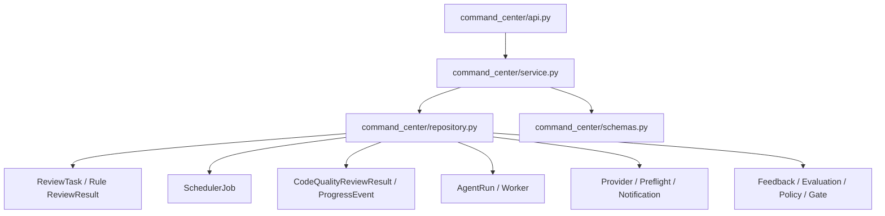

# AI Review Command Center Implementation Plan

基线文档：[AI Review Command Center Design Proposal.md](/D:/projects/ai-code-review-platform/docs/AI Review Center Design/AI Review Command Center Design Proposal.md)

## 当前执行状态

- 当前阶段：`Phase 0`
- 阶段状态：`COMPLETED — WAITING FOR PHASE 1 CONFIRMATION`
- 用户授权时间：2026-07-31
- 阶段完成时间：2026-07-31
- 本阶段目标：只落地只读基础接口、固定响应契约、首页骨架和根路由切换。
- 本阶段明确不做：真实全量聚合、轮询、Canvas、粒子动画、任务聚焦、AppFrame 轮询去重。
- 停止点：已到达。等待用户确认进入 Phase 1。

本计划同时作为分阶段实施总控和验收记录。每个阶段开始前更新状态，完成后回写验证结果并停止。

### Phase 0 实施结果

- 后端新增独立 `command_center` 只读投影模块并注册 Router。
- `GET /api/command-center/runtime` 返回 Task、Review Job 基础计数和 Deferred coverage。
- `GET /api/command-center/governance` 返回 Pending Feedback、Evaluation Case 基础计数和 Deferred coverage。
- 两个接口支持 `windowHours`、`projectId`、`groupId` 等计划内参数；非法参数遵循平台统一错误契约返回 `400 VALIDATION_ERROR`。
- 前端 `/` 已切换为 `CommandCenterPage`，`/tasks`、`/tasks/:taskId` 和 `/?taskId=...` 历史跳转保持不变。
- 首页包含 System Pulse、静态生命周期骨架、Live Operations Rail 和 Governance Loop。
- Phase 0 仅首次加载两个只读快照；未实现轮询、Canvas 或模拟运行数据。
- 未新增数据表、迁移、领域模型、动画依赖或业务写入逻辑。

### Phase 0 验证结果

- 后端目标测试：`6 passed`
- 前端 Command Center 信息架构测试：`4 passed`
- 前端全量 Node 测试：`65 passed`
- 前端生产构建：通过
- 本次后端文件定向 Ruff：通过
- `git diff --check`：通过，仅有仓库现有的 Windows LF/CRLF 提示
- 全量后端 Ruff 仍被 5 个本阶段外的既有未使用导入/变量问题阻断；本阶段未越权修改这些文件。
- Vite 继续报告既有主 Bundle 大于 500 kB 的提示；路由级拆包不属于 Phase 0，保留到后续性能阶段处理。

## 0. 实施结论与边界

核心方案：

- 后端新增独立 `command_center` 只读投影模块。
- 不修改现有 Webhook、规则分析、AI 调度、Agent、通知或治理逻辑。
- 不新增业务表，不修改领域模型，不在第一阶段增加数据库索引。
- 前端只在 `App.jsx` 做导入、路由和导航级改动。
- Command Center 页面全部放入独立 `command-center/` 目录。
- Phase 0～1 先完成真实数据和静态拓扑，Phase 2 才引入 Canvas 动画。
- 现有任务详情 Canvas 对外契约保持不变。
- 每个 Phase 完成后必须停止，等待用户验证并明确确认继续。

------

# 一、代码影响分析

## 1.1 Phase 0 实施前入口

### 前端

Phase 0 实施前首页 [App.jsx (line 11782)](D:/projects/ai-code-review-platform/frontend/src/App.jsx:11782) 中：

```
function HomePage() {
  // 保留 /?taskId=... 历史跳转
  return <TaskListPage />;
}
```

Phase 0 实施前路由：

- `/`：任务列表
- `/tasks`：任务列表
- `/tasks/:taskId`：任务详情
- 质量治理、设置、版本、帮助等独立路由

`AppFrame` 还负责：

- 顶部导航
- Job Queue 5 秒轮询
- AI Review 失败通知轮询
- Queue/Failure Drawer
- 任务详情沉浸式布局控制

### 后端

所有 Router 在 [main.py (line 80)](D:/projects/ai-code-review-platform/backend-python/app/main.py:80) 中集中注册。Phase 0 实施前没有 `command_center` 模块。

## 1.2 新增文件

### 后端新增

```
backend-python/app/command_center/
  __init__.py
  api.py
  schemas.py
  repository.py
  service.py

backend-python/tests/
  contract/test_command_center_api_contract.py
  unit/test_command_center_service.py
```

职责：

| 文件            | 职责                                                      |
| --------------- | --------------------------------------------------------- |
| `api.py`        | `/api/command-center` Router、查询参数校验、响应封装      |
| `schemas.py`    | Runtime/Governance 响应 DTO、枚举和 schema version        |
| `repository.py` | 只读 SQLAlchemy SELECT、批量加载和聚合查询                |
| `service.py`    | 当前阶段派生、状态映射、风险/Context/Fallback 汇总        |
| contract test   | 接口、字段、安全边界、空数据、多模型和 Fallback 契约      |
| unit test       | 阶段映射、Provider 观察状态、风险聚合、时间窗口和截断逻辑 |

禁止新增：

- `models.py`
- 数据表
  -迁移脚本
- 后台任务
- 写入 Repository

### 前端新增

```
frontend/src/command-center/
  CommandCenterPage.jsx
  CommandCenterCanvas.jsx
  CommandCenterTopology.jsx
  SystemPulse.jsx
  LiveOperationsRail.jsx
  GovernanceLoop.jsx
  useCommandCenterSnapshots.js
  commandCenterApi.js
  commandCenterModel.js
  commandCenterPresentation.js
  commandCenterCanvasRenderer.js
  commandCenter.css

frontend/src/canvas/
  canvasRuntime.js

frontend/tests/
  commandCenterModel.test.mjs
  commandCenterPresentation.test.mjs
  commandCenterCanvasRenderer.test.mjs
  commandCenterInformationArchitecture.test.mjs
```

其中 `canvasRuntime.js` 在 Phase 2 才新增。

## 1.3 修改文件

| 文件                                                         | 修改内容                                                     | 阶段              |
| ------------------------------------------------------------ | ------------------------------------------------------------ | ----------------- |
| [backend-python/app/main.py (line 11)](D:/projects/ai-code-review-platform/backend-python/app/main.py:11) | 导入并注册 `command_center_router`                           | Phase 0           |
| [frontend/src/App.jsx (line 11782)](D:/projects/ai-code-review-platform/frontend/src/App.jsx:11782) | 导入 CommandCenter、修改 `/` 内容、导航选中态和品牌跳转      | Phase 0           |
| [frontend/src/reviewCanvasRenderer.js (line 124)](D:/projects/ai-code-review-platform/frontend/src/reviewCanvasRenderer.js:124) | 将通用 Canvas 生命周期委托给 `canvasRuntime.js`，保持现有 API | Phase 2           |
| 设计/实施文档                                                | 登记当前 Phase、接口契约、验收结果和停止点                   | 各阶段开始/完成时 |

`App.jsx` 的修改必须限制在：

- 新组件 import
- `HomePage` 返回值
- `isCommandCenterRoute` / `isTaskRoute`
- 顶部 Command Center 导航
- 品牌跳转
- 必要的数据轮询去重

不把页面 JSX、状态映射或 Canvas 逻辑写入 `App.jsx`。

## 1.4 保持不动

### 后端保持不动

- `project_integration/`
- `change_analysis/`
- `risk_engine/`
- `rule_template/`
- `review_record/service.py`
- `code_quality/service.py`
- `code_quality/providers.py`
- `agent_review/service.py`
- `agent_review/worker.py`
- `notification/service.py`
- `review_feedback/service.py`
- `evaluation/service.py`
- 所有现有领域模型
- 所有现有迁移
- 现有 API 路径和响应

新接口只读取这些模块拥有的数据，不调用它们的业务写入方法。

### 前端保持不动

- [ReviewImmersiveCanvas.jsx (line 4)](D:/projects/ai-code-review-platform/frontend/src/ReviewImmersiveCanvas.jsx:4)
- `reviewJourney.js`
- `reviewJourneyPresentation.js`
- `reviewImmersivePresentation.js`
- `agentReviewTrace.js`
- `agentWorkerPool.js`
- `api.js`
- `main.jsx`
- `MuiAppShell.jsx`
- `muiTheme.js`
- 现有任务详情、Finding、Diff、Patch、设置和治理页面
- `package.json`：不增加动画或 Canvas 依赖
- `styles.css`：Command Center 使用独立 CSS 文件，不继续扩张全局样式

------

# 二、后端实现方案

## 2.1 模块调用关系



所有调用方向都是读取。API 请求期间不得：

- `commit`
- `flush`
- 新建默认配置
- 清理 Worker
- 修改任务状态
- 创建表、补列或补索引

尤其不要复用带 `ensure_*_schema`、默认记录创建或 stale cleanup 副作用的现有查询入口。

## 2.2 Controller/API

### Router

```
router = APIRouter(
    prefix="/api/command-center",
    tags=["command-center"],
)
```

在 `main.py` 中注册：

```
app.include_router(command_center_router)
```

### Runtime API

```
GET /api/command-center/runtime
```

建议参数：

| 参数          | 默认值 | 约束   | 用途                         |
| ------------- | ------ | ------ | ---------------------------- |
| `windowHours` | 24     | 1～168 | 最近完成、失败和告警时间窗口 |
| `activeLimit` | 20     | 1～50  | 单独展示的活跃 Flow 上限     |
| `alertLimit`  | 20     | 1～50  | 告警上限                     |
| `projectId`   | 空     | 可选   | 项目过滤                     |
| `groupId`     | 空     | 可选   | 项目组过滤                   |

响应版本：

```
{
  "schemaVersion": "command-center-runtime-v1",
  "generatedAt": "2026-07-31T10:00:00Z",
  "window": {
    "from": "...",
    "to": "..."
  },
  "intake": {},
  "activeTasks": [],
  "activeFlows": [],
  "scheduler": {},
  "standard": {},
  "agent": {},
  "providersObserved": [],
  "alerts": [],
  "coverage": {}
}
```

### Governance API

```
GET /api/command-center/governance
```

建议参数：

- `windowHours=24`
- `projectId`
- `groupId`

响应版本：

```
{
  "schemaVersion": "command-center-governance-v1",
  "generatedAt": "...",
  "window": {},
  "ruleAnalysis": {},
  "preflight": {},
  "contextQuality": {},
  "findingRisk": {},
  "notifications": {},
  "feedback": {},
  "evaluation": {},
  "policies": {},
  "coverage": {}
}
```

Evaluation、Acceptance Gate 等如果采用全量当前状态，应在对应节点标注：

```
{
  "scope": "ALL_TIME"
}
```

不得让用户误以为所有治理指标都属于最近 24 小时。

## 2.3 Service 职责

`service.py` 只处理纯业务投影：

1. 计算查询时间窗口。
2. 把多表记录组装为 `activeTasks`。
3. 按 `(taskId, reviewKey)` 组装 `activeFlows`。
4. 派生当前生命周期阶段。
5. 区分 Standard、Agent 和 Standard Fallback。
6. 生成安全的 Provider 观察状态。
7. 聚合 Finding severity/contextStatus。
8. 聚合 Rule、Preflight、Notification 和 Governance。
9. 输出截断、覆盖范围和数据新鲜度信息。
10. 不返回任何敏感原文。

### 当前阶段派生

阶段来源优先级：

1. Scheduler Job 的 `QUEUED/RUNNING/FAILED`
2. AgentRun 和 `AGENT_*` Progress
3. 最新 ProgressEvent
4. CodeQualityReviewResult 状态
5. Rule ReviewResult 是否存在
6. ReviewTask 技术状态

建议统一阶段：

```
INTAKE
RULE_ANALYSIS
RULE_COMPLETED
PREFLIGHT
QUEUED
CONTEXT_BUILDING
MODEL_CALLING
AGENT_ANALYZING
AGENT_TOOL_ACTIVITY
AGENT_CONVERGING
AGENT_SUBMITTING
FINDING_READY
NOTIFYING
COMPLETED
FAILED
SKIPPED
FALLBACK
```

每个 Flow 返回：

```
{
  "stage": "CONTEXT_BUILDING",
  "stageSource": "PROGRESS"
}
```

如果只能根据“任务运行中但还没有 RuleResult”推断，则：

```
{
  "stage": "RULE_ANALYSIS",
  "stageSource": "INFERRED"
}
```

前端必须能区分真实进度与推断状态。

### Fallback 判断

只在以下事实成立时标记：

```
requestedEngine = AGENT
effectiveEngine = STANDARD_FALLBACK
```

或 AgentRun 明确记录 `effective_engine=STANDARD_FALLBACK`。

不能仅根据 Agent 失败和同时存在 Standard 结果猜测 Fallback。

### Provider 状态

允许：

- `CONFIGURED`
- `DISABLED`
- `ACTIVE`
- `RECENT_SUCCESS`
- `RECENT_FAILURE`
- `NO_RECENT_DATA`

禁止：

- `HEALTHY`
- `UNHEALTHY`
- `UP`
- `DOWN`

除非未来真正增加持久化健康检测。

## 2.4 Repository 数据来源

| 首页对象      | 数据来源                                                |
| ------------- | ------------------------------------------------------- |
| Intake、Task  | `ReviewTask`、`Project`、`ProjectGroup`                 |
| Rule Analysis | `review_record.models.ReviewResult`                     |
| Scheduler     | `CodeQualitySchedulerJob`                               |
| Standard Flow | `CodeQualityReviewResult`                               |
| 当前阶段      | `CodeQualityReviewProgressEvent`                        |
| Agent Flow    | `AgentReviewRun`                                        |
| Worker        | `AgentReviewWorker`、只读 `AgentReviewSettings`         |
| Provider      | `CodeQualityModelProvider`、`CodeQualityReviewSettings` |
| Preflight     | `DeterministicCheckRun`                                 |
| Finding       | `CodeQualityReviewResult.findings_json`                 |
| Notification  | `NotificationRecord`                                    |
| Feedback      | `ReviewItemFeedback`                                    |
| Evaluation    | `EvaluationCase`、`EvaluationRun`                       |
| Policy        | `ProjectReviewPolicy`                                   |
| Acceptance    | `ReviewQualityAcceptanceGate`                           |

注意存在两个名称相近但语义不同的 Result：

- `review_record.models.ReviewResult`：规则分析和风险卡片结果
- `code_quality.models.CodeQualityReviewResult`：AI Review 结果

实现中禁止使用含混别名，建议分别命名为：

```
RuleReviewResult
AiReviewResult
```

## 2.5 查询策略

### Runtime

先确定有限集合，再批量加载关联数据：

1. 查询全部 `QUEUED/RUNNING` Review Job。
2. 查询 `RUNNING/REVIEWING` Task。
3. 合并并限制需要展开的 Task ID。
4. 一次性加载这些 Task 的：
   - Rule Result
   - AI Result
   - Progress
   - AgentRun
   - Notification
5. 在 Python 中按 `taskId/reviewKey` 归组。

不得对每个 Task 单独查询 Result/Progress/Notification。

### Governance

优先在数据库中完成：

- `COUNT`
- `GROUP BY status`
- `GROUP BY severity`
- 时间窗口过滤

Finding 的 `contextStatus` 位于 JSON Text 中，需要在 Python 中解析。第一阶段应：

- 只读取窗口内完成的结果。
- 设置最大扫描结果数，例如 2,000。
- 超出时返回 `coverage.truncated=true`。
- 不读取 `raw_output`。
- 不读取 Evidence、Suggestion、Body 等不需要字段。
- 后续只有真实规模证明存在问题时，才考虑物化统计。

### Progress

为兼容 MySQL 5.7：

- 不依赖 `ROW_NUMBER()` 等窗口函数。
- 对受限 Task 集合按 `created_at DESC, id DESC` 查询。
- 在 Python 中选出每个 `(taskId, reviewKey)` 的最新事件。
- 不解析或返回 Progress `detail` 原文。

## 2.6 安全边界

新接口不得返回：

- Provider API Key 或 masked key
- Endpoint URL
- Notification target/Webhook URL
- Prompt
- Diff、源码、路径内容
- Agent input/completion context
- Progress detail 原文
- Provider raw output
- Finding body/evidence/suggestion
- Feedback 人工长文本
- Policy content

首页只需要标识、状态、计数、时间、风险等级和安全摘要。

## 2.7 查询性能风险

### 主要风险

1. 首页 5 秒轮询放大数据库查询。
2. `findings_json` 解析形成 CPU 和内存压力。
3. Progress 表持续增长。
4. AppFrame 现有 Queue/Failure 轮询可能与首页重复。
5. 多个 SELECT 之间可能看到略有差异的快照。
6. 当前多数模型未声明适合全局聚合的索引。

### 约束措施

- Runtime 和 Governance 拆成不同刷新频率。
- 查询数量与 Task 数量解耦，保持常数级批量查询。
- 活跃 Flow、告警、JSON 扫描均设置硬上限。
- 返回 `generatedAt`、`coverage` 和 `truncated`。
- 首页请求失败时前端保留最后成功数据，但停止流动动画。
- Phase 3 消除首页与 AppFrame 的重复轮询。
- MySQL 上执行 `EXPLAIN` 后再决定索引。
- 第一轮不修改模型和迁移；如确需索引，单独形成后续小阶段并等待确认。

------

# 三、前端实现方案

## 3.1 CommandCenterPage

职责：

- 页面编排
- Runtime/Governance Snapshot 生命周期
- 当前选中 Task/Flow
- 数据新鲜度和错误状态
- 响应式布局
- 页面隐藏/恢复
- 将安全的 Presentation 传入各子组件

不负责：

- 绘制 Canvas
- 解析后端原始 Progress
- 直接拼接 API URL
- 保存业务数据

## 3.2 SystemPulse

展示：

- generatedAt / Fresh / Stale
- 活跃 Task
- 活跃 Flow
- Scheduler Active
- Worker Online/Total
- Busy/Draining
- 24 小时失败数
- 当前最高风险
- Pending Feedback

状态只来自 Presentation，不自行统计。

API 成功不等于依赖全部健康，因此文案使用：

- 数据可用
- Worker 在线
- Provider 最近成功
- Provider 最近失败

不使用“平台全健康”。

## 3.3 LiveOperationsRail

展示：

- Queued / Running Flow
- Agent Fallback
- Job/Result/Agent Failure
- Worker Offline/Draining
- Expired Lease
- Notification Failure
- Critical Finding

支持：

- 点击 Task 进入 `/tasks/:taskId`
- 点击 Queue 打开现有 Queue Drawer
- 点击治理告警进入已有治理页面

第一阶段不在这里提供 Cancel/Retry。

## 3.4 GovernanceLoop

展示低频快照：

- Feedback 状态
- Context Missing
- Evaluation Verdict
- Policy Candidate/Enabled
- Acceptance Gate
- Agent 样本门禁

不播放持续动画。

## 3.5 CommandCenterTopology

Phase 1 的语义 DOM 拓扑，也是：

- Canvas 失败回退
- reduced-motion 强回退
- 移动端布局
- 无障碍信息源

它必须在没有 Canvas 时完整表达：

```
Intake → Rule → Preflight → Standard/Agent → Finding → Notification
                              ↓
                         Governance Loop
```

## 3.6 CommandCenterCanvas

职责：

- 创建/销毁 Canvas Controller
- 接收 Presentation Scene
- 处理 reduced-motion
- 暴露只读性能诊断属性
- Canvas 失败时切换至 `CommandCenterTopology`

不得接收：

- 原始 API 响应
- Progress detail
- Finding 正文
- Diff
- Prompt
- Provider 响应
- 业务写操作回调

## 3.7 数据层

### `commandCenterApi.js`

只封装：

```
loadRuntimeSnapshot()
loadGovernanceSnapshot()
```

复用现有 `fetchApi`，不创建第二套请求封装。

### `useCommandCenterSnapshots.js`

负责：

- Runtime 5 秒轮询
- Governance 60 秒轮询
- 页面隐藏暂停
- focus/visibility 恢复立即刷新
- AbortController 或请求序号防止旧响应覆盖新响应
- 保留最后成功快照
- 数据过期标记
- 卸载清理

### `commandCenterModel.js`

负责：

- API 默认值归一化
- schemaVersion 检查
- Task/Flow ID 生成
- 列表硬上限
- Previous/Next Snapshot 对账

### `commandCenterPresentation.js`

负责：

- 节点、边和 Flow Scene
- UI 文案
- 风险和状态视觉 token
- 是否允许动画
- Fallback、Failed 等一次性过渡事件

------

# 四、Canvas 技术方案

## 4.1 当前能力评估

现有 [reviewCanvasRenderer.js (line 1)](D:/projects/ai-code-review-platform/frontend/src/reviewCanvasRenderer.js:1) 已具备：

- 固定种子粒子布局
- 宽度分档粒子上限
- DPR 1～2 限制
- 单 RAF
- ResizeObserver
- 页面隐藏暂停
- reduced-motion
- 初始化/绘制失败清理
- Controller dispose
- 帧数和绘制耗时诊断

但它当前只支持：

- `STANDARD_FLOW`
- `AGENT_PARTICLE`
- 单一中心视觉
- 单个状态参数

它不支持：

- 多节点拓扑
- 多条并发 Flow
- Task → 多 reviewKey 分裂
- 不同粒子类型
- Fallback 重定向路径
- Scene diff
- 节点选择
- DOM Overlay 对齐

因此不能直接让 `CommandCenterCanvas` 使用 `createReviewCanvasController()`。

## 4.2 建议重新抽象的部分

Phase 2 新增：

```
frontend/src/canvas/canvasRuntime.js
```

抽取通用能力：

- Canvas/2D Context 初始化
- ResizeObserver
- DPR 同步
- RAF 生命周期
- 页面可见性
- reduced-motion
- 错误回调
- dispose
- 性能诊断
- 单实例约束

保留适配器：

```
createReviewCanvasController(options)
```

对 `ReviewImmersiveCanvas` 的调用方式不变。

新增：

```
createCommandCenterCanvasController(options)
```

两类 Renderer 只共享运行时，不共享业务 Scene 和绘制函数。

## 4.3 Scene 模型

### 静态节点

```
{
  id,
  type,
  label,
  x,
  y,
  status,
  count,
  ariaLabel,
  navigationTarget
}
```

类型：

```
GITLAB_EVENT
MANUAL_TRIGGER
REVIEW_TASK
RULE_ANALYSIS
PREFLIGHT
STANDARD_FLOW
CONTEXT
PROVIDER
AGENT_FLOW
AGENT_WORKER
FINDING
NOTIFICATION
FEEDBACK
EVALUATION
POLICY
```

### 边

```
{
  id,
  from,
  to,
  kind,
  state
}
```

`kind`：

- `PRIMARY`
- `STANDARD`
- `AGENT`
- `FALLBACK`
- `GOVERNANCE`

### 动态粒子

```
{
  id,
  kind,
  taskId,
  reviewKey,
  engine,
  state,
  pathId,
  progress,
  severity,
  aggregatedCount,
  seed
}
```

粒子必须由真实 Snapshot 生成。`seed` 由 `taskId + reviewKey` 确定，轮询更新时位置不能随机跳变。

## 4.4 核心粒子模型

| 对象          | 来源                            | Canvas 行为                          |
| ------------- | ------------------------------- | ------------------------------------ |
| GitLab Event  | `ReviewTask.triggerType`        | 从 GitLab 入口到 Rule 节点           |
| ReviewTask    | `ReviewTask`                    | 进入核心；多 reviewKey 时分裂        |
| Standard Flow | `SchedulerJob + AiReviewResult` | Queue → Context → Provider → Finding |
| Agent Flow    | `SchedulerJob + AgentRun`       | Queue → Worker → MCP/Model → Finding |
| Finding       | AI Result 聚合                  | 按真实 severity 生成有限风险粒子     |
| Notification  | NotificationRecord              | Result → DingTalk；失败停在节点      |

## 4.5 状态动画

| 后端事实              | Visual State          | 动画                                 |
| --------------------- | --------------------- | ------------------------------------ |
| Job `QUEUED`          | `QUEUED`              | 停留轨道、公转，不前进               |
| Job/Result `RUNNING`  | `RUNNING`             | 路径流动、节点呼吸                   |
| Job/Result/Run Failed | `FAILED`              | 仅在状态变化时播放一次收缩，之后静态 |
| Agent → Standard      | `FALLBACK`            | 琥珀弧线从 Agent 重定向到 Standard   |
| `AGENT_ANALYZING`     | `AGENT_ANALYZING`     | Worker 周围证据轨道                  |
| `AGENT_TOOL_ACTIVITY` | `AGENT_TOOL_ACTIVITY` | Worker 与工具节点往返                |
| `AGENT_CONVERGING`    | `AGENT_CONVERGING`    | 轨道收束                             |
| `AGENT_SUBMITTING`    | `AGENT_SUBMITTING`    | 单粒子发送至 Finding                 |
| Completed             | `COMPLETED`           | 静态结果节点，不持续播放             |
| Stale Data            | `STALE`               | 停止所有流动，仅保留静态拓扑         |

### 转换规则

- 初次加载已有 Failed/Fallback 记录：显示静态状态，不回放历史动画。
- 只有 Previous Snapshot → Next Snapshot 发生状态变化时，才触发一次性动画。
- API 失败或数据过期时，不根据本地时间继续伪造阶段推进。
- `AGENT_ANALYZING` 只能由真实 Agent Progress 触发。

## 4.6 性能预算

沿用现有 Canvas 基线：

- 单页面一个 Command Center Canvas
- 单 RAF
- 单 ResizeObserver
- 单 visibility listener
- DPR 最大 2
- 390px：最多 48 粒子
- 1024px：最多 80 粒子
- 1440px：最多 120 粒子
- 独立活跃 Flow 最多 20，其余聚合
- 平均绘制耗时目标不超过 8ms/帧
- 零尺寸、隐藏页面、reduced-motion 不持续绘制
- 不使用 WebGL、远程资源、图片、视频或动画库

------

# 五、开发拆分阶段

## Phase 0：基础接口和页面骨架

### 目标

先确定接口结构、数据 DTO、模块边界和路由，不实现复杂聚合和 Canvas。

### 修改范围

后端：

- 新增 `command_center/` 模块
- 注册 Router
- 建立 Runtime/Governance schema
- 实现空数据和基础计数的只读响应
- 新增接口契约测试

前端：

- 新增 `command-center/` 基础组件
- `/` 切换到 `CommandCenterPage`
- `/tasks` 保留任务列表
- 保留 `/?taskId=` 历史跳转
- 增加“指挥中心”导航
- 页面显示 loading/empty/error 骨架
- 不创建 Canvas

### 验收标准

- 两个接口返回 200 和固定 schemaVersion。
- 空数据库返回合法空结构。
- 接口执行期间无 INSERT/UPDATE/DELETE/DDL。
- 所有现有 API 路径不变。
- `/` 显示 Command Center 骨架。
- `/tasks` 和 `/tasks/:taskId` 行为不变。
- `App.jsx` 只增加路由级代码。
- 前端 build 通过。
- 完成后停止，等待确认 Phase 1。

## Phase 1：静态拓扑与真实数据

### 目标

用真实聚合数据完整展示运行链路，但不实现动态 Canvas。

### 修改范围

后端：

- 完成 Runtime 聚合
- 完成 Governance 聚合
- 多模型 `activeFlows`
- Standard/Agent/Fallback
- Worker、Provider 观察状态
- Rule、Preflight、Finding、Context、Notification
- Feedback、Evaluation、Policy、Acceptance
- 截断和覆盖范围

前端：

- 完成数据 Hook
- 完成 SystemPulse
- 完成静态 CommandCenterTopology
- 完成 LiveOperationsRail
- 完成 GovernanceLoop
- 实现 Fresh/Stale
- 基础导航到现有页面
- 5 秒/60 秒轮询

### 验收标准

- 一个 Task 的多个 `reviewKey` 显示为多个 Flow。
- Agent Fallback 只依据真实字段出现。
- Provider 不显示虚假 Health。
- Worker Offline/Draining、Expired Lease 可识别。
- Critical Finding 和 Notification Failed 可识别。
- 页面不请求每个 Task 的详情接口。
- 查询数量不随 Task 数线性增长。
- 响应不含敏感字段。
- 390/1024/1440 静态布局可用。
- 完成后停止，等待确认 Phase 2。

## Phase 2：Canvas 粒子动画

### 目标

在 Phase 1 真实数据和语义拓扑之上增加粒子视觉，不改变业务含义。

### 修改范围

- 抽取 `canvasRuntime.js`
- 保持 Review Canvas API 兼容
- 新增 Command Center Renderer
- 实现粒子 Scene
- 实现 Queued/Running/Failed/Fallback/Agent 状态动画
- reduced-motion
- Canvas failure fallback
- 性能诊断

### 验收标准

- 现有 `reviewCanvasRenderer` 全部测试继续通过。
- `ReviewImmersiveCanvas.jsx` 无需修改。
- 一个 Canvas、一个 RAF、一个 Observer、一个 visibility listener。
- 轮询更新不重建 Canvas。
- 无真实活动时无粒子流动。
- Failed/Fallback 历史状态不重复回放。
- Stale 时停止动画。
- 平均绘制耗时不超过 8ms/帧。
- 1440/1024/390 均无溢出。
- 完成后停止，等待确认 Phase 3。

## Phase 3：交互与性能优化

### 目标

补齐任务聚焦、钻取、重复轮询治理、响应式和长时间运行稳定性。

### 修改范围

- 选择 Task/Flow
- 聚焦多 Review 分支
- 点击节点进入现有页面
- Queue/Failure Drawer 联动
- 首页与 AppFrame 轮询去重
- 请求竞态和取消
- 长时间轮询稳定性
- DOM Overlay 和键盘交互
- 移动端静态降级
- MySQL 查询计划验证

### 验收标准

- Task 选择不会重建 Canvas。
- 选中 Flow 与右侧 Live Ops 同步。
- 键盘可访问主要节点和跳转。
- Canvas 失败后所有关键信息仍可见。
- 首页不会与 AppFrame 重复持续拉取相同队列数据。
- 页面隐藏期间无轮询和 RAF。
- 恢复后只发起一轮刷新。
- 长时间运行无 Timer、RAF、Observer、Listener 累积。
- MySQL 查询计划无全表高频扫描；如需要索引，停止并单独申请下一阶段。
- 完成后停止，等待部署或真实环境验收确认。

------

# 六、风险分析

## 6.1 Canvas 性能

风险：

- 多节点、多路径、多 Flow 比现有单核心 Canvas 更复杂。
- 高频轮询可能反复生成 Scene。
- 粒子数量可能随任务数量增长。

控制：

- 粒子硬上限 48/80/120。
- 独立 Flow 最大 20。
- Scene 使用稳定 ID 和增量对账。
- DOM 负责文字和点击，Canvas 不绘制复杂文本。
- 单 RAF、DPR≤2、隐藏/零尺寸暂停。
- 保留 DOM 静态拓扑作为失败和移动端回退。

## 6.2 App.jsx 过大

风险：

- 当前 `App.jsx` 已集中大量页面。
- 继续添加首页 JSX 会加剧耦合和构建体积。

控制：

- `App.jsx` 只做 import、route、nav。
- 数据、组件、状态、Canvas、CSS 全部放入 `command-center/`。
- 不在本专项顺带拆分整个 `App.jsx`，避免范围失控。
- 后续可单独规划现有页面模块化。

## 6.3 首页接口压力

风险：

- Runtime 5 秒轮询。
- 多用户同时打开首页。
- JSON Finding 和 Progress 表持续增长。
- AppFrame 已有 Queue/Failure 轮询。

控制：

- Runtime/Governance 分频。
- 批量查询、无 N+1。
- 时间窗口和数量硬上限。
- Findings JSON 扫描上限与 `truncated` 标识。
- Phase 3 去除重复轮询。
- 不在第一阶段增加缓存或物化表。
- 使用真实 MySQL `EXPLAIN` 决定是否需要索引。

## 6.4 数据实时性

风险：

- 多个 SELECT 之间不是同一绝对时刻。
- Progress、Job 和 Result 可能短暂不一致。
- 轮询响应可能乱序。

控制：

- 每个响应携带 `generatedAt`。
- 每项返回 `updatedAt` 和 `stageSource`。
- 前端拒绝较旧响应覆盖新响应。
- 最后成功快照可保留，但标为 STALE。
- STALE 状态停止动画。
- 不为了强一致性持有长事务或锁业务表。

## 6.5 动画与真实状态一致性

风险：

- 将技术状态错误翻译为业务动画。
- 用户误认为本地循环动画代表模型仍在工作。
- Fallback/Failed 被反复播放。
- 新增 Progress phase 后映射过期。

控制：

- 只有白名单状态触发动画。
- 未识别 phase 显示通用 `RUNNING`，不猜测 Thinking。
- 一次性动画只根据前后 Snapshot 状态差异触发。
- 后端返回 `stageSource`。
- 在单元测试中固定所有已知 phase 映射。
- 新增 Progress phase 时必须同步更新 Command Center 映射测试。

## 6.6 其他风险

| 风险                   | 控制                                                         |
| ---------------------- | ------------------------------------------------------------ |
| 敏感信息进入首页       | 使用字段白名单；契约测试断言不存在 rawOutput、detail、API Key、Webhook、Prompt |
| MySQL 5.7 兼容         | 不使用窗口函数和 JSON_TABLE；有限集合在 Python 归组          |
| 质量治理指标口径混淆   | 每个区块标注 `24H` 或 `ALL_TIME`                             |
| 全局 Provider 健康误导 | 仅显示配置和最近观察状态                                     |
| Rule 阶段缺少 Progress | 显示 `stageSource=INFERRED`                                  |
| 空闲系统仍有动画       | 无活跃 Flow 时只显示静态核心                                 |
| 前端 Bundle 继续变大   | 不新增依赖；Command Center 独立模块，为后续路由级拆包预留边界 |

------

## 验证策略

后端每阶段执行相关最小测试：

- `test_command_center_service.py`
- `test_command_center_api_contract.py`
- 涉及 Agent/质量汇总时补跑对应现有 contract tests

前端：

- `node --test frontend/tests/commandCenter*.test.mjs`
- Phase 2 同时执行 `frontend/tests/reviewCanvasRenderer.test.mjs`
- 最终执行 `scripts/run-frontend.cmd build`

Phase 2/3 浏览器验收：

- 1440 × 900
- 1024 × 800
- 390 × 844
- Agent Running
- Standard Running
- Agent → Standard Fallback
- Failed
- 无任务空闲
- Stale/接口失败
- reduced-motion
- Canvas 初始化失败回退
