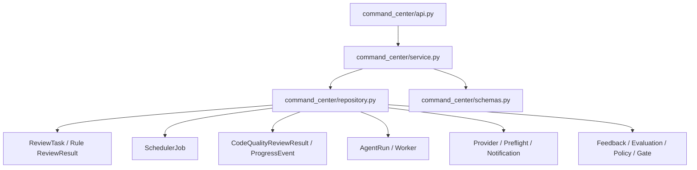

# AI Review Command Center Implementation Plan

基线文档：[AI Review Command Center Design Proposal.md](/D:/projects/ai-code-review-platform/docs/AI Review Center Design/AI Review Command Center Design Proposal.md)

## 当前执行状态

- 当前阶段：`Phase 4A`
- 阶段状态：`PHASE 4A COMPLETED — WAITING FOR STRUCTURE AND COLOR CONFIRMATION`
- Phase 0 基线 Commit：`2005b8f`
- Phase 1 基线 Commit：`0cbb148`
- Phase 2 拆分确认时间：2026-07-31
- Phase 2A 授权时间：2026-07-31
- Phase 2A 完成时间：2026-07-31
- Phase 2B 授权时间：2026-07-31
- Phase 2B 完成时间：2026-07-31
- Phase 2C 授权时间：2026-07-31
- Phase 2C 完成时间：2026-07-31
- Phase 2D 授权时间：2026-07-31
- Phase 2 人工验收完成时间：2026-08-01
- Phase 2 人工验收结论：通过；用户接受 visibility 真实浏览器证据缺口和 390px AppFrame 导航风险转入 Phase 3。
- Phase 3 授权时间：2026-08-01
- Phase 3 Command Center 查询索引与迁移授权时间：2026-08-01
- Phase 3 完成时间：2026-08-01
- Phase 4 基线 Commit：`58f2b0b`
- Phase 4 授权时间：2026-08-03
- Phase 4A 完成时间：2026-08-03
- Phase 3 输入风险：浏览器 hidden/visible 证据缺口；Runtime/Governance、focus/visibility 恢复可能重复刷新；390px AppFrame 导航裁切与可见横向滚动条。
- Phase 2D MySQL 兼容性热修复授权时间：2026-07-31
- 计划更新时间：2026-08-03
- 当前目标：完成 Phase 4A 一屏生命周期地图、Runtime-only 首页轮询、紧凑工具条与 Flow Dock，以及赛博霓虹高对比静态视觉基线。
- 当前明确不做：Phase 4A 不加入环境动态、能量通道、粒子尾迹、冲击波或 `controller.setFocus` 绘制增强；不修改 Python 后端、数据库、索引、业务状态机、公开 API、主 Bundle 拆包或第三方动画依赖。
- 停止点：Phase 4A 完成专项/全量测试、构建和 1440/1024/390 浏览器截图后提交并立即停止，等待用户确认结构与颜色；未确认前不进入 Phase 4B。

本计划同时作为分阶段实施总控和验收记录。每个阶段开始前更新状态，完成后回写验证结果并停止。

### Phase 0 实施结果

- 后端新增独立 `command_center` 只读投影模块并注册 Router。
- `GET /api/command-center/runtime` 返回 Task、Review Job 基础计数和 Deferred coverage。
- `GET /api/command-center/governance` 返回 Pending Feedback、Evaluation Case 基础计数和 Deferred coverage。
- 两个接口支持 `windowHours`、`projectId`、`groupId` 等计划内参数；非法参数遵循平台统一错误契约返回 `400 VALIDATION_ERROR`。
- 前端 `/` 已切换为 `CommandCenterPage`，`/tasks`、`/tasks/:taskId` 和 `/?taskId=...` 历史跳转保持不变。
- 首页包含 System Pulse、静态生命周期骨架、Live Operations Rail 和 Governance Loop。
- Phase 0 仅首次加载两个只读快照；未实现轮询、Canvas 或模拟运行数据。
- 未新增数据表、迁移、领域模型、动画依赖或业务写入逻辑。

### Phase 0 验证结果

- 后端目标测试：`6 passed`
- 前端 Command Center 信息架构测试：`4 passed`
- 前端全量 Node 测试：`65 passed`
- 前端生产构建：通过
- 本次后端文件定向 Ruff：通过
- `git diff --check`：通过，仅有仓库现有的 Windows LF/CRLF 提示
- 全量后端 Ruff 仍被 5 个本阶段外的既有未使用导入/变量问题阻断；本阶段未越权修改这些文件。
- Vite 继续报告既有主 Bundle 大于 500 kB 的提示；路由级拆包不属于 Phase 0，保留到后续性能阶段处理。

## 0. 实施结论与边界

核心方案：

- 后端新增独立 `command_center` 只读投影模块。
- 不修改现有 Webhook、规则分析、AI 调度、Agent、通知或治理逻辑。
- 不新增业务表，不修改领域模型，不在第一阶段增加数据库索引。
- 前端只在 `App.jsx` 做导入、路由和导航级改动。
- Command Center 页面全部放入独立 `command-center/` 目录。
- Phase 0～1 先完成真实数据和静态拓扑，Phase 2 才引入 Canvas 动画。
- 现有任务详情 Canvas 对外契约保持不变。
- 每个 Phase 完成后必须停止，等待用户验证并明确确认继续。

------

# 一、代码影响分析

## 1.1 Phase 0 实施前入口

### 前端

Phase 0 实施前首页 [App.jsx (line 11782)](D:/projects/ai-code-review-platform/frontend/src/App.jsx:11782) 中：

```
function HomePage() {
  // 保留 /?taskId=... 历史跳转
  return <TaskListPage />;
}
```

Phase 0 实施前路由：

- `/`：任务列表
- `/tasks`：任务列表
- `/tasks/:taskId`：任务详情
- 质量治理、设置、版本、帮助等独立路由

`AppFrame` 还负责：

- 顶部导航
- Job Queue 5 秒轮询
- AI Review 失败通知轮询
- Queue/Failure Drawer
- 任务详情沉浸式布局控制

### 后端

所有 Router 在 [main.py (line 80)](D:/projects/ai-code-review-platform/backend-python/app/main.py:80) 中集中注册。Phase 0 实施前没有 `command_center` 模块。

## 1.2 新增文件

### 后端新增

```
backend-python/app/command_center/
  __init__.py
  api.py
  schemas.py
  repository.py
  service.py

backend-python/tests/
  contract/test_command_center_api_contract.py
  unit/test_command_center_service.py
```

职责：

| 文件            | 职责                                                      |
| --------------- | --------------------------------------------------------- |
| `api.py`        | `/api/command-center` Router、查询参数校验、响应封装      |
| `schemas.py`    | Runtime/Governance 响应 DTO、枚举和 schema version        |
| `repository.py` | 只读 SQLAlchemy SELECT、批量加载和聚合查询                |
| `service.py`    | 当前阶段派生、状态映射、风险/Context/Fallback 汇总        |
| contract test   | 接口、字段、安全边界、空数据、多模型和 Fallback 契约      |
| unit test       | 阶段映射、Provider 观察状态、风险聚合、时间窗口和截断逻辑 |

禁止新增：

- `models.py`
- 数据表
  -迁移脚本
- 后台任务
- 写入 Repository

### 前端新增

```
frontend/src/command-center/
  CommandCenterPage.jsx
  CommandCenterCanvas.jsx
  CommandCenterTopology.jsx
  SystemPulse.jsx
  LiveOperationsRail.jsx
  GovernanceLoop.jsx
  useCommandCenterSnapshots.js
  commandCenterApi.js
  commandCenterModel.js
  commandCenterPresentation.js
  commandCenterCanvasRenderer.js
  commandCenter.css

frontend/src/canvas/
  canvasRuntime.js

frontend/tests/
  commandCenterModel.test.mjs
  commandCenterPresentation.test.mjs
  commandCenterCanvasRenderer.test.mjs
  commandCenterInformationArchitecture.test.mjs
```

其中 `canvasRuntime.js` 在 Phase 2 才新增。

## 1.3 修改文件

| 文件                                                         | 修改内容                                                     | 阶段              |
| ------------------------------------------------------------ | ------------------------------------------------------------ | ----------------- |
| [backend-python/app/main.py (line 11)](D:/projects/ai-code-review-platform/backend-python/app/main.py:11) | 导入并注册 `command_center_router`                           | Phase 0           |
| [frontend/src/App.jsx (line 11782)](D:/projects/ai-code-review-platform/frontend/src/App.jsx:11782) | 导入 CommandCenter、修改 `/` 内容、导航选中态和品牌跳转      | Phase 0           |
| [frontend/src/reviewCanvasRenderer.js (line 124)](D:/projects/ai-code-review-platform/frontend/src/reviewCanvasRenderer.js:124) | 将通用 Canvas 生命周期委托给 `canvasRuntime.js`，保持现有 API | Phase 2           |
| 设计/实施文档                                                | 登记当前 Phase、接口契约、验收结果和停止点                   | 各阶段开始/完成时 |

`App.jsx` 的修改必须限制在：

- 新组件 import
- `HomePage` 返回值
- `isCommandCenterRoute` / `isTaskRoute`
- 顶部 Command Center 导航
- 品牌跳转
- 必要的数据轮询去重

不把页面 JSX、状态映射或 Canvas 逻辑写入 `App.jsx`。

## 1.4 保持不动

### 后端保持不动

- `project_integration/`
- `change_analysis/`
- `risk_engine/`
- `rule_template/`
- `review_record/service.py`
- `code_quality/service.py`
- `code_quality/providers.py`
- `agent_review/service.py`
- `agent_review/worker.py`
- `notification/service.py`
- `review_feedback/service.py`
- `evaluation/service.py`
- 所有现有领域模型
- 所有现有迁移
- 现有 API 路径和响应

新接口只读取这些模块拥有的数据，不调用它们的业务写入方法。

### 前端保持不动

- [ReviewImmersiveCanvas.jsx (line 4)](D:/projects/ai-code-review-platform/frontend/src/ReviewImmersiveCanvas.jsx:4)
- `reviewJourney.js`
- `reviewJourneyPresentation.js`
- `reviewImmersivePresentation.js`
- `agentReviewTrace.js`
- `agentWorkerPool.js`
- `api.js`
- `main.jsx`
- `MuiAppShell.jsx`
- `muiTheme.js`
- 现有任务详情、Finding、Diff、Patch、设置和治理页面
- `package.json`：不增加动画或 Canvas 依赖
- `styles.css`：Command Center 使用独立 CSS 文件，不继续扩张全局样式

------

# 二、后端实现方案

## 2.1 模块调用关系



所有调用方向都是读取。API 请求期间不得：

- `commit`
- `flush`
- 新建默认配置
- 清理 Worker
- 修改任务状态
- 创建表、补列或补索引

尤其不要复用带 `ensure_*_schema`、默认记录创建或 stale cleanup 副作用的现有查询入口。

## 2.2 Controller/API

### Router

```
router = APIRouter(
    prefix="/api/command-center",
    tags=["command-center"],
)
```

在 `main.py` 中注册：

```
app.include_router(command_center_router)
```

### Runtime API

```
GET /api/command-center/runtime
```

建议参数：

| 参数          | 默认值 | 约束   | 用途                         |
| ------------- | ------ | ------ | ---------------------------- |
| `windowHours` | 24     | 1～168 | 最近完成、失败和告警时间窗口 |
| `activeLimit` | 20     | 1～50  | 单独展示的活跃 Flow 上限     |
| `alertLimit`  | 20     | 1～50  | 告警上限                     |
| `projectId`   | 空     | 可选   | 项目过滤                     |
| `groupId`     | 空     | 可选   | 项目组过滤                   |

响应版本：

```
{
  "schemaVersion": "command-center-runtime-v1",
  "generatedAt": "2026-07-31T10:00:00Z",
  "window": {
    "from": "...",
    "to": "..."
  },
  "intake": {},
  "activeTasks": [],
  "activeFlows": [],
  "scheduler": {},
  "standard": {},
  "agent": {},
  "providersObserved": [],
  "alerts": [],
  "coverage": {}
}
```

### Governance API

```
GET /api/command-center/governance
```

建议参数：

- `windowHours=24`
- `projectId`
- `groupId`

响应版本：

```
{
  "schemaVersion": "command-center-governance-v1",
  "generatedAt": "...",
  "window": {},
  "ruleAnalysis": {},
  "preflight": {},
  "contextQuality": {},
  "findingRisk": {},
  "notifications": {},
  "feedback": {},
  "evaluation": {},
  "policies": {},
  "coverage": {}
}
```

Evaluation、Acceptance Gate 等如果采用全量当前状态，应在对应节点标注：

```
{
  "scope": "ALL_TIME"
}
```

不得让用户误以为所有治理指标都属于最近 24 小时。

## 2.3 Service 职责

`service.py` 只处理纯业务投影：

1. 计算查询时间窗口。
2. 把多表记录组装为 `activeTasks`。
3. 按 `(taskId, reviewKey)` 组装 `activeFlows`。
4. 派生当前生命周期阶段。
5. 区分 Standard、Agent 和 Standard Fallback。
6. 生成安全的 Provider 观察状态。
7. 聚合 Finding severity/contextStatus。
8. 聚合 Rule、Preflight、Notification 和 Governance。
9. 输出截断、覆盖范围和数据新鲜度信息。
10. 不返回任何敏感原文。

### 当前阶段派生

阶段来源优先级：

1. Scheduler Job 的 `QUEUED/RUNNING/FAILED`
2. AgentRun 和 `AGENT_*` Progress
3. 最新 ProgressEvent
4. CodeQualityReviewResult 状态
5. Rule ReviewResult 是否存在
6. ReviewTask 技术状态

建议统一阶段：

```
INTAKE
RULE_ANALYSIS
RULE_COMPLETED
PREFLIGHT
QUEUED
CONTEXT_BUILDING
MODEL_CALLING
AGENT_ANALYZING
AGENT_TOOL_ACTIVITY
AGENT_CONVERGING
AGENT_SUBMITTING
FINDING_READY
NOTIFYING
COMPLETED
FAILED
SKIPPED
FALLBACK
```

每个 Flow 返回：

```
{
  "stage": "CONTEXT_BUILDING",
  "stageSource": "PROGRESS"
}
```

如果只能根据“任务运行中但还没有 RuleResult”推断，则：

```
{
  "stage": "RULE_ANALYSIS",
  "stageSource": "INFERRED"
}
```

前端必须能区分真实进度与推断状态。

### Fallback 判断

只在以下事实成立时标记：

```
requestedEngine = AGENT
effectiveEngine = STANDARD_FALLBACK
```

或 AgentRun 明确记录 `effective_engine=STANDARD_FALLBACK`。

不能仅根据 Agent 失败和同时存在 Standard 结果猜测 Fallback。

### Provider 状态

允许：

- `CONFIGURED`
- `DISABLED`
- `ACTIVE`
- `RECENT_SUCCESS`
- `RECENT_FAILURE`
- `NO_RECENT_DATA`

禁止：

- `HEALTHY`
- `UNHEALTHY`
- `UP`
- `DOWN`

除非未来真正增加持久化健康检测。

## 2.4 Repository 数据来源

| 首页对象      | 数据来源                                                |
| ------------- | ------------------------------------------------------- |
| Intake、Task  | `ReviewTask`、`Project`、`ProjectGroup`                 |
| Rule Analysis | `review_record.models.ReviewResult`                     |
| Scheduler     | `CodeQualitySchedulerJob`                               |
| Standard Flow | `CodeQualityReviewResult`                               |
| 当前阶段      | `CodeQualityReviewProgressEvent`                        |
| Agent Flow    | `AgentReviewRun`                                        |
| Worker        | `AgentReviewWorker`、只读 `AgentReviewSettings`         |
| Provider      | `CodeQualityModelProvider`、`CodeQualityReviewSettings` |
| Preflight     | `DeterministicCheckRun`                                 |
| Finding       | `CodeQualityReviewResult.findings_json`                 |
| Notification  | `NotificationRecord`                                    |
| Feedback      | `ReviewItemFeedback`                                    |
| Evaluation    | `EvaluationCase`、`EvaluationRun`                       |
| Policy        | `ProjectReviewPolicy`                                   |
| Acceptance    | `ReviewQualityAcceptanceGate`                           |

注意存在两个名称相近但语义不同的 Result：

- `review_record.models.ReviewResult`：规则分析和风险卡片结果
- `code_quality.models.CodeQualityReviewResult`：AI Review 结果

实现中禁止使用含混别名，建议分别命名为：

```
RuleReviewResult
AiReviewResult
```

## 2.5 查询策略

### Runtime

先确定有限集合，再批量加载关联数据：

1. 查询全部 `QUEUED/RUNNING` Review Job。
2. 查询 `RUNNING/REVIEWING` Task。
3. 合并并限制需要展开的 Task ID。
4. 一次性加载这些 Task 的：
   - Rule Result
   - AI Result
   - Progress
   - AgentRun
   - Notification
5. 在 Python 中按 `taskId/reviewKey` 归组。

不得对每个 Task 单独查询 Result/Progress/Notification。

### Governance

优先在数据库中完成：

- `COUNT`
- `GROUP BY status`
- `GROUP BY severity`
- 时间窗口过滤

Finding 的 `contextStatus` 位于 JSON Text 中，需要在 Python 中解析。第一阶段应：

- 只读取窗口内完成的结果。
- 设置最大扫描结果数，例如 2,000。
- 超出时返回 `coverage.truncated=true`。
- 不读取 `raw_output`。
- 不读取 Evidence、Suggestion、Body 等不需要字段。
- 后续只有真实规模证明存在问题时，才考虑物化统计。

### Progress

为兼容 MySQL 5.7：

- 不依赖 `ROW_NUMBER()` 等窗口函数。
- 对受限 Task 集合按 `created_at DESC, id DESC` 查询。
- 在 Python 中选出每个 `(taskId, reviewKey)` 的最新事件。
- 不解析或返回 Progress `detail` 原文。

## 2.6 安全边界

新接口不得返回：

- Provider API Key 或 masked key
- Endpoint URL
- Notification target/Webhook URL
- Prompt
- Diff、源码、路径内容
- Agent input/completion context
- Progress detail 原文
- Provider raw output
- Finding body/evidence/suggestion
- Feedback 人工长文本
- Policy content

首页只需要标识、状态、计数、时间、风险等级和安全摘要。

## 2.7 查询性能风险

### 主要风险

1. 首页 5 秒轮询放大数据库查询。
2. `findings_json` 解析形成 CPU 和内存压力。
3. Progress 表持续增长。
4. AppFrame 现有 Queue/Failure 轮询可能与首页重复。
5. 多个 SELECT 之间可能看到略有差异的快照。
6. 当前多数模型未声明适合全局聚合的索引。

### 约束措施

- Runtime 和 Governance 拆成不同刷新频率。
- 查询数量与 Task 数量解耦，保持常数级批量查询。
- 活跃 Flow、告警、JSON 扫描均设置硬上限。
- 返回 `generatedAt`、`coverage` 和 `truncated`。
- 首页请求失败时前端保留最后成功数据，但停止流动动画。
- Phase 3 消除首页与 AppFrame 的重复轮询。
- MySQL 上执行 `EXPLAIN` 后再决定索引。
- 第一轮不修改模型和迁移；如确需索引，单独形成后续小阶段并等待确认。

------

# 三、前端实现方案

## 3.1 CommandCenterPage

职责：

- 页面编排
- Runtime/Governance Snapshot 生命周期
- 当前选中 Task/Flow
- 数据新鲜度和错误状态
- 响应式布局
- 页面隐藏/恢复
- 将安全的 Presentation 传入各子组件

不负责：

- 绘制 Canvas
- 解析后端原始 Progress
- 直接拼接 API URL
- 保存业务数据

## 3.2 SystemPulse

展示：

- generatedAt / Fresh / Stale
- 活跃 Task
- 活跃 Flow
- Scheduler Active
- Worker Online/Total
- Busy/Draining
- 24 小时失败数
- 当前最高风险
- Pending Feedback

状态只来自 Presentation，不自行统计。

API 成功不等于依赖全部健康，因此文案使用：

- 数据可用
- Worker 在线
- Provider 最近成功
- Provider 最近失败

不使用“平台全健康”。

## 3.3 LiveOperationsRail

展示：

- Queued / Running Flow
- Agent Fallback
- Job/Result/Agent Failure
- Worker Offline/Draining
- Expired Lease
- Notification Failure
- Critical Finding

支持：

- 点击 Task 进入 `/tasks/:taskId`
- 点击 Queue 打开现有 Queue Drawer
- 点击治理告警进入已有治理页面

第一阶段不在这里提供 Cancel/Retry。

## 3.4 GovernanceLoop

展示低频快照：

- Feedback 状态
- Context Missing
- Evaluation Verdict
- Policy Candidate/Enabled
- Acceptance Gate
- Agent 样本门禁

不播放持续动画。

## 3.5 CommandCenterTopology

Phase 1 的语义 DOM 拓扑，也是：

- Canvas 失败回退
- reduced-motion 强回退
- 移动端布局
- 无障碍信息源

它必须在没有 Canvas 时完整表达：

```
Intake → Rule → Preflight → Standard/Agent → Finding → Notification
                              ↓
                         Governance Loop
```

## 3.6 CommandCenterCanvas

职责：

- 创建/销毁 Canvas Controller
- 接收 Presentation Scene
- 处理 reduced-motion
- 暴露只读性能诊断属性
- Canvas 失败时切换至 `CommandCenterTopology`

不得接收：

- 原始 API 响应
- Progress detail
- Finding 正文
- Diff
- Prompt
- Provider 响应
- 业务写操作回调

## 3.7 数据层

### `commandCenterApi.js`

只封装：

```
loadRuntimeSnapshot()
loadGovernanceSnapshot()
```

复用现有 `fetchApi`，不创建第二套请求封装。

### `useCommandCenterSnapshots.js`

负责：

- Runtime 5 秒轮询
- Governance 60 秒轮询
- 页面隐藏暂停
- focus/visibility 恢复立即刷新
- AbortController 或请求序号防止旧响应覆盖新响应
- 保留最后成功快照
- 数据过期标记
- 卸载清理

### `commandCenterModel.js`

负责：

- API 默认值归一化
- schemaVersion 检查
- Task/Flow ID 生成
- 列表硬上限
- Previous/Next Snapshot 对账

### `commandCenterPresentation.js`

负责：

- 节点、边和 Flow Scene
- UI 文案
- 风险和状态视觉 token
- 是否允许动画
- Fallback、Failed 等一次性过渡事件

------

# 四、Canvas 技术方案

## 4.1 当前能力评估

现有 [reviewCanvasRenderer.js (line 1)](D:/projects/ai-code-review-platform/frontend/src/reviewCanvasRenderer.js:1) 已具备：

- 固定种子粒子布局
- 宽度分档粒子上限
- DPR 1～2 限制
- 单 RAF
- ResizeObserver
- 页面隐藏暂停
- reduced-motion
- 初始化/绘制失败清理
- Controller dispose
- 帧数和绘制耗时诊断

但它当前只支持：

- `STANDARD_FLOW`
- `AGENT_PARTICLE`
- 单一中心视觉
- 单个状态参数

它不支持：

- 多节点拓扑
- 多条并发 Flow
- Task → 多 reviewKey 分裂
- 不同粒子类型
- Fallback 重定向路径
- Scene diff
- 节点选择
- DOM Overlay 对齐

因此不能直接让 `CommandCenterCanvas` 使用 `createReviewCanvasController()`。

## 4.2 建议重新抽象的部分

Phase 2 新增：

```
frontend/src/canvas/canvasRuntime.js
```

抽取通用能力：

- Canvas/2D Context 初始化
- ResizeObserver
- DPR 同步
- RAF 生命周期
- 页面可见性
- reduced-motion
- 错误回调
- dispose
- 性能诊断
- 单实例约束

保留适配器：

```
createReviewCanvasController(options)
```

对 `ReviewImmersiveCanvas` 的调用方式不变。

新增：

```
createCommandCenterCanvasController(options)
```

两类 Renderer 只共享运行时，不共享业务 Scene 和绘制函数。

## 4.3 Scene 模型

### 静态节点

```
{
  id,
  type,
  label,
  x,
  y,
  status,
  count,
  ariaLabel,
  navigationTarget
}
```

类型：

```
GITLAB_EVENT
MANUAL_TRIGGER
REVIEW_TASK
RULE_ANALYSIS
PREFLIGHT
STANDARD_FLOW
CONTEXT
PROVIDER
AGENT_FLOW
AGENT_WORKER
FINDING
NOTIFICATION
FEEDBACK
EVALUATION
POLICY
```

### 边

```
{
  id,
  from,
  to,
  kind,
  state
}
```

`kind`：

- `PRIMARY`
- `STANDARD`
- `AGENT`
- `FALLBACK`
- `GOVERNANCE`

### 动态粒子

```
{
  id,
  kind,
  taskId,
  reviewKey,
  engine,
  state,
  pathId,
  progress,
  severity,
  aggregatedCount,
  seed
}
```

粒子必须由真实 Snapshot 生成。`seed` 由 `taskId + reviewKey` 确定，轮询更新时位置不能随机跳变。

## 4.4 核心粒子模型

| 对象          | 来源                            | Canvas 行为                          |
| ------------- | ------------------------------- | ------------------------------------ |
| GitLab Event  | `ReviewTask.triggerType`        | 从 GitLab 入口到 Rule 节点           |
| ReviewTask    | `ReviewTask`                    | 进入核心；多 reviewKey 时分裂        |
| Standard Flow | `SchedulerJob + AiReviewResult` | Queue → Context → Provider → Finding |
| Agent Flow    | `SchedulerJob + AgentRun`       | Queue → Worker → MCP/Model → Finding |
| Finding       | AI Result 聚合                  | 按真实 severity 生成有限风险粒子     |
| Notification  | NotificationRecord              | Result → DingTalk；失败停在节点      |

## 4.5 状态动画

| 后端事实              | Visual State          | 动画                                 |
| --------------------- | --------------------- | ------------------------------------ |
| Job `QUEUED`          | `QUEUED`              | 停留轨道、公转，不前进               |
| Job/Result `RUNNING`  | `RUNNING`             | 路径流动、节点呼吸                   |
| Job/Result/Run Failed | `FAILED`              | 仅在状态变化时播放一次收缩，之后静态 |
| Agent → Standard      | `FALLBACK`            | 琥珀弧线从 Agent 重定向到 Standard   |
| `AGENT_ANALYZING`     | `AGENT_ANALYZING`     | Worker 周围证据轨道                  |
| `AGENT_TOOL_ACTIVITY` | `AGENT_TOOL_ACTIVITY` | Worker 与工具节点往返                |
| `AGENT_CONVERGING`    | `AGENT_CONVERGING`    | 轨道收束                             |
| `AGENT_SUBMITTING`    | `AGENT_SUBMITTING`    | 单粒子发送至 Finding                 |
| Completed             | `COMPLETED`           | 静态结果节点，不持续播放             |
| Stale Data            | `STALE`               | 停止所有流动，仅保留静态拓扑         |

### 转换规则

- 初次加载已有 Failed/Fallback 记录：显示静态状态，不回放历史动画。
- 只有 Previous Snapshot → Next Snapshot 发生状态变化时，才触发一次性动画。
- API 失败或数据过期时，不根据本地时间继续伪造阶段推进。
- `AGENT_ANALYZING` 只能由真实 Agent Progress 触发。

## 4.6 性能预算

沿用现有 Canvas 基线：

- 单页面一个 Command Center Canvas
- 单 RAF
- 单 ResizeObserver
- 单 visibility listener
- DPR 最大 2
- 390px：最多 48 粒子
- 1024px：最多 80 粒子
- 1440px：最多 120 粒子
- 独立活跃 Flow 最多 20，其余聚合
- 平均绘制耗时目标不超过 8ms/帧
- 零尺寸、隐藏页面、reduced-motion 不持续绘制
- 不使用 WebGL、远程资源、图片、视频或动画库

------

# 五、开发拆分阶段

## Phase 0：基础接口和页面骨架

### 目标

先确定接口结构、数据 DTO、模块边界和路由，不实现复杂聚合和 Canvas。

### 修改范围

后端：

- 新增 `command_center/` 模块
- 注册 Router
- 建立 Runtime/Governance schema
- 实现空数据和基础计数的只读响应
- 新增接口契约测试

前端：

- 新增 `command-center/` 基础组件
- `/` 切换到 `CommandCenterPage`
- `/tasks` 保留任务列表
- 保留 `/?taskId=` 历史跳转
- 增加“指挥中心”导航
- 页面显示 loading/empty/error 骨架
- 不创建 Canvas

### 验收标准

- 两个接口返回 200 和固定 schemaVersion。
- 空数据库返回合法空结构。
- 接口执行期间无 INSERT/UPDATE/DELETE/DDL。
- 所有现有 API 路径不变。
- `/` 显示 Command Center 骨架。
- `/tasks` 和 `/tasks/:taskId` 行为不变。
- `App.jsx` 只增加路由级代码。
- 前端 build 通过。
- 完成后停止，等待确认 Phase 1。

## Phase 1：静态拓扑与真实数据

### 目标

用真实聚合数据完整展示运行链路，但不实现动态 Canvas。

### 修改范围

后端：

- 完成 Runtime 聚合
- 完成 Governance 聚合
- 多模型 `activeFlows`
- Standard/Agent/Fallback
- Worker、Provider 观察状态
- Rule、Preflight、Finding、Context、Notification
- Feedback、Evaluation、Policy、Acceptance
- 截断和覆盖范围

前端：

- 完成数据 Hook
- 完成 SystemPulse
- 完成静态 CommandCenterTopology
- 完成 LiveOperationsRail
- 完成 GovernanceLoop
- 实现 Fresh/Stale
- 基础导航到现有页面
- 5 秒/60 秒轮询

### 验收标准

- 一个 Task 的多个 `reviewKey` 显示为多个 Flow。
- Agent Fallback 只依据真实字段出现。
- Provider 不显示虚假 Health。
- Worker Offline/Draining、Expired Lease 可识别。
- Critical Finding 和 Notification Failed 可识别。
- 页面不请求每个 Task 的详情接口。
- 查询数量不随 Task 数线性增长。
- 响应不含敏感字段。
- 390/1024/1440 静态布局可用。
- 完成后停止，等待确认 Phase 2。

## Phase 2：Canvas 粒子动画（拆分为 2A～2D）

### 目标

在 Phase 1 真实数据和语义拓扑之上，以可回归、可停止的小阶段增加粒子视觉，不改变业务含义，不把现有 Review Canvas 重构、新 Renderer、状态动画和性能验收压入同一次改动。

### 子阶段

#### Phase 2A：Canvas Runtime 抽取

- 新增通用 `canvasRuntime.js`。
- 让现有 `reviewCanvasRenderer.js` 复用通用 Runtime。
- 保持 `ReviewImmersiveCanvas.jsx`、Controller API、视觉行为和现有测试契约不变。
- 不创建任何 Command Center Canvas、Renderer、Scene 或粒子实现。
- 完成后停止，等待用户验证并确认继续 Phase 2B。

#### Phase 2B：Command Center 静态 Canvas

- 新增 `CommandCenterCanvas.jsx` 和 `commandCenterCanvasRenderer.js`。
- 建立由 Phase 1 Presentation 生成的静态 Scene、节点、边和稳定坐标。
- 接入 Canvas 初始化失败、reduced-motion、小屏和 DOM 拓扑回退。
- 只绘制真实静态拓扑，不生成粒子、不播放状态动画。
- 完成后停止，等待用户验证并确认继续 Phase 2C。

#### Phase 2C：真实状态粒子与过渡

- 只根据真实 Runtime Snapshot 生成 Queued、Running、Failed、Fallback 和 Agent 阶段粒子。
- 使用稳定 ID、固定 seed 和 Previous/Next Snapshot 对账。
- Failed/Fallback 只在真实状态变化时播放一次，历史状态不重放。
- 无真实活动、Stale、页面隐藏或 reduced-motion 时不持续播放。
- 完成后停止，等待用户验证并确认继续 Phase 2D。

#### Phase 2D：性能、响应式与浏览器验收

- 验证单 Canvas、单 RAF、单 ResizeObserver 和单 visibility listener。
- 完成粒子上限、DPR、绘制耗时、失败清理和长时间运行稳定性验证。
- 验收 1440/1024/390、隐藏/恢复、reduced-motion、初始化失败和 Stale。
- 回归现有 Review Canvas 与 Command Center DOM fallback。
- 完成后停止，等待用户确认是否进入 Phase 3。

### 验收标准

- 每个子阶段只达到自身验收标准，不以前置实现预埋后续阶段能力。
- 每个子阶段完成后更新本计划的状态、实际修改文件、验证结果和遗留风险。
- 每个子阶段完成后必须立即停止；只有用户明确确认“继续 Phase 2B/2C/2D”后才能推进。
- Phase 2D 完成前，原 Phase 2 的整体完成状态不得标记为 Completed。

## Phase 3：交互与性能优化

### 目标

补齐任务聚焦、钻取、重复轮询治理、响应式和长时间运行稳定性。

### 修改范围

- 选择 Task/Flow
- 聚焦多 Review 分支
- 点击节点进入现有页面
- Queue/Failure Drawer 联动
- 首页与 AppFrame 轮询去重
- 请求竞态和取消
- 长时间轮询稳定性
- DOM Overlay 和键盘交互
- 移动端静态降级
- MySQL 查询计划验证

### 验收标准

- Task 选择不会重建 Canvas。
- 选中 Flow 与右侧 Live Ops 同步。
- 键盘可访问主要节点和跳转。
- Canvas 失败后所有关键信息仍可见。
- 首页不会与 AppFrame 重复持续拉取相同队列数据。
- 页面隐藏期间无轮询和 RAF。
- 恢复后只发起一轮刷新。
- 长时间运行无 Timer、RAF、Observer、Listener 累积。
- MySQL 查询计划无全表高频扫描；如需要索引，停止并单独申请下一阶段。
- 完成后停止，等待部署或真实环境验收确认。

### Phase 3 实施设计

#### 交互状态与 DOM Overlay

- Task/Flow 聚焦状态只属于 `CommandCenterPage` 的展示层，使用后端已返回的 `taskId + reviewKey` 稳定标识；Runtime 刷新时只校正已消失的选择，不新增业务状态、不回写后端。
- Task 选择筛选可聚焦 Flow；同一 Task 下不同 `reviewKey` 保持独立 Flow 项并可分别聚焦。Topology 与 Live Operations Rail 共用同一选择状态和回调，选中项使用 `aria-pressed` / `aria-current` 与明确的 `:focus-visible` 样式表达。
- Canvas 继续只接收 Runtime 派生 Scene 并负责绘制。生命周期节点、Task/Flow 选择和钻取全部由 Canvas 上方 DOM Overlay 承担；选择不会进入 Scene，也不改变 `CommandCenterCanvas` 的挂载条件，因此不得重建 Canvas、Controller、ResizeObserver 或 Canvas visibility listener。
- 节点钻取只使用现有 `/tasks`、`/tasks/:taskId`、`/review-quality` 目标；已选 Task/Flow（含失败 Flow）进入现有任务详情，未选择时按生命周期进入现有任务列表或质量治理页。原生 `button` / `a` 提供 Tab、Enter、Space 行为，不创建虚构详情路由。

#### Queue / Failure 单一所有权

- Queue、Failure 的数据、打开状态、刷新和任务跳转继续由 `AppFrame` 单一持有，通过轻量 Context 将“打开现有 Queue/Failure Drawer”和当前打开状态提供给 Command Center；Command Center 不复制 Drawer 数据和状态。
- Command Center 路由下停用 AppFrame 对 Queue/Failure 的 5 秒后台持续轮询，Runtime 继续提供首页聚合数字；只有打开 Drawer 或收到既有业务刷新事件时才由 AppFrame 拉取完整 Drawer 数据。其他路由保留现有周期刷新。
- AppFrame 删除重复的双首次刷新，为 Queue/Failure 请求增加同类 in-flight 去重、AbortController 和卸载/隐藏清理；Drawer 打开与 Command Center 操作始终指向同一实例。

#### 轮询与生命周期

- Runtime 与 Governance 保持独立 5 秒 / 60 秒节奏和独立 AbortController；同类请求在途时，interval、focus 或 visibility 恢复不得重复启动或相互覆盖。
- visibility hidden 时同步清理 Timer、Abort 在途请求并暂停 Canvas RAF；visible 恢复触发一轮 Runtime + Governance 刷新，并抑制紧随其后的 focus 重复刷新。普通 focus 仅在可见且没有同类在途请求时刷新。
- Runtime/Governance 完成顺序不影响 Task/Flow 选择；卸载、隐藏和请求替换以 sequence 与 AbortController 双门禁阻止旧响应回写。增加只读诊断计数，供浏览器记录请求、Timer、Listener 和 abort 状态。

#### 响应式、性能与查询门禁

- 390px 下 AppFrame 导航改为可换行/网格化的完整可见导航，移除内部横向滚动条；不重构 AppFrame 路由或 `App.jsx` 的其他业务页面。Command Center 在不超过 700px 时继续使用完整静态 DOM fallback。
- 保持 DPR 上限 2、390/1024/1440 粒子上限 48/80/120、20 条独立 Flow 与超限聚合、8ms 绘制预算。专项测试固定选择/轮询不重建 Controller，以及 Timer、RAF、Observer、Listener 的单实例和清理行为。
- 对当前 Runtime/Governance 实际执行的 MySQL SELECT 逐条执行真实 `EXPLAIN` 并记录 access type、possible/key、rows 和 Extra；只读验证，不新增索引、迁移、缓存或物化表。若发现高频全表扫描必须依赖上述数据库变更，立即停止并单独申请。

#### 预计修改与验证范围

- 前端预计修改 `frontend/src/App.jsx`、`frontend/src/styles.css`、`frontend/src/command-center/` 下 Page、Canvas、Topology、Live Operations、Presentation、polling/Context 与样式文件，并补充 `frontend/tests/` 的 Phase 3 专项回归。
- Python 后端仅在真实 EXPLAIN 或契约缺口证明必要时修改；否则保持 `backend-python/` 业务与查询代码不变，只执行既有 Command Center 查询/契约检查。
- 完成前执行 Phase 3 专项测试、前端全量 Node 测试、生产构建、必要的 Python 专项测试、真实 MySQL EXPLAIN、1440×900 / 1024×800 / 390×844 浏览器与长时间资源验收、`git diff --check`。

### Phase 3 停止点

Phase 3 完成后将状态更新为 `PHASE 3 COMPLETED — WAITING FOR DEPLOYMENT OR REAL ENVIRONMENT CONFIRMATION`，提交实际修改、测试、构建、EXPLAIN、浏览器结果和剩余风险后立即停止；不进入部署、后续阶段或额外优化。

### Phase 3 执行阻塞：真实 MySQL EXPLAIN

- 2026-08-01 使用当前 `.local/gitlab.env` 指向的真实 MySQL、现有 `backend-python` Runtime/Governance Repository 和页面实际参数（Runtime `activeLimit=50`、`alertLimit=20`、窗口 24 小时）执行只读查询并逐条执行真实 `EXPLAIN`；未修改数据库结构和数据。
- Runtime 本次实际执行 9 条 SELECT，查询计划包含 8 个 `ALL` 步骤：
  - Runtime Task 基础计数对 `review_tasks` 为 `type=ALL`、`key=NULL`、估算 `rows=1139`；该查询随 5 秒 Runtime 周期执行。
  - Runtime Scheduler 基础聚合对 `code_quality_scheduler_jobs` 为 `type=ALL`、`key=NULL`、估算 `rows=1321`；该查询随 5 秒 Runtime 周期执行。
  - Provider observation 的相关子查询存在 `code_quality_review_results type=ALL`、估算 `rows=683`；其他 active candidate / alert 分支可使用既有 `status`、`project`、主键或 index merge。
- Governance 本次实际执行 9 条 SELECT，查询计划包含 7 个 `ALL` 步骤：`deterministic_check_runs rows=97`、`code_quality_review_results rows=683`、`notification_records rows=463`，以及当前仅 1～8 行的 Feedback/Evaluation/Acceptance 小表；Governance 周期为 60 秒。
- 已核对真实索引：`review_tasks` 只有 `(project_id, created_at)`、`(status, created_at)`、`(review_status, created_at)`，缺少全局窗口可用的 `created_at` 首列索引；`code_quality_review_results` 缺少 Runtime/Governance 使用的 `updated_at` 首列索引；`deterministic_check_runs` 的 `created_at` 位于 `(task_id, check_type, created_at)` 尾部。仅收窄 Scheduler 聚合 WHERE 可改善 Job 计划，但无法消除 Task 窗口计数和 Governance Result 窗口的无 key 扫描。
- 结论：当前计划不能满足“Runtime/Governance 无全表高频扫描”门禁；至少需要单独评审索引方案，可能同时配合只读查询重写。按照 Phase 3 明确约束，不擅自新增索引、迁移、缓存或物化表，Phase 3 在此立即停止并申请独立授权。
- 停止前已完成但尚未提交的前端工作：Task/Flow 聚焦、DOM Overlay、Live Operations 同步、AppFrame Queue/Failure 单一状态桥接、首页重复轮询关闭、visibility/focus 去重、Abort/cleanup、390px 导航网格化和诊断计数；两份原有无关未跟踪文档保持不动。
- 当前验证：Phase 3 前端专项 34/34，通过；前端全量 Node 测试 100/100，通过；第一轮生产构建通过（后续有 AppFrame Drawer 恢复刷新小改动，因此仍需在解除阻塞后重新执行最终构建）。尚未执行三视口最终浏览器验收、长时间最终观察、最终 `git diff --check`、最终计划收口和 Phase 3 commit。

当前状态：

`PHASE 3 IN PROGRESS — MYSQL INDEX APPROVAL REQUIRED`

停止点：等待用户单独确认是否授权设计并实施 Command Center 查询索引/迁移；未获授权前不继续 Phase 3，不提交未完成结果。

### Phase 3 Command Center 查询索引与迁移实施设计

#### 授权恢复

- 用户已于 2026-08-01 单独授权设计并实施 Command Center 查询索引与迁移，并在完成查询门禁后继续 Phase 3 全部验收与提交。
- 阶段状态恢复为 `PHASE 3 IN PROGRESS`；此前 EXPLAIN 证据保留为迁移前基线，不覆盖或删除。

#### 最小索引集合

- `review_tasks (created_at, id)`：服务 Runtime 24 小时 intake 窗口计数；active Task 继续复用既有 `status/review_status + created_at` 索引。
- `code_quality_review_results (updated_at, id)`：服务 Governance Finding 窗口、Fallback/高风险告警的时间窗口与倒序上限。
- `code_quality_review_results (provider, updated_at, status)`：服务 Runtime Provider observation；MySQL 使用列本身的大小写不敏感 collation 等值比较，避免 `UPPER(column)` 阻断索引，非 MySQL 保持原兼容表达式。
- `deterministic_check_runs (created_at, id)`：服务 Governance Preflight 24 小时窗口和 `LIMIT 2001` 倒序扫描。
- `notification_records (created_at, status, task_id)`：服务 Governance Notification 窗口聚合并覆盖 Task 关联键。
- `agent_review_runs (status, updated_at, id)`：服务 Runtime Agent 失败告警窗口；保留原有 heartbeat 与 task 索引语义。
- Scheduler 基础聚合不新增索引：将 WHERE 从仅 `job_type` 收窄为既有产品语义内的 `job_type IN REVIEW_JOB_TYPES AND status IN (QUEUED, RUNNING)`，复用现有 status-leading 索引。

#### 查询重写与兼容边界

- 将 Runtime Task 的“窗口 intake 计数”和“active Task 计数”拆为两个只读 COUNT：前者命中新 `created_at` 索引，后者命中既有 `status/review_status` index merge；返回 schema、计数语义和过滤参数不变。
- Runtime Provider observation 仅在 MySQL 去除 `UPPER(provider)`；当前两列均使用大小写不敏感 utf8mb4 collation，比较语义保持兼容。SQLite/其他方言继续使用 `UPPER`，不改变测试和开发兼容性。
- 不改变 Review、Scheduler、Agent、Provider、Notification、Feedback、Evaluation 或 Policy 状态机；不新增表、缓存、物化视图或接口字段。

#### 迁移与回滚

- 新增 `V45__command_center_query_indexes.sql` 作为空库 bootstrap 的正式 schema 基准；同一批索引使用 `ALTER TABLE ... ADD INDEX`，MySQL 指定 `ALGORITHM=INPLACE, LOCK=NONE`，其中 Result 两个索引合并为一次 ALTER。
- 现有 Python migrate 当前只在空库执行 bootstrap。为保证已有远程库可升级，增加仅面向已授权 V45 索引的幂等 incremental index upgrade：先通过 inspector 核对表和索引，再逐条执行缺失索引；已存在则跳过。不得重放历史非幂等 bootstrap DDL。
- 当前真实 MySQL 执行前先读取索引状态；执行后核对六个索引均存在，并重新逐条 EXPLAIN。回滚为按精确索引名执行 `ALTER TABLE ... DROP INDEX`，仅在迁移失败且已确认本次新增范围时使用，不自动删除既有同名索引。

#### 验收门禁

- 后端新增 Repository SQL 编译/行为测试、migration SQL/幂等升级测试和 Command Center contract 回归；按影响范围执行相关 pytest。
- 真实 MySQL 迁移后，Runtime 5 秒路径中的业务大表不得再出现无 key 的非有界 `ALL`；小型配置表、Worker 上限表和 UNION 派生表允许保留有明确数据上限的扫描。Governance 时间窗口大表必须使用新时间索引；全时域且当前小规模的 Feedback/Evaluation/Policy 聚合单独记录为低频剩余风险。
- 若 `LOCK=NONE` 不被当前 MySQL/表能力支持、迁移失败或迁移后关键查询仍无可接受计划，立即停止，不继续浏览器验收。

### Phase 3 实施结果

#### 实际修改文件与行为

- AppFrame 单一所有权与轮询治理：修改 `frontend/src/App.jsx`、`frontend/src/styles.css`，新增 `frontend/src/appFrameOperations.js`、`frontend/src/visibilityRefreshLifecycle.js`。Queue/Failure Drawer 的数据、打开状态、刷新、abort 与卸载清理仍由 AppFrame 持有；Command Center 首页暂停 AppFrame 的后台持续轮询，只在打开 Drawer 时按需拉取。
- Task/Flow 聚焦与 DOM Overlay：修改 `frontend/src/command-center/CommandCenterPage.jsx`、`CommandCenterCanvas.jsx`、`CommandCenterTopology.jsx`、`LiveOperationsRail.jsx`、`commandCenter.css`，新增 `CommandCenterFocusBar.jsx`、`commandCenterFocus.js`。同一 Task 的多个 `reviewKey` 独立聚焦，FocusBar、Topology 和 Live Operations 共用选择状态；Canvas 只绘制，五个生命周期节点使用原生 DOM button 钻取既有 `/tasks`、`/tasks/:taskId`、`/review-quality`。
- 生命周期与性能诊断：修改 `frontend/src/command-center/useCommandCenterSnapshots.js`、`commandCenterCanvasRenderer.js`。Runtime/Governance 使用独立 5 秒/60 秒 Timer、sequence 和 AbortController；hidden 时清理 Timer 和在途请求，visible 恢复只刷新一次并抑制紧随 focus；只读 data attribute 记录请求、Timer、RAF、Observer、Listener、Controller 和绘制预算。
- 前端测试：修改 `frontend/tests/commandCenterInformationArchitecture.test.mjs`，新增 `frontend/tests/commandCenterFocus.test.mjs`、`frontend/tests/visibilityRefreshLifecycle.test.mjs`。
- Python 查询与迁移：修改 `backend-python/app/command_center/repository.py`、`backend-python/app/migrate.py` 以及 `review_record`、`code_quality`、`deterministic_checks`、`agent_review` 的 Model 索引声明；新增 `backend-python/migrations/bootstrap_sql/V45__command_center_query_indexes.sql`。测试修改 `backend-python/tests/unit/test_migrate_bootstrap.py`、`test_command_center_repository.py`、`tests/contract/test_command_center_api_contract.py`。
- 未修改 legacy Java 后端、业务状态机、API schema、业务数据写入语义；未新增表、缓存、物化视图、WebSocket/SSE、动画依赖或主 Bundle 拆包。

#### 真实 MySQL 迁移与 EXPLAIN

- `scripts\\run-backend.cmd migrate` 首次执行成功增加六个 V45 索引；第二次执行报告 Command Center 索引已是最新，证明现有库升级幂等。`ALGORITHM=INPLACE, LOCK=NONE` 在当前真实 MySQL/表能力上可执行。
- 迁移前 Runtime 9 条 SELECT 含 8 个 `ALL`，估算 rows 合计 4359；迁移和只读查询收窄后 Runtime 10 条 SELECT 估算 rows 合计 129。Task intake 使用 `range idx_review_tasks_cc_created rows=8`，active Task 使用既有 status/review_status `index_merge rows=2`，Scheduler 使用既有 status-leading `range rows=2`，Result/Agent 时间窗口使用新索引；仅保留 8 行 Worker、5 行 Provider 配置和 17 行 UNION 派生表的有界扫描。
- 迁移前 Governance 9 条 SELECT 含 7 个 `ALL`，估算 rows 合计 1657；迁移后估算 rows 合计 438。`deterministic_check_runs`、`code_quality_review_results`、`notification_records` 的 24 小时窗口分别使用新时间索引且均估算 `rows=8`；`review_results` 使用既有索引扫描约 400 行。剩余 `ALL` 仅为 60 秒路径上的 1～8 行全时域 Feedback/Evaluation/Acceptance 小表。
- 结论：Runtime 高频业务大表和 Governance 时间窗口大表均已消除无 key 的非有界全表扫描，达到授权后的查询计划门禁。

#### 测试与构建

- Phase 3 前端专项测试：36/36 通过，覆盖多 `reviewKey` 聚焦、DOM Overlay、路由目标、AppFrame 单一所有权、hidden/visible 恢复去重、Canvas/Controller 和失败回退。
- 前端全量 Node 测试：100/100 通过。
- Python 受影响专项：33/33 通过；变更文件定向 Ruff 检查通过。
- `scripts\\run-frontend.cmd build`：通过；CSS `70.07 kB`（gzip `14.13 kB`），JS `1,734.77 kB`（gzip `539.24 kB`）。保留既有大于 500 kB 的主 Bundle 警告，拆包不属于 Phase 3。
- `git diff --check`：通过。

#### 浏览器、交互与性能验收

- 使用隔离只读 QA 快照覆盖 Standard、Agent、Explicit Fallback、Failed、Stale 和 27 条 Flow；不连接业务写链路、不触发 Provider、Agent Worker 或通知。验收临时 5174/8091 服务结束后按精确 PID 停止并清理，用户已有 5173/8090 保持 HTTP 200。
- Task `#101` 和 `standard-main` 聚焦后，FocusBar、Topology、Live Operations 共 4 个选中表达同步；Canvas Controller 始终为实例 `#2`，选择前后 Canvas 数量 1、Observer 1、Canvas Listener 1，选择未重建 Canvas/Controller。DOM Overlay 保持 5 个原生 button，节点点击实际进入既有 `/tasks/106`。
- Queue/Failure 打开后 AppFrame 的共享 `data-app-frame-*-open` 状态分别切换，两个既有 Drawer 展示真实合约形状；Command Center 稳定运行时 AppFrame background polling 为 `paused`，Queue/Failure 仅在打开或页面初始挂载时请求，没有与 Runtime 形成持续 5 秒重复轮询。
- `1440 × 900`：页面 `clientWidth/scrollWidth=1425/1425`，Canvas 1，粒子上限 120；27 Flow 为 `independent=20`、`aggregated=7`。
- `1024 × 800`：页面 `clientWidth/scrollWidth=1009/1009`，Canvas 1，粒子上限 80；27 Flow 仍为 20 条独立、7 条聚合。
- `390 × 844`：页面 `clientWidth/scrollWidth=375/375`，Canvas 0，`SMALL_SCREEN` DOM fallback；AppFrame 六个主导航以 3×2 网格全部可见，导航 `clientWidth/scrollWidth=343/343`，无可见横向滚动条；关键 Pulse、Task/Flow 和生命周期 DOM 信息可访问。
- Stale、Fallback、Failed 稳态 `activeRaf=0`；Agent/Standard 运行态 RAF 按需启动。Canvas 初始化/绘制失败、reduced-motion、hidden/visible 恢复和请求去重由专项测试覆盖。
- 62 秒 1024 超限长观测跨过一轮 Governance 并完成 20 轮新增 Runtime：DOM 462、Canvas 1、Controller `#2`、Timer 2、页面 Listener 2、RAF 1、Observer 1、Canvas Listener 1 始终稳定；平均绘制最终 `0.36ms`，最大 `9.80ms`，6041 帧中 2 帧超过 8ms 门禁，没有持续超预算或资源累积。清洁浏览器会话控制台 warning/error 为 0。

#### 剩余风险与真实环境确认项

- Codex In-app Browser 打开其他标签后仍保持受控页面 `document.visibilityState=visible`，无法取得原生 OS/tab hidden 信号；hidden 停止 Timer/RAF、visible 单轮恢复和 focus 抑制由自动化测试覆盖，部署后的真实浏览器仍需确认一次。
- 当前浏览器控制接口不能把焦点直接移动到指定 DOM Overlay button；原生 button、Tab 顺序、`:focus-visible` 和 Enter/Space 行为由结构与专项测试覆盖，节点鼠标钻取已在浏览器验证。部署后建议补一次纯键盘人工走查。
- 27 Flow 长观测有 2/6041 个瞬时帧达到 `9.80ms`，平均仅 `0.36ms` 且资源计数稳定；真实生产构建和目标设备需观察是否持续出现超 8ms 帧。
- Governance 仍有 1～8 行全时域小表的低频 `ALL`；若远程数据量增长，应基于远程 EXPLAIN 重新评估，不在本阶段增加缓存或物化统计。
- Vite 主 Bundle 大于 500 kB 的既有警告保留；Phase 3 未授权拆包。

当前状态：

`PHASE 3 COMPLETED — WAITING FOR DEPLOYMENT OR REAL ENVIRONMENT CONFIRMATION`

停止点：提交 Phase 3 后立即停止；不进入部署、后续阶段或额外优化。

## Phase 4：生命周期地图视觉重构

### 用户结论与固定方向

- 用户确认首页收敛为“一屏生命周期地图”，独立运行脉搏、Live Operations 侧栏和质量治理矩阵不再占用首页；质量治理仍由现有业务页面承载。
- 主视觉采用赛博霓虹：背景 `#080B1A`、地图底板 `#101A33`、节点 `#132442`、主文字 `#F7FAFF`、次级文字 `#B8C7E6`；Running/Agent/强调/Success/Queued/Failed 分别使用 `#27E9FF`、`#A86BFF`、`#FF3DC8`、`#39FFB6`、`#FFD166`、`#FF4D6D`。
- 生命周期保持 Intake、Rule、Orchestration、Execution、Delivery 五阶段，Preflight、Context、Finding、Notification 等仅作为真实子状态展示，不创建新业务阶段。
- 空闲态允许纯装饰环境动画，真实业务粒子仍只来自 Runtime；该动态增强属于 Phase 4B，Phase 4A 先确认结构、信息密度、颜色与静态高对比基线。

### 首页必要能力与移除项

- 保留：生命周期地图、Task/Flow 聚焦、DOM Overlay 节点钻取、Standard/Agent/Fallback 图例、数据新鲜度、刷新、Queue/Failure Drawer 入口、失败/小屏/reduced-motion DOM fallback。
- 移除首页独立展示：System Pulse、Live Operations Rail、Governance Loop 和大面积 Hero；必要操作合并到地图顶部工具条，选中 Flow 信息合并到底部 Flow Dock。
- 首页只请求 `/api/command-center/runtime`，保留 5 秒轮询、Abort、visibility/focus 去重；不再首次请求或轮询 `/api/command-center/governance`。后端 Governance API、Model 与现有质量治理页面保持不变。
- 1440×900 与 1024×800 初始视口必须同时看到五阶段、完整连接关系、工具条和 Flow Dock；390×844 使用高对比纵向 DOM 地图，无 Canvas 和横向滚动。

### Phase 4A：一屏结构与高对比基线

#### 实施范围

- 将 `CommandCenterPage` 重组为单一地图 Shell：紧凑标题/新鲜度/刷新/Task/Flow/Queue/Failure 工具条、五阶段地图主体、引擎图例和选中 Flow Dock。
- Task/Flow 使用紧凑、可搜索且键盘可访问的选择控件；Flow 选择仍使用既有 `taskId + reviewKey` 稳定标识，不进入业务状态。
- 节点保持 DOM 文本和 button overlay；每个节点展示主阶段、真实 Flow 数和选中 Flow 的真实子状态。无选中 Flow 时不推断子状态。
- Phase 4A 仅实现实体高对比底色、双层静态霓虹描边、清晰状态色、聚焦样式和响应式布局；Canvas Renderer 的动态语义与单实例门禁保持 Phase 3 行为。
- 删除不再被首页使用的旧展示组件或将其职责迁移到新工具条/Flow Dock，禁止保留两套首页结构。

#### 验收标准

- 首页 DOM 不再渲染 System Pulse、Live Operations 侧栏或 Governance Loop；浏览器网络不出现 Governance 请求。
- 1440/1024 首屏完整展示地图，390 展示五段纵向 fallback；三档均无页面横向溢出。
- 主/次文字对比度分别满足普通文本 WCAG AA；状态除颜色外同时显示固定文本。
- Task/Flow 聚焦、节点钻取、Queue/Failure Drawer、Runtime 轮询和 Canvas/Controller 不重建行为保持兼容。
- Phase 4A 专项测试、前端全量 Node 测试、生产构建、三档浏览器截图、控制台检查和 `git diff --check` 通过。

#### 停止点

Phase 4A 完成后状态更新为 `PHASE 4A COMPLETED — WAITING FOR STRUCTURE AND COLOR CONFIRMATION`，提交实际文件、测试、构建和截图结果后立即停止；未经用户确认不得进入 Phase 4B 的空闲环境动态、能量通道、粒子尾迹、状态冲击波或 `controller.setFocus` 绘制增强。

#### 实施结果

- 首页已收敛为 `AppFrame Header + 单一地图 Shell`：顶部工具条承载标题、新鲜度、刷新、Task/Flow 选择、Queue/Failure；中部只保留五阶段地图；底部 Flow Dock 承载 Standard/Agent/Fallback 图例和选中 Flow 真实信息。
- 删除首页旧 `SystemPulse`、`GovernanceLoop`、`LiveOperationsRail` 和 `CommandCenterFocusBar` 组件，不保留旧页面结构；Governance API、Model 和质量治理业务页面未修改。
- `useCommandCenterRuntimeSnapshot` 只导入并请求 Runtime：保留一个 5 秒 Timer、一份 AbortController、visibility/focus 恢复去重和诊断属性；不存在 Governance 首次请求或 60 秒 Timer。
- 生命周期仍使用 Intake、Rule、Orchestration、Execution、Delivery 五阶段；节点 DOM Overlay 继续拥有文本、键盘焦点和现有路由钻取，Canvas 只绘制并保持原 Controller 创建边界。
- 静态视觉使用已锁定赛博霓虹 Token，节点改为高对比实体底色、静态双层描边和文本状态；Phase 4A 没有新增 `@keyframes`、环境动画、粒子语义、WebGL 或第三方依赖。
- 390px 下 AppFrame 六个主导航按钮均可见；Command Center 使用五段纵向 DOM fallback、Canvas 数为 0，页面 `scrollWidth === clientWidth === 390`。

实际修改文件：

- `docs/AI Review Center Design/AI Review Command Center Implementation Plan.md`
- `frontend/src/command-center/CommandCenterPage.jsx`
- `frontend/src/command-center/CommandCenterTopology.jsx`
- `frontend/src/command-center/CommandCenterCanvas.jsx`
- `frontend/src/command-center/commandCenter.css`
- `frontend/src/command-center/useCommandCenterSnapshots.js`
- `frontend/tests/commandCenterInformationArchitecture.test.mjs`
- 删除：`CommandCenterFocusBar.jsx`、`SystemPulse.jsx`、`LiveOperationsRail.jsx`、`GovernanceLoop.jsx`

验证结果：

- Phase 4A 专项：`node --test tests/commandCenterInformationArchitecture.test.mjs tests/commandCenterFocus.test.mjs tests/commandCenterPresentation.test.mjs tests/commandCenterCanvasRenderer.test.mjs`，`32 passed`。
- 前端全量：`node --test`，`102 passed`。
- 生产构建：`scripts\\run-frontend.cmd build` 通过；CSS `71.86 kB`（gzip `14.61 kB`），JS `1,725.95 kB`（gzip `537.37 kB`）。主 Bundle 超过 500 kB 的既有提示仍保留，拆包不属于 Phase 4A。
- WCAG 自动门禁：主文字 `#F7FAFF`、次级文字 `#B8C7E6` 分别对 `#080B1A`、`#101A33`、`#132442` 全部达到普通文本 `4.5:1` 要求；状态同时显示固定文字，不只依赖颜色。
- 1440×900：截图 `phase4a-1440x900.png`；五节点、完整连接、工具条和 Dock 同屏，Canvas 1、DOM Overlay 5，`scrollWidth/clientWidth = 1440/1440`。
- 1024×800：截图 `phase4a-1024x800.png`；五节点、完整连接、工具条和 Dock 同屏，Canvas 1、DOM Overlay 5，`scrollWidth/clientWidth = 1024/1024`。
- 390×844：截图 `phase4a-390x844.png`；五节点纵向 DOM 可访问，Canvas 0、DOM Overlay 5、AppFrame 主导航按钮 6，`scrollWidth/clientWidth = 390/390`。
- 三档浏览器均未出现旧运行脉搏、Live Operations 侧栏或质量治理矩阵；控制台 error/warning 为 0。浏览器轮询诊断显示活动 Timer 1、visibility/focus listener 2；源码门禁同时确认首页 Hook 无 Governance loader、请求或 Timer。
- 本次 5173 由独立 owner 启动，HTTP 200 后完成验收；结束前复核端口 owner，只停止本次记录的 Vite PID `54908`，5173 已释放。8090 当时未运行，因此浏览器同时验证了 Runtime `502` 时紧凑错误浮层不会挤压地图。

剩余风险：

- 本轮真实浏览器没有可用 8090 Runtime 数据，截图为真实空数据/请求失败态；有数据的 Task/Flow 选择、Flow Dock 聚焦和多 reviewKey 行为沿用 Phase 3 自动化与浏览器证据，待用户部署环境视觉确认。
- Phase 4B 的环境动画、能量通道、粒子尾迹、状态冲击波和独立 `controller.setFocus` 尚未开始；Phase 4C 的长时间真实资源观察、完整键盘回归和最终失败注入也尚未开始。
- 截图是结构与配色验收输入，不代表用户已确认视觉强度；必须停在本状态等待用户明确确认。

### Phase 4B：地图特效与聚焦表现（待确认）

- 在 Phase 4A 视觉确认后加入单 RAF 的空闲环境动画、能量连线、节点呼吸光、业务粒子尾迹和真实状态切换冲击波。
- 新增独立 `controller.setFocus(flowId)`，选中 Flow 高亮完整路径但不重建 Scene、Controller、粒子布局或 Observer。
- 空闲约 30fps、真实活动 Flow 可 60fps；hidden、390、reduced-motion 和 Canvas failure 时停止。
- 完成效果强度浏览器确认后停止，等待 Phase 4C 授权。

### Phase 4C：性能、无障碍与最终收口（待确认）

- 完成纯键盘、DOM Overlay、失败回退、长时间资源、60 秒绘制预算、全量测试、构建和三档最终浏览器验收。
- 最终状态为 `PHASE 4 COMPLETED — WAITING FOR DEPLOYMENT OR REAL ENVIRONMENT CONFIRMATION`；提交后停止。

------

# 六、风险分析

## 6.1 Canvas 性能

风险：

- 多节点、多路径、多 Flow 比现有单核心 Canvas 更复杂。
- 高频轮询可能反复生成 Scene。
- 粒子数量可能随任务数量增长。

控制：

- 粒子硬上限 48/80/120。
- 独立 Flow 最大 20。
- Scene 使用稳定 ID 和增量对账。
- DOM 负责文字和点击，Canvas 不绘制复杂文本。
- 单 RAF、DPR≤2、隐藏/零尺寸暂停。
- 保留 DOM 静态拓扑作为失败和移动端回退。

## 6.2 App.jsx 过大

风险：

- 当前 `App.jsx` 已集中大量页面。
- 继续添加首页 JSX 会加剧耦合和构建体积。

控制：

- `App.jsx` 只做 import、route、nav。
- 数据、组件、状态、Canvas、CSS 全部放入 `command-center/`。
- 不在本专项顺带拆分整个 `App.jsx`，避免范围失控。
- 后续可单独规划现有页面模块化。

## 6.3 首页接口压力

风险：

- Runtime 5 秒轮询。
- 多用户同时打开首页。
- JSON Finding 和 Progress 表持续增长。
- AppFrame 已有 Queue/Failure 轮询。

控制：

- Runtime/Governance 分频。
- 批量查询、无 N+1。
- 时间窗口和数量硬上限。
- Findings JSON 扫描上限与 `truncated` 标识。
- Phase 3 去除重复轮询。
- 不在第一阶段增加缓存或物化表。
- 使用真实 MySQL `EXPLAIN` 决定是否需要索引。

## 6.4 数据实时性

风险：

- 多个 SELECT 之间不是同一绝对时刻。
- Progress、Job 和 Result 可能短暂不一致。
- 轮询响应可能乱序。

控制：

- 每个响应携带 `generatedAt`。
- 每项返回 `updatedAt` 和 `stageSource`。
- 前端拒绝较旧响应覆盖新响应。
- 最后成功快照可保留，但标为 STALE。
- STALE 状态停止动画。
- 不为了强一致性持有长事务或锁业务表。

## 6.5 动画与真实状态一致性

风险：

- 将技术状态错误翻译为业务动画。
- 用户误认为本地循环动画代表模型仍在工作。
- Fallback/Failed 被反复播放。
- 新增 Progress phase 后映射过期。

控制：

- 只有白名单状态触发动画。
- 未识别 phase 显示通用 `RUNNING`，不猜测 Thinking。
- 一次性动画只根据前后 Snapshot 状态差异触发。
- 后端返回 `stageSource`。
- 在单元测试中固定所有已知 phase 映射。
- 新增 Progress phase 时必须同步更新 Command Center 映射测试。

## 6.6 其他风险

| 风险                   | 控制                                                         |
| ---------------------- | ------------------------------------------------------------ |
| 敏感信息进入首页       | 使用字段白名单；契约测试断言不存在 rawOutput、detail、API Key、Webhook、Prompt |
| MySQL 5.7 兼容         | 不使用窗口函数和 JSON_TABLE；有限集合在 Python 归组          |
| 质量治理指标口径混淆   | 每个区块标注 `24H` 或 `ALL_TIME`                             |
| 全局 Provider 健康误导 | 仅显示配置和最近观察状态                                     |
| Rule 阶段缺少 Progress | 显示 `stageSource=INFERRED`                                  |
| 空闲系统仍有动画       | 无活跃 Flow 时只显示静态核心                                 |
| 前端 Bundle 继续变大   | 不新增依赖；Command Center 独立模块，为后续路由级拆包预留边界 |

------

## 验证策略

后端每阶段执行相关最小测试：

- `test_command_center_service.py`
- `test_command_center_api_contract.py`
- 涉及 Agent/质量汇总时补跑对应现有 contract tests

前端：

- `node --test frontend/tests/commandCenter*.test.mjs`
- Phase 2 同时执行 `frontend/tests/reviewCanvasRenderer.test.mjs`
- 最终执行 `scripts/run-frontend.cmd build`

Phase 2/3 浏览器验收：

- 1440 × 900
- 1024 × 800
- 390 × 844
- Agent Running
- Standard Running
- Agent → Standard Fallback
- Failed
- 无任务空闲
- Stale/接口失败
- reduced-motion
- Canvas 初始化失败回退

------

# 七、Phase 1 实施准备分析

## 7.1 准备结论与实施边界

Phase 0 已完成并形成可追溯基线：

- Phase 0 基线 Commit：`2005b8f`
- 后端已有独立、只读的 `command_center` API、Repository、Service 和 Schema 边界。
- 前端根路由已切换到 `CommandCenterPage`，任务列表、任务详情和历史 Query 跳转保持兼容。
- 首页已有 System Pulse、静态生命周期拓扑、Live Operations Rail 和 Governance Loop 骨架。
- Phase 0 未引入轮询、Canvas、粒子动画、模拟运行数据、数据库表或业务写入。

Phase 1 只完成两件事：

1. 将 Runtime 与 Governance 接口从 Phase 0 的基础计数扩展为有界、只读的真实聚合。
2. 用真实快照驱动现有静态页面骨架，建立稳定的 Model、Presentation 和轮询边界。

Phase 1 必须继续遵守：

- 不修改现有 Review、Scheduler、Agent、Notification、Feedback、Evaluation 的业务流程和状态机。
- 不新增业务表、迁移、缓存、物化视图或索引。
- 不实现 Canvas、粒子、连线流光和状态动画。
- 不进入任务聚焦、全局轮询收敛、路由级拆包等 Phase 3 工作。
- 不将数据库中不存在的状态推断成“Thinking”“Provider Healthy”等产品语义。

当前计划状态固定为：

`PHASE 1 READY — WAITING FOR IMPLEMENTATION CONFIRMATION`

在收到明确实现确认前，不修改任何业务代码、配置或测试。

## 7.2 Phase 1 文件修改范围

### 7.2.1 后端计划修改

| 文件 | Phase 1 职责 |
| ---- | ------------ |
| `backend-python/app/command_center/schemas.py` | 扩展 Runtime、ActiveTask、ActiveFlow、Worker、Provider、Alert 和 Governance 的只读响应契约 |
| `backend-python/app/command_center/repository.py` | 增加显式字段、有界范围、无副作用的数据读取方法 |
| `backend-python/app/command_center/service.py` | 实现 Runtime/Governance 聚合、阶段映射、字段脱敏和 coverage 计算 |
| `backend-python/tests/contract/test_command_center_api_contract.py` | 扩展接口契约、只读性、查询数、敏感字段和场景测试 |
| `backend-python/tests/unit/test_command_center_service.py` | 覆盖阶段映射、Fallback、Worker、Provider、Alert、Governance 口径和异常数据 |

`backend-python/app/command_center/api.py` 原则上保持不变。只有既有接口响应类型或现有参数透传确有必要时，才允许做最小契约调整；不得增加计划外接口。

`backend-python/app/main.py` 保持不变，不重复注册 Router。

### 7.2.2 前端计划新增

| 文件 | Phase 1 职责 |
| ---- | ------------ |
| `frontend/src/command-center/commandCenterModel.js` | 负责响应 Schema、默认值、枚举容错、稳定 ID、上限和新鲜度模型 |
| `frontend/src/command-center/commandCenterPresentation.js` | 将纯数据快照转换为页面节点、Flow、Alert 和治理展示模型 |
| `frontend/tests/commandCenterModel.test.mjs` | 验证模型归一化、版本、缺省、过期和未知枚举处理 |
| `frontend/tests/commandCenterPresentation.test.mjs` | 验证静态生命周期、分支、Fallback、Alert 和治理展示转换 |

### 7.2.3 前端计划修改

| 文件 | Phase 1 职责 |
| ---- | ------------ |
| `frontend/src/command-center/CommandCenterPage.jsx` | 组合真实 Runtime/Governance 快照及独立错误、过期状态 |
| `frontend/src/command-center/CommandCenterTopology.jsx` | 用真实 ActiveTask/ActiveFlow 驱动静态拓扑，不引入 Canvas |
| `frontend/src/command-center/SystemPulse.jsx` | 展示真实任务、队列、Worker、Provider 和风险脉冲 |
| `frontend/src/command-center/LiveOperationsRail.jsx` | 展示有界的活跃 Flow 和 Alert 列表及任务导航 |
| `frontend/src/command-center/GovernanceLoop.jsx` | 展示带 scope/coverage 的规则、质量、反馈和评估指标 |
| `frontend/src/command-center/useCommandCenterSnapshots.js` | 增加 Runtime/Governance 独立轮询、可见性、竞态与 stale 管理 |
| `frontend/src/command-center/commandCenterApi.js` | 完善两个只读接口的参数和中止信号透传 |
| `frontend/src/command-center/commandCenter.css` | 适配真实数据、空态、错误态和响应式布局；不得加入运动效果 |
| `frontend/tests/commandCenterInformationArchitecture.test.mjs` | 扩展首页生命周期、禁止项和只读导航的架构约束 |

### 7.2.4 明确保留不动

- `frontend/src/App.jsx`
- `frontend/src/styles.css`
- `frontend/src/review-canvas/ReviewImmersiveCanvas.jsx`
- `frontend/src/review-canvas/reviewCanvasRenderer.js`
- `frontend/src/review-journey/reviewJourney.js`
- 现有 Review、Scheduler、Agent、Notification、Feedback、Evaluation 业务 Service、Repository 和 Model
- 现有数据库迁移
- `frontend/package.json`

Phase 1 不创建：

- `frontend/src/command-center/CommandCenterCanvas.jsx`
- `frontend/src/command-center/commandCenterCanvasRenderer.js`
- `frontend/src/canvas/canvasRuntime.js`

## 7.3 后端 Runtime 聚合设计

### 7.3.1 读取原则

Command Center Repository 只能执行显式列名的 `SELECT`，不得调用可能产生以下副作用的既有聚合方法：

- `ensure_*_schema`
- 创建默认 Provider/Profile/Settings
- `flush`
- 清理过期 Worker 或 Lease
- 回写 Overlay、状态或统计

不得直接复用以下带有领域副作用或超出首页字段边界的现有聚合入口：

- `agent_settings_response`
- `agent_worker_pool`
- `agent_queue_metrics`
- `list_provider_responses`
- `list_scheduler_queue_snapshot`
- `list_result_responses`
- `get_review_quality_dashboard`
- `get_agent_observation`
- 现有 Policy、Evaluation、Acceptance 写侧或复合 Repository

可以复用纯函数、枚举和只读 Model 定义，但不能复用会改变数据库状态的调用链。

### 7.3.2 Runtime 聚合顺序

Runtime Service 按固定顺序聚合：

1. 查询 `QUEUED/RUNNING` Review Scheduler Job。
2. 查询 `ReviewTask.status=RUNNING` 或 `ReviewTask.review_status=REVIEWING` 的任务候选。
3. 查询 `CodeQualityReviewResult.status=RUNNING` 且当前没有 Active Job 的补充候选。
4. 按最近活动时间合并、去重并排序 Active Task ID。
5. 应用 `activeLimit` 后确定本次允许展开的任务集合。
6. 按选定 Task ID 批量加载 Task/Project/Group、RuleReviewResult、AiReviewResult、ProgressEvent、AgentReviewRun、DeterministicCheckRun 和 NotificationRecord。
7. 在 Python 内按 `(taskId, reviewKey)` 归组，生成 ActiveTask 和 ActiveFlow。
8. 独立读取 Worker Pool、Agent Queue 和 Provider 最近观察数据。
9. 以独立上限查询近期 Failed、Fallback、Critical、Worker/Lease 和 Notification Failure Alert 候选。

该顺序确保先限流、再展开，查询数量不随 Active Task 数量线性增长，不允许逐任务补查形成 N+1。

## 7.4 ActiveTask 与 ActiveFlow 契约

### 7.4.1 ActiveTask

ActiveTask 只返回首页运行态所需字段：

```text
taskId
projectId
projectName
groupId
triggerType
technicalStatus
reviewStatus
riskLevel
ruleRiskItemCount
flowCount
stage
stageSource
createdAt
updatedAt
```

ActiveTask 不返回分支、作者、外部 URL、Diff、原始事件、错误详情或其他详情页字段。

### 7.4.2 ActiveFlow

ActiveFlow 稳定 ID 为：

```text
{taskId}:{reviewKey}
```

字段为：

```text
taskId
reviewKey
displayName
jobType
requestedEngine
effectiveEngine
fallback
status
stage
stageSource
providerCode
model
findingCount
highestRisk
contextStatusCounts
queuedAt
startedAt
updatedAt
durationSeconds
```

归组规则：

- 同一 Task 的不同 `reviewKey` 必须生成不同 ActiveFlow。
- Task 仍活跃时，已完成的兄弟 Flow 仍保留在该 Task 的运行上下文中。
- Flow 的 Provider、Model、Finding 和 Context 指标仅取该 `(taskId, reviewKey)` 的数据。
- 不以数组位置或数据库主键临时拼接前端 ID。

## 7.5 Review 阶段映射与 stageSource

`stage` 表示 Command Center 的稳定展示阶段，`stageSource` 表示该阶段来自直接事实还是有限推断。

| 真实数据条件 | stage | stageSource |
| ------------ | ----- | ----------- |
| Task 运行中且不存在 RuleResult | `RULE_ANALYSIS` | `INFERRED` |
| RuleResult 已存在 | `RULE_COMPLETED` | `RULE_RESULT` |
| Progress 进入 deterministic/precheck 阶段 | `PREFLIGHT` | `PROGRESS` |
| Scheduler Job 为 `QUEUED` | `QUEUED` | `SCHEDULER_JOB` |
| Progress 进入 Context Pack、本地仓库或 Retriever 阶段 | `CONTEXT_BUILDING` | `PROGRESS` |
| Progress 进入 Provider、HTTP、解析或结果保存阶段 | `MODEL_CALLING` | `PROGRESS` |
| Agent Run/Progress 明确处于分析 | `AGENT_ANALYZING` | `AGENT_RUN` 或 `PROGRESS` |
| Agent 工具调用阶段 | `AGENT_TOOL_ACTIVITY` | `AGENT_RUN` 或 `PROGRESS` |
| Agent 收敛阶段 | `AGENT_CONVERGING` | `AGENT_RUN` 或 `PROGRESS` |
| Agent 提交阶段 | `AGENT_SUBMITTING` | `AGENT_RUN` 或 `PROGRESS` |
| AI Result 成功保存 | `FINDING_READY` | `AI_RESULT` |
| Result 成功但尚无通知处理事实 | `NOTIFYING` | `INFERRED` |
| Notification 已处理或任务整体完成 | `COMPLETED` | `TASK` 或对应直接来源 |
| Job、Result 或 Agent Run 失败 | `FAILED` | 对应直接来源 |
| Job/Result 被取消或跳过 | `SKIPPED` | 对应直接来源 |
| Agent 明确切换到 Standard Fallback | `FALLBACK` | `AGENT_RUN` 或 `AI_RESULT` |

合法 `stageSource` 至少包括：

```text
INFERRED
RULE_RESULT
PROGRESS
SCHEDULER_JOB
AGENT_RUN
AI_RESULT
TASK
```

映射约束：

- 同一 Flow 选择时间上最新且业务优先级最高的直接状态。
- 未识别的 Progress phase 只能降级为安全的通用运行阶段。
- 不将未知 phase 翻译为 `THINKING`，也不在服务端模拟阶段推进。
- 新增真实 Progress phase 时，必须同步更新映射单元测试。

## 7.6 Fallback 严格判断规则

`fallback=true` 只能由以下任一直接事实产生：

1. AI Review Result 同时满足 `requestedEngine=AGENT` 且 `effectiveEngine=STANDARD_FALLBACK`。
2. AgentReviewRun 明确记录 `effectiveEngine=STANDARD_FALLBACK`。

严禁通过以下组合推断 Fallback：

- Agent Run 失败，同时存在 Standard Result。
- Agent Job 失败，随后出现另一个成功 Job。
- Provider 或 Model 字段发生变化。
- Progress 文案、错误文本或时间顺序看起来像降级。

如果没有明确 `STANDARD_FALLBACK` 事实，Flow 必须保持 `fallback=false`；失败事实按 `FAILED` 展示。

## 7.7 Worker、Provider 与 Alert 聚合规则

### 7.7.1 Worker 与 Agent Queue

数据直接来自 `AgentReviewWorker`、`AgentReviewSettings` 和 `SchedulerJob` 的显式字段查询。

规则：

- Worker 心跳新鲜窗口为 60 秒。
- Worker 展示状态仅允许 `IDLE`、`BUSY`、`DRAINING`。
- 首页最多返回 100 个 Worker 节点。
- 没有注册 Worker 时，保留对既有 Legacy Heartbeat 的兼容观察。
- Runtime 只读取状态，不清理过期 Worker、不回收 Lease、不写入 Heartbeat。

Agent Queue 汇总字段：

```text
queued
running
expiredLease
oldestQueuedSeconds
onlineCapacity
busyCapacity
utilizationPercent
drainingWorkers
```

### 7.7.2 Provider

Provider 使用显式字段直接查询，不得读取或返回 API Key、Endpoint、Header 或其他连接密钥。

Provider 展示字段：

```text
providerCode
providerName
providerType
modelName
enabled
defaultProvider
status
activeFlowCount
recentSuccessCount
recentFailureCount
lastObservedAt
```

Provider 状态只允许：

```text
DISABLED
ACTIVE
RECENT_SUCCESS
RECENT_FAILURE
NO_RECENT_DATA
```

状态语义：

- `DISABLED`：配置已禁用。
- `ACTIVE`：当前有 ActiveFlow 使用该 Provider。
- `RECENT_SUCCESS`：观察窗口内有成功调用且当前无活跃 Flow。
- `RECENT_FAILURE`：观察窗口内有失败调用且当前无活跃 Flow。
- `NO_RECENT_DATA`：已启用但窗口内无可确认调用结果。

不得使用 `HEALTHY`、`UNHEALTHY`、`UP`、`DOWN`，因为当前数据只支持“配置 + 最近观察”，不支持主动健康检查。

Agent Result 中的 `provider=AGENT` 不得冒充已配置的 Model Provider；Agent 使用的模型只保留在对应 Agent Flow 节点中。

### 7.7.3 Alert

首页 Alert 仅聚合：

- Scheduler Job Failed
- Agent Run Failed/Timed Out
- 明确的 Standard Fallback
- Worker Offline/Draining
- Expired Lease
- Notification Failed
- Critical Review Result

Alert 只返回固定类型、状态、`taskId`、`reviewKey`、项目、时间和安全的站内导航目标。不得返回数据库错误文本、异常堆栈、Provider 响应体、Notification Response Body 或其他敏感原文。

## 7.8 Governance 指标口径与 scope

每个 Governance 区块必须返回明确 `scope`，时间窗口型指标使用请求的 `windowHours`，全量治理存量使用 `ALL_TIME`。

| 区块 | 指标口径 | scope |
| ---- | -------- | ----- |
| Rule Analysis | RuleResult 数、风险项数、风险分布 | `WINDOW` |
| Preflight | DeterministicCheckRun 数、状态分布、Finding 数 | `WINDOW` |
| Context Quality | `SUFFICIENT/PARTIAL/INSUFFICIENT` 分布 | `WINDOW` |
| Finding Risk | `CRITICAL/MAJOR/MINOR`、最高风险、受影响 Task 数 | `WINDOW` |
| Notification | `SUCCESS/FAILED/SKIPPED` 分布 | `WINDOW` |
| Feedback | 状态、类型、Context Missing、Policy Candidate | `ALL_TIME` |
| Evaluation | Verdict、Rule Gap、Run Status | `ALL_TIME` |
| Policy | 总数、Enabled、Candidate | `ALL_TIME` |
| Acceptance | 状态分布、最近状态 | `ALL_TIME` |
| Agent Sample Gate | 已标注样本数和 30 条阈值 | `ALL_TIME` |

Governance 聚合约束：

- Context Quality 与 Finding Risk 只解析 `findings_json` 中的 `severity` 和 `contextStatus`。
- 不返回 Finding body、evidence、suggestion、path 或完整 JSON。
- 单次最多扫描 2000 条 AI Review Result；超过时返回准确的 coverage/truncated 信息。
- 后端实现中明确区分 `RuleReviewResult` 与 `AiReviewResult` 别名，避免同名 Result 混淆。
- `scope=WINDOW` 的区块必须携带窗口边界或 `windowHours`；`scope=ALL_TIME` 不伪装为 24H 实时指标。
- Agent Sample Gate 的完成阈值固定为 30 条已标注样本，除非现有配置已有明确事实来源。

## 7.9 前端 Model、Presentation 与轮询设计

### 7.9.1 Model

`commandCenterModel.js` 是 API 契约与 UI 之间的稳定适配层，负责：

- 校验并归一化 Runtime/Governance Schema Version。
- 为缺失数组、计数、状态和 coverage 提供安全默认值。
- 根据 `{taskId}:{reviewKey}` 生成并校验稳定 Flow ID。
- 应用 ActiveTask、Flow、Worker、Provider、Alert 的前端安全上限。
- 使用服务端 `generatedAt` 判断 `FRESH/STALE`。
- 对损坏响应、未知枚举和未来版本字段做安全降级，不抛出页面级异常。

### 7.9.2 Presentation

`commandCenterPresentation.js` 只做纯展示转换：

- 生成 System Pulse 展示值。
- 生成静态生命周期节点和 Standard/Agent 分支。
- 生成 Flow Row、Alert Row 和治理指标展示模型。
- 统一状态 Token、文案和颜色语义。
- 固定 `allowAnimation=false`，Phase 1 不产生任何动画意图。

Presentation 不发请求、不持有 Timer、不推断业务阶段，也不修改 Model。

### 7.9.3 轮询

`useCommandCenterSnapshots.js` 采用两条独立轮询链：

- Runtime：每 5 秒。
- Governance：每 60 秒。

行为约束：

- 页面不可见时清理 Timer，且不发起新请求。
- 页面重新可见或窗口重新 Focus 时立即刷新。
- Runtime 与 Governance 的成功、失败和 stale 状态互相独立。
- 单个接口失败时保留其最后一次成功快照。
- 使用请求序号和 `AbortController` 取消同类型旧请求，防止旧响应覆盖新响应。
- Unmount 时清理 Timer、Controller 和所有事件监听器。
- Runtime 的 stale 阈值为 15 秒；Governance 的 stale 阈值为 180 秒。
- stale 只显示最后已知数据及过期标记，不在本地继续推进 Review 阶段。

页面接入：

- `SystemPulse` 展示真实任务、队列、Worker、Provider 和风险摘要。
- `CommandCenterTopology` 展示真实 ActiveFlow，但保持 DOM/CSS 静态拓扑。
- `LiveOperationsRail` 展示有界 Flow 和 Alert。
- `GovernanceLoop` 展示带 scope 和 coverage 的真实治理指标。
- 任务链接只导航到既有 `/tasks/:taskId`；治理入口只链接到已有页面。
- Phase 1 不接入 AppFrame Queue Drawer，重复轮询的统一收敛留到 Phase 3。

## 7.10 查询性能边界

### 7.10.1 固定上限

- Runtime 固定查询数量目标：不超过约 18 条 `SELECT`。
- Governance 固定查询数量目标：不超过约 12 条 `SELECT`。
- 查询数量必须与返回 1 个或多个 Active Task 无关。
- `activeLimit` 最大 50。
- `alertLimit` 最大 50。
- Worker 节点最大 100。
- Finding JSON 扫描最大 2000 条 Result。
- Provider 和 Alert 候选查询必须有时间范围与返回上限。

### 7.10.2 字段与索引

查询只选择首页字段，不读取：

- `raw_output`
- Progress `detail`
- Notification target/response body
- Provider API Key、Endpoint、Header
- Feedback 长文本
- Policy 正文

优先使用已有索引：

- ReviewTask status/review_status
- SchedulerJob status/priority 及 task/job_type
- ProgressEvent task/created_at
- AgentRun task/status/heartbeat
- Governance 各表 project/status/time

MySQL 5.7 兼容要求：

- 不使用窗口函数。
- 不使用 `JSON_TABLE`。
- 最新记录、Flow 归组和有限集合优先在 Python 内完成。

Phase 1 不新增缓存、物化表或索引。如果真实查询计划无法满足边界，应停止并记录 MySQL `EXPLAIN` 证据，将索引或缓存方案放入经确认的小阶段或 Phase 3，不在本阶段扩张范围。

### 7.10.3 一致性与覆盖度

- Runtime 与 Governance 是独立快照，不承诺事务级一致。
- 使用 `generatedAt`、实体 `updatedAt` 和 `stageSource` 明示时间与推断来源。
- 所有有界扫描必须返回准确的 `coverage` 和 `truncated`。
- Phase 1 接受 AppFrame 与 Command Center 的暂时重复轮询，统一请求所有权留到 Phase 3。

## 7.11 完整测试矩阵

### 7.11.1 后端 Service 单元测试

| 类别 | 必测场景 |
| ---- | -------- |
| 阶段映射 | Rule 推断、Rule 完成、Preflight、Queued、Context、Model、四个 Agent 阶段、Finding Ready、Notifying、Completed、Failed、Skipped |
| stageSource | 每个阶段的直接来源与 `INFERRED`，未知 Progress 安全降级 |
| Flow 归组 | 同 Task 多 `reviewKey`、活跃 Task 保留已完成兄弟 Flow、稳定 ID |
| Engine | Standard、Agent、显式 Agent → Standard Fallback |
| Fallback | 两个合法直接事实；Agent Failed + Standard Result 不得误判 |
| Provider | Active 优先级、Recent Success/Failure、Disabled、No Recent Data、Agent 不冒充 Provider |
| Worker | Online、Offline、Idle、Busy、Draining、Legacy Heartbeat、60 秒边界 |
| Queue | Queued、Running、Expired Lease、Oldest Queued、Capacity、Utilization |
| Finding | Critical/Major/Minor、Highest Risk、Context 分布、损坏 JSON |
| Governance | Window/All Time、2000 条截断、coverage、30 条 Sample Gate |
| 空态 | 无任务、无 Worker、无 Provider 观察、无治理数据 |

### 7.11.2 后端 API 契约测试

构造并验证：

- 多模型、多 `reviewKey` 任务。
- Standard Running。
- Agent Running。
- 显式 Fallback。
- Worker Idle/Busy/Draining/Offline。
- Provider Active/Recent Success/Recent Failure/No Recent Data。
- Critical Finding、Context Insufficient。
- Notification Failed。
- Feedback、Evaluation、Policy、Acceptance、Agent Sample Gate。

契约断言：

- 两个接口只执行 `SELECT`，不产生 INSERT/UPDATE/DELETE/DDL。
- 1 个与多个 Active Task 时查询数量保持固定，不出现 N+1。
- 响应中不存在敏感列和敏感字段。
- 不生成虚假的 Provider Health。
- Fallback 严格遵循明确 `STANDARD_FALLBACK` 事实。
- 每个 Governance 区块的 scope、coverage 和 truncated 准确。
- 参数错误继续遵循统一 `400 VALIDATION_ERROR`。

### 7.11.3 前端测试

新增 `commandCenterModel.test.mjs`：

- V1 Schema 正常归一化。
- 缺失/损坏响应安全缺省。
- Runtime 15 秒、Governance 180 秒新鲜度。
- 多 Flow 稳定 ID。
- 未知枚举和未来字段安全降级。
- 列表上限和 coverage 保留。

新增 `commandCenterPresentation.test.mjs`：

- Standard/Agent 静态分支。
- Running/Fallback/Failed 展示语义。
- Provider 最近观察标签。
- Flow、Alert、Governance 的纯转换。
- `allowAnimation=false`。

扩展 `commandCenterInformationArchitecture.test.mjs`：

- 首页仍按生命周期组织。
- 真实数据组件已接入。
- 不存在 Canvas、`requestAnimationFrame` 或动画库。
- API 仍为只读 GET。
- 轮询具备隐藏暂停、Focus 刷新、清理和竞态保护。
- 不新增写操作、Queue Drawer 接入或 Phase 2/3 组件。

### 7.11.4 验证命令

```text
scripts/run-backend.cmd test tests/contract/test_command_center_api_contract.py tests/unit/test_command_center_service.py
scripts/run-backend.cmd ruff check app/command_center tests/contract/test_command_center_api_contract.py tests/unit/test_command_center_service.py
node --test frontend/tests/commandCenter*.test.mjs
node --test frontend/tests/*.test.mjs
scripts/run-frontend.cmd build
```

如项目脚本不能将 pytest 参数透传，才进入 `backend-python/` 执行对应底层命令，并在验收记录说明原因。

### 7.11.5 浏览器与响应式验收

Phase 1 仅验收静态真实数据界面：

- 1440 × 900
- 1024 × 800
- 390 × 844
- Idle
- Standard Running
- Agent Running
- Explicit Fallback
- Failed
- Runtime Stale
- Governance Stale/接口独立失败

验收必须确认：

- 无 Canvas。
- 无粒子。
- 无状态动画。
- 页面隐藏时不继续轮询。
- stale 不推动本地假状态。

## 7.12 Phase 1 执行与停止点

收到用户明确的 Phase 1 实现确认后：

1. 将本计划状态更新为 `PHASE 1 IN PROGRESS`。
2. 严格按本章文件范围、数据口径和性能边界实现。
3. 完成本章测试矩阵和响应式验收。
4. 将实施结果、实际修改文件、验证结果和遗留风险回写本计划。
5. 将状态更新为 `PHASE 1 COMPLETED — WAITING FOR PHASE 2 CONFIRMATION`。
6. 立即停止，等待用户验证与明确确认。

不得在 Phase 1 完成后自动开始 Phase 2，不得提前创建 Canvas、Renderer、粒子或动画实现。

## 7.13 Phase 1 实施结果

实施完成时间：2026-07-31

### 7.13.1 后端只读聚合

已完成：

- Runtime 按“候选发现 → Active Task 限流 → 关联数据批量读取 → Python 归组”顺序实现。
- ReviewTask、SchedulerJob、RuleReviewResult、AiReviewResult、ProgressEvent、AgentReviewRun、DeterministicCheckRun、NotificationRecord 均使用显式字段 `SELECT`。
- ActiveTask 和 ActiveFlow 已按本章固定契约返回；Flow 稳定 ID 为 `{taskId}:{reviewKey}`。
- 同一 Task 的多 `reviewKey` 独立归组，活跃 Task 保留已完成兄弟 Flow。
- 已实现 Rule、Preflight、Context、Standard、Agent、Finding、Notification 阶段映射和 `stageSource`。
- 未识别 Progress phase 只降级为安全运行阶段，不生成 Thinking。
- Fallback 只认 AI Result 或 AgentRun 中明确的 `STANDARD_FALLBACK`。
- Scheduler 汇总统计全部 Review Job；Agent Queue 只统计 `AGENT_REVIEW`，两个口径已分离。
- Worker 使用 60 秒心跳窗口，支持注册 Worker 与 Legacy Heartbeat，只读展示 IDLE/BUSY/DRAINING。
- Provider 只返回配置和最近观察状态；未读取 API Key/Endpoint，未使用健康检查语义。
- Alert 已覆盖 Job/Agent Failure、明确 Fallback、Worker Offline/Draining、Expired Lease、Notification Failure 和 Critical Finding。
- Governance 已覆盖 Rule、Preflight、Context Quality、Finding Risk、Notification、Feedback、Evaluation、Policy、Acceptance 和 30 条 Agent Sample Gate。
- Finding JSON 单次最多扫描 2,000 条 Result，只解析 severity/contextStatus，并返回 coverage/truncated。
- Runtime 与 Governance 查询数量由契约测试约束为分别不超过 18 和 12，且 Runtime 查询数不随 Active Task 数量增长。

未修改：

- Review、Scheduler、Agent、Notification、Feedback、Evaluation 的业务写链路。
- 领域 Model 和数据库迁移。
- API 路径和 Router 注册。
- 任何真实业务表、缓存、物化统计或索引。

### 7.13.2 前端真实数据接入

已新增：

- `frontend/src/command-center/commandCenterModel.js`
- `frontend/src/command-center/commandCenterPresentation.js`
- `frontend/tests/commandCenterModel.test.mjs`
- `frontend/tests/commandCenterPresentation.test.mjs`

已完成：

- Runtime/Governance V1 Schema 归一化、稳定 ID、缺省值、未知枚举和未来字段安全降级。
- Runtime 15 秒、Governance 180 秒 stale 判断。
- Runtime 5 秒、Governance 60 秒独立轮询。
- 页面隐藏时暂停 Timer 和请求；重新可见或 Focus 时刷新。
- 同类型旧请求使用请求序号和 AbortController 隔离。
- 单接口失败保留最后一次成功快照，Runtime 与 Governance 错误互不覆盖。
- System Pulse 接入 Task、Job、Agent Queue、Worker、Provider 和 Critical Finding。
- 静态生命周期拓扑接入 Standard、Agent 和显式 Fallback Flow。
- Live Operations Rail 接入 Flow、Provider Observation 和安全 Alert。
- Governance Loop 接入 WINDOW/ALL_TIME 指标、Acceptance 和 Agent Sample Gate。
- 页面仍为纯 DOM/CSS 静态拓扑，`allowAnimation=false`。

明确未实现：

- Canvas、Renderer、粒子、流光和状态动画。
- 本地阶段模拟。
- AppFrame Queue Drawer 轮询收敛。
- Phase 2/3 的任务聚焦、交互和性能抽象。

### 7.13.3 实际修改文件

后端：

- `backend-python/app/command_center/schemas.py`
- `backend-python/app/command_center/repository.py`
- `backend-python/app/command_center/service.py`
- `backend-python/tests/contract/test_command_center_api_contract.py`
- `backend-python/tests/unit/test_command_center_service.py`

前端：

- `frontend/src/command-center/CommandCenterPage.jsx`
- `frontend/src/command-center/CommandCenterTopology.jsx`
- `frontend/src/command-center/SystemPulse.jsx`
- `frontend/src/command-center/LiveOperationsRail.jsx`
- `frontend/src/command-center/GovernanceLoop.jsx`
- `frontend/src/command-center/useCommandCenterSnapshots.js`
- `frontend/src/command-center/commandCenterApi.js`
- `frontend/src/command-center/commandCenterModel.js`
- `frontend/src/command-center/commandCenterPresentation.js`
- `frontend/src/command-center/commandCenter.css`
- `frontend/tests/commandCenterInformationArchitecture.test.mjs`
- `frontend/tests/commandCenterModel.test.mjs`
- `frontend/tests/commandCenterPresentation.test.mjs`

保持不动：

- `backend-python/app/command_center/api.py`
- `backend-python/app/main.py`
- `frontend/src/App.jsx`
- `frontend/src/styles.css`
- `frontend/src/review-canvas/ReviewImmersiveCanvas.jsx`
- `frontend/src/review-canvas/reviewCanvasRenderer.js`
- `frontend/src/review-journey/reviewJourney.js`
- `frontend/package.json`
- 全部业务 Model、迁移和现有 Review 写链路

### 7.13.4 验证结果

自动化：

- 后端 Command Center contract/unit：`25 passed`
- 后端定向 Ruff：通过
- 前端 Command Center tests：`13 passed`
- 前端全量 Node tests：`74 passed`
- 前端生产构建：通过
- `git diff --check`：通过，仅保留仓库现有 Windows LF/CRLF 提示

契约验证覆盖：

- Standard Running
- Agent Running/Failure
- 显式 Agent → Standard Fallback
- Fallback 严格反例：Agent Failed + Standard Result 不得误判
- Worker Online/Offline/Busy/Draining 和 Legacy Heartbeat
- Provider Active/Disabled/Recent 状态且无虚假 Health
- Critical Finding、Context Insufficient、Notification Failed
- Feedback、Evaluation、Policy、Acceptance、Agent Sample Gate
- 只执行 SELECT、响应无敏感字段、查询数固定

浏览器验收：

- 使用隔离 `.local` QA 数据库复用契约测试种子，未连接或修改真实业务数据库；验收后临时数据库和启动脚本已删除。
- 1440 × 900：真实 Standard Running、显式 Fallback、Provider、Alert 和 Governance 展示正常。
- 1024 × 800：主区和运行侧栏切换为单列，无横向溢出。
- 390 × 844：生命周期、Flow 和 Governance 均为单列，无横向溢出。
- 真实错误态可独立展示 Runtime/Governance 错误，并保留静态结构。
- 三档视口 `canvasCount=0`。
- 真实运行态页面控制台无 Error/Warning。
- 验收启动的前后端端口 owner 已精确停止，临时 QA 产物已清理。

### 7.13.5 Phase 1 停止确认

Phase 1 完成时状态：

`PHASE 1 COMPLETED — WAITING FOR PHASE 2 CONFIRMATION`

本阶段到此立即停止。不得自动开始 Phase 2，不得创建 Canvas、Renderer、粒子或动画实现。

2026-07-31，用户确认将 Phase 2 拆分为 2A～2D。本次确认只授权更新分阶段计划，不视为 Phase 2A 实现授权。

------

# 八、Phase 2 分阶段实施总控

## 8.1 总控 Prompt

后续每次推进 Phase 2 子阶段时，使用以下总控约束：

```text
继续推进 AI Review Command Center。

先读取：
1. AI Code Review Platform Current Architecture Overview.md
2. AI Review Command Center Design Proposal.md
3. AI Review Command Center Implementation Plan.md

以 Implementation Plan 顶部“当前执行状态”为唯一阶段入口。
本轮只允许执行用户明确确认的一个 Phase 2 子阶段，不得预做下一子阶段。

开始实现前：
1. 检查 HEAD、git status、git diff 和 git diff --check。
2. 核对上一阶段 commit、停止状态和无关未跟踪文件。
3. 将当前子阶段状态更新为 IN PROGRESS。

实现期间：
1. 只修改该子阶段列明的文件和职责。
2. 不修改 Review、Agent、Provider、Notification、Feedback、Evaluation 业务逻辑。
3. 不新增业务表、迁移、索引、依赖或写接口。
4. Canvas 和粒子只能表达真实 Snapshot，不得模拟业务进度。
5. 保持无关未跟踪文件不动。

完成后：
1. 执行该子阶段规定的测试、构建和验收。
2. 将实际修改文件、验证结果、遗留风险和停止点回写 Implementation Plan。
3. 将状态更新为该子阶段 COMPLETED — WAITING FOR NEXT PHASE CONFIRMATION。
4. 立即停止，不开始下一子阶段，不自动提交，除非用户明确要求。
```

## 8.2 Agent 自主推进授权边界

用户明确确认某个子阶段后，Agent 可在该子阶段内自主执行：

- 读取相关前端源码、测试和本计划列明的局部文档。
- 修改该子阶段明确列出的 Canvas Runtime、Renderer、Presentation、组件、样式和测试。
- 运行前端 Node 测试、生产构建和该子阶段规定的浏览器验收。
- 在 `.local/` 创建有界、可清理的临时日志或 QA 产物，并在阶段结束前删除本阶段临时脚本和数据库。
- 根据测试或验收暴露的同范围问题做最小修复。

以下事项必须停止并另行取得用户确认：

- 开始下一个 Phase 2 子阶段或进入 Phase 3。
- 修改后端 Runtime/Governance 契约、查询口径或业务数据。
- 修改 Review、Scheduler、Agent、Provider、Notification、Feedback、Evaluation 或 Policy 业务逻辑。
- 新增数据库表、迁移、索引、缓存、物化视图、WebSocket/SSE 或第三方动画依赖。
- 改变现有 `ReviewImmersiveCanvas` 的产品语义、交互或对外组件契约。
- 将任务聚焦、节点钻取、AppFrame 轮询去重或 MySQL 查询计划优化提前并入 Phase 2。
- 扩大文件范围以处理与当前子阶段无关的既有问题。

## 8.3 Phase 2A：Canvas Runtime 抽取

### 目标

先隔离最高回归风险：只抽取通用 Canvas 生命周期，让现有 Review Canvas 通过适配器复用，证明行为兼容后再创建 Command Center Canvas。

### 允许修改

- 新增 `frontend/src/canvas/canvasRuntime.js`
- 修改 `frontend/src/reviewCanvasRenderer.js`
- 修改 `frontend/tests/reviewCanvasRenderer.test.mjs`
- 按必要性新增 `frontend/tests/canvasRuntime.test.mjs`
- 更新本 Implementation Plan

### 禁止修改或创建

- 不修改 `frontend/src/ReviewImmersiveCanvas.jsx`
- 不创建 `CommandCenterCanvas.jsx`
- 不创建 `commandCenterCanvasRenderer.js`
- 不修改 Command Center Model、Presentation、页面、轮询和 CSS
- 不实现节点、边、Scene、粒子或状态动画

### 实现约束

- `createReviewCanvasController(options)` 的函数签名、返回 Controller 和调用方保持兼容。
- Runtime 只抽取 Canvas/Context 初始化、DPR 同步、ResizeObserver、RAF、visibility、reduced-motion、错误清理、dispose 和性能诊断。
- 现有固定 seed、粒子上限、状态映射和 Review 业务绘制仍留在 `reviewCanvasRenderer.js`。
- 不以“后续可能复用”为由提前加入 Command Center Scene API。

### 验证

- `node --test frontend/tests/reviewCanvasRenderer.test.mjs`
- 如新增 Runtime 测试，执行 `node --test frontend/tests/canvasRuntime.test.mjs`
- `node --test frontend/tests/*.test.mjs`
- `scripts/run-frontend.cmd build`
- 核对 `ReviewImmersiveCanvas.jsx` 无差异
- 核对无 Command Center Canvas/Renderer 新文件
- `git diff --check`

### 落地 Prompt

```text
开始 Phase 2A。只抽取通用 canvasRuntime，并让现有 reviewCanvasRenderer 通过兼容适配器复用。
不得创建 Command Center Canvas、Renderer、Scene 或粒子，不得修改 ReviewImmersiveCanvas.jsx。
完成全部 Review Canvas 回归、前端全量测试和生产构建后，回写实施结果并停止，等待 Phase 2B 确认。
```

### 停止点

状态更新为：

`PHASE 2A COMPLETED — WAITING FOR PHASE 2B CONFIRMATION`

随后立即停止。

## 8.4 Phase 2B：Command Center 静态 Canvas

### 目标

在已验证的 Canvas Runtime 上建立 Command Center 独立 Renderer 和静态 Scene，先证明 Canvas、DOM fallback 和真实数据边界正确，不引入任何运动语义。

### 允许修改

- 新增 `frontend/src/command-center/CommandCenterCanvas.jsx`
- 新增 `frontend/src/command-center/commandCenterCanvasRenderer.js`
- 新增 `frontend/tests/commandCenterCanvasRenderer.test.mjs`
- 修改 `frontend/src/command-center/CommandCenterPage.jsx`
- 修改 `frontend/src/command-center/CommandCenterTopology.jsx`
- 修改 `frontend/src/command-center/commandCenterPresentation.js`
- 修改 `frontend/src/command-center/commandCenter.css`
- 修改 Command Center 信息架构和 Presentation 测试
- 按必要性修复 `frontend/src/canvas/canvasRuntime.js` 的同范围缺陷
- 更新本 Implementation Plan

### 禁止实现

- 不生成动态粒子。
- 不播放 Queued、Running、Failed、Fallback 或 Agent 状态动画。
- 不实现 Previous/Next Snapshot 过渡事件。
- 不实现任务聚焦、节点选择、Drawer 联动或新增业务导航。
- 不修改 Runtime/Governance API、Model 业务字段或轮询策略。

### 实现约束

- Scene 节点和边全部来自 Phase 1 Presentation，不接收原始 API 响应。
- Canvas 只负责静态图形；文字、链接、可访问语义和交互区域仍由 DOM 提供。
- reduced-motion、390px 小屏和初始化失败时完整使用 `CommandCenterTopology`。
- 无数据时只显示静态生命周期，不创建模拟 Flow。
- Phase 2B 的 `allowAnimation` 必须保持 `false`。

### 验证

- Command Center Renderer、Presentation 和信息架构测试
- `frontend/tests/reviewCanvasRenderer.test.mjs`
- 前端全量 Node 测试
- 前端生产构建
- 1440/1024/390 静态 Canvas 与 DOM fallback 验收
- reduced-motion、Canvas 初始化失败和空数据验收
- `git diff --check`

### 落地 Prompt

```text
开始 Phase 2B。只建立由 Phase 1 Presentation 驱动的 Command Center 静态 Canvas、独立 Renderer 和 DOM fallback。
不得创建粒子、状态动画或 Snapshot 过渡，不得修改后端、轮询和 Phase 3 交互。
完成静态 Canvas、三档响应式、reduced-motion 和失败回退验收后，回写实施结果并停止，等待 Phase 2C 确认。
```

### 停止点

状态更新为：

`PHASE 2B COMPLETED — WAITING FOR PHASE 2C CONFIRMATION`

随后立即停止。

## 8.5 Phase 2C：真实状态粒子与过渡

### 目标

在静态 Scene 已验证的前提下，将 Phase 1 ActiveFlow 和状态事实映射为有限粒子及一次性过渡，确保动画只表达真实 Snapshot。

### 允许修改

- `frontend/src/command-center/commandCenterModel.js`
- `frontend/src/command-center/commandCenterPresentation.js`
- `frontend/src/command-center/CommandCenterCanvas.jsx`
- `frontend/src/command-center/commandCenterCanvasRenderer.js`
- `frontend/src/command-center/commandCenter.css`
- 对应 Model、Presentation、Renderer 和信息架构测试
- 按必要性修复 `frontend/src/canvas/canvasRuntime.js` 的同范围缺陷
- 更新本 Implementation Plan

### 状态范围

- `QUEUED`
- `RUNNING`
- `FAILED`
- `FALLBACK`
- `AGENT_ANALYZING`
- `AGENT_TOOL_ACTIVITY`
- `AGENT_CONVERGING`
- `AGENT_SUBMITTING`
- `COMPLETED`
- `STALE`

### 实现约束

- 粒子稳定 ID 和 seed 由 `taskId + reviewKey` 派生。
- 首次加载的历史 Failed/Fallback 只显示静态状态，不回放一次性动画。
- 只有 Previous Snapshot → Next Snapshot 的真实状态变化可以触发一次性过渡。
- 无 ActiveFlow、数据 Stale、页面隐藏、reduced-motion 或 Canvas 失败时不持续流动。
- 未识别状态只能安全降级为静态通用运行态，不猜测 Thinking。
- 不在本地推进阶段，不用定时器模拟 Provider 或 Agent 工作。

### 验证

- 固定 seed、稳定 ID、粒子硬上限和 Snapshot 对账测试
- Standard/Agent/Fallback/Failed/空闲/Stale 状态测试
- 历史 Failed/Fallback 不重放测试
- 页面隐藏、恢复和 reduced-motion 测试
- Review Canvas 回归测试、前端全量 Node 测试和生产构建
- `git diff --check`

### 落地 Prompt

```text
开始 Phase 2C。只根据真实 Runtime Snapshot 为 Command Center 增加有限粒子和状态过渡。
必须使用稳定 ID、固定 seed 和前后快照对账；历史 Failed/Fallback 不得重放，Stale/隐藏/reduced-motion 时不得持续动画。
不得模拟业务阶段，不得进入任务聚焦、轮询去重或其他 Phase 3 能力。
完成状态矩阵和回归验证后，回写实施结果并停止，等待 Phase 2D 确认。
```

### 停止点

状态更新为：

`PHASE 2C COMPLETED — WAITING FOR PHASE 2D CONFIRMATION`

随后立即停止。

## 8.6 Phase 2D：性能、响应式与浏览器验收

### 目标

不增加新产品能力，只收紧 Canvas 生命周期、性能预算、响应式、失败恢复和长时间运行稳定性，形成 Phase 2 整体验收结论。

### 允许修改

- `frontend/src/canvas/canvasRuntime.js`
- `frontend/src/reviewCanvasRenderer.js`
- `frontend/src/command-center/CommandCenterCanvas.jsx`
- `frontend/src/command-center/commandCenterCanvasRenderer.js`
- `frontend/src/command-center/commandCenter.css`
- 对应 Canvas、Renderer、信息架构和性能测试
- 本阶段浏览器 QA 所需的 `.local/` 临时产物，验收后必须清理
- 更新本 Implementation Plan

### 性能与生命周期门禁

- 单页面一个 Command Center Canvas。
- 单 Controller 一个 RAF、一个 ResizeObserver、一个 visibility listener。
- 轮询更新只更新 Scene，不重建 Canvas 或 Controller。
- DPR 最大 2。
- 390px/1024px/1440px 粒子上限分别为 48/80/120。
- 独立活跃 Flow 最多 20，其余聚合。
- 平均绘制耗时目标不超过 8ms/帧。
- 零尺寸、隐藏页面、Stale 和 reduced-motion 不持续绘制。
- 初始化或绘制异常必须清理资源并回退 DOM 拓扑。

### 验证

- 现有 Review Canvas 与 Command Center Canvas 全部测试
- 前端全量 Node 测试和生产构建
- 1440 × 900、1024 × 800、390 × 844
- Idle、Standard Running、Agent Running、Explicit Fallback、Failed、Stale
- 页面隐藏/恢复、reduced-motion、初始化失败和绘制失败
- 长时间轮询下 Timer、RAF、Observer、Listener 不累积
- 本阶段启动的服务、端口 owner、临时脚本、日志和 QA 数据库精确清理
- `git diff --check`

### 落地 Prompt

```text
开始 Phase 2D。只做 Command Center Canvas 的性能、生命周期、响应式、失败回退和浏览器验收收口。
不得增加任务聚焦、节点交互、AppFrame 轮询去重、MySQL 优化或其他 Phase 3 能力。
达到单 RAF/Observer/listener、粒子上限、8ms 绘制预算、三档视口和失败回退门禁后，清理本阶段 QA 产物，回写 Phase 2 整体验收并停止。
```

### 停止点

Phase 2D 和 Phase 2 整体通过后，状态更新为：

`PHASE 2 COMPLETED — WAITING FOR PHASE 3 CONFIRMATION`

随后立即停止。

## 8.7 Phase 2A 实施结果

实施完成时间：2026-07-31

### 8.7.1 通用 Canvas Runtime

已新增：

- `frontend/src/canvas/canvasRuntime.js`

Runtime 已统一负责：

- Canvas/2D Context 初始化与目标校验。
- DPR 归一化和像素尺寸同步。
- 单 ResizeObserver、单 RAF 和单 visibility listener 生命周期。
- 零尺寸等待、页面隐藏暂停与恢复刷新。
- 动态/静态绘制切换和显式 `refresh()`。
- 初始化/绘制失败的本地清理与单次失败回调。
- dispose、帧数、平均/最大绘制耗时和资源状态诊断。

Runtime 不包含 Review 状态、粒子布局、颜色、Scene、节点、边或 Command Center 业务语义。

### 8.7.2 Review Canvas 兼容适配

已修改：

- `frontend/src/reviewCanvasRenderer.js`

兼容结果：

- `createReviewCanvasController(options)` 函数签名和返回 Controller 保持不变。
- `setRenderParameters()`、`dispose()` 和 `getSnapshot()` 对外调用方式保持不变。
- 固定 seed、宽度分档粒子上限、Review 状态映射和全部业务绘制仍保留在 Review Renderer。
- Review Adapter 只通过 Runtime 的 resize、draw、animation-enabled 和 failure 回调接入生命周期。
- `ReviewImmersiveCanvas.jsx` 未修改。
- dispose 后诊断仍保留最终尺寸、DPR、帧数和清理后的资源状态。

### 8.7.3 测试

已新增：

- `frontend/tests/canvasRuntime.test.mjs`

覆盖：

- 通用 Runtime 的尺寸、DPR、Observer、RAF、visibility、刷新和诊断。
- 初始化失败、绘制失败、资源清理和失败回调单次触发。
- 现有 Review Canvas 的确定性粒子、状态映射、单实例生命周期、隐藏恢复、reduced-motion、失败 fallback 和组件边界回归。

验证结果：

- Canvas Runtime + Review Canvas 专项测试：`9 passed`
- 前端全量 Node 测试：`76 passed`
- 前端生产构建：通过
- `ReviewImmersiveCanvas.jsx`：无差异
- `CommandCenterCanvas.jsx`：不存在
- `commandCenterCanvasRenderer.js`：不存在
- `git diff --check`：通过，仅有仓库现有 Windows LF/CRLF 提示
- Vite 仍报告既有主 Bundle 大于 500 kB 的提示；路由拆包不属于 Phase 2A。

### 8.7.4 实际修改文件

- `docs/AI Review Center Design/AI Review Command Center Implementation Plan.md`
- `frontend/src/canvas/canvasRuntime.js`
- `frontend/src/reviewCanvasRenderer.js`
- `frontend/tests/canvasRuntime.test.mjs`
- `frontend/tests/reviewCanvasRenderer.test.mjs`

未修改：

- `frontend/src/ReviewImmersiveCanvas.jsx`
- 全部 Command Center Model、Presentation、页面、轮询和 CSS
- 后端、业务逻辑、数据库、迁移和依赖

### 8.7.5 Phase 2A 停止确认

当前状态：

`PHASE 2A COMPLETED — WAITING FOR PHASE 2B CONFIRMATION`

Phase 2A 到此立即停止。不得自动开始 Phase 2B，不得创建 Command Center Canvas、Renderer、Scene、节点、边、粒子或状态动画。

## 8.8 Phase 2B 实施结果

实施完成时间：2026-07-31

### 8.8.1 Presentation Scene 与静态 Renderer

Command Center Presentation 已新增：

- 五个生命周期列的唯一语义来源，DOM 拓扑不再维护重复列定义。
- 稳定 Scene ID、稳定节点 ID、固定归一化坐标和相邻生命周期边。
- 节点当前 Flow 计数；计数只来自 Phase 1 Presentation 已归一化的真实 Flow。
- 空数据时保留五个静态生命周期节点和四条静态生命周期边，Flow 列表保持为空，不创建模拟 Flow。
- Presentation 与 Scene 的 `allowAnimation` 均固定为 `false`。

独立 `commandCenterCanvasRenderer.js` 已实现：

- 只接收 Presentation Scene，不读取 Runtime/Governance 原始响应。
- 通过 Phase 2A `canvasRuntime.js` 管理 2D Context、DPR、ResizeObserver、visibility 和失败清理。
- 使用稳定坐标静态绘制背景网格、生命周期节点和边，不绘制文字、链接或交互区域。
- `isAnimationEnabled` 固定返回 `false`；没有粒子、状态动画、时间轴或 Snapshot 过渡。
- Scene 更新只调用 Controller `setScene()` 和 Runtime `refresh()`，不重建 Canvas 或 Controller。
- Scene 输入归一化、非法边过滤、DPR 最大 2、初始化/绘制失败本地回退和资源诊断。

### 8.8.2 Canvas 边界与完整 DOM fallback

已新增 `CommandCenterCanvas.jsx` 并由 `CommandCenterPage.jsx` 接入：

- 页面只挂载一个 Command Center Canvas 边界。
- Canvas 使用 `aria-hidden="true"` 且不接收 pointer event；文字、链接、列表、状态计数和可访问语义继续由 `CommandCenterTopology` 提供。
- Canvas 初始化完成前保持 DOM 模式；初始化或绘制失败后永久回退当前挂载周期的 DOM 拓扑。
- `prefers-reduced-motion: reduce`、宽度不超过 700px 的小屏和 390px 视口不挂载 Canvas。
- 1440px、1024px Canvas 模式保持五列稳定坐标；390px DOM fallback 保持单列布局。
- 空数据使用真实空状态提示，不生成本地任务或阶段。

### 8.8.3 测试与浏览器验收

已新增：

- `frontend/tests/commandCenterCanvasRenderer.test.mjs`

覆盖：

- Scene 坐标归一化、稳定节点/边和非法边过滤。
- reduced-motion、小屏、初始化失败和初始化中 DOM fallback 选择。
- 静态单帧绘制、DPR 上限、ResizeObserver 重绘和零 RAF 循环。
- Canvas Context 初始化失败、绘制失败、单次失败回调和资源清理。
- Presentation 的稳定 Scene、真实 Flow 计数和空数据不生成模拟 Flow。
- 页面单 Canvas 边界、只读数据层、DOM 可访问语义和 Review Canvas 回归。

验证结果：

- Command Center Canvas + Presentation + 信息架构 + Runtime/Review Canvas 专项测试：`23 passed`
- 前端全量 Node 测试：`81 passed`
- 前端生产构建：通过
- 1440 × 1000：静态 Canvas active，五列稳定，无横向溢出
- 1024 × 900：静态 Canvas active，五列稳定，无横向溢出
- 390 × 844：`SMALL_SCREEN`，Canvas 不挂载，完整单列 DOM fallback，无横向溢出
- 空数据：浏览器实际验证只保留静态生命周期和真实空状态，无模拟 Flow
- reduced-motion：fallback 选择单元测试与 `matchMedia` 接入契约通过
- Canvas 初始化/绘制失败：Renderer 单元测试验证回退边界与资源清理
- 浏览器 Console：无 warning/error
- 浏览器 QA 启动的 5173 服务、精确 PID 和 `.local/phase2b-browser` 临时日志已清理
- `git diff --check`：通过，仅有仓库现有 Windows LF/CRLF 提示

### 8.8.4 实际修改文件

- `docs/AI Review Center Design/AI Review Command Center Implementation Plan.md`
- `frontend/src/command-center/CommandCenterCanvas.jsx`
- `frontend/src/command-center/commandCenterCanvasRenderer.js`
- `frontend/src/command-center/CommandCenterPage.jsx`
- `frontend/src/command-center/CommandCenterTopology.jsx`
- `frontend/src/command-center/commandCenterPresentation.js`
- `frontend/src/command-center/commandCenter.css`
- `frontend/tests/commandCenterCanvasRenderer.test.mjs`
- `frontend/tests/commandCenterPresentation.test.mjs`
- `frontend/tests/commandCenterInformationArchitecture.test.mjs`

未修改：

- `frontend/src/canvas/canvasRuntime.js`
- `frontend/src/reviewCanvasRenderer.js`
- `frontend/src/ReviewImmersiveCanvas.jsx`
- Command Center API、Model 业务字段和轮询策略
- 后端、业务逻辑、数据库、迁移和依赖

### 8.8.5 遗留风险

- 浏览器验收环境未启动后端，实际浏览器覆盖了 502 保留快照和真实空数据路径；非空 Flow 的 Scene 计数与静态绘制由 Presentation/Renderer 专项测试覆盖。
- 当前浏览器能力不能强制切换系统 reduced-motion 或注入 Canvas 初始化失败；两条回退路径分别由纯函数契约、`matchMedia` 接入检查和 Renderer 失败测试覆盖。
- Vite 仍报告既有主 Bundle 大于 500 kB 的提示；路由拆包不属于 Phase 2B。
- 粒子、真实状态动画和前后 Snapshot 过渡仍未实现，必须等待 Phase 2C 明确授权。

### 8.8.6 Phase 2B 停止确认

当前状态：

`PHASE 2B COMPLETED — WAITING FOR PHASE 2C CONFIRMATION`

Phase 2B 到此立即停止。不得自动开始 Phase 2C，不得创建粒子、状态动画、Snapshot 过渡或 Phase 3 交互。

## 8.9 Phase 2C 实施结果

实施完成时间：2026-07-31

### 8.9.1 Model 与 Presentation 状态事实

Command Center Model 已补充：

- ActiveFlow `statusRecognized` 与 `stageRecognized`，用于区分已知 Runtime 状态和未来未知枚举。
- `COMPLETED` 状态及当前后端可能输出的完整阶段白名单。
- 未识别状态仍安全归一为通用 `RUNNING`/`UNKNOWN` 展示，但明确标记为未识别，不允许启动动画。

Command Center Presentation 已将真实 ActiveFlow 映射为 Scene Flow：

- 稳定 Flow ID、`taskId + reviewKey` seed key、引擎类型、真实列位置、视觉状态和运动模式。
- `QUEUED`、`RUNNING`、四个 Agent 阶段使用 `CONTINUOUS`；`FAILED`、`FALLBACK`、`COMPLETED` 使用 `STATIC`。
- `NOTIFYING`、`FINDING_READY` 等真实中间阶段安全映射为通用运行态，不在本地猜测或推进阶段。
- Runtime `STALE` 时全部 Flow 映射为静态 `STALE`。
- Scene `allowAnimation` 只在 Snapshot 为 `FRESH` 且至少存在一个真实连续态 Flow 时开启。
- Scene `snapshotKey` 使用 Runtime `generatedAt`，为前后快照对账提供事实边界。

### 8.9.2 确定性粒子与 Snapshot 对账

Command Center Renderer 已实现：

- 使用 `taskId + reviewKey` 的固定哈希 seed 生成确定性粒子属性。
- 粒子 ID 固定为 `<flowId>:particle:<index>`。
- 每个 Flow 最多 4 个粒子，单 Scene 全局硬上限 48，最多为前 12 个真实 Flow 建立粒子。
- 活跃粒子只沿当前真实列之前的生命周期路径运动；终态和 Stale 粒子保持静态。
- Standard、Agent、Fallback、Failed、Completed 和 Stale 使用固定状态色，不绘制文字或交互区域。

Renderer Controller 已实现相邻 Snapshot 对账：

- 相同 `snapshotKey`、相同状态/列、仅 `updatedAt` 变化不产生过渡。
- 新 Flow 或同一稳定 Flow 的真实状态/列变化产生一次性过渡。
- 首次挂载不对账，因此历史 Failed/Fallback 不重放。
- Previous 或 Next 为 Stale 时不生成过渡。
- 页面隐藏期间收到的 Snapshot 变化不积压、不在恢复后重放。
- 一次性过渡固定 900ms；终态过渡完成后 RAF 自动停止。
- 连续态更新复用同一 Controller、Canvas、ResizeObserver、visibility listener 和 RAF。
- reduced-motion、小屏和 Canvas 初始化失败仍完整使用 Phase 2B DOM fallback。

### 8.9.3 测试与验证

专项测试覆盖：

- 固定 seed、稳定粒子 ID、全局 48 粒子硬上限和不同 reviewKey seed 隔离。
- Standard/Agent/Fallback/Failed/Completed/Queued/Running/Stale/未知状态矩阵。
- Agent 分析、工具活动、收敛和提交四个真实阶段。
- Snapshot 相同状态不触发、真实状态变化触发、新 Flow 进入触发。
- 首次历史 Failed/Fallback 不重放。
- 页面隐藏更新不积压、恢复不重放。
- Stale、未知状态和 reduced-motion 保持静态。
- 一次性终态过渡完成后 RAF 停止。
- Canvas 初始化/绘制失败、Runtime 生命周期和 Review Canvas 完整回归。

验证结果：

- Phase 2C Model + Presentation + Renderer + 信息架构 + Runtime/Review Canvas 专项测试：`34 passed`
- 前端全量 Node 测试：`88 passed`
- 前端生产构建：通过
- `git diff --check`：通过，仅有仓库现有 Windows LF/CRLF 提示
- Renderer/Canvas 源码未包含 `setInterval`、`setTimeout`、网络请求、WebSocket、EventSource 或 `Math.random`
- Vite 仍报告既有主 Bundle 大于 500 kB 的提示

### 8.9.4 实际修改文件

- `docs/AI Review Center Design/AI Review Command Center Implementation Plan.md`
- `frontend/src/command-center/commandCenterModel.js`
- `frontend/src/command-center/commandCenterPresentation.js`
- `frontend/src/command-center/CommandCenterCanvas.jsx`
- `frontend/src/command-center/commandCenterCanvasRenderer.js`
- `frontend/tests/commandCenterModel.test.mjs`
- `frontend/tests/commandCenterPresentation.test.mjs`
- `frontend/tests/commandCenterCanvasRenderer.test.mjs`
- `frontend/tests/commandCenterInformationArchitecture.test.mjs`

未修改：

- `frontend/src/canvas/canvasRuntime.js`
- `frontend/src/command-center/CommandCenterPage.jsx`
- `frontend/src/command-center/CommandCenterTopology.jsx`
- `frontend/src/command-center/commandCenter.css`
- `frontend/src/reviewCanvasRenderer.js`
- `frontend/src/ReviewImmersiveCanvas.jsx`
- Command Center API、轮询策略、后端、业务逻辑、数据库、迁移和依赖

### 8.9.5 遗留风险

- Phase 2C 使用保守的全局 48 粒子上限；390/1024/1440 分档上限、Flow 聚合和长时间绘制预算属于 Phase 2D。
- 本阶段以确定性 Renderer/Controller 测试覆盖状态与时间推进，没有启动动态后端数据做浏览器状态切换；三档浏览器、长时间轮询、绘制耗时和资源累积验收属于 Phase 2D。
- 固定 900ms 过渡只表达相邻 Snapshot 事实，不保证低性能设备预算；Phase 2D 需要结合平均/最大绘制耗时收口。
- Vite 主 Bundle 仍超过 500 kB；路由拆包不属于 Phase 2C。
- 任务聚焦、节点交互、AppFrame 轮询去重和其他 Phase 3 能力仍未实现。

### 8.9.6 Phase 2C 停止确认

当前状态：

`PHASE 2C COMPLETED — WAITING FOR PHASE 2D CONFIRMATION`

Phase 2C 到此立即停止。不得自动开始 Phase 2D，不得提前加入响应式粒子分档、长期性能门禁、任务聚焦、节点交互或 Phase 3 能力。

## 8.10 Phase 2D 实施设计与执行记录

开始时间：2026-07-31

### 8.10.1 实施约束

- 只修改 Phase 2D 允许的 Canvas Runtime、Command Center Canvas/Renderer/CSS、对应测试和本计划。
- 粒子预算按视口宽度分为 `<= 700px: 48`、`701px ~ 1100px: 80`、`> 1100px: 120`，并继续保持 DPR 最大 2。
- 真实 Flow 数据、DOM 拓扑和统计不裁剪；Canvas 最多独立表达 20 个 Flow，超出部分按生命周期列形成稳定聚合标记并显示聚合数量。
- 通用 Canvas Runtime 记录 8ms 预算、最近/平均/最大绘制耗时和超预算帧数；Command Center Canvas 提供只读诊断快照供浏览器验收，不新增产品交互。
- 零尺寸、页面隐藏、Stale、reduced-motion 不持续绘制；初始化或绘制失败沿用 DOM 拓扑并清理 RAF、Observer 和 visibility listener。

### 8.10.2 验收矩阵

- Renderer/Runtime：三档粒子预算、20 个独立 Flow 与超限聚合、单资源所有权、8ms 预算诊断、隐藏/恢复、零尺寸、Stale、初始化失败、绘制失败和 dispose。
- 浏览器：`1440 × 900`、`1024 × 800`、`390 × 844`；Idle、Standard Running、Agent Running、Explicit Fallback、Failed、Stale；reduced-motion、页面隐藏/恢复和 DOM 失败回退。
- 长时间动态状态验收记录平均/最大绘制耗时、帧数、粒子数、独立/聚合 Flow 数，以及 RAF、Observer、listener 是否累积。
- 完成专项测试、前端全量 Node 测试、生产构建和 `git diff --check` 后回写结果；Phase 2D 和 Phase 2 整体通过后提交并立即停止。

### 8.10.3 实际修改

- `frontend/src/canvas/canvasRuntime.js`
  - 增加默认 8ms 绘制预算、最近/平均/最大绘制耗时、超预算帧数和平均预算状态。
  - 增加当前/最大并发 RAF、Observer/listener 注册次数诊断，资源清理语义不变。
- `frontend/src/command-center/commandCenterCanvasRenderer.js`
  - 增加 390/1024/1440 对应的 48/80/120 粒子上限解析和 ResizeObserver 驱动的粒子布局重算。
  - Canvas 最多保留 20 个独立 Flow；其余真实 Flow 按生命周期列聚合为稳定 `+N` 标记，DOM 拓扑和业务统计仍保留全部真实 Flow。
  - Controller 快照增加视口、粒子预算、独立/聚合 Flow、绘制预算和资源所有权字段；Canvas 元素提供只读诊断函数和低频数据属性。
- `frontend/src/command-center/CommandCenterCanvas.jsx`
  - Canvas 阶段标记更新为 `PHASE_2D`；reduced-motion、小屏和失败时继续使用完整 DOM 拓扑。
- `frontend/tests/canvasRuntime.test.mjs`
  - 增加 600 帧超预算诊断、隐藏/恢复和资源不累积验证。
- `frontend/tests/commandCenterCanvasRenderer.test.mjs`
  - 增加三档粒子预算、20 个独立 Flow 与超限聚合、响应式重算、1200 帧长时间运行、隐藏/恢复、Stale 和资源不累积验证。
- `frontend/tests/commandCenterInformationArchitecture.test.mjs`
  - 更新 Phase 2D 边界、独立 Flow 上限、粒子上限和诊断入口约束。

### 8.10.4 自动化验证结果

- 专项测试：
  - `node --test frontend/tests/canvasRuntime.test.mjs frontend/tests/commandCenterCanvasRenderer.test.mjs frontend/tests/commandCenterInformationArchitecture.test.mjs frontend/tests/reviewCanvasRenderer.test.mjs`
  - 27 项通过，0 失败。
- 前端全量测试：
  - `node --test frontend/tests/*.test.mjs`
  - 92 项通过，0 失败。
- 生产构建：
  - `scripts\run-frontend.cmd build`
  - 构建成功；CSS `67.02 kB`（gzip `13.71 kB`），JS `1,724.08 kB`（gzip `536.08 kB`）。
  - Vite 主 Bundle 超过 500 kB 的既有警告仍存在；拆包不属于 Phase 2D。
- 确定性性能门禁：
  - Command Center 1200 帧测试中平均/最大模拟绘制耗时均为 `0.2ms`，预算 `8ms`，最大并发 RAF 为 1，Observer 和 visibility listener 注册次数均为 1。
  - 通用 Runtime 以 `9ms` 模拟绘制验证全部超预算帧均被记录，证明预算诊断不是只覆盖通过路径。
  - 以上为确定性时钟测试结果，不代替真实浏览器硬件绘制数据。

### 8.10.5 浏览器恢复检查与阻塞

- 用户中止首次长驻启动后，恢复检查确认：
  - 5173 和 8090 均无监听进程。
  - 已知 QA PID `57740` 不存活，也没有存活的 `start-detached`、Vite、uvicorn 或对应 cmd/PowerShell 子进程链。
  - `.local/phase2d-qa` 日志没有可用的服务 ready 记录。
- 不再复用未返回的 `start-detached` 命令。改用 `Win32_Process.Create` 建立独立 owner：
  - 入口脚本启动 PID `60020` 立即退出，未监听 5173。
  - 显式 Node/Vite 启动 PID `59340` 也在监听前立即退出，且没有形成新的可诊断日志。
- 当前环境能够有界创建外部 PID，但无法让该 PID 稳定执行工作区长驻命令；无法同时满足进程存活、端口监听和 HTTP 200 三项 ready 条件。按用户恢复约束停止重试。
- 未完成的真实浏览器验收：
  - `1440 × 900`、`1024 × 800`、`390 × 844` 三档布局和截图。
  - Idle、Standard Running、Agent Running、Explicit Fallback、Failed、Stale 动态状态切换。
  - 浏览器页面隐藏/恢复、reduced-motion、初始化失败和绘制失败回退。
  - 长时间真实轮询下的平均/最大绘制耗时、RAF/Observer/listener 和内存资源累积。
  - 与视觉参考目标的最终像素级对齐。

### 8.10.6 遗留风险与停止确认

- Phase 2D 代码、专项/全量测试和生产构建已完成，但真实浏览器性能与响应式验收被环境阻塞，不能据此声明 Phase 2D 或 Phase 2 整体完成。
- 聚合标记已由 Renderer 确定性测试覆盖；真实 Canvas 字体、不同设备像素比和窄屏 DOM fallback 的视觉效果仍需浏览器复核。
- 主 Bundle 警告仍为既有风险，不在本阶段扩展范围。

当前状态：

`PHASE 2D IMPLEMENTED — BROWSER QA BLOCKED`

Phase 2D 在此停止，不进入 Phase 3。待用户提供已 ready 的 5173/8090 环境或独立 runner 后，只补做上述浏览器验收并更新完成状态。

### 8.10.7 MySQL 告警 UNION 兼容性热修复

- 现象：当前本地 8090 和 5173 代理访问 `/api/command-center/runtime` 均返回 500；`/api/command-center/governance` 与 `/api/health` 返回 200。
- 根因：`_load_recent_alerts()` 将 Scheduler Job、Agent Run、Notification、Fallback 和 Critical Finding 五类告警执行 `UNION ALL`。当前 MySQL 中 `agent_review_runs.status/review_key` 为 `utf8mb4_general_ci`，其余参与 UNION 的对应文本列为 `utf8mb4_unicode_ci`，MySQL 抛出 `1271 Illegal mix of collations for operation 'UNION'`。
- 授权边界：只在 MySQL 查询生成阶段显式统一 UNION 文本输出的排序规则，SQLite 和其他方言保持原查询；补充 SQL 编译和 Command Center API 回归测试。不执行 `ALTER TABLE`，不修改数据库数据或接口契约。
- 验收：Command Center 后端专项测试通过；当前 MySQL 的 8090 runtime 直连和 5173 代理均恢复 200，governance/health 保持 200。
- 实施结果：
  - `backend-python/app/command_center/repository.py` 仅在 MySQL 方言下将告警 UNION 的 `status` 和 `review_key` 输出统一为 `utf8mb4_unicode_ci`；未修改 schema 或数据。
  - 新增 `backend-python/tests/unit/test_command_center_repository.py`，验证 MySQL SQL 含显式 COLLATE，非 MySQL 保持原表达式。
  - Command Center 专项 pytest 27 项通过，0 失败；本次两个文件的 ruff 专项检查通过。
  - 全仓库 lint 脚本仍因 5 个既有无关文件的 unused import/local variable 报错，本次不扩展修改。
  - 使用当前 `.local/gitlab.env` 和同一 MySQL 直接调用 `get_runtime_snapshot()` 成功，返回 `activeTasks=0`、`activeFlows=0`、`alerts=7`。
- 当前运行态：
  - 用户重启后，5173 新实例为 PID `28396`；8090 新 reload 树为 `41364 -> 53452 -> 26144`。
  - 两棵旧实例 `44664 -> 37060`、`55452 -> 21092` 的创建时间与此前 Phase 2D QA 失败启动一致，命令行确认是 uvicorn multiprocessing worker；按既定“确认归属后才停止”的约束精确清理。
  - 清理后 8090 只剩 PID `53452` 监听。8090 runtime 直连、5173 runtime 代理、governance 和 health 均返回 200；runtime 返回 `success=true`、`activeTasks=0`、`activeFlows=0`、`alerts=7`。

### 8.10.8 Phase 2D 浏览器验收结果

- 服务与控制台：
  - 5173 PID `28396`、8090 PID `53452` 保持 ready；runtime 直连与代理、governance、health 均为 200。
  - 浏览器控制台在本次验收期间无 error/warn。
- `1440 × 900`：
  - 页面 `clientWidth=1425`、`scrollWidth=1425`，无页面级横向溢出。
  - 单个 Command Center Canvas 处于 `active`，阶段 `PHASE_2D`，健康状态 `ready`，粒子上限 `120`。
  - 当前真实数据为 Idle，独立/聚合 Flow 均为 0；桌面首屏的信息层级、暗色面板、拓扑和 Live Ops 对齐目标风格。
  - 当前 7 条真实告警使 Live Ops 高于左侧拓扑，左列内容结束后出现较大空区；属于最终视觉对齐的剩余风险。
- `1024 × 800`：
  - 页面 `clientWidth=1009`、`scrollWidth=1009`，无页面级横向溢出。
  - 单 Canvas `active`、`PHASE_2D`、`ready`，粒子上限 `80`；主区切为单列，Live Ops 位于拓扑之后。
- `390 × 844`：
  - 页面 `clientWidth=375`、`scrollWidth=375`，无页面级横向溢出。
  - Canvas 不挂载，完整 DOM topology 以 `SMALL_SCREEN` fallback 呈现；生命周期节点为单列。
  - Command Center 内容本身适配正常；全局 AppFrame 导航保留内部横向滚动条且有导航项裁切，属于页面外框既有移动端风险。
- 60 秒真实轮询稳定性：
  - DOM 元素数始终为 `338`，Canvas 始终为 1 个，backing size 始终为 `907 × 227`。
  - Canvas `ready`、粒子上限 `80`、独立/聚合 Flow `0/0` 均保持稳定；Runtime 快照时间持续更新。
  - 当前 Idle 场景没有持续粒子动画；未观察到 DOM/Canvas 重建或控制台错误。
- 当前浏览器无法完成的项目：
  - runtime 当前为 `activeTasks=0`、`activeFlows=0`；在不创建业务数据、不模拟 Provider/Agent 工作的边界下，无法验收 Standard Running、Agent Running、Explicit Fallback、Failed、Stale 和 >20 Flow 聚合的真实浏览器表现。
  - 内置浏览器不提供 reduced-motion 仿真；新建标签时原页面 `document.visibilityState` 仍为 `visible`，不能形成真实隐藏/恢复信号。
  - 初始化/绘制失败没有只读注入入口，不能在真实页面触发；对应行为仅有 Renderer/Controller 自动化测试覆盖。
  - 浏览器隔离执行上下文可读取 Canvas 数据属性，但无法读取主页面挂载的 JS expando 诊断函数；因此没有取得真实平均/最大绘制耗时，8ms 门禁仍以确定性 Runtime 测试为证据。

当前状态：

`PHASE 2D IMPLEMENTED — BROWSER QA PARTIAL`

Phase 2D 和 Phase 2 不标记 Completed。当前验收到此停止，不进入 Phase 3。

### 8.10.9 Phase 2D 严格收口设计

- 用户确认使用隔离 QA 数据与临时验收产物补齐剩余门禁；不得连接或修改现有业务数据库，不得停止现有 5173/8090 服务。
- 收口检查发现 `loadRuntimeSnapshot()` 默认请求 `activeLimit=20`，与 Canvas 独立 Flow 上限 20 相同。后端虽已允许最多 50 条，但生产页面无法取得第 21 条 Flow，因此超限聚合在真实页面不可达。
- 最小修复只将 Command Center Runtime 请求默认上限提升到既有契约允许的 50，不修改 Runtime API 契约、查询上限或其他轮询行为；补充 API 请求参数回归测试。
- 1440 浏览器视觉检查发现页面阶段属性与拓扑角标仍保留 `PHASE 2B · STATIC CANVAS`；收口时同步改为 `PHASE_2D` 与 `PHASE 2D · LIVE CANVAS / DOM FALLBACK`，只修正已过期的可见阶段语义。
- 动态浏览器检查发现 Runtime 与 Governance 并发刷新时，Governance 完成会以同一 Runtime `snapshotKey` 再次下发等价 Scene，提前清除刚建立的状态过渡；Controller 对同一 `snapshotKey` 的等价重复更新直接忽略，避免非 Runtime 更新取消 900ms 事实过渡。
- 代码变更后重新执行 Phase 2D 专项测试、前端全量测试和生产构建；浏览器通过隔离动态快照验证状态矩阵、超限聚合、媒体偏好、页面生命周期、失败回退和资源稳定性。
- 若任一门禁无法取得真实证据，保持 `BROWSER QA PARTIAL` 并停止；只有全部通过才更新为 `PHASE 2 COMPLETED — WAITING FOR PHASE 3 CONFIRMATION`。

### 8.10.10 Phase 2D 严格收口结果

#### 验收发现与最小修复

- Runtime 请求默认 `activeLimit` 从 20 调整为既有后端契约允许的 50；隔离 API 的全部真实页面请求均确认携带 `activeLimit=50`，27 条 Flow 可进入前端并触发 20 条独立 Flow + 7 条聚合表达。
- 页面阶段属性从 `PHASE_2B` 更新为 `PHASE_2D`；Canvas/DOM 角标分别更新为 `PHASE 2D · LIVE CANVAS` 和 `PHASE 2D · DOM FALLBACK`。
- Controller 忽略同一 Runtime `snapshotKey` 的等价重复 Scene，避免随后完成的 Governance 请求取消刚建立的 900ms 状态过渡；浏览器复验在过渡中读取到 `transitionCount=1`，完成后回到 0。
- 新增 `commandCenterApi.test.mjs` 固定 Runtime 请求上限；Renderer 测试新增等价 Scene 不取消在途过渡回归。

#### 隔离环境与数据边界

- 使用内存生成的只读 Runtime/Governance QA 快照，不连接、不写入现有业务数据库，不触发 Provider、Agent Worker 或通知。
- 受控 QA API/Vite 分别监听 8091/5174，由同一 owner PID `42700` 持有；启动调用有界返回，两个 HTTP 入口均为 200，stdout/stderr 分离记录且 stderr 为 0 字节。
- 验收完成后通过持有句柄关闭两个服务，确认 5174/8091 不再监听并删除 `.local/phase2d-closeout/`；用户现有 5173 PID `28396`、8090 PID `53452` 保持运行。

#### 动态状态与聚合

- Standard Running、Agent Analyzing、Explicit Fallback、Failed 和 Stale 均在真实 React 页面展示正确引擎、阶段、告警和 lane 计数。
- Stale 页面 `allowAnimation=false`、`activeRafCount=0`；Fallback/Failed 的连续动画停止。
- 27 条运行 Flow 在 1440/1024 页面均为 `independent=20`、`aggregated=7`、`aggregateGroupCount=1`、`renderFlowCount=21`，Canvas 可见 `+7` 聚合标记。

#### 响应式、失败回退与视觉

- `1440 × 900`：页面 `clientWidth=1425`、`scrollWidth=1425`，粒子上限 120；阶段角标和聚合标记对齐 Phase 2D 语义。
- `1024 × 800`：页面 `clientWidth=1009`、`scrollWidth=1009`，主区单列，粒子上限 80，Canvas 宽 907。
- `390 × 844`：页面 `clientWidth/scrollWidth=375/375`，Canvas 不挂载，`SMALL_SCREEN` DOM fallback、五个单列节点和 Phase 2D fallback 角标正确。
- controlled `matchMedia` 场景触发 `REDUCED_MOTION`，Canvas/RAF/Observer 均为 0，DOM topology 完整保留。
- Canvas 初始化失败和绘制失败均触发 `CANVAS_FAILURE`；五个生命周期节点与 Flow 卡片保留，Canvas/RAF/Observer 均为 0，Canvas 自有 visibility listener 被移除。
- 390 下全局 AppFrame 导航仍有内部横向滚动和裁切；该页面外框风险不在 Phase 2D 允许修改范围内，保留给 Phase 3 移动端静态降级。

#### 真实浏览器性能

- 1440 Standard：平均绘制 `0.16ms`、最大 `0.70ms`、超预算帧 0。
- 1440 的 27 Flow 聚合：平均 `0.26ms`、最大 `6.20ms`、超预算帧 0、粒子 105/120。
- 1024 的 27 Flow 聚合：平均 `0.36ms`、最大 `6.20ms`、超预算帧 0、粒子 63/80。
- 60 秒 1024 超限场景：DOM 元素始终 355、Canvas 始终 1；平均绘制最终 `0.33ms`、最大 `1.00ms`、超预算帧 0，单 RAF/Observer/listener 注册始终为 1。
- JS heap 为 `80,952,171 -> 97,113,706 -> 84,360,686` 字节，中点升高后回落，没有单调增长；浏览器控制台无 error/warn。

#### 测试与构建

- Phase 2D 专项测试：首轮 39/39；最终修复相关回归 18/18。
- 前端全量 Node 测试：93/93。
- `scripts\\run-frontend.cmd build`：通过；CSS `67.02 kB`（gzip `13.71 kB`），JS `1,724.12 kB`（gzip `536.08 kB`）。
- 保留既有主 Bundle 大于 500 kB 警告；路由拆包属于后续阶段。

#### 唯一未完成门禁

- 当前仅提供 Codex In-app Browser。该浏览器保持受控页面 `document.visibilityState=visible`，打开其他标签也不产生 hidden；`visibilityState`/`hidden` 属性为不可重定义，隔离 QA 无法仿真原生 hidden 信号。
- 页面隐藏暂停、恢复只刷新一轮、不重放隐藏期间状态的行为仍由 polling、Canvas Runtime 和 Renderer 自动化测试覆盖，但没有取得真实浏览器 hidden/visible 证据。
- 严格遵守“无法取得真实证据则保持 Partial”的门禁，Phase 2D 与 Phase 2 不标记 Completed。

当前状态：

`PHASE 2D IMPLEMENTED — BROWSER QA PARTIAL (VISIBILITY ONLY)`

当前收口到此停止，不进入 Phase 3。
