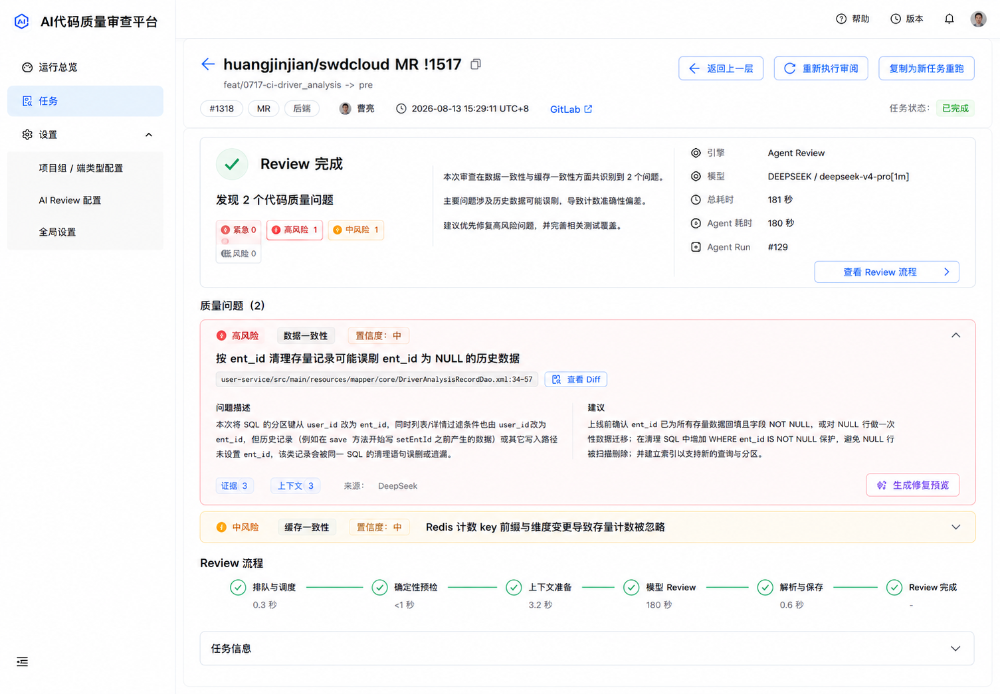

# Review 任务详情 Phase 1 Implementation Plan

## 1. 状态与目标

- 文档状态：Phase 1 已实施、完成本地验证并于 2026-08-14 通过用户人工验收。
- 当前授权：Phase 1 已在 STOP 点完成；用户已明确授权后续进入 Phase 2，不授权部署。
- 目标：将终态任务详情页调整为 Review Result First 信息架构，使用户进入页面后优先获取正式 Review
  结论和最高风险 Finding，同时保持现有多 Review、深链、轮询、状态诊断与安全降级能力。
- 改动量等级：**中**。涉及任务详情头部、终态结果编排、Finding 展开状态、六阶段 Journey、响应式和多类
  终态回归，但不修改 Backend、公开接口、数据库或 Review 结果结构。
- 后续计划：`Review任务详情Phase2安全Trace实施计划.md` 已单独创建；该文档的存在不代表 Phase 2 已获得实施授权。

## 2. 不可破坏交互契约

### 2.1 Finding 原始索引

- `findings` 保持服务端正式 Review Card 的原始顺序，不调用 `sort()` 改变索引语义。
- 所有写操作、API、缓存、反馈、补证据、修复预览和 Deep Link 永远使用服务端原始 `findingIndex`。
- UI 只计算 `highestRiskOriginalIndex`，不得引入会替代服务端索引的展示索引。
- 风险权重固定为：
  - `CRITICAL = 4`；
  - `HIGH / MAJOR = 3`；
  - `MEDIUM / MINOR = 2`；
  - `LOW = 1`；
  - 缺失或未知值 `= 0`。
- 相同权重取原数组第一项。

### 2.2 Finding 展开状态按 Review 隔离

- 展开状态按 `reviewKey` 保存；历史结果缺失 `reviewKey` 时使用现有稳定 `selectorKey` 作为兼容键。
- 首次进入某个 Review 时：
  1. 先解析当前受支持的 Finding Deep Link；
  2. 深链合法且原始 index 存在时，展开深链目标；
  3. 没有合法深链时，展开 `highestRiskOriginalIndex`；
  4. 没有 Finding 时保持空集合。
- 同一 `reviewKey` 轮询刷新只更新内容，不重置用户手动展开或收起的状态。
- Review 切换后恢复该 Review 自己的展开状态；首次进入新 Review 才执行默认初始化。
- `#fix-preview-{index}` 优先级高于默认最高风险 Finding，并继续使用原始 index。
- 深链在同一 Review 内发生变化时允许补充打开目标项并滚动定位，但不得关闭用户已经展开的其它 Finding。

禁止使用以下语义：

```jsx
useEffect(() => {
  setActiveFindingKeys([highestRiskIndex]);
}, [findings]);
```

### 2.3 Summary 有限高

- 正式摘要只读取 `review.summary`，清理既有 Markdown 展示噪声后渲染。
- 默认固定展示 **3 行**。
- 超过 3 行时显示“展开全文”；展开后显示“收起”。
- 展开状态按当前 Review 保存，轮询不得自动收起；切换 Review 时恢复各自状态。
- `review.summary` 缺失、空白或等于历史占位值 `**Findings**` 时使用确定性回退：
  - 有 Finding：`本次 Review 共发现 N 个代码质量问题。`
  - 零 Finding：`本次 Review 未发现需要报告的代码质量问题。`
- 前端不得根据 Finding 内容生成新的 AI 风格总结。

### 2.4 终态与 fallback

- 终态文案只表达当前数据能够证明的事实，不推断取消位置、失败过程或未记录的子阶段。
- fallback 是执行路径属性，不是 Review 状态；禁止新增 `status === 'FALLBACK'` 判断。
- fallback 只由以下契约识别：

```text
requestedEngine = AGENT
effectiveEngine = STANDARD_FALLBACK
```

- Agent 错误只展示白名单错误码、现有固定安全摘要和有界计数，不渲染异常原文。
- `CANCELLED` 只有在 Journey 存在可靠阶段时才补充阶段；否则只显示取消事实。
- `SKIPPED` 只展示现有安全、面向用户的跳过原因；无法确认时使用固定跳过文案。

## 3. Non-goals

Phase 1 明确不做：

- 不修改 Python Backend、Java Backend、数据库、API 或 schema；
- 不改变 Review Card、Finding 或 Progress 的服务端顺序和语义；
- 不实现 Safe Trace 纵向事件流；
- 不新增全局 Review Trace Drawer；
- 不实现 typed evidence 或 Evidence Chain；
- 不增加 Agent 子阶段精确耗时；
- 不新增或展示敏感 Progress detail；
- 不展示 query、path、arguments、input、output、reasoning、Prompt、源码或 Diff 原文；
- 不修改 Provider、模型、Prompt、预算、Agent 调度、fallback、通知或落库行为；
- 不恢复已暂停的运行态自动沉浸入口；
- 不部署、不执行真实 Agent Review、不产生模型费用；
- 不进入 Phase 2。

## 4. Target Information Architecture

### 4.1 成功终态

```text
Task Header
  -> Review Selector（仅多 Review）
  -> Review Result Summary
  -> Findings
  -> Review Journey（现有六阶段）
  -> Task Metadata（页面内折叠）
  -> Push 审核（仅 Push 任务，保持现有折叠能力）
```

- 成功终态删除当前大型完成 Hero；运行态 Hero 不在 Phase 1 删除或重构。
- Review Result Summary 提供“查看 Review 流程”按钮，只滚动并聚焦下方六阶段区域。
- 不创建全局 Trace Drawer；阶段节点继续打开现有阶段 Drawer。
- Finding 默认展开最高风险原始 index，完整操作能力保持不变。

### 4.2 非成功终态

- `FAILED / CANCELLED / SKIPPED` 先展示相应终态摘要，再展示现有 Journey。
- Findings 只有在当前 Review 确实存在正式结构化结果时才展示；不得用空 Finding 暗示 Review 成功且无风险。
- `Agent -> Standard fallback` 展示最终正式结果，同时显式保留降级身份和 Journey 转交语义。

### 4.3 Task Header 与 Task Metadata

- Header 保留任务标题、分支摘要、任务号、端类型、作者、事件时间、GitLab 跳转和现有操作。
- GitLab 跳转、任务整体状态和任务失败提示保持常驻，不藏入折叠区。
- Profile、模板、触发类型、底层任务状态等次级字段进入页面内“任务信息”折叠区，默认收起。
- 不使用 Drawer 承载 Task Metadata。

### 4.4 冻结的桌面视觉参考



- `01.png` 作为普通 `SUCCESS`、单 Review、有 Finding 场景的桌面视觉基线。
- 图片只约束信息层级、相对密度、区域顺序和整体视觉方向；第 2、5、6、8、9 节的交互、数据、安全、
  响应式和验收契约优先级高于图片。
- 实施时必须修正图片中的两个已知细节，不需要再次生成参考图：
  - `1440px` 下紧急 / 高风险 / 中风险 / 低风险统计保持同一行，不允许“低风险 0”单独换行；
  - 标题左侧返回箭头与右侧“返回上一层”不得形成两个重复可点击入口，只保留一个明确返回操作。
- 图片不证明 Summary 展开/收起、Finding Deep Link、reviewKey 状态隔离、轮询保持、终态分支或移动端行为，
  这些能力继续以计划契约和自动化 / 浏览器验收为准。
- 图片不作为 Phase 2 Safe Trace Drawer 的视觉参考。

## 5. Data Contract Mapping

| 展示内容 | 数据来源 | 缺失行为 |
| --- | --- | --- |
| Review 状态 | `journey.status`，其主来源为当前 `review.status` | 使用现有历史安全回退，不从事件猜测新终态 |
| Review 身份 | `requestedEngine / effectiveEngine` | 沿用 `ReviewJourney` 历史身份规则 |
| fallback | `requestedEngine=AGENT && effectiveEngine=STANDARD_FALLBACK` | 不显示降级标识 |
| 正式摘要 | `review.summary` | 使用第 2.3 节确定性回退 |
| 问题总数 | 当前正式 `review.findings.length` | `0` |
| 风险统计 | `review.findings[].severity` 前端纯函数统计 | 未知等级不丢失；仅在数量大于 0 时补“未分类 N” |
| 默认 Finding | 原始 Findings 中 severity 权重最高项的原始 index | 不展开 |
| 总耗时 | 对 `review.startedAt -> review.finishedAt` 做现有安全时间校验；实现优先复用 `journey.durationMs` | 隐藏，不显示 `0s` |
| Agent 耗时 | `agentRunSummary.durationMs` | 隐藏 |
| 阶段耗时 | 仅现有可靠 `stage.durationMs` | 显示 `-` |
| Provider / model | 当前 Review 的 `provider / model` 或 Journey 安全展示名 | 使用现有占位文案 |
| Agent Run | `agentRunSummary.runId` 或兼容 `review.agentRunId` | 隐藏 |
| 取消阶段 | 当前 Journey 的可靠阶段 | 不补充阶段位置 |
| 失败 / 跳过原因 | 现有固定安全摘要、白名单错误码和安全面向用户原因 | 使用固定通用文案 |

实现不得在 JSX 中散落重复推导。风险统计、最高风险 index、摘要回退、终态展示和安全耗时应进入可单测的
Presentation 纯函数；具体文件名可采用 `frontend/src/reviewResultPresentation.js`。

## 6. Terminal State Matrix

| 场景 | Result Summary | Findings | Journey | 原因与身份 |
| --- | --- | --- | --- | --- |
| `SUCCESS` 且有 Finding | 完成、总数、风险分布、正式摘要 | 展示并默认展开最高风险原始 index | 展示 | 无额外原因 |
| `SUCCESS` 且零 Finding | 完成、零问题确定性摘要 | 展示明确的无问题状态 | 展示 | 不使用“未解析到问题” |
| `FAILED` | `Review 失败` | 仅当前 Review 确有正式结果时展示 | 展示 | 白名单错误码 / 固定安全摘要 |
| `CANCELLED` | `Review 已取消` | 不假设存在 | 展示 | 仅可靠时显示取消阶段 |
| `SKIPPED` | `Review 已跳过` | 通常不展示 | 展示 | 安全、明确的跳过原因 |
| `SUCCESS + STANDARD_FALLBACK` | `Review 完成 · 已降级` | 展示 Standard 最终正式结果 | 展示显式 fallback | `Standard Review 已接管并生成正式结果` |
| Standard `SUCCESS` | `Review 完成` | 按正式结果展示 | 展示 | 不显示 Agent 专属字段 |
| 历史字段缺失 | 历史安全回退 | 仅按现有正式数据展示 | 仅展示可靠阶段 | 不补造身份、阶段或耗时 |
| `QUEUED / RUNNING` | 保持现有运行态布局 | 不显示终态空 Finding | 保持完整 Journey | Phase 1 不重构运行态 |

## 7. Implementation Design

### 7.1 Presentation 纯函数

新增或等价抽取以下可测试能力：

- `severityWeight(severity)`；
- `buildFindingRiskCounts(findings)`；
- `highestRiskOriginalIndex(findings)`；
- `resolveFormalReviewSummary(review, findings)`；
- `buildTerminalReviewResultPresentation(review, journey)`；
- 受控的总耗时 / Agent 耗时可见性判断。

纯函数不得接收原始 Progress detail，也不得产生 AI 风格总结。

### 7.2 Finding 展开状态

- 在 Review 选择层或独立 hook 中维护以稳定 Review key 为键的展开状态注册表。
- 为每个 Review 维护“是否已经完成首次初始化”的独立标记，不能以 `findings` 引用变化作为初始化条件。
- 当前 Hash 解析必须先验证格式、非负整数和数组边界。
- 所有 Finding 操作继续传递原始 index；如引入展示包装对象，结构固定为
  `{ finding, originalIndex }`。
- 同一 Review 的轮询、结果对象替换和 Tabs 重绘不得覆盖用户状态。

### 7.3 Result Summary

- 新增紧凑结果摘要组件，覆盖状态、问题总数、风险分布、3 行 Summary、Review 身份和可靠耗时。
- Summary 展开/收起按钮可键盘操作，具有明确 `aria-expanded` 和关联内容标识。
- “查看 Review 流程”滚动到 Journey 标题并把焦点落到可操作区域；不直接打开阶段 Drawer。
- 成功终态不渲染 `ReviewStatusHero`；运行态继续使用现有 Hero。

### 7.4 Findings 与 Journey 顺序

- 成功终态把 Finding 卡片移动到紧凑结果摘要之后、Journey 之前。
- 保留 Diff、修复预览、中断、补证据、反馈、评估样本及其原始 index。
- Journey 继续使用现有六阶段、阶段 Drawer、告警 Popover、键盘与焦点恢复能力。
- 终态模型子阶段中缺失且不可证明的 `WAITING` 项不显示“已随 Review 完成”；宁可隐藏，不推断成功。

### 7.5 预期文件范围

- `frontend/src/App.jsx`：终态结果编排、任务信息折叠、受控交互状态和组件组合；
- `frontend/src/styles.css`：紧凑结果摘要、3 行 Summary、Finding/Journey 顺序和响应式；
- `frontend/src/reviewResultPresentation.js`（建议新增）：结果页纯函数与安全展示模型；
- `frontend/tests/reviewResultPresentation.test.mjs`（建议新增）：数据与状态纯函数；
- `frontend/tests/reviewJourneyInformationArchitecture.test.mjs`：入口、顺序、安全边界与保留能力；
- 现有 Review Journey / immersive 测试：只在受影响时补回归，不重写运行态能力；
- 本计划文档：实施完成后只回填 Phase 1 实施与验证结果。

不修改 `README.md`，因为项目定位、目录、启动入口和文档路由均未变化。

## 8. Responsive Rules

- `1440px` 桌面：六阶段尽量保持单行，降低终态视觉重量但保留完整可点击区域。
- `601px` 至桌面宽度：沿用现有横向流程容器和安全滚动，不在 Phase 1 引入新的 3×2 语义。
- `<= 600px`：沿用现有单列纵向 Journey，不改成三列或 3×2。
- 长任务标题、长 Provider/model、长 Finding 标题允许换行或截断，并在现有合适位置提供 Tooltip。
- Summary 折叠态固定 3 行；展开态允许页面自然增长。
- 页面不得产生文档级横向滚动；Drawer 和 Diff/Fix Preview 的现有移动端行为保持不变。

## 9. Acceptance Matrix

### 9.1 状态与数据场景

- `SUCCESS + findings`；
- `SUCCESS + zero findings`；
- `FAILED`；
- `SKIPPED`；
- `CANCELLED`；
- `Agent -> Standard fallback`；
- Standard Review；
- multiple `reviewKey`；
- `reviewKey` URL 直达；
- Finding Deep Link；
- `fix-preview` Deep Link；
- 同 Review 轮询保持展开状态；
- Review 切换恢复各自状态；
- 用户手动展开和手动收起；
- 历史结果 / 缺失字段 / 未知 severity；
- 长内容 fixture：长 MR 标题、长模型名、超过 3 行 Summary、长 Finding 标题。

### 9.2 固定首屏验收

在 `1440×1000` viewport、浏览器缩放 `100%`、普通 `SUCCESS` 终态、有 Finding、无额外 fallback / 隔离 /
错误告警的安全 fixture 下，不滚动页面即可看到：

- Review 状态；
- 问题总数；
- 风险分布；
- 正式摘要折叠态（最多 3 行）；
- 默认展开的最高风险 Finding 的标题、位置和问题正文开头。

不要求首屏完整展示 Finding 建议、证据摘要或 Review Journey；不得为了首屏验收压缩其可读性。

### 9.3 响应式与交互验收

- 桌面：`1440×1000`；
- 平板：使用项目现有中间断点验证 Header、Result、Finding 和横向 Journey；
- 手机：`390×844`，Journey 保持单列纵向；
- 键盘：Summary 展开/收起、Review 切换、Journey 跳转和阶段打开可操作；
- reduced-motion、Drawer 焦点恢复和现有 Diff/Fix Preview Modal 不回归。

浏览器验收只使用安全本地 fixture 或现有 mock 响应，不连接真实 Provider，不触发真实 Review。

## 10. Tests and Verification

最小充分验证：

1. 新增 Presentation 纯函数测试，覆盖 severity、默认 index、Summary fallback、fallback 身份、缺失时间和未知字段；
2. 补交互状态测试或可测试状态模型，覆盖首次初始化、深链优先、轮询保持、Review 切换和手动收起；
3. 更新信息架构测试，确认成功终态顺序为 Result -> Findings -> Journey，并确认运行态 Hero 保留；
4. 运行全部前端 Node 测试：

```powershell
node.exe --test frontend/tests/*.test.mjs
```

5. 使用项目脚本执行 production build：

```powershell
powershell.exe -NoProfile -ExecutionPolicy Bypass -File scripts/run-frontend.ps1 build
```

6. 完成第 9 节安全 fixture 的桌面、平板和手机浏览器验收；
7. 执行 `git diff --check`，并审计 Phase 1 未新增原始 Progress detail、自由文本错误或 Finding 索引重排。

## 11. Authorization Boundary and Stop Point

Phase 1 实施授权仅允许修改第 7.5 节所列前端、测试和本计划文档；发现必须修改 Backend、API、schema、
Review Card、Progress 或安全白名单时立即停止并报告，不自行扩展范围。

Phase 1 完成顺序固定为：

```text
实现
  -> 自动化测试
  -> production build
  -> 安全 fixture 回归
  -> 桌面 / 平板 / 手机视觉验收
  -> 深链 + 轮询交互验收
  -> 回填本文件 Phase 1 实施状态与验证结果
  -> STOP
```

未经用户人工确认，不进入 Phase 2 Safe Trace，不创建 `SafeTraceEvent`，不改造阶段 Drawer 为纵向事件流。

## 12. Phase 1 实施与验证结果（2026-08-14）

### 12.1 已实施

- 成功及其它可证明终态已调整为 `Review Result Summary -> Findings -> Review Journey`；运行态继续保留现有 Hero。
- Result Summary 已覆盖终态、问题总数、四档风险统计、正式 Summary 三行折叠、Review 身份、可靠耗时、
  Agent Run 和 Journey 聚焦入口。
- Finding 保持服务端原始顺序与原始 index；最高风险默认展开、Finding / Fix Preview Deep Link、手动展开/
  收起及按 Review key 隔离状态已落地，同 Review 轮询初始化不会重置用户选择。
- `SUCCESS + STANDARD_FALLBACK` 才显示“已降级并生成正式结果”；FAILED fallback 只显示失败事实和白名单错误码。
- 无正式 Review 对象但任务状态可证明为 `FAILED / CANCELLED / SKIPPED` 时，先展示对应终态摘要，不再落回成功式
  空 Finding 文案。
- 任务头部保留任务身份、分支、作者、事件时间、GitLab、整体任务状态和重跑操作；只保留一个返回入口。
- 次级任务元数据移动到 Journey 后的页面内折叠区；Push 审核保持原有条件与位置。
- 桌面、平板和手机响应式已按第 8 节实现，手机 Journey 继续使用单列纵向布局。

### 12.2 自动化验证

- Phase 1 定向测试：`32 / 32` 通过，覆盖 Presentation、风险权重、原始 index、Summary fallback、fallback
  终态、reviewKey 隔离、轮询保持、Deep Link、信息架构、Journey 和运行态兼容。
- Production build：通过。
- `git diff --check`：通过。
- 全量前端测试：`237 / 239` 通过；未通过的 2 项均位于
  `frontend/tests/projectGroupAgentDefaults.test.mjs`，是既有设置页测试对 LF 换行的源码字符串硬编码。
  已用 HEAD 原始 `frontend/src/styles.css` 复核，同样不满足这两个断言；Phase 1 未修改对应设置功能或测试，
  因授权边界未顺手扩展修复。

### 12.3 浏览器验收

- `1440×1000 / 100%`：Review 状态、问题总数、四档风险、正式摘要，以及默认最高风险 Finding 的标题、
  位置和正文开头均在首屏可见；四档风险同排；页面无文档级横向滚动；返回入口唯一。
- 平板 `1024×768`：Header、两列 Result、完整事实区、Finding 与横向 Journey 不产生文档级横向滚动。
- 手机 `390×844`：Result 单列、操作按钮不溢出、风险统计同排、Journey 单列纵向，页面无文档级横向滚动。
- Summary：Enter / Space 可展开和收起，`aria-expanded` 在 `true / false` 间正确切换。
- Journey 跳转：按钮滚动到 Journey，并把焦点落到 Journey section。
- `#fix-preview-1` 直达：首次加载只展开原始 index `1`；同 Review 后续深链会追加目标，不关闭已有展开项。
- 实际安全数据回归：已检查普通成功、有 Finding、零 Finding、SKIPPED、FAILED；FAILED fallback 未渲染异常原文。

### 12.4 STOP

Phase 1 已在“实施、验证、人工验收”全部完成后正式停止。用户已于 2026-08-14 明确授权进入 Phase 2 Safe Trace；
后续改动按独立的 Phase 2 计划及其停止点执行。
